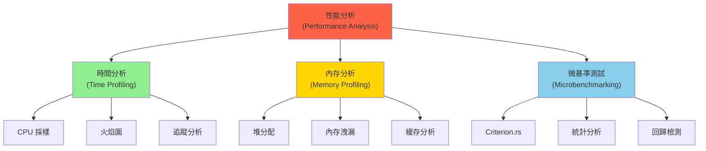
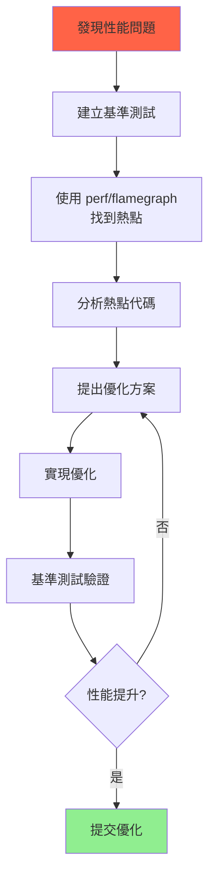

# 性能分析與基準測試 (Performance Profiling & Benchmarking)

## 核心概念

### 性能分析的三個維度



---

## 基準測試 (Benchmarking)

### 1. Criterion.rs - 統計基準測試

**安裝與配置**:

```toml
# Cargo.toml
[dev-dependencies]
criterion = { version = "0.5", features = ["html_reports"] }

[[bench]]
name = "my_benchmark"
harness = false
```

**基本使用**:

```rust
// benches/my_benchmark.rs
use criterion::{black_box, criterion_group, criterion_main, Criterion};

fn fibonacci(n: u64) -> u64 {
    match n {
        0 => 1,
        1 => 1,
        n => fibonacci(n - 1) + fibonacci(n - 2),
    }
}

fn criterion_benchmark(c: &mut Criterion) {
    c.bench_function("fib 20", |b| b.iter(|| fibonacci(black_box(20))));
}

criterion_group!(benches, criterion_benchmark);
criterion_main!(benches);
```

**運行基準測試**:

```bash
cargo bench

# 生成 HTML 報告
open target/criterion/report/index.html
```

### 2. 參數化基準測試

```rust
use criterion::{BenchmarkId, Criterion};

fn bench_sorting(c: &mut Criterion) {
    let mut group = c.benchmark_group("sorting");
    
    for size in [10, 100, 1000, 10000] {
        group.bench_with_input(
            BenchmarkId::new("std_sort", size),
            &size,
            |b, &size| {
                let mut data: Vec<i32> = (0..size).rev().collect();
                b.iter(|| {
                    let mut copy = data.clone();
                    copy.sort();
                    black_box(copy);
                });
            }
        );
        
        group.bench_with_input(
            BenchmarkId::new("unstable_sort", size),
            &size,
            |b, &size| {
                let mut data: Vec<i32> = (0..size).rev().collect();
                b.iter(|| {
                    let mut copy = data.clone();
                    copy.sort_unstable();
                    black_box(copy);
                });
            }
        );
    }
    
    group.finish();
}

criterion_group!(benches, bench_sorting);
criterion_main!(benches);
```

### 3. 對比基準測試

```rust
use criterion::{criterion_group, criterion_main, Criterion};

fn vector_push(c: &mut Criterion) {
    let mut group = c.benchmark_group("vector_operations");
    
    // 不預分配容量
    group.bench_function("push_no_capacity", |b| {
        b.iter(|| {
            let mut v = Vec::new();
            for i in 0..1000 {
                v.push(black_box(i));
            }
            v
        });
    });
    
    // 預分配容量
    group.bench_function("push_with_capacity", |b| {
        b.iter(|| {
            let mut v = Vec::with_capacity(1000);
            for i in 0..1000 {
                v.push(black_box(i));
            }
            v
        });
    });
    
    // 使用 collect
    group.bench_function("collect", |b| {
        b.iter(|| {
            (0..1000).collect::<Vec<_>>()
        });
    });
    
    group.finish();
}

criterion_group!(benches, vector_push);
criterion_main!(benches);
```

### 4. 自定義測量指標

```rust
use criterion::{criterion_group, criterion_main, BenchmarkId, Criterion, Throughput};
use std::time::Duration;

fn bench_throughput(c: &mut Criterion) {
    let mut group = c.benchmark_group("data_processing");
    
    for size in [1024, 4096, 16384, 65536] {
        // 設置吞吐量單位 (字節/秒)
        group.throughput(Throughput::Bytes(size as u64));
        
        group.bench_with_input(
            BenchmarkId::new("process", size),
            &size,
            |b, &size| {
                let data = vec![0u8; size];
                b.iter(|| process_data(black_box(&data)));
            }
        );
    }
    
    group.finish();
}

fn process_data(data: &[u8]) -> u64 {
    data.iter().map(|&x| x as u64).sum()
}

criterion_group!(benches, bench_throughput);
criterion_main!(benches);
```

---

## CPU 性能分析 (CPU Profiling)

### 1. perf (Linux)

**基本使用**:

```bash
# 記錄性能數據
perf record --call-graph dwarf ./target/release/my_program

# 查看報告
perf report

# 生成火焰圖
git clone https://github.com/brendangregg/FlameGraph
perf script | ./FlameGraph/stackcollapse-perf.pl | ./FlameGraph/flamegraph.pl > flame.svg
```

**Rust 集成**:

```toml
# Cargo.toml
[profile.release]
debug = true  # 保留調試符號用於性能分析
```

### 2. cargo-flamegraph

**安裝與使用**:

```bash
# 安裝
cargo install flamegraph

# 生成火焰圖
cargo flamegraph --bin my_program

# 打開生成的 flamegraph.svg
```

**範例代碼**:

```rust
fn main() {
    for _ in 0..1000 {
        expensive_computation();
    }
}

fn expensive_computation() {
    let mut sum = 0u64;
    for i in 0..1_000_000 {
        sum = sum.wrapping_add(fibonacci(i % 20));
    }
    println!("Sum: {}", sum);
}

fn fibonacci(n: u64) -> u64 {
    match n {
        0 | 1 => 1,
        n => fibonacci(n - 1) + fibonacci(n - 2),
    }
}
```

### 3. pprof (跨平台)

**使用 pprof-rs**:

```toml
[dependencies]
pprof = { version = "0.13", features = ["flamegraph", "criterion"] }
```

```rust
use pprof::protos::Message;
use std::fs::File;
use std::io::Write;

fn main() {
    let guard = pprof::ProfilerGuardBuilder::default()
        .frequency(1000)  // 採樣頻率 1000 Hz
        .build()
        .unwrap();
    
    // 運行需要分析的代碼
    expensive_computation();
    
    // 生成報告
    if let Ok(report) = guard.report().build() {
        let mut file = File::create("profile.pb").unwrap();
        let profile = report.pprof().unwrap();
        
        let mut content = Vec::new();
        profile.encode(&mut content).unwrap();
        file.write_all(&content).unwrap();
        
        println!("Profile saved to profile.pb");
        println!("View with: pprof -http=:8080 profile.pb");
    }
}
```

---

## 內存分析 (Memory Profiling)

### 1. DHAT (Heap Analysis Tool)

```toml
[dependencies]
dhat = "0.3"
```

```rust
#[cfg(feature = "dhat-heap")]
#[global_allocator]
static ALLOC: dhat::Alloc = dhat::Alloc;

fn main() {
    #[cfg(feature = "dhat-heap")]
    let _profiler = dhat::Profiler::new_heap();
    
    // 運行代碼
    let mut data = Vec::new();
    for i in 0..10000 {
        data.push(vec![i; 100]);
    }
    
    println!("Allocated {} elements", data.len());
}
```

**運行分析**:

```bash
cargo run --features dhat-heap
# 生成 dhat-heap.json

# 使用 Firefox 打開
firefox https://nnethercote.github.io/dh_view/dh_view.html
# 載入 dhat-heap.json
```

### 2. Valgrind Massif

```bash
# 運行 massif
valgrind --tool=massif ./target/release/my_program

# 查看結果
ms_print massif.out.<pid>
```

### 3. heaptrack (Linux)

```bash
# 安裝
sudo apt install heaptrack

# 分析程序
heaptrack ./target/release/my_program

# 查看 GUI 報告
heaptrack_gui heaptrack.my_program.<pid>.gz
```

---

## 實戰案例

### 案例 1：識別性能瓶頸

```rust
use criterion::{criterion_group, criterion_main, Criterion};

// 原始實現
fn process_v1(data: &[i32]) -> i32 {
    data.iter().map(|&x| x * 2).sum()
}

// 優化版本 1: 使用 fold
fn process_v2(data: &[i32]) -> i32 {
    data.iter().fold(0, |acc, &x| acc + x * 2)
}

// 優化版本 2: 使用 SIMD
#[cfg(target_arch = "x86_64")]
fn process_v3(data: &[i32]) -> i32 {
    use std::arch::x86_64::*;
    
    let mut sum = 0;
    let (prefix, chunks, suffix) = unsafe { data.align_to::<__m128i>() };
    
    // 處理未對齊部分
    sum += prefix.iter().map(|&x| x * 2).sum::<i32>();
    
    // SIMD 處理
    unsafe {
        let multiplier = _mm_set1_epi32(2);
        let mut acc = _mm_setzero_si128();
        
        for chunk in chunks {
            let doubled = _mm_mullo_epi32(*chunk, multiplier);
            acc = _mm_add_epi32(acc, doubled);
        }
        
        // 歸約
        let arr: [i32; 4] = std::mem::transmute(acc);
        sum += arr.iter().sum::<i32>();
    }
    
    sum += suffix.iter().map(|&x| x * 2).sum::<i32>();
    sum
}

fn benchmark(c: &mut Criterion) {
    let data: Vec<i32> = (0..10000).collect();
    
    let mut group = c.benchmark_group("process_versions");
    group.bench_function("v1_iter_map", |b| b.iter(|| process_v1(&data)));
    group.bench_function("v2_fold", |b| b.iter(|| process_v2(&data)));
    
    #[cfg(target_arch = "x86_64")]
    group.bench_function("v3_simd", |b| b.iter(|| process_v3(&data)));
    
    group.finish();
}

criterion_group!(benches, benchmark);
criterion_main!(benches);
```

### 案例 2：內存分配優化

```rust
use criterion::{black_box, criterion_group, criterion_main, Criterion};

// 版本 1: 多次小分配
fn build_string_v1(n: usize) -> String {
    let mut s = String::new();
    for i in 0..n {
        s.push_str(&format!("Item {}, ", i));
    }
    s
}

// 版本 2: 預分配容量
fn build_string_v2(n: usize) -> String {
    let mut s = String::with_capacity(n * 15);  // 估計每項 15 字節
    for i in 0..n {
        use std::fmt::Write;
        write!(s, "Item {}, ", i).unwrap();
    }
    s
}

// 版本 3: 使用 join
fn build_string_v3(n: usize) -> String {
    (0..n)
        .map(|i| format!("Item {}", i))
        .collect::<Vec<_>>()
        .join(", ")
}

fn benchmark(c: &mut Criterion) {
    let mut group = c.benchmark_group("string_building");
    
    for size in [10, 100, 1000] {
        group.bench_with_input(
            format!("v1_no_capacity/{}", size),
            &size,
            |b, &n| b.iter(|| build_string_v1(black_box(n)))
        );
        
        group.bench_with_input(
            format!("v2_with_capacity/{}", size),
            &size,
            |b, &n| b.iter(|| build_string_v2(black_box(n)))
        );
        
        group.bench_with_input(
            format!("v3_join/{}", size),
            &size,
            |b, &n| b.iter(|| build_string_v3(black_box(n)))
        );
    }
    
    group.finish();
}

criterion_group!(benches, benchmark);
criterion_main!(benches);
```

---

## 持續集成基準測試

### 1. GitHub Actions 集成

```yaml
# .github/workflows/benchmark.yml
name: Benchmark

on:
  push:
    branches: [ main ]
  pull_request:

jobs:
  benchmark:
    runs-on: ubuntu-latest
    steps:
      - uses: actions/checkout@v3
      
      - name: Install Rust
        uses: actions-rs/toolchain@v1
        with:
          toolchain: stable
          
      - name: Run benchmarks
        run: cargo bench --no-fail-fast
        
      - name: Store benchmark result
        uses: benchmark-action/github-action-benchmark@v1
        with:
          tool: 'cargo'
          output-file-path: target/criterion/*/new/estimates.json
          github-token: ${{ secrets.GITHUB_TOKEN }}
          auto-push: true
```

### 2. 本地回歸檢測

```bash
# 建立基線
git checkout main
cargo bench --bench my_benchmark -- --save-baseline main

# 測試分支
git checkout feature-branch
cargo bench --bench my_benchmark -- --baseline main

# Criterion 會自動顯示性能變化百分比
```

---

## 最佳實踐

### 1. 基準測試要點

```rust
// ✅ 使用 black_box 防止編譯器優化
b.iter(|| {
    black_box(expensive_function(black_box(input)))
});

// ❌ 不好：結果被優化掉
b.iter(|| {
    expensive_function(input);
});

// ✅ 測量實際工作負載
b.iter(|| {
    let mut data = setup_data();
    process(&mut data);
    black_box(data);
});

// ❌ 不好：包含設置時間
b.iter(|| {
    let mut data = setup_data();  // 應在 iter 外
    process(&mut data);
});
```

### 2. 性能分析流程



### 3. 常見陷阱

```rust
// ❌ 不好：在循環內分配
for _ in 0..1000 {
    let v = vec![0; 100];
    process(&v);
}

// ✅ 好：重用緩衝區
let mut v = vec![0; 100];
for _ in 0..1000 {
    v.fill(0);
    process(&v);
}

// ❌ 不好：不必要的克隆
fn process(data: Vec<i32>) -> i32 {
    data.iter().sum()
}
let result = process(data.clone());

// ✅ 好：使用引用
fn process(data: &[i32]) -> i32 {
    data.iter().sum()
}
let result = process(&data);
```

---

## 參考資料 (References)

1. [Criterion.rs Documentation](https://bheisler.github.io/criterion.rs/book/)
2. [The Rust Performance Book](https://nnethercote.github.io/perf-book/)
3. [Linux perf Examples](https://www.brendangregg.com/perf.html)
4. [Flame Graphs](https://www.brendangregg.com/flamegraphs.html)
5. 《Systems Performance》 (Brendan Gregg, 2020)
