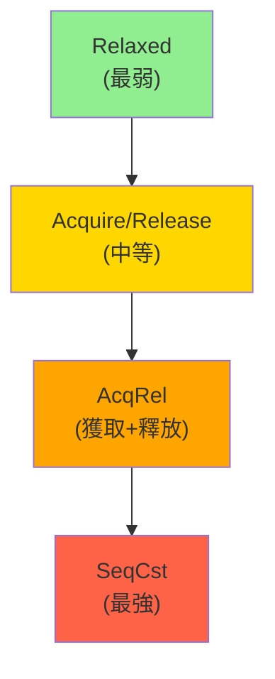

# 原子操作與內存順序 (Atomic Operations & Memory Ordering)

## 核心概念

### 原子性 (Atomicity)

**定義**: 操作在執行時不會被打斷，對其他線程來說，操作要麼未發生，要麼已完成。

**為什麼需要原子操作**:

```rust
use std::thread;

// ❌ 非原子操作 (競爭條件 Race Condition)
static mut COUNTER: i32 = 0;

fn increment_unsafe() {
    for _ in 0..100000 {
        unsafe {
            // 這實際上是三個操作：
            // 1. 載入 COUNTER 到寄存器
            // 2. 寄存器值 +1
            // 3. 寫回 COUNTER
            COUNTER += 1;  // 非原子！
        }
    }
}

fn main() {
    let handles: Vec<_> = (0..10)
        .map(|_| thread::spawn(increment_unsafe))
        .collect();
    
    for h in handles {
        h.join().unwrap();
    }
    
    unsafe {
        println!("COUNTER: {}", COUNTER);  // 預期 1000000，實際可能 < 1000000
    }
}
```

**正確做法**:

```rust
use std::sync::atomic::{AtomicI32, Ordering};
use std::thread;

static COUNTER: AtomicI32 = AtomicI32::new(0);

fn increment_safe() {
    for _ in 0..100000 {
        COUNTER.fetch_add(1, Ordering::Relaxed);  // 原子操作
    }
}

fn main() {
    let handles: Vec<_> = (0..10)
        .map(|_| thread::spawn(increment_safe))
        .collect();
    
    for h in handles {
        h.join().unwrap();
    }
    
    println!("COUNTER: {}", COUNTER.load(Ordering::Relaxed));  // 保證 1000000
}
```

---

## 內存順序 (Memory Ordering)

### 五種內存順序

Rust 提供五種 `std::sync::atomic::Ordering`:



### 1. Relaxed - 無同步保證

**特性**: 只保證原子性，不保證順序

```rust
use std::sync::atomic::{AtomicU64, Ordering};
use std::thread;

static X: AtomicU64 = AtomicU64::new(0);
static Y: AtomicU64 = AtomicU64::new(0);

fn thread1() {
    X.store(1, Ordering::Relaxed);  // A
    Y.store(1, Ordering::Relaxed);  // B
}

fn thread2() {
    let y = Y.load(Ordering::Relaxed);  // C
    let x = X.load(Ordering::Relaxed);  // D
    
    // 可能看到: y=1, x=0 (B 在 A 之前被看到)
    println!("x={}, y={}", x, y);
}

fn main() {
    let h1 = thread::spawn(thread1);
    let h2 = thread::spawn(thread2);
    h1.join().unwrap();
    h2.join().unwrap();
}
```

**適用場景**: 簡單計數器、統計數據

### 2. Acquire / Release - 建立 happens-before 關係

**特性**:
- **Release**: 寫操作，之前的所有內存操作不會被重排到此之後
- **Acquire**: 讀操作，之後的所有內存操作不會被重排到此之前

```rust
use std::sync::atomic::{AtomicBool, AtomicU64, Ordering};
use std::thread;

static DATA: AtomicU64 = AtomicU64::new(0);
static READY: AtomicBool = AtomicBool::new(false);

fn producer() {
    DATA.store(42, Ordering::Relaxed);        // A
    READY.store(true, Ordering::Release);     // B (Release)
    // 保證: A happens-before B
}

fn consumer() {
    while !READY.load(Ordering::Acquire) {    // C (Acquire)
        std::hint::spin_loop();
    }
    let data = DATA.load(Ordering::Relaxed);  // D
    // 保證: C happens-before D
    // 因此: A -> B -> C -> D (保證看到 DATA=42)
    assert_eq!(data, 42);
}

fn main() {
    let h1 = thread::spawn(producer);
    let h2 = thread::spawn(consumer);
    h1.join().unwrap();
    h2.join().unwrap();
}
```

**適用場景**: 生產者-消費者、自旋鎖

### 3. AcqRel - Acquire + Release

**特性**: 同時具備 Acquire 和 Release 語義

```rust
use std::sync::atomic::{AtomicU64, Ordering};

fn fetch_and_modify(atomic: &AtomicU64) -> u64 {
    // AcqRel: 既要看到之前的寫入 (Acquire)，又要讓後續操作看到此寫入 (Release)
    atomic.fetch_add(1, Ordering::AcqRel)
}
```

**適用場景**: 讀-修改-寫 (RMW) 操作

### 4. SeqCst - 順序一致性

**特性**: 最強保證，所有線程看到相同的全局操作順序

```rust
use std::sync::atomic::{AtomicBool, Ordering};
use std::thread;

static X: AtomicBool = AtomicBool::new(false);
static Y: AtomicBool = AtomicBool::new(false);
static Z: AtomicU64 = AtomicU64::new(0);

fn thread1() {
    X.store(true, Ordering::SeqCst);  // A
}

fn thread2() {
    Y.store(true, Ordering::SeqCst);  // B
}

fn thread3() {
    while !X.load(Ordering::SeqCst) {}  // C
    if Y.load(Ordering::SeqCst) {       // D
        Z.fetch_add(1, Ordering::SeqCst);
    }
}

fn thread4() {
    while !Y.load(Ordering::SeqCst) {}  // E
    if X.load(Ordering::SeqCst) {       // F
        Z.fetch_add(1, Ordering::SeqCst);
    }
}

// SeqCst 保證: Z 最終至少為 1
// (如果 A->B，則 thread4 看到; 如果 B->A，則 thread3 看到)
```

**適用場景**: 默認選擇，需要強一致性時

---

## 常用原子類型

### 基本原子類型

```rust
use std::sync::atomic::*;

// 整數類型
let a_i8   = AtomicI8::new(0);
let a_i16  = AtomicI16::new(0);
let a_i32  = AtomicI32::new(0);
let a_i64  = AtomicI64::new(0);
let a_isize = AtomicIsize::new(0);

let a_u8   = AtomicU8::new(0);
let a_u16  = AtomicU16::new(0);
let a_u32  = AtomicU32::new(0);
let a_u64  = AtomicU64::new(0);
let a_usize = AtomicUsize::new(0);

// 布爾類型
let a_bool = AtomicBool::new(false);

// 指針類型
let a_ptr = AtomicPtr::<i32>::new(std::ptr::null_mut());
```

### 常用操作

```rust
use std::sync::atomic::{AtomicU64, Ordering};

let atomic = AtomicU64::new(10);

// 載入
let value = atomic.load(Ordering::Relaxed);

// 存儲
atomic.store(20, Ordering::Relaxed);

// 交換
let old = atomic.swap(30, Ordering::Relaxed);

// 比較並交換 (CAS)
let result = atomic.compare_exchange(
    30,                     // 期望值
    40,                     // 新值
    Ordering::AcqRel,       // 成功時的順序
    Ordering::Acquire       // 失敗時的順序
);

match result {
    Ok(old) => println!("成功交換，舊值: {}", old),
    Err(current) => println!("失敗，當前值: {}", current),
}

// 比較並交換 (弱版本，可能虛假失敗)
let result = atomic.compare_exchange_weak(
    40, 50,
    Ordering::AcqRel,
    Ordering::Acquire
);

// Fetch-Add/Sub/And/Or/Xor
let old = atomic.fetch_add(5, Ordering::Relaxed);
let old = atomic.fetch_sub(3, Ordering::Relaxed);
let old = atomic.fetch_and(0xFF, Ordering::Relaxed);
let old = atomic.fetch_or(0x01, Ordering::Relaxed);
let old = atomic.fetch_xor(0x0F, Ordering::Relaxed);

// Fetch-Max/Min (Rust 1.45+)
let old = atomic.fetch_max(100, Ordering::Relaxed);
let old = atomic.fetch_min(10, Ordering::Relaxed);
```

---

## 實戰案例

### 案例 1：自旋鎖 (Spinlock)

```rust
use std::sync::atomic::{AtomicBool, Ordering};
use std::cell::UnsafeCell;

pub struct SpinLock<T> {
    locked: AtomicBool,
    data: UnsafeCell<T>,
}

unsafe impl<T: Send> Sync for SpinLock<T> {}

impl<T> SpinLock<T> {
    pub const fn new(data: T) -> Self {
        Self {
            locked: AtomicBool::new(false),
            data: UnsafeCell::new(data),
        }
    }
    
    pub fn lock(&self) -> SpinLockGuard<T> {
        // 使用 compare_exchange 獲取鎖
        while self.locked
            .compare_exchange_weak(
                false,                  // 期望值：未鎖定
                true,                   // 新值：鎖定
                Ordering::Acquire,      // 成功：獲取語義
                Ordering::Relaxed       // 失敗：放鬆
            )
            .is_err()
        {
            // 自旋等待
            while self.locked.load(Ordering::Relaxed) {
                std::hint::spin_loop();  // CPU 提示
            }
        }
        
        SpinLockGuard { lock: self }
    }
}

pub struct SpinLockGuard<'a, T> {
    lock: &'a SpinLock<T>,
}

impl<T> std::ops::Deref for SpinLockGuard<'_, T> {
    type Target = T;
    
    fn deref(&self) -> &T {
        unsafe { &*self.lock.data.get() }
    }
}

impl<T> std::ops::DerefMut for SpinLockGuard<'_, T> {
    fn deref_mut(&mut self) -> &mut T {
        unsafe { &mut *self.lock.data.get() }
    }
}

impl<T> Drop for SpinLockGuard<'_, T> {
    fn drop(&mut self) {
        // 釋放鎖
        self.lock.locked.store(false, Ordering::Release);
    }
}

// 使用範例
fn main() {
    use std::thread;
    
    let lock = SpinLock::new(0);
    let handles: Vec<_> = (0..10)
        .map(|_| {
            thread::spawn(|| {
                for _ in 0..1000 {
                    let mut guard = lock.lock();
                    *guard += 1;
                }
            })
        })
        .collect();
    
    for h in handles {
        h.join().unwrap();
    }
    
    println!("Final value: {}", *lock.lock());  // 10000
}
```

### 案例 2：無鎖棧 (Lock-Free Stack)

```rust
use std::sync::atomic::{AtomicPtr, Ordering};
use std::ptr;

struct Node<T> {
    data: T,
    next: *mut Node<T>,
}

pub struct LockFreeStack<T> {
    head: AtomicPtr<Node<T>>,
}

impl<T> LockFreeStack<T> {
    pub const fn new() -> Self {
        Self {
            head: AtomicPtr::new(ptr::null_mut()),
        }
    }
    
    pub fn push(&self, data: T) {
        let new_node = Box::into_raw(Box::new(Node {
            data,
            next: ptr::null_mut(),
        }));
        
        let mut head = self.head.load(Ordering::Relaxed);
        loop {
            unsafe { (*new_node).next = head; }
            
            match self.head.compare_exchange_weak(
                head,
                new_node,
                Ordering::Release,
                Ordering::Relaxed
            ) {
                Ok(_) => break,
                Err(current) => head = current,  // CAS 失敗，重試
            }
        }
    }
    
    pub fn pop(&self) -> Option<T> {
        let mut head = self.head.load(Ordering::Relaxed);
        loop {
            if head.is_null() {
                return None;
            }
            
            let next = unsafe { (*head).next };
            
            match self.head.compare_exchange_weak(
                head,
                next,
                Ordering::Acquire,
                Ordering::Relaxed
            ) {
                Ok(_) => {
                    let node = unsafe { Box::from_raw(head) };
                    return Some(node.data);
                }
                Err(current) => head = current,
            }
        }
    }
}

impl<T> Drop for LockFreeStack<T> {
    fn drop(&mut self) {
        while self.pop().is_some() {}
    }
}

unsafe impl<T: Send> Send for LockFreeStack<T> {}
unsafe impl<T: Send> Sync for LockFreeStack<T> {}
```

### 案例 3：原子引用計數 (Arc 的簡化實現)

```rust
use std::sync::atomic::{AtomicUsize, Ordering};
use std::ptr::NonNull;

struct ArcInner<T> {
    ref_count: AtomicUsize,
    data: T,
}

pub struct SimpleArc<T> {
    ptr: NonNull<ArcInner<T>>,
}

impl<T> SimpleArc<T> {
    pub fn new(data: T) -> Self {
        let inner = Box::new(ArcInner {
            ref_count: AtomicUsize::new(1),
            data,
        });
        
        Self {
            ptr: NonNull::new(Box::into_raw(inner)).unwrap(),
        }
    }
    
    fn inner(&self) -> &ArcInner<T> {
        unsafe { self.ptr.as_ref() }
    }
}

impl<T> Clone for SimpleArc<T> {
    fn clone(&self) -> Self {
        // 增加引用計數
        self.inner().ref_count.fetch_add(1, Ordering::Relaxed);
        
        Self { ptr: self.ptr }
    }
}

impl<T> Drop for SimpleArc<T> {
    fn drop(&mut self) {
        // 減少引用計數
        if self.inner().ref_count.fetch_sub(1, Ordering::Release) == 1 {
            // 最後一個引用，需要釋放
            std::sync::atomic::fence(Ordering::Acquire);
            unsafe {
                drop(Box::from_raw(self.ptr.as_ptr()));
            }
        }
    }
}

impl<T> std::ops::Deref for SimpleArc<T> {
    type Target = T;
    
    fn deref(&self) -> &T {
        &self.inner().data
    }
}

unsafe impl<T: Send + Sync> Send for SimpleArc<T> {}
unsafe impl<T: Send + Sync> Sync for SimpleArc<T> {}
```

---

## 性能考慮

### 內存順序性能對比

```rust
use criterion::{black_box, criterion_group, criterion_main, Criterion};
use std::sync::atomic::{AtomicU64, Ordering};

fn benchmark_ordering(c: &mut Criterion) {
    let atomic = AtomicU64::new(0);
    
    c.bench_function("relaxed", |b| {
        b.iter(|| atomic.fetch_add(1, Ordering::Relaxed))
    });
    
    c.bench_function("acquire", |b| {
        b.iter(|| atomic.load(Ordering::Acquire))
    });
    
    c.bench_function("release", |b| {
        b.iter(|| atomic.store(black_box(1), Ordering::Release))
    });
    
    c.bench_function("acqrel", |b| {
        b.iter(|| atomic.fetch_add(1, Ordering::AcqRel))
    });
    
    c.bench_function("seqcst", |b| {
        b.iter(|| atomic.fetch_add(1, Ordering::SeqCst))
    });
}

criterion_group!(benches, benchmark_ordering);
criterion_main!(benches);

// 典型結果 (x86_64):
// relaxed: ~1 ns
// acquire: ~1 ns
// release: ~1 ns
// acqrel:  ~1 ns
// seqcst:  ~3 ns (需要內存柵欄)
```

---

## 最佳實踐

### 1. 選擇合適的內存順序

```rust
// ✅ 簡單計數器：Relaxed
static COUNTER: AtomicU64 = AtomicU64::new(0);
COUNTER.fetch_add(1, Ordering::Relaxed);

// ✅ 同步標誌：Acquire/Release
static READY: AtomicBool = AtomicBool::new(false);
READY.store(true, Ordering::Release);
while !READY.load(Ordering::Acquire) {}

// ✅ 需要全局順序：SeqCst
static FLAG1: AtomicBool = AtomicBool::new(false);
static FLAG2: AtomicBool = AtomicBool::new(false);
FLAG1.store(true, Ordering::SeqCst);
FLAG2.store(true, Ordering::SeqCst);
```

### 2. 避免 ABA 問題

```rust
// ❌ ABA 問題範例
// 線程 A: 讀取 head (指向 node1)
// 線程 B: pop node1, pop node2, push node1 (head 又指向 node1)
// 線程 A: CAS 成功 (但 node1 已被重用)

// ✅ 解決方案：使用版本號
struct VersionedPtr<T> {
    ptr: *mut T,
    version: usize,
}

let versioned = AtomicU128::new(pack_versioned_ptr(ptr, 0));

// 或使用 epoch-based reclamation (如 crossbeam-epoch)
```

### 3. 性能提示

```rust
// ✅ 在自旋循環中使用 spin_loop
while locked.load(Ordering::Relaxed) {
    std::hint::spin_loop();  // 告訴 CPU 這是自旋，降低功耗
}

// ✅ 使用 compare_exchange_weak 在循環中
loop {
    match atomic.compare_exchange_weak(old, new, Ordering::AcqRel, Ordering::Acquire) {
        Ok(_) => break,
        Err(current) => old = current,
    }
}
```

---

## 參考資料 (References)

1. [Rust Atomics and Locks](https://marabos.nl/atomics/) (Mara Bos, 2023)
2. [C++ Memory Model](https://en.cppreference.com/w/cpp/atomic/memory_order)
3. [The Rustonomicon - Atomics](https://doc.rust-lang.org/nomicon/atomics.html)
4. [Linux Kernel Memory Barriers](https://www.kernel.org/doc/Documentation/memory-barriers.txt)
5. 《The Art of Multiprocessor Programming》 (Herlihy & Shavit, 2020)
