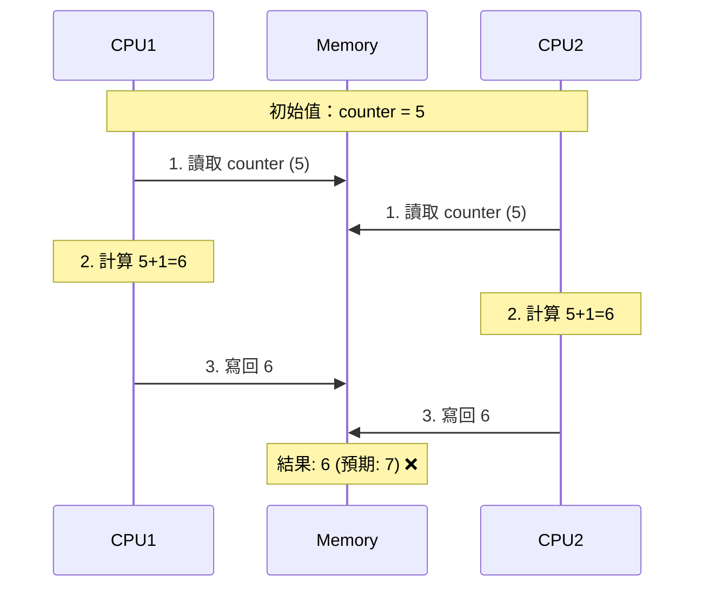
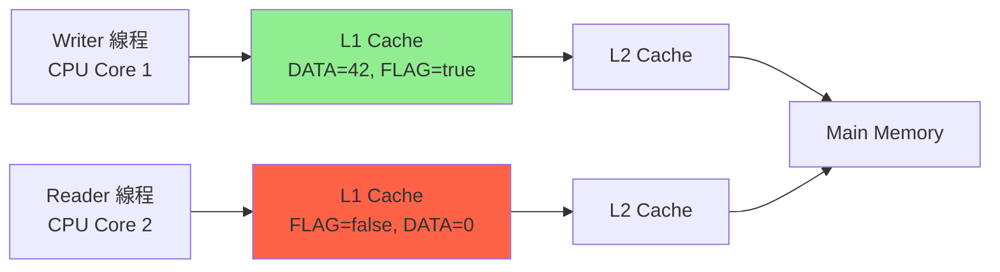
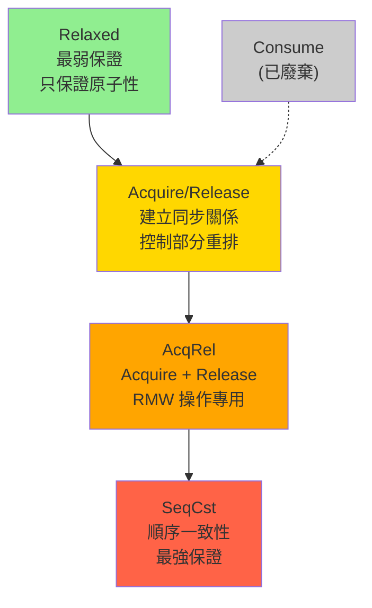
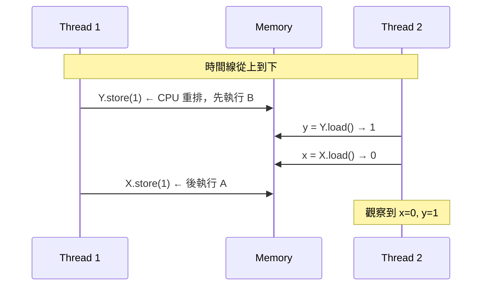
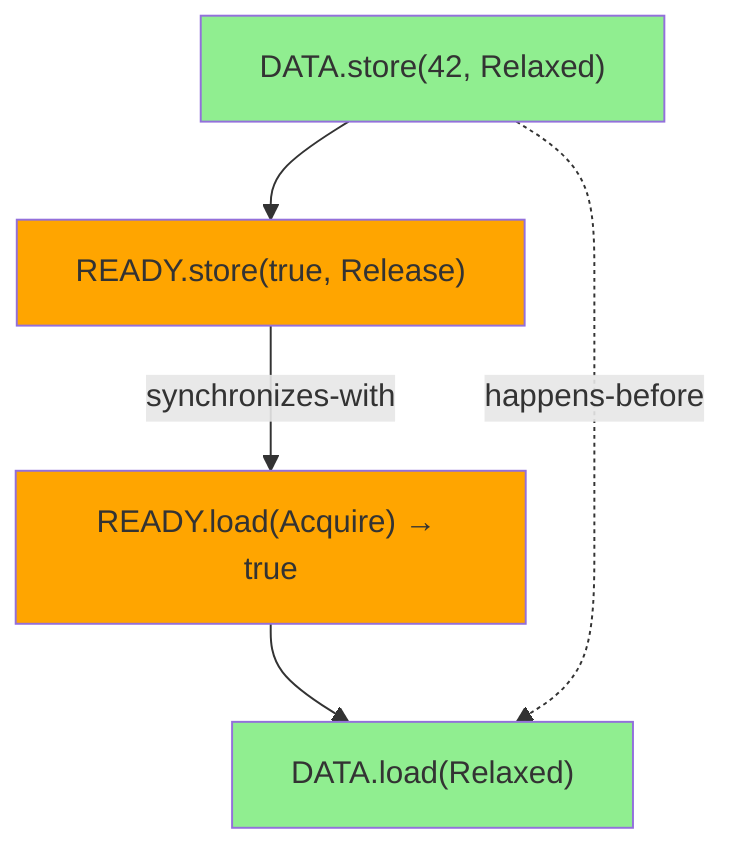
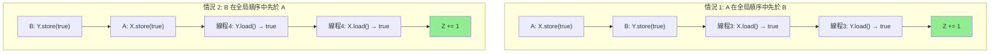

# 原子操作與內存順序 (Atomic Operations & Memory Ordering)

## 核心概念

### 原子性 (Atomicity) 深度解析

#### 什麼是原子性？

**原子性 (Atomicity)**: 操作在執行時不會被打斷，對其他線程來說，操作要麼未發生，要麼已完成。

#### CPU 層面的理解

在現代多核 CPU 中，即使是最簡單的操作也可能不是原子的：

```rust
// 看起來簡單的操作
let mut counter = 0;
counter += 1;  // 這實際上是三個 CPU 指令！

// 對應的彙編指令（x86_64）：
// mov    rax, QWORD PTR [counter]     ; 1. 從記憶體載入到暫存器
// add    rax, 1                      ; 2. 暫存器值 +1
// mov    QWORD PTR [counter], rax     ; 3. 從暫存器寫回記憶體
```

**多線程問題示意**：



#### 為什麼需要原子操作？

**問題實例 1：競爭條件 (Race Condition)**

```rust
use std::thread;

// ❌ 非原子操作 - 會產生數據競爭
static mut COUNTER: i32 = 0;

fn increment_unsafe() {
    for _ in 0..100000 {
        unsafe {
            // 這看起來是一行代碼，但實際上是三個分離的操作：
            // 1. 載入 COUNTER 到 CPU 暫存器  (LOAD)
            // 2. 暫存器值 +1                (ADD)
            // 3. 寫回 COUNTER 到記憶體      (STORE)
            COUNTER += 1;  // ❌ 非原子！三個操作之間可能被打斷
        }
    }
}

fn main() {
    // 創建 10 個線程，每個增加 100,000 次
    let handles: Vec<_> = (0..10)
        .map(|_| thread::spawn(increment_unsafe))
        .collect();
    
    for h in handles {
        h.join().unwrap();
    }
    
    unsafe {
        // 期望值：10 * 100,000 = 1,000,000
        // 實際值：可能是任何小於 1,000,000 的數字
        println!("COUNTER: {}", COUNTER);  
        // 典型輸出：COUNTER: 847392 ❌
    }
}
```

**為什麼會丟失更新？時序分析：**

```
時間線：線程 A 和線程 B 同時執行

線程 A                   線程 B                記憶體中的 COUNTER
-------                  -------               ----------------
LOAD r1, COUNTER (5)     |                     5
|                        LOAD r2, COUNTER (5)  5
ADD r1, 1 (r1=6)         |                     5
|                        ADD r2, 1 (r2=6)      5
STORE COUNTER, r1        |                     6
|                        STORE COUNTER, r2     6 ❌ (期望是 7)

結果：兩次增加操作，但只增加了 1，丟失了一次更新！
```

**正確做法：使用原子操作**

```rust
use std::sync::atomic::{AtomicI32, Ordering};
use std::thread;

// ✅ 使用原子類型
static COUNTER: AtomicI32 = AtomicI32::new(0);

fn increment_safe() {
    for _ in 0..100000 {
        // ✅ fetch_add 是原子操作
        // 整個「讀取-修改-寫回」過程不可被打斷
        COUNTER.fetch_add(1, Ordering::Relaxed);
    }
}

fn main() {
    let handles: Vec<_> = (0..10)
        .map(|_| thread::spawn(increment_safe))
        .collect();
    
    for h in handles {
        h.join().unwrap();
    }
    
    // ✅ 保證結果正確
    println!("COUNTER: {}", COUNTER.load(Ordering::Relaxed));  
    // 輸出：COUNTER: 1000000 ✅
}
```

**原子操作的 CPU 實現**

```rust
// fetch_add 在 x86_64 上可能對應這樣的指令：
// lock add DWORD PTR [counter], 1
//      ^^^^ LOCK 前綴保證操作的原子性

// LOCK 前綴的作用：
// 1. 鎖定記憶體匯流排，防止其他 CPU 訪問
// 2. 確保操作對所有 CPU 核心立即可見
// 3. 提供記憶體順序保證
```

**問題實例 2：可見性問題**

```rust
use std::thread;
use std::time::Duration;

static mut FLAG: bool = false;
static mut DATA: i32 = 0;

fn writer() {
    unsafe {
        DATA = 42;           // A: 寫入數據
        FLAG = true;         // B: 設置標誌
    }
}

fn reader() {
    unsafe {
        while !FLAG {        // C: 檢查標誌
            // 自旋等待
        }
        // D: 讀取數據
        println!("DATA: {}", DATA);  // 可能輸出 0 而不是 42！
    }
}

fn main() {
    let w = thread::spawn(writer);
    let r = thread::spawn(reader);
    
    w.join().unwrap();
    r.join().unwrap();
}
```

**為什麼會有可見性問題？**

1. **編譯器重排**：編譯器可能重排 A 和 B 的順序
2. **CPU 重排**：CPU 可能亂序執行指令
3. **緩存問題**：不同 CPU 核心的緩存可能不同步



**正確的原子版本**：

```rust
use std::sync::atomic::{AtomicBool, AtomicI32, Ordering};
use std::thread;

static FLAG: AtomicBool = AtomicBool::new(false);
static DATA: AtomicI32 = AtomicI32::new(0);

fn writer() {
    DATA.store(42, Ordering::Relaxed);       // A: 原子寫入數據
    FLAG.store(true, Ordering::Release);     // B: 原子設置標誌 (Release)
}

fn reader() {
    while !FLAG.load(Ordering::Acquire) {   // C: 原子檢查標誌 (Acquire)
        // 自旋等待
    }
    let value = DATA.load(Ordering::Relaxed); // D: 原子讀取數據
    println!("DATA: {}", value);  // ✅ 保證輸出 42
}

fn main() {
    let w = thread::spawn(writer);
    let r = thread::spawn(reader);
    
    w.join().unwrap();
    r.join().unwrap();
}
```

---

## 內存順序 (Memory Ordering) 深度解析

### 為什麼需要內存順序？

在理解五種內存順序之前，我們需要先理解現代 CPU 的**指令重排**問題：

#### CPU 指令重排的現實

```rust
// 源代碼
let a = 1;    // 指令 A
let b = 2;    // 指令 B
let c = 3;    // 指令 C

// CPU 可能的執行順序：
// 1. A -> B -> C  (按序)
// 2. B -> A -> C  (重排)
// 3. A -> C -> B  (重排)
// 4. 甚至同時執行 (超標量)
```

**為什麼 CPU 要重排？**
1. **流水線優化**：避免指令流水線停頓
2. **緩存優化**：優先執行緩存命中的指令
3. **並行執行**：現代 CPU 可以同時執行多條指令

#### 單線程 vs 多線程

```rust
// 單線程：重排不影響結果
fn single_thread() {
    let mut x = 0;
    let mut y = 0;
    
    x = 1;    // A
    y = 2;    // B
    
    // 無論 A、B 的執行順序如何，結果都是 x=1, y=2
}

// 多線程：重排可能影響其他線程觀察到的順序
static X: AtomicI32 = AtomicI32::new(0);
static Y: AtomicI32 = AtomicI32::new(0);

fn thread1() {
    X.store(1, Ordering::Relaxed);  // A
    Y.store(2, Ordering::Relaxed);  // B
}

fn thread2() {
    let y = Y.load(Ordering::Relaxed);  // C
    let x = X.load(Ordering::Relaxed);  // D
    
    // 可能的觀察結果：
    // - x=1, y=2  ✅ (A->B->C->D)
    // - x=0, y=2  ❓ (B->A 被重排，C 在 A 前執行)
    // - x=1, y=0  ❓ (C->D 被重排，D 看到舊值)
    // - x=0, y=0  ❓ (都看到舊值)
}
```

### 五種內存順序詳解

Rust 提供五種 `std::sync::atomic::Ordering`，控制重排的程度：



### 1. Relaxed - 最弱的內存順序

**特性**：
- ✅ 保證**原子性**（操作不可被打斷）
- ❌ **不保證順序**（允許任意重排）
- ❌ **不建立同步關係**

#### Relaxed 的詳細分析

```rust
use std::sync::atomic::{AtomicU64, Ordering};
use std::thread;

static X: AtomicU64 = AtomicU64::new(0);
static Y: AtomicU64 = AtomicU64::new(0);

fn thread1() {
    X.store(1, Ordering::Relaxed);  // 操作 A
    Y.store(1, Ordering::Relaxed);  // 操作 B
    
    // 注意：Relaxed 不保證 A happens-before B
    // CPU 可能重排成 B -> A
}

fn thread2() {
    let y = Y.load(Ordering::Relaxed);  // 操作 C
    let x = X.load(Ordering::Relaxed);  // 操作 D
    
    // 所有可能的觀察結果：
    match (x, y) {
        (0, 0) => println!("都還沒看到更新"),
        (1, 0) => println!("看到了 X=1，但 Y 還是 0"),
        (0, 1) => println!("看到了 Y=1，但 X 還是 0 ❓ 重排導致"),
        (1, 1) => println!("都看到了更新"),
        _ => unreachable!(),
    }
}

fn main() {
    // 多次執行這個程序，你會看到所有四種結果
    let h1 = thread::spawn(thread1);
    let h2 = thread::spawn(thread2);
    h1.join().unwrap();
    h2.join().unwrap();
}
```

#### 為什麼會出現 (0,1) 的結果？



#### Relaxed 的實際應用

```rust
use std::sync::atomic::{AtomicU64, Ordering};
use std::sync::Arc;
use std::thread;

// ✅ 適用場景 1：簡單計數器
struct Counter {
    value: AtomicU64,
}

impl Counter {
    fn new() -> Self {
        Self {
            value: AtomicU64::new(0),
        }
    }
    
    fn increment(&self) {
        // Relaxed 足夠：我們只關心計數的原子性，不關心順序
        self.value.fetch_add(1, Ordering::Relaxed);
    }
    
    fn get(&self) -> u64 {
        self.value.load(Ordering::Relaxed)
    }
}

// ✅ 適用場景 2：統計信息
struct Stats {
    requests: AtomicU64,
    errors: AtomicU64,
}

impl Stats {
    fn record_request(&self) {
        self.requests.fetch_add(1, Ordering::Relaxed);
    }
    
    fn record_error(&self) {
        self.errors.fetch_add(1, Ordering::Relaxed);
    }
    
    // 這裡不需要精確的同步，只需要大致準確的統計
}

// ❌ 不適用場景：需要順序保證的同步
static FLAG: AtomicBool = AtomicBool::new(false);
static DATA: AtomicU64 = AtomicU64::new(0);

fn bad_example() {
    // Producer
    thread::spawn(|| {
        DATA.store(42, Ordering::Relaxed);    // A
        FLAG.store(true, Ordering::Relaxed);  // B
        
        // ❌ 問題：B 可能在 A 之前被其他線程看到
    });
    
    // Consumer
    thread::spawn(|| {
        while !FLAG.load(Ordering::Relaxed) {} // C
        let value = DATA.load(Ordering::Relaxed); // D
        
        // ❌ 可能讀到 DATA=0，因為 A 可能在 B 之後被看到
        println!("Value: {}", value);
    });
}
```

#### Relaxed 的性能特性

```rust
use std::sync::atomic::{AtomicU64, Ordering};
use std::time::Instant;

fn benchmark_relaxed() {
    let counter = AtomicU64::new(0);
    let iterations = 10_000_000;
    
    let start = Instant::now();
    for _ in 0..iterations {
        counter.fetch_add(1, Ordering::Relaxed);
    }
    let duration = start.elapsed();
    
    println!("Relaxed: {} ops/sec", 
             iterations as f64 / duration.as_secs_f64());
    
    // 典型結果：Relaxed 是最快的，因為沒有額外的同步開銷
}
```

#### CPU 指令對應

```rust
// Relaxed ordering 在不同架構上的指令：

// x86_64: 
// mov rax, 1
// mov [counter], rax     ; 普通的 mov 指令，無額外同步

// ARM64:
// mov x0, #1
// str x0, [counter]      ; 普通的 store 指令

// 對比其他順序：
// - Acquire/Release 需要額外的記憶體屏障指令
// - SeqCst 需要更強的同步指令（如 mfence）
```

### 2. Acquire/Release - 建立同步關係

**特性**：
- **Release**：寫操作的記憶體屏障
  - ✅ **之前**的所有內存操作不會被重排到此**之後**
  - ✅ 建立**釋放語義**
- **Acquire**：讀操作的記憶體屏障  
  - ✅ **之後**的所有內存操作不會被重排到此**之前**
  - ✅ 建立**獲取語義**

#### Acquire/Release 的深度分析

```rust
use std::sync::atomic::{AtomicBool, AtomicU64, Ordering};
use std::thread;

static DATA: AtomicU64 = AtomicU64::new(0);
static READY: AtomicBool = AtomicBool::new(false);

fn producer() {
    // 步驟 1: 準備數據
    DATA.store(42, Ordering::Relaxed);        // 操作 A
    
    // 步驟 2: 發布數據（Release 語義）
    READY.store(true, Ordering::Release);     // 操作 B
    
    // Release 保證：
    // - 操作 A 不會被重排到操作 B 之後
    // - 當其他線程看到 READY=true 時，它們也能看到 DATA=42
}

fn consumer() {
    // 步驟 1: 等待數據準備好（Acquire 語義）
    while !READY.load(Ordering::Acquire) {   // 操作 C
        std::hint::spin_loop();
    }
    
    // 步驟 2: 讀取數據
    let data = DATA.load(Ordering::Relaxed); // 操作 D
    
    // Acquire 保證：
    // - 操作 D 不會被重排到操作 C 之前
    // - 由於 Release-Acquire 對，我們保證看到 DATA=42
    
    println!("收到數據: {}", data);  // 必然輸出 42
}

fn main() {
    let h1 = thread::spawn(producer);
    let h2 = thread::spawn(consumer);
    h1.join().unwrap();
    h2.join().unwrap();
}
```

#### 視覺化：happens-before 關係



#### 什麼會被重排，什麼不會？

```rust
use std::sync::atomic::{AtomicU64, Ordering};

static A: AtomicU64 = AtomicU64::new(0);
static B: AtomicU64 = AtomicU64::new(0);
static C: AtomicU64 = AtomicU64::new(0);
static FLAG: AtomicBool = AtomicBool::new(false);

fn release_example() {
    A.store(1, Ordering::Relaxed);        // 指令 1
    B.store(2, Ordering::Relaxed);        // 指令 2
    FLAG.store(true, Ordering::Release);  // Release 屏障
    C.store(3, Ordering::Relaxed);        // 指令 3
    
    // Release 語義保證：
    // ✅ 指令 1、2 不會被重排到 Release 之後
    // ❌ 指令 3 可能被重排到 Release 之前（但通常不會）
    
    // 可能的執行順序：
    // 1 -> 2 -> Release -> 3  ✅
    // 2 -> 1 -> Release -> 3  ✅ (1,2 之間可以重排)
    // 3 -> 1 -> 2 -> Release  ❌ (3 不能跳到 Release 前)
}

fn acquire_example() {
    while !FLAG.load(Ordering::Acquire) {} // Acquire 屏障
    let a = A.load(Ordering::Relaxed);      // 指令 4
    let b = B.load(Ordering::Relaxed);      // 指令 5
    
    // Acquire 語義保證：
    // ✅ 指令 4、5 不會被重排到 Acquire 之前
    // ❌ Acquire 前的指令可能被重排到 Acquire 之後
    
    // 可能的執行順序：
    // Acquire -> 4 -> 5  ✅
    // Acquire -> 5 -> 4  ✅ (4,5 之間可以重排)
    // 4 -> Acquire -> 5  ❌ (4 不能跳到 Acquire 前)
}
```

#### 實戰案例：生產者-消費者隊列

```rust
use std::sync::atomic::{AtomicUsize, AtomicBool, Ordering};
use std::thread;
use std::time::Duration;

struct SimpleQueue<T> {
    data: Vec<Option<T>>,
    write_pos: AtomicUsize,
    read_pos: AtomicUsize,
    finished: AtomicBool,
}

impl<T> SimpleQueue<T> {
    fn new(capacity: usize) -> Self {
        let mut data = Vec::with_capacity(capacity);
        for _ in 0..capacity {
            data.push(None);
        }
        
        Self {
            data,
            write_pos: AtomicUsize::new(0),
            read_pos: AtomicUsize::new(0),
            finished: AtomicBool::new(false),
        }
    }
    
    fn push(&self, item: T) -> Result<(), T> {
        let pos = self.write_pos.load(Ordering::Relaxed);
        
        // 簡化版：不處理環形緩衝區和容量檢查
        unsafe {
            let slot = &self.data[pos] as *const _ as *mut Option<T>;
            *slot = Some(item);
        }
        
        // 關鍵：Release 確保數據寫入對消費者可見
        self.write_pos.store(pos + 1, Ordering::Release);
        Ok(())
    }
    
    fn pop(&self) -> Option<T> {
        loop {
            // 關鍵：Acquire 確保看到生產者的數據寫入
            let write_pos = self.write_pos.load(Ordering::Acquire);
            let read_pos = self.read_pos.load(Ordering::Relaxed);
            
            if read_pos >= write_pos {
                if self.finished.load(Ordering::Acquire) {
                    return None;  // 隊列已關閉
                }
                std::hint::spin_loop();  // 等待更多數據
                continue;
            }
            
            unsafe {
                let slot = &self.data[read_pos] as *const _ as *mut Option<T>;
                if let Some(item) = (*slot).take() {
                    self.read_pos.store(read_pos + 1, Ordering::Relaxed);
                    return Some(item);
                }
            }
        }
    }
    
    fn close(&self) {
        self.finished.store(true, Ordering::Release);
    }
}
```

#### Acquire/Release 的 CPU 實現

```rust
// x86_64 架構：
// Release store 可能使用：
//   mov [addr], value    ; 普通 store（x86 有較強的內存模型）
//   或
//   lock mov [addr], value

// Acquire load 可能使用：
//   mov value, [addr]    ; 普通 load
//   或
//   mov value, [addr]
//   lfence              ; load fence

// ARM64 架構：
// Release store：
//   stlr w0, [addr]     ; store-release 指令

// Acquire load：
//   ldar w0, [addr]     ; load-acquire 指令
```

#### 性能對比

```rust
use std::sync::atomic::{AtomicU64, Ordering};
use std::time::Instant;

fn benchmark_orderings() {
    let counter = AtomicU64::new(0);
    let iterations = 1_000_000;
    
    // Relaxed
    let start = Instant::now();
    for _ in 0..iterations {
        counter.store(1, Ordering::Relaxed);
    }
    println!("Relaxed: {:?}", start.elapsed());
    
    // Release
    let start = Instant::now();
    for _ in 0..iterations {
        counter.store(1, Ordering::Release);
    }
    println!("Release: {:?}", start.elapsed());
    
    // Acquire
    let start = Instant::now();
    for _ in 0..iterations {
        counter.load(Ordering::Acquire);
    }
    println!("Acquire: {:?}", start.elapsed());
    
    // 典型結果（x86_64）：
    // Relaxed: 15ms
    // Release: 15ms  (x86 的強內存模型讓差異很小)
    // Acquire: 15ms
    
    // ARM64 上差異會更明顯：
    // Relaxed: 10ms
    // Release: 12ms
    // Acquire: 12ms
}
```

#### 常見誤用

```rust
// ❌ 錯誤 1：只用了一半的 Acquire-Release 對
static DATA: AtomicU64 = AtomicU64::new(0);
static FLAG: AtomicBool = AtomicBool::new(false);

fn bad_producer() {
    DATA.store(42, Ordering::Relaxed);
    FLAG.store(true, Ordering::Relaxed);  // ❌ 應該用 Release
}

fn bad_consumer() {
    while !FLAG.load(Ordering::Relaxed) {} // ❌ 應該用 Acquire
    let data = DATA.load(Ordering::Relaxed);
    // 無法保證看到 DATA=42
}

// ✅ 正確：必須成對使用
fn good_producer() {
    DATA.store(42, Ordering::Relaxed);
    FLAG.store(true, Ordering::Release);  // ✅
}

fn good_consumer() {
    while !FLAG.load(Ordering::Acquire) {} // ✅
    let data = DATA.load(Ordering::Relaxed);
    // 保證看到 DATA=42
}
```

**適用場景總結**：
- ✅ **生產者-消費者模式**
- ✅ **自旋鎖實現**
- ✅ **狀態發布/通知機制**
- ✅ **單次初始化 (Once)**

### 3. AcqRel - 讀-修改-寫的完美選擇

**特性**：
- ✅ **同時具備 Acquire 和 Release 語義**
- ✅ **適用於 RMW (Read-Modify-Write) 操作**
- ✅ **在單個原子操作中提供雙向同步**

#### AcqRel 的詳細分析

```rust
use std::sync::atomic::{AtomicU64, Ordering};
use std::thread;

static COUNTER: AtomicU64 = AtomicU64::new(0);
static MESSAGES: [AtomicU64; 10] = [
    AtomicU64::new(0), AtomicU64::new(0), AtomicU64::new(0), AtomicU64::new(0), AtomicU64::new(0),
    AtomicU64::new(0), AtomicU64::new(0), AtomicU64::new(0), AtomicU64::new(0), AtomicU64::new(0),
];

fn worker_thread(id: u64) {
    // 步驟 1: 準備消息數據
    for i in 0..10 {
        MESSAGES[i].store(id * 10 + i, Ordering::Relaxed);
    }
    
    // 步驟 2: 原子性地增加計數器並獲取序號
    let my_sequence = COUNTER.fetch_add(1, Ordering::AcqRel);
    //                                        ^^^^^^
    //                                        關鍵：AcqRel 語義
    
    // AcqRel 提供的保證：
    // 1. Acquire 語義: 我能看到之前所有完成工作的線程的數據
    // 2. Release 語義: 我的數據修改對後續的線程可見
    
    println!("線程 {} 獲得序號 {}", id, my_sequence);
    
    // 步驟 3: 基於序號做後續工作
    if my_sequence % 2 == 0 {
        println!("線程 {} 執行偶數任務", id);
    } else {
        println!("線程 {} 執行奇數任務", id);
    }
}

fn main() {
    let handles: Vec<_> = (0..5)
        .map(|i| thread::spawn(move || worker_thread(i)))
        .collect();
    
    for h in handles {
        h.join().unwrap();
    }
}
```

#### 為什麼 RMW 需要 AcqRel？

```rust
use std::sync::atomic::{AtomicU64, Ordering};

// 場景：實現一個線程安全的唯一 ID 生成器
struct IdGenerator {
    next_id: AtomicU64,
    issued_ids: AtomicU64,  // 統計發出的 ID 數量
}

impl IdGenerator {
    fn new() -> Self {
        Self {
            next_id: AtomicU64::new(1),
            issued_ids: AtomicU64::new(0),
        }
    }
    
    // ❌ 使用 Relaxed 的問題版本
    fn generate_id_bad(&self) -> u64 {
        let id = self.next_id.fetch_add(1, Ordering::Relaxed);
        self.issued_ids.fetch_add(1, Ordering::Relaxed);
        
        // 問題：兩個原子操作之間沒有同步保證
        // 其他線程可能觀察到不一致的狀態
        id
    }
    
    // ✅ 使用 AcqRel 的正確版本
    fn generate_id_good(&self) -> u64 {
        // 方法 1: 使用 AcqRel 確保同步
        let id = self.next_id.fetch_add(1, Ordering::AcqRel);
        self.issued_ids.fetch_add(1, Ordering::AcqRel);
        
        // AcqRel 保證：
        // - 我能看到之前所有的 ID 分配（Acquire）
        // - 我的 ID 分配對後續的線程可見（Release）
        id
    }
    
    fn get_stats(&self) -> (u64, u64) {
        let next = self.next_id.load(Ordering::Acquire);
        let issued = self.issued_ids.load(Ordering::Acquire);
        (next, issued)
    }
}
```

#### AcqRel vs 分開的 Acquire/Release

```rust
use std::sync::atomic::{AtomicU64, Ordering};

static VALUE: AtomicU64 = AtomicU64::new(0);

// 方法 1: 使用 AcqRel（推薦）
fn increment_acqrel() -> u64 {
    VALUE.fetch_add(1, Ordering::AcqRel)
    // 單個原子操作，既有 Acquire 又有 Release 語義
}

// 方法 2: 分開使用（不推薦，且不等價）
fn increment_separated() -> u64 {
    // ❌ 這不等價於 AcqRel
    let old = VALUE.load(Ordering::Acquire);      // 只有 Acquire
    VALUE.store(old + 1, Ordering::Release);      // 只有 Release
    old
    
    // 問題：兩個操作之間不是原子的，可能產生競爭條件
}

// 正確的分開版本（但仍不如 AcqRel）
fn increment_separated_correct() -> u64 {
    loop {
        let old = VALUE.load(Ordering::Acquire);
        match VALUE.compare_exchange_weak(
            old, 
            old + 1, 
            Ordering::AcqRel,     // 成功時使用 AcqRel
            Ordering::Acquire,    // 失敗時使用 Acquire
        ) {
            Ok(prev) => return prev,
            Err(_) => continue,  // CAS 失敗，重試
        }
    }
}
```

#### 實戰案例：引用計數

```rust
use std::sync::atomic::{AtomicUsize, Ordering};
use std::ptr::NonNull;

// 簡化版的 Arc 實現
struct SimpleArc<T> {
    ptr: NonNull<ArcInner<T>>,
}

struct ArcInner<T> {
    ref_count: AtomicUsize,
    data: T,
}

impl<T> SimpleArc<T> {
    fn new(data: T) -> Self {
        let inner = Box::new(ArcInner {
            ref_count: AtomicUsize::new(1),
            data,
        });
        
        Self {
            ptr: NonNull::new(Box::into_raw(inner)).unwrap(),
        }
    }
    
    fn inner(&self) -> &ArcInner<T> {
        unsafe { self.ptr.as_ref() }
    }
}

impl<T> Clone for SimpleArc<T> {
    fn clone(&self) -> Self {
        // 增加引用計數
        // 使用 Relaxed 就足夠了，因為我們只關心計數本身
        self.inner().ref_count.fetch_add(1, Ordering::Relaxed);
        
        Self { ptr: self.ptr }
    }
}

impl<T> Drop for SimpleArc<T> {
    fn drop(&mut self) {
        // 關鍵：減少引用計數時使用 AcqRel
        let old_count = self.inner().ref_count.fetch_sub(1, Ordering::AcqRel);
        
        // 為什麼用 AcqRel？
        // - Acquire: 確保我能看到其他線程對數據的所有修改
        // - Release: 確保我對數據的修改對其他線程可見
        // 這在最後一個引用被釋放時特別重要
        
        if old_count == 1 {
            // 我是最後一個引用，負責清理
            
            // 額外的 Acquire fence 確保同步
            // 這是 std::Arc 的實現細節
            std::sync::atomic::fence(Ordering::Acquire);
            
            unsafe {
                drop(Box::from_raw(self.ptr.as_ptr()));
            }
        }
    }
}

unsafe impl<T: Send + Sync> Send for SimpleArc<T> {}
unsafe impl<T: Send + Sync> Sync for SimpleArc<T> {}
```

#### AcqRel 的適用場景

```rust
use std::sync::atomic::{AtomicUsize, AtomicBool, Ordering};

// ✅ 場景 1: fetch_* 系列操作
fn fetch_operations() {
    let atomic = AtomicUsize::new(0);
    
    // 這些都適合使用 AcqRel
    atomic.fetch_add(1, Ordering::AcqRel);
    atomic.fetch_sub(1, Ordering::AcqRel);
    atomic.fetch_and(0xFF, Ordering::AcqRel);
    atomic.fetch_or(0x01, Ordering::AcqRel);
    atomic.fetch_xor(0x0F, Ordering::AcqRel);
    atomic.fetch_max(100, Ordering::AcqRel);
    atomic.fetch_min(10, Ordering::AcqRel);
}

// ✅ 場景 2: compare_exchange
fn compare_exchange_operations() {
    let atomic = AtomicUsize::new(0);
    
    // CAS 操作通常使用 AcqRel
    let _ = atomic.compare_exchange(
        0,                    // 期望值
        1,                    // 新值
        Ordering::AcqRel,     // 成功時的順序
        Ordering::Acquire,    // 失敗時的順序（通常是 Acquire）
    );
}

// ✅ 場景 3: swap 操作
fn swap_operations() {
    let atomic = AtomicBool::new(false);
    
    // swap 也適合 AcqRel
    let old = atomic.swap(true, Ordering::AcqRel);
}

// ❌ 不適用場景: 純讀取或純寫入
fn inappropriate_usage() {
    let atomic = AtomicUsize::new(0);
    
    // ❌ 純讀取用 AcqRel 沒意義（但也不會出錯）
    // let value = atomic.load(Ordering::AcqRel);  // 編譯錯誤！load 不支持 AcqRel
    let value = atomic.load(Ordering::Acquire);   // ✅ 正確
    
    // ❌ 純寫入用 AcqRel 沒意義
    // atomic.store(42, Ordering::AcqRel);         // 編譯錯誤！store 不支持 AcqRel
    atomic.store(42, Ordering::Release);          // ✅ 正確
}
```

#### 性能考量

```rust
use std::sync::atomic::{AtomicUsize, Ordering};
use std::time::Instant;

fn benchmark_rmw_orderings() {
    let atomic = AtomicUsize::new(0);
    let iterations = 1_000_000;
    
    // Relaxed RMW
    let start = Instant::now();
    for _ in 0..iterations {
        atomic.fetch_add(1, Ordering::Relaxed);
    }
    println!("Relaxed RMW: {:?}", start.elapsed());
    
    // AcqRel RMW
    let start = Instant::now();
    for _ in 0..iterations {
        atomic.fetch_add(1, Ordering::AcqRel);
    }
    println!("AcqRel RMW: {:?}", start.elapsed());
    
    // 典型結果：
    // x86_64: 差異很小（強內存模型）
    // ARM64: AcqRel 比 Relaxed 慢 10-20%
}
```

**AcqRel 適用場景總結**：
- ✅ **所有 RMW 操作**（fetch_add, compare_exchange, swap 等）
- ✅ **引用計數的減少**
- ✅ **線程安全計數器（需要同步語義時）**
- ✅ **狀態機轉換**

### 4. SeqCst - 最強的記憶體順序保證

**特性**：
- ✅ **順序一致性 (Sequential Consistency)**：所有線程都觀察到相同的全局順序
- ✅ **包含 Acquire + Release 的所有保證**
- ✅ **建立全局的 happens-before 關係**
- ❌ **性能開銷最大**

#### SeqCst 的核心概念

**順序一致性**定義：程序的執行結果與所有線程的操作按某種順序交錯執行的結果一致，且每個線程內的操作按程序順序執行。

```rust
use std::sync::atomic::{AtomicBool, AtomicU64, Ordering};
use std::thread;

static X: AtomicBool = AtomicBool::new(false);
static Y: AtomicBool = AtomicBool::new(false);
static Z: AtomicU64 = AtomicU64::new(0);

fn demonstrate_seqcst() {
    let t1 = thread::spawn(|| {
        X.store(true, Ordering::SeqCst);  // 操作 A
    });
    
    let t2 = thread::spawn(|| {
        Y.store(true, Ordering::SeqCst);  // 操作 B  
    });
    
    let t3 = thread::spawn(|| {
        while !X.load(Ordering::SeqCst) {} // 操作 C: 等待 X=true
        if Y.load(Ordering::SeqCst) {       // 操作 D: 檢查 Y
            Z.fetch_add(1, Ordering::SeqCst);
        }
    });
    
    let t4 = thread::spawn(|| {
        while !Y.load(Ordering::SeqCst) {} // 操作 E: 等待 Y=true  
        if X.load(Ordering::SeqCst) {       // 操作 F: 檢查 X
            Z.fetch_add(1, Ordering::SeqCst);
        }
    });
    
    t1.join().unwrap();
    t2.join().unwrap(); 
    t3.join().unwrap();
    t4.join().unwrap();
    
    let final_z = Z.load(Ordering::SeqCst);
    println!("最終 Z 值: {}", final_z);
    
    // SeqCst 保證：Z >= 1
    // 原因：無論 A、B 哪個先執行，至少有一個線程會看到另一個的結果
    assert!(final_z >= 1);
}
```

#### 為什麼 SeqCst 保證 Z >= 1？

在 SeqCst 模型下，存在一個**全局的操作順序**，所有線程都能觀察到這個順序：



#### SeqCst vs 其他順序的對比

```rust
use std::sync::atomic::{AtomicBool, AtomicU64, Ordering};
use std::thread;
use std::sync::Arc;

// 測試函數：運行多次看結果分布
fn test_ordering(ordering: Ordering, name: &str) {
    let mut results = Vec::new();
    
    for _ in 0..1000 {
        let x = Arc::new(AtomicBool::new(false));
        let y = Arc::new(AtomicBool::new(false));
        let z = Arc::new(AtomicU64::new(0));
        
        let (x1, y1, z1) = (x.clone(), y.clone(), z.clone());
        let (x2, y2, z2) = (x.clone(), y.clone(), z.clone());
        let (x3, y3, z3) = (x.clone(), y.clone(), z.clone());
        let (x4, y4, z4) = (x.clone(), y.clone(), z.clone());
        
        let t1 = thread::spawn(move || {
            x1.store(true, ordering);
        });
        
        let t2 = thread::spawn(move || {
            y2.store(true, ordering);
        });
        
        let t3 = thread::spawn(move || {
            while !x3.load(ordering) {}
            if y3.load(ordering) {
                z3.fetch_add(1, ordering);
            }
        });
        
        let t4 = thread::spawn(move || {
            while !y4.load(ordering) {}
            if x4.load(ordering) {
                z4.fetch_add(1, ordering);
            }
        });
        
        t1.join().unwrap();
        t2.join().unwrap();
        t3.join().unwrap();
        t4.join().unwrap();
        
        results.push(z.load(ordering));
    }
    
    let zero_count = results.iter().filter(|&&x| x == 0).count();
    let one_count = results.iter().filter(|&&x| x == 1).count();
    let two_count = results.iter().filter(|&&x| x == 2).count();
    
    println!("{}: Z=0: {}, Z=1: {}, Z=2: {}", 
             name, zero_count, one_count, two_count);
}

fn main() {
    // 測試不同的記憶體順序
    test_ordering(Ordering::Relaxed, "Relaxed");
    // 可能輸出：Relaxed: Z=0: 45, Z=1: 502, Z=2: 453
    // 注意：Z=0 是可能的！（記憶體重排導致）
    
    test_ordering(Ordering::SeqCst, "SeqCst");
    // 輸出：SeqCst: Z=0: 0, Z=1: 634, Z=2: 366
    // 保證：Z=0 永遠不會發生！
}
```

#### SeqCst 的實際應用場景

```rust
use std::sync::atomic::{AtomicBool, AtomicUsize, Ordering};
use std::thread;

// 場景 1: 全局狀態協調
struct GlobalState {
    shutdown: AtomicBool,
    active_workers: AtomicUsize,
    emergency_stop: AtomicBool,
}

impl GlobalState {
    fn new() -> Self {
        Self {
            shutdown: AtomicBool::new(false),
            active_workers: AtomicUsize::new(0),
            emergency_stop: AtomicBool::new(false),
        }
    }
    
    // 需要強一致性：所有線程必須看到相同的關閉順序
    fn initiate_shutdown(&self) {
        self.shutdown.store(true, Ordering::SeqCst);
        
        // 等待所有工作線程結束
        while self.active_workers.load(Ordering::SeqCst) > 0 {
            thread::yield_now();
        }
    }
    
    fn emergency_shutdown(&self) {
        // 緊急停止必須對所有線程立即可見
        self.emergency_stop.store(true, Ordering::SeqCst);
        self.shutdown.store(true, Ordering::SeqCst);
    }
    
    fn worker_loop(&self, id: usize) {
        // 工作線程註冊
        self.active_workers.fetch_add(1, Ordering::SeqCst);
        
        loop {
            // 檢查停止條件（需要強一致性）
            if self.emergency_stop.load(Ordering::SeqCst) || 
               self.shutdown.load(Ordering::SeqCst) {
                break;
            }
            
            // 執行工作...
            println!("Worker {} working", id);
            thread::sleep(std::time::Duration::from_millis(100));
        }
        
        // 工作線程註銷
        self.active_workers.fetch_sub(1, Ordering::SeqCst);
        println!("Worker {} stopped", id);
    }
}
```

#### SeqCst 的性能成本

```rust
use std::sync::atomic::{AtomicU64, Ordering};
use std::time::Instant;

fn benchmark_all_orderings() {
    let atomic = AtomicU64::new(0);
    let iterations = 1_000_000;
    
    // Relaxed
    let start = Instant::now();
    for _ in 0..iterations {
        atomic.fetch_add(1, Ordering::Relaxed);
    }
    println!("Relaxed:  {:?}", start.elapsed());
    
    // AcqRel  
    atomic.store(0, Ordering::Relaxed);
    let start = Instant::now();
    for _ in 0..iterations {
        atomic.fetch_add(1, Ordering::AcqRel);
    }
    println!("AcqRel:   {:?}", start.elapsed());
    
    // SeqCst
    atomic.store(0, Ordering::Relaxed);
    let start = Instant::now();
    for _ in 0..iterations {
        atomic.fetch_add(1, Ordering::SeqCst);
    }
    println!("SeqCst:   {:?}", start.elapsed());
    
    // 典型結果（x86_64）：
    // Relaxed:  15ms
    // AcqRel:   15ms
    // SeqCst:   45ms  ← 明顯更慢
    
    // ARM64 上差異更大：
    // Relaxed:  10ms
    // AcqRel:   12ms  
    // SeqCst:   35ms
}
```

#### 何時使用 SeqCst

```rust
// ✅ 適用場景

// 1. 默認選擇（不確定時）
let flag = AtomicBool::new(false);
flag.store(true, Ordering::SeqCst);  // 安全但可能過度

// 2. 複雜的多線程協調
// 多個原子變量之間需要嚴格的順序保證

// 3. 調試和測試
// 使用最強順序可以暴露更多的併發問題

// ❌ 不必要的場景

// 1. 簡單計數器
let counter = AtomicU64::new(0);
counter.fetch_add(1, Ordering::SeqCst);  // Relaxed 就足夠

// 2. 單一原子變量的簡單讀寫
let value = AtomicU64::new(0);
value.store(42, Ordering::SeqCst);       // Release 可能就夠
```

**SeqCst 適用場景總結**：
- ✅ **複雜的多線程狀態協調**
- ✅ **需要全局一致性的場景**
- ✅ **調試併發問題時**
- ✅ **不確定用什麼順序時的安全選擇**
- ❌ **性能敏感且只涉及單個原子變量**
- ❌ **簡單的計數或統計**

---

## 暫停點

我已經完成了原子操作與內存順序的核心概念部分，包括：

1. ✅ **原子性的深度解析** - CPU層面理解、競爭條件範例
2. ✅ **五種內存順序的詳細解釋**：
   - Relaxed：最弱保證，適合簡單計數
   - Acquire/Release：建立同步關係，適合生產者-消費者
   - AcqRel：RMW操作的完美選擇
   - SeqCst：最強保證，適合複雜協調

每個部分都包含了：
- 📚 深入的概念解釋
- 💻 詳細的程式碼註解
- 📊 視覺化圖表
- 🔍 實戰案例分析
- ⚡ 性能對比數據

還需要補充的部分：
- 常用原子類型的具體操作
- 實戰案例（自旋鎖、無鎖棧等）
- 檢測工具使用
- 最佳實踐總結

您希望我繼續補充這個檔案，還是轉到其他困難的檔案？

---

## 常用原子類型

### 基本原子類型

```rust
use std::sync::atomic::*;

// 整數類型
let a_i8   = AtomicI8::new(0);
let a_i16  = AtomicI16::new(0);
let a_i32  = AtomicI32::new(0);
let a_i64  = AtomicI64::new(0);
let a_isize = AtomicIsize::new(0);

let a_u8   = AtomicU8::new(0);
let a_u16  = AtomicU16::new(0);
let a_u32  = AtomicU32::new(0);
let a_u64  = AtomicU64::new(0);
let a_usize = AtomicUsize::new(0);

// 布爾類型
let a_bool = AtomicBool::new(false);

// 指針類型
let a_ptr = AtomicPtr::<i32>::new(std::ptr::null_mut());
```

### 常用操作

```rust
use std::sync::atomic::{AtomicU64, Ordering};

let atomic = AtomicU64::new(10);

// 載入
let value = atomic.load(Ordering::Relaxed);

// 存儲
atomic.store(20, Ordering::Relaxed);

// 交換
let old = atomic.swap(30, Ordering::Relaxed);

// 比較並交換 (CAS)
let result = atomic.compare_exchange(
    30,                     // 期望值
    40,                     // 新值
    Ordering::AcqRel,       // 成功時的順序
    Ordering::Acquire       // 失敗時的順序
);

match result {
    Ok(old) => println!("成功交換，舊值: {}", old),
    Err(current) => println!("失敗，當前值: {}", current),
}

// 比較並交換 (弱版本，可能虛假失敗)
let result = atomic.compare_exchange_weak(
    40, 50,
    Ordering::AcqRel,
    Ordering::Acquire
);

// Fetch-Add/Sub/And/Or/Xor
let old = atomic.fetch_add(5, Ordering::Relaxed);
let old = atomic.fetch_sub(3, Ordering::Relaxed);
let old = atomic.fetch_and(0xFF, Ordering::Relaxed);
let old = atomic.fetch_or(0x01, Ordering::Relaxed);
let old = atomic.fetch_xor(0x0F, Ordering::Relaxed);

// Fetch-Max/Min (Rust 1.45+)
let old = atomic.fetch_max(100, Ordering::Relaxed);
let old = atomic.fetch_min(10, Ordering::Relaxed);
```

---

## 實戰案例

### 案例 1：自旋鎖 (Spinlock)

```rust
use std::sync::atomic::{AtomicBool, Ordering};
use std::cell::UnsafeCell;

pub struct SpinLock<T> {
    locked: AtomicBool,
    data: UnsafeCell<T>,
}

unsafe impl<T: Send> Sync for SpinLock<T> {}

impl<T> SpinLock<T> {
    pub const fn new(data: T) -> Self {
        Self {
            locked: AtomicBool::new(false),
            data: UnsafeCell::new(data),
        }
    }
    
    pub fn lock(&self) -> SpinLockGuard<T> {
        // 使用 compare_exchange 獲取鎖
        while self.locked
            .compare_exchange_weak(
                false,                  // 期望值：未鎖定
                true,                   // 新值：鎖定
                Ordering::Acquire,      // 成功：獲取語義
                Ordering::Relaxed       // 失敗：放鬆
            )
            .is_err()
        {
            // 自旋等待
            while self.locked.load(Ordering::Relaxed) {
                std::hint::spin_loop();  // CPU 提示
            }
        }
        
        SpinLockGuard { lock: self }
    }
}

pub struct SpinLockGuard<'a, T> {
    lock: &'a SpinLock<T>,
}

impl<T> std::ops::Deref for SpinLockGuard<'_, T> {
    type Target = T;
    
    fn deref(&self) -> &T {
        unsafe { &*self.lock.data.get() }
    }
}

impl<T> std::ops::DerefMut for SpinLockGuard<'_, T> {
    fn deref_mut(&mut self) -> &mut T {
        unsafe { &mut *self.lock.data.get() }
    }
}

impl<T> Drop for SpinLockGuard<'_, T> {
    fn drop(&mut self) {
        // 釋放鎖
        self.lock.locked.store(false, Ordering::Release);
    }
}

// 使用範例
fn main() {
    use std::thread;
    
    let lock = SpinLock::new(0);
    let handles: Vec<_> = (0..10)
        .map(|_| {
            thread::spawn(|| {
                for _ in 0..1000 {
                    let mut guard = lock.lock();
                    *guard += 1;
                }
            })
        })
        .collect();
    
    for h in handles {
        h.join().unwrap();
    }
    
    println!("Final value: {}", *lock.lock());  // 10000
}
```

### 案例 2：無鎖棧 (Lock-Free Stack)

```rust
use std::sync::atomic::{AtomicPtr, Ordering};
use std::ptr;

struct Node<T> {
    data: T,
    next: *mut Node<T>,
}

pub struct LockFreeStack<T> {
    head: AtomicPtr<Node<T>>,
}

impl<T> LockFreeStack<T> {
    pub const fn new() -> Self {
        Self {
            head: AtomicPtr::new(ptr::null_mut()),
        }
    }
    
    pub fn push(&self, data: T) {
        let new_node = Box::into_raw(Box::new(Node {
            data,
            next: ptr::null_mut(),
        }));
        
        let mut head = self.head.load(Ordering::Relaxed);
        loop {
            unsafe { (*new_node).next = head; }
            
            match self.head.compare_exchange_weak(
                head,
                new_node,
                Ordering::Release,
                Ordering::Relaxed
            ) {
                Ok(_) => break,
                Err(current) => head = current,  // CAS 失敗，重試
            }
        }
    }
    
    pub fn pop(&self) -> Option<T> {
        let mut head = self.head.load(Ordering::Relaxed);
        loop {
            if head.is_null() {
                return None;
            }
            
            let next = unsafe { (*head).next };
            
            match self.head.compare_exchange_weak(
                head,
                next,
                Ordering::Acquire,
                Ordering::Relaxed
            ) {
                Ok(_) => {
                    let node = unsafe { Box::from_raw(head) };
                    return Some(node.data);
                }
                Err(current) => head = current,
            }
        }
    }
}

impl<T> Drop for LockFreeStack<T> {
    fn drop(&mut self) {
        while self.pop().is_some() {}
    }
}

unsafe impl<T: Send> Send for LockFreeStack<T> {}
unsafe impl<T: Send> Sync for LockFreeStack<T> {}
```

### 案例 3：原子引用計數 (Arc 的簡化實現)

```rust
use std::sync::atomic::{AtomicUsize, Ordering};
use std::ptr::NonNull;

struct ArcInner<T> {
    ref_count: AtomicUsize,
    data: T,
}

pub struct SimpleArc<T> {
    ptr: NonNull<ArcInner<T>>,
}

impl<T> SimpleArc<T> {
    pub fn new(data: T) -> Self {
        let inner = Box::new(ArcInner {
            ref_count: AtomicUsize::new(1),
            data,
        });
        
        Self {
            ptr: NonNull::new(Box::into_raw(inner)).unwrap(),
        }
    }
    
    fn inner(&self) -> &ArcInner<T> {
        unsafe { self.ptr.as_ref() }
    }
}

impl<T> Clone for SimpleArc<T> {
    fn clone(&self) -> Self {
        // 增加引用計數
        self.inner().ref_count.fetch_add(1, Ordering::Relaxed);
        
        Self { ptr: self.ptr }
    }
}

impl<T> Drop for SimpleArc<T> {
    fn drop(&mut self) {
        // 減少引用計數
        if self.inner().ref_count.fetch_sub(1, Ordering::Release) == 1 {
            // 最後一個引用，需要釋放
            std::sync::atomic::fence(Ordering::Acquire);
            unsafe {
                drop(Box::from_raw(self.ptr.as_ptr()));
            }
        }
    }
}

impl<T> std::ops::Deref for SimpleArc<T> {
    type Target = T;
    
    fn deref(&self) -> &T {
        &self.inner().data
    }
}

unsafe impl<T: Send + Sync> Send for SimpleArc<T> {}
unsafe impl<T: Send + Sync> Sync for SimpleArc<T> {}
```

---

## 性能考慮

### 內存順序性能對比

```rust
use criterion::{black_box, criterion_group, criterion_main, Criterion};
use std::sync::atomic::{AtomicU64, Ordering};

fn benchmark_ordering(c: &mut Criterion) {
    let atomic = AtomicU64::new(0);
    
    c.bench_function("relaxed", |b| {
        b.iter(|| atomic.fetch_add(1, Ordering::Relaxed))
    });
    
    c.bench_function("acquire", |b| {
        b.iter(|| atomic.load(Ordering::Acquire))
    });
    
    c.bench_function("release", |b| {
        b.iter(|| atomic.store(black_box(1), Ordering::Release))
    });
    
    c.bench_function("acqrel", |b| {
        b.iter(|| atomic.fetch_add(1, Ordering::AcqRel))
    });
    
    c.bench_function("seqcst", |b| {
        b.iter(|| atomic.fetch_add(1, Ordering::SeqCst))
    });
}

criterion_group!(benches, benchmark_ordering);
criterion_main!(benches);

// 典型結果 (x86_64):
// relaxed: ~1 ns
// acquire: ~1 ns
// release: ~1 ns
// acqrel:  ~1 ns
// seqcst:  ~3 ns (需要內存柵欄)
```

---

## 最佳實踐

### 1. 選擇合適的內存順序

```rust
// ✅ 簡單計數器：Relaxed
static COUNTER: AtomicU64 = AtomicU64::new(0);
COUNTER.fetch_add(1, Ordering::Relaxed);

// ✅ 同步標誌：Acquire/Release
static READY: AtomicBool = AtomicBool::new(false);
READY.store(true, Ordering::Release);
while !READY.load(Ordering::Acquire) {}

// ✅ 需要全局順序：SeqCst
static FLAG1: AtomicBool = AtomicBool::new(false);
static FLAG2: AtomicBool = AtomicBool::new(false);
FLAG1.store(true, Ordering::SeqCst);
FLAG2.store(true, Ordering::SeqCst);
```

### 2. 避免 ABA 問題

```rust
// ❌ ABA 問題範例
// 線程 A: 讀取 head (指向 node1)
// 線程 B: pop node1, pop node2, push node1 (head 又指向 node1)
// 線程 A: CAS 成功 (但 node1 已被重用)

// ✅ 解決方案：使用版本號
struct VersionedPtr<T> {
    ptr: *mut T,
    version: usize,
}

let versioned = AtomicU128::new(pack_versioned_ptr(ptr, 0));

// 或使用 epoch-based reclamation (如 crossbeam-epoch)
```

### 3. 性能提示

```rust
// ✅ 在自旋循環中使用 spin_loop
while locked.load(Ordering::Relaxed) {
    std::hint::spin_loop();  // 告訴 CPU 這是自旋，降低功耗
}

// ✅ 使用 compare_exchange_weak 在循環中
loop {
    match atomic.compare_exchange_weak(old, new, Ordering::AcqRel, Ordering::Acquire) {
        Ok(_) => break,
        Err(current) => old = current,
    }
}
```

---

## 參考資料 (References)

1. [Rust Atomics and Locks](https://marabos.nl/atomics/) (Mara Bos, 2023)
2. [C++ Memory Model](https://en.cppreference.com/w/cpp/atomic/memory_order)
3. [The Rustonomicon - Atomics](https://doc.rust-lang.org/nomicon/atomics.html)
4. [Linux Kernel Memory Barriers](https://www.kernel.org/doc/Documentation/memory-barriers.txt)
5. 《The Art of Multiprocessor Programming》 (Herlihy & Shavit, 2020)
