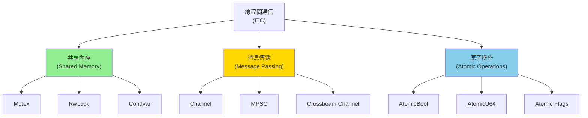

# 線程間通信模式 (Inter-Thread Communication Patterns)

## 核心概念

### 線程間通信的三種範式



---

## 共享內存模式

### 1. Mutex - 互斥鎖

**基本使用**:

```rust
use std::sync::{Arc, Mutex};
use std::thread;

fn main() {
    let counter = Arc::new(Mutex::new(0));
    let mut handles = vec![];
    
    for _ in 0..10 {
        let counter = Arc::clone(&counter);
        let handle = thread::spawn(move || {
            for _ in 0..1000 {
                let mut num = counter.lock().unwrap();
                *num += 1;
            }
        });
        handles.push(handle);
    }
    
    for handle in handles {
        handle.join().unwrap();
    }
    
    println!("Result: {}", *counter.lock().unwrap());  // 10000
}
```

**處理鎖中毒 (Poisoned Lock)**:

```rust
use std::sync::{Arc, Mutex};
use std::thread;

fn main() {
    let data = Arc::new(Mutex::new(vec![1, 2, 3]));
    let data_clone = Arc::clone(&data);
    
    let handle = thread::spawn(move || {
        let mut v = data_clone.lock().unwrap();
        v.push(4);
        panic!("Intentional panic!");  // 鎖被中毒
    });
    
    let _ = handle.join();
    
    // 處理中毒鎖
    match data.lock() {
        Ok(guard) => println!("Data: {:?}", *guard),
        Err(poisoned) => {
            println!("Mutex was poisoned!");
            let guard = poisoned.into_inner();  // 恢復數據
            println!("Recovered data: {:?}", *guard);
        }
    }
}
```

### 2. RwLock - 讀寫鎖

**特性**: 多個讀者或一個寫者

```rust
use std::sync::{Arc, RwLock};
use std::thread;

fn main() {
    let data = Arc::new(RwLock::new(vec![1, 2, 3]));
    
    // 多個讀線程
    let readers: Vec<_> = (0..5)
        .map(|i| {
            let data = Arc::clone(&data);
            thread::spawn(move || {
                let read_guard = data.read().unwrap();
                println!("Reader {} sees: {:?}", i, *read_guard);
            })
        })
        .collect();
    
    // 一個寫線程
    let data_clone = Arc::clone(&data);
    let writer = thread::spawn(move || {
        let mut write_guard = data_clone.write().unwrap();
        write_guard.push(4);
        println!("Writer added 4");
    });
    
    for reader in readers {
        reader.join().unwrap();
    }
    writer.join().unwrap();
    
    println!("Final data: {:?}", *data.read().unwrap());
}
```

**性能對比**:

```rust
use std::sync::{Arc, Mutex, RwLock};
use std::thread;

// Mutex: 讀寫都互斥
fn mutex_heavy_read() {
    let data = Arc::new(Mutex::new(0));
    let readers: Vec<_> = (0..10)
        .map(|_| {
            let data = Arc::clone(&data);
            thread::spawn(move || {
                for _ in 0..10000 {
                    let _ = *data.lock().unwrap();  // 每次讀都阻塞
                }
            })
        })
        .collect();
    
    for r in readers { r.join().unwrap(); }
}

// RwLock: 讀並發，寫互斥
fn rwlock_heavy_read() {
    let data = Arc::new(RwLock::new(0));
    let readers: Vec<_> = (0..10)
        .map(|_| {
            let data = Arc::clone(&data);
            thread::spawn(move || {
                for _ in 0..10000 {
                    let _ = *data.read().unwrap();  // 並發讀取
                }
            })
        })
        .collect();
    
    for r in readers { r.join().unwrap(); }
}

// RwLock 在讀多寫少場景下快 5-10x
```

### 3. Condvar - 條件變量

**經典用法: 生產者-消費者**:

```rust
use std::sync::{Arc, Mutex, Condvar};
use std::thread;
use std::collections::VecDeque;

struct Queue<T> {
    data: Mutex<VecDeque<T>>,
    condvar: Condvar,
}

impl<T> Queue<T> {
    fn new() -> Self {
        Self {
            data: Mutex::new(VecDeque::new()),
            condvar: Condvar::new(),
        }
    }
    
    fn push(&self, item: T) {
        let mut queue = self.data.lock().unwrap();
        queue.push_back(item);
        self.condvar.notify_one();  // 喚醒一個等待的線程
    }
    
    fn pop(&self) -> T {
        let mut queue = self.data.lock().unwrap();
        
        // 等待直到隊列非空
        while queue.is_empty() {
            queue = self.condvar.wait(queue).unwrap();
        }
        
        queue.pop_front().unwrap()
    }
}

fn main() {
    let queue = Arc::new(Queue::new());
    
    // 生產者
    let queue_clone = Arc::clone(&queue);
    let producer = thread::spawn(move || {
        for i in 0..10 {
            queue_clone.push(i);
            println!("Produced: {}", i);
            thread::sleep(std::time::Duration::from_millis(100));
        }
    });
    
    // 消費者
    let queue_clone = Arc::clone(&queue);
    let consumer = thread::spawn(move || {
        for _ in 0..10 {
            let item = queue_clone.pop();
            println!("Consumed: {}", item);
        }
    });
    
    producer.join().unwrap();
    consumer.join().unwrap();
}
```

---

## 消息傳遞模式

### 1. 標準庫 MPSC Channel

**基本使用**:

```rust
use std::sync::mpsc;
use std::thread;

fn main() {
    let (tx, rx) = mpsc::channel();
    
    // 發送者
    thread::spawn(move || {
        let messages = vec!["Hello", "from", "thread"];
        for msg in messages {
            tx.send(msg).unwrap();
        }
    });
    
    // 接收者
    for received in rx {
        println!("Got: {}", received);
    }
}
```

**多生產者單消費者 (MPSC)**:

```rust
use std::sync::mpsc;
use std::thread;

fn main() {
    let (tx, rx) = mpsc::channel();
    
    // 多個發送者
    for i in 0..5 {
        let tx_clone = tx.clone();
        thread::spawn(move || {
            tx_clone.send(format!("Message from thread {}", i)).unwrap();
        });
    }
    
    drop(tx);  // 丟棄原始發送者
    
    // 接收所有消息
    for msg in rx {
        println!("{}", msg);
    }
}
```

**同步 vs 異步通道**:

```rust
use std::sync::mpsc;
use std::thread;
use std::time::Duration;

fn async_channel() {
    let (tx, rx) = mpsc::channel();  // 無界異步通道
    
    thread::spawn(move || {
        for i in 0..100 {
            tx.send(i).unwrap();  // 非阻塞發送
        }
    });
    
    thread::sleep(Duration::from_millis(100));
    for msg in rx { println!("{}", msg); }
}

fn sync_channel() {
    let (tx, rx) = mpsc::sync_channel(5);  // 容量為 5 的同步通道
    
    thread::spawn(move || {
        for i in 0..100 {
            tx.send(i).unwrap();  // 當緩衝區滿時阻塞
            println!("Sent: {}", i);
        }
    });
    
    thread::sleep(Duration::from_millis(100));
    for msg in rx { println!("Received: {}", msg); }
}
```

### 2. Crossbeam Channel (推薦)

**安裝**:

```toml
[dependencies]
crossbeam = "0.8"
```

**無界通道**:

```rust
use crossbeam::channel;
use std::thread;

fn main() {
    let (tx, rx) = channel::unbounded();
    
    // 發送者
    thread::spawn(move || {
        for i in 0..10 {
            tx.send(i).unwrap();
        }
    });
    
    // 接收者
    for msg in rx {
        println!("Received: {}", msg);
    }
}
```

**有界通道**:

```rust
use crossbeam::channel;
use std::thread;

fn main() {
    let (tx, rx) = channel::bounded(5);  // 容量 5
    
    let tx_clone = tx.clone();
    thread::spawn(move || {
        for i in 0..20 {
            tx_clone.send(i).unwrap();  // 當滿時阻塞
            println!("Sent: {}", i);
        }
    });
    
    thread::sleep(std::time::Duration::from_millis(500));
    
    while let Ok(msg) = rx.recv() {
        println!("Received: {}", msg);
        thread::sleep(std::time::Duration::from_millis(100));
    }
}
```

**Select 操作 (多路復用)**:

```rust
use crossbeam::channel;
use std::thread;
use std::time::Duration;

fn main() {
    let (tx1, rx1) = channel::unbounded();
    let (tx2, rx2) = channel::unbounded();
    
    // 生產者 1
    thread::spawn(move || {
        for i in 0..5 {
            tx1.send(format!("A{}", i)).unwrap();
            thread::sleep(Duration::from_millis(100));
        }
    });
    
    // 生產者 2
    thread::spawn(move || {
        for i in 0..5 {
            tx2.send(format!("B{}", i)).unwrap();
            thread::sleep(Duration::from_millis(150));
        }
    });
    
    // 多路復用接收
    loop {
        crossbeam::select! {
            recv(rx1) -> msg => {
                match msg {
                    Ok(m) => println!("From rx1: {}", m),
                    Err(_) => println!("rx1 closed"),
                }
            }
            recv(rx2) -> msg => {
                match msg {
                    Ok(m) => println!("From rx2: {}", m),
                    Err(_) => println!("rx2 closed"),
                }
            }
        }
    }
}
```

---

## 實戰案例

### 案例 1：工作池 (Thread Pool)

```rust
use std::sync::{Arc, Mutex};
use std::sync::mpsc;
use std::thread;

type Job = Box<dyn FnOnce() + Send + 'static>;

struct ThreadPool {
    workers: Vec<Worker>,
    sender: mpsc::Sender<Job>,
}

impl ThreadPool {
    fn new(size: usize) -> Self {
        let (sender, receiver) = mpsc::channel();
        let receiver = Arc::new(Mutex::new(receiver));
        
        let workers = (0..size)
            .map(|id| Worker::new(id, Arc::clone(&receiver)))
            .collect();
        
        Self { workers, sender }
    }
    
    fn execute<F>(&self, f: F)
    where
        F: FnOnce() + Send + 'static,
    {
        let job = Box::new(f);
        self.sender.send(job).unwrap();
    }
}

struct Worker {
    id: usize,
    thread: thread::JoinHandle<()>,
}

impl Worker {
    fn new(id: usize, receiver: Arc<Mutex<mpsc::Receiver<Job>>>) -> Self {
        let thread = thread::spawn(move || loop {
            let job = receiver.lock().unwrap().recv();
            
            match job {
                Ok(job) => {
                    println!("Worker {} executing job", id);
                    job();
                }
                Err(_) => {
                    println!("Worker {} shutting down", id);
                    break;
                }
            }
        });
        
        Self { id, thread }
    }
}

fn main() {
    let pool = ThreadPool::new(4);
    
    for i in 0..10 {
        pool.execute(move || {
            println!("Job {} running", i);
            thread::sleep(std::time::Duration::from_millis(500));
        });
    }
    
    thread::sleep(std::time::Duration::from_secs(5));
}
```

### 案例 2：扇出-扇入模式 (Fan-out Fan-in)

```rust
use crossbeam::channel;
use std::thread;

fn main() {
    let (input_tx, input_rx) = channel::unbounded();
    let (output_tx, output_rx) = channel::unbounded();
    
    // 生產者 (扇出源)
    thread::spawn(move || {
        for i in 0..100 {
            input_tx.send(i).unwrap();
        }
    });
    
    // 扇出: 多個工作線程
    let num_workers = 4;
    let input_rx = input_rx.clone();
    
    for worker_id in 0..num_workers {
        let input_rx = input_rx.clone();
        let output_tx = output_tx.clone();
        
        thread::spawn(move || {
            while let Ok(num) = input_rx.recv() {
                // 模擬計算
                let result = num * num;
                println!("Worker {} computed: {} -> {}", worker_id, num, result);
                output_tx.send(result).unwrap();
            }
        });
    }
    
    drop(output_tx);  // 關閉發送端
    
    // 扇入: 收集結果
    let mut results = Vec::new();
    while let Ok(result) = output_rx.recv() {
        results.push(result);
    }
    
    println!("Total results: {}", results.len());
    println!("Sum: {}", results.iter().sum::<i32>());
}
```

### 案例 3：發布-訂閱模式 (Pub-Sub)

```rust
use crossbeam::channel;
use std::sync::Arc;
use std::thread;

struct PubSub<T> {
    sender: channel::Sender<T>,
}

impl<T: Clone> PubSub<T> {
    fn new() -> Self {
        let (sender, _) = channel::unbounded();
        Self { sender }
    }
    
    fn subscribe(&self) -> channel::Receiver<T> {
        let (tx, rx) = channel::unbounded();
        let main_rx = self.sender.subscribe();
        
        thread::spawn(move || {
            while let Ok(msg) = main_rx.recv() {
                let _ = tx.send(msg);
            }
        });
        
        rx
    }
    
    fn publish(&self, msg: T) {
        let _ = self.sender.send(msg);
    }
}

// 更簡單的實現 (使用廣播)
use std::sync::RwLock;

struct SimplePubSub<T> {
    subscribers: Arc<RwLock<Vec<channel::Sender<T>>>>,
}

impl<T: Clone> SimplePubSub<T> {
    fn new() -> Self {
        Self {
            subscribers: Arc::new(RwLock::new(Vec::new())),
        }
    }
    
    fn subscribe(&self) -> channel::Receiver<T> {
        let (tx, rx) = channel::unbounded();
        self.subscribers.write().unwrap().push(tx);
        rx
    }
    
    fn publish(&self, msg: T) {
        let subscribers = self.subscribers.read().unwrap();
        for sub in subscribers.iter() {
            let _ = sub.send(msg.clone());
        }
    }
}

fn main() {
    let pubsub = Arc::new(SimplePubSub::new());
    
    // 訂閱者 1
    let rx1 = pubsub.subscribe();
    thread::spawn(move || {
        while let Ok(msg) = rx1.recv() {
            println!("Subscriber 1 received: {}", msg);
        }
    });
    
    // 訂閱者 2
    let rx2 = pubsub.subscribe();
    thread::spawn(move || {
        while let Ok(msg) = rx2.recv() {
            println!("Subscriber 2 received: {}", msg);
        }
    });
    
    // 發布者
    for i in 0..5 {
        pubsub.publish(i);
        thread::sleep(std::time::Duration::from_millis(100));
    }
    
    thread::sleep(std::time::Duration::from_secs(1));
}
```

---

## 性能對比

### Mutex vs Channel vs Atomic

```rust
use std::sync::{Arc, Mutex};
use std::sync::atomic::{AtomicU64, Ordering};
use std::time::Instant;
use std::thread;
use crossbeam::channel;

const NUM_THREADS: usize = 4;
const OPERATIONS: usize = 1_000_000;

// 方案 1: Mutex
fn test_mutex() -> u64 {
    let counter = Arc::new(Mutex::new(0u64));
    let start = Instant::now();
    
    let handles: Vec<_> = (0..NUM_THREADS)
        .map(|_| {
            let counter = Arc::clone(&counter);
            thread::spawn(move || {
                for _ in 0..OPERATIONS {
                    *counter.lock().unwrap() += 1;
                }
            })
        })
        .collect();
    
    for h in handles { h.join().unwrap(); }
    
    let elapsed = start.elapsed();
    println!("Mutex: {:?}", elapsed);
    *counter.lock().unwrap()
}

// 方案 2: Channel
fn test_channel() -> u64 {
    let (tx, rx) = channel::unbounded();
    let start = Instant::now();
    
    let handles: Vec<_> = (0..NUM_THREADS)
        .map(|_| {
            let tx = tx.clone();
            thread::spawn(move || {
                for _ in 0..OPERATIONS {
                    tx.send(1u64).unwrap();
                }
            })
        })
        .collect();
    
    drop(tx);
    
    let sum = rx.iter().sum();
    for h in handles { h.join().unwrap(); }
    
    let elapsed = start.elapsed();
    println!("Channel: {:?}", elapsed);
    sum
}

// 方案 3: Atomic
fn test_atomic() -> u64 {
    let counter = Arc::new(AtomicU64::new(0));
    let start = Instant::now();
    
    let handles: Vec<_> = (0..NUM_THREADS)
        .map(|_| {
            let counter = Arc::clone(&counter);
            thread::spawn(move || {
                for _ in 0..OPERATIONS {
                    counter.fetch_add(1, Ordering::Relaxed);
                }
            })
        })
        .collect();
    
    for h in handles { h.join().unwrap(); }
    
    let elapsed = start.elapsed();
    println!("Atomic: {:?}", elapsed);
    counter.load(Ordering::Relaxed)
}

fn main() {
    test_mutex();
    test_channel();
    test_atomic();
}

// 典型結果:
// Atomic:  ~50ms  (最快)
// Mutex:   ~200ms
// Channel: ~500ms
```

---

## 最佳實踐

### 1. 選擇合適的通信機制

```rust
// ✅ 簡單計數器：使用 Atomic
static COUNTER: AtomicU64 = AtomicU64::new(0);

// ✅ 讀多寫少：使用 RwLock
let cache = Arc::new(RwLock::new(HashMap::new()));

// ✅ 任務隊列：使用 Channel
let (tx, rx) = channel::unbounded::<Task>();

// ✅ 複雜狀態同步：使用 Mutex + Condvar
let state = Arc::new((Mutex::new(State::new()), Condvar::new()));
```

### 2. 避免死鎖

```rust
// ❌ 不好：可能死鎖
let lock1 = mutex1.lock().unwrap();
let lock2 = mutex2.lock().unwrap();

// ✅ 好：固定鎖順序
let (lock_a, lock_b) = if &mutex1 as *const _ < &mutex2 as *const _ {
    (mutex1.lock().unwrap(), mutex2.lock().unwrap())
} else {
    (mutex2.lock().unwrap(), mutex1.lock().unwrap())
};

// ✅ 更好：使用 try_lock
match mutex.try_lock() {
    Ok(guard) => { /* 使用 guard */ }
    Err(_) => { /* 處理鎖競爭 */ }
}
```

### 3. 優先使用消息傳遞

```rust
// ❌ 複雜的共享狀態
let state = Arc::new(Mutex::new(ComplexState::new()));

// ✅ 消息傳遞 (更易理解和測試)
enum Command {
    Update(Data),
    Query(oneshot::Sender<Result>),
}

let (tx, rx) = channel::unbounded();
thread::spawn(move || {
    let mut state = ComplexState::new();
    while let Ok(cmd) = rx.recv() {
        match cmd {
            Command::Update(data) => state.update(data),
            Command::Query(reply) => reply.send(state.query()).unwrap(),
        }
    }
});
```

---

## 參考資料 (References)

1. [Rust Atomics and Locks](https://marabos.nl/atomics/) (Mara Bos, 2023)
2. [Crossbeam Documentation](https://docs.rs/crossbeam/latest/crossbeam/)
3. [The Rustonomicon - Concurrency](https://doc.rust-lang.org/nomicon/concurrency.html)
4. 《Concurrent Programming in Rust》 (O'Reilly, 2022)
5. 《The Art of Multiprocessor Programming》 (Herlihy & Shavit, 2020)
