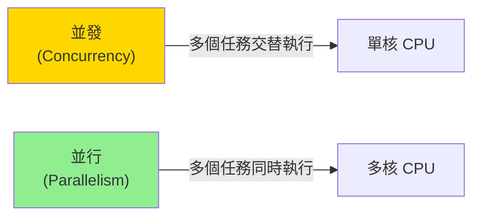

# 並行計算模式 (Parallel Computing Patterns)

## 核心概念

### 並發 vs 並行



**並發 (Concurrency)**: 同時處理多個任務（結構性）  
**並行 (Parallelism)**: 同時執行多個任務（性能性）

---

## 數據並行 (Data Parallelism)

### 1. Rayon - 數據並行庫

**安裝**:

```toml
[dependencies]
rayon = "1.8"
```

**基本使用 - 並行迭代器**:

```rust
use rayon::prelude::*;

fn main() {
    let data: Vec<i32> = (0..1_000_000).collect();
    
    // 順序處理
    let sum: i32 = data.iter().map(|&x| x * 2).sum();
    
    // 並行處理 (只需改為 par_iter)
    let sum: i32 = data.par_iter().map(|&x| x * 2).sum();
    
    println!("Sum: {}", sum);
}
```

**常用並行操作**:

```rust
use rayon::prelude::*;

fn parallel_operations() {
    let data: Vec<i32> = (0..10000).collect();
    
    // 並行 map
    let doubled: Vec<i32> = data.par_iter().map(|&x| x * 2).collect();
    
    // 並行 filter
    let evens: Vec<i32> = data.par_iter().filter(|&&x| x % 2 == 0).copied().collect();
    
    // 並行 fold (每個線程獨立累加，最後合併)
    let sum = data.par_iter().fold(|| 0, |acc, &x| acc + x).sum::<i32>();
    
    // 並行 reduce
    let max = data.par_iter().copied().reduce(|| 0, |a, b| a.max(b));
    
    // 並行 for_each
    data.par_iter().for_each(|&x| {
        // 執行副作用操作
        println!("{}", x);
    });
}
```

**並行排序**:

```rust
use rayon::prelude::*;

fn main() {
    let mut data: Vec<i32> = (0..1_000_000).rev().collect();
    
    // 並行排序 (不穩定)
    data.par_sort_unstable();
    
    // 並行排序 (穩定)
    data.par_sort();
    
    // 自定義比較器
    data.par_sort_by(|a, b| b.cmp(a));  // 降序
    
    println!("First 10: {:?}", &data[..10]);
}
```

### 2. 並行分塊處理

```rust
use rayon::prelude::*;

fn process_chunks(data: &[u8]) -> Vec<u64> {
    data.par_chunks(1024)  // 每塊 1024 字節
        .map(|chunk| {
            // 處理每個塊
            chunk.iter().map(|&x| x as u64).sum()
        })
        .collect()
}

fn main() {
    let data = vec![1u8; 1_000_000];
    let sums = process_chunks(&data);
    println!("Total chunks: {}", sums.len());
}
```

---

## 任務並行 (Task Parallelism)

### 1. Rayon Scope

```rust
use rayon;

fn main() {
    let mut data1 = vec![1, 2, 3, 4, 5];
    let mut data2 = vec![6, 7, 8, 9, 10];
    
    rayon::scope(|s| {
        // 並行執行兩個任務
        s.spawn(|_| {
            process(&mut data1);
        });
        
        s.spawn(|_| {
            process(&mut data2);
        });
    });  // scope 結束時自動等待所有任務完成
    
    println!("Data1: {:?}", data1);
    println!("Data2: {:?}", data2);
}

fn process(data: &mut [i32]) {
    for x in data {
        *x *= 2;
    }
}
```

### 2. Join 模式 (分治法)

```rust
use rayon;

fn parallel_quicksort<T: Ord + Send>(data: &mut [T]) {
    if data.len() <= 1 {
        return;
    }
    
    let pivot_index = partition(data);
    let (left, right) = data.split_at_mut(pivot_index);
    
    // 並行處理左右兩側
    rayon::join(
        || parallel_quicksort(left),
        || parallel_quicksort(right)
    );
}

fn partition<T: Ord>(data: &mut [T]) -> usize {
    let pivot_index = data.len() / 2;
    data.swap(pivot_index, data.len() - 1);
    
    let mut i = 0;
    for j in 0..data.len() - 1 {
        if data[j] <= data[data.len() - 1] {
            data.swap(i, j);
            i += 1;
        }
    }
    data.swap(i, data.len() - 1);
    i
}

fn main() {
    let mut data: Vec<i32> = (0..100000).rev().collect();
    parallel_quicksort(&mut data);
    println!("Sorted: {:?}", &data[..10]);
}
```

---

## 實戰案例

### 案例 1：圖像處理 - 並行模糊濾鏡

```rust
use rayon::prelude::*;

fn gaussian_blur(image: &[u8], width: usize, height: usize) -> Vec<u8> {
    let kernel = [
        [1, 2, 1],
        [2, 4, 2],
        [1, 2, 1],
    ];
    let kernel_sum: i32 = kernel.iter().flat_map(|row| row.iter()).sum();
    
    (0..height).into_par_iter().flat_map(|y| {
        (0..width).map(move |x| {
            let mut sum = 0i32;
            
            for ky in 0..3 {
                for kx in 0..3 {
                    let py = (y as i32 + ky - 1).max(0).min(height as i32 - 1) as usize;
                    let px = (x as i32 + kx - 1).max(0).min(width as i32 - 1) as usize;
                    sum += image[py * width + px] as i32 * kernel[ky as usize][kx as usize];
                }
            }
            
            (sum / kernel_sum) as u8
        })
    }).collect()
}

fn main() {
    let width = 1920;
    let height = 1080;
    let image = vec![128u8; width * height];
    
    let blurred = gaussian_blur(&image, width, height);
    println!("Processed {} pixels", blurred.len());
}
```

### 案例 2：MapReduce 模式

```rust
use rayon::prelude::*;
use std::collections::HashMap;

fn word_count(documents: &[String]) -> HashMap<String, usize> {
    documents
        .par_iter()
        // Map: 每個文檔產生 (word, 1) 對
        .flat_map(|doc| {
            doc.split_whitespace()
                .map(|word| (word.to_lowercase(), 1))
                .collect::<Vec<_>>()
        })
        // Reduce: 合併計數
        .fold(
            || HashMap::new(),
            |mut acc, (word, count)| {
                *acc.entry(word).or_insert(0) += count;
                acc
            }
        )
        .reduce(
            || HashMap::new(),
            |mut acc, map| {
                for (word, count) in map {
                    *acc.entry(word).or_insert(0) += count;
                }
                acc
            }
        )
}

fn main() {
    let documents = vec![
        "hello world".to_string(),
        "hello rust".to_string(),
        "parallel programming in rust".to_string(),
    ];
    
    let counts = word_count(&documents);
    
    for (word, count) in counts.iter() {
        println!("{}: {}", word, count);
    }
}
```

### 案例 3：並行矩陣乘法

```rust
use rayon::prelude::*;

fn parallel_matmul(a: &[f32], b: &[f32], n: usize) -> Vec<f32> {
    let mut c = vec![0.0; n * n];
    
    c.par_chunks_mut(n)
        .enumerate()
        .for_each(|(i, row)| {
            for j in 0..n {
                let mut sum = 0.0;
                for k in 0..n {
                    sum += a[i * n + k] * b[k * n + j];
                }
                row[j] = sum;
            }
        });
    
    c
}

fn main() {
    let n = 512;
    let a: Vec<f32> = (0..n*n).map(|i| i as f32).collect();
    let b: Vec<f32> = (0..n*n).map(|i| (i % n) as f32).collect();
    
    let c = parallel_matmul(&a, &b, n);
    println!("Result[0]: {}", c[0]);
}
```

### 案例 4：並行文件處理

```rust
use rayon::prelude::*;
use std::fs;
use std::path::Path;

fn process_files_parallel(dir: &Path) -> std::io::Result<Vec<(String, usize)>> {
    let entries: Vec<_> = fs::read_dir(dir)?
        .filter_map(|e| e.ok())
        .collect();
    
    let results = entries
        .par_iter()
        .filter_map(|entry| {
            let path = entry.path();
            if path.is_file() {
                fs::read_to_string(&path).ok().map(|content| {
                    let line_count = content.lines().count();
                    (path.display().to_string(), line_count)
                })
            } else {
                None
            }
        })
        .collect();
    
    Ok(results)
}

fn main() -> std::io::Result<()> {
    let results = process_files_parallel(Path::new("."))?;
    
    for (file, lines) in results {
        println!("{}: {} lines", file, lines);
    }
    
    Ok(())
}
```

---

## 線程池配置

### 自定義線程池

```rust
use rayon::ThreadPoolBuilder;

fn main() {
    // 配置全局線程池
    ThreadPoolBuilder::new()
        .num_threads(8)
        .stack_size(2 * 1024 * 1024)  // 2MB 棧
        .thread_name(|i| format!("rayon-worker-{}", i))
        .build_global()
        .unwrap();
    
    // 使用自定義線程池
    let pool = ThreadPoolBuilder::new()
        .num_threads(4)
        .build()
        .unwrap();
    
    let result = pool.install(|| {
        (0..1000).into_par_iter().sum::<i32>()
    });
    
    println!("Result: {}", result);
}
```

---

## 性能優化技巧

### 1. 粒度控制

```rust
use rayon::prelude::*;

fn process_data(data: &[i32]) -> i32 {
    // ❌ 不好：任務粒度太小
    data.par_iter().map(|&x| x * 2).sum()
    
    // ✅ 好：使用 chunks 增加粒度
    data.par_chunks(1000)
        .map(|chunk| chunk.iter().map(|&x| x * 2).sum::<i32>())
        .sum()
}
```

### 2. 避免過度並行

```rust
use rayon::prelude::*;

fn smart_parallel(data: &[i32]) -> i32 {
    const THRESHOLD: usize = 1000;
    
    if data.len() < THRESHOLD {
        // 數據量小，順序處理
        data.iter().sum()
    } else {
        // 數據量大，並行處理
        data.par_iter().sum()
    }
}
```

### 3. 減少分配

```rust
use rayon::prelude::*;

// ❌ 不好：每個線程分配新 Vec
fn bad_collect(data: &[i32]) -> Vec<i32> {
    data.par_iter().map(|&x| x * 2).collect()
}

// ✅ 好：預分配並就地修改
fn good_process(data: &mut [i32]) {
    data.par_iter_mut().for_each(|x| *x *= 2);
}
```

---

## Benchmark 對比

```rust
use criterion::{black_box, criterion_group, criterion_main, Criterion};
use rayon::prelude::*;

fn sequential_sum(data: &[i32]) -> i32 {
    data.iter().sum()
}

fn parallel_sum(data: &[i32]) -> i32 {
    data.par_iter().sum()
}

fn benchmark(c: &mut Criterion) {
    let data: Vec<i32> = (0..1_000_000).collect();
    
    c.bench_function("sequential_sum", |b| {
        b.iter(|| sequential_sum(black_box(&data)))
    });
    
    c.bench_function("parallel_sum", |b| {
        b.iter(|| parallel_sum(black_box(&data)))
    });
}

criterion_group!(benches, benchmark);
criterion_main!(benches);

// 典型結果 (8 核 CPU):
// sequential_sum: ~300 µs
// parallel_sum:   ~50 µs (6x 加速)
```

---

## 最佳實踐

### 1. 何時使用並行

```rust
// ✅ 適合並行：計算密集型
let result = data.par_iter().map(|&x| expensive_computation(x)).sum();

// ❌ 不適合並行：IO 密集型 (使用異步)
// let contents = files.par_iter().map(|f| read_file(f)).collect();

// ✅ 適合並行：大數據集
let sum = (0..10_000_000).into_par_iter().sum::<i64>();

// ❌ 不適合並行：小數據集 (開銷大於收益)
// let sum = (0..100).into_par_iter().sum::<i32>();
```

### 2. 數據競爭檢測

```rust
use rayon::prelude::*;
use std::sync::Mutex;

// ❌ 潛在數據競爭 (編譯錯誤)
// fn bad() {
//     let mut sum = 0;
//     (0..100).into_par_iter().for_each(|x| {
//         sum += x;  // 錯誤：多個線程寫入
//     });
// }

// ✅ 使用 fold + reduce
fn good() -> i32 {
    (0..100).into_par_iter()
        .fold(|| 0, |acc, x| acc + x)
        .sum()
}

// ✅ 使用 Mutex (性能較差)
fn with_mutex() -> i32 {
    let sum = Mutex::new(0);
    (0..100).into_par_iter().for_each(|x| {
        *sum.lock().unwrap() += x;
    });
    sum.into_inner().unwrap()
}
```

### 3. 調試並行代碼

```bash
# 設置線程數
RAYON_NUM_THREADS=1 cargo run  # 單線程運行，便於調試

# 使用 ThreadSanitizer 檢測數據競爭
RUSTFLAGS="-Z sanitizer=thread" cargo +nightly run
```

---

## 參考資料 (References)

1. [Rayon Documentation](https://docs.rs/rayon/latest/rayon/)
2. [The Rayon FAQ](https://github.com/rayon-rs/rayon/blob/master/FAQ.md)
3. [Parallel Programming Patterns](https://patterns.eecs.berkeley.edu/)
4. 《Programming Rust》 (O'Reilly, 2021) - Chapter 19: Concurrency
5. 《Parallel and Concurrent Programming in Haskell》 (Simon Marlow, 2013)
