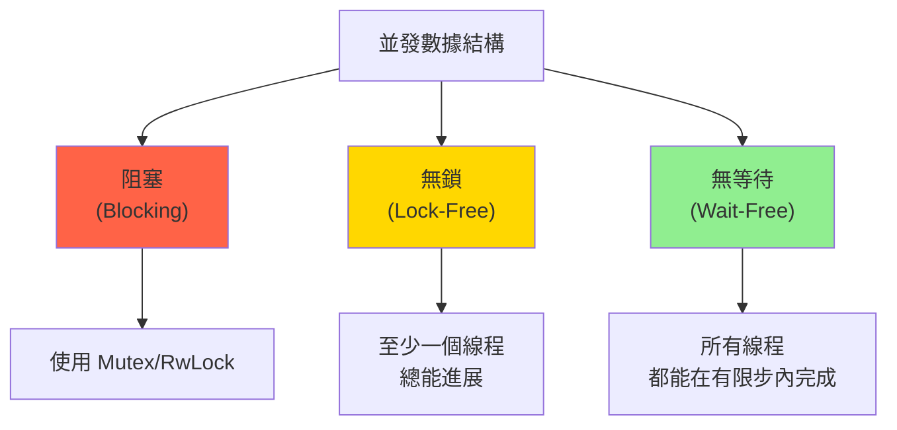

# 無鎖數據結構 (Lock-Free Data Structures)

## 核心概念

### 無鎖編程的三個層級



**定義**:
- **無鎖 (Lock-Free)**: 系統整體總是有進展，即使某些線程被暫停
- **無等待 (Wait-Free)**: 每個線程都保證在有限步內完成操作
- **無阻塞 (Non-Blocking)**: 線程不會因等待鎖而被阻塞

---

## 基礎組件: CAS (Compare-And-Swap)

### CAS 原理

```rust
use std::sync::atomic::{AtomicU64, Ordering};

fn cas_example() {
    let atomic = AtomicU64::new(5);
    
    // CAS 操作
    let result = atomic.compare_exchange(
        5,                      // 期望值
        10,                     // 新值
        Ordering::SeqCst,       // 成功時的內存順序
        Ordering::SeqCst        // 失敗時的內存順序
    );
    
    match result {
        Ok(old_value) => println!("成功更新: {} -> 10", old_value),
        Err(current) => println!("失敗，當前值: {}", current),
    }
}
```

### CAS 循環模式

```rust
use std::sync::atomic::{AtomicU64, Ordering};

fn increment(atomic: &AtomicU64) {
    let mut current = atomic.load(Ordering::Relaxed);
    
    loop {
        let new = current + 1;
        
        match atomic.compare_exchange_weak(
            current,
            new,
            Ordering::Release,
            Ordering::Relaxed
        ) {
            Ok(_) => return,  // 成功
            Err(actual) => current = actual,  // 失敗，更新 current 並重試
        }
    }
}
```

---

## 經典無鎖數據結構

### 1. 無鎖棧 (Treiber Stack)

```rust
use std::sync::atomic::{AtomicPtr, Ordering};
use std::ptr;

struct Node<T> {
    data: T,
    next: *mut Node<T>,
}

pub struct TreiberStack<T> {
    head: AtomicPtr<Node<T>>,
}

impl<T> TreiberStack<T> {
    pub const fn new() -> Self {
        Self {
            head: AtomicPtr::new(ptr::null_mut()),
        }
    }
    
    pub fn push(&self, data: T) {
        let new_node = Box::into_raw(Box::new(Node {
            data,
            next: ptr::null_mut(),
        }));
        
        let mut head = self.head.load(Ordering::Relaxed);
        
        loop {
            // 設置新節點的 next 指針
            unsafe { (*new_node).next = head; }
            
            // CAS 更新 head
            match self.head.compare_exchange_weak(
                head,
                new_node,
                Ordering::Release,
                Ordering::Relaxed
            ) {
                Ok(_) => return,
                Err(current) => head = current,
            }
        }
    }
    
    pub fn pop(&self) -> Option<T> {
        let mut head = self.head.load(Ordering::Acquire);
        
        loop {
            if head.is_null() {
                return None;
            }
            
            let next = unsafe { (*head).next };
            
            // CAS 更新 head
            match self.head.compare_exchange_weak(
                head,
                next,
                Ordering::Release,
                Ordering::Acquire
            ) {
                Ok(_) => {
                    // 成功彈出
                    let node = unsafe { Box::from_raw(head) };
                    return Some(node.data);
                }
                Err(current) => head = current,
            }
        }
    }
}

impl<T> Drop for TreiberStack<T> {
    fn drop(&mut self) {
        while self.pop().is_some() {}
    }
}

unsafe impl<T: Send> Send for TreiberStack<T> {}
unsafe impl<T: Send> Sync for TreiberStack<T> {}

// 使用範例
fn main() {
    use std::thread;
    
    let stack = TreiberStack::new();
    
    let handles: Vec<_> = (0..10)
        .map(|i| {
            thread::spawn(move || {
                stack.push(i);
            })
        })
        .collect();
    
    for h in handles {
        h.join().unwrap();
    }
    
    while let Some(val) = stack.pop() {
        println!("Popped: {}", val);
    }
}
```

### 2. 無鎖隊列 (Michael-Scott Queue)

```rust
use std::sync::atomic::{AtomicPtr, Ordering};
use std::ptr;

struct Node<T> {
    data: Option<T>,
    next: AtomicPtr<Node<T>>,
}

pub struct MSQueue<T> {
    head: AtomicPtr<Node<T>>,
    tail: AtomicPtr<Node<T>>,
}

impl<T> MSQueue<T> {
    pub fn new() -> Self {
        // 創建虛擬節點
        let dummy = Box::into_raw(Box::new(Node {
            data: None,
            next: AtomicPtr::new(ptr::null_mut()),
        }));
        
        Self {
            head: AtomicPtr::new(dummy),
            tail: AtomicPtr::new(dummy),
        }
    }
    
    pub fn enqueue(&self, data: T) {
        let new_node = Box::into_raw(Box::new(Node {
            data: Some(data),
            next: AtomicPtr::new(ptr::null_mut()),
        }));
        
        loop {
            let tail = self.tail.load(Ordering::Acquire);
            let next = unsafe { (*tail).next.load(Ordering::Acquire) };
            
            if tail == self.tail.load(Ordering::Acquire) {
                if next.is_null() {
                    // 嘗試在尾部插入
                    if unsafe { (*tail).next.compare_exchange(
                        ptr::null_mut(),
                        new_node,
                        Ordering::Release,
                        Ordering::Acquire
                    ).is_ok() } {
                        // 成功插入，嘗試更新 tail
                        let _ = self.tail.compare_exchange(
                            tail,
                            new_node,
                            Ordering::Release,
                            Ordering::Acquire
                        );
                        return;
                    }
                } else {
                    // 幫助其他線程推進 tail
                    let _ = self.tail.compare_exchange(
                        tail,
                        next,
                        Ordering::Release,
                        Ordering::Acquire
                    );
                }
            }
        }
    }
    
    pub fn dequeue(&self) -> Option<T> {
        loop {
            let head = self.head.load(Ordering::Acquire);
            let tail = self.tail.load(Ordering::Acquire);
            let next = unsafe { (*head).next.load(Ordering::Acquire) };
            
            if head == self.head.load(Ordering::Acquire) {
                if head == tail {
                    if next.is_null() {
                        return None;  // 隊列為空
                    }
                    
                    // 幫助推進 tail
                    let _ = self.tail.compare_exchange(
                        tail,
                        next,
                        Ordering::Release,
                        Ordering::Acquire
                    );
                } else {
                    // 讀取數據
                    let data = unsafe { (*next).data.take() };
                    
                    // 嘗試推進 head
                    if self.head.compare_exchange(
                        head,
                        next,
                        Ordering::Release,
                        Ordering::Acquire
                    ).is_ok() {
                        unsafe { drop(Box::from_raw(head)); }
                        return data;
                    }
                }
            }
        }
    }
}

unsafe impl<T: Send> Send for MSQueue<T> {}
unsafe impl<T: Send> Sync for MSQueue<T> {}
```

### 3. 無鎖哈希表 (簡化版本)

```rust
use std::sync::atomic::{AtomicU64, AtomicUsize, Ordering};
use std::collections::hash_map::DefaultHasher;
use std::hash::{Hash, Hasher};

const BUCKET_SIZE: usize = 1024;

pub struct LockFreeHashMap<K, V> {
    buckets: Vec<AtomicU64>,
    keys: Vec<Option<K>>,
    values: Vec<Option<V>>,
    size: AtomicUsize,
}

impl<K: Hash + Eq + Clone, V: Clone> LockFreeHashMap<K, V> {
    pub fn new() -> Self {
        Self {
            buckets: (0..BUCKET_SIZE).map(|_| AtomicU64::new(0)).collect(),
            keys: (0..BUCKET_SIZE).map(|_| None).collect(),
            values: (0..BUCKET_SIZE).map(|_| None).collect(),
            size: AtomicUsize::new(0),
        }
    }
    
    fn hash(&self, key: &K) -> u64 {
        let mut hasher = DefaultHasher::new();
        key.hash(&mut hasher);
        hasher.finish()
    }
    
    pub fn insert(&mut self, key: K, value: V) -> bool {
        let hash = self.hash(&key);
        let mut index = (hash as usize) % BUCKET_SIZE;
        
        for _ in 0..BUCKET_SIZE {
            let bucket = self.buckets[index].load(Ordering::Acquire);
            
            if bucket == 0 {
                // 空槽位，嘗試插入
                if self.buckets[index].compare_exchange(
                    0,
                    hash | 1,
                    Ordering::Release,
                    Ordering::Acquire
                ).is_ok() {
                    self.keys[index] = Some(key);
                    self.values[index] = Some(value);
                    self.size.fetch_add(1, Ordering::Relaxed);
                    return true;
                }
            } else if bucket == (hash | 1) {
                // 找到相同鍵，更新值
                self.values[index] = Some(value);
                return true;
            }
            
            index = (index + 1) % BUCKET_SIZE;
        }
        
        false  // 表滿
    }
    
    pub fn get(&self, key: &K) -> Option<V> {
        let hash = self.hash(key);
        let mut index = (hash as usize) % BUCKET_SIZE;
        
        for _ in 0..BUCKET_SIZE {
            let bucket = self.buckets[index].load(Ordering::Acquire);
            
            if bucket == 0 {
                return None;
            }
            
            if bucket == (hash | 1) {
                if let Some(ref k) = self.keys[index] {
                    if k == key {
                        return self.values[index].clone();
                    }
                }
            }
            
            index = (index + 1) % BUCKET_SIZE;
        }
        
        None
    }
}
```

---

## Crossbeam 生態

### 1. crossbeam-epoch - 內存回收

```toml
[dependencies]
crossbeam-epoch = "0.9"
```

```rust
use crossbeam_epoch::{self as epoch, Atomic, Owned};
use std::sync::atomic::Ordering;

struct Node<T> {
    data: T,
    next: Atomic<Node<T>>,
}

pub struct EpochStack<T> {
    head: Atomic<Node<T>>,
}

impl<T> EpochStack<T> {
    pub fn new() -> Self {
        Self {
            head: Atomic::null(),
        }
    }
    
    pub fn push(&self, data: T) {
        let guard = epoch::pin();
        let new_node = Owned::new(Node {
            data,
            next: Atomic::null(),
        });
        
        loop {
            let head = self.head.load(Ordering::Acquire, &guard);
            new_node.next.store(head, Ordering::Relaxed);
            
            match self.head.compare_exchange(
                head,
                new_node,
                Ordering::Release,
                Ordering::Acquire,
                &guard
            ) {
                Ok(_) => return,
                Err(e) => new_node = e.new,
            }
        }
    }
    
    pub fn pop(&self) -> Option<T> {
        let guard = epoch::pin();
        
        loop {
            let head = self.head.load(Ordering::Acquire, &guard);
            
            match unsafe { head.as_ref() } {
                None => return None,
                Some(h) => {
                    let next = h.next.load(Ordering::Acquire, &guard);
                    
                    if self.head.compare_exchange(
                        head,
                        next,
                        Ordering::Release,
                        Ordering::Acquire,
                        &guard
                    ).is_ok() {
                        unsafe {
                            // 延遲回收
                            guard.defer_destroy(head);
                            return Some(std::ptr::read(&h.data));
                        }
                    }
                }
            }
        }
    }
}
```

### 2. crossbeam-queue - 高性能隊列

```toml
[dependencies]
crossbeam-queue = "0.3"
```

```rust
use crossbeam_queue::{ArrayQueue, SegQueue};
use std::thread;

fn array_queue_example() {
    // 有界隊列 (固定容量)
    let queue = ArrayQueue::new(100);
    
    let handles: Vec<_> = (0..10)
        .map(|i| {
            let q = queue.clone();
            thread::spawn(move || {
                for j in 0..10 {
                    q.push(i * 10 + j).unwrap();
                }
            })
        })
        .collect();
    
    for h in handles {
        h.join().unwrap();
    }
    
    while let Some(val) = queue.pop() {
        println!("{}", val);
    }
}

fn seg_queue_example() {
    // 無界隊列 (動態增長)
    let queue = SegQueue::new();
    
    let handles: Vec<_> = (0..10)
        .map(|i| {
            thread::spawn(move || {
                queue.push(i);
            })
        })
        .collect();
    
    for h in handles {
        h.join().unwrap();
    }
    
    while let Some(val) = queue.pop() {
        println!("{}", val);
    }
}
```

---

## ABA 問題與解決方案

### ABA 問題範例

```rust
// 線程 A: 讀取 head (指向 node1)
// 線程 B: pop node1
// 線程 B: pop node2
// 線程 B: push node1 (head 又指向 node1)
// 線程 A: CAS 成功 (但 node1 已被重用，可能導致內存錯誤)
```

### 解決方案 1: 版本號

```rust
use std::sync::atomic::{AtomicU64, Ordering};

#[repr(C)]
struct VersionedPtr<T> {
    ptr: *mut T,
    version: u32,
}

fn pack(ptr: *mut Node, version: u32) -> u64 {
    ((version as u64) << 32) | (ptr as u64 & 0xFFFFFFFF)
}

fn unpack(packed: u64) -> (*mut Node, u32) {
    let ptr = (packed & 0xFFFFFFFF) as *mut Node;
    let version = (packed >> 32) as u32;
    (ptr, version)
}

// 使用帶版本號的 CAS
let packed = atomic.load(Ordering::Acquire);
let (ptr, version) = unpack(packed);
let new_packed = pack(new_ptr, version + 1);
atomic.compare_exchange(packed, new_packed, ...);
```

### 解決方案 2: Hazard Pointers

```rust
// 使用 crossbeam-epoch 自動處理
use crossbeam_epoch as epoch;

let guard = epoch::pin();
let ptr = atomic.load(Ordering::Acquire, &guard);
// guard 保護 ptr 不被回收
```

---

## 性能對比

```rust
use criterion::{black_box, criterion_group, criterion_main, Criterion};
use std::sync::{Arc, Mutex};
use crossbeam_queue::SegQueue;

fn bench_queues(c: &mut Criterion) {
    let mut group = c.benchmark_group("queues");
    
    // Mutex + VecDeque
    group.bench_function("mutex_queue", |b| {
        let queue = Arc::new(Mutex::new(std::collections::VecDeque::new()));
        b.iter(|| {
            queue.lock().unwrap().push_back(black_box(42));
            queue.lock().unwrap().pop_front();
        });
    });
    
    // Lock-Free Queue
    group.bench_function("lockfree_queue", |b| {
        let queue = SegQueue::new();
        b.iter(|| {
            queue.push(black_box(42));
            queue.pop();
        });
    });
    
    group.finish();
}

criterion_group!(benches, bench_queues);
criterion_main!(benches);

// 典型結果:
// mutex_queue:    ~100 ns
// lockfree_queue: ~30 ns (3x 快)
```

---

## 最佳實踐

### 1. 何時使用無鎖結構

```rust
// ✅ 適合：高競爭場景
// 多個線程頻繁訪問同一數據結構

// ✅ 適合：低延遲需求
// 實時系統、高頻交易

// ❌ 不適合：複雜操作
// 需要多步操作的數據結構，使用鎖更簡單

// ❌ 不適合：低競爭場景
// Mutex 在低競爭下性能相當，且更易維護
```

### 2. 調試技巧

```rust
// 使用 ThreadSanitizer 檢測數據競爭
// RUSTFLAGS="-Z sanitizer=thread" cargo +nightly run

// 使用 Loom 測試並發正確性
#[cfg(loom)]
use loom::sync::atomic::{AtomicUsize, Ordering};

#[cfg(not(loom))]
use std::sync::atomic::{AtomicUsize, Ordering};
```

### 3. 性能提示

```rust
// ✅ 使用 compare_exchange_weak 在循環中
loop {
    match atomic.compare_exchange_weak(...) {
        Ok(_) => break,
        Err(current) => old = current,
    }
}

// ✅ 選擇合適的內存順序
// Relaxed: 簡單計數器
// Acquire/Release: 同步點
// SeqCst: 需要全局順序
```

---

## 參考資料 (References)

1. [The Art of Multiprocessor Programming](https://www.elsevier.com/books/the-art-of-multiprocessor-programming/herlihy/978-0-12-415950-1) (Herlihy & Shavit, 2020)
2. [Crossbeam Documentation](https://docs.rs/crossbeam/latest/crossbeam/)
3. [Lock-Free Programming](https://preshing.com/20120612/an-introduction-to-lock-free-programming/)
4. [Rust Atomics and Locks](https://marabos.nl/atomics/) (Mara Bos, 2023)
5. [1024cores - Lock-Free Algorithms](https://www.1024cores.net/home/lock-free-algorithms)
