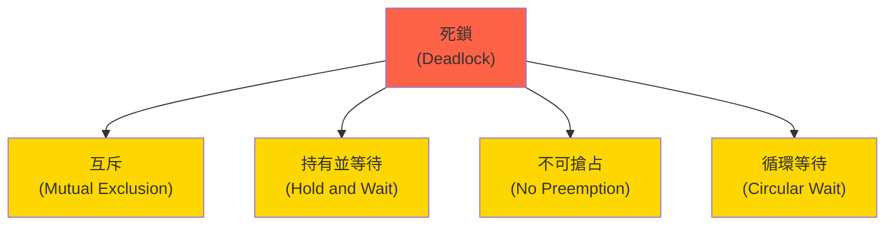

# 死鎖避免與調試 (Deadlock Prevention & Debugging)

## 核心概念

### 死鎖的四個必要條件



**破壞任一條件即可避免死鎖**

---

## 死鎖範例

### 經典死鎖場景

```rust
use std::sync::{Arc, Mutex};
use std::thread;
use std::time::Duration;

fn deadlock_example() {
    let resource1 = Arc::new(Mutex::new(0));
    let resource2 = Arc::new(Mutex::new(0));
    
    // 線程 1
    let r1 = Arc::clone(&resource1);
    let r2 = Arc::clone(&resource2);
    let t1 = thread::spawn(move || {
        let _lock1 = r1.lock().unwrap();
        println!("Thread 1: locked resource1");
        thread::sleep(Duration::from_millis(100));
        
        println!("Thread 1: trying to lock resource2...");
        let _lock2 = r2.lock().unwrap();  // 等待 resource2
        println!("Thread 1: locked resource2");
    });
    
    // 線程 2
    let r1 = Arc::clone(&resource1);
    let r2 = Arc::clone(&resource2);
    let t2 = thread::spawn(move || {
        let _lock2 = r2.lock().unwrap();
        println!("Thread 2: locked resource2");
        thread::sleep(Duration::from_millis(100));
        
        println!("Thread 2: trying to lock resource1...");
        let _lock1 = r1.lock().unwrap();  // 等待 resource1
        println!("Thread 2: locked resource1");
    });
    
    t1.join().unwrap();
    t2.join().unwrap();
    // 程序卡住，永不結束
}
```

---

## 死鎖避免策略

### 1. 鎖排序 (Lock Ordering)

**策略**: 所有線程按相同順序獲取鎖

```rust
use std::sync::{Arc, Mutex};
use std::thread;

fn lock_ordering() {
    let resource1 = Arc::new(Mutex::new(0));
    let resource2 = Arc::new(Mutex::new(0));
    
    // 定義鎖的全局順序
    fn acquire_locks<'a>(
        r1: &'a Mutex<i32>,
        r2: &'a Mutex<i32>
    ) -> (std::sync::MutexGuard<'a, i32>, std::sync::MutexGuard<'a, i32>) {
        // 使用指針地址作為順序
        if r1 as *const _ < r2 as *const _ {
            let lock1 = r1.lock().unwrap();
            let lock2 = r2.lock().unwrap();
            (lock1, lock2)
        } else {
            let lock2 = r2.lock().unwrap();
            let lock1 = r1.lock().unwrap();
            (lock1, lock2)
        }
    }
    
    // 線程 1
    let r1 = Arc::clone(&resource1);
    let r2 = Arc::clone(&resource2);
    let t1 = thread::spawn(move || {
        let (_lock1, _lock2) = acquire_locks(&r1, &r2);
        println!("Thread 1: acquired both locks");
    });
    
    // 線程 2
    let r1 = Arc::clone(&resource1);
    let r2 = Arc::clone(&resource2);
    let t2 = thread::spawn(move || {
        let (_lock1, _lock2) = acquire_locks(&r1, &r2);
        println!("Thread 2: acquired both locks");
    });
    
    t1.join().unwrap();
    t2.join().unwrap();
}
```

### 2. try_lock - 超時機制

```rust
use std::sync::{Arc, Mutex};
use std::thread;
use std::time::Duration;

fn try_lock_pattern() {
    let resource1 = Arc::new(Mutex::new(0));
    let resource2 = Arc::new(Mutex::new(0));
    
    let r1 = Arc::clone(&resource1);
    let r2 = Arc::clone(&resource2);
    
    let t = thread::spawn(move || {
        loop {
            // 嘗試獲取第一個鎖
            if let Ok(lock1) = r1.try_lock() {
                println!("Acquired lock1");
                
                // 嘗試獲取第二個鎖
                if let Ok(lock2) = r2.try_lock() {
                    println!("Acquired lock2");
                    // 執行臨界區操作
                    *lock1 + *lock2;
                    return;
                } else {
                    // 無法獲取 lock2，釋放 lock1 並重試
                    println!("Failed to acquire lock2, releasing lock1");
                    drop(lock1);
                }
            }
            
            // 回退一段時間
            thread::sleep(Duration::from_millis(10));
        }
    });
    
    t.join().unwrap();
}
```

### 3. 鎖層級 (Lock Hierarchy)

```rust
use std::sync::{Arc, Mutex};
use std::cell::Cell;

thread_local! {
    static CURRENT_LEVEL: Cell<u32> = Cell::new(u32::MAX);
}

struct HierarchicalMutex<T> {
    level: u32,
    mutex: Mutex<T>,
}

impl<T> HierarchicalMutex<T> {
    fn new(level: u32, data: T) -> Self {
        Self {
            level,
            mutex: Mutex::new(data),
        }
    }
    
    fn lock(&self) -> Result<std::sync::MutexGuard<T>, &'static str> {
        CURRENT_LEVEL.with(|current| {
            let current_level = current.get();
            
            // 檢查層級違規
            if self.level >= current_level {
                return Err("Lock hierarchy violation");
            }
            
            let guard = self.mutex.lock().unwrap();
            current.set(self.level);
            Ok(guard)
        })
    }
}

impl<T> Drop for HierarchicalMutex<T> {
    fn drop(&mut self) {
        CURRENT_LEVEL.with(|current| {
            current.set(u32::MAX);
        });
    }
}

// 使用範例
fn hierarchical_example() {
    let high_level = Arc::new(HierarchicalMutex::new(1000, 0));
    let low_level = Arc::new(HierarchicalMutex::new(100, 0));
    
    // ✅ 正確：從高到低
    let _h = high_level.lock().unwrap();
    let _l = low_level.lock().unwrap();
    
    // ❌ 錯誤：從低到高 (編譯時不會報錯，但運行時會)
    // let _l = low_level.lock().unwrap();
    // let _h = high_level.lock().unwrap();  // 會 panic
}
```

### 4. 單一鎖策略

```rust
use std::sync::{Arc, Mutex};
use std::collections::HashMap;

// ❌ 不好：多個細粒度鎖
struct BadDesign {
    account1: Mutex<i32>,
    account2: Mutex<i32>,
    account3: Mutex<i32>,
}

// ✅ 好：單一粗粒度鎖
struct GoodDesign {
    accounts: Mutex<HashMap<u32, i32>>,
}

impl GoodDesign {
    fn transfer(&self, from: u32, to: u32, amount: i32) {
        let mut accounts = self.accounts.lock().unwrap();
        
        if let Some(from_balance) = accounts.get_mut(&from) {
            if *from_balance >= amount {
                *from_balance -= amount;
                *accounts.entry(to).or_insert(0) += amount;
            }
        }
    }
}
```

---

## 死鎖檢測工具

### 1. ThreadSanitizer (TSan)

```bash
# 安裝 nightly Rust
rustup install nightly

# 使用 TSan 構建
RUSTFLAGS="-Z sanitizer=thread" cargo +nightly run

# TSan 會檢測：
# - 數據競爭
# - 死鎖
# - 使用已釋放的內存
```

**範例輸出**:

```
WARNING: ThreadSanitizer: lock-order-inversion (potential deadlock)
  Cycle in lock order graph: M1 => M2 => M1
```

### 2. parking_lot - 帶死鎖檢測的 Mutex

```toml
[dependencies]
parking_lot = { version = "0.12", features = ["deadlock_detection"] }
```

```rust
use parking_lot::{Mutex, deadlock};
use std::thread;
use std::time::Duration;

fn setup_deadlock_detection() {
    // 啟動死鎖檢測線程
    thread::spawn(move || {
        loop {
            thread::sleep(Duration::from_secs(1));
            let deadlocks = deadlock::check_deadlock();
            
            if !deadlocks.is_empty() {
                println!("Deadlock detected!");
                for (i, threads) in deadlocks.iter().enumerate() {
                    println!("Deadlock #{}", i);
                    for t in threads {
                        println!("Thread ID: {:?}", t.thread_id());
                        println!("Backtrace:\n{:?}", t.backtrace());
                    }
                }
            }
        }
    });
}

fn main() {
    setup_deadlock_detection();
    
    // 你的代碼...
}
```

### 3. 自定義死鎖檢測器

```rust
use std::sync::{Arc, Mutex};
use std::collections::{HashMap, HashSet};
use std::thread::{self, ThreadId};

struct DeadlockDetector {
    graph: Mutex<HashMap<ThreadId, HashSet<usize>>>,
}

impl DeadlockDetector {
    fn new() -> Self {
        Self {
            graph: Mutex::new(HashMap::new()),
        }
    }
    
    fn acquire(&self, lock_id: usize) {
        let tid = thread::current().id();
        let mut graph = self.graph.lock().unwrap();
        
        graph.entry(tid).or_insert_with(HashSet::new).insert(lock_id);
        
        // 簡單的環檢測 (實際應使用 DFS)
        if self.has_cycle(&graph) {
            panic!("Potential deadlock detected!");
        }
    }
    
    fn release(&self, lock_id: usize) {
        let tid = thread::current().id();
        let mut graph = self.graph.lock().unwrap();
        
        if let Some(locks) = graph.get_mut(&tid) {
            locks.remove(&lock_id);
        }
    }
    
    fn has_cycle(&self, graph: &HashMap<ThreadId, HashSet<usize>>) -> bool {
        // 簡化版本：檢查是否有線程持有多個鎖
        graph.values().any(|locks| locks.len() > 1)
    }
}
```

---

## 實戰案例

### 案例 1：銀行轉賬 (無死鎖版本)

```rust
use std::sync::{Arc, Mutex};
use std::thread;

struct Account {
    id: u32,
    balance: Mutex<i32>,
}

impl Account {
    fn new(id: u32, balance: i32) -> Self {
        Self {
            id,
            balance: Mutex::new(balance),
        }
    }
}

fn transfer(from: &Account, to: &Account, amount: i32) {
    // 鎖排序：總是先鎖 ID 小的賬戶
    let (first, second) = if from.id < to.id {
        (&from.balance, &to.balance)
    } else {
        (&to.balance, &from.balance)
    };
    
    let mut first_lock = first.lock().unwrap();
    let mut second_lock = second.lock().unwrap();
    
    // 確定實際的 from/to
    let (from_balance, to_balance) = if from.id < to.id {
        (&mut *first_lock, &mut *second_lock)
    } else {
        (&mut *second_lock, &mut *first_lock)
    };
    
    if *from_balance >= amount {
        *from_balance -= amount;
        *to_balance += amount;
        println!("Transferred {} from account {} to {}", 
                 amount, from.id, to.id);
    }
}

fn main() {
    let acc1 = Arc::new(Account::new(1, 1000));
    let acc2 = Arc::new(Account::new(2, 1000));
    
    let handles: Vec<_> = (0..10)
        .map(|i| {
            let acc1 = Arc::clone(&acc1);
            let acc2 = Arc::clone(&acc2);
            
            thread::spawn(move || {
                if i % 2 == 0 {
                    transfer(&acc1, &acc2, 10);
                } else {
                    transfer(&acc2, &acc1, 10);
                }
            })
        })
        .collect();
    
    for h in handles {
        h.join().unwrap();
    }
    
    println!("Account 1: {}", *acc1.balance.lock().unwrap());
    println!("Account 2: {}", *acc2.balance.lock().unwrap());
}
```

### 案例 2：哲學家就餐問題

```rust
use std::sync::{Arc, Mutex};
use std::thread;
use std::time::Duration;

struct Fork;

struct Philosopher {
    name: String,
    left_fork: Arc<Mutex<Fork>>,
    right_fork: Arc<Mutex<Fork>>,
}

impl Philosopher {
    fn dine(&self) {
        loop {
            self.think();
            self.eat();
        }
    }
    
    fn think(&self) {
        println!("{} is thinking", self.name);
        thread::sleep(Duration::from_millis(100));
    }
    
    fn eat(&self) {
        // 鎖排序避免死鎖
        let (first, second) = if Arc::as_ptr(&self.left_fork) < Arc::as_ptr(&self.right_fork) {
            (&self.left_fork, &self.right_fork)
        } else {
            (&self.right_fork, &self.left_fork)
        };
        
        let _first_fork = first.lock().unwrap();
        let _second_fork = second.lock().unwrap();
        
        println!("{} is eating", self.name);
        thread::sleep(Duration::from_millis(100));
    }
}

fn main() {
    let forks = (0..5)
        .map(|_| Arc::new(Mutex::new(Fork)))
        .collect::<Vec<_>>();
    
    let philosophers = vec![
        Philosopher {
            name: "Plato".to_string(),
            left_fork: Arc::clone(&forks[0]),
            right_fork: Arc::clone(&forks[1]),
        },
        Philosopher {
            name: "Aristotle".to_string(),
            left_fork: Arc::clone(&forks[1]),
            right_fork: Arc::clone(&forks[2]),
        },
        // ...
    ];
    
    let handles: Vec<_> = philosophers
        .into_iter()
        .map(|p| thread::spawn(move || p.dine()))
        .collect();
    
    for h in handles {
        h.join().unwrap();
    }
}
```

---

## 調試技巧

### 1. 添加日誌記錄

```rust
use std::sync::{Arc, Mutex};
use std::thread;

fn debug_locks() {
    let resource = Arc::new(Mutex::new(0));
    
    let r = Arc::clone(&resource);
    thread::spawn(move || {
        println!("[{:?}] Attempting to acquire lock", thread::current().id());
        let _lock = r.lock().unwrap();
        println!("[{:?}] Lock acquired", thread::current().id());
        
        thread::sleep(std::time::Duration::from_secs(1));
        
        println!("[{:?}] Releasing lock", thread::current().id());
    });
}
```

### 2. 使用超時

```rust
use std::sync::{Arc, Mutex};
use std::thread;
use std::time::Duration;

fn timeout_lock() {
    let resource = Arc::new(Mutex::new(0));
    
    let r = Arc::clone(&resource);
    thread::spawn(move || {
        let start = std::time::Instant::now();
        
        loop {
            if let Ok(lock) = r.try_lock() {
                println!("Lock acquired");
                break;
            }
            
            if start.elapsed() > Duration::from_secs(5) {
                panic!("Deadlock detected: timeout after 5 seconds");
            }
            
            thread::sleep(Duration::from_millis(100));
        }
    });
}
```

### 3. 堆棧跟蹤

```rust
use backtrace::Backtrace;

fn print_backtrace_on_lock() {
    println!("Acquiring lock from:");
    let bt = Backtrace::new();
    println!("{:?}", bt);
}
```

---

## 最佳實踐

### 1. 避免嵌套鎖

```rust
// ❌ 不好：嵌套鎖
fn bad() {
    let lock1 = mutex1.lock().unwrap();
    let lock2 = mutex2.lock().unwrap();
    // ...
}

// ✅ 好：盡量使用單一鎖
fn good() {
    let combined = mutex_combined.lock().unwrap();
    // ...
}
```

### 2. 縮小鎖範圍

```rust
// ❌ 不好：持鎖時間長
fn bad(mutex: &Mutex<Vec<i32>>) {
    let mut data = mutex.lock().unwrap();
    expensive_computation();  // 持鎖期間計算
    data.push(42);
}

// ✅ 好：縮小臨界區
fn good(mutex: &Mutex<Vec<i32>>) {
    let result = expensive_computation();
    let mut data = mutex.lock().unwrap();
    data.push(result);
}
```

### 3. 使用 RAII

```rust
// ✅ 利用 RAII 自動釋放鎖
fn raii_locks() {
    let lock = mutex.lock().unwrap();
    // lock 在作用域結束時自動釋放
}  // <- 自動釋放
```

---

## 參考資料 (References)

1. [The Deadlock Empire](https://deadlockempire.github.io/) - 互動式死鎖教學
2. [ThreadSanitizer Documentation](https://github.com/google/sanitizers/wiki/ThreadSanitizerCppManual)
3. [parking_lot Documentation](https://docs.rs/parking_lot/latest/parking_lot/)
4. 《Operating System Concepts》 (Silberschatz, 2018) - Chapter 7: Deadlocks
5. [Rust Atomics and Locks](https://marabos.nl/atomics/) (Mara Bos, 2023)
