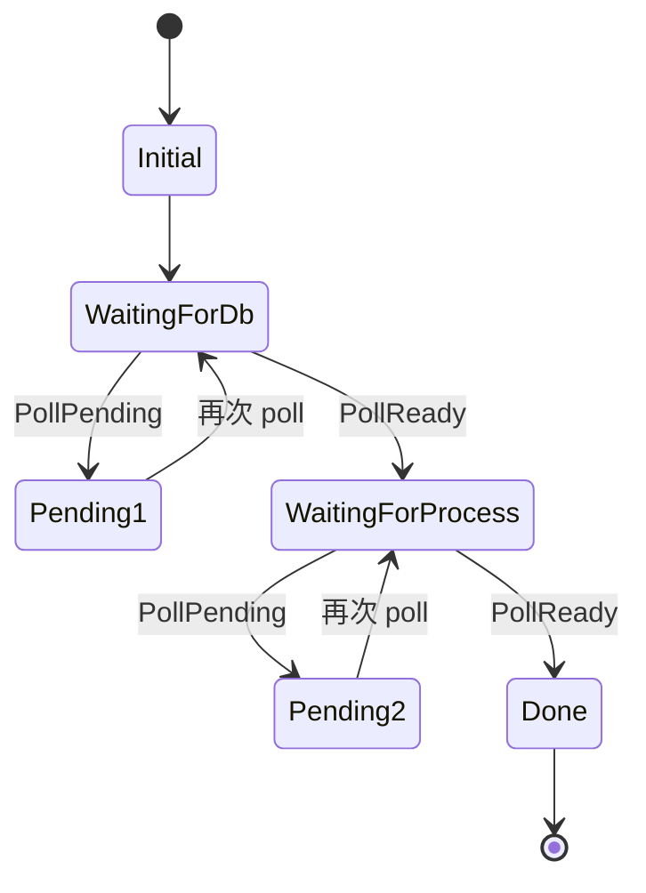
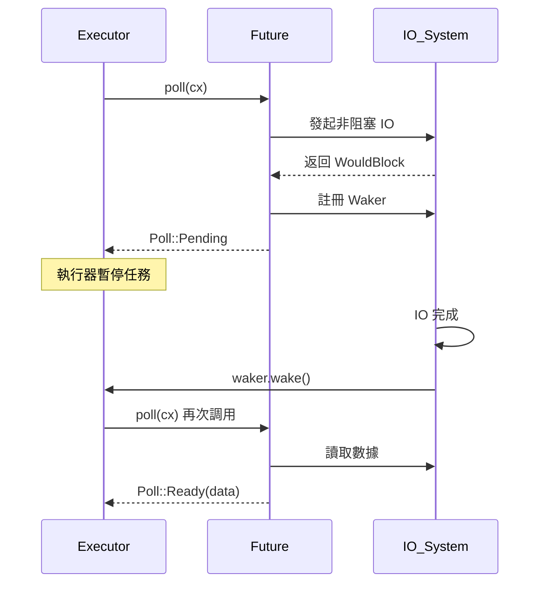

# Future 與 Poll 機制

## 核心概念

### Future Trait 定義

Rust 的異步機制建立在 `Future` trait 之上：

```rust
pub trait Future {
    type Output;
    fn poll(self: Pin<&mut Self>, cx: &mut Context<'_>) -> Poll<Self::Output>;
}

pub enum Poll<T> {
    Ready(T),
    Pending,
}
```

**核心要點**：
- Future 是惰性的 (Lazy)，不會自動執行
- `poll` 方法由執行器 (Executor) 驅動
- `Pin<&mut Self>` 確保 Future 不會被移動
- `Context` 攜帶 `Waker`，用於喚醒任務

### 狀態機轉換

編譯器將 `async fn` 轉換為狀態機：

```rust
// 原始代碼
async fn fetch_data() -> String {
    let data = fetch_from_db().await;
    let result = process(data).await;
    result
}

// 編譯器生成的狀態機（簡化）
enum FetchDataFuture {
    Initial,
    WaitingForDb { fut: FetchFromDbFuture },
    WaitingForProcess { data: String, fut: ProcessFuture },
    Done,
}

impl Future for FetchDataFuture {
    type Output = String;
    
    fn poll(mut self: Pin<&mut Self>, cx: &mut Context<'_>) -> Poll<String> {
        loop {
            match &mut *self {
                Self::Initial => {
                    let fut = fetch_from_db();
                    *self = Self::WaitingForDb { fut };
                }
                Self::WaitingForDb { fut } => {
                    match Pin::new(fut).poll(cx) {
                        Poll::Ready(data) => {
                            let fut = process(data.clone());
                            *self = Self::WaitingForProcess { data, fut };
                        }
                        Poll::Pending => return Poll::Pending,
                    }
                }
                Self::WaitingForProcess { data, fut } => {
                    match Pin::new(fut).poll(cx) {
                        Poll::Ready(result) => {
                            *self = Self::Done;
                            return Poll::Ready(result);
                        }
                        Poll::Pending => return Poll::Pending,
                    }
                }
                Self::Done => panic!("Future polled after completion"),
            }
        }
    }
}
```

**狀態機特性**：
- 每個 `.await` 點是一個狀態轉換邊界
- 跨 `.await` 的變數存儲在狀態機中
- 未跨越 `.await` 的變數可在棧上分配



## Pin 與 Unpin

### 為何需要 Pin

自引用結構體 (Self-Referential Struct) 在移動時會失效：

```rust
struct SelfRef {
    data: String,
    ptr: *const String,  // 指向 self.data
}

// 問題：移動後 ptr 失效
let mut s = SelfRef { data: "hello".to_string(), ptr: std::ptr::null() };
s.ptr = &s.data;
let s2 = s;  // 移動！s2.ptr 仍指向舊地址
```

Future 狀態機經常包含自引用：

```rust
async fn example() {
    let data = String::from("hello");
    let borrowed = &data;  // 借用 data
    some_async_call().await;
    println!("{}", borrowed);  // 狀態機需同時存儲 data 和 borrowed
}
```

### Pin 的工作原理

```rust
use std::pin::Pin;

// Pin<P> 保證 P 指向的數據不會移動
pub struct Pin<P> { /* ... */ }

impl<P: Deref> Pin<P> {
    // 不安全：調用者需保證 pointer 指向的數據已被固定
    pub unsafe fn new_unchecked(pointer: P) -> Pin<P>;
    
    // 安全：僅適用於實現 Unpin 的類型
    pub fn new(pointer: P) -> Pin<P> where P::Target: Unpin;
}
```

**Unpin 標記**：
- 大多數類型默認實現 `Unpin`（可安全移動）
- 手動實現 `!Unpin` 表示類型不可移動
- `Future` 狀態機默認 `!Unpin`

```rust
// 手動實現 Future
use std::future::Future;
use std::pin::Pin;
use std::task::{Context, Poll};

struct MyFuture {
    state: i32,
}

impl Future for MyFuture {
    type Output = i32;
    
    fn poll(mut self: Pin<&mut Self>, _cx: &mut Context<'_>) -> Poll<i32> {
        self.state += 1;
        if self.state >= 10 {
            Poll::Ready(self.state)
        } else {
            Poll::Pending
        }
    }
}
```

### 常用 Pin 操作

```rust
use std::pin::Pin;

// 1. 創建 Pin
let mut value = String::from("data");
let pinned = Pin::new(&mut value);  // String 是 Unpin

// 2. 投影 (Projection)
struct Container {
    data: String,
}

impl Container {
    // 安全：String 是 Unpin
    fn project_data(self: Pin<&mut Self>) -> Pin<&mut String> {
        unsafe { self.map_unchecked_mut(|s| &mut s.data) }
    }
}

// 3. pin_mut 宏（來自 futures crate）
use futures::pin_mut;

async fn example() {
    let fut = async { 42 };
    pin_mut!(fut);  // 在棧上固定
    let result = fut.await;
}

// 4. Box::pin（堆上固定）
use std::boxed::Box;

let pinned_future = Box::pin(async {
    // ...
});
```

## Context 與 Waker

### Waker 機制

`Waker` 是異步系統的喚醒機制：

```rust
pub struct Context<'a> {
    waker: &'a Waker,
    // ...
}

impl Waker {
    pub fn wake(self);           // 消費 self
    pub fn wake_by_ref(&self);   // 不消費
    pub fn will_wake(&self, other: &Waker) -> bool;
    pub fn clone(&self) -> Waker;
}
```

**工作流程**：



### 手動實現 Waker

```rust
use std::task::{RawWaker, RawWakerVTable, Waker};
use std::sync::Arc;

struct MyWaker;

impl MyWaker {
    fn wake(self: Arc<Self>) {
        println!("Task woken!");
    }
}

// 定義 VTable
const VTABLE: RawWakerVTable = RawWakerVTable::new(
    clone_waker,
    wake,
    wake_by_ref,
    drop_waker,
);

unsafe fn clone_waker(ptr: *const ()) -> RawWaker {
    let arc = Arc::from_raw(ptr as *const MyWaker);
    std::mem::forget(arc.clone());
    RawWaker::new(ptr, &VTABLE)
}

unsafe fn wake(ptr: *const ()) {
    let arc = Arc::from_raw(ptr as *const MyWaker);
    arc.wake();
}

unsafe fn wake_by_ref(ptr: *const ()) {
    let arc = Arc::from_raw(ptr as *const MyWaker);
    arc.clone().wake();
    std::mem::forget(arc);
}

unsafe fn drop_waker(ptr: *const ()) {
    drop(Arc::from_raw(ptr as *const MyWaker));
}

// 創建 Waker
fn create_waker() -> Waker {
    let my_waker = Arc::new(MyWaker);
    let raw = RawWaker::new(Arc::into_raw(my_waker) as *const (), &VTABLE);
    unsafe { Waker::from_raw(raw) }
}
```

## 自定義 Future

### 基礎範例：延遲 Future

```rust
use std::future::Future;
use std::pin::Pin;
use std::task::{Context, Poll};
use std::time::{Duration, Instant};

struct Delay {
    when: Instant,
}

impl Delay {
    fn new(duration: Duration) -> Self {
        Self {
            when: Instant::now() + duration,
        }
    }
}

impl Future for Delay {
    type Output = ();
    
    fn poll(self: Pin<&mut Self>, cx: &mut Context<'_>) -> Poll<()> {
        if Instant::now() >= self.when {
            Poll::Ready(())
        } else {
            // 實際應用中應註冊定時器喚醒
            cx.waker().wake_by_ref();
            Poll::Pending
        }
    }
}

// 使用
#[tokio::main]
async fn main() {
    Delay::new(Duration::from_secs(1)).await;
    println!("1 second passed");
}
```

### 進階範例：連接 Future

```rust
use std::future::Future;
use std::pin::Pin;
use std::task::{Context, Poll};

struct JoinFuture<F1, F2> {
    fut1: Option<Pin<Box<F1>>>,
    fut2: Option<Pin<Box<F2>>>,
}

impl<F1, F2> JoinFuture<F1, F2>
where
    F1: Future,
    F2: Future,
{
    fn new(fut1: F1, fut2: F2) -> Self {
        Self {
            fut1: Some(Box::pin(fut1)),
            fut2: Some(Box::pin(fut2)),
        }
    }
}

impl<F1, F2> Future for JoinFuture<F1, F2>
where
    F1: Future,
    F2: Future,
{
    type Output = (F1::Output, F2::Output);
    
    fn poll(mut self: Pin<&mut Self>, cx: &mut Context<'_>) -> Poll<Self::Output> {
        let mut out1 = None;
        let mut out2 = None;
        
        // Poll 第一個 Future
        if let Some(fut) = self.fut1.as_mut() {
            if let Poll::Ready(val) = fut.as_mut().poll(cx) {
                out1 = Some(val);
                self.fut1 = None;
            }
        }
        
        // Poll 第二個 Future
        if let Some(fut) = self.fut2.as_mut() {
            if let Poll::Ready(val) = fut.as_mut().poll(cx) {
                out2 = Some(val);
                self.fut2 = None;
            }
        }
        
        // 兩個都完成才返回 Ready
        match (out1, out2, &self.fut1, &self.fut2) {
            (Some(v1), Some(v2), _, _) => Poll::Ready((v1, v2)),
            (Some(v1), None, _, None) => Poll::Ready((v1, out2.unwrap())),
            (None, Some(v2), None, _) => Poll::Ready((out1.unwrap(), v2)),
            _ => Poll::Pending,
        }
    }
}
```

## async/await 語法糖

### 基礎用法

```rust
// async fn 返回 impl Future
async fn fetch_data() -> Result<String, Error> {
    let response = http_get("https://api.example.com").await?;
    let data = parse_response(response).await?;
    Ok(data)
}

// async block
let future = async {
    let data = fetch_data().await?;
    process(data).await
};

// async closure (不穩定特性)
// #![feature(async_closure)]
// let closure = async |x: i32| {
//     delay(Duration::from_secs(1)).await;
//     x * 2
// };
```

### Try Future (?)

`?` 運算子在 async 中的行為：

```rust
// 原始代碼
async fn process() -> Result<i32, Error> {
    let data = fetch().await?;  // 提前返回錯誤
    Ok(data * 2)
}

// 等價於
async fn process_expanded() -> Result<i32, Error> {
    let data = match fetch().await {
        Ok(v) => v,
        Err(e) => return Err(e.into()),
    };
    Ok(data * 2)
}
```

### Future Trait 別名

```rust
// 常見的 Future 類型別名
type BoxFuture<'a, T> = Pin<Box<dyn Future<Output = T> + Send + 'a>>;
type LocalBoxFuture<'a, T> = Pin<Box<dyn Future<Output = T> + 'a>>;

// 使用範例
fn returns_future() -> BoxFuture<'static, i32> {
    Box::pin(async { 42 })
}
```

## 執行器與運行時

### 最小執行器實現

```rust
use std::future::Future;
use std::pin::Pin;
use std::task::{Context, Poll};
use std::sync::{Arc, Mutex};
use std::collections::VecDeque;

struct Task {
    future: Mutex<Pin<Box<dyn Future<Output = ()> + Send>>>,
}

struct MiniExecutor {
    tasks: Arc<Mutex<VecDeque<Arc<Task>>>>,
}

impl MiniExecutor {
    fn new() -> Self {
        Self {
            tasks: Arc::new(Mutex::new(VecDeque::new())),
        }
    }
    
    fn spawn<F>(&self, future: F)
    where
        F: Future<Output = ()> + Send + 'static,
    {
        let task = Arc::new(Task {
            future: Mutex::new(Box::pin(future)),
        });
        self.tasks.lock().unwrap().push_back(task);
    }
    
    fn run(&self) {
        loop {
            let task = {
                let mut tasks = self.tasks.lock().unwrap();
                tasks.pop_front()
            };
            
            let Some(task) = task else {
                break;
            };
            
            let waker = create_simple_waker(task.clone(), self.tasks.clone());
            let mut context = Context::from_waker(&waker);
            
            let mut future = task.future.lock().unwrap();
            if let Poll::Pending = future.as_mut().poll(&mut context) {
                // 任務未完成，重新加入隊列
                self.tasks.lock().unwrap().push_back(task.clone());
            }
        }
    }
}

fn create_simple_waker(
    task: Arc<Task>,
    tasks: Arc<Mutex<VecDeque<Arc<Task>>>>,
) -> std::task::Waker {
    // 簡化實現（實際應使用 RawWaker）
    todo!("Implementation omitted for brevity")
}
```

### 常見運行時選擇

| 運行時 | 特性 | 適用場景 |
|--------|------|---------|
| **Tokio** | 多線程 work-stealing, 功能完整 | Web 服務、通用異步應用 |
| **async-std** | 類似標準庫 API | 學習、原型開發 |
| **smol** | 輕量級、單線程/多線程可選 | 嵌入式、資源受限環境 |
| **embassy** | 嵌入式專用、無動態分配 | 微控制器 |

## 常見陷阱與最佳實踐

### 避免阻塞操作

```rust
// ❌ 錯誤：阻塞執行器線程
async fn bad_example() {
    std::thread::sleep(Duration::from_secs(1));  // 阻塞！
}

// ✅ 正確：使用異步睡眠
async fn good_example() {
    tokio::time::sleep(Duration::from_secs(1)).await;
}

// ✅ 必須阻塞時使用 spawn_blocking
async fn mixed_example() {
    let result = tokio::task::spawn_blocking(|| {
        // 耗時的 CPU 計算或同步 IO
        expensive_computation()
    }).await.unwrap();
}
```

### 取消安全 (Cancellation Safety)

```rust
// ❌ 不安全：select! 可能丟失數據
async fn unsafe_select() {
    let mut stream = get_stream();
    loop {
        tokio::select! {
            Some(msg) = stream.next() => {
                process(msg).await;  // 如果另一分支觸發，msg 丟失
            }
            _ = shutdown_signal() => break,
        }
    }
}

// ✅ 安全：先完成接收再處理
async fn safe_select() {
    let mut stream = get_stream();
    loop {
        let msg = tokio::select! {
            Some(msg) = stream.next() => msg,
            _ = shutdown_signal() => break,
        };
        process(msg).await;
    }
}
```

### Send 邊界問題

```rust
use std::rc::Rc;

// ❌ 編譯錯誤：Rc 不是 Send
async fn bad_send() {
    let rc = Rc::new(42);
    tokio::time::sleep(Duration::from_secs(1)).await;
    println!("{}", rc);
}

// ✅ 使用 Arc
async fn good_send() {
    let arc = Arc::new(42);
    tokio::time::sleep(Duration::from_secs(1)).await;
    println!("{}", arc);
}

// ✅ 不跨越 await 可以使用 Rc
async fn local_rc() {
    {
        let rc = Rc::new(42);
        println!("{}", rc);
    }  // rc 在 await 之前被 drop
    tokio::time::sleep(Duration::from_secs(1)).await;
}
```

## 效能考量

### 狀態機大小

```rust
// ❌ 狀態機過大（所有變數都跨越 await）
async fn bloated() {
    let large_buffer = vec![0u8; 1_000_000];
    some_async_call().await;
    another_call().await;
    println!("{}", large_buffer.len());
}

// ✅ 縮小狀態機
async fn optimized() {
    {
        let large_buffer = vec![0u8; 1_000_000];
        // 使用 large_buffer
    }  // 不跨越 await，可在棧上分配
    some_async_call().await;
    another_call().await;
}
```

### 避免 Box 開銷

```rust
// ❌ 不必要的堆分配
async fn boxed() -> BoxFuture<'static, i32> {
    Box::pin(async { 42 })
}

// ✅ 使用 impl Future
async fn unboxed() -> impl Future<Output = i32> {
    async { 42 }
}

// 或直接返回 async fn
async fn direct() -> i32 {
    42
}
```

---

## 參考資料

1. [Asynchronous Programming in Rust](https://rust-lang.github.io/async-book/)
2. [The Rust Reference - Async](https://doc.rust-lang.org/reference/expressions/await-expr.html)
3. [Tokio Tutorial](https://tokio.rs/tokio/tutorial)
4. [Pin, Unpin, and why Rust needs them](https://blog.cloudflare.com/pin-and-unpin-in-rust/)
5. 《Programming Rust》(2nd Edition, O'Reilly, 2021) - Chapter 20
6. [Futures Explained in 200 Lines of Rust](https://cfsamson.github.io/books-futures-explained/)
