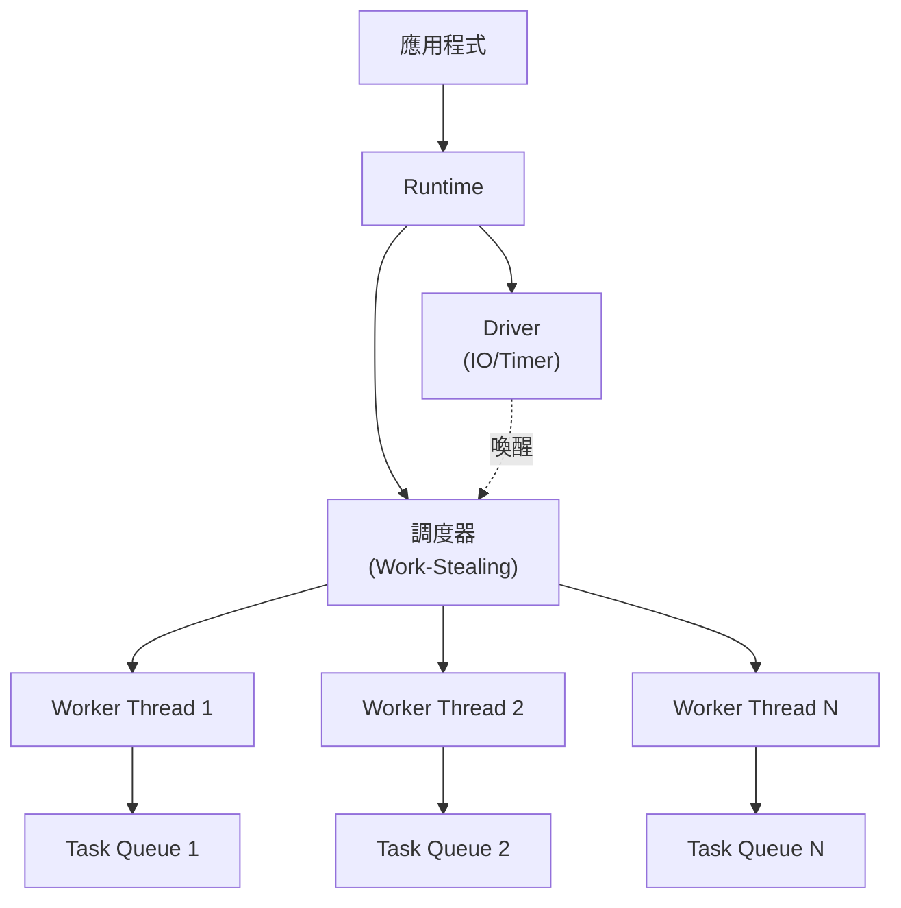
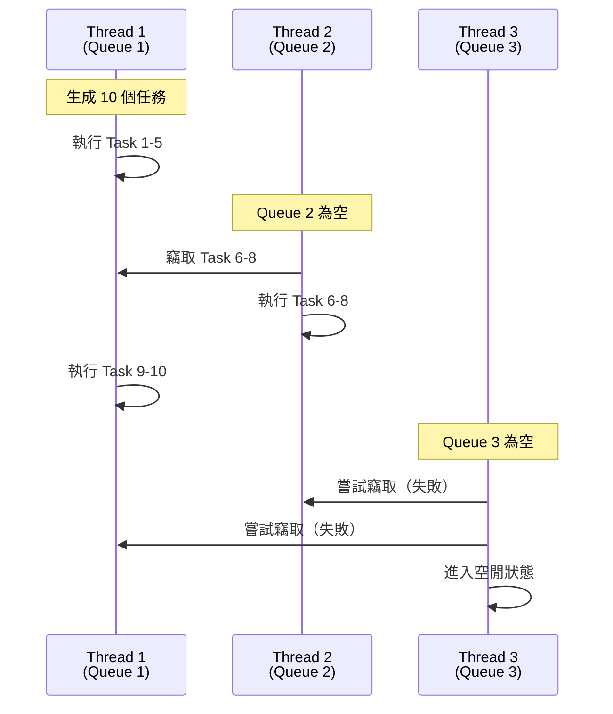
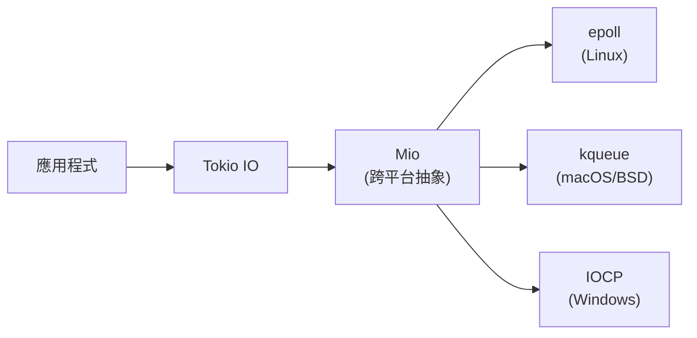

# Tokio 運行時架構

## 核心架構

### 運行時組件

Tokio 運行時由以下核心組件構成：



**組件說明**：
- **Runtime**: 異步任務執行環境
- **Scheduler**: Work-Stealing 調度器
- **Driver**: IO 事件驅動器 (epoll/kqueue/IOCP)
- **Worker Thread**: 執行異步任務的線程池

### 運行時類型

```rust
use tokio::runtime::Runtime;

// 1. 多線程運行時（默認）
#[tokio::main]
async fn main() {
    // 等價於：
    // let rt = Runtime::new().unwrap();
    // rt.block_on(async { ... });
}

// 2. 手動構建多線程運行時
let rt = Runtime::new().unwrap();
rt.block_on(async {
    println!("Running on Tokio");
});

// 3. 單線程運行時
#[tokio::main(flavor = "current_thread")]
async fn main() {
    // 適合 IO 密集型、單核環境
}

// 4. 自定義配置
let rt = tokio::runtime::Builder::new_multi_thread()
    .worker_threads(4)
    .thread_name("my-pool")
    .thread_stack_size(3 * 1024 * 1024)
    .enable_all()
    .build()
    .unwrap();
```

### 運行時選擇指南

| 類型 | 適用場景 | 配置 |
|------|---------|-----|
| **multi_thread** | Web 服務、高並發應用 | `#[tokio::main]` |
| **current_thread** | 嵌入式、資源受限環境 | `#[tokio::main(flavor = "current_thread")]` |
| **自定義** | 需精細控制線程數、堆疊大小 | `Builder::new_multi_thread()` |

## Work-Stealing 調度器

### 工作竊取機制



**核心特性**：
- 每個線程有獨立的任務隊列（減少競爭）
- 空閒線程從其他線程竊取任務
- LIFO (後進先出) 執行本地任務，FIFO (先進先出) 竊取遠程任務
- 提升緩存局部性

### 任務調度示例

```rust
use tokio::task;

#[tokio::main]
async fn main() {
    // 生成獨立任務（可能在不同線程執行）
    let handle1 = task::spawn(async {
        expensive_computation().await
    });
    
    let handle2 = task::spawn(async {
        another_computation().await
    });
    
    // 等待完成
    let (result1, result2) = tokio::join!(handle1, handle2);
    println!("{:?}, {:?}", result1, result2);
}

async fn expensive_computation() -> i32 {
    tokio::time::sleep(tokio::time::Duration::from_secs(1)).await;
    42
}

async fn another_computation() -> i32 {
    tokio::time::sleep(tokio::time::Duration::from_secs(1)).await;
    100
}
```

## 任務生成與管理

### spawn vs spawn_blocking

```rust
use tokio::task;
use std::time::Duration;

#[tokio::main]
async fn main() {
    // 1. spawn: 異步任務（不阻塞執行器）
    let async_task = task::spawn(async {
        tokio::time::sleep(Duration::from_secs(1)).await;
        println!("Async task completed");
    });
    
    // 2. spawn_blocking: 阻塞任務（使用專用線程池）
    let blocking_task = task::spawn_blocking(|| {
        std::thread::sleep(Duration::from_secs(1));  // 阻塞操作
        println!("Blocking task completed");
    });
    
    // 3. spawn_local: 非 Send 任務（僅單線程運行時）
    let local = tokio::task::LocalSet::new();
    local.run_until(async {
        let rc = std::rc::Rc::new(42);
        task::spawn_local(async move {
            println!("Local task: {}", rc);
        }).await.unwrap();
    }).await;
    
    // 等待所有任務
    async_task.await.unwrap();
    blocking_task.await.unwrap();
}
```

**關鍵差異**：

| 類型 | 線程池 | Send 要求 | 適用場景 |
|------|--------|-----------|---------|
| `spawn` | Worker 線程池 | 是 | 異步 IO、計算 |
| `spawn_blocking` | 專用阻塞線程池 | 是 | 同步 IO、CPU 密集計算 |
| `spawn_local` | 當前線程 | 否 | 非 Send 類型 (如 `Rc`) |

### JoinHandle 與取消

```rust
use tokio::task::JoinHandle;
use tokio::time::{sleep, Duration};

#[tokio::main]
async fn main() {
    let handle: JoinHandle<i32> = tokio::spawn(async {
        sleep(Duration::from_secs(10)).await;
        42
    });
    
    // 提前取消任務
    handle.abort();
    
    match handle.await {
        Ok(result) => println!("Result: {}", result),
        Err(e) if e.is_cancelled() => println!("Task was cancelled"),
        Err(e) => println!("Task panicked: {}", e),
    }
}
```

### 任務優先級與公平性

```rust
use tokio::task;

#[tokio::main]
async fn main() {
    // Tokio 不支持任務優先級，所有任務公平調度
    // 如需優先級，可使用通道 (channel) + 手動調度
    
    let (tx, mut rx) = tokio::sync::mpsc::channel(100);
    
    // 高優先級任務生產者
    task::spawn(async move {
        for i in 0..10 {
            tx.send(("high", i)).await.unwrap();
        }
    });
    
    // 消費者優先處理高優先級
    while let Some((priority, data)) = rx.recv().await {
        if priority == "high" {
            println!("Processing high priority: {}", data);
        }
    }
}
```

## Driver 系統

### IO Driver

Tokio 的 IO 驅動器基於作業系統的異步 IO 機制：



**工作流程**：
1. 異步 IO 操作註冊到 Mio
2. Mio 輪詢作業系統事件
3. 事件就緒時喚醒對應任務
4. 任務繼續執行

### Timer Driver

```rust
use tokio::time::{sleep, interval, timeout, Duration};

#[tokio::main]
async fn main() {
    // 1. 單次延遲
    sleep(Duration::from_secs(1)).await;
    
    // 2. 週期性任務
    let mut interval = interval(Duration::from_secs(1));
    for _ in 0..5 {
        interval.tick().await;
        println!("Tick");
    }
    
    // 3. 超時控制
    let result = timeout(Duration::from_secs(2), async {
        sleep(Duration::from_secs(10)).await;
        "Completed"
    }).await;
    
    match result {
        Ok(value) => println!("{}", value),
        Err(_) => println!("Timeout!"),
    }
}
```

**Timer 實現**：
- 基於時間輪 (Timing Wheel) 算法
- O(1) 插入和刪除
- 精度約 1ms（取決於作業系統）

### Signal Driver (Unix)

```rust
#[cfg(unix)]
use tokio::signal::unix::{signal, SignalKind};

#[tokio::main]
async fn main() {
    #[cfg(unix)]
    {
        let mut sigterm = signal(SignalKind::terminate()).unwrap();
        let mut sigint = signal(SignalKind::interrupt()).unwrap();
        
        tokio::select! {
            _ = sigterm.recv() => println!("Received SIGTERM"),
            _ = sigint.recv() => println!("Received SIGINT"),
        }
    }
}
```

## 執行上下文與 Handle

### Runtime Handle

```rust
use tokio::runtime::Handle;

fn spawn_on_runtime(handle: Handle) {
    handle.spawn(async {
        println!("Running on runtime");
    });
}

#[tokio::main]
async fn main() {
    let handle = Handle::current();
    
    // 從同步代碼中生成異步任務
    std::thread::spawn(move || {
        spawn_on_runtime(handle);
    });
    
    tokio::time::sleep(tokio::time::Duration::from_secs(1)).await;
}
```

### 進入異步上下文

```rust
use tokio::runtime::Runtime;

fn main() {
    let rt = Runtime::new().unwrap();
    
    // 1. block_on: 阻塞當前線程
    let result = rt.block_on(async {
        compute_async().await
    });
    
    // 2. 在運行時中執行同步代碼
    rt.spawn(async {
        let handle = tokio::runtime::Handle::current();
        let result = handle.spawn_blocking(|| {
            // 同步代碼
            expensive_sync_operation()
        }).await.unwrap();
        println!("Result: {}", result);
    });
    
    std::thread::sleep(std::time::Duration::from_secs(1));
}

async fn compute_async() -> i32 { 42 }
fn expensive_sync_operation() -> i32 { 100 }
```

### EnterGuard

```rust
use tokio::runtime::Runtime;

fn main() {
    let rt = Runtime::new().unwrap();
    let _guard = rt.enter();  // 進入運行時上下文
    
    // 現在可以調用需要運行時的函數
    tokio::spawn(async {
        println!("Spawned from sync context");
    });
    
    // _guard 離開作用域時退出運行時上下文
}
```

## 運行時配置優化

### 線程池調優

```rust
use tokio::runtime::Builder;

fn create_optimized_runtime() -> tokio::runtime::Runtime {
    Builder::new_multi_thread()
        // 1. 線程數量
        .worker_threads(num_cpus::get())  // 默認：CPU 核心數
        
        // 2. 線程名稱（便於調試）
        .thread_name_fn(|| {
            static ATOMIC_ID: std::sync::atomic::AtomicUsize = 
                std::sync::atomic::AtomicUsize::new(0);
            let id = ATOMIC_ID.fetch_add(1, std::sync::atomic::Ordering::SeqCst);
            format!("tokio-worker-{}", id)
        })
        
        // 3. 堆疊大小
        .thread_stack_size(2 * 1024 * 1024)  // 2MB
        
        // 4. 啟用所有功能
        .enable_all()  // enable_io() + enable_time()
        
        // 5. 事件間隔（影響 IO 輪詢頻率）
        .event_interval(61)  // 默認 61，越小響應越快但 CPU 消耗越高
        
        // 6. 全域隊列間隔（影響任務竊取頻率）
        .global_queue_interval(31)  // 默認 31
        
        .build()
        .unwrap()
}
```

### 阻塞線程池配置

```rust
use tokio::runtime::Builder;

fn create_runtime_with_blocking_pool() -> tokio::runtime::Runtime {
    Builder::new_multi_thread()
        .max_blocking_threads(512)  // 默認 512
        .build()
        .unwrap()
}

#[tokio::main]
async fn main() {
    // 大量阻塞任務
    let mut handles = vec![];
    for i in 0..1000 {
        let handle = tokio::task::spawn_blocking(move || {
            std::thread::sleep(std::time::Duration::from_secs(1));
            i
        });
        handles.push(handle);
    }
    
    // 等待所有任務
    for handle in handles {
        handle.await.unwrap();
    }
}
```

## 多運行時場景

### 嵌套運行時（禁止）

```rust
// ❌ 錯誤：不能在運行時中創建新運行時
#[tokio::main]
async fn main() {
    tokio::task::spawn(async {
        let rt = tokio::runtime::Runtime::new().unwrap();  // Panic!
        rt.block_on(async { });
    }).await.unwrap();
}
```

### 多個獨立運行時

```rust
use std::thread;
use tokio::runtime::Runtime;

fn main() {
    let handle1 = thread::spawn(|| {
        let rt = Runtime::new().unwrap();
        rt.block_on(async {
            println!("Runtime 1");
            tokio::time::sleep(tokio::time::Duration::from_secs(1)).await;
        });
    });
    
    let handle2 = thread::spawn(|| {
        let rt = Runtime::new().unwrap();
        rt.block_on(async {
            println!("Runtime 2");
            tokio::time::sleep(tokio::time::Duration::from_secs(1)).await;
        });
    });
    
    handle1.join().unwrap();
    handle2.join().unwrap();
}
```

### 運行時隔離

```rust
use tokio::runtime::Runtime;

fn main() {
    // 場景：隔離不同優先級的任務
    let high_priority_rt = Runtime::new().unwrap();
    let low_priority_rt = Runtime::new().unwrap();
    
    // 高優先級任務
    high_priority_rt.spawn(async {
        critical_task().await;
    });
    
    // 低優先級任務
    low_priority_rt.spawn(async {
        background_task().await;
    });
    
    // 等待
    std::thread::sleep(std::time::Duration::from_secs(5));
}

async fn critical_task() {
    println!("Critical task running");
}

async fn background_task() {
    println!("Background task running");
}
```

## 運行時監控

### 任務統計

```rust
#[tokio::main]
async fn main() {
    tokio::spawn(async {
        loop {
            // 獲取運行時指標（需要啟用 tokio-metrics crate）
            #[cfg(feature = "tokio-metrics")]
            {
                let metrics = tokio::runtime::Handle::current().metrics();
                println!("Active tasks: {}", metrics.num_workers());
            }
            
            tokio::time::sleep(tokio::time::Duration::from_secs(1)).await;
        }
    });
    
    tokio::time::sleep(tokio::time::Duration::from_secs(10)).await;
}
```

### Tokio Console

使用 `tokio-console` 進行實時監控：

```rust
// Cargo.toml
// [dependencies]
// tokio = { version = "1", features = ["full", "tracing"] }
// console-subscriber = "0.1"

fn main() {
    console_subscriber::init();
    
    let rt = tokio::runtime::Runtime::new().unwrap();
    rt.block_on(async {
        tokio::spawn(async {
            loop {
                tokio::time::sleep(tokio::time::Duration::from_secs(1)).await;
            }
        });
        
        tokio::time::sleep(tokio::time::Duration::from_secs(100)).await;
    });
}
```

執行後使用 `tokio-console` 連接：
```bash
cargo install tokio-console
tokio-console
```

## 常見模式與最佳實踐

### 優雅關閉

```rust
use tokio::signal;
use tokio::sync::broadcast;

#[tokio::main]
async fn main() {
    let (shutdown_tx, _) = broadcast::channel(1);
    
    // 生成多個任務
    for i in 0..5 {
        let mut shutdown_rx = shutdown_tx.subscribe();
        tokio::spawn(async move {
            loop {
                tokio::select! {
                    _ = shutdown_rx.recv() => {
                        println!("Task {} shutting down", i);
                        break;
                    }
                    _ = tokio::time::sleep(tokio::time::Duration::from_secs(1)) => {
                        println!("Task {} working", i);
                    }
                }
            }
        });
    }
    
    // 等待 Ctrl+C
    signal::ctrl_c().await.unwrap();
    println!("Shutting down...");
    shutdown_tx.send(()).unwrap();
    
    // 等待任務完成
    tokio::time::sleep(tokio::time::Duration::from_secs(1)).await;
}
```

### 負載均衡

```rust
use tokio::sync::Semaphore;
use std::sync::Arc;

#[tokio::main]
async fn main() {
    // 限制並發任務數
    let semaphore = Arc::new(Semaphore::new(10));  // 最多 10 個並發
    
    let mut handles = vec![];
    for i in 0..100 {
        let permit = semaphore.clone().acquire_owned().await.unwrap();
        let handle = tokio::spawn(async move {
            process_request(i).await;
            drop(permit);  // 釋放許可
        });
        handles.push(handle);
    }
    
    for handle in handles {
        handle.await.unwrap();
    }
}

async fn process_request(id: i32) {
    tokio::time::sleep(tokio::time::Duration::from_millis(100)).await;
    println!("Processed request {}", id);
}
```

### 錯誤傳播

```rust
use tokio::task::JoinSet;

#[tokio::main]
async fn main() -> Result<(), Box<dyn std::error::Error>> {
    let mut set = JoinSet::new();
    
    for i in 0..5 {
        set.spawn(async move {
            if i == 3 {
                Err(format!("Task {} failed", i))
            } else {
                Ok(i)
            }
        });
    }
    
    while let Some(result) = set.join_next().await {
        match result? {
            Ok(value) => println!("Success: {}", value),
            Err(e) => eprintln!("Error: {}", e),
        }
    }
    
    Ok(())
}
```

---

## 參考資料

1. [Tokio Documentation](https://docs.rs/tokio/latest/tokio/)
2. [Tokio Tutorial](https://tokio.rs/tokio/tutorial)
3. [Making the Tokio scheduler 10x faster](https://tokio.rs/blog/2019-10-scheduler)
4. [Tokio Internals - Understanding Rust's Async Runtime](https://hegdenu.net/posts/tokio-internals/)
5. [Async: What is blocking?](https://ryhl.io/blog/async-what-is-blocking/)
6. [Tokio Console](https://github.com/tokio-rs/console)
