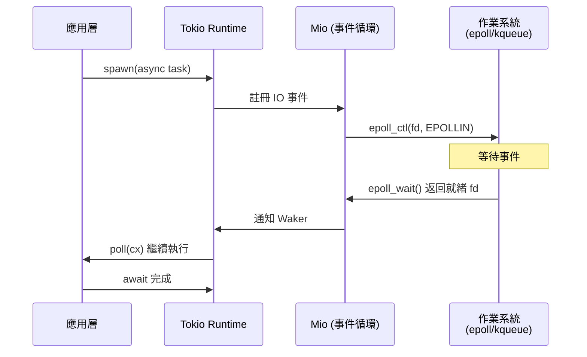
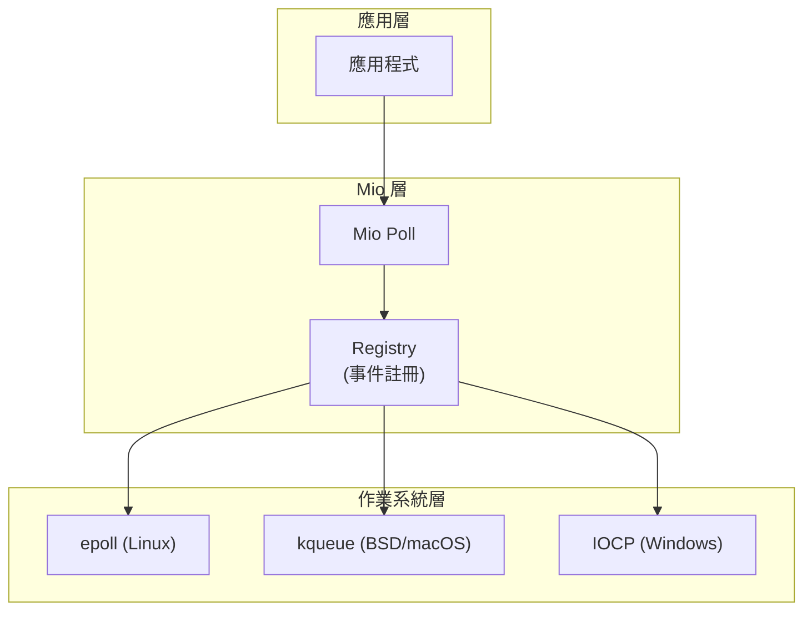

# 異步 IO 與事件驅動

## 核心概念

### 阻塞 vs 非阻塞 IO

```rust
use std::net::TcpStream;
use std::io::{Read, Write};

// 阻塞 IO（同步）
fn blocking_io() -> std::io::Result<()> {
    let mut stream = TcpStream::connect("127.0.0.1:8080")?;
    stream.write_all(b"GET / HTTP/1.1\r\n\r\n")?;  // 阻塞直到寫入完成
    
    let mut buffer = [0; 1024];
    stream.read(&mut buffer)?;  // 阻塞直到讀取到數據
    Ok(())
}

// 非阻塞 IO（異步）
use tokio::net::TcpStream as AsyncTcpStream;
use tokio::io::{AsyncReadExt, AsyncWriteExt};

async fn non_blocking_io() -> std::io::Result<()> {
    let mut stream = AsyncTcpStream::connect("127.0.0.1:8080").await?;
    stream.write_all(b"GET / HTTP/1.1\r\n\r\n").await?;  // 非阻塞
    
    let mut buffer = [0; 1024];
    stream.read(&mut buffer).await?;  // 非阻塞
    Ok(())
}
```

**關鍵差異**：

| 特性 | 阻塞 IO | 非阻塞 IO |
|------|---------|-----------|
| **執行緒效率** | 一個連接 = 一個執行緒 | 一個執行緒處理多個連接 |
| **資源消耗** | 高（大量執行緒） | 低（少量執行緒） |
| **延遲** | 高（上下文切換） | 低（事件驅動） |
| **複雜度** | 簡單 | 較複雜（狀態機） |

### 事件循環機制



## Tokio IO 抽象

### AsyncRead 與 AsyncWrite

```rust
use tokio::io::{AsyncRead, AsyncWrite, AsyncReadExt, AsyncWriteExt};
use std::pin::Pin;
use std::task::{Context, Poll};

// AsyncRead trait
pub trait AsyncRead {
    fn poll_read(
        self: Pin<&mut Self>,
        cx: &mut Context<'_>,
        buf: &mut ReadBuf<'_>,
    ) -> Poll<std::io::Result<()>>;
}

// AsyncWrite trait
pub trait AsyncWrite {
    fn poll_write(
        self: Pin<&mut Self>,
        cx: &mut Context<'_>,
        buf: &[u8],
    ) -> Poll<std::io::Result<usize>>;
    
    fn poll_flush(
        self: Pin<&mut Self>,
        cx: &mut Context<'_>,
    ) -> Poll<std::io::Result<()>>;
    
    fn poll_shutdown(
        self: Pin<&mut Self>,
        cx: &mut Context<'_>,
    ) -> Poll<std::io::Result<()>>;
}
```

### 使用擴展方法

```rust
use tokio::fs::File;
use tokio::io::{AsyncReadExt, AsyncWriteExt};

#[tokio::main]
async fn main() -> std::io::Result<()> {
    // 讀取文件
    let mut file = File::open("data.txt").await?;
    let mut contents = String::new();
    file.read_to_string(&mut contents).await?;
    
    // 寫入文件
    let mut file = File::create("output.txt").await?;
    file.write_all(b"Hello, Tokio!").await?;
    file.flush().await?;
    
    // 複製流
    let mut reader = File::open("input.txt").await?;
    let mut writer = File::create("output.txt").await?;
    tokio::io::copy(&mut reader, &mut writer).await?;
    
    Ok(())
}
```

### BufReader 與 BufWriter

```rust
use tokio::io::{BufReader, BufWriter, AsyncBufReadExt, AsyncWriteExt};
use tokio::fs::File;

#[tokio::main]
async fn main() -> std::io::Result<()> {
    // 緩衝讀取
    let file = File::open("large_file.txt").await?;
    let reader = BufReader::new(file);
    let mut lines = reader.lines();
    
    while let Some(line) = lines.next_line().await? {
        println!("{}", line);
    }
    
    // 緩衝寫入
    let file = File::create("output.txt").await?;
    let mut writer = BufWriter::new(file);
    
    for i in 0..1000 {
        writer.write_all(format!("Line {}\n", i).as_bytes()).await?;
    }
    writer.flush().await?;  // 確保數據寫入磁盤
    
    Ok(())
}
```

## 網路 IO

### TCP 服務端

```rust
use tokio::net::TcpListener;
use tokio::io::{AsyncReadExt, AsyncWriteExt};

#[tokio::main]
async fn main() -> std::io::Result<()> {
    let listener = TcpListener::bind("127.0.0.1:8080").await?;
    println!("Server listening on port 8080");
    
    loop {
        let (mut socket, addr) = listener.accept().await?;
        println!("New connection from: {}", addr);
        
        tokio::spawn(async move {
            let mut buffer = [0; 1024];
            
            loop {
                match socket.read(&mut buffer).await {
                    Ok(0) => {
                        println!("Client {} disconnected", addr);
                        break;
                    }
                    Ok(n) => {
                        // Echo 回客戶端
                        if socket.write_all(&buffer[..n]).await.is_err() {
                            println!("Failed to write to {}", addr);
                            break;
                        }
                    }
                    Err(e) => {
                        println!("Failed to read from {}: {}", addr, e);
                        break;
                    }
                }
            }
        });
    }
}
```

### TCP 客戶端

```rust
use tokio::net::TcpStream;
use tokio::io::{AsyncReadExt, AsyncWriteExt};

#[tokio::main]
async fn main() -> std::io::Result<()> {
    let mut stream = TcpStream::connect("127.0.0.1:8080").await?;
    
    // 發送數據
    stream.write_all(b"Hello, server!").await?;
    
    // 接收響應
    let mut buffer = [0; 1024];
    let n = stream.read(&mut buffer).await?;
    println!("Received: {}", String::from_utf8_lossy(&buffer[..n]));
    
    Ok(())
}
```

### UDP Socket

```rust
use tokio::net::UdpSocket;

#[tokio::main]
async fn main() -> std::io::Result<()> {
    // 服務端
    let server = UdpSocket::bind("127.0.0.1:8080").await?;
    let mut buf = [0; 1024];
    
    loop {
        let (len, addr) = server.recv_from(&mut buf).await?;
        println!("Received {} bytes from {}", len, addr);
        
        // Echo 回客戶端
        server.send_to(&buf[..len], addr).await?;
    }
}

async fn udp_client() -> std::io::Result<()> {
    let client = UdpSocket::bind("0.0.0.0:0").await?;
    client.connect("127.0.0.1:8080").await?;
    
    client.send(b"Hello, UDP!").await?;
    
    let mut buf = [0; 1024];
    let n = client.recv(&mut buf).await?;
    println!("Received: {}", String::from_utf8_lossy(&buf[..n]));
    
    Ok(())
}
```

### Unix Domain Socket

```rust
#[cfg(unix)]
use tokio::net::{UnixListener, UnixStream};

#[cfg(unix)]
#[tokio::main]
async fn main() -> std::io::Result<()> {
    let path = "/tmp/tokio.sock";
    
    // 刪除舊 socket 文件
    let _ = std::fs::remove_file(path);
    
    let listener = UnixListener::bind(path)?;
    
    loop {
        let (socket, _) = listener.accept().await?;
        tokio::spawn(async move {
            handle_unix_socket(socket).await;
        });
    }
}

#[cfg(unix)]
async fn handle_unix_socket(mut socket: UnixStream) {
    use tokio::io::{AsyncReadExt, AsyncWriteExt};
    
    let mut buffer = [0; 1024];
    if let Ok(n) = socket.read(&mut buffer).await {
        let _ = socket.write_all(&buffer[..n]).await;
    }
}
```

## 文件系統 IO

### 異步文件操作

```rust
use tokio::fs;
use tokio::io::{AsyncReadExt, AsyncWriteExt};

#[tokio::main]
async fn main() -> std::io::Result<()> {
    // 讀取整個文件
    let contents = fs::read_to_string("config.toml").await?;
    println!("{}", contents);
    
    // 寫入整個文件
    fs::write("output.txt", b"Hello, world!").await?;
    
    // 追加內容
    let mut file = fs::OpenOptions::new()
        .append(true)
        .open("log.txt")
        .await?;
    file.write_all(b"New log entry\n").await?;
    
    // 元數據
    let metadata = fs::metadata("data.txt").await?;
    println!("File size: {} bytes", metadata.len());
    
    // 目錄操作
    fs::create_dir_all("path/to/dir").await?;
    let mut entries = fs::read_dir("path/to/dir").await?;
    
    while let Some(entry) = entries.next_entry().await? {
        println!("{:?}", entry.path());
    }
    
    Ok(())
}
```

### 監視文件變化 (notify)

```rust
use notify::{Watcher, RecursiveMode, watcher};
use std::sync::mpsc::channel;
use std::time::Duration;

#[tokio::main]
async fn main() {
    let (tx, rx) = channel();
    let mut watcher = watcher(tx, Duration::from_secs(1)).unwrap();
    
    watcher.watch("./watched_dir", RecursiveMode::Recursive).unwrap();
    
    tokio::task::spawn_blocking(move || {
        loop {
            match rx.recv() {
                Ok(event) => println!("File event: {:?}", event),
                Err(e) => println!("Watch error: {}", e),
            }
        }
    });
    
    tokio::time::sleep(Duration::from_secs(60)).await;
}
```

## 事件驅動架構

### Mio 基礎

Tokio 底層使用 `Mio` (Metal IO) 進行事件註冊：

```rust
use mio::{Events, Interest, Poll, Token};
use mio::net::TcpListener;
use std::io;

fn main() -> io::Result<()> {
    // 創建事件循環
    let mut poll = Poll::new()?;
    let mut events = Events::with_capacity(128);
    
    // 創建 TCP 監聽器
    let mut listener = TcpListener::bind("127.0.0.1:9000".parse().unwrap())?;
    
    // 註冊事件
    const SERVER: Token = Token(0);
    poll.registry().register(
        &mut listener,
        SERVER,
        Interest::READABLE,
    )?;
    
    loop {
        // 等待事件
        poll.poll(&mut events, None)?;
        
        for event in events.iter() {
            match event.token() {
                SERVER => {
                    let (mut socket, address) = listener.accept()?;
                    println!("Accepted connection from: {}", address);
                }
                _ => unreachable!(),
            }
        }
    }
}
```

### epoll/kqueue 原理



**工作流程**：
1. **註冊階段**：將文件描述符 (fd) 和關注的事件註冊到 epoll
2. **等待階段**：調用 `epoll_wait()` 阻塞等待事件
3. **通知階段**：內核喚醒進程，返回就緒事件列表
4. **處理階段**：應用處理就緒的 IO 操作

### 自定義事件源

```rust
use std::io;
use std::os::unix::io::{AsRawFd, RawFd};
use mio::{event, Interest, Registry, Token};

struct CustomEventSource {
    fd: RawFd,
}

impl event::Source for CustomEventSource {
    fn register(
        &mut self,
        registry: &Registry,
        token: Token,
        interests: Interest,
    ) -> io::Result<()> {
        // 註冊自定義事件源
        registry.register(
            &mut mio::unix::SourceFd(&self.fd),
            token,
            interests,
        )
    }
    
    fn reregister(
        &mut self,
        registry: &Registry,
        token: Token,
        interests: Interest,
    ) -> io::Result<()> {
        registry.reregister(
            &mut mio::unix::SourceFd(&self.fd),
            token,
            interests,
        )
    }
    
    fn deregister(&mut self, registry: &Registry) -> io::Result<()> {
        registry.deregister(&mut mio::unix::SourceFd(&self.fd))
    }
}
```

## 高級 IO 模式

### 零拷貝 IO

```rust
use tokio::fs::File;
use tokio::io::copy;

#[tokio::main]
async fn main() -> std::io::Result<()> {
    // 使用 sendfile (Linux) 或等效系統調用進行零拷貝
    let mut source = File::open("large_file.bin").await?;
    let mut dest = File::create("copy.bin").await?;
    
    // Tokio 自動優化為零拷貝（如果作業系統支持）
    copy(&mut source, &mut dest).await?;
    
    Ok(())
}
```

### 向量化 IO (Vectored I/O)

```rust
use tokio::io::{AsyncWriteExt};
use tokio::net::TcpStream;
use std::io::IoSlice;

#[tokio::main]
async fn main() -> std::io::Result<()> {
    let mut stream = TcpStream::connect("127.0.0.1:8080").await?;
    
    // 一次系統調用寫入多個緩衝區
    let buf1 = b"Hello, ";
    let buf2 = b"world!";
    let bufs = &[
        IoSlice::new(buf1),
        IoSlice::new(buf2),
    ];
    
    stream.write_vectored(bufs).await?;
    
    Ok(())
}
```

### 內存映射文件 (mmap)

```rust
use memmap2::MmapOptions;
use std::fs::File;

fn main() -> std::io::Result<()> {
    let file = File::open("large_data.bin")?;
    let mmap = unsafe { MmapOptions::new().map(&file)? };
    
    // 直接訪問內存映射區域
    println!("First byte: {}", mmap[0]);
    
    // 搜索數據（零拷貝）
    let needle = b"pattern";
    if let Some(pos) = mmap.windows(needle.len()).position(|w| w == needle) {
        println!("Found at position: {}", pos);
    }
    
    Ok(())
}
```

## 背壓與流量控制

### 手動背壓實現

```rust
use tokio::sync::Semaphore;
use tokio::io::{AsyncReadExt, AsyncWriteExt};
use tokio::net::TcpStream;
use std::sync::Arc;

async fn handle_client_with_backpressure(
    mut socket: TcpStream,
    semaphore: Arc<Semaphore>,
) -> std::io::Result<()> {
    let mut buffer = [0; 1024];
    
    loop {
        // 獲取許可（限制並發處理）
        let _permit = semaphore.acquire().await.unwrap();
        
        let n = socket.read(&mut buffer).await?;
        if n == 0 {
            break;
        }
        
        // 模擬慢速處理
        process_data(&buffer[..n]).await;
        
        socket.write_all(&buffer[..n]).await?;
        
        // _permit 在作用域結束時釋放
    }
    
    Ok(())
}

async fn process_data(data: &[u8]) {
    tokio::time::sleep(tokio::time::Duration::from_millis(100)).await;
}

#[tokio::main]
async fn main() -> std::io::Result<()> {
    let listener = tokio::net::TcpListener::bind("127.0.0.1:8080").await?;
    let semaphore = Arc::new(Semaphore::new(10));  // 最多 10 個並發請求
    
    loop {
        let (socket, _) = listener.accept().await?;
        let sem = semaphore.clone();
        
        tokio::spawn(async move {
            if let Err(e) = handle_client_with_backpressure(socket, sem).await {
                eprintln!("Error: {}", e);
            }
        });
    }
}
```

### 使用 Stream 背壓

```rust
use tokio::io::{AsyncBufReadExt, BufReader};
use tokio::fs::File;
use futures::StreamExt;

#[tokio::main]
async fn main() -> std::io::Result<()> {
    let file = File::open("large_file.txt").await?;
    let reader = BufReader::new(file);
    let mut lines = reader.lines();
    
    // Stream 自動處理背壓
    while let Some(line) = lines.next_line().await? {
        // 慢速消費者
        process_line(&line).await;
    }
    
    Ok(())
}

async fn process_line(line: &str) {
    tokio::time::sleep(tokio::time::Duration::from_millis(10)).await;
    println!("{}", line);
}
```

## 錯誤處理與重試

### IO 錯誤分類

```rust
use std::io::{Error, ErrorKind};

async fn handle_io_error(result: std::io::Result<usize>) {
    match result {
        Ok(n) => println!("Read {} bytes", n),
        Err(e) => match e.kind() {
            ErrorKind::WouldBlock => {
                // 非阻塞 IO：稍後重試
                println!("Resource temporarily unavailable");
            }
            ErrorKind::Interrupted => {
                // 被信號中斷：重試
                println!("Operation interrupted");
            }
            ErrorKind::ConnectionReset => {
                // 連接重置：關閉連接
                println!("Connection reset by peer");
            }
            ErrorKind::TimedOut => {
                // 超時：可能重試
                println!("Operation timed out");
            }
            _ => {
                // 其他錯誤：記錄並處理
                eprintln!("IO error: {}", e);
            }
        }
    }
}
```

### 自動重試

```rust
use tokio::time::{sleep, Duration};

async fn retry_io_operation<F, Fut, T>(
    mut operation: F,
    max_retries: u32,
) -> std::io::Result<T>
where
    F: FnMut() -> Fut,
    Fut: std::future::Future<Output = std::io::Result<T>>,
{
    let mut attempts = 0;
    
    loop {
        match operation().await {
            Ok(result) => return Ok(result),
            Err(e) if attempts < max_retries && is_retryable(&e) => {
                attempts += 1;
                let delay = Duration::from_millis(100 * 2_u64.pow(attempts));
                eprintln!("Retry {} after {:?}: {}", attempts, delay, e);
                sleep(delay).await;
            }
            Err(e) => return Err(e),
        }
    }
}

fn is_retryable(error: &std::io::Error) -> bool {
    matches!(
        error.kind(),
        std::io::ErrorKind::TimedOut |
        std::io::ErrorKind::Interrupted |
        std::io::ErrorKind::WouldBlock
    )
}

// 使用範例
#[tokio::main]
async fn main() -> std::io::Result<()> {
    let result = retry_io_operation(
        || async {
            tokio::net::TcpStream::connect("unstable-server.com:8080").await
        },
        5,
    ).await?;
    
    println!("Connected successfully");
    Ok(())
}
```

## 性能優化

### 批次處理

```rust
use tokio::io::{AsyncWriteExt, BufWriter};
use tokio::net::TcpStream;

async fn batch_write(stream: TcpStream) -> std::io::Result<()> {
    let mut writer = BufWriter::with_capacity(8192, stream);
    
    for i in 0..1000 {
        writer.write_all(format!("Message {}\n", i).as_bytes()).await?;
        
        // 每 100 條消息刷新一次
        if i % 100 == 0 {
            writer.flush().await?;
        }
    }
    
    writer.flush().await?;
    Ok(())
}
```

### 緩衝區調優

```rust
use tokio::io::BufReader;
use tokio::fs::File;

#[tokio::main]
async fn main() -> std::io::Result<()> {
    let file = File::open("large_file.txt").await?;
    
    // 自定義緩衝區大小
    let reader = BufReader::with_capacity(64 * 1024, file);  // 64KB
    
    // ... 使用 reader
    
    Ok(())
}
```

### 避免小塊 IO

```rust
// ❌ 低效：大量小塊寫入
async fn inefficient_write(stream: &mut TcpStream) -> std::io::Result<()> {
    for i in 0..1000 {
        stream.write_all(format!("{}\n", i).as_bytes()).await?;
    }
    Ok(())
}

// ✅ 高效：批次累積後寫入
async fn efficient_write(stream: &mut TcpStream) -> std::io::Result<()> {
    let mut buffer = String::new();
    for i in 0..1000 {
        buffer.push_str(&format!("{}\n", i));
        
        if buffer.len() >= 4096 {
            stream.write_all(buffer.as_bytes()).await?;
            buffer.clear();
        }
    }
    
    if !buffer.is_empty() {
        stream.write_all(buffer.as_bytes()).await?;
    }
    
    Ok(())
}
```

---

## 參考資料

1. [Tokio IO Documentation](https://docs.rs/tokio/latest/tokio/io/)
2. [Mio - Metal IO](https://docs.rs/mio/latest/mio/)
3. [The Async Book - I/O](https://rust-lang.github.io/async-book/09_example/01_chapter.html)
4. [Linux epoll(7) man page](https://man7.org/linux/man-pages/man7/epoll.7.html)
5. [Why async Rust?](https://without.boats/blog/why-async-rust/)
6. 《Systems Performance》(Brendan Gregg, 2nd Edition, 2020)
