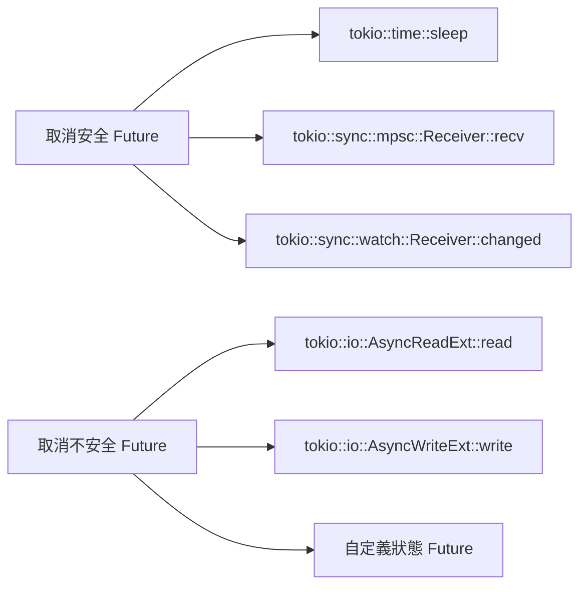

# Select 與流程控制

## tokio::select! 宏

### 基本用法

```rust
use tokio::time::{sleep, Duration};

#[tokio::main]
async fn main() {
    let result = tokio::select! {
        _ = sleep(Duration::from_secs(1)) => {
            "Timer expired"
        }
        _ = async { sleep(Duration::from_secs(2)).await } => {
            "Long operation completed"
        }
    };
    
    println!("{}", result);  // Output: Timer expired
}
```

**核心特性**：
- 等待多個異步操作，返回第一個完成的結果
- 其他分支被**取消** (cancel)
- 所有分支並發執行

### 語法結構

```rust
tokio::select! {
    // 模式 = 異步表達式 => 處理代碼
    result = async_operation() => {
        println!("Got: {:?}", result);
    }
    
    // 可選的 if 條件
    value = another_operation(), if should_run => {
        println!("Conditional: {}", value);
    }
    
    // else 分支（所有其他分支禁用時執行）
    else => {
        println!("All branches disabled");
    }
}
```

### 實際範例：超時控制

```rust
use tokio::time::{sleep, Duration, timeout};

async fn fetch_data() -> Result<String, &'static str> {
    sleep(Duration::from_secs(5)).await;
    Ok("data".to_string())
}

#[tokio::main]
async fn main() {
    tokio::select! {
        result = fetch_data() => {
            println!("Fetched: {:?}", result);
        }
        _ = sleep(Duration::from_secs(2)) => {
            println!("Timeout!");
        }
    }
}
```

## 取消安全 (Cancellation Safety)

### 不安全的取消

```rust
use tokio::sync::mpsc;

// ❌ 不安全：消息可能丟失
async fn unsafe_select(rx: &mut mpsc::Receiver<i32>) {
    loop {
        tokio::select! {
            Some(msg) = rx.recv() => {
                // 如果另一分支先完成，msg 會丟失
                process(msg).await;
            }
            _ = tokio::signal::ctrl_c() => {
                println!("Shutting down");
                break;
            }
        }
    }
}

async fn process(msg: i32) {
    println!("Processing: {}", msg);
}
```

### 安全的取消

```rust
use tokio::sync::mpsc;

// ✅ 安全：先接收消息，再處理
async fn safe_select(rx: &mut mpsc::Receiver<i32>) {
    loop {
        let msg = tokio::select! {
            Some(msg) = rx.recv() => msg,
            _ = tokio::signal::ctrl_c() => {
                println!("Shutting down");
                break;
            }
        };
        
        process(msg).await;
    }
}
```

### 取消安全的 Future



**取消安全檢查清單**：
- Future 被 drop 時不會丟失數據
- 重新 poll 時返回相同結果
- 沒有副作用（如部分寫入）

## 條件分支

### 動態啟用/禁用分支

```rust
use tokio::time::{sleep, Duration};

#[tokio::main]
async fn main() {
    let mut enabled = true;
    
    loop {
        tokio::select! {
            _ = sleep(Duration::from_secs(1)), if enabled => {
                println!("Enabled branch");
                enabled = false;
            }
            _ = sleep(Duration::from_secs(2)) => {
                println!("Always active");
                break;
            }
        }
    }
}
```

### 多條件組合

```rust
use tokio::sync::mpsc;

#[tokio::main]
async fn main() {
    let (tx1, mut rx1) = mpsc::channel(10);
    let (tx2, mut rx2) = mpsc::channel(10);
    
    let accept_channel1 = true;
    let accept_channel2 = false;
    
    tokio::select! {
        Some(msg) = rx1.recv(), if accept_channel1 => {
            println!("Channel 1: {}", msg);
        }
        Some(msg) = rx2.recv(), if accept_channel2 => {
            println!("Channel 2: {}", msg);
        }
        else => {
            println!("All channels disabled");
        }
    }
}
```

## 循環中的 select

### 基本模式

```rust
use tokio::sync::mpsc;
use tokio::time::{interval, Duration};

#[tokio::main]
async fn main() {
    let (tx, mut rx) = mpsc::channel(10);
    let mut tick = interval(Duration::from_secs(1));
    
    // 生產者
    tokio::spawn(async move {
        for i in 0..5 {
            tx.send(i).await.unwrap();
            tokio::time::sleep(Duration::from_millis(500)).await;
        }
    });
    
    // 消費者
    loop {
        tokio::select! {
            Some(msg) = rx.recv() => {
                println!("Message: {}", msg);
            }
            _ = tick.tick() => {
                println!("Tick");
            }
            else => {
                println!("All channels closed");
                break;
            }
        }
    }
}
```

### 優雅關閉

```rust
use tokio::sync::{mpsc, broadcast};
use tokio::time::{interval, Duration};

#[tokio::main]
async fn main() {
    let (msg_tx, mut msg_rx) = mpsc::channel(10);
    let (shutdown_tx, mut shutdown_rx) = broadcast::channel(1);
    let mut tick = interval(Duration::from_secs(1));
    
    // 工作循環
    loop {
        tokio::select! {
            Some(msg) = msg_rx.recv() => {
                println!("Processing: {}", msg);
            }
            _ = tick.tick() => {
                println!("Health check");
            }
            _ = shutdown_rx.recv() => {
                println!("Shutdown signal received");
                break;
            }
        }
    }
    
    // 清理邏輯
    println!("Cleaning up...");
}
```

## 偏好與公平性

### 分支偏好

```rust
use tokio::time::{sleep, Duration};

// select! 不保證公平性，可能偏好先聲明的分支
#[tokio::main]
async fn main() {
    let mut count1 = 0;
    let mut count2 = 0;
    
    for _ in 0..100 {
        tokio::select! {
            // 如果兩個分支同時就緒，此分支可能被優先選擇
            _ = sleep(Duration::from_micros(1)) => {
                count1 += 1;
            }
            _ = sleep(Duration::from_micros(1)) => {
                count2 += 1;
            }
        }
    }
    
    println!("Branch 1: {}, Branch 2: {}", count1, count2);
}
```

### biased 模式

```rust
use tokio::time::{sleep, Duration};

#[tokio::main]
async fn main() {
    tokio::select! {
        biased;  // 啟用偏好模式，按聲明順序檢查
        
        _ = sleep(Duration::from_secs(1)) => {
            println!("First branch");
        }
        _ = sleep(Duration::from_secs(1)) => {
            println!("Second branch");  // 永遠不會執行
        }
    }
}
```

## join! vs select!

### join! - 等待所有完成

```rust
use tokio::time::{sleep, Duration};

#[tokio::main]
async fn main() {
    let (result1, result2, result3) = tokio::join!(
        async {
            sleep(Duration::from_secs(1)).await;
            1
        },
        async {
            sleep(Duration::from_secs(2)).await;
            2
        },
        async {
            sleep(Duration::from_secs(3)).await;
            3
        }
    );
    
    println!("{} {} {}", result1, result2, result3);
    // 總時間：3 秒（並發執行）
}
```

### try_join! - 短路錯誤

```rust
use tokio::time::{sleep, Duration};

async fn task1() -> Result<i32, &'static str> {
    sleep(Duration::from_secs(1)).await;
    Ok(1)
}

async fn task2() -> Result<i32, &'static str> {
    sleep(Duration::from_secs(2)).await;
    Err("Task 2 failed")
}

async fn task3() -> Result<i32, &'static str> {
    sleep(Duration::from_secs(3)).await;
    Ok(3)
}

#[tokio::main]
async fn main() {
    match tokio::try_join!(task1(), task2(), task3()) {
        Ok((r1, r2, r3)) => println!("{} {} {}", r1, r2, r3),
        Err(e) => println!("Error: {}", e),
    }
    // task2 失敗時，所有任務被取消
}
```

## FuturesUnordered

### 動態任務集合

```rust
use futures::stream::{FuturesUnordered, StreamExt};
use tokio::time::{sleep, Duration};

#[tokio::main]
async fn main() {
    let mut tasks = FuturesUnordered::new();
    
    // 動態添加任務
    for i in 0..5 {
        tasks.push(async move {
            sleep(Duration::from_secs(5 - i)).await;
            i
        });
    }
    
    // 按完成順序處理
    while let Some(result) = tasks.next().await {
        println!("Completed: {}", result);
    }
}
```

### 限制並發數

```rust
use futures::stream::{FuturesUnordered, StreamExt};
use tokio::time::{sleep, Duration};

#[tokio::main]
async fn main() {
    let tasks: Vec<_> = (0..20).collect();
    let mut active = FuturesUnordered::new();
    let max_concurrent = 5;
    
    let mut task_iter = tasks.into_iter();
    
    // 初始填充
    for task in task_iter.by_ref().take(max_concurrent) {
        active.push(async move {
            sleep(Duration::from_secs(1)).await;
            println!("Task {} completed", task);
        });
    }
    
    // 動態補充
    while let Some(_) = active.next().await {
        if let Some(task) = task_iter.next() {
            active.push(async move {
                sleep(Duration::from_secs(1)).await;
                println!("Task {} completed", task);
            });
        }
    }
}
```

## JoinSet

### 任務集合管理

```rust
use tokio::task::JoinSet;
use tokio::time::{sleep, Duration};

#[tokio::main]
async fn main() {
    let mut set = JoinSet::new();
    
    // 添加任務
    for i in 0..5 {
        set.spawn(async move {
            sleep(Duration::from_secs(i)).await;
            i
        });
    }
    
    // 等待任務完成
    while let Some(result) = set.join_next().await {
        match result {
            Ok(value) => println!("Task completed: {}", value),
            Err(e) => eprintln!("Task panicked: {}", e),
        }
    }
}
```

### 動態添加與移除

```rust
use tokio::task::JoinSet;
use tokio::time::{sleep, Duration};

#[tokio::main]
async fn main() {
    let mut set = JoinSet::new();
    
    set.spawn(async {
        sleep(Duration::from_secs(10)).await;
        "long task"
    });
    
    set.spawn(async {
        sleep(Duration::from_secs(1)).await;
        "short task"
    });
    
    // 等待第一個完成
    if let Some(Ok(result)) = set.join_next().await {
        println!("First completed: {}", result);
    }
    
    // 取消所有剩餘任務
    set.abort_all();
    
    while let Some(result) = set.join_next().await {
        if let Err(e) = result {
            if e.is_cancelled() {
                println!("Task was cancelled");
            }
        }
    }
}
```

## Stream 處理

### StreamExt 組合子

```rust
use futures::stream::{self, StreamExt};

#[tokio::main]
async fn main() {
    let stream = stream::iter(1..=10)
        .map(|x| x * 2)
        .filter(|x| x % 4 == 0)
        .take(3);
    
    let results: Vec<_> = stream.collect().await;
    println!("{:?}", results);  // [4, 8, 12]
}
```

### 並發處理

```rust
use futures::stream::{self, StreamExt};
use tokio::time::{sleep, Duration};

#[tokio::main]
async fn main() {
    let results = stream::iter(0..10)
        .map(|i| async move {
            sleep(Duration::from_millis(100)).await;
            i * 2
        })
        .buffer_unordered(5)  // 最多 5 個並發
        .collect::<Vec<_>>()
        .await;
    
    println!("{:?}", results);
}
```

### 合併多個 Stream

```rust
use futures::stream::{self, StreamExt};
use tokio_stream::StreamMap;

#[tokio::main]
async fn main() {
    let mut map = StreamMap::new();
    
    map.insert("stream1", stream::iter(vec![1, 2, 3]));
    map.insert("stream2", stream::iter(vec![4, 5, 6]));
    
    while let Some((key, value)) = map.next().await {
        println!("{}: {}", key, value);
    }
}
```

## 錯誤處理模式

### select! 中的錯誤傳播

```rust
use tokio::time::{sleep, Duration};

async fn fallible_task() -> Result<i32, &'static str> {
    sleep(Duration::from_secs(1)).await;
    Err("task failed")
}

#[tokio::main]
async fn main() -> Result<(), Box<dyn std::error::Error>> {
    tokio::select! {
        result = fallible_task() => {
            result?;  // 錯誤傳播
        }
        _ = sleep(Duration::from_secs(2)) => {
            println!("Timeout");
        }
    }
    
    Ok(())
}
```

### 部分失敗處理

```rust
use tokio::task::JoinSet;

#[tokio::main]
async fn main() {
    let mut set = JoinSet::new();
    
    set.spawn(async { Ok::<_, &str>(1) });
    set.spawn(async { Err("error") });
    set.spawn(async { Ok(3) });
    
    let mut results = Vec::new();
    let mut errors = Vec::new();
    
    while let Some(result) = set.join_next().await {
        match result {
            Ok(Ok(value)) => results.push(value),
            Ok(Err(e)) => errors.push(e),
            Err(e) => eprintln!("Task panicked: {}", e),
        }
    }
    
    println!("Results: {:?}", results);
    println!("Errors: {:?}", errors);
}
```

## 實戰範例：多路復用服務

### 完整服務端

```rust
use tokio::net::TcpListener;
use tokio::sync::{broadcast, mpsc};
use tokio::time::{interval, Duration};
use std::sync::Arc;

#[tokio::main]
async fn main() -> Result<(), Box<dyn std::error::Error>> {
    let listener = TcpListener::bind("127.0.0.1:8080").await?;
    let (shutdown_tx, _) = broadcast::channel::<()>(1);
    let (stats_tx, mut stats_rx) = mpsc::channel(100);
    
    // 統計任務
    tokio::spawn(async move {
        let mut count = 0;
        while let Some(()) = stats_rx.recv().await {
            count += 1;
            if count % 100 == 0 {
                println!("Processed {} connections", count);
            }
        }
    });
    
    // 主循環
    loop {
        let mut shutdown_rx = shutdown_tx.subscribe();
        let stats_tx = stats_tx.clone();
        
        tokio::select! {
            result = listener.accept() => {
                let (socket, addr) = result?;
                println!("New connection from: {}", addr);
                stats_tx.send(()).await.unwrap();
                
                let shutdown_rx = shutdown_tx.subscribe();
                tokio::spawn(async move {
                    handle_connection(socket, shutdown_rx).await;
                });
            }
            _ = shutdown_rx.recv() => {
                println!("Shutdown signal received");
                break;
            }
            _ = tokio::signal::ctrl_c() => {
                println!("Ctrl+C received");
                shutdown_tx.send(()).unwrap();
                break;
            }
        }
    }
    
    Ok(())
}

async fn handle_connection(
    socket: tokio::net::TcpStream,
    mut shutdown: broadcast::Receiver<()>,
) {
    // 處理連接邏輯
}
```

---

## 參考資料

1. [Tokio select! Documentation](https://docs.rs/tokio/latest/tokio/macro.select.html)
2. [Tokio Tutorial - Select](https://tokio.rs/tokio/tutorial/select)
3. [Async Cancellation](https://blog.yoshuawuyts.com/async-cancellation-1/)
4. [Futures Combinators](https://rust-lang.github.io/async-book/06_multiple_futures/03_select.html)
5. [Cancellation Safe Futures](https://doc.rust-lang.org/std/future/trait.Future.html#cancellation)
