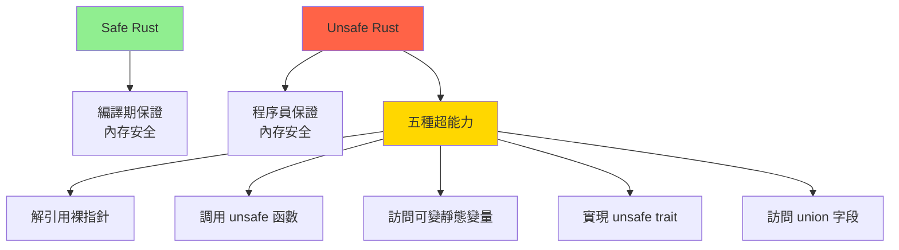

# Unsafe Rust 實戰 (Unsafe Rust in Practice)

## 核心概念

**Unsafe Rust** 允許繞過編譯器的安全檢查，執行五種特殊操作。

**為什麼需要 Unsafe?**
- 實現底層數據結構（如侵入式鏈表）
- 與 C 語言互操作（FFI）
- 優化性能關鍵路徑
- 實現編譯器無法驗證的安全抽象



---

## Unsafe 的五種超能力

### 1. 解引用裸指針 (Raw Pointers)

**裸指針類型**:
- `*const T` - 不可變裸指針
- `*mut T` - 可變裸指針

```rust
fn raw_pointers() {
    let mut num = 5;
    
    // 創建裸指針（safe）
    let r1 = &num as *const i32;        // 不可變裸指針
    let r2 = &mut num as *mut i32;      // 可變裸指針
    let r3 = 0x12345usize as *const i32; // 任意地址（危險！）
    
    // 解引用裸指針（unsafe）
    unsafe {
        println!("r1: {}", *r1);  // 讀取值
        *r2 = 10;                 // 修改值
        println!("num: {}", num); // 10
    }
}
```

**裸指針 vs 引用**:

| 特性 | 引用 `&T` | 裸指針 `*const T` |
|-----|----------|------------------|
| **別名規則** | 嚴格檢查 | 無檢查 |
| **生命週期** | 編譯期檢查 | 無檢查 |
| **Null** | 不允許 | 可以為 null |
| **對齊** | 保證對齊 | 可能未對齊 |
| **解引用** | Safe | Unsafe |

**常見操作**:

```rust
fn pointer_operations() {
    let mut data = vec![1, 2, 3, 4, 5];
    let ptr = data.as_mut_ptr(); // *mut i32
    
    unsafe {
        // 指針算術（需要 offset）
        let second = ptr.offset(1);     // 移動到第二個元素
        *second = 20;
        
        // 使用 add（推薦，更清晰）
        let third = ptr.add(2);
        *third = 30;
        
        // 讀取而不移動所有權
        let value = std::ptr::read(ptr);
        
        // 寫入而不 drop 舊值
        std::ptr::write(ptr, 100);
        
        // 複製內存
        std::ptr::copy(ptr, ptr.add(1), 2); // 複製 2 個元素
    }
    
    println!("{:?}", data); // [100, 100, 100, 4, 5]
}
```

### 2. 調用 Unsafe 函數

```rust
// 聲明 unsafe 函數
unsafe fn dangerous() {
    // 可以包含 unsafe 代碼
    let addr = 0x12345usize as *const i32;
    let _val = *addr; // 直接解引用，可能崩潰
}

// 調用必須在 unsafe 塊中
fn caller() {
    unsafe {
        dangerous();
    }
}
```

**創建安全抽象**:

```rust
// 不安全的實現，安全的接口
fn split_at_mut(slice: &mut [i32], mid: usize) -> (&mut [i32], &mut [i32]) {
    let len = slice.len();
    let ptr = slice.as_mut_ptr();
    
    // 前置檢查：確保 mid 在範圍內
    assert!(mid <= len);
    
    // 使用 unsafe 創建兩個可變引用（編譯器無法驗證這是安全的）
    unsafe {
        (
            std::slice::from_raw_parts_mut(ptr, mid),
            std::slice::from_raw_parts_mut(ptr.add(mid), len - mid),
        )
    }
}

fn main() {
    let mut data = vec![1, 2, 3, 4, 5];
    let (left, right) = split_at_mut(&mut data, 2);
    
    left[0] = 10;
    right[0] = 30;
    
    println!("{:?}", data); // [10, 2, 30, 4, 5]
}
```

### 3. 訪問可變靜態變量

```rust
// 可變靜態變量（全局狀態）
static mut COUNTER: u32 = 0;

fn increment() {
    unsafe {
        COUNTER += 1; // 訪問可變靜態變量是 unsafe
    }
}

fn get_counter() -> u32 {
    unsafe { COUNTER }
}

// ✅ 更好的方式：使用原子類型
use std::sync::atomic::{AtomicU32, Ordering};

static ATOMIC_COUNTER: AtomicU32 = AtomicU32::new(0);

fn safe_increment() {
    ATOMIC_COUNTER.fetch_add(1, Ordering::Relaxed); // Safe!
}
```

### 4. 實現 Unsafe Trait

```rust
// 聲明 unsafe trait
unsafe trait Foo {
    fn do_something(&self);
}

// 實現必須標記為 unsafe
struct MyType;

unsafe impl Foo for MyType {
    fn do_something(&self) {
        println!("Doing something");
    }
}

// 標準庫示例：Send 和 Sync
unsafe impl Send for MyType {}
unsafe impl Sync for MyType {}
```

### 5. 訪問 Union 字段

```rust
union MyUnion {
    i: i32,
    f: f32,
}

fn union_example() {
    let u = MyUnion { i: 42 };
    
    unsafe {
        // 訪問 union 字段需要 unsafe
        println!("i: {}", u.i);
        println!("f: {}", u.f); // 解釋為浮點數（可能無意義）
    }
}
```

---

## 實戰案例

### 案例 1: 侵入式鏈表 (Intrusive Linked List)

**概念**: 節點數據中嵌入鏈表指針，避免額外分配

```rust
use std::ptr;

// 鏈表節點（用戶自定義結構）
struct Node {
    data: i32,
    next: *mut Node, // 裸指針
}

impl Node {
    fn new(data: i32) -> Box<Self> {
        Box::new(Node {
            data,
            next: ptr::null_mut(),
        })
    }
}

// 侵入式鏈表
struct IntrusiveList {
    head: *mut Node,
}

impl IntrusiveList {
    fn new() -> Self {
        Self {
            head: ptr::null_mut(),
        }
    }
    
    // 在頭部插入節點
    fn push_front(&mut self, node: Box<Node>) {
        let node_ptr = Box::into_raw(node); // 轉為裸指針，轉移所有權
        
        unsafe {
            (*node_ptr).next = self.head; // 新節點指向舊頭部
            self.head = node_ptr;         // 更新頭指針
        }
    }
    
    // 彈出頭部節點
    fn pop_front(&mut self) -> Option<Box<Node>> {
        if self.head.is_null() {
            return None;
        }
        
        unsafe {
            let node = Box::from_raw(self.head); // 重新獲得所有權
            self.head = node.next;                // 更新頭指針
            Some(node)
        }
    }
    
    // 迭代列表
    fn iter(&self) -> ListIter {
        ListIter {
            current: self.head,
        }
    }
}

// 迭代器
struct ListIter {
    current: *mut Node,
}

impl Iterator for ListIter {
    type Item = i32;
    
    fn next(&mut self) -> Option<Self::Item> {
        if self.current.is_null() {
            return None;
        }
        
        unsafe {
            let data = (*self.current).data;
            self.current = (*self.current).next;
            Some(data)
        }
    }
}

// 實現 Drop 以防止內存洩漏
impl Drop for IntrusiveList {
    fn drop(&mut self) {
        while let Some(_) = self.pop_front() {}
    }
}

fn main() {
    let mut list = IntrusiveList::new();
    
    list.push_front(Node::new(1));
    list.push_front(Node::new(2));
    list.push_front(Node::new(3));
    
    // 迭代: 3, 2, 1
    for val in list.iter() {
        println!("{}", val);
    }
}
```

### 案例 2: 自定義智能指針

```rust
use std::ops::{Deref, DerefMut};
use std::ptr;

// 簡化版 Box<T>
struct MyBox<T> {
    ptr: *mut T,
}

impl<T> MyBox<T> {
    fn new(value: T) -> Self {
        // 在堆上分配內存
        let ptr = Box::into_raw(Box::new(value));
        Self { ptr }
    }
}

impl<T> Deref for MyBox<T> {
    type Target = T;
    
    fn deref(&self) -> &Self::Target {
        unsafe { &*self.ptr } // 解引用裸指針
    }
}

impl<T> DerefMut for MyBox<T> {
    fn deref_mut(&mut self) -> &mut Self::Target {
        unsafe { &mut *self.ptr }
    }
}

impl<T> Drop for MyBox<T> {
    fn drop(&mut self) {
        unsafe {
            // 重新獲得所有權並釋放
            drop(Box::from_raw(self.ptr));
        }
    }
}

fn main() {
    let mut my_box = MyBox::new(5);
    println!("Value: {}", *my_box); // 5
    
    *my_box = 10; // 可變解引用
    println!("Value: {}", *my_box); // 10
}
```

### 案例 3: 零拷貝字節緩衝

```rust
use std::ptr;
use std::slice;

// 零拷貝緩衝（類似 bytes::Bytes）
struct ZeroCopyBuffer {
    ptr: *const u8,
    len: usize,
    capacity: usize,
    // 引用計數（簡化）
    ref_count: *mut usize,
}

impl ZeroCopyBuffer {
    fn new(data: Vec<u8>) -> Self {
        let len = data.len();
        let capacity = data.capacity();
        let ptr = data.as_ptr();
        
        // 分配引用計數
        let ref_count = Box::into_raw(Box::new(1usize));
        
        // 防止 Vec 釋放內存
        std::mem::forget(data);
        
        Self { ptr, len, capacity, ref_count }
    }
    
    // 切片（零拷貝）
    fn slice(&self, start: usize, end: usize) -> Self {
        assert!(start <= end && end <= self.len);
        
        unsafe {
            // 增加引用計數
            *self.ref_count += 1;
            
            Self {
                ptr: self.ptr.add(start),
                len: end - start,
                capacity: self.capacity,
                ref_count: self.ref_count,
            }
        }
    }
    
    // 轉為 slice
    fn as_slice(&self) -> &[u8] {
        unsafe { slice::from_raw_parts(self.ptr, self.len) }
    }
}

impl Clone for ZeroCopyBuffer {
    fn clone(&self) -> Self {
        unsafe {
            *self.ref_count += 1;
        }
        Self {
            ptr: self.ptr,
            len: self.len,
            capacity: self.capacity,
            ref_count: self.ref_count,
        }
    }
}

impl Drop for ZeroCopyBuffer {
    fn drop(&mut self) {
        unsafe {
            *self.ref_count -= 1;
            
            // 最後一個引用，釋放內存
            if *self.ref_count == 0 {
                // 重建 Vec 並釋放
                let _ = Vec::from_raw_parts(
                    self.ptr as *mut u8,
                    self.len,
                    self.capacity,
                );
                // 釋放引用計數
                drop(Box::from_raw(self.ref_count));
            }
        }
    }
}

fn main() {
    let buf = ZeroCopyBuffer::new(vec![1, 2, 3, 4, 5]);
    let slice = buf.slice(1, 4); // [2, 3, 4] (零拷貝)
    
    println!("{:?}", slice.as_slice());
}
```

---

## 未定義行為 (Undefined Behavior, UB)

**常見 UB 場景**:

```rust
// ❌ 1. 解引用空指針
unsafe {
    let ptr: *const i32 = std::ptr::null();
    let _val = *ptr; // UB!
}

// ❌ 2. 數據競爭
static mut SHARED: i32 = 0;
unsafe {
    // 線程 1 寫入
    SHARED = 42;
    // 線程 2 同時讀取 -> UB!
    let _val = SHARED;
}

// ❌ 3. 懸垂指針
let ptr = {
    let x = 42;
    &x as *const i32
}; // x 已被銷毀
unsafe {
    let _val = *ptr; // UB: 讀取已釋放的內存
}

// ❌ 4. 未對齊訪問
#[repr(packed)]
struct Packed {
    a: u8,
    b: u32, // 未對齊
}

let p = Packed { a: 1, b: 2 };
let ptr = &p.b as *const u32;
unsafe {
    let _val = *ptr; // UB: 未對齊讀取
}

// ❌ 5. 別名違規
let mut data = vec![1, 2, 3];
let ptr1 = data.as_mut_ptr();
let ptr2 = ptr1;
unsafe {
    *ptr1 = 10;
    *ptr2 = 20; // UB: 兩個可變別名
}
```

---

## 檢測工具

### 1. Miri - UB 檢測器

```bash
# 安裝 Miri
rustup component add miri

# 運行測試
cargo miri test

# 運行程序
cargo miri run
```

**Miri 可檢測**:
- 懸垂指針
- 數據競爭
- 未對齊訪問
- 未初始化內存讀取
- 別名違規

**限制**:
- 不支持所有系統調用
- 不支持內聯彙編
- 運行速度慢

### 2. AddressSanitizer (ASan)

```bash
# 使用 ASan 構建
RUSTFLAGS="-Z sanitizer=address" cargo +nightly run

# 檢測：
# - Use-after-free
# - 雙重釋放
# - 緩衝區溢出
```

### 3. ThreadSanitizer (TSan)

```bash
# 檢測數據競爭
RUSTFLAGS="-Z sanitizer=thread" cargo +nightly run
```

---

## 最佳實踐

### 1. 最小化 Unsafe

```rust
// ❌ 不好：整個函數都是 unsafe
unsafe fn process(data: &[u8]) -> Vec<u8> {
    let mut result = Vec::new();
    // 100 行代碼...
    result
}

// ✅ 好：只有必要部分是 unsafe
fn process(data: &[u8]) -> Vec<u8> {
    let mut result = Vec::new();
    
    // 只有這部分需要 unsafe
    unsafe {
        let ptr = data.as_ptr();
        // 關鍵操作
    }
    
    result
}
```

### 2. 文檔化安全不變量

```rust
/// 從裸指針創建切片
///
/// # Safety
///
/// 調用者必須保證：
/// - `ptr` 指向至少 `len` 個有效的 `T` 元素
/// - `ptr` 在 `'a` 生命週期內保持有效
/// - 內存區域不被其他可變引用訪問
/// - `ptr` 對齊到 `T` 的對齊要求
unsafe fn from_raw_parts<'a, T>(ptr: *const T, len: usize) -> &'a [T] {
    std::slice::from_raw_parts(ptr, len)
}
```

### 3. 使用安全抽象

```rust
// ❌ 直接使用裸指針
let ptr = data.as_ptr();
unsafe {
    for i in 0..data.len() {
        process(*ptr.add(i));
    }
}

// ✅ 使用安全迭代器
for item in data {
    process(*item);
}
```

### 4. 斷言前置條件

```rust
unsafe fn get_unchecked(slice: &[i32], index: usize) -> i32 {
    // 在 debug 模式下檢查
    debug_assert!(index < slice.len(), "Index out of bounds");
    
    *slice.as_ptr().add(index)
}
```

---

## 參考資料 (References)

1. [The Rustonomicon](https://doc.rust-lang.org/nomicon/) - Unsafe Rust 官方指南
2. [Miri Documentation](https://github.com/rust-lang/miri)
3. [Rust Memory Model](https://plv.mpi-sws.org/rustbelt/popl18/)
4. 《Unsafe Rust》 (O'Reilly, 2023)
5. [Learn Rust With Entirely Too Many Linked Lists](https://rust-unofficial.github.io/too-many-lists/)
