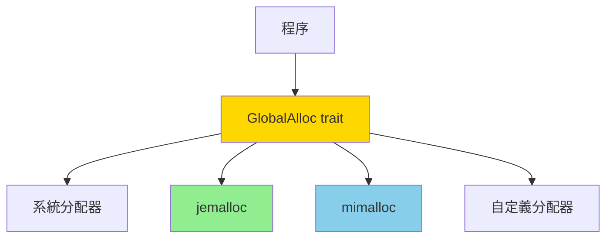

# 自定義內存分配器 (Custom Memory Allocators)

## 核心概念

**內存分配器 (Allocator)**: 管理堆內存分配和釋放的系統組件

**為什麼需要自定義分配器?**
- **性能優化**: 針對特定使用模式優化
- **內存碎片控制**: 減少碎片化
- **追蹤與調試**: 檢測內存洩漏
- **特殊需求**: 實時系統、嵌入式設備



---

## GlobalAlloc Trait

**接口定義**:

```rust
pub unsafe trait GlobalAlloc {
    // 分配內存
    unsafe fn alloc(&self, layout: Layout) -> *mut u8;
    
    // 釋放內存
    unsafe fn dealloc(&self, ptr: *mut u8, layout: Layout);
    
    // 可選：重新分配
    unsafe fn realloc(
        &self,
        ptr: *mut u8,
        layout: Layout,
        new_size: usize,
    ) -> *mut u8 {
        // 默認實現：alloc + copy + dealloc
        let new_layout = Layout::from_size_align_unchecked(
            new_size,
            layout.align(),
        );
        let new_ptr = self.alloc(new_layout);
        if !new_ptr.is_null() {
            std::ptr::copy_nonoverlapping(
                ptr,
                new_ptr,
                std::cmp::min(layout.size(), new_size),
            );
            self.dealloc(ptr, layout);
        }
        new_ptr
    }
}
```

**Layout**: 描述內存布局的類型

```rust
use std::alloc::Layout;

// 創建 Layout
let layout = Layout::new::<u64>();              // 單個 u64
let layout = Layout::array::<u64>(100).unwrap(); // 100 個 u64
let layout = Layout::from_size_align(1024, 8).unwrap(); // 1KB, 8 字節對齊

// 查詢信息
println!("Size: {}", layout.size());   // 大小
println!("Align: {}", layout.align()); // 對齊
```

---

## 系統分配器

### 1. 系統默認分配器

```rust
use std::alloc::{System, GlobalAlloc, Layout};

#[global_allocator]
static GLOBAL: System = System;

fn main() {
    let v = vec![1, 2, 3]; // 使用 System 分配器
    println!("{:?}", v);
}
```

### 2. jemalloc (高性能通用分配器)

**特性**: 多線程優化、內存碎片少、性能穩定

```toml
[dependencies]
tikv-jemallocator = "0.5"
```

```rust
use tikv_jemallocator::Jemalloc;

#[global_allocator]
static GLOBAL: Jemalloc = Jemalloc;

fn main() {
    // 所有分配都使用 jemalloc
    let v: Vec<_> = (0..1000000).collect();
    println!("Allocated {} elements", v.len());
}
```

**性能對比** (多線程場景):
- 系統分配器: 100%
- jemalloc: 120-150% (快 20-50%)

### 3. mimalloc (微軟高性能分配器)

```toml
[dependencies]
mimalloc = "0.1"
```

```rust
use mimalloc::MiMalloc;

#[global_allocator]
static GLOBAL: MiMalloc = MiMalloc;

fn main() {
    // 使用 mimalloc
}
```

**優勢**: 
- 低延遲
- 線程本地緩存
- 適合高並發場景

---

## 自定義分配器

### 案例 1: 統計分配器 (追蹤內存使用)

```rust
use std::alloc::{GlobalAlloc, Layout, System};
use std::sync::atomic::{AtomicUsize, Ordering};

// 統計分配器：追蹤分配次數和大小
struct StatsAlloc<A: GlobalAlloc> {
    inner: A,
    allocated: AtomicUsize,     // 已分配字節數
    deallocated: AtomicUsize,   // 已釋放字節數
    alloc_count: AtomicUsize,   // 分配次數
    dealloc_count: AtomicUsize, // 釋放次數
}

impl<A: GlobalAlloc> StatsAlloc<A> {
    const fn new(inner: A) -> Self {
        Self {
            inner,
            allocated: AtomicUsize::new(0),
            deallocated: AtomicUsize::new(0),
            alloc_count: AtomicUsize::new(0),
            dealloc_count: AtomicUsize::new(0),
        }
    }
    
    fn stats(&self) -> AllocStats {
        AllocStats {
            allocated: self.allocated.load(Ordering::Relaxed),
            deallocated: self.deallocated.load(Ordering::Relaxed),
            alloc_count: self.alloc_count.load(Ordering::Relaxed),
            dealloc_count: self.dealloc_count.load(Ordering::Relaxed),
        }
    }
}

#[derive(Debug)]
struct AllocStats {
    allocated: usize,
    deallocated: usize,
    alloc_count: usize,
    dealloc_count: usize,
}

impl AllocStats {
    fn current_usage(&self) -> usize {
        self.allocated.saturating_sub(self.deallocated)
    }
}

unsafe impl<A: GlobalAlloc> GlobalAlloc for StatsAlloc<A> {
    unsafe fn alloc(&self, layout: Layout) -> *mut u8 {
        let ptr = self.inner.alloc(layout);
        
        if !ptr.is_null() {
            self.allocated.fetch_add(layout.size(), Ordering::Relaxed);
            self.alloc_count.fetch_add(1, Ordering::Relaxed);
        }
        
        ptr
    }
    
    unsafe fn dealloc(&self, ptr: *mut u8, layout: Layout) {
        self.inner.dealloc(ptr, layout);
        self.deallocated.fetch_add(layout.size(), Ordering::Relaxed);
        self.dealloc_count.fetch_add(1, Ordering::Relaxed);
    }
}

#[global_allocator]
static GLOBAL: StatsAlloc<System> = StatsAlloc::new(System);

fn main() {
    {
        let v: Vec<_> = (0..1000).collect();
        println!("Stats after vec: {:?}", GLOBAL.stats());
    } // v 被釋放
    
    println!("Stats after drop: {:?}", GLOBAL.stats());
    println!("Current usage: {} bytes", GLOBAL.stats().current_usage());
}
```

### 案例 2: Arena 分配器 (快速批量分配)

**概念**: 從大塊內存中切片分配，一次性釋放所有

```rust
use std::cell::RefCell;
use std::ptr;

// Arena: 批量分配，統一釋放
struct Arena {
    chunks: RefCell<Vec<Vec<u8>>>, // 內存塊列表
    current: RefCell<usize>,       // 當前塊索引
    position: RefCell<usize>,      // 當前塊內位置
    chunk_size: usize,              // 每塊大小
}

impl Arena {
    fn new(chunk_size: usize) -> Self {
        Self {
            chunks: RefCell::new(vec![vec![0; chunk_size]]),
            current: RefCell::new(0),
            position: RefCell::new(0),
            chunk_size,
        }
    }
    
    fn alloc(&self, size: usize, align: usize) -> *mut u8 {
        let mut chunks = self.chunks.borrow_mut();
        let mut current = self.current.borrow_mut();
        let mut position = self.position.borrow_mut();
        
        // 計算對齊後的位置
        let aligned_pos = (*position + align - 1) & !(align - 1);
        
        // 檢查當前塊是否有足夠空間
        if aligned_pos + size > self.chunk_size {
            // 分配新塊
            chunks.push(vec![0; self.chunk_size]);
            *current += 1;
            *position = 0;
            return self.alloc(size, align);
        }
        
        // 從當前塊分配
        let ptr = chunks[*current][aligned_pos..].as_mut_ptr();
        *position = aligned_pos + size;
        
        ptr
    }
}

impl Drop for Arena {
    fn drop(&mut self) {
        // 統一釋放所有內存塊
        self.chunks.borrow_mut().clear();
    }
}

fn main() {
    let arena = Arena::new(4096); // 4KB 塊
    
    // 快速分配多個對象
    let ptr1 = arena.alloc(8, 8);
    let ptr2 = arena.alloc(16, 8);
    let ptr3 = arena.alloc(32, 8);
    
    unsafe {
        *(ptr1 as *mut u64) = 42;
        println!("Value: {}", *(ptr1 as *mut u64));
    }
    
    // arena 離開作用域時，一次性釋放所有內存
}
```

### 案例 3: Bump 分配器 (碰撞分配)

```rust
use std::alloc::{GlobalAlloc, Layout};
use std::cell::UnsafeCell;
use std::ptr;

// Bump 分配器：線性分配，不支持單獨釋放
struct BumpAlloc {
    heap_start: usize,
    heap_end: usize,
    next: UnsafeCell<usize>, // 下一個可用地址
}

impl BumpAlloc {
    const fn new(heap_start: usize, heap_size: usize) -> Self {
        Self {
            heap_start,
            heap_end: heap_start + heap_size,
            next: UnsafeCell::new(heap_start),
        }
    }
}

unsafe impl GlobalAlloc for BumpAlloc {
    unsafe fn alloc(&self, layout: Layout) -> *mut u8 {
        let next = self.next.get();
        let mut current = *next;
        
        // 對齊
        current = (current + layout.align() - 1) & !(layout.align() - 1);
        
        let alloc_end = current + layout.size();
        
        // 檢查是否超出堆邊界
        if alloc_end > self.heap_end {
            return ptr::null_mut();
        }
        
        // 更新下一個可用地址
        *next = alloc_end;
        
        current as *mut u8
    }
    
    unsafe fn dealloc(&self, _ptr: *mut u8, _layout: Layout) {
        // Bump 分配器不支持單獨釋放
        // 通常在 Arena 離開作用域時整體釋放
    }
}

// 使用範例
fn bump_allocator_example() {
    // 分配 1MB 堆空間
    let heap = vec![0u8; 1024 * 1024];
    let heap_start = heap.as_ptr() as usize;
    
    let allocator = BumpAlloc::new(heap_start, heap.len());
    
    unsafe {
        // 快速分配多個對象
        let ptr1 = allocator.alloc(Layout::new::<u64>());
        let ptr2 = allocator.alloc(Layout::array::<u32>(10).unwrap());
        
        *(ptr1 as *mut u64) = 42;
        println!("Allocated at {:p}", ptr1);
    }
    
    // 不能 forget heap，否則內存洩漏
}
```

---

## 性能對比

### Benchmark 代碼

```rust
use criterion::{black_box, criterion_group, criterion_main, Criterion};
use std::alloc::{GlobalAlloc, Layout, System};
use tikv_jemallocator::Jemalloc;

fn bench_allocators(c: &mut Criterion) {
    let mut group = c.benchmark_group("allocators");
    
    // 系統分配器
    group.bench_function("system", |b| {
        b.iter(|| {
            let v: Vec<u64> = vec![0; black_box(1000)];
            black_box(v);
        });
    });
    
    // jemalloc（需要切換全局分配器）
    group.bench_function("jemalloc", |b| {
        b.iter(|| {
            let v: Vec<u64> = vec![0; black_box(1000)];
            black_box(v);
        });
    });
    
    group.finish();
}

criterion_group!(benches, bench_allocators);
criterion_main!(benches);
```

**典型結果**:
```
system:    500 ns/iter
jemalloc:  350 ns/iter (快 30%)
mimalloc:  320 ns/iter (快 36%)
```

---

## 選擇分配器的建議

### 場景分析

```rust
// 1. 通用應用：jemalloc 或 mimalloc
#[global_allocator]
static GLOBAL: Jemalloc = Jemalloc;

// 2. 實時系統：系統分配器（可預測性）
#[global_allocator]
static GLOBAL: System = System;

// 3. 短生命週期批量分配：Arena
fn process_batch(data: &[u8]) {
    let arena = Arena::new(1024 * 1024); // 1MB
    // 所有臨時對象從 arena 分配
    // 函數結束時統一釋放
}

// 4. 嵌入式/無標準庫：自定義分配器
#![no_std]
#[global_allocator]
static GLOBAL: CustomAlloc = CustomAlloc::new();
```

---

## 調試與分析

### 1. 內存洩漏檢測

```rust
// 使用 StatsAlloc 檢測洩漏
fn check_leak() {
    let start = GLOBAL.stats();
    
    {
        let v = vec![1, 2, 3];
        // 使用 v...
    } // v 應該被釋放
    
    let end = GLOBAL.stats();
    let leaked = end.current_usage() - start.current_usage();
    
    if leaked > 0 {
        eprintln!("Memory leak detected: {} bytes", leaked);
    }
}
```

### 2. Valgrind

```bash
# 檢測內存錯誤
valgrind --leak-check=full ./target/debug/my_program

# 檢測：
# - 內存洩漏
# - 使用已釋放的內存
# - 雙重釋放
```

### 3. AddressSanitizer

```bash
# 編譯時啟用 ASan
RUSTFLAGS="-Z sanitizer=address" cargo +nightly build

# 運行
./target/debug/my_program
```

---

## 最佳實踐

### 1. 選擇合適的分配器

```rust
// ✅ 多線程服務：jemalloc
#[global_allocator]
static GLOBAL: Jemalloc = Jemalloc;

// ✅ 單線程 CLI 工具：系統分配器
#[global_allocator]
static GLOBAL: System = System;

// ✅ 遊戲引擎：自定義 Arena
// 每幀從 Arena 分配，幀結束時重置
```

### 2. 避免過度優化

```rust
// ❌ 不好：為了 0.1% 性能提升引入複雜度
struct CustomAlloc {
    // 複雜的實現...
}

// ✅ 好：先用 jemalloc，確認是瓶頸再優化
#[global_allocator]
static GLOBAL: Jemalloc = Jemalloc;
```

### 3. 測試與驗證

```rust
#[cfg(test)]
mod tests {
    use super::*;
    
    #[test]
    fn test_allocator() {
        let start = GLOBAL.stats();
        
        {
            let v = vec![1; 1000];
            assert!(GLOBAL.stats().current_usage() > start.current_usage());
        }
        
        // 驗證內存被正確釋放
        assert_eq!(GLOBAL.stats().current_usage(), start.current_usage());
    }
}
```

---

## 參考資料 (References)

1. [jemalloc Documentation](http://jemalloc.net/)
2. [mimalloc Paper](https://www.microsoft.com/en-us/research/publication/mimalloc-free-list-sharding-in-action/)
3. [Rust Allocator API](https://doc.rust-lang.org/std/alloc/trait.GlobalAlloc.html)
4. 《The Garbage Collection Handbook》 (Jones et al., 2011)
5. [bumpalo crate](https://docs.rs/bumpalo/) - Arena 分配器實現
