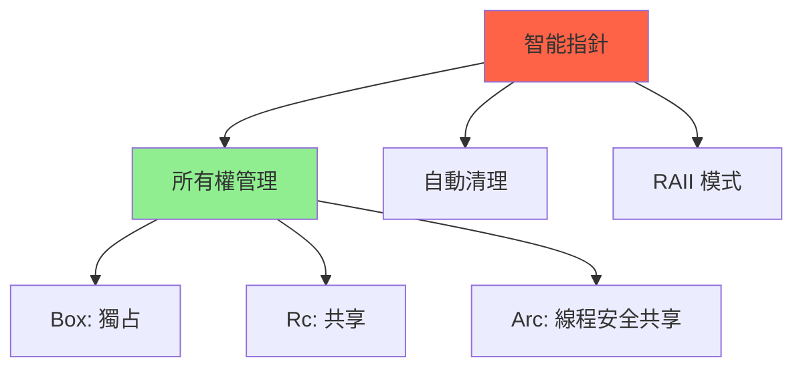

# 智能指針深度解析 (Smart Pointers Deep Dive)

## 核心概念

**智能指針**: 行為類似指針，但包含額外元數據和功能的類型。

**標準庫智能指針**:
- `Box<T>` - 堆分配，獨占所有權
- `Rc<T>` - 引用計數，共享所有權（單線程）
- `Arc<T>` - 原子引用計數（多線程）
- `Cow<'a, T>` - Clone-on-Write，延遲克隆
- `Cell<T>` / `RefCell<T>` - 內部可變性



---

## Box<T> - 堆分配

### 基本用法

```rust
fn box_basics() {
    // 在堆上分配
    let b = Box::new(5);
    println!("b = {}", b);
    
    // 大對象避免棧溢出
    let large_array = Box::new([0; 1_000_000]);
    
    // 離開作用域時自動釋放堆內存
}
```

### 實現遞歸類型

```rust
// 鏈表節點
enum List {
    Cons(i32, Box<List>), // Box 打破無限遞歸
    Nil,
}

use List::{Cons, Nil};

fn main() {
    let list = Cons(1, Box::new(Cons(2, Box::new(Cons(3, Box::new(Nil))))));
}
```

### Box 內部實現

```rust
use std::alloc::{alloc, dealloc, Layout};
use std::ptr;
use std::ops::{Deref, DerefMut};

// 簡化版 Box
struct MyBox<T> {
    ptr: *mut T,
}

impl<T> MyBox<T> {
    fn new(value: T) -> Self {
        unsafe {
            // 分配內存
            let layout = Layout::new::<T>();
            let ptr = alloc(layout) as *mut T;
            
            if ptr.is_null() {
                panic!("allocation failed");
            }
            
            // 寫入值
            ptr::write(ptr, value);
            
            Self { ptr }
        }
    }
}

impl<T> Deref for MyBox<T> {
    type Target = T;
    
    fn deref(&self) -> &T {
        unsafe { &*self.ptr }
    }
}

impl<T> DerefMut for MyBox<T> {
    fn deref_mut(&mut self) -> &mut T {
        unsafe { &mut *self.ptr }
    }
}

impl<T> Drop for MyBox<T> {
    fn drop(&mut self) {
        unsafe {
            // 先 drop 值
            ptr::drop_in_place(self.ptr);
            
            // 再釋放內存
            let layout = Layout::new::<T>();
            dealloc(self.ptr as *mut u8, layout);
        }
    }
}
```

---

## Rc<T> - 引用計數

### 基本用法

```rust
use std::rc::Rc;

fn rc_basics() {
    let a = Rc::new(5);
    println!("count after creating a = {}", Rc::strong_count(&a)); // 1
    
    let b = Rc::clone(&a); // 增加引用計數
    println!("count after creating b = {}", Rc::strong_count(&a)); // 2
    
    {
        let c = Rc::clone(&a);
        println!("count after creating c = {}", Rc::strong_count(&a)); // 3
    } // c 離開作用域，count = 2
    
    println!("count after c goes out of scope = {}", Rc::strong_count(&a)); // 2
} // a, b 離開作用域，count = 0，內存釋放
```

### Rc 內部實現

```rust
use std::cell::Cell;
use std::ops::Deref;

struct RcBox<T> {
    value: T,
    strong: Cell<usize>, // 強引用計數
    weak: Cell<usize>,   // 弱引用計數
}

struct SimpleRc<T> {
    ptr: *mut RcBox<T>,
}

impl<T> SimpleRc<T> {
    fn new(value: T) -> Self {
        let boxed = Box::new(RcBox {
            value,
            strong: Cell::new(1),
            weak: Cell::new(0),
        });
        
        Self {
            ptr: Box::into_raw(boxed),
        }
    }
    
    fn strong_count(&self) -> usize {
        unsafe { (*self.ptr).strong.get() }
    }
}

impl<T> Clone for SimpleRc<T> {
    fn clone(&self) -> Self {
        unsafe {
            let rc_box = &*self.ptr;
            rc_box.strong.set(rc_box.strong.get() + 1);
        }
        Self { ptr: self.ptr }
    }
}

impl<T> Deref for SimpleRc<T> {
    type Target = T;
    
    fn deref(&self) -> &T {
        unsafe { &(*self.ptr).value }
    }
}

impl<T> Drop for SimpleRc<T> {
    fn drop(&mut self) {
        unsafe {
            let rc_box = &*self.ptr;
            let strong = rc_box.strong.get();
            
            if strong == 1 {
                // 最後一個強引用，釋放內存
                drop(Box::from_raw(self.ptr));
            } else {
                rc_box.strong.set(strong - 1);
            }
        }
    }
}
```

---

## Arc<T> - 原子引用計數

### 線程安全共享

```rust
use std::sync::Arc;
use std::thread;

fn arc_threading() {
    let data = Arc::new(vec![1, 2, 3]);
    
    let mut handles = vec![];
    
    for i in 0..3 {
        let data = Arc::clone(&data);
        let handle = thread::spawn(move || {
            println!("Thread {}: {:?}", i, data);
        });
        handles.push(handle);
    }
    
    for handle in handles {
        handle.join().unwrap();
    }
}
```

### Arc vs Rc 性能對比

```rust
use std::rc::Rc;
use std::sync::Arc;

// Rc: 快，單線程
fn rc_clone_benchmark(iterations: usize) {
    let rc = Rc::new(42);
    for _ in 0..iterations {
        let _ = Rc::clone(&rc);
    }
}

// Arc: 慢（原子操作），多線程安全
fn arc_clone_benchmark(iterations: usize) {
    let arc = Arc::new(42);
    for _ in 0..iterations {
        let _ = Arc::clone(&arc);
    }
}

// 性能差異：Arc 比 Rc 慢約 3-5x（因為原子操作）
```

---

## Weak<T> - 弱引用

### 避免循環引用

```rust
use std::rc::{Rc, Weak};
use std::cell::RefCell;

#[derive(Debug)]
struct Node {
    value: i32,
    parent: RefCell<Weak<Node>>,     // 弱引用父節點
    children: RefCell<Vec<Rc<Node>>>, // 強引用子節點
}

fn main() {
    let leaf = Rc::new(Node {
        value: 3,
        parent: RefCell::new(Weak::new()),
        children: RefCell::new(vec![]),
    });
    
    println!("leaf strong = {}, weak = {}",
        Rc::strong_count(&leaf),
        Rc::weak_count(&leaf)
    );
    
    {
        let branch = Rc::new(Node {
            value: 5,
            parent: RefCell::new(Weak::new()),
            children: RefCell::new(vec![Rc::clone(&leaf)]),
        });
        
        // leaf 的 parent 指向 branch（弱引用）
        *leaf.parent.borrow_mut() = Rc::downgrade(&branch);
        
        println!("branch strong = {}, weak = {}",
            Rc::strong_count(&branch),
            Rc::weak_count(&branch)
        );
        
        println!("leaf strong = {}, weak = {}",
            Rc::strong_count(&leaf),
            Rc::weak_count(&leaf)
        );
    } // branch 離開作用域，被正常釋放
    
    // leaf.parent 現在是懸垂弱引用
    println!("leaf parent = {:?}", leaf.parent.borrow().upgrade());
}
```

---

## Cell<T> 與 RefCell<T>

### Cell<T> - 複製類型的內部可變性

```rust
use std::cell::Cell;

struct Counter {
    count: Cell<u32>, // 內部可變
}

impl Counter {
    fn new() -> Self {
        Self { count: Cell::new(0) }
    }
    
    fn increment(&self) { // 注意：&self 不是 &mut self
        self.count.set(self.count.get() + 1);
    }
    
    fn get(&self) -> u32 {
        self.count.get()
    }
}

fn main() {
    let counter = Counter::new();
    counter.increment(); // 不需要 &mut
    println!("Count: {}", counter.get());
}
```

### RefCell<T> - 運行時借用檢查

```rust
use std::cell::RefCell;

fn refcell_example() {
    let data = RefCell::new(vec![1, 2, 3]);
    
    // 借用規則在運行時檢查
    {
        let r1 = data.borrow();      // 不可變借用
        let r2 = data.borrow();      // OK：多個不可變借用
        println!("{:?}, {:?}", r1, r2);
    }
    
    {
        let mut w = data.borrow_mut(); // 可變借用
        w.push(4);
        // let r = data.borrow();      // Panic! 已有可變借用
    }
    
    println!("{:?}", data.borrow());
}
```

---

## Cow<'a, T> - Clone-on-Write

### 延遲克隆優化

```rust
use std::borrow::Cow;

fn process(input: Cow<str>) -> Cow<str> {
    if input.contains("hello") {
        // 需要修改，克隆並修改
        let mut owned = input.into_owned();
        owned.push_str(" world");
        Cow::Owned(owned)
    } else {
        // 不需要修改，直接返回
        input
    }
}

fn main() {
    // 借用字符串
    let borrowed = Cow::Borrowed("hello");
    let result = process(borrowed);
    println!("{}", result); // "hello world"
    
    // 擁有字符串
    let owned = Cow::Owned(String::from("goodbye"));
    let result = process(owned);
    println!("{}", result); // "goodbye" (未修改)
}
```

---

## 最佳實踐

### 1. 選擇合適的智能指針

```rust
// ✅ 單一所有者：Box
let data = Box::new(vec![1, 2, 3]);

// ✅ 多個所有者（單線程）：Rc
let shared = Rc::new(data);

// ✅ 多個所有者（多線程）：Arc
let shared = Arc::new(data);

// ✅ 可選所有權：Cow
fn process(s: Cow<str>) { /* ... */ }
```

### 2. 避免循環引用

```rust
// ❌ 不好：循環引用導致內存洩漏
struct Node {
    next: Option<Rc<RefCell<Node>>>,
    prev: Option<Rc<RefCell<Node>>>, // 循環引用
}

// ✅ 好：使用 Weak 打破循環
struct Node {
    next: Option<Rc<RefCell<Node>>>,
    prev: Option<Weak<RefCell<Node>>>, // 弱引用
}
```

### 3. 性能考慮

```rust
// Rc::clone() 只是增加引用計數（快）
let rc = Rc::new(vec![1, 2, 3]);
let rc2 = Rc::clone(&rc); // 不會克隆 vec

// .clone() 會深度克隆
let vec = vec![1, 2, 3];
let vec2 = vec.clone(); // 克隆整個 vec（慢）
```

---

## 參考資料 (References)

1. [The Rust Programming Language - Smart Pointers](https://doc.rust-lang.org/book/ch15-00-smart-pointers.html)
2. [std::rc Documentation](https://doc.rust-lang.org/std/rc/)
3. [std::sync::Arc Documentation](https://doc.rust-lang.org/std/sync/struct.Arc.html)
4. [Weak References and Cycle Breaking](https://doc.rust-lang.org/book/ch15-06-reference-cycles.html)
