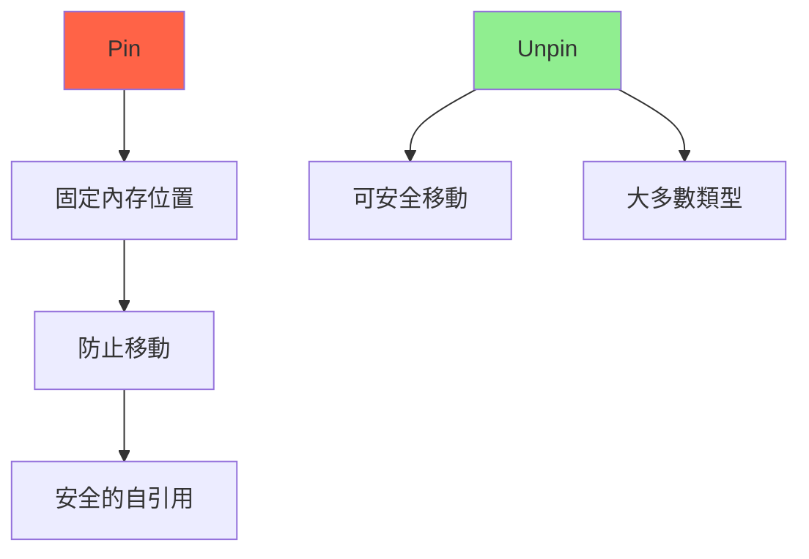
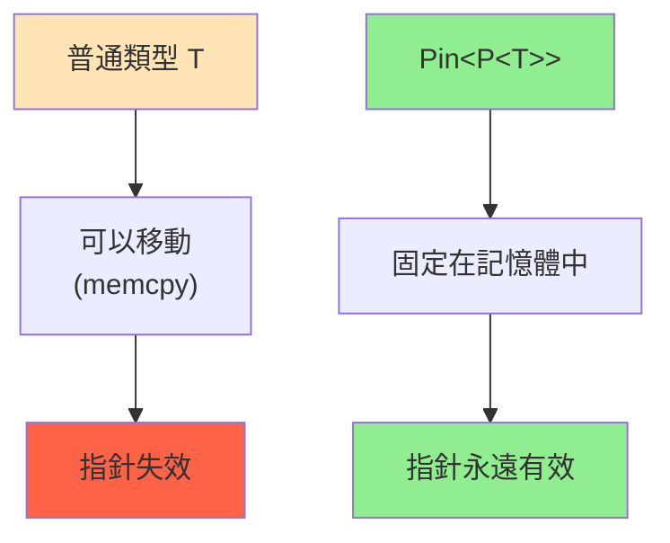
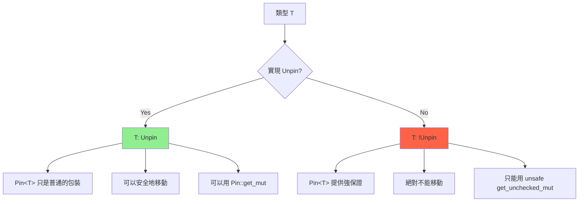
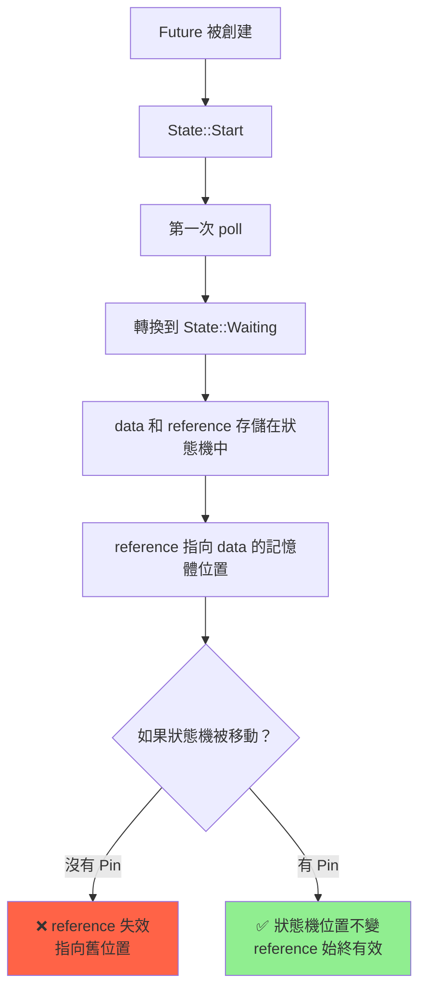

# Pin 與自引用結構 (Pin & Self-Referential Structs)

## 核心概念

**Pin<P>**: 防止類型 T 在內存中移動的智能指針包裝器。

### 為什麼需要 Pin? 前置知識

在理解 Pin 之前，我們需要先了解 Rust 的**移動語義 (Move Semantics)**：

#### Rust 的移動語義

```rust
// Rust 中的「移動」實際上是記憶體拷貝 (memcpy)
let s1 = String::from("hello");
let s2 = s1;  // s1 的記憶體內容被拷貝到 s2 的位置

// 記憶體布局示意：
// 移動前：
//   s1 @ 0x1000: [ptr: 0x5000, len: 5, cap: 5]  -> heap @ 0x5000: "hello"
//
// 移動後：
//   s1 @ 0x1000: [已失效]
//   s2 @ 0x2000: [ptr: 0x5000, len: 5, cap: 5]  -> heap @ 0x5000: "hello"
//
// 關鍵：指針 (0x5000) 的值沒變，但結構體的位置從 0x1000 變成 0x2000
```

**為什麼需要 Pin?** 三大原因：

1. **自引用結構 (Self-Referential Structs)**: 結構體內部的指針指向自身的其他字段
2. **異步 Future**: async/await 生成的狀態機可能包含自引用
3. **內存安全**: 防止懸垂指針 (Dangling Pointers)



---

## 自引用問題深度解析

### 什麼是自引用結構？

**自引用結構 (Self-Referential Struct)**: 結構體中的某個字段（通常是指針或引用）指向結構體自身的另一個字段。


### 問題演示：為什麼會出錯？

```rust
// ❌ 不安全的自引用結構
struct SelfReferential {
    data: String,           // 實際數據
    pointer: *const String, // 指向 self.data 的原始指針
}

impl SelfReferential {
    fn new(s: &str) -> Self {
        let data = s.to_string();
        // ⚠️ 錯誤：此時 data 還在棧上，尚未移動到結構體中
        let pointer = &data as *const String;
        Self { data, pointer }
        // 當 Self 被構造時，data 會被移動，pointer 指向的位置已失效！
    }
    
    fn get_data(&self) -> &str {
        unsafe { &*self.pointer } // 危險！可能是懸垂指針
    }
}

fn main() {
    let mut sr = SelfReferential::new("hello");
    
    // 記憶體布局（假設）：
    //   sr @ 0x1000:
    //     data: [ptr: 0x5000, len: 5, cap: 5] -> heap: "hello"
    //     pointer: 0x1000 (指向 sr.data 的位置)
    
    // 移動結構體 -> 指針失效
    let sr2 = sr; // sr 的內容被 memcpy 到 sr2
    
    // 移動後記憶體布局：
    //   sr  @ 0x1000: [已失效]
    //   sr2 @ 0x2000:
    //     data: [ptr: 0x5000, len: 5, cap: 5] -> heap: "hello"
    //     pointer: 0x1000 ❌ 仍然指向舊位置！
    //
    // sr2.pointer 現在指向 0x1000 (sr 的舊位置)，但那裡已經沒有有效數據了！
    
    // println!("{}", sr2.get_data()); // 懸垂指針！未定義行為 (UB)!
}
```

**核心問題分析**：

1. **Rust 的移動是 bitwise copy** (按位拷貝)
   - 結構體的所有字段內容（包括指針的值）會被原樣拷貝到新位置
   - 指針的**值**（記憶體地址）不會被更新

2. **移動後的後果**：
   ```
   移動前：sr @ 0x1000
           ├─ data @ 0x1000+0   [指向 heap]
           └─ pointer: 0x1000+0 [指向 data]  ✅ 正確
   
   移動後：sr2 @ 0x2000
           ├─ data @ 0x2000+0   [指向 heap]
           └─ pointer: 0x1000+0 [仍指向舊位置] ❌ 錯誤！
   ```

3. **為什麼是 UB (Undefined Behavior)**：
   - 舊位置的記憶體可能被釋放
   - 舊位置的記憶體可能被重用存放其他數據
   - 解引用懸垂指針會導致讀取無效記憶體

### 視覺化範例

```rust
use std::ptr;

fn visualize_self_ref_problem() {
    struct SelfRef {
        data: String,
        pointer: *const String,
    }
    
    // 手動構造（正確方式的嘗試）
    let mut sr = SelfRef {
        data: String::from("hello"),
        pointer: ptr::null(), // 先設為 null
    };
    
    // 設置自引用
    sr.pointer = &sr.data as *const String;
    
    println!("原始位置：");
    println!("  sr 結構體位址: {:p}", &sr);
    println!("  sr.data 位址:   {:p}", &sr.data);
    println!("  sr.pointer 值:  {:p}", sr.pointer);
    println!("  指針正確性: {}", sr.pointer == &sr.data as *const String);
    
    // 移動
    let sr2 = sr;
    
    println!("\n移動後：");
    println!("  sr2 結構體位址: {:p}", &sr2);
    println!("  sr2.data 位址:  {:p}", &sr2.data);
    println!("  sr2.pointer 值: {:p}", sr2.pointer);
    println!("  指針正確性: {} ❌", sr2.pointer == &sr2.data as *const String);
    
    // sr2.pointer 仍然指向 sr 的舊位置！
}
```

**問題總結**: Rust 默認所有類型都可以移動 (可以執行 memcpy)，移動後原位置的內存可能被釋放或重用，但**指針的值不會自動更新**。

---

## Pin 的解決方案

### Pin 的核心思想

**Pin 的契約 (Contract)**：一旦類型被 Pin 住，它在記憶體中的位置就**永遠不會改變**，直到被 drop。



### Pin 的工作原理

Pin 通過**類型系統**防止移動：

```rust
// Pin 的簡化定義
pub struct Pin<P> {
    pointer: P,  // 這是一個私有字段！
}

impl<P: Deref> Pin<P> {
    // 安全：只有 T: Unpin 的類型才能創建 Pin
    pub fn new(pointer: P) -> Pin<P> 
    where 
        P::Target: Unpin  // ← 關鍵約束
    {
        Pin { pointer }
    }
    
    // 不安全：調用者必須保證數據已被固定
    pub unsafe fn new_unchecked(pointer: P) -> Pin<P> {
        Pin { pointer }
    }
    
    // 安全：只有 T: Unpin 才能獲取可變引用
    pub fn get_mut(self) -> &'mut P::Target 
    where 
        P::Target: Unpin 
    {
        // 可以安全地修改，因為 T: Unpin 保證移動是安全的
    }
    
    // 不安全：繞過 Unpin 檢查
    pub unsafe fn get_unchecked_mut(self) -> &'mut P::Target {
        // 調用者必須保證不會移動數據
    }
}
```

### Pin<Box<T>> 實戰範例

```rust
use std::pin::Pin;
use std::marker::PhantomPinned;

struct SelfRef {
    data: String,
    pointer: *const String,
    _pin: PhantomPinned,  // 標記為 !Unpin (不能移動)
}

impl SelfRef {
    fn new(s: &str) -> Pin<Box<Self>> {
        // 步驟 1: 在堆上分配記憶體
        let mut boxed = Box::new(SelfRef {
            data: s.to_string(),
            pointer: std::ptr::null(),  // 先設為 null
            _pin: PhantomPinned,
        });
        
        // 步驟 2: 記錄 data 的記憶體位址
        // 此時 boxed 在堆上的位置已經確定
        let ptr = &boxed.data as *const String;
        
        // 步驟 3: 設置自引用指針
        unsafe {
            // 獲取可變引用（繞過 Unpin 檢查）
            let mut_ref = Pin::get_unchecked_mut(Pin::new(&mut boxed));
            mut_ref.pointer = ptr;  // 現在 pointer 指向 data
        }
        
        // 步驟 4: 將 Box 包裝成 Pin<Box<T>>
        // 從此刻起，這個結構體在堆上的位置被「固定」
        // 無法再移動（因為 SelfRef: !Unpin）
        unsafe { Pin::new_unchecked(boxed) }
    }
    
    // 注意方法簽名：self: Pin<&Self>
    // 這保證了方法只能在 Pin 的上下文中調用
    fn get_data(self: Pin<&Self>) -> &str {
        unsafe { 
            // 安全：因為 Pin 保證了 self 不會移動
            // 所以 self.pointer 永遠指向有效的 self.data
            &*self.pointer 
        }
    }
}

fn main() {
    let sr = SelfRef::new("hello");
    
    // 記憶體布局：
    //   Stack:
    //     sr: Pin<Box<SelfRef>> -> Heap @ 0x5000
    //   
    //   Heap @ 0x5000:
    //     data: [ptr: 0x7000, len: 5, cap: 5] -> heap @ 0x7000: "hello"
    //     pointer: 0x5000+0 (指向 data 欄位)
    //     _pin: PhantomPinned
    //
    // Pin 保證：Heap @ 0x5000 的內容永遠不會被移動
    
    println!("{}", sr.as_ref().get_data()); // 安全！
    
    // let sr2 = sr; // ✅ 這可以通過編譯！
    // 為什麼？因為移動的是 Pin<Box<T>>（棧上的指針），
    // 而不是 T 本身（堆上的數據）
    //
    // 移動後：
    //   Stack:
    //     sr:  [已失效]
    //     sr2: Pin<Box<SelfRef>> -> Heap @ 0x5000 (位置不變！)
    
    // *sr; // ❌ 這會編譯錯誤！
    // 因為 SelfRef: !Unpin，無法從 Pin<Box<T>> 中移出 T
}
```

### 關鍵理解點

1. **Pin 固定的是什麼？**
   ```rust
   let pinned: Pin<Box<T>> = ...;
   
   // 固定的是 T 在堆上的位置
   // 不是 Box 指針在棧上的位置
   ```

2. **為什麼 Pin<Box<T>> 可以移動？**
   ```
   棧上：[Box 指針] 可以移動
           ↓
   堆上：[T 的內容] 不能移動（被 Pin 固定）
   ```

3. **!Unpin 的作用**
   ```rust
   impl<P: Deref> Pin<P> {
       // 只有 T: Unpin 才能調用
       fn get_mut(&mut self) -> &mut T where T: Unpin;
       
       // !Unpin 類型無法調用，必須使用 unsafe 版本
       unsafe fn get_unchecked_mut(&mut self) -> &mut T;
   }
   ```

---

## Unpin Trait 深度解析

### Unpin 是什麼？

**Unpin** 是一個 **auto trait (自動 trait)** 和 **marker trait (標記 trait)**：

```rust
// 標準庫定義
pub auto trait Unpin {}
```

**語義**：
- `T: Unpin` = "移動 T 是安全的，即使它被 Pin 住"
- `T: !Unpin` = "T 被 Pin 後，絕對不能移動"

### Unpin 的自動實現規則

```rust
// ✅ 這些類型自動實現 Unpin（幾乎所有常見類型）
struct Safe {
    number: i32,        // i32: Unpin
    text: String,       // String: Unpin
    vec: Vec<u8>,       // Vec<T>: Unpin (如果 T: Unpin)
}
// 因為所有字段都是 Unpin，所以 Safe: Unpin

// ❌ 只要有一個字段是 !Unpin，整個結構體就是 !Unpin
use std::marker::PhantomPinned;

struct NotSafe {
    number: i32,              // Unpin
    _pin: PhantomPinned,      // !Unpin  ← 這個字段讓整個結構體變成 !Unpin
}
// NotSafe: !Unpin
```

### Unpin vs !Unpin 的實際影響

```rust
use std::pin::Pin;
use std::marker::PhantomPinned;

// 案例 1: Unpin 類型
struct UnpinStruct {
    data: String,
}

fn test_unpin() {
    let mut s = UnpinStruct { data: String::from("hello") };
    let mut pinned = Pin::new(&mut s);
    
    // ✅ 可以獲取 &mut T，因為 UnpinStruct: Unpin
    let reference: &mut UnpinStruct = Pin::get_mut(pinned.as_mut());
    reference.data = String::from("world");
    
    // ✅ 甚至可以移動
    let moved = s;  // OK
}

// 案例 2: !Unpin 類型
struct NotUnpinStruct {
    data: String,
    pointer: *const String,
    _pin: PhantomPinned,  // 標記為 !Unpin
}

fn test_not_unpin() {
    let mut s = NotUnpinStruct { 
        data: String::from("hello"),
        pointer: std::ptr::null(),
        _pin: PhantomPinned,
    };
    
    let mut pinned = unsafe { Pin::new_unchecked(&mut s) };
    
    // ❌ 編譯錯誤！NotUnpinStruct: !Unpin
    // let reference = Pin::get_mut(pinned.as_mut());
    
    // ✅ 只能使用 unsafe 方法
    unsafe {
        let reference = Pin::get_unchecked_mut(pinned.as_mut());
        // 調用者必須保證不會移動
    }
}
```

### Unpin 的視覺化對比



### 手動標記 !Unpin

```rust
use std::marker::PhantomPinned;

// 方法 1: 使用 PhantomPinned（推薦）
struct NotUnpin {
    data: String,
    pointer: *const String,
    _pin: PhantomPinned,  // 零大小類型 (ZST)，不占用記憶體
}

// 方法 2: 使用 impl !Unpin (Nightly only)
// #![feature(negative_impls)]
// struct NotUnpin {
//     data: String,
//     pointer: *const String,
// }
// impl !Unpin for NotUnpin {}
```

### PhantomPinned 的原理

```rust
// 標準庫定義
pub struct PhantomPinned;

impl !Unpin for PhantomPinned {}

// 使用範例
struct MyStruct {
    data: String,
    _pin: PhantomPinned,  // 這個字段使 MyStruct: !Unpin
}

// 編譯器的推理：
// 1. MyStruct 有字段 _pin: PhantomPinned
// 2. PhantomPinned: !Unpin
// 3. 根據 auto trait 規則，MyStruct: !Unpin
```

### 常見問題

#### Q1: 大多數類型都是 Unpin，那為什麼還需要 Pin？

```rust
// A: Pin 主要為了少數特殊情況（如 async/await 生成的 Future）

// 普通函數：返回值是 Unpin
fn normal_function() -> String {
    String::from("hello")
}

// async 函數：返回值是 !Unpin
async fn async_function() -> String {
    let data = String::from("hello");
    let reference = &data;  // 自引用！
    tokio::time::sleep(Duration::from_secs(1)).await;
    reference.to_string()
}

// async_function 返回的 Future 是 !Unpin
// 因為它的狀態機包含自引用
```

#### Q2: Pin<&mut T> 和 &mut T 有什麼區別？

```rust
// 如果 T: Unpin，兩者幾乎沒有區別
fn with_pin<T: Unpin>(mut pin: Pin<&mut T>) {
    let reference: &mut T = Pin::get_mut(pin);
    // 可以自由使用
}

// 如果 T: !Unpin，Pin<&mut T> 提供額外保證
fn with_not_unpin<T>(pin: Pin<&mut T>) {
    // 無法獲取 &mut T（除非使用 unsafe）
    // 這保證了 T 不會被移動
}
```

#### Q3: 為什麼幾乎所有類型都實現 Unpin？

```rust
// A: 因為大多數類型不包含自引用

// ✅ 正常類型：不自引用
struct Normal {
    data: String,
    length: usize,  // length 只是一個數字，不是指向 data 的指針
}

// ❌ 自引用類型：很少見
struct SelfRef {
    data: String,
    pointer: *const String,  // 指向 self.data
    _pin: PhantomPinned,
}

// 自引用類型在手寫代碼中很少見
// 主要出現在：
// 1. 編譯器生成的 async 狀態機
// 2. 無鎖數據結構（侵入式鏈表等）
// 3. 特殊的底層庫
```

---

## Pin API 完整指南

### 創建 Pin 的方式

#### 1. Pin::new() - 安全的創建方式

```rust
use std::pin::Pin;

// ✅ 只能用於 T: Unpin 的類型
let mut value = String::from("hello");
let pinned = Pin::new(&mut value);  // OK: String: Unpin

// ❌ 不能用於 T: !Unpin 的類型
// use std::marker::PhantomPinned;
// struct NotUnpin { _pin: PhantomPinned }
// let mut nu = NotUnpin { _pin: PhantomPinned };
// let pinned = Pin::new(&mut nu);  // 編譯錯誤！
```

**原理**：
```rust
impl<P: Deref> Pin<P> {
    pub fn new(pointer: P) -> Pin<P> 
    where 
        P::Target: Unpin  // ← 只接受 Unpin 類型
    {
        unsafe { Pin::new_unchecked(pointer) }
    }
}
```

#### 2. Pin::new_unchecked() - 不安全的創建方式

```rust
use std::pin::Pin;
use std::marker::PhantomPinned;

struct NotUnpin {
    data: String,
    _pin: PhantomPinned,
}

let mut value = NotUnpin {
    data: String::from("hello"),
    _pin: PhantomPinned,
};

// ✅ 可以創建 Pin，但需要 unsafe
let pinned = unsafe {
    Pin::new_unchecked(&mut value)
    // 調用者的責任：
    // 1. 保證 value 在 pinned 存在期間不會被移動
    // 2. 如果 value 在棧上，必須保證它的生命週期足夠長
};

// ❌ 危險！如果 value 被移動，就違反了 Pin 的契約
// let value2 = value;  // 會導致 UB（如果 pinned 還在使用）
```

#### 3. Box::pin() - Pin 到堆上（最常用）

```rust
use std::pin::Pin;
use std::marker::PhantomPinned;

struct NotUnpin {
    data: String,
    _pin: PhantomPinned,
}

// ✅ 最安全的方式：直接 Pin 到堆上
let pinned: Pin<Box<NotUnpin>> = Box::pin(NotUnpin {
    data: String::from("hello"),
    _pin: PhantomPinned,
});

// 為什麼安全？
// 1. 數據在堆上，位置由 Box 控制
// 2. Pin<Box<T>> 無法移出 T（如果 T: !Unpin）
// 3. 堆記憶體在 Box 被 drop 前不會移動
```

**Box::pin 的實現**：
```rust
impl<T> Box<T> {
    pub fn pin(x: T) -> Pin<Box<T>> {
        // 1. 在堆上分配並放置 x
        let boxed = Box::new(x);
        
        // 2. 將 Box<T> 包裝成 Pin<Box<T>>
        // 從此刻起，T 在堆上的位置被固定
        unsafe { Pin::new_unchecked(boxed) }
    }
}
```

#### 4. pin_mut! 宏 - Pin 到棧上（futures crate）

```rust
use futures::pin_mut;

async fn example() {
    let fut = async { 42 };
    
    // ✅ 使用 pin_mut! 安全地 Pin 到棧上
    pin_mut!(fut);
    
    // fut 現在是 Pin<&mut _>
    let result = fut.await;
}

// pin_mut! 的展開（簡化版）
// let mut fut = async { 42 };
// let mut fut = unsafe { Pin::new_unchecked(&mut fut) };
```

**為什麼 pin_mut! 是安全的？**
```rust
// pin_mut! 實際上會創建一個新的 shadow 變量
macro_rules! pin_mut {
    ($($x:ident),*) => {
        $(
            // 將原變量移動到新位置，然後 Pin 住新位置
            let mut $x = $x;
            let mut $x = unsafe { Pin::new_unchecked(&mut $x) };
        )*
    }
}

// 這保證了：
// 1. 原變量被移動到 macro 創建的新位置
// 2. 新位置被 Pin 住，且在作用域內不會再移動
// 3. 原變量名被 shadow，無法再訪問
```

### Pin 的方法詳解

#### 讀取方法

```rust
use std::pin::Pin;

let mut value = String::from("hello");
let mut pinned = Pin::new(&mut value);

// 1. as_ref() - 獲取 Pin<&T>
let ref_pin: Pin<&String> = pinned.as_ref();
// 生命週期：reborrow，不消耗 pinned

// 2. as_mut() - 獲取 Pin<&mut T>
let mut_pin: Pin<&mut String> = pinned.as_mut();
// 生命週期：reborrow，不消耗 pinned

// 3. get_ref() - 獲取 &T（需要 T: Unpin）
let reference: &String = Pin::get_ref(Pin::as_ref(&pinned));
// 從 Pin 中「解」出普通引用

// 為什麼需要 T: Unpin？
// 因為如果能獲取 &T，就可以通過 std::mem::swap 等方式移動 T
```

#### 修改方法

```rust
use std::pin::Pin;

let mut value = String::from("hello");
let mut pinned = Pin::new(&mut value);

// 4. get_mut() - 獲取 &mut T（需要 T: Unpin）
if let Some(reference) = pinned.as_mut().get_mut() {
    *reference = String::from("world");
}
// 等價於：
let reference: &mut String = Pin::get_mut(pinned.as_mut());

// 為什麼需要 T: Unpin？
// 因為 &mut T 可以移動 T（通過 std::mem::replace 等）

// 5. get_unchecked_mut() - 獲取 &mut T（不檢查 Unpin）
unsafe {
    let reference: &mut String = Pin::get_unchecked_mut(pinned.as_mut());
    // ⚠️ 調用者必須保證不會移動 T
}
```

#### 投影方法 (Projection)

```rust
use std::pin::Pin;

struct Container {
    field1: String,
    field2: i32,
}

impl Container {
    // 將 Pin<&mut Container> 投影到 Pin<&mut String>
    fn project_field1(self: Pin<&mut Self>) -> Pin<&mut String> {
        // ✅ 如果 field1: Unpin，這是安全的
        unsafe {
            // map_unchecked_mut: 將 Pin<&mut Self> 映射到 Pin<&mut Field>
            self.map_unchecked_mut(|s| &mut s.field1)
        }
    }
}

// Pin 投影的規則：
// 1. 如果字段是 Unpin，可以安全地投影
// 2. 如果字段是 !Unpin，投影後必須保證不移動字段
// 3. 不能投影到非 Pin 字段（會破壞不變式）
```

### Pin 方法的類型簽名總結

```rust
impl<P: Deref> Pin<P> {
    // === 創建 ===
    pub fn new(pointer: P) -> Pin<P> 
        where P::Target: Unpin;
    
    pub unsafe fn new_unchecked(pointer: P) -> Pin<P>;
    
    // === 轉換 ===
    pub fn as_ref(&self) -> Pin<&P::Target>;
    pub fn as_mut(&mut self) -> Pin<&mut P::Target>;
    
    // === 獲取引用（需要 Unpin）===
    pub fn get_ref(self) -> &'a P::Target 
        where P: Deref<Target = T>, T: Unpin;
    
    pub fn get_mut(self) -> &'a mut P::Target 
        where P: DerefMut<Target = T>, T: Unpin;
    
    // === 獲取引用（unsafe）===
    pub unsafe fn get_unchecked_mut(self) -> &'a mut P::Target;
    
    // === 投影 ===
    pub unsafe fn map_unchecked<U, F>(self, func: F) -> Pin<&'a U>
        where F: FnOnce(&P::Target) -> &U;
    
    pub unsafe fn map_unchecked_mut<U, F>(self, func: F) -> Pin<&'a mut U>
        where F: FnOnce(&mut P::Target) -> &mut U;
}
```

### 實用範例：選擇正確的創建方式

```rust
use std::pin::Pin;
use std::marker::PhantomPinned;

// 場景 1: 簡單類型（Unpin）- 使用 Pin::new
fn scenario1() {
    let mut value = 42;
    let pinned = Pin::new(&mut value);  // ✅ 簡單直接
}

// 場景 2: 異步 Future - 使用 pin_mut! 或 Box::pin
async fn scenario2() {
    // 方式 A: 棧上 Pin（適合短生命週期）
    use futures::pin_mut;
    let fut = async { 42 };
    pin_mut!(fut);
    let result = fut.await;
    
    // 方式 B: 堆上 Pin（適合長生命週期、需要返回）
    let fut = Box::pin(async { 42 });
    let result = fut.await;
}

// 場景 3: 自定義 !Unpin 類型 - 使用 Box::pin
fn scenario3() -> Pin<Box<impl Future<Output = i32>>> {
    Box::pin(async {
        // 複雜的異步邏輯
        42
    })
}

// 場景 4: 不安全的棧上 Pin - 需要非常小心
fn scenario4() {
    struct NotUnpin { _pin: PhantomPinned }
    
    let mut value = NotUnpin { _pin: PhantomPinned };
    let pinned = unsafe {
        Pin::new_unchecked(&mut value)
    };
    
    // ⚠️ 必須保證：
    // 1. value 在 pinned 使用期間不被移動
    // 2. value 的生命週期足夠長
    
    drop(pinned);  // 必須在 value 被移動或 drop 前 drop pinned
}
```

---

## 實戰案例

### 案例 1: 手動實現 Future

```rust
use std::pin::Pin;
use std::task::{Context, Poll};
use std::future::Future;

// 自引用 Future
struct SelfRefFuture {
    data: String,
    pointer: *const String,
}

impl Future for SelfRefFuture {
    type Output = ();
    
    fn poll(self: Pin<&mut Self>, cx: &mut Context<'_>) -> Poll<Self::Output> {
        // self 是 Pin<&mut Self>，保證不會移動
        let data = unsafe { &*self.pointer };
        println!("Data: {}", data);
        Poll::Ready(())
    }
}

// 使用 async/await（編譯器自動處理 Pin）
async fn async_example() {
    let data = String::from("hello");
    let reference = &data; // 自引用
    
    // 編譯器生成的狀態機會正確處理 Pin
    println!("{}", reference);
}
```

### 案例 2: 侵入式鏈表（Pin 版本）

```rust
use std::pin::Pin;
use std::marker::PhantomPinned;

struct Node {
    data: i32,
    next: Option<*mut Node>,
    _pin: PhantomPinned, // 標記為 !Unpin
}

impl Node {
    fn new(data: i32) -> Pin<Box<Self>> {
        Box::pin(Node {
            data,
            next: None,
            _pin: PhantomPinned,
        })
    }
    
    fn set_next(self: Pin<&mut Self>, next: *mut Node) {
        unsafe {
            let this = Pin::get_unchecked_mut(self);
            this.next = Some(next);
        }
    }
}

fn main() {
    let mut node1 = Node::new(1);
    let mut node2 = Node::new(2);
    
    // 設置鏈接
    let node2_ptr = &*node2 as *const Node as *mut Node;
    node1.as_mut().set_next(node2_ptr);
    
    // node1 和 node2 不能移動
}
```

### 案例 3: 使用 pin-project

**pin-project**: 簡化 Pin 結構體的實現

```toml
[dependencies]
pin-project = "1.1"
```

```rust
use pin_project::pin_project;
use std::pin::Pin;

#[pin_project]
struct Struct<T, U> {
    #[pin]
    pinned_field: T,    // 需要固定的字段
    
    unpinned_field: U,  // 可以移動的字段
}

impl<T, U> Struct<T, U> {
    fn method(self: Pin<&mut Self>) {
        let this = self.project();
        
        // this.pinned_field 是 Pin<&mut T>
        // this.unpinned_field 是 &mut U
    }
}
```

**完整示例**:

```rust
use pin_project::pin_project;
use std::pin::Pin;
use std::marker::PhantomPinned;

#[pin_project]
struct SelfReferential {
    #[pin]
    data: String,
    
    pointer: *const String,
    
    #[pin]
    _pin: PhantomPinned,
}

impl SelfReferential {
    fn new(s: &str) -> Pin<Box<Self>> {
        let mut boxed = Box::new(SelfReferential {
            data: s.to_string(),
            pointer: std::ptr::null(),
            _pin: PhantomPinned,
        });
        
        let ptr = &boxed.data as *const String;
        unsafe {
            let mut_ref = Pin::as_mut(&mut Pin::new(boxed));
            let this = Pin::get_unchecked_mut(mut_ref);
            this.pointer = ptr;
        }
        
        Pin::new(boxed)
    }
    
    fn get_data(self: Pin<&Self>) -> &str {
        unsafe { &*self.pointer }
    }
}
```

---

## 異步中的 Pin：為什麼 Future 需要 Pin

### async/await 的自引用問題

async/await 是 Pin 最重要的應用場景。讓我們深入理解為什麼：

#### 問題根源：跨越 await 的借用

```rust
async fn example() {
    let data = String::from("hello");  // 在棧上（或狀態機中）
    let reference = &data;             // 借用 data
    
    // ⚠️ await 點：函數可能被暫停
    some_async_operation().await;
    
    // 恢復後還要使用 reference
    println!("{}", reference);
}

// 問題：如果狀態機在 await 期間被移動怎麼辦？
```

#### 編譯器生成的狀態機（詳細版）

```rust
// 編譯器將上面的 async fn 轉換為：

struct ExampleFuture {
    state: State,
}

enum State {
    Start,
    Waiting {
        // ⚠️ 這裡是關鍵：狀態機需要同時保存 data 和指向它的引用
        data: String,                    // 實際數據
        reference: *const String,        // 指向 data 的指針（自引用！）
        pending_future: SomeAsyncOpFuture,
    },
    Done,
}

impl Future for ExampleFuture {
    type Output = ();
    
    // 注意這裡：self: Pin<&mut Self>
    // 這是 Future trait 的要求
    fn poll(self: Pin<&mut Self>, cx: &mut Context<'_>) -> Poll<()> {
        // 獲取狀態的可變引用（使用 unsafe 投影）
        let state = unsafe {
            &mut self.get_unchecked_mut().state
        };
        
        loop {
            match state {
                State::Start => {
                    // 初始化狀態
                    let data = String::from("hello");
                    let pending_future = some_async_operation();
                    
                    // ⚠️ 關鍵：這裡設置自引用
                    let reference = &data as *const String;
                    
                    *state = State::Waiting {
                        data,
                        reference,  // 指向 state.Waiting.data
                        pending_future,
                    };
                }
                State::Waiting { data, reference, pending_future } => {
                    // Poll 內部 future
                    match Pin::new_unchecked(pending_future).poll(cx) {
                        Poll::Ready(_) => {
                            // 使用 reference（必須確保它仍然有效）
                            let text = unsafe { &**reference };
                            println!("{}", text);
                            
                            *state = State::Done;
                            return Poll::Ready(());
                        }
                        Poll::Pending => {
                            return Poll::Pending;
                        }
                    }
                }
                State::Done => panic!("polled after completion"),
            }
        }
    }
}
```

#### 為什麼需要 Pin？視覺化說明



#### 實際記憶體布局分析

```rust
use std::pin::Pin;
use std::future::Future;
use std::task::{Context, Poll};

// 模擬的狀態機
struct MyFuture {
    state: Option<MyState>,
}

struct MyState {
    data: String,
    reference: *const String,
}

// ✅ 正確：使用 Pin
fn correct_usage() {
    let mut future = MyFuture {
        state: Some(MyState {
            data: String::from("hello"),
            reference: std::ptr::null(),
        }),
    };
    
    // 設置自引用
    if let Some(state) = &mut future.state {
        state.reference = &state.data;
    }
    
    // Pin 到棧上（通過 Box）
    let mut pinned = Box::pin(future);
    
    // 記憶體布局：
    //   Stack:
    //     pinned: Box -> Heap @ 0x1000
    //   
    //   Heap @ 0x1000:
    //     state: Some(MyState {
    //       data: String @ 0x1000+offset_data -> "hello"
    //       reference: 0x1000+offset_data ✅ 指向 data
    //     })
    
    // Future::poll 要求 Pin<&mut Self>
    let waker = futures::task::noop_waker();
    let mut context = Context::from_waker(&waker);
    let _ = pinned.as_mut().poll(&mut context);
    
    // 即使我們移動 pinned（Box 指針），
    // 堆上的數據（@ 0x1000）永遠不會移動
}

// ❌ 錯誤：沒有 Pin
fn incorrect_usage() {
    let mut future = MyFuture {
        state: Some(MyState {
            data: String::from("hello"),
            reference: std::ptr::null(),
        }),
    };
    
    // 設置自引用
    if let Some(state) = &mut future.state {
        state.reference = &state.data;
    }
    
    // 記憶體布局：
    //   Stack @ 0x1000:
    //     future: MyFuture {
    //       state: Some(MyState {
    //         data: String @ 0x1000+offset -> "hello"
    //         reference: 0x1000+offset ✅ 當前正確
    //       })
    //     }
    
    // ❌ 移動 future
    let future2 = future;
    
    // 記憶體布局：
    //   Stack @ 0x1000: [已失效]
    //   Stack @ 0x2000:
    //     future2: MyFuture {
    //       state: Some(MyState {
    //         data: String @ 0x2000+offset -> "hello"
    //         reference: 0x1000+offset ❌ 仍指向舊位置！
    //       })
    //     }
    
    // 使用 reference 會導致 UB
}
```

### async/await 的 Pin 實戰

#### Future trait 的定義

```rust
pub trait Future {
    type Output;
    
    // 注意這個簽名：
    // self: Pin<&mut Self>
    //       ^^^^^^^^^^^^^ 不是普通的 &mut Self
    fn poll(self: Pin<&mut Self>, cx: &mut Context<'_>) -> Poll<Self::Output>;
}

// 為什麼要用 Pin<&mut Self>？
// 因為 Future 的實現（狀態機）可能包含自引用
```

#### 手動實現一個 Future

```rust
use std::pin::Pin;
use std::task::{Context, Poll};
use std::future::Future;
use std::marker::PhantomPinned;

// 自引用 Future 範例
struct SelfRefFuture {
    data: String,
    reference: *const String,
    _pin: PhantomPinned,  // 標記為 !Unpin
}

impl SelfRefFuture {
    fn new(s: &str) -> Pin<Box<Self>> {
        let mut boxed = Box::new(Self {
            data: s.to_string(),
            reference: std::ptr::null(),
            _pin: PhantomPinned,
        });
        
        // 設置自引用（必須在 Box 之後）
        let ptr = &boxed.data as *const String;
        boxed.reference = ptr;
        
        Box::pin(boxed)
    }
}

impl Future for SelfRefFuture {
    type Output = String;
    
    fn poll(self: Pin<&mut Self>, _cx: &mut Context<'_>) -> Poll<Self::Output> {
        // self 是 Pin<&mut Self>，保證不會移動
        
        // 讀取自引用指針（安全，因為 Pin 保證不移動）
        let data_ref = unsafe { &*self.reference };
        
        println!("Data in Future: {}", data_ref);
        
        // 返回數據的克隆
        Poll::Ready(data_ref.clone())
    }
}

#[tokio::main]
async fn main() {
    let future = SelfRefFuture::new("hello");
    let result = future.await;
    println!("Result: {}", result);
}
```

#### async fn 的 Unpin 行為

```rust
// 案例 1: 沒有跨 await 借用 -> Unpin
async fn no_borrow_across_await() -> i32 {
    let data = String::from("hello");
    // data 在 await 前就被 drop
    
    tokio::time::sleep(Duration::from_secs(1)).await;
    42
}
// 編譯器分析：狀態機不包含自引用 -> Unpin

// 案例 2: 有跨 await 借用 -> !Unpin
async fn borrow_across_await() -> String {
    let data = String::from("hello");
    let reference = &data;  // 借用
    
    tokio::time::sleep(Duration::from_secs(1)).await;
    
    reference.clone()  // 跨 await 使用
}
// 編譯器分析：狀態機包含自引用 -> !Unpin

// 驗證：
fn test_unpin() {
    // ✅ 案例 1 實現 Unpin
    fn assert_unpin<T: Unpin>() {}
    assert_unpin::<impl Future<Output = i32>>();
    
    // ❌ 案例 2 不實現 Unpin
    // assert_unpin::<impl Future<Output = String>>();  // 編譯錯誤
}
```

### Pin 在異步編程中的最佳實踐

#### 1. 使用 Box::pin 存儲 Future

```rust
// ✅ 推薦：返回 Boxed Future
fn returns_future() -> Pin<Box<dyn Future<Output = i32> + Send>> {
    Box::pin(async {
        tokio::time::sleep(Duration::from_secs(1)).await;
        42
    })
}

// 為什麼需要 Box::pin？
// - dyn Future 是 !Unpin
// - 需要固定在堆上才能安全返回
```

#### 2. 使用 pin_mut! 在棧上 Pin

```rust
use futures::pin_mut;

async fn use_pinned_future() {
    let fut = async {
        tokio::time::sleep(Duration::from_secs(1)).await;
        42
    };
    
    // ✅ 棧上 Pin（適合短生命週期）
    pin_mut!(fut);
    let result = fut.await;
}
```

#### 3. 處理多個 Future

```rust
use futures::future::{select, Either};

async fn select_futures() {
    let fut1 = Box::pin(async { 1 });
    let fut2 = Box::pin(async { 2 });
    
    // select 需要 Unpin，所以我們用 Box::pin
    match select(fut1, fut2).await {
        Either::Left((val, _)) => println!("fut1: {}", val),
        Either::Right((val, _)) => println!("fut2: {}", val),
    }
}
```

### 常見誤解

#### 誤解 1: "所有 async fn 都需要 Pin"

```rust
// ❌ 錯誤理解
async fn my_function() {
    // 不需要手動 Pin！
}

// ✅ 正確理解
// - async fn 返回的 Future 可能是 !Unpin
// - 但編譯器和運行時會自動處理
// - 只有在手動實現 Future 或需要存儲時才需要顯式 Pin
```

#### 誤解 2: "Pin 會降低性能"

```rust
// ❌ 錯誤理解：Pin 有運行時開銷

// ✅ 正確理解：
// - Pin 是零成本抽象
// - 它只是編譯期的類型系統約束
// - 運行時沒有額外開銷
```

#### 誤解 3: "所有需要 Pin 的類型都包含原始指針"

```rust
// ❌ 錯誤理解

// ✅ 正確理解：
// - 編譯器生成的 async 狀態機可能不包含原始指針
// - 但它可能包含「邏輯上的」自引用（通過字段偏移量）
// - Pin 是為了防止移動破壞這種邏輯自引用
```

---

## 最佳實踐

### 1. 優先使用安全抽象

```rust
// ❌ 不好：手動管理 Pin
struct MyStruct {
    data: String,
    ptr: *const String,
}

// ✅ 好：使用 pin-project
#[pin_project]
struct MyStruct {
    #[pin]
    data: String,
    ptr: *const String,
}
```

### 2. 理解 Unpin

```rust
// 大多數類型實現 Unpin
fn works_with_unpin<T: Unpin>(value: Pin<&mut T>) {
    let unpinned = Pin::get_mut(value); // OK
}

// 需要 !Unpin 的場景很少
fn needs_not_unpin<T>(value: Pin<&mut T>) {
    // 不能假設 T: Unpin
}
```

### 3. 避免不必要的 Pin

```rust
// ❌ 不好：不需要 Pin
fn process(data: Pin<&str>) {
    // str 實現 Unpin，不需要 Pin
}

// ✅ 好：直接使用引用
fn process(data: &str) {
    // 更簡單
}
```

### 4. 安全使用 unsafe

```rust
// 使用 Pin::get_unchecked_mut 時，確保：
// 1. 不會移動固定的值
// 2. 不會違反 Pin 的安全保證

unsafe {
    let unpinned = Pin::get_unchecked_mut(pinned);
    // 只修改非自引用字段
    unpinned.safe_field = 42;
    // 不要移動整個結構體
}
```

---

## 常見陷阱

### 1. 錯誤地移動 Pin

```rust
// ❌ 不好
let pinned = Box::pin(value);
let moved = *pinned; // 編譯錯誤（如果 value: !Unpin）
```

### 2. 不安全的自引用

```rust
// ❌ 不好：忘記標記 !Unpin
struct SelfRef {
    data: String,
    pointer: *const String,
    // 缺少 PhantomPinned
}

// 可能被移動，導致 UB
```

### 3. 在棧上 Pin

```rust
// ❌ 危險：棧上值可能被移動
fn dangerous() {
    let mut value = NotUnpin::new();
    let pinned = unsafe { Pin::new_unchecked(&mut value) };
    
    // 函數返回時，value 離開作用域
    // pinned 可能變成懸垂指針
}
```

---

## 參考資料 (References)

1. [Pin and Suffering (fasterthanlime)](https://fasterthanli.me/articles/pin-and-suffering)
2. [std::pin Documentation](https://doc.rust-lang.org/std/pin/)
3. [pin-project crate](https://docs.rs/pin-project/)
4. [Rust Async Book - Pinning](https://rust-lang.github.io/async-book/04_pinning/01_chapter.html)
5. [Why Rust needs Pin](https://without.boats/blog/pin/)
