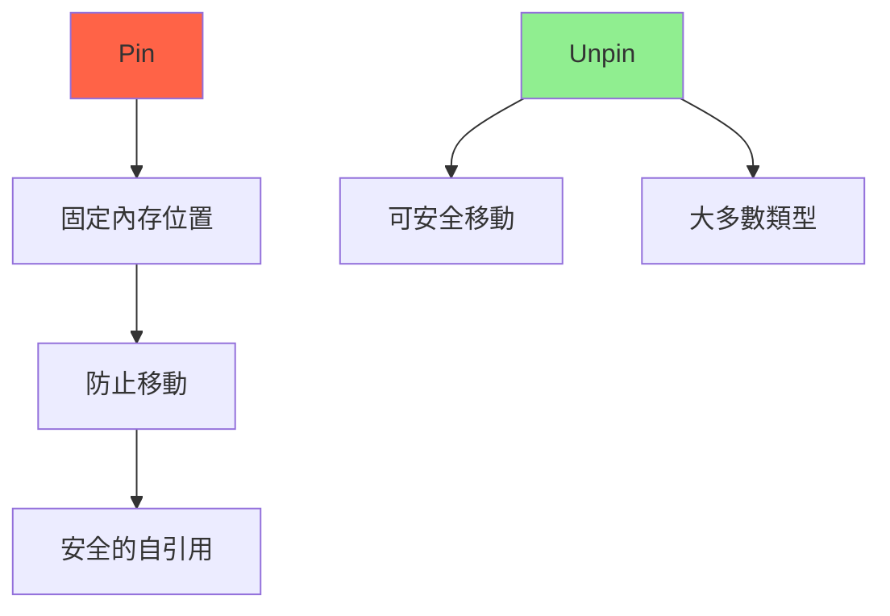

# Pin 與自引用結構 (Pin & Self-Referential Structs)

## 核心概念

**Pin<P>**: 防止類型 T 在內存中移動的智能指針包裝器。

**為什麼需要 Pin?**
- **自引用結構**: 結構體內部的指針指向自身的其他字段
- **異步 Future**: async/await 生成的狀態機可能包含自引用
- **內存安全**: 防止懸垂指針



---

## 自引用問題

### 問題演示

```rust
// ❌ 不安全的自引用結構
struct SelfReferential {
    data: String,
    pointer: *const String, // 指向 self.data
}

impl SelfReferential {
    fn new(s: &str) -> Self {
        let data = s.to_string();
        let pointer = &data as *const String;
        Self { data, pointer }
    }
    
    fn get_data(&self) -> &str {
        unsafe { &*self.pointer } // 危險！
    }
}

fn main() {
    let mut sr = SelfReferential::new("hello");
    
    // 移動結構體 -> 指針失效
    let sr2 = sr; // data 被移動，pointer 現在指向無效內存
    
    // println!("{}", sr2.get_data()); // 懸垂指針！UB!
}
```

**問題**: Rust 默認所有類型都可以移動，移動後原位置的內存可能被釋放或重用。

---

## Pin 的解決方案

### Pin<Box<T>>

```rust
use std::pin::Pin;

struct SelfRef {
    data: String,
    pointer: *const String,
}

impl SelfRef {
    fn new(s: &str) -> Pin<Box<Self>> {
        let mut boxed = Box::new(SelfRef {
            data: s.to_string(),
            pointer: std::ptr::null(),
        });
        
        // 設置自引用指針
        let ptr = &boxed.data as *const String;
        unsafe {
            let mut_ref = Pin::get_unchecked_mut(Pin::new(&mut boxed));
            mut_ref.pointer = ptr;
        }
        
        Pin::new(boxed)
    }
    
    fn get_data(self: Pin<&Self>) -> &str {
        unsafe { &*self.pointer }
    }
}

fn main() {
    let sr = SelfRef::new("hello");
    println!("{}", sr.as_ref().get_data()); // 安全！
    
    // let sr2 = sr; // 編譯錯誤：Pin<Box<T>> 不能移動
}
```

---

## Unpin Trait

**Unpin**: 標記 trait，表示類型可以安全地從 Pin 中移出。

```rust
// 大多數類型自動實現 Unpin
let x = 42;
let mut pinned = Pin::new(&x);
let moved = *pinned; // OK: i32 implements Unpin

// 編譯器自動實現 Unpin 的條件：
// - 不包含 !Unpin 字段
// - 不是手動標記為 !Unpin
```

**手動標記 !Unpin**:

```rust
use std::marker::PhantomPinned;

struct NotUnpin {
    data: String,
    pointer: *const String,
    _pin: PhantomPinned, // 標記為 !Unpin
}

// NotUnpin 不能從 Pin 中移出
```

---

## Pin API

### 創建 Pin

```rust
use std::pin::Pin;

// 1. Pin 棧上值（需要 unsafe）
let x = 42;
let pinned = unsafe { Pin::new_unchecked(&x) };

// 2. Pin 堆上值
let boxed = Box::new(42);
let pinned = Box::pin(42); // Pin<Box<i32>>

// 3. Pin 引用
let x = 42;
let mut_ref = &mut x;
let pinned = Pin::new(mut_ref); // Pin<&mut i32>
```

### Pin 方法

```rust
use std::pin::Pin;

let mut value = String::from("hello");
let mut pinned = Pin::new(&mut value);

// as_ref: 獲取共享引用
let ref_pin: Pin<&String> = pinned.as_ref();

// as_mut: 獲取可變引用
let mut_pin: Pin<&mut String> = pinned.as_mut();

// get_ref: 獲取 &T (如果 T: Unpin)
let reference: &String = Pin::get_ref(pinned.as_ref());

// get_mut: 獲取 &mut T (如果 T: Unpin)
let mut_reference: &mut String = Pin::get_mut(pinned.as_mut());

// unsafe: 獲取 &mut T (不檢查 Unpin)
unsafe {
    let unchecked: &mut String = Pin::get_unchecked_mut(pinned.as_mut());
}
```

---

## 實戰案例

### 案例 1: 手動實現 Future

```rust
use std::pin::Pin;
use std::task::{Context, Poll};
use std::future::Future;

// 自引用 Future
struct SelfRefFuture {
    data: String,
    pointer: *const String,
}

impl Future for SelfRefFuture {
    type Output = ();
    
    fn poll(self: Pin<&mut Self>, cx: &mut Context<'_>) -> Poll<Self::Output> {
        // self 是 Pin<&mut Self>，保證不會移動
        let data = unsafe { &*self.pointer };
        println!("Data: {}", data);
        Poll::Ready(())
    }
}

// 使用 async/await（編譯器自動處理 Pin）
async fn async_example() {
    let data = String::from("hello");
    let reference = &data; // 自引用
    
    // 編譯器生成的狀態機會正確處理 Pin
    println!("{}", reference);
}
```

### 案例 2: 侵入式鏈表（Pin 版本）

```rust
use std::pin::Pin;
use std::marker::PhantomPinned;

struct Node {
    data: i32,
    next: Option<*mut Node>,
    _pin: PhantomPinned, // 標記為 !Unpin
}

impl Node {
    fn new(data: i32) -> Pin<Box<Self>> {
        Box::pin(Node {
            data,
            next: None,
            _pin: PhantomPinned,
        })
    }
    
    fn set_next(self: Pin<&mut Self>, next: *mut Node) {
        unsafe {
            let this = Pin::get_unchecked_mut(self);
            this.next = Some(next);
        }
    }
}

fn main() {
    let mut node1 = Node::new(1);
    let mut node2 = Node::new(2);
    
    // 設置鏈接
    let node2_ptr = &*node2 as *const Node as *mut Node;
    node1.as_mut().set_next(node2_ptr);
    
    // node1 和 node2 不能移動
}
```

### 案例 3: 使用 pin-project

**pin-project**: 簡化 Pin 結構體的實現

```toml
[dependencies]
pin-project = "1.1"
```

```rust
use pin_project::pin_project;
use std::pin::Pin;

#[pin_project]
struct Struct<T, U> {
    #[pin]
    pinned_field: T,    // 需要固定的字段
    
    unpinned_field: U,  // 可以移動的字段
}

impl<T, U> Struct<T, U> {
    fn method(self: Pin<&mut Self>) {
        let this = self.project();
        
        // this.pinned_field 是 Pin<&mut T>
        // this.unpinned_field 是 &mut U
    }
}
```

**完整示例**:

```rust
use pin_project::pin_project;
use std::pin::Pin;
use std::marker::PhantomPinned;

#[pin_project]
struct SelfReferential {
    #[pin]
    data: String,
    
    pointer: *const String,
    
    #[pin]
    _pin: PhantomPinned,
}

impl SelfReferential {
    fn new(s: &str) -> Pin<Box<Self>> {
        let mut boxed = Box::new(SelfReferential {
            data: s.to_string(),
            pointer: std::ptr::null(),
            _pin: PhantomPinned,
        });
        
        let ptr = &boxed.data as *const String;
        unsafe {
            let mut_ref = Pin::as_mut(&mut Pin::new(boxed));
            let this = Pin::get_unchecked_mut(mut_ref);
            this.pointer = ptr;
        }
        
        Pin::new(boxed)
    }
    
    fn get_data(self: Pin<&Self>) -> &str {
        unsafe { &*self.pointer }
    }
}
```

---

## 異步中的 Pin

### async/await 自動處理

```rust
async fn example() {
    let data = String::from("hello");
    let reference = &data; // 自引用
    
    // await 點可能導致狀態機保存局部變量
    tokio::time::sleep(std::time::Duration::from_secs(1)).await;
    
    println!("{}", reference); // 編譯器保證安全
}
```

**編譯器生成的狀態機**:

```rust
// 簡化版
struct ExampleFuture {
    state: State,
}

enum State {
    Start,
    Waiting {
        data: String,
        reference: *const String, // 自引用！
        timer: Timer,
    },
    Done,
}

// Future 必須是 Pin<&mut Self>
impl Future for ExampleFuture {
    type Output = ();
    
    fn poll(self: Pin<&mut Self>, cx: &mut Context<'_>) -> Poll<()> {
        // Pin 保證狀態機不會移動
        // ...
    }
}
```

---

## 最佳實踐

### 1. 優先使用安全抽象

```rust
// ❌ 不好：手動管理 Pin
struct MyStruct {
    data: String,
    ptr: *const String,
}

// ✅ 好：使用 pin-project
#[pin_project]
struct MyStruct {
    #[pin]
    data: String,
    ptr: *const String,
}
```

### 2. 理解 Unpin

```rust
// 大多數類型實現 Unpin
fn works_with_unpin<T: Unpin>(value: Pin<&mut T>) {
    let unpinned = Pin::get_mut(value); // OK
}

// 需要 !Unpin 的場景很少
fn needs_not_unpin<T>(value: Pin<&mut T>) {
    // 不能假設 T: Unpin
}
```

### 3. 避免不必要的 Pin

```rust
// ❌ 不好：不需要 Pin
fn process(data: Pin<&str>) {
    // str 實現 Unpin，不需要 Pin
}

// ✅ 好：直接使用引用
fn process(data: &str) {
    // 更簡單
}
```

### 4. 安全使用 unsafe

```rust
// 使用 Pin::get_unchecked_mut 時，確保：
// 1. 不會移動固定的值
// 2. 不會違反 Pin 的安全保證

unsafe {
    let unpinned = Pin::get_unchecked_mut(pinned);
    // 只修改非自引用字段
    unpinned.safe_field = 42;
    // 不要移動整個結構體
}
```

---

## 常見陷阱

### 1. 錯誤地移動 Pin

```rust
// ❌ 不好
let pinned = Box::pin(value);
let moved = *pinned; // 編譯錯誤（如果 value: !Unpin）
```

### 2. 不安全的自引用

```rust
// ❌ 不好：忘記標記 !Unpin
struct SelfRef {
    data: String,
    pointer: *const String,
    // 缺少 PhantomPinned
}

// 可能被移動，導致 UB
```

### 3. 在棧上 Pin

```rust
// ❌ 危險：棧上值可能被移動
fn dangerous() {
    let mut value = NotUnpin::new();
    let pinned = unsafe { Pin::new_unchecked(&mut value) };
    
    // 函數返回時，value 離開作用域
    // pinned 可能變成懸垂指針
}
```

---

## 參考資料 (References)

1. [Pin and Suffering (fasterthanlime)](https://fasterthanli.me/articles/pin-and-suffering)
2. [std::pin Documentation](https://doc.rust-lang.org/std/pin/)
3. [pin-project crate](https://docs.rs/pin-project/)
4. [Rust Async Book - Pinning](https://rust-lang.github.io/async-book/04_pinning/01_chapter.html)
5. [Why Rust needs Pin](https://without.boats/blog/pin/)
