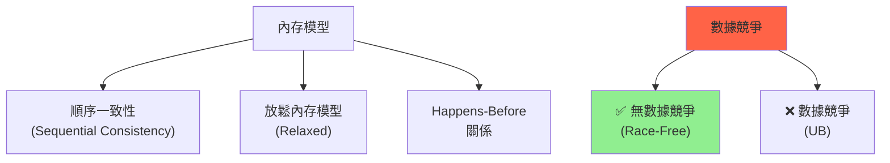

# 內存模型與數據競爭 (Memory Model & Data Races)

## 核心概念

**內存模型**: 定義多線程程序中內存訪問的規則和保證。

**數據競爭 (Data Race)**: 兩個或多個線程同時訪問同一內存位置，至少一個是寫操作，且沒有同步。



---

## Rust 內存模型

### 基於 C++11 內存模型

Rust 的內存模型基本等同於 C++11，提供：
- **原子操作**: 無數據競爭的共享內存訪問
- **內存順序**: 控制操作的可見性和順序
- **Happens-Before**: 定義操作間的因果關係

**保證**: 無數據競爭的 Rust 程序不會有未定義行為

---

## Happens-Before 關係

### 定義

**A happens-before B**: 操作 A 的效果對操作 B 可見。

**建立 Happens-Before 的方式**:
1. **程序順序**: 同一線程中，前面的語句 happens-before 後面的語句
2. **線程創建**: `thread::spawn` happens-before 新線程的第一條語句
3. **線程加入**: 線程的最後一條語句 happens-before `join` 返回
4. **鎖釋放/獲取**: 鎖的釋放 happens-before 同一鎖的獲取
5. **原子操作**: Release 寫 happens-before Acquire 讀

```rust
use std::sync::atomic::{AtomicBool, Ordering};
use std::thread;

static FLAG: AtomicBool = AtomicBool::new(false);
static mut DATA: i32 = 0;

fn main() {
    let t1 = thread::spawn(|| {
        unsafe { DATA = 42; }              // A
        FLAG.store(true, Ordering::Release); // B (Release)
    });
    
    let t2 = thread::spawn(|| {
        while !FLAG.load(Ordering::Acquire) {} // C (Acquire)
        let value = unsafe { DATA };          // D
        
        // 保證順序: A -> B -> C -> D
        // D 看到 A 的寫入（DATA = 42）
        assert_eq!(value, 42);
    });
    
    t1.join().unwrap();
    t2.join().unwrap();
}
```

---

## 數據競爭示例

### 什麼是數據競爭

```rust
use std::thread;

static mut SHARED: i32 = 0;

fn data_race_example() {
    let t1 = thread::spawn(|| {
        unsafe {
            SHARED = 42; // 寫操作
        }
    });
    
    let t2 = thread::spawn(|| {
        unsafe {
            let value = SHARED; // 讀操作
            println!("{}", value);
        }
    });
    
    t1.join().unwrap();
    t2.join().unwrap();
    
    // ❌ 數據競爭: 同時讀寫，無同步 -> UB
}
```

### Rust 如何防止數據競爭

**1. 編譯期檢查**:

```rust
fn compile_time_prevention() {
    let mut data = vec![1, 2, 3];
    
    let t1 = thread::spawn(move || {
        data.push(4); // data 被移動到 t1
    });
    
    // let t2 = thread::spawn(move || {
    //     data.push(5); // 編譯錯誤: data 已被移動
    // });
    
    t1.join().unwrap();
}
```

**2. Send 和 Sync Trait**:

```rust
// Send: 可以安全地在線程間轉移所有權
// Sync: 可以安全地在線程間共享引用

// Rc<T> 不是 Send（引用計數不是原子的）
// use std::rc::Rc;
// let rc = Rc::new(5);
// thread::spawn(move || {
//     println!("{}", rc); // 編譯錯誤
// });

// Arc<T> 是 Send（原子引用計數）
use std::sync::Arc;
let arc = Arc::new(5);
thread::spawn(move || {
    println!("{}", arc); // OK
});
```

---

## 內存順序 (Memory Ordering)

### 五種順序

```rust
pub enum Ordering {
    Relaxed,  // 最弱：只保證原子性
    Acquire,  // 讀操作：之後的操作不能重排到之前
    Release,  // 寫操作：之前的操作不能重排到之後
    AcqRel,   // 讀-修改-寫：Acquire + Release
    SeqCst,   // 最強：順序一致性
}
```

### Relaxed - 無同步

```rust
use std::sync::atomic::{AtomicU64, Ordering};
use std::thread;

static X: AtomicU64 = AtomicU64::new(0);
static Y: AtomicU64 = AtomicU64::new(0);

fn relaxed_example() {
    let t1 = thread::spawn(|| {
        X.store(1, Ordering::Relaxed); // A
        Y.store(1, Ordering::Relaxed); // B
    });
    
    let t2 = thread::spawn(|| {
        let y = Y.load(Ordering::Relaxed); // C
        let x = X.load(Ordering::Relaxed); // D
        
        // 可能看到: y=1, x=0
        // B 和 A 可能被重排，或 CPU 緩存導致
        println!("x={}, y={}", x, y);
    });
    
    t1.join().unwrap();
    t2.join().unwrap();
}
```

### Acquire/Release - 同步點

```rust
use std::sync::atomic::{AtomicBool, Ordering};
use std::thread;

static FLAG: AtomicBool = AtomicBool::new(false);
static mut DATA: i32 = 0;

fn acquire_release_example() {
    let writer = thread::spawn(|| {
        unsafe { DATA = 42; }              // A
        FLAG.store(true, Ordering::Release); // B: Release
        // A happens-before B
    });
    
    let reader = thread::spawn(|| {
        while !FLAG.load(Ordering::Acquire) {} // C: Acquire
        let value = unsafe { DATA };          // D
        // C happens-before D
        // B synchronizes-with C
        // 因此 A happens-before D
        
        assert_eq!(value, 42);
    });
    
    writer.join().unwrap();
    reader.join().unwrap();
}
```

### SeqCst - 順序一致性

```rust
use std::sync::atomic::{AtomicBool, Ordering};
use std::thread;
use std::sync::Arc;

fn seqcst_example() {
    let x = Arc::new(AtomicBool::new(false));
    let y = Arc::new(AtomicBool::new(false));
    let z = Arc::new(AtomicBool::new(false));
    
    let x1 = x.clone();
    let t1 = thread::spawn(move || {
        x1.store(true, Ordering::SeqCst); // A
    });
    
    let y1 = y.clone();
    let t2 = thread::spawn(move || {
        y1.store(true, Ordering::SeqCst); // B
    });
    
    let x2 = x.clone();
    let y2 = y.clone();
    let z1 = z.clone();
    let t3 = thread::spawn(move || {
        while !x2.load(Ordering::SeqCst) {} // C
        if y2.load(Ordering::SeqCst) {       // D
            z1.store(true, Ordering::SeqCst);
        }
    });
    
    let x3 = x.clone();
    let y3 = y.clone();
    let z2 = z.clone();
    let t4 = thread::spawn(move || {
        while !y3.load(Ordering::SeqCst) {} // E
        if x3.load(Ordering::SeqCst) {       // F
            z2.store(true, Ordering::SeqCst);
        }
    });
    
    t1.join().unwrap();
    t2.join().unwrap();
    t3.join().unwrap();
    t4.join().unwrap();
    
    // SeqCst 保證：至少有一個線程設置 z = true
    // (因為存在全局順序：要麼 A->B，要麼 B->A)
}
```

---

## 實戰案例

### 案例 1: 自旋鎖實現

```rust
use std::sync::atomic::{AtomicBool, Ordering};
use std::cell::UnsafeCell;

pub struct SpinLock<T> {
    locked: AtomicBool,
    data: UnsafeCell<T>,
}

unsafe impl<T: Send> Sync for SpinLock<T> {}

impl<T> SpinLock<T> {
    pub const fn new(data: T) -> Self {
        Self {
            locked: AtomicBool::new(false),
            data: UnsafeCell::new(data),
        }
    }
    
    pub fn lock(&self) -> SpinLockGuard<T> {
        // 使用 Acquire 確保臨界區操作不會重排到 lock 之前
        while self.locked.swap(true, Ordering::Acquire) {
            // 自旋等待
            std::hint::spin_loop();
        }
        
        SpinLockGuard { lock: self }
    }
}

pub struct SpinLockGuard<'a, T> {
    lock: &'a SpinLock<T>,
}

impl<T> std::ops::Deref for SpinLockGuard<'_, T> {
    type Target = T;
    
    fn deref(&self) -> &T {
        unsafe { &*self.lock.data.get() }
    }
}

impl<T> std::ops::DerefMut for SpinLockGuard<'_, T> {
    fn deref_mut(&mut self) -> &mut T {
        unsafe { &mut *self.lock.data.get() }
    }
}

impl<T> Drop for SpinLockGuard<'_, T> {
    fn drop(&mut self) {
        // 使用 Release 確保臨界區操作不會重排到 unlock 之後
        self.lock.locked.store(false, Ordering::Release);
    }
}
```

### 案例 2: 無鎖棧

```rust
use std::sync::atomic::{AtomicPtr, Ordering};
use std::ptr;

struct Node<T> {
    data: T,
    next: *mut Node<T>,
}

pub struct LockFreeStack<T> {
    head: AtomicPtr<Node<T>>,
}

impl<T> LockFreeStack<T> {
    pub const fn new() -> Self {
        Self {
            head: AtomicPtr::new(ptr::null_mut()),
        }
    }
    
    pub fn push(&self, data: T) {
        let new_node = Box::into_raw(Box::new(Node {
            data,
            next: ptr::null_mut(),
        }));
        
        // CAS 循環
        let mut head = self.head.load(Ordering::Relaxed);
        loop {
            unsafe { (*new_node).next = head; }
            
            // AcqRel: 
            // - Acquire: 讀取 head
            // - Release: 寫入 new_node，同步給其他線程
            match self.head.compare_exchange_weak(
                head,
                new_node,
                Ordering::AcqRel,
                Ordering::Acquire,
            ) {
                Ok(_) => return,
                Err(current) => head = current,
            }
        }
    }
    
    pub fn pop(&self) -> Option<T> {
        let mut head = self.head.load(Ordering::Acquire);
        loop {
            if head.is_null() {
                return None;
            }
            
            let next = unsafe { (*head).next };
            
            match self.head.compare_exchange_weak(
                head,
                next,
                Ordering::AcqRel,
                Ordering::Acquire,
            ) {
                Ok(_) => {
                    let node = unsafe { Box::from_raw(head) };
                    return Some(node.data);
                }
                Err(current) => head = current,
            }
        }
    }
}
```

---

## 檢測工具

### 1. ThreadSanitizer (TSan)

```bash
# 編譯時啟用 TSan
RUSTFLAGS="-Z sanitizer=thread" cargo +nightly run

# 檢測：
# - 數據競爭
# - 死鎖
# - 使用已釋放的內存
```

**示例輸出**:

```
WARNING: ThreadSanitizer: data race (pid=12345)
  Write of size 4 at 0x7fff12345678 by thread T1:
    #0 data_race_example src/main.rs:10
  
  Previous read of size 4 at 0x7fff12345678 by thread T2:
    #0 data_race_example src/main.rs:15
```

### 2. Loom - 並發測試框架

```toml
[dev-dependencies]
loom = "0.7"
```

```rust
#[cfg(loom)]
use loom::sync::atomic::{AtomicUsize, Ordering};
#[cfg(not(loom))]
use std::sync::atomic::{AtomicUsize, Ordering};

#[cfg(loom)]
#[test]
fn test_concurrent() {
    loom::model(|| {
        let x = Arc::new(AtomicUsize::new(0));
        
        let x1 = x.clone();
        let t1 = loom::thread::spawn(move || {
            x1.store(1, Ordering::Release);
        });
        
        let x2 = x.clone();
        let t2 = loom::thread::spawn(move || {
            x2.load(Ordering::Acquire);
        });
        
        t1.join().unwrap();
        t2.join().unwrap();
    });
}
```

---

## 最佳實踐

### 1. 選擇合適的內存順序

```rust
// ✅ 簡單計數器：Relaxed
let counter = AtomicU64::new(0);
counter.fetch_add(1, Ordering::Relaxed);

// ✅ 同步標誌：Acquire/Release
let flag = AtomicBool::new(false);
flag.store(true, Ordering::Release);
while !flag.load(Ordering::Acquire) {}

// ✅ 需要全局順序：SeqCst
let x = AtomicBool::new(false);
x.store(true, Ordering::SeqCst);
```

### 2. 避免數據競爭

```rust
// ❌ 不好：數據競爭
static mut SHARED: i32 = 0;
unsafe {
    SHARED = 42; // 多線程訪問 -> UB
}

// ✅ 好：使用 Mutex
let shared = Mutex::new(0);
*shared.lock().unwrap() = 42;

// ✅ 或使用原子類型
let shared = AtomicI32::new(0);
shared.store(42, Ordering::Relaxed);
```

### 3. 理解 Happens-Before

```rust
// 建立正確的同步關係
let flag = AtomicBool::new(false);
let data = Mutex::new(0);

// 寫線程
{
    *data.lock().unwrap() = 42;
    flag.store(true, Ordering::Release); // 同步點
}

// 讀線程
if flag.load(Ordering::Acquire) { // 同步點
    let value = *data.lock().unwrap();
    assert_eq!(value, 42); // 保證看到 42
}
```

---

## 參考資料 (References)

1. [Rust Memory Model](https://doc.rust-lang.org/nomicon/atomics.html)
2. [C++ Memory Model](https://en.cppreference.com/w/cpp/atomic/memory_order)
3. [ThreadSanitizer Documentation](https://github.com/google/sanitizers/wiki/ThreadSanitizerCppManual)
4. [Loom Documentation](https://docs.rs/loom/)
5. 《Rust Atomics and Locks》 (Mara Bos, 2023)
