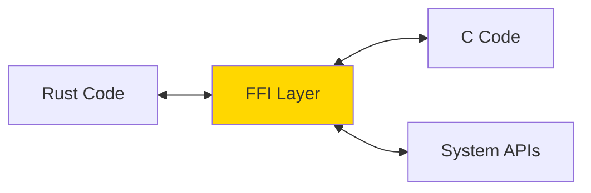

# FFI 與 C 語言互操作 (FFI & C Interoperability)

## 核心概念

**FFI (Foreign Function Interface)**: 允許 Rust 調用其他語言（主要是 C）的函數，或被其他語言調用。

**應用場景**:
- 使用現有 C 庫（如 OpenSSL、SQLite）
- 編寫系統級驅動程序
- 與操作系統 API 交互
- 為其他語言提供 Rust 庫



---

## 調用 C 函數

### 基本語法

```rust
// 聲明外部函數
extern "C" {
    fn abs(input: i32) -> i32;      // C 標準庫
    fn strlen(s: *const i8) -> usize;
}

fn main() {
    unsafe {
        println!("abs(-5) = {}", abs(-5));
        
        let c_str = b"Hello\0";
        let len = strlen(c_str.as_ptr() as *const i8);
        println!("strlen = {}", len);
    }
}
```

### 使用 libc Crate

```toml
[dependencies]
libc = "0.2"
```

```rust
use libc::{c_int, size_t};

extern "C" {
    fn abs(input: c_int) -> c_int;
    fn strlen(s: *const libc::c_char) -> size_t;
}

fn main() {
    unsafe {
        println!("abs(-5) = {}", abs(-5));
    }
}
```

---

## 類型對應

### C 與 Rust 類型映射

| C 類型 | Rust 類型 | libc 類型 |
|--------|----------|----------|
| `int` | `i32` | `c_int` |
| `unsigned int` | `u32` | `c_uint` |
| `long` | `i64` (Linux) / `i32` (Win32) | `c_long` |
| `size_t` | `usize` | `size_t` |
| `char` | `i8` | `c_char` |
| `float` | `f32` | `c_float` |
| `double` | `f64` | `c_double` |
| `void*` | `*mut c_void` | - |
| `const void*` | `*const c_void` | - |

### 結構體對應

```rust
#[repr(C)] // 使用 C 內存布局
struct Point {
    x: i32,
    y: i32,
}

// 對應 C 代碼:
// typedef struct {
//     int x;
//     int y;
// } Point;

extern "C" {
    fn process_point(p: *const Point);
}

fn main() {
    let p = Point { x: 10, y: 20 };
    unsafe {
        process_point(&p);
    }
}
```

---

## 字符串處理

### C 字符串 (Null-Terminated)

```rust
use std::ffi::{CStr, CString};
use std::os::raw::c_char;

// Rust String -> C String
fn rust_to_c() {
    let rust_str = "Hello, C!";
    let c_str = CString::new(rust_str).unwrap();
    
    unsafe {
        // c_str.as_ptr() 返回 *const c_char
        some_c_function(c_str.as_ptr());
    }
}

// C String -> Rust &str
unsafe fn c_to_rust(c_str: *const c_char) -> &'static str {
    let c_str = CStr::from_ptr(c_str);
    c_str.to_str().unwrap()
}

extern "C" {
    fn some_c_function(s: *const c_char);
}
```

**注意事項**:
- `CString` 會添加 null 字節 `\0`
- `CString::new()` 會檢查內部是否有 null 字節（會返回 Error）
- `CStr::from_ptr()` 假設指針有效且以 null 結尾

---

## 回調函數

### C 調用 Rust 回調

```rust
// Rust 回調函數
extern "C" fn callback(value: i32) {
    println!("Callback called with: {}", value);
}

extern "C" {
    // C 函數接受回調
    fn register_callback(cb: extern "C" fn(i32));
}

fn main() {
    unsafe {
        register_callback(callback);
    }
}
```

**對應 C 代碼**:

```c
// callback.h
typedef void (*callback_t)(int);
void register_callback(callback_t cb);

// callback.c
static callback_t g_callback = NULL;

void register_callback(callback_t cb) {
    g_callback = cb;
}

void trigger_callback(int value) {
    if (g_callback) {
        g_callback(value);
    }
}
```

---

## 實戰案例

### 案例 1: 調用 SQLite

```toml
[dependencies]
libsqlite3-sys = "0.27"
```

```rust
use libsqlite3_sys as ffi;
use std::ffi::CString;
use std::ptr;

fn main() -> Result<(), Box<dyn std::error::Error>> {
    unsafe {
        let mut db: *mut ffi::sqlite3 = ptr::null_mut();
        
        // 打開數據庫
        let filename = CString::new("test.db")?;
        let rc = ffi::sqlite3_open(filename.as_ptr(), &mut db);
        
        if rc != ffi::SQLITE_OK {
            let errmsg = ffi::sqlite3_errmsg(db);
            let errmsg = std::ffi::CStr::from_ptr(errmsg).to_str()?;
            panic!("Cannot open database: {}", errmsg);
        }
        
        // 執行 SQL
        let sql = CString::new("CREATE TABLE IF NOT EXISTS users (id INTEGER, name TEXT)")?;
        let rc = ffi::sqlite3_exec(
            db,
            sql.as_ptr(),
            None,      // 回調函數
            ptr::null_mut(),
            ptr::null_mut(),
        );
        
        if rc != ffi::SQLITE_OK {
            panic!("SQL error");
        }
        
        // 關閉數據庫
        ffi::sqlite3_close(db);
    }
    
    Ok(())
}
```

### 案例 2: bindgen 自動生成綁定

```toml
[build-dependencies]
bindgen = "0.69"
```

**build.rs**:

```rust
// build.rs
use std::env;
use std::path::PathBuf;

fn main() {
    // 告訴 cargo 鏈接 C 庫
    println!("cargo:rustc-link-lib=mylib");
    println!("cargo:rerun-if-changed=wrapper.h");
    
    // 生成綁定
    let bindings = bindgen::Builder::default()
        .header("wrapper.h")
        .parse_callbacks(Box::new(bindgen::CargoCallbacks))
        .generate()
        .expect("Unable to generate bindings");
    
    // 寫入綁定文件
    let out_path = PathBuf::from(env::var("OUT_DIR").unwrap());
    bindings
        .write_to_file(out_path.join("bindings.rs"))
        .expect("Couldn't write bindings!");
}
```

**使用生成的綁定**:

```rust
// src/lib.rs
#![allow(non_upper_case_globals)]
#![allow(non_camel_case_types)]
#![allow(non_snake_case)]

include!(concat!(env!("OUT_DIR"), "/bindings.rs"));

#[cfg(test)]
mod tests {
    use super::*;
    
    #[test]
    fn test_c_function() {
        unsafe {
            // 調用 C 函數
            let result = some_c_function(42);
            assert_eq!(result, 84);
        }
    }
}
```

---

## 為其他語言導出 Rust

### 創建 C 兼容的庫

```rust
// lib.rs
use std::os::raw::c_int;

#[no_mangle] // 防止名稱修飾
pub extern "C" fn add(a: c_int, b: c_int) -> c_int {
    a + b
}

#[no_mangle]
pub extern "C" fn create_string() -> *mut u8 {
    let s = String::from("Hello from Rust");
    let boxed = s.into_boxed_str();
    Box::into_raw(boxed) as *mut u8
}

#[no_mangle]
pub unsafe extern "C" fn free_string(ptr: *mut u8) {
    if !ptr.is_null() {
        let _ = Box::from_raw(ptr);
    }
}
```

**Cargo.toml**:

```toml
[lib]
crate-type = ["cdylib"]  # 動態庫
# 或
# crate-type = ["staticlib"]  # 靜態庫
```

**C 頭文件**:

```c
// mylib.h
#ifdef __cplusplus
extern "C" {
#endif

int add(int a, int b);
char* create_string(void);
void free_string(char* ptr);

#ifdef __cplusplus
}
#endif
```

**從 C 調用**:

```c
#include "mylib.h"
#include <stdio.h>

int main() {
    int result = add(5, 3);
    printf("5 + 3 = %d\n", result);
    
    char* s = create_string();
    printf("String: %s\n", s);
    free_string(s);
    
    return 0;
}
```

---

## 內存管理

### 跨 FFI 邊界的內存

**規則**:
- 誰分配，誰釋放
- 使用相同的分配器
- 小心所有權轉移

```rust
// ✅ 好：Rust 分配，Rust 釋放
#[no_mangle]
pub extern "C" fn create_buffer(size: usize) -> *mut u8 {
    let v = vec![0u8; size];
    Box::into_raw(v.into_boxed_slice()) as *mut u8
}

#[no_mangle]
pub unsafe extern "C" fn free_buffer(ptr: *mut u8, size: usize) {
    if !ptr.is_null() {
        let _ = Box::from_raw(std::slice::from_raw_parts_mut(ptr, size));
    }
}

// ❌ 不好：混用分配器
// C 用 malloc 分配，Rust 用 Box 釋放 -> UB
```

### 使用不透明指針

```rust
// Rust 端
pub struct Context {
    data: Vec<i32>,
}

#[no_mangle]
pub extern "C" fn context_new() -> *mut Context {
    Box::into_raw(Box::new(Context {
        data: vec![],
    }))
}

#[no_mangle]
pub unsafe extern "C" fn context_push(ctx: *mut Context, value: i32) {
    if !ctx.is_null() {
        (*ctx).data.push(value);
    }
}

#[no_mangle]
pub unsafe extern "C" fn context_free(ctx: *mut Context) {
    if !ctx.is_null() {
        drop(Box::from_raw(ctx));
    }
}
```

**C 端**:

```c
// C 代碼只看到不透明指針
typedef struct Context Context;

Context* context_new(void);
void context_push(Context* ctx, int value);
void context_free(Context* ctx);

int main() {
    Context* ctx = context_new();
    context_push(ctx, 42);
    context_free(ctx);
    return 0;
}
```

---

## 錯誤處理

### FFI 錯誤處理模式

```rust
use std::os::raw::c_int;

// 方案 1: 返回錯誤碼
#[no_mangle]
pub extern "C" fn divide(a: c_int, b: c_int, result: *mut c_int) -> c_int {
    if b == 0 {
        return -1; // 錯誤碼
    }
    
    unsafe {
        *result = a / b;
    }
    
    0 // 成功
}

// 方案 2: 設置全局錯誤
use std::cell::RefCell;

thread_local! {
    static LAST_ERROR: RefCell<Option<String>> = RefCell::new(None);
}

#[no_mangle]
pub extern "C" fn set_last_error(msg: *const std::os::raw::c_char) {
    if msg.is_null() {
        LAST_ERROR.with(|e| *e.borrow_mut() = None);
    } else {
        unsafe {
            let msg = std::ffi::CStr::from_ptr(msg).to_string_lossy();
            LAST_ERROR.with(|e| *e.borrow_mut() = Some(msg.to_string()));
        }
    }
}

#[no_mangle]
pub extern "C" fn get_last_error() -> *const std::os::raw::c_char {
    LAST_ERROR.with(|e| {
        e.borrow()
            .as_ref()
            .map(|s| s.as_ptr() as *const _)
            .unwrap_or(std::ptr::null())
    })
}
```

---

## 最佳實踐

### 1. 使用 repr(C)

```rust
// ✅ 與 C 兼容
#[repr(C)]
struct Data {
    x: i32,
    y: i32,
}

// ❌ 不兼容（Rust 默認布局）
struct Data {
    x: i32,
    y: i32,
}
```

### 2. 添加安全包裝

```rust
// FFI 層（unsafe）
mod ffi {
    use std::os::raw::c_int;
    
    extern "C" {
        pub fn c_function(x: c_int) -> c_int;
    }
}

// 安全包裝層
pub fn safe_function(x: i32) -> Result<i32, &'static str> {
    if x < 0 {
        return Err("x must be non-negative");
    }
    
    let result = unsafe { ffi::c_function(x) };
    
    if result < 0 {
        Err("C function returned error")
    } else {
        Ok(result)
    }
}
```

### 3. 文檔化安全要求

```rust
/// 從裸指針創建字符串
///
/// # Safety
///
/// - `ptr` 必須指向有效的 null 結尾的 C 字符串
/// - `ptr` 必須在整個函數執行期間保持有效
/// - 返回的 &str 生命週期不能超過 `ptr` 的有效期
pub unsafe fn c_str_to_rust(ptr: *const i8) -> &'static str {
    std::ffi::CStr::from_ptr(ptr).to_str().unwrap()
}
```

---

## 參考資料 (References)

1. [The Rustonomicon - FFI](https://doc.rust-lang.org/nomicon/ffi.html)
2. [bindgen User Guide](https://rust-lang.github.io/rust-bindgen/)
3. [libc Documentation](https://docs.rs/libc/)
4. [cbindgen](https://github.com/eqrion/cbindgen) - 生成 C 頭文件
5. 《Programming Rust》 (O'Reilly, 2021) - Chapter 22: Foreign Functions
