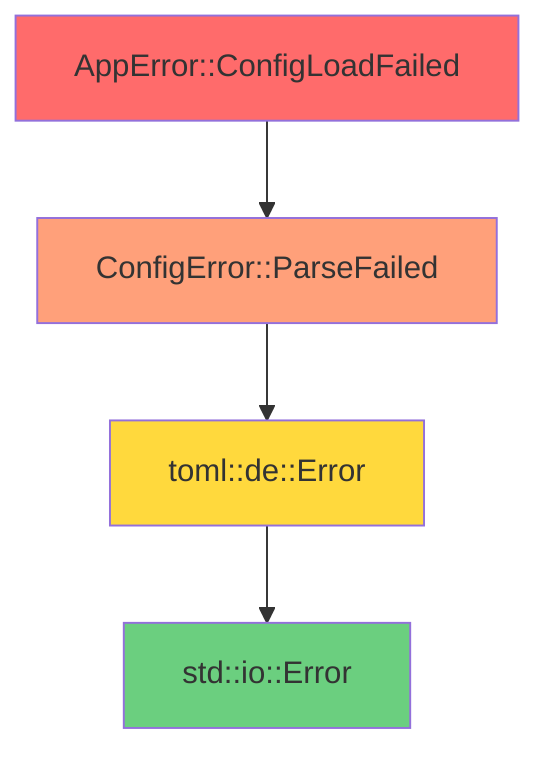

# 自定義錯誤類型與 thiserror

> 基於 Rust 1.90+ (2025) | 構建健壯的錯誤處理體系

## 📋 概述

良好的錯誤處理不僅要能捕獲錯誤,更要能清晰地傳達錯誤信息、追溯錯誤來源。本章介紹如何設計自定義錯誤類型,以及使用 `thiserror` 和 `anyhow` 簡化錯誤處理。

---

## 🎯 std::error::Error Trait

### Trait 定義

```rust
pub trait Error: Debug + Display {
    // 返回導致此錯誤的底層錯誤
    fn source(&self) -> Option<&(dyn Error + 'static)> {
        None
    }
    
    // 已棄用: 使用 Display 替代
    fn description(&self) -> &str {
        "description() is deprecated; use Display"
    }
    
    // 已棄用
    fn cause(&self) -> Option<&dyn Error> {
        self.source()
    }
}
```

**核心要求**:
1. 必須實現 `Debug` - 供開發者查看詳細信息
2. 必須實現 `Display` - 供最終用戶查看錯誤訊息
3. 可選實現 `source()` - 提供錯誤鏈 (error chain)

### 標準庫錯誤訊息慣例

```rust
// ✅ 好: 小寫開頭,無句號
"invalid digit found in string"
"permission denied"
"connection refused"

// ❌ 不好
"Invalid digit found in string."  // 大寫開頭
"Permission denied!"              // 有句號
```

**原因**: 錯誤訊息通常會被組合或嵌入其他訊息中。

---

## 🔧 手動實現自定義錯誤

### 基本實現

```rust
use std::fmt;
use std::error::Error;
use std::io;
use std::num::ParseIntError;

#[derive(Debug)]
pub enum AppError {
    Io(io::Error),
    Parse(ParseIntError),
    NotFound(String),
    InvalidInput { field: String, reason: String },
}

// 實現 Display
impl fmt::Display for AppError {
    fn fmt(&self, f: &mut fmt::Formatter<'_>) -> fmt::Result {
        match self {
            AppError::Io(e) => write!(f, "io error: {}", e),
            AppError::Parse(e) => write!(f, "parse error: {}", e),
            AppError::NotFound(item) => write!(f, "not found: {}", item),
            AppError::InvalidInput { field, reason } => {
                write!(f, "invalid input in field '{}': {}", field, reason)
            }
        }
    }
}

// 實現 Error trait
impl Error for AppError {
    fn source(&self) -> Option<&(dyn Error + 'static)> {
        match self {
            AppError::Io(e) => Some(e),
            AppError::Parse(e) => Some(e),
            _ => None,
        }
    }
}

// 實現 From 以支持 ? 運算子
impl From<io::Error> for AppError {
    fn from(e: io::Error) -> Self {
        AppError::Io(e)
    }
}

impl From<ParseIntError> for AppError {
    fn from(e: ParseIntError) -> Self {
        AppError::Parse(e)
    }
}
```

### 使用範例

```rust
use std::fs;

fn read_and_parse(path: &str) -> Result<i32, AppError> {
    // io::Error 自動轉換為 AppError::Io
    let content = fs::read_to_string(path)?;
    
    // ParseIntError 自動轉換為 AppError::Parse
    let number = content.trim().parse()?;
    
    Ok(number)
}

fn validate_user(name: &str, age: i32) -> Result<(), AppError> {
    if name.is_empty() {
        return Err(AppError::InvalidInput {
            field: "name".to_string(),
            reason: "cannot be empty".to_string(),
        });
    }
    
    if age < 0 || age > 150 {
        return Err(AppError::InvalidInput {
            field: "age".to_string(),
            reason: format!("must be between 0 and 150, got {}", age),
        });
    }
    
    Ok(())
}
```

---

## 🚀 使用 thiserror 簡化實現

### 安裝

```toml
[dependencies]
thiserror = "1.0"
```

### 基本用法

```rust
use thiserror::Error;

#[derive(Error, Debug)]
pub enum AppError {
    // 標註型變體 (marker variant)
    #[error("operation failed")]
    OperationFailed,
    
    // Tuple 型變體
    #[error("invalid input: {0}")]
    InvalidInput(String),
    
    // Struct 型變體
    #[error("database connection failed: {host}")]
    ConnectionFailed { host: String },
    
    // 包含其他錯誤 (使用 #[from])
    #[error("io error: {source}")]
    Io {
        #[from]
        source: std::io::Error,
    },
    
    // 包含錯誤來源 (使用 #[source])
    #[error("network error")]
    Network {
        #[source]
        source: reqwest::Error,
    },
}
```

**thiserror 自動生成**:
1. `Display` 實現 (基於 `#[error]` 屬性)
2. `Error` trait 實現
3. `From` 實現 (如果使用 `#[from]`)

### #[from] vs #[source]

| 屬性 | From trait | Error::source() | 使用場景 |
|------|-----------|----------------|---------|
| `#[from]` | ✅ 生成 | ✅ 返回 | 需要使用 `?` 自動轉換 |
| `#[source]` | ❌ 不生成 | ✅ 返回 | 僅需錯誤鏈,不需自動轉換 |

**範例**:

```rust
use thiserror::Error;
use std::io;

#[derive(Error, Debug)]
pub enum ConfigError {
    // #[from]: 可以使用 io::Error? 自動轉換
    #[error("failed to read config file: {source}")]
    ReadFailed {
        #[from]
        source: io::Error,
    },
    
    // #[source]: 僅提供錯誤來源,需手動構造
    #[error("invalid config format")]
    InvalidFormat {
        #[source]
        source: toml::de::Error,
    },
}

fn load_config(path: &str) -> Result<Config, ConfigError> {
    // ✅ 自動轉換 (因為有 #[from])
    let content = std::fs::read_to_string(path)?;
    
    // ❌ 無法自動轉換 (沒有 From<toml::de::Error>)
    // let config: Config = toml::from_str(&content)?;
    
    // ✅ 手動構造
    let config: Config = toml::from_str(&content)
        .map_err(|source| ConfigError::InvalidFormat { source })?;
    
    Ok(config)
}
```

### 格式化語法

```rust
use thiserror::Error;

#[derive(Error, Debug)]
pub enum DataError {
    // 簡單訊息
    #[error("data store disconnected")]
    Disconnect,
    
    // 顯示變體內的值
    #[error("invalid id: {0}")]
    InvalidId(u64),
    
    // 命名字段
    #[error("query failed: table={table}, reason={reason}")]
    QueryFailed { table: String, reason: String },
    
    // 顯示底層錯誤
    #[error("database error: {source}")]
    Database {
        #[from]
        source: sqlx::Error,
    },
    
    // 條件格式化
    #[error("invalid value {value} for field {field}")]
    InvalidValue { field: String, value: String },
    
    // 使用 Display 格式化
    #[error("timeout after {0:?}")]
    Timeout(std::time::Duration),
}
```

### 透明錯誤 (Transparent Errors)

```rust
use thiserror::Error;

#[derive(Error, Debug)]
pub enum MyError {
    // transparent: 直接使用內部錯誤的 Display 和 source
    #[error(transparent)]
    Io(#[from] std::io::Error),
    
    #[error(transparent)]
    Other(#[from] anyhow::Error),
}

// 等價於手動實現:
impl fmt::Display for MyError {
    fn fmt(&self, f: &mut fmt::Formatter) -> fmt::Result {
        match self {
            MyError::Io(e) => write!(f, "{}", e),
            MyError::Other(e) => write!(f, "{}", e),
        }
    }
}
```

**使用場景**: 封裝第三方錯誤,保持原始錯誤訊息。

---

## 🔗 錯誤鏈 (Error Chain)

### 什麼是錯誤鏈?

錯誤鏈允許追溯錯誤的完整路徑,從最底層的根本原因到最上層的業務錯誤。



### 實現錯誤鏈

```rust
use thiserror::Error;
use std::io;

#[derive(Error, Debug)]
pub enum DatabaseError {
    #[error("connection failed: {source}")]
    ConnectionFailed {
        #[source]
        source: io::Error,
    },
    
    #[error("query failed: {sql}")]
    QueryFailed {
        sql: String,
        #[source]
        source: Box<dyn std::error::Error + Send + Sync>,
    },
}

#[derive(Error, Debug)]
pub enum AppError {
    #[error("database operation failed")]
    Database {
        #[from]
        source: DatabaseError,
    },
    
    #[error("business logic error: {message}")]
    BusinessLogic {
        message: String,
        #[source]
        source: Option<Box<dyn std::error::Error + Send + Sync>>,
    },
}
```

### 遍歷錯誤鏈

```rust
fn print_error_chain(e: &dyn std::error::Error) {
    eprintln!("Error: {}", e);
    
    let mut source = e.source();
    let mut level = 1;
    
    while let Some(e) = source {
        eprintln!("  Caused by ({}): {}", level, e);
        source = e.source();
        level += 1;
    }
}

// 使用
fn main() {
    if let Err(e) = run_app() {
        print_error_chain(&e);
        std::process::exit(1);
    }
}
```

---

## 🎨 實戰設計模式

### 模式 1: 分層錯誤設計

```rust
use thiserror::Error;

// 底層: 數據訪問層錯誤
#[derive(Error, Debug)]
pub enum DataAccessError {
    #[error("database connection failed: {0}")]
    ConnectionFailed(String),
    
    #[error("query failed: {query}")]
    QueryFailed {
        query: String,
        #[source]
        source: sqlx::Error,
    },
    
    #[error("record not found: {table}/{id}")]
    NotFound { table: String, id: i64 },
}

// 中層: 業務邏輯層錯誤
#[derive(Error, Debug)]
pub enum BusinessError {
    #[error("user not found: {user_id}")]
    UserNotFound { user_id: i64 },
    
    #[error("insufficient permissions")]
    PermissionDenied,
    
    #[error("data access error")]
    DataAccess {
        #[from]
        source: DataAccessError,
    },
    
    #[error("validation failed: {0}")]
    Validation(String),
}

// 上層: API 層錯誤
#[derive(Error, Debug)]
pub enum ApiError {
    #[error("bad request: {0}")]
    BadRequest(String),
    
    #[error("unauthorized")]
    Unauthorized,
    
    #[error("internal server error")]
    Internal {
        #[from]
        source: BusinessError,
    },
}

// 轉換為 HTTP 狀態碼
impl ApiError {
    pub fn status_code(&self) -> u16 {
        match self {
            ApiError::BadRequest(_) => 400,
            ApiError::Unauthorized => 401,
            ApiError::Internal { source } => match source {
                BusinessError::UserNotFound { .. } => 404,
                BusinessError::PermissionDenied => 403,
                _ => 500,
            },
        }
    }
}
```

### 模式 2: 上下文豐富的錯誤

```rust
use thiserror::Error;

#[derive(Error, Debug)]
pub enum ProcessError {
    #[error("failed to process file '{path}': {reason}")]
    FileFailed {
        path: String,
        reason: String,
        #[source]
        source: std::io::Error,
    },
    
    #[error("validation failed at line {line}: {message}")]
    ValidationFailed {
        line: usize,
        message: String,
        content: String,  // 保留原始內容供調試
    },
    
    #[error("timeout processing {item} after {duration:?}")]
    Timeout {
        item: String,
        duration: std::time::Duration,
    },
}

// 使用
fn process_file(path: &str) -> Result<(), ProcessError> {
    std::fs::read_to_string(path)
        .map_err(|source| ProcessError::FileFailed {
            path: path.to_string(),
            reason: "failed to read".to_string(),
            source,
        })?;
    
    Ok(())
}
```

### 模式 3: 錯誤聚合

```rust
use thiserror::Error;

#[derive(Error, Debug)]
pub enum ValidationError {
    #[error("field '{field}' is required")]
    Required { field: String },
    
    #[error("field '{field}' has invalid format: {reason}")]
    InvalidFormat { field: String, reason: String },
    
    #[error("field '{field}' out of range: {value}")]
    OutOfRange { field: String, value: String },
}

#[derive(Debug)]
pub struct ValidationErrors {
    errors: Vec<ValidationError>,
}

impl ValidationErrors {
    pub fn new() -> Self {
        Self { errors: Vec::new() }
    }
    
    pub fn add(&mut self, error: ValidationError) {
        self.errors.push(error);
    }
    
    pub fn is_empty(&self) -> bool {
        self.errors.is_empty()
    }
    
    pub fn into_result(self) -> Result<(), Self> {
        if self.is_empty() {
            Ok(())
        } else {
            Err(self)
        }
    }
}

impl std::fmt::Display for ValidationErrors {
    fn fmt(&self, f: &mut std::fmt::Formatter) -> std::fmt::Result {
        writeln!(f, "Validation failed with {} errors:", self.errors.len())?;
        for (i, err) in self.errors.iter().enumerate() {
            writeln!(f, "  {}: {}", i + 1, err)?;
        }
        Ok(())
    }
}

impl std::error::Error for ValidationErrors {}

// 使用
fn validate_user(name: &str, age: i32, email: &str) -> Result<(), ValidationErrors> {
    let mut errors = ValidationErrors::new();
    
    if name.is_empty() {
        errors.add(ValidationError::Required {
            field: "name".to_string(),
        });
    }
    
    if age < 0 || age > 150 {
        errors.add(ValidationError::OutOfRange {
            field: "age".to_string(),
            value: age.to_string(),
        });
    }
    
    if !email.contains('@') {
        errors.add(ValidationError::InvalidFormat {
            field: "email".to_string(),
            reason: "missing @".to_string(),
        });
    }
    
    errors.into_result()
}
```

---

## 📦 thiserror 進階技巧

### 技巧 1: 自定義 Debug 輸出

```rust
use thiserror::Error;

#[derive(Error)]
#[error("authentication failed for user {username}")]
pub struct AuthError {
    username: String,
    password_hash: String,  // 敏感信息
}

// 自定義 Debug 避免洩露敏感信息
impl std::fmt::Debug for AuthError {
    fn fmt(&self, f: &mut std::fmt::Formatter) -> std::fmt::Result {
        f.debug_struct("AuthError")
            .field("username", &self.username)
            .field("password_hash", &"<redacted>")
            .finish()
    }
}
```

### 技巧 2: 泛型錯誤

```rust
use thiserror::Error;

#[derive(Error, Debug)]
pub enum RepositoryError<T: std::fmt::Display> {
    #[error("entity not found: {0}")]
    NotFound(T),
    
    #[error("duplicate entity: {0}")]
    Duplicate(T),
    
    #[error("database error")]
    Database {
        #[from]
        source: sqlx::Error,
    },
}

// 使用
type UserError = RepositoryError<i64>;  // User ID
type ProductError = RepositoryError<String>;  // Product SKU
```

### 技巧 3: 條件編譯

```rust
use thiserror::Error;

#[derive(Error, Debug)]
pub enum ConfigError {
    #[error("config file not found: {0}")]
    NotFound(String),
    
    #[cfg(feature = "toml")]
    #[error("toml parse error")]
    TomlParse {
        #[from]
        source: toml::de::Error,
    },
    
    #[cfg(feature = "json")]
    #[error("json parse error")]
    JsonParse {
        #[from]
        source: serde_json::Error,
    },
}
```

---

## 🎯 完整範例: 用戶管理系統

```rust
use thiserror::Error;
use std::collections::HashMap;

// 定義錯誤類型
#[derive(Error, Debug)]
pub enum UserError {
    #[error("user not found: {user_id}")]
    NotFound { user_id: u64 },
    
    #[error("user already exists: {username}")]
    AlreadyExists { username: String },
    
    #[error("invalid username: {reason}")]
    InvalidUsername { reason: String },
    
    #[error("invalid email: {email}")]
    InvalidEmail { email: String },
    
    #[error("database error")]
    Database {
        #[from]
        source: std::io::Error,  // 示例用 io::Error 代替實際 DB 錯誤
    },
}

// 用戶結構
#[derive(Debug, Clone)]
pub struct User {
    pub id: u64,
    pub username: String,
    pub email: String,
}

// 用戶倉儲
pub struct UserRepository {
    users: HashMap<u64, User>,
    next_id: u64,
}

impl UserRepository {
    pub fn new() -> Self {
        Self {
            users: HashMap::new(),
            next_id: 1,
        }
    }
    
    pub fn create(&mut self, username: String, email: String) -> Result<User, UserError> {
        // 驗證用戶名
        if username.len() < 3 {
            return Err(UserError::InvalidUsername {
                reason: "must be at least 3 characters".to_string(),
            });
        }
        
        if username.contains(char::is_whitespace) {
            return Err(UserError::InvalidUsername {
                reason: "cannot contain whitespace".to_string(),
            });
        }
        
        // 驗證郵箱
        if !email.contains('@') || !email.contains('.') {
            return Err(UserError::InvalidEmail {
                email: email.clone(),
            });
        }
        
        // 檢查是否已存在
        if self.users.values().any(|u| u.username == username) {
            return Err(UserError::AlreadyExists {
                username: username.clone(),
            });
        }
        
        // 創建用戶
        let user = User {
            id: self.next_id,
            username,
            email,
        };
        
        self.users.insert(user.id, user.clone());
        self.next_id += 1;
        
        Ok(user)
    }
    
    pub fn get(&self, user_id: u64) -> Result<&User, UserError> {
        self.users.get(&user_id)
            .ok_or(UserError::NotFound { user_id })
    }
    
    pub fn update_email(&mut self, user_id: u64, new_email: String) -> Result<(), UserError> {
        // 驗證郵箱
        if !new_email.contains('@') || !new_email.contains('.') {
            return Err(UserError::InvalidEmail {
                email: new_email,
            });
        }
        
        let user = self.users.get_mut(&user_id)
            .ok_or(UserError::NotFound { user_id })?;
        
        user.email = new_email;
        Ok(())
    }
    
    pub fn delete(&mut self, user_id: u64) -> Result<User, UserError> {
        self.users.remove(&user_id)
            .ok_or(UserError::NotFound { user_id })
    }
}

// 使用範例
fn main() {
    let mut repo = UserRepository::new();
    
    // 創建用戶
    match repo.create("alice".to_string(), "alice@example.com".to_string()) {
        Ok(user) => println!("創建用戶成功: {:?}", user),
        Err(e) => eprintln!("創建用戶失敗: {}", e),
    }
    
    // 創建重複用戶
    match repo.create("alice".to_string(), "alice2@example.com".to_string()) {
        Ok(_) => println!("不應該成功"),
        Err(UserError::AlreadyExists { username }) => {
            println!("預期的錯誤: 用戶 {} 已存在", username);
        }
        Err(e) => eprintln!("意外的錯誤: {}", e),
    }
    
    // 無效的用戶名
    match repo.create("ab".to_string(), "ab@example.com".to_string()) {
        Ok(_) => println!("不應該成功"),
        Err(UserError::InvalidUsername { reason }) => {
            println!("預期的錯誤: {}", reason);
        }
        Err(e) => eprintln!("意外的錯誤: {}", e),
    }
    
    // 獲取用戶
    match repo.get(1) {
        Ok(user) => println!("找到用戶: {:?}", user),
        Err(e) => eprintln!("獲取用戶失敗: {}", e),
    }
    
    // 獲取不存在的用戶
    match repo.get(999) {
        Ok(_) => println!("不應該成功"),
        Err(UserError::NotFound { user_id }) => {
            println!("預期的錯誤: 找不到用戶 {}", user_id);
        }
        Err(e) => eprintln!("意外的錯誤: {}", e),
    }
}
```

**輸出**:
```
創建用戶成功: User { id: 1, username: "alice", email: "alice@example.com" }
預期的錯誤: 用戶 alice 已存在
預期的錯誤: must be at least 3 characters
找到用戶: User { id: 1, username: "alice", email: "alice@example.com" }
預期的錯誤: 找不到用戶 999
```

---

## 🔍 常見陷阱

### 陷阱 1: 過度細分錯誤類型

```rust
// ❌ 過度細分
#[derive(Error, Debug)]
pub enum UserError {
    #[error("username too short")]
    UsernameTooShort,
    
    #[error("username too long")]
    UsernameTooLong,
    
    #[error("username contains space")]
    UsernameContainsSpace,
    
    #[error("username contains special char")]
    UsernameContainsSpecialChar,
    // ... 更多
}

// ✅ 適當聚合
#[derive(Error, Debug)]
pub enum UserError {
    #[error("invalid username: {reason}")]
    InvalidUsername { reason: String },
    
    #[error("invalid email: {email}")]
    InvalidEmail { email: String },
}
```

### 陷阱 2: 忘記 #[from]

```rust
// ❌ 需要手動轉換
#[derive(Error, Debug)]
pub enum AppError {
    #[error("io error")]
    Io {
        #[source]  // 沒有 #[from]
        source: std::io::Error,
    },
}

fn read_file() -> Result<String, AppError> {
    // 必須手動轉換
    let content = std::fs::read_to_string("file.txt")
        .map_err(|source| AppError::Io { source })?;
    Ok(content)
}

// ✅ 自動轉換
#[derive(Error, Debug)]
pub enum AppError {
    #[error("io error")]
    Io {
        #[from]  // 添加 #[from]
        source: std::io::Error,
    },
}

fn read_file() -> Result<String, AppError> {
    // 自動轉換
    let content = std::fs::read_to_string("file.txt")?;
    Ok(content)
}
```

### 陷阱 3: 錯誤訊息不清晰

```rust
// ❌ 不好: 缺少上下文
#[derive(Error, Debug)]
pub enum Error {
    #[error("failed")]
    Failed,
    
    #[error("invalid")]
    Invalid,
}

// ✅ 好: 提供清晰的上下文
#[derive(Error, Debug)]
pub enum Error {
    #[error("failed to connect to database at {host}:{port}")]
    ConnectionFailed { host: String, port: u16 },
    
    #[error("invalid configuration: {field} = {value}")]
    InvalidConfig { field: String, value: String },
}
```

---

## 📊 性能考量

### 錯誤類型大小

```rust
use std::mem::size_of;

#[derive(Debug)]
pub enum SmallError {
    A,
    B,
    C,
}

#[derive(Debug)]
pub enum LargeError {
    A(String),
    B(String),
    C(Vec<u8>),
}

fn main() {
    println!("SmallError: {} bytes", size_of::<SmallError>());  // 1 byte
    println!("LargeError: {} bytes", size_of::<LargeError>());  // 32 bytes
    
    println!("Result<(), SmallError>: {} bytes", 
        size_of::<Result<(), SmallError>>());  // 2 bytes
    println!("Result<(), LargeError>: {} bytes", 
        size_of::<Result<(), LargeError>>());  // 40 bytes
}
```

**優化建議**:
```rust
// ✅ 使用 Box 減小 Result 大小
#[derive(Error, Debug)]
pub enum Error {
    #[error("small error")]
    Small,
    
    #[error("large error: {0}")]
    Large(Box<String>),  // Box 化大型變體
}
```

---

## 🎓 最佳實踐總結

1. **使用 thiserror 定義庫錯誤**: 為庫提供清晰的錯誤類型
2. **提供豐富的上下文**: 錯誤訊息應包含足夠的調試信息
3. **實現錯誤鏈**: 使用 `#[source]` 保留底層錯誤
4. **適當使用 #[from]**: 簡化錯誤轉換,支持 `?` 運算子
5. **分層設計**: 不同層次使用不同的錯誤類型
6. **避免過度細分**: 相似的錯誤可以聚合
7. **考慮性能**: 使用 `Box` 減小大型錯誤的影響

---

## 📖 參考資料

1. [thiserror Documentation](https://docs.rs/thiserror/)
2. [The Rust Programming Language - Error Handling](https://doc.rust-lang.org/book/ch09-00-error-handling.html)
3. [std::error::Error Documentation](https://doc.rust-lang.org/std/error/trait.Error.html)
4. [Error Handling in Rust](https://blog.burntsushi.net/rust-error-handling/)
5. [Rust API Guidelines - Error Types](https://rust-lang.github.io/api-guidelines/interoperability.html#error-types-are-meaningful-and-well-behaved-c-good-err)

---

*最後更新: 2025-01-17*  
*Rust 版本: 1.90+*
