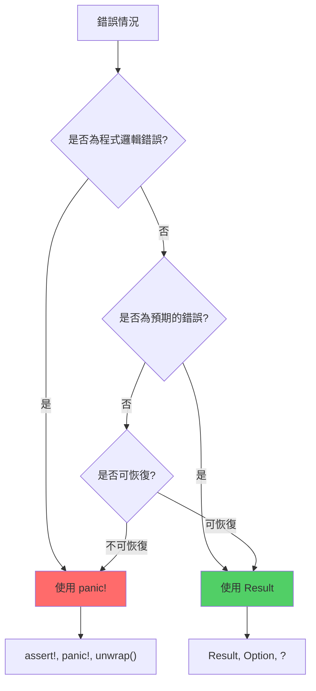

# Panic 處理與恢復

> 基於 Rust 1.90+ (2025) | 理解不可恢復錯誤與優雅處理

## 📋 概述

Rust 中的錯誤分為兩類:
- **可恢復錯誤** (Recoverable Errors): 使用 `Result<T, E>`
- **不可恢復錯誤** (Unrecoverable Errors): 使用 `panic!`

本章深入探討 panic 的機制、處理方式以及最佳實踐。

---

## 🎯 Panic 基礎

### 什麼時候會 Panic?

```rust
// 1. 顯式調用 panic!
panic!("Something went wrong!");

// 2. 數組越界
let v = vec![1, 2, 3];
let x = v[10];  // panic: index out of bounds

// 3. unwrap None 或 Err
let x: Option<i32> = None;
x.unwrap();  // panic: called `Option::unwrap()` on a `None` value

// 4. 整數溢出 (debug 模式)
let x: u8 = 255;
let y = x + 1;  // debug 模式會 panic, release 模式會溢出

// 5. 除以零
let x = 10 / 0;  // panic: attempt to divide by zero
```

### panic! 宏的用法

```rust
// 簡單消息
panic!("Critical error");

// 格式化消息
let user_id = 42;
panic!("User {} not found", user_id);

// 使用 format! 語法
panic!("Error code: 0x{:x}", error_code);
```

---

## 🔧 Panic 的兩種模式

### 模式 1: Unwind (展開,默認)

**Cargo.toml**:
```toml
[profile.dev]
panic = "unwind"  # 默認值

[profile.release]
panic = "unwind"  # 默認值
```

**特性**:
- Panic 時會展開堆疊
- 執行析構函數 (Drop)
- 清理資源
- 可以捕獲 panic (使用 `catch_unwind`)
- 二進制文件較大

**範例**:
```rust
struct Resource {
    name: String,
}

impl Drop for Resource {
    fn drop(&mut self) {
        println!("Cleaning up resource: {}", self.name);
    }
}

fn main() {
    let _res = Resource {
        name: "Database connection".to_string(),
    };
    
    panic!("Oops!");
    // 輸出: Cleaning up resource: Database connection
    // 然後 panic
}
```

### 模式 2: Abort (中止)

**Cargo.toml**:
```toml
[profile.release]
panic = "abort"  # Release 模式使用 abort
```

**特性**:
- Panic 時直接終止程序
- 不執行析構函數
- 不清理資源
- 無法捕獲 panic
- 二進制文件較小
- 啟動速度更快

**使用場景**:
- 嵌入式系統
- 性能關鍵應用
- 不需要資源清理的場景

---

## 🛡️ 捕獲 Panic

### 使用 catch_unwind

```rust
use std::panic;

fn risky_operation() -> i32 {
    panic!("Something went wrong!");
}

fn main() {
    let result = panic::catch_unwind(|| {
        risky_operation()
    });
    
    match result {
        Ok(value) => println!("Success: {}", value),
        Err(e) => {
            println!("Caught panic!");
            
            // 嘗試提取 panic 消息
            if let Some(s) = e.downcast_ref::<&str>() {
                println!("Panic message: {}", s);
            } else if let Some(s) = e.downcast_ref::<String>() {
                println!("Panic message: {}", s);
            } else {
                println!("Unknown panic payload");
            }
        }
    }
    
    println!("Program continues...");
}
```

**輸出**:
```
Caught panic!
Panic message: Something went wrong!
Program continues...
```

### AssertUnwindSafe 包裝器

```rust
use std::panic::{catch_unwind, AssertUnwindSafe};

fn main() {
    let mut counter = 0;
    
    // ❌ 錯誤: &mut 不是 UnwindSafe
    // let result = catch_unwind(|| {
    //     counter += 1;
    // });
    
    // ✅ 使用 AssertUnwindSafe
    let result = catch_unwind(AssertUnwindSafe(|| {
        counter += 1;
        panic!("Oops!");
    }));
    
    println!("counter = {}", counter);  // counter = 0 (panic 後未修改)
}
```

**注意**: `AssertUnwindSafe` 是開發者對編譯器的承諾,表示即使 panic,數據仍然是安全的。

---

## 🎨 自定義 Panic Hook

### 基本用法

```rust
use std::panic;

fn main() {
    // 設置自定義 panic hook
    panic::set_hook(Box::new(|panic_info| {
        eprintln!("==================");
        eprintln!("PANIC DETECTED!");
        eprintln!("==================");
        
        // 提取位置信息
        if let Some(location) = panic_info.location() {
            eprintln!(
                "Panic occurred in file '{}' at line {}:{}",
                location.file(),
                location.line(),
                location.column()
            );
        }
        
        // 提取 panic 消息
        if let Some(s) = panic_info.payload().downcast_ref::<&str>() {
            eprintln!("Panic message: {}", s);
        } else if let Some(s) = panic_info.payload().downcast_ref::<String>() {
            eprintln!("Panic message: {}", s);
        }
        
        eprintln!("==================");
    }));
    
    panic!("Test panic");
}
```

### 生產環境的 Panic Hook

```rust
use std::panic;
use std::fs::OpenOptions;
use std::io::Write;
use chrono::Utc;

fn setup_panic_hook() {
    panic::set_hook(Box::new(|panic_info| {
        let timestamp = Utc::now().to_rfc3339();
        
        // 構建錯誤信息
        let mut message = format!("[{}] PANIC: ", timestamp);
        
        if let Some(s) = panic_info.payload().downcast_ref::<&str>() {
            message.push_str(s);
        } else if let Some(s) = panic_info.payload().downcast_ref::<String>() {
            message.push_str(s);
        }
        
        if let Some(location) = panic_info.location() {
            message.push_str(&format!(
                " at {}:{}:{}",
                location.file(),
                location.line(),
                location.column()
            ));
        }
        
        // 寫入日誌文件
        if let Ok(mut file) = OpenOptions::new()
            .create(true)
            .append(true)
            .open("panic.log")
        {
            writeln!(file, "{}", message).ok();
        }
        
        // 同時輸出到 stderr
        eprintln!("{}", message);
        
        // 記錄堆疊追蹤
        eprintln!("{}", std::backtrace::Backtrace::force_capture());
    }));
}

fn main() {
    setup_panic_hook();
    
    // 你的應用代碼
    panic!("Database connection lost");
}
```

### 恢復默認 Panic Hook

```rust
use std::panic;

fn main() {
    // 保存默認 hook
    let default_hook = panic::take_hook();
    
    // 設置自定義 hook
    panic::set_hook(Box::new(|info| {
        println!("Custom panic handler");
    }));
    
    // 恢復默認 hook
    panic::set_hook(default_hook);
    
    panic!("This will use the default handler");
}
```

---

## 🎯 實戰模式

### 模式 1: 插件系統中隔離 Panic

```rust
use std::panic::{catch_unwind, AssertUnwindSafe};

trait Plugin {
    fn execute(&self) -> String;
}

struct PluginManager {
    plugins: Vec<Box<dyn Plugin>>,
}

impl PluginManager {
    fn new() -> Self {
        Self {
            plugins: Vec::new(),
        }
    }
    
    fn add_plugin(&mut self, plugin: Box<dyn Plugin>) {
        self.plugins.push(plugin);
    }
    
    fn run_all(&self) {
        for (i, plugin) in self.plugins.iter().enumerate() {
            println!("Running plugin {}...", i);
            
            // 捕獲插件的 panic,避免影響其他插件
            let result = catch_unwind(AssertUnwindSafe(|| {
                plugin.execute()
            }));
            
            match result {
                Ok(output) => println!("  Output: {}", output),
                Err(_) => eprintln!("  Plugin {} panicked, skipping", i),
            }
        }
    }
}

struct GoodPlugin;
impl Plugin for GoodPlugin {
    fn execute(&self) -> String {
        "Success".to_string()
    }
}

struct BadPlugin;
impl Plugin for BadPlugin {
    fn execute(&self) -> String {
        panic!("Plugin error!");
    }
}

fn main() {
    let mut manager = PluginManager::new();
    manager.add_plugin(Box::new(GoodPlugin));
    manager.add_plugin(Box::new(BadPlugin));
    manager.add_plugin(Box::new(GoodPlugin));
    
    manager.run_all();
    // 輸出:
    // Running plugin 0...
    //   Output: Success
    // Running plugin 1...
    //   Plugin 1 panicked, skipping
    // Running plugin 2...
    //   Output: Success
}
```

### 模式 2: FFI 邊界的 Panic 處理

```rust
use std::panic::{catch_unwind, AssertUnwindSafe};
use std::os::raw::c_int;

// 提供給 C 的 FFI 函數
#[no_mangle]
pub extern "C" fn process_data(data: *const u8, len: usize) -> c_int {
    // 捕獲 panic,避免跨 FFI 邊界傳播
    let result = catch_unwind(AssertUnwindSafe(|| {
        if data.is_null() {
            panic!("Null pointer!");
        }
        
        let slice = unsafe { std::slice::from_raw_parts(data, len) };
        
        // 處理數據
        let sum: usize = slice.iter().map(|&x| x as usize).sum();
        sum as c_int
    }));
    
    match result {
        Ok(value) => value,
        Err(_) => {
            eprintln!("Panic caught in FFI function");
            -1  // 返回錯誤碼
        }
    }
}
```

### 模式 3: 測試中預期 Panic

```rust
#[cfg(test)]
mod tests {
    #[test]
    #[should_panic]
    fn test_division_by_zero() {
        let _x = 10 / 0;
    }
    
    #[test]
    #[should_panic(expected = "index out of bounds")]
    fn test_out_of_bounds() {
        let v = vec![1, 2, 3];
        let _x = v[10];
    }
    
    #[test]
    fn test_panic_with_result() {
        let result = std::panic::catch_unwind(|| {
            panic!("Test panic");
        });
        
        assert!(result.is_err());
    }
}
```

### 模式 4: 優雅關閉

```rust
use std::panic;
use std::sync::atomic::{AtomicBool, Ordering};
use std::sync::Arc;

fn main() {
    let running = Arc::new(AtomicBool::new(true));
    let r = running.clone();
    
    // 設置 panic hook
    panic::set_hook(Box::new(move |panic_info| {
        eprintln!("Panic detected, initiating shutdown...");
        
        if let Some(location) = panic_info.location() {
            eprintln!("  Location: {}:{}", location.file(), location.line());
        }
        
        // 觸發優雅關閉
        r.store(false, Ordering::SeqCst);
        
        // 給其他線程時間清理
        std::thread::sleep(std::time::Duration::from_secs(1));
        
        eprintln!("Shutdown complete");
    }));
    
    // 主循環
    while running.load(Ordering::SeqCst) {
        // 應用邏輯
        std::thread::sleep(std::time::Duration::from_millis(100));
    }
}
```

---

## 🔍 Panic 與 Result 的選擇

### 何時使用 Panic

```rust
// ✅ 使用 panic: 程式邏輯錯誤 (開發者錯誤)
fn process_array(arr: &[i32], index: usize) {
    assert!(index < arr.len(), "Index out of bounds");  // 不應該發生
    // ...
}

// ✅ 使用 panic: 不變量被違反
struct PositiveNumber(u32);

impl PositiveNumber {
    fn new(value: u32) -> Self {
        assert!(value > 0, "Value must be positive");
        Self(value)
    }
}

// ✅ 使用 panic: 示例和原型代碼
fn main() {
    let config = load_config().unwrap();  // 原型階段可以接受
}

// ✅ 使用 panic: 測試
#[test]
#[should_panic]
fn test_invalid_input() {
    validate_input(-1);
}
```

### 何時使用 Result

```rust
// ✅ 使用 Result: 預期的錯誤情況
fn read_file(path: &str) -> Result<String, std::io::Error> {
    std::fs::read_to_string(path)  // 文件可能不存在
}

// ✅ 使用 Result: 用戶輸入驗證
fn validate_age(age: i32) -> Result<(), String> {
    if age < 0 || age > 150 {
        Err(format!("Invalid age: {}", age))
    } else {
        Ok(())
    }
}

// ✅ 使用 Result: 外部資源
fn fetch_url(url: &str) -> Result<String, reqwest::Error> {
    reqwest::blocking::get(url)?.text()
}

// ✅ 使用 Result: 可恢復的錯誤
fn parse_config(content: &str) -> Result<Config, ConfigError> {
    toml::from_str(content)
        .map_err(|e| ConfigError::ParseError(e))
}
```

---

## 📊 Panic 性能考量

### Panic 的成本

```rust
use std::time::Instant;

fn with_panic() {
    std::panic::catch_unwind(|| {
        panic!("Test");
    }).ok();
}

fn with_result() -> Result<(), &'static str> {
    Err("Test")
}

fn main() {
    // 測試 panic 的成本
    let start = Instant::now();
    for _ in 0..10_000 {
        with_panic();
    }
    let panic_time = start.elapsed();
    
    // 測試 Result 的成本
    let start = Instant::now();
    for _ in 0..10_000 {
        let _ = with_result();
    }
    let result_time = start.elapsed();
    
    println!("Panic time: {:?}", panic_time);
    println!("Result time: {:?}", result_time);
    // Panic 通常慢 100-1000 倍
}
```

**結論**: Panic 不應用於控制流,僅用於真正的異常情況。

---

## 🎓 最佳實踐

### 1. 使用更安全的替代方法

```rust
// ❌ 不好
let x = vec[index];  // 可能 panic

// ✅ 好
let x = vec.get(index).copied();  // 返回 Option

// ❌ 不好
let n = s.parse::<i32>().unwrap();

// ✅ 好
let n = s.parse::<i32>()?;
```

### 2. 提供清晰的 Panic 消息

```rust
// ❌ 不好
assert!(x > 0);

// ✅ 好
assert!(x > 0, "x must be positive, got {}", x);

// ❌ 不好
panic!("Error");

// ✅ 好
panic!("Failed to connect to database: timeout after 30s");
```

### 3. 文檔化可能的 Panic

```rust
/// Divides two numbers.
///
/// # Panics
///
/// Panics if `divisor` is zero.
pub fn divide(dividend: i32, divisor: i32) -> i32 {
    assert!(divisor != 0, "divisor cannot be zero");
    dividend / divisor
}
```

### 4. 測試 Panic 行為

```rust
#[cfg(test)]
mod tests {
    use super::*;
    
    #[test]
    #[should_panic(expected = "divisor cannot be zero")]
    fn test_divide_by_zero() {
        divide(10, 0);
    }
}
```

### 5. 生產環境處理 Panic

```rust
fn main() {
    // 設置 panic hook 記錄錯誤
    std::panic::set_hook(Box::new(|info| {
        log::error!("Panic: {:?}", info);
        // 發送到錯誤追蹤服務 (Sentry, Rollbar 等)
    }));
    
    // 關鍵代碼使用 catch_unwind
    match std::panic::catch_unwind(|| {
        run_application()
    }) {
        Ok(_) => {}
        Err(_) => {
            eprintln!("Application panicked, attempting recovery...");
            // 恢復邏輯
        }
    }
}
```

---

## 🔧 進階技巧

### 技巧 1: 條件 Panic

```rust
// debug 模式 panic, release 模式返回錯誤
fn validate(x: i32) -> Result<(), String> {
    if x < 0 {
        #[cfg(debug_assertions)]
        panic!("Negative value in debug mode: {}", x);
        
        #[cfg(not(debug_assertions))]
        return Err(format!("Negative value: {}", x));
    }
    Ok(())
}
```

### 技巧 2: 自定義 Panic Payload

```rust
use std::panic;

#[derive(Debug)]
struct CustomPanic {
    code: i32,
    message: String,
}

fn main() {
    let result = panic::catch_unwind(|| {
        panic::panic_any(CustomPanic {
            code: 500,
            message: "Internal error".to_string(),
        });
    });
    
    if let Err(e) = result {
        if let Some(custom) = e.downcast_ref::<CustomPanic>() {
            eprintln!("Custom panic: {:?}", custom);
        }
    }
}
```

### 技巧 3: Panic 統計

```rust
use std::panic;
use std::sync::atomic::{AtomicUsize, Ordering};

static PANIC_COUNT: AtomicUsize = AtomicUsize::new(0);

fn setup_panic_counter() {
    panic::set_hook(Box::new(|_| {
        PANIC_COUNT.fetch_add(1, Ordering::SeqCst);
    }));
}

fn get_panic_count() -> usize {
    PANIC_COUNT.load(Ordering::SeqCst)
}
```

---

## 📖 完整範例: 健壯的服務器

```rust
use std::panic;
use std::sync::Arc;
use std::sync::atomic::{AtomicBool, Ordering};
use std::thread;
use std::time::Duration;

struct Server {
    running: Arc<AtomicBool>,
}

impl Server {
    fn new() -> Self {
        Self {
            running: Arc::new(AtomicBool::new(false)),
        }
    }
    
    fn setup_panic_handler(&self) {
        let running = self.running.clone();
        
        panic::set_hook(Box::new(move |panic_info| {
            eprintln!("=== SERVER PANIC ===");
            
            if let Some(location) = panic_info.location() {
                eprintln!("Location: {}:{}", location.file(), location.line());
            }
            
            if let Some(msg) = panic_info.payload().downcast_ref::<&str>() {
                eprintln!("Message: {}", msg);
            }
            
            eprintln!("Initiating graceful shutdown...");
            running.store(false, Ordering::SeqCst);
            eprintln!("===================");
        }));
    }
    
    fn start(&self) {
        self.running.store(true, Ordering::SeqCst);
        
        println!("Server starting...");
        
        let mut request_count = 0;
        
        while self.running.load(Ordering::SeqCst) {
            request_count += 1;
            
            // 處理請求,捕獲可能的 panic
            let result = panic::catch_unwind(|| {
                self.handle_request(request_count)
            });
            
            match result {
                Ok(_) => {
                    // 請求成功
                }
                Err(_) => {
                    eprintln!("Request {} panicked, continuing...", request_count);
                }
            }
            
            thread::sleep(Duration::from_millis(100));
            
            // 模擬錯誤
            if request_count == 5 {
                panic!("Critical error at request 5");
            }
        }
        
        println!("Server stopped gracefully");
    }
    
    fn handle_request(&self, id: usize) {
        println!("Handling request {}", id);
        
        // 模擬請求處理
        if id == 3 {
            panic!("Request 3 failed!");
        }
    }
}

fn main() {
    let server = Server::new();
    server.setup_panic_handler();
    server.start();
}
```

**輸出**:
```
Server starting...
Handling request 1
Handling request 2
Handling request 3
Request 3 panicked, continuing...
Handling request 4
Handling request 5
=== SERVER PANIC ===
Location: src/main.rs:XX
Message: Critical error at request 5
Initiating graceful shutdown...
===================
Server stopped gracefully
```

---

## 🎯 總結

### Panic vs Result 決策樹



### 關鍵要點

1. **Panic 用於不可恢復的錯誤** (程式邏輯錯誤)
2. **Result 用於預期的錯誤** (可恢復的錯誤)
3. **生產環境必須處理 panic** (使用 panic hook)
4. **FFI 邊界必須捕獲 panic** (使用 `catch_unwind`)
5. **測試中驗證 panic** (使用 `#[should_panic]`)
6. **提供清晰的錯誤信息**
7. **文檔化可能的 panic**

---

## 📖 參考資料

1. [The Rust Programming Language - Unrecoverable Errors with panic!](https://doc.rust-lang.org/book/ch09-01-unrecoverable-errors-with-panic.html)
2. [std::panic Module Documentation](https://doc.rust-lang.org/std/panic/)
3. [Rust RFC 1513 - Stabilize catch_panic](https://rust-lang.github.io/rfcs/1513-less-unwinding.html)
4. [Fearless Concurrency with Rust](https://blog.rust-lang.org/2015/04/10/Fearless-Concurrency.html)
5. [Error Handling in Rust](https://blog.burntsushi.net/rust-error-handling/)

---

*最後更新: 2025-01-17*  
*Rust 版本: 1.90+*
