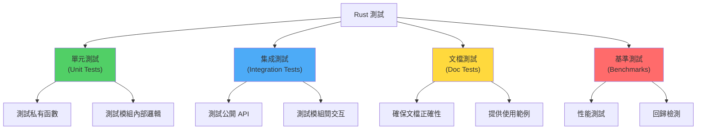

# 單元測試與集成測試

> 基於 Rust 1.90+ (2025) | 構建可靠的測試體系

## 📋 概述

測試是軟體品質的基石。Rust 內建強大的測試框架,支持單元測試、集成測試、文檔測試等多種測試類型,幫助開發者構建高品質的代碼。

---

## 🎯 Rust 測試基礎

### 測試類型概覽



---

## 🧪 單元測試 (Unit Tests)

### 基本結構

```rust
// src/lib.rs
pub fn add(a: i32, b: i32) -> i32 {
    a + b
}

#[cfg(test)]
mod tests {
    use super::*;
    
    #[test]
    fn test_add() {
        assert_eq!(add(2, 3), 5);
    }
    
    #[test]
    fn test_add_negative() {
        assert_eq!(add(-1, 1), 0);
    }
}
```

**運行測試**:
```bash
$ cargo test

running 2 tests
test tests::test_add ... ok
test tests::test_add_negative ... ok

test result: ok. 2 passed; 0 failed; 0 ignored; 0 measured; 0 filtered out
```

### 測試宏

#### assert! - 布林斷言

```rust
#[test]
fn test_assert() {
    assert!(2 + 2 == 4);
    assert!(vec![1, 2, 3].len() > 0);
    
    // 自定義失敗消息
    assert!(2 + 2 == 4, "基本數學應該正確");
    assert!(
        vec![1, 2, 3].len() > 0,
        "向量長度: {}, 應該大於 0",
        vec![1, 2, 3].len()
    );
}
```

#### assert_eq! 和 assert_ne! - 相等性斷言

```rust
#[test]
fn test_equality() {
    assert_eq!(add(2, 3), 5);
    assert_ne!(add(2, 3), 6);
    
    // 自定義消息
    assert_eq!(
        add(2, 3),
        5,
        "2 + 3 應該等於 5"
    );
}
```

#### 比較複雜類型

```rust
#[derive(Debug, PartialEq)]
struct User {
    name: String,
    age: u32,
}

#[test]
fn test_user_equality() {
    let user1 = User {
        name: "Alice".to_string(),
        age: 30,
    };
    let user2 = User {
        name: "Alice".to_string(),
        age: 30,
    };
    
    assert_eq!(user1, user2);
}
```

### 測試預期的 Panic

```rust
#[test]
#[should_panic]
fn test_division_by_zero() {
    let _ = 10 / 0;
}

#[test]
#[should_panic(expected = "index out of bounds")]
fn test_out_of_bounds() {
    let v = vec![1, 2, 3];
    let _ = v[10];
}
```

### 測試 Result

```rust
#[test]
fn test_with_result() -> Result<(), String> {
    if 2 + 2 == 4 {
        Ok(())
    } else {
        Err("數學壞掉了".to_string())
    }
}

// 實際案例
fn parse_and_validate(s: &str) -> Result<i32, String> {
    s.parse()
        .map_err(|_| "解析失敗".to_string())
        .and_then(|n| {
            if n > 0 {
                Ok(n)
            } else {
                Err("必須為正數".to_string())
            }
        })
}

#[test]
fn test_parse_valid() -> Result<(), String> {
    assert_eq!(parse_and_validate("42")?, 42);
    Ok(())
}

#[test]
fn test_parse_invalid() {
    assert!(parse_and_validate("abc").is_err());
    assert!(parse_and_validate("-5").is_err());
}
```

---

## 🎨 測試組織

### 內聯測試模組

```rust
// src/lib.rs
pub fn is_even(n: i32) -> bool {
    n % 2 == 0
}

#[cfg(test)]
mod tests {
    use super::*;
    
    #[test]
    fn test_even() {
        assert!(is_even(2));
        assert!(is_even(0));
        assert!(!is_even(1));
    }
}
```

**優點**:
- 可以測試私有函數
- 測試代碼與實現代碼在同一文件
- 編譯速度較快

### 獨立測試文件

```rust
// src/math.rs
pub fn add(a: i32, b: i32) -> i32 {
    a + b
}

// src/math/tests.rs
#[cfg(test)]
mod tests {
    use super::super::*;
    
    #[test]
    fn test_add() {
        assert_eq!(add(1, 2), 3);
    }
}

// src/lib.rs
mod math;
#[cfg(test)]
#[path = "math/tests.rs"]
mod math_tests;
```

### 測試私有函數

```rust
mod internal {
    fn private_function(x: i32) -> i32 {
        x * 2
    }
    
    #[cfg(test)]
    mod tests {
        use super::*;
        
        #[test]
        fn test_private() {
            // 可以測試私有函數
            assert_eq!(private_function(5), 10);
        }
    }
}
```

---

## 🔗 集成測試 (Integration Tests)

### 基本結構

```
my_project/
├── Cargo.toml
├── src/
│   └── lib.rs
└── tests/
    ├── integration_test.rs
    └── common/
        └── mod.rs
```

**tests/integration_test.rs**:
```rust
// 集成測試只能使用公開 API
use my_project::add;

#[test]
fn test_add_integration() {
    assert_eq!(add(2, 3), 5);
}
```

**運行**:
```bash
$ cargo test

running 1 test
test test_add_integration ... ok

test result: ok. 1 passed; 0 failed; 0 ignored; 0 measured; 0 filtered out
```

### 共用測試輔助代碼

**tests/common/mod.rs**:
```rust
// 共用的測試輔助函數
pub fn setup() {
    // 初始化邏輯
    println!("Setting up test environment");
}

pub fn teardown() {
    // 清理邏輯
    println!("Tearing down test environment");
}
```

**tests/integration_test.rs**:
```rust
mod common;

#[test]
fn test_with_setup() {
    common::setup();
    
    // 測試邏輯
    assert_eq!(2 + 2, 4);
    
    common::teardown();
}
```

### 測試二進制 Crate

```
my_project/
├── Cargo.toml
├── src/
│   ├── lib.rs       # 庫代碼
│   └── main.rs      # 二進制代碼
└── tests/
    └── cli_test.rs
```

**src/lib.rs**:
```rust
// 將核心邏輯放在 lib.rs
pub fn process_data(input: &str) -> String {
    input.to_uppercase()
}
```

**src/main.rs**:
```rust
use my_project::process_data;

fn main() {
    let result = process_data("hello");
    println!("{}", result);
}
```

**tests/cli_test.rs**:
```rust
use my_project::process_data;

#[test]
fn test_process_data() {
    assert_eq!(process_data("hello"), "HELLO");
}
```

---

## 🎯 測試最佳實踐

### 1. 使用描述性的測試名稱

```rust
// ❌ 不好
#[test]
fn test1() { }

// ✅ 好
#[test]
fn test_add_positive_numbers() { }

#[test]
fn test_add_returns_error_on_overflow() { }

#[test]
fn test_user_creation_with_valid_email() { }
```

### 2. AAA 模式 (Arrange-Act-Assert)

```rust
#[test]
fn test_user_registration() {
    // Arrange (準備)
    let username = "alice";
    let email = "alice@example.com";
    
    // Act (執行)
    let result = register_user(username, email);
    
    // Assert (斷言)
    assert!(result.is_ok());
    let user = result.unwrap();
    assert_eq!(user.username, username);
    assert_eq!(user.email, email);
}
```

### 3. 測試邊界情況

```rust
fn divide(a: i32, b: i32) -> Option<i32> {
    if b == 0 {
        None
    } else {
        Some(a / b)
    }
}

#[cfg(test)]
mod tests {
    use super::*;
    
    #[test]
    fn test_divide_normal() {
        assert_eq!(divide(10, 2), Some(5));
    }
    
    #[test]
    fn test_divide_by_zero() {
        assert_eq!(divide(10, 0), None);
    }
    
    #[test]
    fn test_divide_negative() {
        assert_eq!(divide(-10, 2), Some(-5));
    }
    
    #[test]
    fn test_divide_zero_dividend() {
        assert_eq!(divide(0, 5), Some(0));
    }
}
```

### 4. 使用測試夾具 (Test Fixtures)

```rust
struct TestFixture {
    temp_dir: std::path::PathBuf,
}

impl TestFixture {
    fn new() -> Self {
        let temp_dir = std::env::temp_dir()
            .join(format!("test_{}", uuid::Uuid::new_v4()));
        std::fs::create_dir_all(&temp_dir).unwrap();
        
        Self { temp_dir }
    }
}

impl Drop for TestFixture {
    fn drop(&mut self) {
        std::fs::remove_dir_all(&self.temp_dir).ok();
    }
}

#[test]
fn test_with_fixture() {
    let fixture = TestFixture::new();
    
    // 使用臨時目錄進行測試
    let test_file = fixture.temp_dir.join("test.txt");
    std::fs::write(&test_file, "test data").unwrap();
    
    assert!(test_file.exists());
    
    // fixture 自動清理
}
```

---

## 🔧 測試屬性與配置

### 忽略測試

```rust
#[test]
#[ignore]
fn expensive_test() {
    // 耗時的測試
    std::thread::sleep(std::time::Duration::from_secs(10));
}
```

**運行**:
```bash
# 默認跳過被忽略的測試
$ cargo test

# 只運行被忽略的測試
$ cargo test -- --ignored

# 運行所有測試(包括被忽略的)
$ cargo test -- --include-ignored
```

### 條件編譯測試

```rust
#[test]
#[cfg(target_os = "linux")]
fn test_linux_only() {
    // 只在 Linux 上運行
}

#[test]
#[cfg(not(target_os = "windows"))]
fn test_non_windows() {
    // 在非 Windows 平台運行
}

#[test]
#[cfg(feature = "advanced")]
fn test_advanced_feature() {
    // 只在啟用 "advanced" feature 時運行
}
```

### 測試線程控制

```bash
# 單線程運行測試
$ cargo test -- --test-threads=1

# 顯示測試輸出
$ cargo test -- --nocapture

# 運行特定測試
$ cargo test test_name

# 運行匹配模式的測試
$ cargo test add
```

---

## 📊 完整範例: 用戶管理系統

```rust
// src/lib.rs
use std::collections::HashMap;

#[derive(Debug, Clone, PartialEq)]
pub struct User {
    pub id: u64,
    pub username: String,
    pub email: String,
}

#[derive(Debug)]
pub struct UserRepository {
    users: HashMap<u64, User>,
    next_id: u64,
}

impl UserRepository {
    pub fn new() -> Self {
        Self {
            users: HashMap::new(),
            next_id: 1,
        }
    }
    
    pub fn create(&mut self, username: String, email: String) -> Result<User, String> {
        // 驗證
        if username.is_empty() {
            return Err("username cannot be empty".to_string());
        }
        
        if !email.contains('@') {
            return Err("invalid email".to_string());
        }
        
        // 檢查重複
        if self.users.values().any(|u| u.username == username) {
            return Err("username already exists".to_string());
        }
        
        // 創建用戶
        let user = User {
            id: self.next_id,
            username,
            email,
        };
        
        self.users.insert(user.id, user.clone());
        self.next_id += 1;
        
        Ok(user)
    }
    
    pub fn get(&self, id: u64) -> Option<&User> {
        self.users.get(&id)
    }
    
    pub fn update_email(&mut self, id: u64, new_email: String) -> Result<(), String> {
        if !new_email.contains('@') {
            return Err("invalid email".to_string());
        }
        
        self.users
            .get_mut(&id)
            .map(|user| {
                user.email = new_email;
            })
            .ok_or_else(|| "user not found".to_string())
    }
    
    pub fn delete(&mut self, id: u64) -> Result<User, String> {
        self.users
            .remove(&id)
            .ok_or_else(|| "user not found".to_string())
    }
}

// 單元測試
#[cfg(test)]
mod tests {
    use super::*;
    
    fn create_test_repo() -> UserRepository {
        UserRepository::new()
    }
    
    #[test]
    fn test_create_user_success() {
        let mut repo = create_test_repo();
        
        let result = repo.create(
            "alice".to_string(),
            "alice@example.com".to_string(),
        );
        
        assert!(result.is_ok());
        let user = result.unwrap();
        assert_eq!(user.id, 1);
        assert_eq!(user.username, "alice");
        assert_eq!(user.email, "alice@example.com");
    }
    
    #[test]
    fn test_create_user_empty_username() {
        let mut repo = create_test_repo();
        
        let result = repo.create(
            "".to_string(),
            "test@example.com".to_string(),
        );
        
        assert!(result.is_err());
        assert_eq!(result.unwrap_err(), "username cannot be empty");
    }
    
    #[test]
    fn test_create_user_invalid_email() {
        let mut repo = create_test_repo();
        
        let result = repo.create(
            "alice".to_string(),
            "invalid-email".to_string(),
        );
        
        assert!(result.is_err());
        assert_eq!(result.unwrap_err(), "invalid email");
    }
    
    #[test]
    fn test_create_duplicate_username() {
        let mut repo = create_test_repo();
        
        repo.create("alice".to_string(), "alice1@example.com".to_string()).unwrap();
        
        let result = repo.create(
            "alice".to_string(),
            "alice2@example.com".to_string(),
        );
        
        assert!(result.is_err());
        assert_eq!(result.unwrap_err(), "username already exists");
    }
    
    #[test]
    fn test_get_user() {
        let mut repo = create_test_repo();
        let user = repo.create("alice".to_string(), "alice@example.com".to_string()).unwrap();
        
        let found = repo.get(user.id);
        assert!(found.is_some());
        assert_eq!(found.unwrap(), &user);
        
        let not_found = repo.get(999);
        assert!(not_found.is_none());
    }
    
    #[test]
    fn test_update_email() -> Result<(), String> {
        let mut repo = create_test_repo();
        let user = repo.create("alice".to_string(), "alice@example.com".to_string())?;
        
        repo.update_email(user.id, "newemail@example.com".to_string())?;
        
        let updated = repo.get(user.id).unwrap();
        assert_eq!(updated.email, "newemail@example.com");
        
        Ok(())
    }
    
    #[test]
    fn test_delete_user() -> Result<(), String> {
        let mut repo = create_test_repo();
        let user = repo.create("alice".to_string(), "alice@example.com".to_string())?;
        
        let deleted = repo.delete(user.id)?;
        assert_eq!(deleted, user);
        
        assert!(repo.get(user.id).is_none());
        
        Ok(())
    }
}
```

**集成測試 (tests/integration_test.rs)**:
```rust
use my_project::{User, UserRepository};

#[test]
fn test_full_user_lifecycle() {
    let mut repo = UserRepository::new();
    
    // 創建用戶
    let user = repo.create(
        "alice".to_string(),
        "alice@example.com".to_string(),
    ).expect("Failed to create user");
    
    assert_eq!(user.id, 1);
    
    // 獲取用戶
    let found = repo.get(user.id).expect("User not found");
    assert_eq!(found.username, "alice");
    
    // 更新郵箱
    repo.update_email(user.id, "newemail@example.com".to_string())
        .expect("Failed to update email");
    
    let updated = repo.get(user.id).unwrap();
    assert_eq!(updated.email, "newemail@example.com");
    
    // 刪除用戶
    repo.delete(user.id).expect("Failed to delete user");
    assert!(repo.get(user.id).is_none());
}

#[test]
fn test_multiple_users() {
    let mut repo = UserRepository::new();
    
    let user1 = repo.create("alice".to_string(), "alice@example.com".to_string()).unwrap();
    let user2 = repo.create("bob".to_string(), "bob@example.com".to_string()).unwrap();
    
    assert_eq!(user1.id, 1);
    assert_eq!(user2.id, 2);
    
    assert!(repo.get(1).is_some());
    assert!(repo.get(2).is_some());
}
```

---

## 🎓 測試技巧總結

### 測試金字塔

```
        /\
       /  \      E2E 測試 (少量)
      /____\
     /      \    集成測試 (適量)
    /________\
   /          \  單元測試 (大量)
  /____________\
```

1. **大量單元測試**: 快速、隔離、精確
2. **適量集成測試**: 測試模組間交互
3. **少量 E2E 測試**: 測試完整流程

### 關鍵原則

1. **FIRST 原則**:
   - **F**ast (快速): 測試應該快速執行
   - **I**ndependent (獨立): 測試之間不應相互依賴
   - **R**epeatable (可重複): 每次運行結果應該一致
   - **S**elf-validating (自我驗證): 測試應該自動判斷通過與否
   - **T**imely (及時): 應該在編寫代碼的同時編寫測試

2. **測試覆蓋**:
   - 正常情況
   - 邊界情況
   - 異常情況
   - 錯誤處理

3. **可維護性**:
   - 清晰的測試名稱
   - 避免重複代碼
   - 使用測試輔助函數

---

## 📖 參考資料

1. [The Rust Programming Language - Writing Tests](https://doc.rust-lang.org/book/ch11-00-testing.html)
2. [Rust By Example - Testing](https://doc.rust-lang.org/rust-by-example/testing.html)
3. [The Cargo Book - Tests](https://doc.rust-lang.org/cargo/guide/tests.html)
4. [Test Organization - Rust API Guidelines](https://rust-lang.github.io/api-guidelines/documentation.html#examples-use-and-not-try-not-unwrap-c-question-mark)

---

*最後更新: 2025-01-17*  
*Rust 版本: 1.90+*
