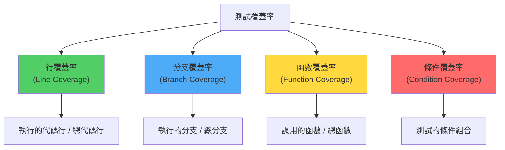

# 測試覆蓋率與品質度量

> 基於 Rust 1.90+ (2025) | 量化代碼品質與測試完整性

## 📋 概述

測試覆蓋率是衡量測試完整性的重要指標。本章介紹如何測量和提升 Rust 項目的測試覆蓋率,以及其他代碼品質度量工具。

---

## 🎯 什麼是測試覆蓋率?

### 覆蓋率類型



### 範例說明

```rust
fn classify_number(n: i32) -> &'static str {
    if n > 0 {          // 分支 1
        "positive"
    } else if n < 0 {   // 分支 2
        "negative"
    } else {            // 分支 3
        "zero"
    }
}

#[cfg(test)]
mod tests {
    use super::*;
    
    // ❌ 覆蓋率 33% (只測試一個分支)
    #[test]
    fn test_positive() {
        assert_eq!(classify_number(5), "positive");
    }
    
    // ✅ 覆蓋率 100% (測試所有分支)
    #[test]
    fn test_all_cases() {
        assert_eq!(classify_number(5), "positive");
        assert_eq!(classify_number(-5), "negative");
        assert_eq!(classify_number(0), "zero");
    }
}
```

---

## 🛠️ 使用 cargo-tarpaulin

### 安裝

```bash
$ cargo install cargo-tarpaulin
```

### 基本使用

```bash
# 運行覆蓋率測試
$ cargo tarpaulin

# 輸出 HTML 報告
$ cargo tarpaulin --out Html

# 輸出 Lcov 格式 (可用於 CI)
$ cargo tarpaulin --out Lcov

# 忽略測試代碼
$ cargo tarpaulin --ignore-tests

# 設置超時
$ cargo tarpaulin --timeout 120
```

### 輸出範例

```
|| Tested/Total Lines:
|| src/lib.rs: 45/50 (90.00%)
|| src/utils.rs: 30/35 (85.71%)
|| 
|| Total Coverage: 88.24%
```

### 配置文件

**tarpaulin.toml**:
```toml
[config]
# 排除的文件
exclude_files = [
    "src/generated/*",
    "tests/*"
]

# 覆蓋率閾值
fail-under = 80.0

# 輸出格式
output-formats = ["Html", "Lcov"]

# 忽略 panic 代碼
ignore-panics = true

# 超時設置 (秒)
timeout = 300
```

---

## 🔧 使用 cargo-llvm-cov

### 安裝

```bash
$ cargo install cargo-llvm-cov
```

### 基本使用

```bash
# 運行覆蓋率測試
$ cargo llvm-cov

# 生成 HTML 報告
$ cargo llvm-cov --html
$ open target/llvm-cov/html/index.html

# 生成 JSON 報告
$ cargo llvm-cov --json --output-path coverage.json

# 僅顯示摘要
$ cargo llvm-cov --summary-only

# 測試特定包
$ cargo llvm-cov --package my-package
```

### 輸出範例

```
Filename                      Regions    Missed Regions     Cover   Functions  Missed Functions  Executed
----------------------------------------------------------------------------------------------------------
src/lib.rs                         24                 2    91.67%          10                 1    90.00%
src/utils.rs                       15                 3    80.00%           5                 0   100.00%
----------------------------------------------------------------------------------------------------------
TOTAL                              39                 5    87.18%          15                 1    93.33%
```

---

## 📊 持續集成中的覆蓋率

### GitHub Actions 配置

**.github/workflows/coverage.yml**:
```yaml
name: Code Coverage

on:
  push:
    branches: [ main ]
  pull_request:
    branches: [ main ]

jobs:
  coverage:
    runs-on: ubuntu-latest
    
    steps:
    - uses: actions/checkout@v3
    
    - name: Install Rust
      uses: actions-rs/toolchain@v1
      with:
        toolchain: stable
        override: true
    
    - name: Install tarpaulin
      run: cargo install cargo-tarpaulin
    
    - name: Run coverage
      run: cargo tarpaulin --out Xml --output-dir coverage
    
    - name: Upload to Codecov
      uses: codecov/codecov-action@v3
      with:
        files: ./coverage/cobertura.xml
        fail_ci_if_error: true
```

### 使用 Codecov

```yaml
# .codecov.yml
coverage:
  status:
    project:
      default:
        target: 80%      # 目標覆蓋率
        threshold: 1%    # 允許的下降幅度
    patch:
      default:
        target: 85%      # PR 的目標覆蓋率

ignore:
  - "tests/**/*"
  - "examples/**/*"
```

### 使用 Coveralls

```yaml
- name: Upload to Coveralls
  uses: coverallsapp/github-action@master
  with:
    github-token: ${{ secrets.GITHUB_TOKEN }}
    path-to-lcov: ./coverage/lcov.info
```

---

## 🎨 實戰範例: 提升覆蓋率

### 範例 1: 識別未測試的代碼

```rust
// src/lib.rs
pub fn process_request(request: &str) -> Result<String, String> {
    if request.is_empty() {
        return Err("empty request".to_string());  // 分支 1
    }
    
    if request.starts_with("GET") {
        Ok("GET request processed".to_string())   // 分支 2
    } else if request.starts_with("POST") {
        Ok("POST request processed".to_string())  // 分支 3
    } else {
        Err("unknown method".to_string())          // 分支 4
    }
}

#[cfg(test)]
mod tests {
    use super::*;
    
    // 初始測試 - 覆蓋率 50%
    #[test]
    fn test_get_request() {
        assert!(process_request("GET /").is_ok());
    }
    
    #[test]
    fn test_post_request() {
        assert!(process_request("POST /").is_ok());
    }
    
    // 運行 cargo tarpaulin 發現未覆蓋的分支
    
    // 添加測試提升覆蓋率到 100%
    #[test]
    fn test_empty_request() {
        assert!(process_request("").is_err());
    }
    
    #[test]
    fn test_unknown_method() {
        assert!(process_request("DELETE /").is_err());
    }
}
```

### 範例 2: 測試錯誤路徑

```rust
use std::fs::File;
use std::io::Read;

pub fn read_config(path: &str) -> Result<String, std::io::Error> {
    let mut file = File::open(path)?;  // 可能失敗
    let mut content = String::new();
    file.read_to_string(&mut content)?;  // 可能失敗
    Ok(content)
}

#[cfg(test)]
mod tests {
    use super::*;
    use std::io::Write;
    use tempfile::NamedTempFile;
    
    #[test]
    fn test_read_config_success() {
        let mut temp = NamedTempFile::new().unwrap();
        write!(temp, "test content").unwrap();
        
        let result = read_config(temp.path().to_str().unwrap());
        assert!(result.is_ok());
        assert_eq!(result.unwrap(), "test content");
    }
    
    #[test]
    fn test_read_config_file_not_found() {
        let result = read_config("/nonexistent/path");
        assert!(result.is_err());
        
        // 驗證錯誤類型
        assert_eq!(result.unwrap_err().kind(), std::io::ErrorKind::NotFound);
    }
    
    #[test]
    fn test_read_config_permission_denied() {
        // 在 Unix 系統上測試權限錯誤
        #[cfg(unix)]
        {
            use std::fs;
            use std::os::unix::fs::PermissionsExt;
            
            let temp = NamedTempFile::new().unwrap();
            let path = temp.path();
            
            // 移除讀取權限
            let mut perms = fs::metadata(path).unwrap().permissions();
            perms.set_mode(0o000);
            fs::set_permissions(path, perms).unwrap();
            
            let result = read_config(path.to_str().unwrap());
            assert!(result.is_err());
        }
    }
}
```

---

## 📈 覆蓋率報告解讀

### HTML 報告結構

```
target/coverage/
├── index.html              # 主頁面
├── src/
│   ├── lib.rs.html        # 帶高亮的源代碼
│   └── utils.rs.html
└── coverage.json          # 詳細數據
```

### 顏色標記

- 🟢 **綠色**: 已執行的代碼
- 🔴 **紅色**: 未執行的代碼
- 🟡 **黃色**: 部分執行的代碼 (如只測試了 if 而未測試 else)

### 範例報告

```html
<!-- 未覆蓋的代碼會以紅色標記 -->
<span class="uncovered">if condition {</span>
    <span class="covered">println!("covered");</span>
<span class="uncovered">}</span>
```

---

## 🎯 覆蓋率目標設置

### 不同項目類型的建議

| 項目類型 | 建議覆蓋率 | 說明 |
|---------|-----------|------|
| 關鍵系統 | 90-100% | 金融、醫療等 |
| 生產庫 | 80-90% | 供他人使用的庫 |
| 應用程式 | 70-80% | 一般應用 |
| 原型/工具 | 50-70% | 快速迭代項目 |

### Cargo.toml 配置

```toml
[package.metadata.tarpaulin]
# 最低覆蓋率要求
minimum-coverage = 80.0

# 排除的文件
exclude-files = [
    "src/generated.rs",
    "build.rs"
]
```

---

## 🔍 其他品質度量工具

### cargo-audit - 安全審計

```bash
# 安裝
$ cargo install cargo-audit

# 檢查依賴的安全漏洞
$ cargo audit

# 輸出 JSON
$ cargo audit --json
```

### cargo-outdated - 依賴更新

```bash
# 安裝
$ cargo install cargo-outdated

# 檢查過時的依賴
$ cargo outdated

# 檢查特定深度
$ cargo outdated --depth 1
```

### cargo-deny - 依賴政策

**deny.toml**:
```toml
[advisories]
vulnerability = "deny"
unmaintained = "warn"

[licenses]
unlicensed = "deny"
allow = ["MIT", "Apache-2.0", "BSD-3-Clause"]
deny = ["GPL-3.0"]

[bans]
multiple-versions = "warn"
```

```bash
$ cargo install cargo-deny
$ cargo deny check
```

### cargo-geiger - 不安全代碼檢測

```bash
# 安裝
$ cargo install cargo-geiger

# 檢測不安全代碼
$ cargo geiger

# 輸出範例
# Metric output format: x/y
#   x = unsafe code used by the build
#   y = total unsafe code found in the crate
#
# Functions  Expressions  Impls  Traits  Methods  Dependency
# 0/0        0/0          0/0    0/0     0/0      my-crate
# 2/5        8/15         0/1    0/0     1/3      ├── dependency-a
# 0/2        0/4          0/0    0/0     0/0      └── dependency-b
```

---

## 📊 完整範例: 覆蓋率驅動開發

### 步驟 1: 編寫初始代碼

```rust
// src/calculator.rs
pub struct Calculator;

impl Calculator {
    pub fn add(a: i32, b: i32) -> i32 {
        a + b
    }
    
    pub fn subtract(a: i32, b: i32) -> i32 {
        a - b
    }
    
    pub fn multiply(a: i32, b: i32) -> i32 {
        a * b
    }
    
    pub fn divide(a: i32, b: i32) -> Result<i32, String> {
        if b == 0 {
            Err("division by zero".to_string())
        } else {
            Ok(a / b)
        }
    }
    
    pub fn power(base: i32, exp: u32) -> i32 {
        if exp == 0 {
            1
        } else {
            base * Self::power(base, exp - 1)
        }
    }
}
```

### 步驟 2: 編寫基本測試

```rust
#[cfg(test)]
mod tests {
    use super::*;
    
    #[test]
    fn test_add() {
        assert_eq!(Calculator::add(2, 3), 5);
    }
    
    #[test]
    fn test_divide() {
        assert_eq!(Calculator::divide(10, 2).unwrap(), 5);
    }
}
```

### 步驟 3: 運行覆蓋率分析

```bash
$ cargo tarpaulin --out Html
```

**結果**:
```
|| src/calculator.rs: 6/12 (50.00%)
|| Total Coverage: 50.00%
```

### 步驟 4: 根據報告添加測試

```rust
#[cfg(test)]
mod tests {
    use super::*;
    
    // 原有測試...
    
    // 新增測試提升覆蓋率
    #[test]
    fn test_subtract() {
        assert_eq!(Calculator::subtract(5, 3), 2);
    }
    
    #[test]
    fn test_multiply() {
        assert_eq!(Calculator::multiply(3, 4), 12);
    }
    
    #[test]
    fn test_divide_by_zero() {
        assert!(Calculator::divide(10, 0).is_err());
    }
    
    #[test]
    fn test_power_zero() {
        assert_eq!(Calculator::power(5, 0), 1);
    }
    
    #[test]
    fn test_power_positive() {
        assert_eq!(Calculator::power(2, 3), 8);
    }
}
```

### 步驟 5: 再次檢查

```bash
$ cargo tarpaulin --out Html
```

**結果**:
```
|| src/calculator.rs: 12/12 (100.00%)
|| Total Coverage: 100.00%
```

---

## 🎓 最佳實踐

### 1. 不要盲目追求 100%

```rust
// ❌ 過度測試
#[test]
fn test_getter() {
    let user = User { name: "Alice".to_string() };
    assert_eq!(user.name, "Alice");  // 沒有意義的測試
}

// ✅ 測試有價值的邏輯
#[test]
fn test_validation() {
    assert!(validate_email("test@example.com"));
    assert!(!validate_email("invalid"));
}
```

### 2. 關注未測試的錯誤路徑

```rust
pub fn process(input: &str) -> Result<String, Error> {
    let parsed = parse(input)?;       // 錯誤路徑 1
    let validated = validate(parsed)?;  // 錯誤路徑 2
    let result = transform(validated)?; // 錯誤路徑 3
    Ok(result)
}

// 確保測試所有錯誤路徑
#[cfg(test)]
mod tests {
    #[test]
    fn test_parse_error() { /* ... */ }
    
    #[test]
    fn test_validation_error() { /* ... */ }
    
    #[test]
    fn test_transform_error() { /* ... */ }
}
```

### 3. 使用覆蓋率作為指標而非目標

```rust
// 覆蓋率是發現遺漏測試的工具
// 不是為了達到數字而寫測試

// ❌ 為覆蓋率而測試
#[test]
fn test_unreachable_code() {
    // 測試永遠不會執行的代碼
}

// ✅ 移除死代碼
// 如果代碼不可達,應該刪除而非測試
```

### 4. 排除不需要測試的代碼

```rust
// 自動生成的代碼
#[cfg(not(tarpaulin_include))]
mod generated {
    // ...
}

// 簡單的 getter/setter
#[derive(Debug)]
pub struct Config {
    pub host: String,  // 簡單字段無需測試
}
```

---

## 🔧 故障排除

### 問題 1: 覆蓋率報告不準確

```bash
# 清理並重新生成
$ cargo clean
$ cargo tarpaulin --out Html
```

### 問題 2: 某些代碼未被標記為已覆蓋

```rust
// 可能是因為優化,使用 --release 測試
$ cargo tarpaulin --release
```

### 問題 3: CI 中覆蓋率測試失敗

```yaml
# 增加超時時間
- name: Run coverage
  run: cargo tarpaulin --timeout 300
  
# 或使用 --no-fail-fast
- name: Run coverage
  run: cargo tarpaulin --no-fail-fast
```

---

## 📖 參考資料

1. [cargo-tarpaulin Documentation](https://github.com/xd009642/tarpaulin)
2. [cargo-llvm-cov Documentation](https://github.com/taiki-e/cargo-llvm-cov)
3. [Codecov Documentation](https://docs.codecov.io/)
4. [Code Coverage Best Practices](https://martinfowler.com/bliki/TestCoverage.html)
5. [Rust Testing Guide](https://doc.rust-lang.org/book/ch11-00-testing.html)

---

*最後更新: 2025-01-17*  
*Rust 版本: 1.90+*
