# Mock 與測試替身

> 基於 Rust 1.90+ (2025) | 隔離外部依賴進行測試

## 📋 概述

在測試中,我們經常需要隔離外部依賴(如資料庫、網路請求、文件系統等),使測試更快、更可靠、更可控。本章介紹 Rust 中實現 Mock 和測試替身的各種技術。

---

## 🎯 測試替身類型

### 測試替身分類

```mermaid
graph TD
    A["測試替身<br/>(Test Doubles)"] --> B["Dummy<br/>虛設物件"]
    A --> C["Stub<br/>存根"]
    A --> D["Spy<br/>間諜"]
    A --> E["Mock<br/>模擬物件"]
    A --> F["Fake<br/>偽造物件"]
    
    B --> B1["僅用於填充參數<br/>不會被實際使用"]
    C --> C1["返回預設的回應<br/>無邏輯"]
    D --> D1["記錄調用信息<br/>可驗證"]
    E --> E1["預設期望行為<br/>驗證調用"]
    F --> F1["有實際邏輯的簡化版本<br/>如內存資料庫"]
    
    style B fill:#e0e0e0
    style C fill:#b3d9ff
    style D fill:#ffcc99
    style E fill:#ff9999
    style F fill:#99ff99
```



---

## 🔧 手動實現測試替身

### 使用 Trait 抽象

```rust
// 定義 trait
pub trait EmailService {
    fn send_email(&self, to: &str, subject: &str, body: &str) -> Result<(), String>;
}

// 生產實現
pub struct SmtpEmailService {
    server: String,
}

impl EmailService for SmtpEmailService {
    fn send_email(&self, to: &str, subject: &str, body: &str) -> Result<(), String> {
        // 實際發送郵件
        println!("Sending email via SMTP to {}", to);
        Ok(())
    }
}

// 測試實現 (Fake)
#[cfg(test)]
pub struct MockEmailService {
    pub sent_emails: std::cell::RefCell<Vec<(String, String, String)>>,
}

#[cfg(test)]
impl MockEmailService {
    pub fn new() -> Self {
        Self {
            sent_emails: std::cell::RefCell::new(Vec::new()),
        }
    }
    
    pub fn get_sent_emails(&self) -> Vec<(String, String, String)> {
        self.sent_emails.borrow().clone()
    }
}

#[cfg(test)]
impl EmailService for MockEmailService {
    fn send_email(&self, to: &str, subject: &str, body: &str) -> Result<(), String> {
        self.sent_emails.borrow_mut().push((
            to.to_string(),
            subject.to_string(),
            body.to_string(),
        ));
        Ok(())
    }
}

// 使用
pub struct UserService<E: EmailService> {
    email_service: E,
}

impl<E: EmailService> UserService<E> {
    pub fn new(email_service: E) -> Self {
        Self { email_service }
    }
    
    pub fn register_user(&self, email: &str, name: &str) -> Result<(), String> {
        // 註冊邏輯...
        
        // 發送歡迎郵件
        self.email_service.send_email(
            email,
            "Welcome!",
            &format!("Hello, {}!", name),
        )?;
        
        Ok(())
    }
}

#[cfg(test)]
mod tests {
    use super::*;
    
    #[test]
    fn test_user_registration_sends_email() {
        let mock_email = MockEmailService::new();
        let service = UserService::new(mock_email);
        
        service.register_user("test@example.com", "Alice").unwrap();
        
        let sent = service.email_service.get_sent_emails();
        assert_eq!(sent.len(), 1);
        assert_eq!(sent[0].0, "test@example.com");
        assert_eq!(sent[0].1, "Welcome!");
        assert!(sent[0].2.contains("Alice"));
    }
}
```

---

## 🚀 使用 mockall

### 安裝

```toml
[dev-dependencies]
mockall = "0.12"
```

### 基本用法

```rust
use mockall::*;

#[automock]
pub trait Database {
    fn get_user(&self, id: u64) -> Result<User, String>;
    fn save_user(&mut self, user: User) -> Result<(), String>;
    fn delete_user(&mut self, id: u64) -> Result<(), String>;
}

#[derive(Debug, Clone, PartialEq)]
pub struct User {
    pub id: u64,
    pub name: String,
}

pub struct UserRepository<D: Database> {
    db: D,
}

impl<D: Database> UserRepository<D> {
    pub fn new(db: D) -> Self {
        Self { db }
    }
    
    pub fn get_user_name(&self, id: u64) -> Result<String, String> {
        let user = self.db.get_user(id)?;
        Ok(user.name)
    }
}

#[cfg(test)]
mod tests {
    use super::*;
    
    #[test]
    fn test_get_user_name() {
        let mut mock_db = MockDatabase::new();
        
        // 設置期望
        mock_db
            .expect_get_user()
            .with(eq(1))  // 期望參數為 1
            .times(1)     // 期望調用 1 次
            .returning(|id| Ok(User {
                id,
                name: "Alice".to_string(),
            }));
        
        let repo = UserRepository::new(mock_db);
        let name = repo.get_user_name(1).unwrap();
        
        assert_eq!(name, "Alice");
        
        // mockall 會自動驗證期望是否滿足
    }
    
    #[test]
    fn test_get_user_not_found() {
        let mut mock_db = MockDatabase::new();
        
        mock_db
            .expect_get_user()
            .with(eq(999))
            .returning(|_| Err("user not found".to_string()));
        
        let repo = UserRepository::new(mock_db);
        let result = repo.get_user_name(999);
        
        assert!(result.is_err());
        assert_eq!(result.unwrap_err(), "user not found");
    }
}
```

### Mock 返回值

```rust
use mockall::*;

#[automock]
pub trait Calculator {
    fn add(&self, a: i32, b: i32) -> i32;
    fn divide(&self, a: i32, b: i32) -> Result<i32, String>;
}

#[cfg(test)]
mod tests {
    use super::*;
    
    #[test]
    fn test_mock_return_value() {
        let mut mock = MockCalculator::new();
        
        // 固定返回值
        mock.expect_add()
            .returning(|a, b| a + b);
        
        assert_eq!(mock.add(2, 3), 5);
        assert_eq!(mock.add(10, 20), 30);
    }
    
    #[test]
    fn test_mock_return_sequence() {
        let mut mock = MockCalculator::new();
        
        // 返回序列
        mock.expect_add()
            .return_const(5)
            .times(1);
        
        mock.expect_add()
            .return_const(10)
            .times(1);
        
        assert_eq!(mock.add(0, 0), 5);  // 第一次調用
        assert_eq!(mock.add(0, 0), 10); // 第二次調用
    }
}
```

### Mock 方法參數匹配

```rust
use mockall::predicate::*;

#[automock]
pub trait Logger {
    fn log(&self, level: &str, message: &str);
}

#[cfg(test)]
mod tests {
    use super::*;
    
    #[test]
    fn test_log_with_specific_params() {
        let mut mock = MockLogger::new();
        
        // 精確匹配
        mock.expect_log()
            .with(eq("ERROR"), eq("something went wrong"))
            .times(1)
            .return_const(());
        
        mock.log("ERROR", "something went wrong");
    }
    
    #[test]
    fn test_log_with_pattern() {
        let mut mock = MockLogger::new();
        
        // 使用謂詞
        mock.expect_log()
            .withf(|level, message| {
                level == "ERROR" && message.contains("failed")
            })
            .times(1)
            .return_const(());
        
        mock.log("ERROR", "operation failed");
    }
    
    #[test]
    fn test_log_any_params() {
        let mut mock = MockLogger::new();
        
        // 接受任何參數
        mock.expect_log()
            .times(2)
            .return_const(());
        
        mock.log("INFO", "message 1");
        mock.log("ERROR", "message 2");
    }
}
```

---

## 🎨 使用 mockito (HTTP Mocking)

### 安裝

```toml
[dev-dependencies]
mockito = "1.2"
reqwest = { version = "0.11", features = ["blocking"] }
```

### Mock HTTP 請求

```rust
#[cfg(test)]
mod tests {
    use mockito::{mock, server_url};
    
    #[test]
    fn test_api_call() {
        // 創建 mock server
        let mock = mock("GET", "/users/1")
            .with_status(200)
            .with_header("content-type", "application/json")
            .with_body(r#"{"id": 1, "name": "Alice"}"#)
            .create();
        
        // 發送請求到 mock server
        let url = format!("{}/users/1", server_url());
        let response = reqwest::blocking::get(&url).unwrap();
        
        assert_eq!(response.status(), 200);
        
        let body = response.text().unwrap();
        assert!(body.contains("Alice"));
        
        // 驗證 mock 被調用
        mock.assert();
    }
    
    #[test]
    fn test_api_error() {
        let mock = mock("GET", "/users/999")
            .with_status(404)
            .with_body("Not Found")
            .create();
        
        let url = format!("{}/users/999", server_url());
        let response = reqwest::blocking::get(&url).unwrap();
        
        assert_eq!(response.status(), 404);
        mock.assert();
    }
    
    #[test]
    fn test_api_multiple_calls() {
        let mock = mock("POST", "/users")
            .with_status(201)
            .with_body(r#"{"id": 2}"#)
            .expect(2)  // 期望調用 2 次
            .create();
        
        let client = reqwest::blocking::Client::new();
        let url = format!("{}/users", server_url());
        
        client.post(&url).send().unwrap();
        client.post(&url).send().unwrap();
        
        mock.assert();
    }
}
```

### Mock 異步 HTTP 請求

```rust
#[cfg(test)]
mod tests {
    use mockito::{mock, server_url};
    
    #[tokio::test]
    async fn test_async_api_call() {
        let mock = mock("GET", "/data")
            .with_status(200)
            .with_body("success")
            .create();
        
        let url = format!("{}/data", server_url());
        let response = reqwest::get(&url).await.unwrap();
        
        assert_eq!(response.status(), 200);
        assert_eq!(response.text().await.unwrap(), "success");
        
        mock.assert();
    }
}
```

---

## 📊 實戰範例: 完整的測試隔離

### 範例: 用戶服務

```rust
use mockall::*;

// 定義依賴的 traits
#[automock]
pub trait Database {
    fn get_user(&self, id: u64) -> Result<User, DbError>;
    fn save_user(&mut self, user: &User) -> Result<(), DbError>;
}

#[automock]
pub trait EmailService {
    fn send(&self, to: &str, subject: &str, body: &str) -> Result<(), EmailError>;
}

#[automock]
pub trait PaymentGateway {
    fn charge(&self, user_id: u64, amount: f64) -> Result<String, PaymentError>;
}

// 錯誤類型
#[derive(Debug, Clone, PartialEq)]
pub enum DbError {
    NotFound,
    ConnectionError,
}

#[derive(Debug, Clone, PartialEq)]
pub enum EmailError {
    SendFailed,
}

#[derive(Debug, Clone, PartialEq)]
pub enum PaymentError {
    InsufficientFunds,
    GatewayError,
}

// 實體
#[derive(Debug, Clone, PartialEq)]
pub struct User {
    pub id: u64,
    pub name: String,
    pub email: String,
    pub balance: f64,
}

// 業務邏輯
pub struct UserService<D, E, P>
where
    D: Database,
    E: EmailService,
    P: PaymentGateway,
{
    db: D,
    email: E,
    payment: P,
}

impl<D, E, P> UserService<D, E, P>
where
    D: Database,
    E: EmailService,
    P: PaymentGateway,
{
    pub fn new(db: D, email: E, payment: P) -> Self {
        Self { db, email, payment }
    }
    
    pub fn purchase_item(
        &mut self,
        user_id: u64,
        item_name: &str,
        price: f64,
    ) -> Result<(), String> {
        // 1. 獲取用戶
        let user = self.db.get_user(user_id)
            .map_err(|e| format!("Database error: {:?}", e))?;
        
        // 2. 檢查餘額
        if user.balance < price {
            return Err("Insufficient balance".to_string());
        }
        
        // 3. 扣款
        let transaction_id = self.payment.charge(user_id, price)
            .map_err(|e| format!("Payment error: {:?}", e))?;
        
        // 4. 發送確認郵件
        let email_body = format!(
            "Purchase confirmed: {} (Transaction: {})",
            item_name, transaction_id
        );
        
        self.email.send(&user.email, "Purchase Confirmation", &email_body)
            .map_err(|e| format!("Email error: {:?}", e))?;
        
        Ok(())
    }
}

#[cfg(test)]
mod tests {
    use super::*;
    
    #[test]
    fn test_purchase_success() {
        let mut mock_db = MockDatabase::new();
        let mut mock_email = MockEmailService::new();
        let mut mock_payment = MockPaymentGateway::new();
        
        let user = User {
            id: 1,
            name: "Alice".to_string(),
            email: "alice@example.com".to_string(),
            balance: 100.0,
        };
        
        // 設置期望
        mock_db
            .expect_get_user()
            .with(eq(1))
            .times(1)
            .return_once(move |_| Ok(user));
        
        mock_payment
            .expect_charge()
            .with(eq(1), eq(50.0))
            .times(1)
            .returning(|_, _| Ok("txn_123".to_string()));
        
        mock_email
            .expect_send()
            .withf(|to, subject, body| {
                to == "alice@example.com" &&
                subject == "Purchase Confirmation" &&
                body.contains("txn_123")
            })
            .times(1)
            .returning(|_, _, _| Ok(()));
        
        let mut service = UserService::new(mock_db, mock_email, mock_payment);
        
        let result = service.purchase_item(1, "Book", 50.0);
        assert!(result.is_ok());
    }
    
    #[test]
    fn test_purchase_insufficient_balance() {
        let mut mock_db = MockDatabase::new();
        let mock_email = MockEmailService::new();
        let mock_payment = MockPaymentGateway::new();
        
        let user = User {
            id: 1,
            name: "Bob".to_string(),
            email: "bob@example.com".to_string(),
            balance: 10.0,  // 餘額不足
        };
        
        mock_db
            .expect_get_user()
            .returning(move |_| Ok(user.clone()));
        
        // 不應該調用 payment 和 email
        
        let mut service = UserService::new(mock_db, mock_email, mock_payment);
        
        let result = service.purchase_item(1, "Book", 50.0);
        assert!(result.is_err());
        assert!(result.unwrap_err().contains("Insufficient balance"));
    }
    
    #[test]
    fn test_purchase_user_not_found() {
        let mut mock_db = MockDatabase::new();
        let mock_email = MockEmailService::new();
        let mock_payment = MockPaymentGateway::new();
        
        mock_db
            .expect_get_user()
            .returning(|_| Err(DbError::NotFound));
        
        let mut service = UserService::new(mock_db, mock_email, mock_payment);
        
        let result = service.purchase_item(999, "Book", 50.0);
        assert!(result.is_err());
        assert!(result.unwrap_err().contains("Database error"));
    }
    
    #[test]
    fn test_purchase_payment_failed() {
        let mut mock_db = MockDatabase::new();
        let mock_email = MockEmailService::new();
        let mut mock_payment = MockPaymentGateway::new();
        
        let user = User {
            id: 1,
            name: "Charlie".to_string(),
            email: "charlie@example.com".to_string(),
            balance: 100.0,
        };
        
        mock_db
            .expect_get_user()
            .return_once(move |_| Ok(user));
        
        mock_payment
            .expect_charge()
            .returning(|_, _| Err(PaymentError::GatewayError));
        
        // 不應該調用 email
        
        let mut service = UserService::new(mock_db, mock_email, mock_payment);
        
        let result = service.purchase_item(1, "Book", 50.0);
        assert!(result.is_err());
        assert!(result.unwrap_err().contains("Payment error"));
    }
}
```

---

## 🔧 測試異步代碼

### 使用 mockall 測試異步

```rust
use mockall::*;

#[automock]
#[async_trait::async_trait]
pub trait AsyncDatabase {
    async fn get_user(&self, id: u64) -> Result<User, String>;
    async fn save_user(&self, user: User) -> Result<(), String>;
}

pub struct AsyncUserService<D: AsyncDatabase> {
    db: D,
}

impl<D: AsyncDatabase> AsyncUserService<D> {
    pub fn new(db: D) -> Self {
        Self { db }
    }
    
    pub async fn get_user_name(&self, id: u64) -> Result<String, String> {
        let user = self.db.get_user(id).await?;
        Ok(user.name)
    }
}

#[cfg(test)]
mod tests {
    use super::*;
    
    #[tokio::test]
    async fn test_async_get_user_name() {
        let mut mock_db = MockAsyncDatabase::new();
        
        mock_db
            .expect_get_user()
            .with(eq(1))
            .times(1)
            .returning(|id| {
                Box::pin(async move {
                    Ok(User {
                        id,
                        name: "Alice".to_string(),
                        email: "alice@example.com".to_string(),
                        balance: 0.0,
                    })
                })
            });
        
        let service = AsyncUserService::new(mock_db);
        let name = service.get_user_name(1).await.unwrap();
        
        assert_eq!(name, "Alice");
    }
}
```

---

## 🎯 測試替身模式選擇

### 決策樹

```mermaid
graph TD
    A["需要隔離依賴"] --> B{"依賴是否複雜?"}
    B -->|簡單| C["手動實現 Fake"]
    B -->|複雜| D{"是否需要驗證調用?"}
    D -->|是| E["使用 mockall Mock"]
    D -->|否| F["使用 Stub"]
    
    G["HTTP 請求"] --> H["使用 mockito"]
    I["外部服務"] --> J["使用 Fake 實現"]
    
    style C fill:#99ff99
    style E fill:#ff9999
    style F fill:#b3d9ff
    style H fill:#ffcc99
    style J fill:#99ff99
```



---

## 🎓 最佳實踐

### 1. 優先使用依賴注入

```rust
// ❌ 不好: 硬編碼依賴
pub struct UserService {
    db: PostgresDatabase,  // 無法替換
}

// ✅ 好: 使用泛型和 trait
pub struct UserService<D: Database> {
    db: D,  // 可以注入任何實現 Database 的類型
}
```

### 2. 保持 Mock 簡單

```rust
// ❌ 不好: 過於複雜的 Mock
#[test]
fn test_complex_mock() {
    let mut mock = MockDatabase::new();
    mock.expect_get_user()
        .times(3)
        .in_sequence(&mut seq)
        .withf(|id| *id > 0 && *id < 1000)
        .returning(|_| /* 複雜邏輯 */);
    // ...
}

// ✅ 好: 簡單明確的 Mock
#[test]
fn test_simple_mock() {
    let mut mock = MockDatabase::new();
    mock.expect_get_user()
        .with(eq(1))
        .return_once(|_| Ok(test_user()));
}
```

### 3. 為每個測試創建獨立的 Mock

```rust
// ❌ 不好: 共享 Mock
lazy_static! {
    static ref SHARED_MOCK: MockDatabase = {
        let mut mock = MockDatabase::new();
        // 設置...
        mock
    };
}

// ✅ 好: 每個測試獨立的 Mock
#[test]
fn test_1() {
    let mut mock = MockDatabase::new();
    // 設置...
}

#[test]
fn test_2() {
    let mut mock = MockDatabase::new();
    // 設置...
}
```

---

## 📖 參考資料

1. [mockall Documentation](https://docs.rs/mockall/)
2. [mockito Documentation](https://docs.rs/mockito/)
3. [Test Doubles - Martin Fowler](https://martinfowler.com/bliki/TestDouble.html)
4. [Mocks Aren't Stubs](https://martinfowler.com/articles/mocksArentStubs.html)
5. [Dependency Injection in Rust](https://blog.logrocket.com/dependency-injection-rust/)

---

*最後更新: 2025-01-17*  
*Rust 版本: 1.90+*
