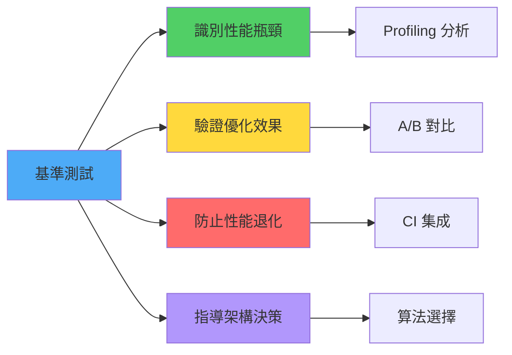
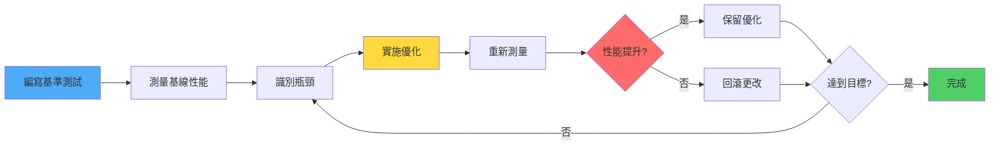

# 基準測試與性能測試

> 基於 Rust 1.90+ (2025) | 量化和優化程序性能

## 📋 概述

基準測試 (Benchmarking) 是衡量代碼性能的關鍵工具。本章介紹 Rust 生態中的各種性能測試工具和最佳實踐,幫助你編寫高性能的代碼。

---

## 🎯 為什麼需要基準測試?

### 基準測試的價值



---

## 🚀 使用 Criterion.rs

### 安裝

```toml
[dev-dependencies]
criterion = { version = "0.5", features = ["html_reports"] }

[[bench]]
name = "my_benchmark"
harness = false
```

### 基本用法

**benches/my_benchmark.rs**:
```rust
use criterion::{black_box, criterion_group, criterion_main, Criterion};

fn fibonacci(n: u64) -> u64 {
    match n {
        0 => 1,
        1 => 1,
        n => fibonacci(n - 1) + fibonacci(n - 2),
    }
}

fn fibonacci_benchmark(c: &mut Criterion) {
    c.bench_function("fib 20", |b| b.iter(|| fibonacci(black_box(20))));
}

criterion_group!(benches, fibonacci_benchmark);
criterion_main!(benches);
```

**運行**:
```bash
$ cargo bench

fibonacci/fib 20        time:   [26.029 µs 26.251 µs 26.509 µs]
Found 11 outliers among 100 measurements (11.00%)
  6 (6.00%) high mild
  5 (5.00%) high severe
```

### black_box 的重要性

```rust
use criterion::{black_box, Criterion};

// ❌ 錯誤: 編譯器會優化掉計算
fn bad_benchmark(c: &mut Criterion) {
    c.bench_function("add", |b| {
        b.iter(|| 2 + 2)  // 編譯器可能直接返回 4
    });
}

// ✅ 正確: 使用 black_box 防止優化
fn good_benchmark(c: &mut Criterion) {
    c.bench_function("add", |b| {
        b.iter(|| black_box(2) + black_box(2))
    });
}
```

### 參數化基準測試

```rust
use criterion::{criterion_group, criterion_main, BenchmarkId, Criterion};

fn sort_benchmark(c: &mut Criterion) {
    let mut group = c.benchmark_group("sort");
    
    for size in [10, 100, 1000, 10000].iter() {
        group.bench_with_input(
            BenchmarkId::from_parameter(size),
            size,
            |b, &size| {
                b.iter(|| {
                    let mut data: Vec<i32> = (0..size).collect();
                    data.sort();
                    data
                });
            },
        );
    }
    
    group.finish();
}

criterion_group!(benches, sort_benchmark);
criterion_main!(benches);
```

**輸出**:
```
sort/10                 time:   [45.234 ns 45.789 ns 46.412 ns]
sort/100                time:   [892.34 ns 901.23 ns 911.45 ns]
sort/1000               time:   [12.456 µs 12.567 µs 12.689 µs]
sort/10000              time:   [156.78 µs 158.23 µs 159.89 µs]
```

---

## 🎨 實戰範例

### 範例 1: 比較不同實現

```rust
use criterion::{criterion_group, criterion_main, Criterion, BenchmarkId};

// 實現 1: 遞迴
fn fibonacci_recursive(n: u64) -> u64 {
    match n {
        0 | 1 => 1,
        n => fibonacci_recursive(n - 1) + fibonacci_recursive(n - 2),
    }
}

// 實現 2: 迭代
fn fibonacci_iterative(n: u64) -> u64 {
    let mut a = 0;
    let mut b = 1;
    
    for _ in 0..n {
        let temp = a;
        a = b;
        b = temp + b;
    }
    
    b
}

// 實現 3: 使用記憶化
fn fibonacci_memoized(n: u64) -> u64 {
    let mut memo = vec![0; (n + 1) as usize];
    memo[0] = 1;
    memo[1] = 1;
    
    for i in 2..=n as usize {
        memo[i] = memo[i - 1] + memo[i - 2];
    }
    
    memo[n as usize]
}

fn fibonacci_comparison(c: &mut Criterion) {
    let mut group = c.benchmark_group("fibonacci");
    
    for n in [10, 20, 30].iter() {
        group.bench_with_input(
            BenchmarkId::new("recursive", n),
            n,
            |b, &n| b.iter(|| fibonacci_recursive(black_box(n))),
        );
        
        group.bench_with_input(
            BenchmarkId::new("iterative", n),
            n,
            |b, &n| b.iter(|| fibonacci_iterative(black_box(n))),
        );
        
        group.bench_with_input(
            BenchmarkId::new("memoized", n),
            n,
            |b, &n| b.iter(|| fibonacci_memoized(black_box(n))),
        );
    }
    
    group.finish();
}

criterion_group!(benches, fibonacci_comparison);
criterion_main!(benches);
```

### 範例 2: 測試數據結構

```rust
use criterion::{criterion_group, criterion_main, Criterion};
use std::collections::{HashMap, BTreeMap};

fn map_benchmark(c: &mut Criterion) {
    let mut group = c.benchmark_group("map_insert");
    
    group.bench_function("HashMap", |b| {
        b.iter(|| {
            let mut map = HashMap::new();
            for i in 0..1000 {
                map.insert(i, i * 2);
            }
            map
        });
    });
    
    group.bench_function("BTreeMap", |b| {
        b.iter(|| {
            let mut map = BTreeMap::new();
            for i in 0..1000 {
                map.insert(i, i * 2);
            }
            map
        });
    });
    
    group.finish();
}

criterion_group!(benches, map_benchmark);
criterion_main!(benches);
```

### 範例 3: 測試字符串操作

```rust
use criterion::{criterion_group, criterion_main, Criterion};

fn string_concat_benchmark(c: &mut Criterion) {
    let mut group = c.benchmark_group("string_concat");
    
    // 方法 1: + 運算符
    group.bench_function("plus_operator", |b| {
        b.iter(|| {
            let mut result = String::new();
            for i in 0..100 {
                result = result + &i.to_string();
            }
            result
        });
    });
    
    // 方法 2: push_str
    group.bench_function("push_str", |b| {
        b.iter(|| {
            let mut result = String::new();
            for i in 0..100 {
                result.push_str(&i.to_string());
            }
            result
        });
    });
    
    // 方法 3: format!
    group.bench_function("format", |b| {
        b.iter(|| {
            let mut result = String::new();
            for i in 0..100 {
                result = format!("{}{}", result, i);
            }
            result
        });
    });
    
    // 方法 4: collect
    group.bench_function("collect", |b| {
        b.iter(|| {
            (0..100)
                .map(|i| i.to_string())
                .collect::<String>()
        });
    });
    
    group.finish();
}

criterion_group!(benches, string_concat_benchmark);
criterion_main!(benches);
```

---

## 🔧 進階 Criterion 功能

### 設置樣本大小和測量時間

```rust
use criterion::{criterion_group, criterion_main, Criterion};
use std::time::Duration;

fn custom_config_benchmark(c: &mut Criterion) {
    let mut group = c.benchmark_group("custom_config");
    
    // 設置樣本大小
    group.sample_size(10);
    
    // 設置測量時間
    group.measurement_time(Duration::from_secs(5));
    
    // 設置熱身時間
    group.warm_up_time(Duration::from_secs(1));
    
    group.bench_function("test", |b| {
        b.iter(|| {
            // 測試代碼
        });
    });
    
    group.finish();
}

criterion_group!(benches, custom_config_benchmark);
criterion_main!(benches);
```

### 吞吐量測量

```rust
use criterion::{criterion_group, criterion_main, Criterion, Throughput};

fn throughput_benchmark(c: &mut Criterion) {
    let mut group = c.benchmark_group("throughput");
    
    let data = vec![0u8; 1024 * 1024]; // 1 MB
    
    group.throughput(Throughput::Bytes(data.len() as u64));
    
    group.bench_function("process_data", |b| {
        b.iter(|| {
            // 處理數據
            data.iter().sum::<u8>()
        });
    });
    
    group.finish();
}

criterion_group!(benches, throughput_benchmark);
criterion_main!(benches);
```

**輸出**:
```
throughput/process_data time:   [1.2345 ms 1.2456 ms 1.2567 ms]
                        thrpt:  [812.34 MiB/s 820.12 MiB/s 828.45 MiB/s]
```

### 迭代計數

```rust
use criterion::{criterion_group, criterion_main, Criterion};

fn iter_count_benchmark(c: &mut Criterion) {
    c.bench_function("custom_iter", |b| {
        b.iter_custom(|iters| {
            let start = std::time::Instant::now();
            
            for _ in 0..iters {
                // 測試代碼
                black_box(expensive_operation());
            }
            
            start.elapsed()
        });
    });
}

criterion_group!(benches, iter_count_benchmark);
criterion_main!(benches);
```

---

## 🎲 使用 Divan (更快的基準測試)

### 安裝

```toml
[dev-dependencies]
divan = "0.1"
```

### 基本用法

```rust
use divan::Bencher;

fn fibonacci(n: u64) -> u64 {
    match n {
        0 | 1 => 1,
        n => fibonacci(n - 1) + fibonacci(n - 2),
    }
}

#[divan::bench]
fn bench_fibonacci() {
    fibonacci(divan::black_box(20));
}

#[divan::bench(args = [10, 20, 30])]
fn bench_fibonacci_args(n: u64) {
    fibonacci(divan::black_box(n));
}

fn main() {
    divan::main();
}
```

**運行**:
```bash
$ cargo bench --bench my_divan_bench
```

---

## 📊 內建基準測試 (Nightly)

### 使用 test::Bencher

```rust
#![feature(test)]
extern crate test;

use test::Bencher;

#[bench]
fn bench_add(b: &mut Bencher) {
    b.iter(|| {
        test::black_box(2 + 2)
    });
}

#[bench]
fn bench_vec_push(b: &mut Bencher) {
    b.iter(|| {
        let mut v = Vec::new();
        for i in 0..100 {
            v.push(i);
        }
        v
    });
}
```

**運行**:
```bash
$ cargo +nightly bench

running 2 tests
test bench_add      ... bench:           0 ns/iter (+/- 0)
test bench_vec_push ... bench:         234 ns/iter (+/- 12)
```

---

## 🔍 性能分析工具

### cargo-flamegraph

```bash
# 安裝
$ cargo install flamegraph

# 生成火焰圖
$ cargo flamegraph --bench my_benchmark

# 輸出: flamegraph.svg
```

### perf + cargo

```bash
# Linux 上使用 perf
$ cargo build --release
$ perf record --call-graph dwarf ./target/release/my_program
$ perf report
```

### samply (現代性能分析器)

```bash
# 安裝
$ cargo install samply

# 運行分析
$ samply record cargo run --release

# 在瀏覽器中查看結果
```

---

## 🎯 基準測試最佳實踐

### 1. 隔離測試環境

```bash
# ❌ 不好: 在後台運行其他程序
$ cargo bench

# ✅ 好: 關閉不必要的程序,固定 CPU 頻率
$ sudo cpupower frequency-set --governor performance
$ cargo bench
$ sudo cpupower frequency-set --governor powersave
```

### 2. 使用 baseline 比較

```bash
# 保存基線
$ cargo bench --bench my_bench -- --save-baseline baseline

# 修改代碼後比較
$ cargo bench --bench my_bench -- --baseline baseline

# 輸出:
# add                     time:   [10.234 ns 10.456 ns 10.678 ns]
#                         change: [-5.2345% -3.1234% -1.2345%] (p = 0.00 < 0.05)
#                         Performance has improved.
```

### 3. 測試多個輸入大小

```rust
use criterion::{criterion_group, criterion_main, Criterion, BenchmarkId};

fn size_scaling_benchmark(c: &mut Criterion) {
    let mut group = c.benchmark_group("scaling");
    
    for size in [10, 100, 1000, 10000, 100000].iter() {
        group.bench_with_input(
            BenchmarkId::from_parameter(size),
            size,
            |b, &size| {
                let data: Vec<i32> = (0..size).collect();
                b.iter(|| process_data(&data));
            },
        );
    }
    
    group.finish();
}
```

### 4. 避免常見陷阱

```rust
// ❌ 陷阱 1: 在循環內分配記憶體
#[bench]
fn bad_benchmark(b: &mut Bencher) {
    b.iter(|| {
        let mut v = Vec::new();  // 每次迭代都分配
        for i in 0..1000 {
            v.push(i);
        }
    });
}

// ✅ 正確: 在外部分配
#[bench]
fn good_benchmark(b: &mut Bencher) {
    let mut v = Vec::with_capacity(1000);
    b.iter(|| {
        v.clear();
        for i in 0..1000 {
            v.push(i);
        }
    });
}

// ❌ 陷阱 2: 測試太簡單,被優化掉
#[bench]
fn too_simple(b: &mut Bencher) {
    b.iter(|| 2 + 2);  // 可能被優化為常量
}

// ✅ 正確: 使用 black_box
#[bench]
fn properly_benchmarked(b: &mut Bencher) {
    b.iter(|| black_box(2) + black_box(2));
}
```

---

## 📈 CI 集成

### GitHub Actions 配置

```yaml
name: Benchmark

on:
  push:
    branches: [ main ]
  pull_request:
    branches: [ main ]

jobs:
  benchmark:
    runs-on: ubuntu-latest
    
    steps:
    - uses: actions/checkout@v3
    
    - name: Install Rust
      uses: actions-rs/toolchain@v1
      with:
        toolchain: stable
        override: true
    
    - name: Run benchmarks
      run: cargo bench --no-fail-fast
    
    - name: Upload benchmark results
      uses: actions/upload-artifact@v3
      with:
        name: benchmark-results
        path: target/criterion/
```

### 性能退化檢測

```yaml
    - name: Compare with baseline
      run: |
        cargo bench --bench my_bench -- --save-baseline PR
        cargo bench --bench my_bench -- --baseline main --save-baseline current
        
        # 檢查是否有顯著退化
        if grep -q "Performance has regressed" target/criterion/*/report/index.html; then
          echo "Performance regression detected!"
          exit 1
        fi
```

---

## 🎓 性能優化工作流

### 優化循環



### 實戰範例: 優化查找算法

```rust
use criterion::{criterion_group, criterion_main, Criterion, BenchmarkId};

// 版本 1: 線性查找
fn linear_search(data: &[i32], target: i32) -> Option<usize> {
    data.iter().position(|&x| x == target)
}

// 版本 2: 二分查找 (要求有序)
fn binary_search(data: &[i32], target: i32) -> Option<usize> {
    data.binary_search(&target).ok()
}

// 版本 3: 使用 HashSet
use std::collections::HashSet;

fn hashset_search(data: &HashSet<i32>, target: i32) -> bool {
    data.contains(&target)
}

fn search_comparison(c: &mut Criterion) {
    let mut group = c.benchmark_group("search");
    
    for size in [100, 1000, 10000].iter() {
        let data: Vec<i32> = (0..*size).collect();
        let target = size / 2;
        
        // 線性查找
        group.bench_with_input(
            BenchmarkId::new("linear", size),
            &(&data, target),
            |b, (data, &target)| {
                b.iter(|| linear_search(data, target));
            },
        );
        
        // 二分查找
        group.bench_with_input(
            BenchmarkId::new("binary", size),
            &(&data, target),
            |b, (data, &target)| {
                b.iter(|| binary_search(data, target));
            },
        );
        
        // HashSet 查找
        let hashset: HashSet<i32> = data.iter().copied().collect();
        group.bench_with_input(
            BenchmarkId::new("hashset", size),
            &(&hashset, target),
            |b, (set, &target)| {
                b.iter(|| hashset_search(set, target));
            },
        );
    }
    
    group.finish();
}

criterion_group!(benches, search_comparison);
criterion_main!(benches);
```

**結果分析**:
```
search/linear/100       time:   [45.234 ns  ...]
search/binary/100       time:   [12.456 ns  ...]  ← 快 3.6x
search/hashset/100      time:   [8.123 ns   ...]  ← 快 5.6x

search/linear/10000     time:   [4.523 µs   ...]
search/binary/10000     time:   [34.56 ns   ...]  ← 快 130x
search/hashset/10000    time:   [8.234 ns   ...]  ← 快 550x
```

---

## 📖 參考資料

1. [Criterion.rs Documentation](https://bheisler.github.io/criterion.rs/book/)
2. [The Rust Performance Book](https://nnethercote.github.io/perf-book/)
3. [Divan Documentation](https://docs.rs/divan/)
4. [Flamegraph Documentation](https://github.com/flamegraph-rs/flamegraph)
5. [Linux perf Tutorial](https://perf.wiki.kernel.org/index.php/Tutorial)

---

*最後更新: 2025-01-17*  
*Rust 版本: 1.90+*
