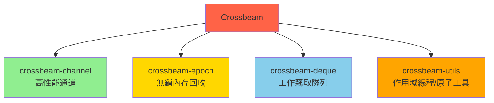
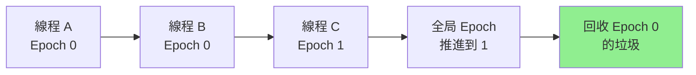
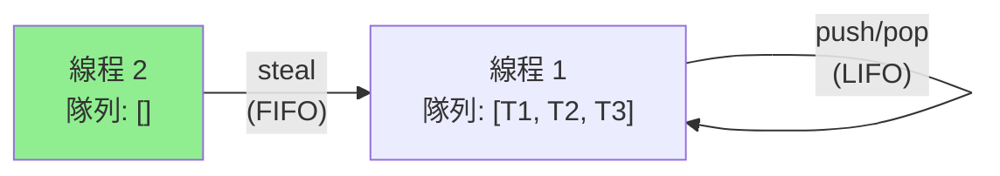

# Crossbeam 併發原語 (Crossbeam Concurrency Primitives)

## 核心概念

**Crossbeam** 是 Rust 生態中最重要的併發工具集，提供比標準庫更強大的併發原語。

**核心組件**:


**為什麼使用 Crossbeam?**
- **性能**: 無鎖數據結構，比標準庫快 2-10x
- **功能**: Select 多路復用、作用域線程
- **安全**: 編譯期保證內存安全

```toml
[dependencies]
crossbeam = "0.8"
# 或單獨引入組件
crossbeam-channel = "0.5"
crossbeam-epoch = "0.9"
crossbeam-deque = "0.8"
crossbeam-utils = "0.8"
```

---

## crossbeam-channel - 高性能通道

### 通道類型對比

| 類型 | 容量 | 性能 | 使用場景 |
|-----|------|------|---------|
| **unbounded** | 無限 | 高 | 生產速度 > 消費速度 |
| **bounded** | 固定 | 最高 | 需要背壓控制 |
| **std::mpsc** | 無限 | 中 | 簡單場景 |

### 無界通道 (Unbounded Channel)

```rust
use crossbeam::channel;
use std::thread;

fn unbounded_example() {
    // 創建無界通道 (無容量限制)
    let (tx, rx) = channel::unbounded();
    
    // 發送者線程
    thread::spawn(move || {
        for i in 0..100 {
            // send() 永不阻塞 (除非接收者已斷開)
            tx.send(i).unwrap();
            println!("[TX] Sent: {}", i);
        }
        // tx 離開作用域時自動關閉通道
    });
    
    // 接收者
    for msg in rx {
        println!("[RX] Received: {}", msg);
        // 模擬慢速消費者
        thread::sleep(std::time::Duration::from_millis(10));
    }
}
```

### 有界通道 (Bounded Channel)

```rust
use crossbeam::channel;
use std::thread;
use std::time::Duration;

fn bounded_example() {
    // 創建容量為 5 的有界通道
    let (tx, rx) = channel::bounded(5);
    
    // 生產者
    let tx_clone = tx.clone();
    thread::spawn(move || {
        for i in 0..20 {
            // 當通道滿時，send() 會阻塞
            println!("[TX] Trying to send {}", i);
            tx_clone.send(i).unwrap();
            println!("[TX] Sent {}", i);
        }
    });
    
    // 消費者 (慢速)
    thread::sleep(Duration::from_millis(500));
    while let Ok(msg) = rx.recv() {
        println!("[RX] Received: {}", msg);
        thread::sleep(Duration::from_millis(100));
    }
}
```

### Select 多路復用

**概念**: 同時監聽多個通道，哪個先準備好就處理哪個

```rust
use crossbeam::channel;
use crossbeam::select;
use std::thread;
use std::time::Duration;

fn select_example() {
    let (tx1, rx1) = channel::unbounded();
    let (tx2, rx2) = channel::unbounded();
    let (stop_tx, stop_rx) = channel::unbounded();
    
    // 生產者 1: 每 100ms 發送一次
    thread::spawn(move || {
        for i in 0.. {
            tx1.send(format!("Stream1-{}", i)).unwrap();
            thread::sleep(Duration::from_millis(100));
        }
    });
    
    // 生產者 2: 每 150ms 發送一次
    thread::spawn(move || {
        for i in 0.. {
            tx2.send(format!("Stream2-{}", i)).unwrap();
            thread::sleep(Duration::from_millis(150));
        }
    });
    
    // 5 秒後發送停止信號
    thread::spawn(move || {
        thread::sleep(Duration::from_secs(5));
        stop_tx.send(()).unwrap();
    });
    
    // 多路復用接收
    loop {
        select! {
            recv(rx1) -> msg => {
                println!("From channel 1: {:?}", msg);
            }
            recv(rx2) -> msg => {
                println!("From channel 2: {:?}", msg);
            }
            recv(stop_rx) -> _ => {
                println!("Stop signal received");
                break;
            }
        }
    }
}
```

### 非阻塞操作

```rust
use crossbeam::channel;

fn nonblocking_example() {
    let (tx, rx) = channel::bounded(3);
    
    // try_send: 非阻塞發送
    match tx.try_send(42) {
        Ok(()) => println!("Sent successfully"),
        Err(e) => println!("Send failed: {:?}", e), // 通道滿或已關閉
    }
    
    // try_recv: 非阻塞接收
    match rx.try_recv() {
        Ok(msg) => println!("Received: {}", msg),
        Err(e) => println!("Recv failed: {:?}", e), // 通道空或已關閉
    }
    
    // recv_timeout: 超時接收
    use std::time::Duration;
    match rx.recv_timeout(Duration::from_secs(1)) {
        Ok(msg) => println!("Received: {}", msg),
        Err(_) => println!("Timeout"),
    }
}
```

---

## crossbeam-epoch - 無鎖內存回收

### Epoch-Based Reclamation (EBR) 原理

**問題**: 無鎖數據結構中，如何安全回收已刪除的節點？  
**解決**: 延遲回收，等所有線程都不再訪問該節點



### 基本使用

```rust
use crossbeam_epoch::{self as epoch, Atomic, Owned, Shared};
use std::sync::atomic::Ordering;

struct Node<T> {
    data: T,
    next: Atomic<Node<T>>,  // 原子指針
}

struct Stack<T> {
    head: Atomic<Node<T>>,
}

impl<T> Stack<T> {
    fn new() -> Self {
        Self {
            head: Atomic::null(),
        }
    }
    
    fn push(&self, data: T) {
        // Pin 當前線程到一個 epoch
        let guard = epoch::pin();
        
        // 創建新節點 (Owned = 擁有所有權的指針)
        let mut new_node = Owned::new(Node {
            data,
            next: Atomic::null(),
        });
        
        loop {
            // 載入當前 head (Shared = 共享指針)
            let head = self.head.load(Ordering::Acquire, &guard);
            
            // 設置新節點的 next 指向當前 head
            new_node.next.store(head, Ordering::Relaxed);
            
            // CAS 更新 head
            match self.head.compare_exchange(
                head,
                new_node,
                Ordering::Release,
                Ordering::Acquire,
                &guard,
            ) {
                Ok(_) => return,  // 成功
                Err(e) => new_node = e.new,  // 失敗，重試
            }
        }
    }
    
    fn pop(&self) -> Option<T> {
        let guard = epoch::pin();
        
        loop {
            let head = self.head.load(Ordering::Acquire, &guard);
            
            // 將 Shared 轉為引用 (unsafe，但由 guard 保護)
            match unsafe { head.as_ref() } {
                None => return None,  // 棧為空
                Some(h) => {
                    let next = h.next.load(Ordering::Acquire, &guard);
                    
                    // CAS 更新 head 到下一個節點
                    if self.head.compare_exchange(
                        head,
                        next,
                        Ordering::Release,
                        Ordering::Acquire,
                        &guard,
                    ).is_ok() {
                        // 成功彈出，延遲銷毀舊 head
                        unsafe {
                            guard.defer_destroy(head);
                            // 讀取數據 (head 仍然有效，因為 guard 保護)
                            return Some(std::ptr::read(&h.data));
                        }
                    }
                }
            }
        }
    }
}

unsafe impl<T: Send> Send for Stack<T> {}
unsafe impl<T: Send> Sync for Stack<T> {}
```

### 垃圾回收策略

```rust
use crossbeam_epoch as epoch;

fn garbage_collection() {
    let guard = epoch::pin();
    
    // 方法 1: defer_destroy - 延遲銷毀
    // 等所有線程離開當前 epoch 後銷毀
    unsafe {
        guard.defer_destroy(some_ptr);
    }
    
    // 方法 2: defer - 自定義清理函數
    guard.defer(move || {
        println!("Cleaning up resources");
        // 自定義清理邏輯
    });
    
    // 方法 3: flush - 手動觸發垃圾回收
    guard.flush();  // 執行當前線程的所有延遲銷毀
}
```

---

## crossbeam-deque - 工作竊取隊列

### 工作竊取 (Work-Stealing) 原理

**概念**: 空閒線程從繁忙線程的隊列"竊取"任務



**優勢**: 自動負載均衡，減少線程空閒時間

### 基本使用

```rust
use crossbeam_deque::{Injector, Stealer, Worker};
use std::thread;

fn work_stealing_example() {
    // Injector: 全局任務注入器
    let injector = Injector::new();
    
    // Worker: 每個線程的本地隊列
    let worker1 = Worker::new_fifo();
    let worker2 = Worker::new_lifo();
    
    // Stealer: 用於竊取其他線程的任務
    let stealer1 = worker1.stealer();
    let stealer2 = worker2.stealer();
    
    // 注入初始任務
    for i in 0..100 {
        injector.push(i);
    }
    
    // 線程 1
    let stealers = vec![stealer2.clone()];
    thread::spawn(move || {
        loop {
            // 1. 從本地隊列取任務
            let task = worker1.pop().or_else(|| {
                // 2. 從全局隊列竊取
                loop {
                    match injector.steal_batch_and_pop(&worker1) {
                        crossbeam_deque::Steal::Success(t) => break Some(t),
                        crossbeam_deque::Steal::Empty => break None,
                        crossbeam_deque::Steal::Retry => continue,
                    }
                }
            }).or_else(|| {
                // 3. 從其他線程竊取
                stealers.iter().find_map(|s| s.steal().success())
            });
            
            match task {
                Some(t) => println!("Worker 1 processing: {}", t),
                None => break,  // 沒有更多任務
            }
        }
    });
    
    // 線程 2 類似...
}
```

### 性能對比

```rust
use crossbeam_deque::Worker;
use std::sync::{Arc, Mutex};
use std::collections::VecDeque;

// 方案 1: 標準庫 Mutex + VecDeque
fn mutex_queue() {
    let queue = Arc::new(Mutex::new(VecDeque::new()));
    
    // 每次 push/pop 都需要加鎖
    queue.lock().unwrap().push_back(42);
    queue.lock().unwrap().pop_front();
}

// 方案 2: Crossbeam Worker (無鎖)
fn worker_queue() {
    let worker = Worker::new_fifo();
    
    // 無鎖操作，性能高 5-10x
    worker.push(42);
    worker.pop();
}
```

---

## crossbeam-utils - 實用工具

### 作用域線程 (Scoped Threads)

**問題**: 標準庫 `thread::spawn` 要求 `'static` 生命週期  
**解決**: `crossbeam::scope` 允許借用棧上數據

```rust
use crossbeam;

fn scoped_threads() {
    let mut data = vec![1, 2, 3, 4, 5];
    
    // scope 保證所有線程在作用域結束前完成
    crossbeam::scope(|s| {
        // 可以借用 data (無需 Arc)
        s.spawn(|_| {
            for x in &mut data[0..2] {
                *x *= 2;
            }
        });
        
        s.spawn(|_| {
            for x in &mut data[3..5] {
                *x *= 3;
            }
        });
    }).unwrap();  // 所有線程自動 join
    
    println!("{:?}", data);  // [2, 4, 3, 12, 15]
}
```

### 線程本地變量

```rust
use crossbeam_utils::thread;

fn thread_local_example() {
    let data = vec![1, 2, 3, 4, 5];
    
    thread::scope(|s| {
        for &x in &data {
            s.spawn(move |_| {
                // 每個線程有自己的 x 副本
                println!("Thread {:?}: {}", std::thread::current().id(), x);
            });
        }
    }).unwrap();
}
```

### 緩存行填充 (Cache-Line Padding)

**概念**: 避免偽共享 (False Sharing)

```rust
use crossbeam_utils::CachePadded;
use std::sync::atomic::AtomicU64;

// ❌ 不好: 兩個原子變量在同一緩存行，導致偽共享
struct BadCounter {
    counter1: AtomicU64,  // 假設在地址 0x0
    counter2: AtomicU64,  // 在地址 0x8 (同一緩存行)
}

// ✅ 好: 使用緩存行填充
struct GoodCounter {
    counter1: CachePadded<AtomicU64>,  // 獨立緩存行
    counter2: CachePadded<AtomicU64>,  // 獨立緩存行
}

// 性能提升: 多線程場景下快 3-5x
```

---

## 實戰案例

### 案例 1: 生產者-消費者 (帶超時)

```rust
use crossbeam::channel;
use std::thread;
use std::time::Duration;

fn producer_consumer() {
    let (tx, rx) = channel::bounded(10);
    
    // 生產者
    let producer = thread::spawn(move || {
        for i in 0..100 {
            match tx.send_timeout(i, Duration::from_millis(100)) {
                Ok(()) => println!("[P] Sent: {}", i),
                Err(_) => {
                    println!("[P] Timeout sending {}", i);
                    break;
                }
            }
        }
    });
    
    // 消費者
    let consumer = thread::spawn(move || {
        loop {
            match rx.recv_timeout(Duration::from_secs(1)) {
                Ok(item) => {
                    println!("[C] Received: {}", item);
                    thread::sleep(Duration::from_millis(50));
                }
                Err(_) => {
                    println!("[C] Timeout, exiting");
                    break;
                }
            }
        }
    });
    
    producer.join().unwrap();
    consumer.join().unwrap();
}
```

### 案例 2: 並行管道 (Pipeline)

```rust
use crossbeam::channel;
use std::thread;

fn parallel_pipeline() {
    let (input_tx, input_rx) = channel::unbounded();
    let (stage1_tx, stage1_rx) = channel::unbounded();
    let (stage2_tx, stage2_rx) = channel::unbounded();
    
    // 階段 1: 平方
    thread::spawn(move || {
        while let Ok(x) = input_rx.recv() {
            let result = x * x;
            stage1_tx.send(result).unwrap();
        }
    });
    
    // 階段 2: 加 10
    thread::spawn(move || {
        while let Ok(x) = stage1_rx.recv() {
            let result = x + 10;
            stage2_tx.send(result).unwrap();
        }
    });
    
    // 階段 3: 輸出
    let output = thread::spawn(move || {
        let mut results = Vec::new();
        while let Ok(x) = stage2_rx.recv() {
            results.push(x);
        }
        results
    });
    
    // 輸入數據
    for i in 0..10 {
        input_tx.send(i).unwrap();
    }
    drop(input_tx);  // 關閉通道
    
    let results = output.join().unwrap();
    println!("{:?}", results);  // [10, 11, 14, 19, 26, ...]
}
```

### 案例 3: 扇出-扇入 (Fan-Out Fan-In)

```rust
use crossbeam::channel;
use std::thread;

fn fan_out_fan_in() {
    let (input_tx, input_rx) = channel::unbounded();
    let (output_tx, output_rx) = channel::unbounded();
    
    // 輸入
    thread::spawn(move || {
        for i in 0..100 {
            input_tx.send(i).unwrap();
        }
    });
    
    // 扇出: 4 個工作線程
    let num_workers = 4;
    for worker_id in 0..num_workers {
        let input_rx = input_rx.clone();
        let output_tx = output_tx.clone();
        
        thread::spawn(move || {
            while let Ok(num) = input_rx.recv() {
                // 模擬計算: 斐波那契數
                let result = fibonacci(num);
                output_tx.send((num, result)).unwrap();
                println!("[Worker {}] fib({}) = {}", worker_id, num, result);
            }
        });
    }
    drop(output_tx);  // 關閉輸出通道
    
    // 扇入: 收集結果
    let mut results = Vec::new();
    while let Ok((num, fib)) = output_rx.recv() {
        results.push((num, fib));
    }
    
    results.sort_by_key(|&(num, _)| num);
    println!("Results: {:?}", results);
}

fn fibonacci(n: i32) -> i32 {
    match n {
        0 => 0,
        1 => 1,
        _ => fibonacci(n - 1) + fibonacci(n - 2),
    }
}
```

### 案例 4: 無鎖計數器

```rust
use crossbeam_epoch::{self as epoch, Atomic};
use std::sync::atomic::{AtomicU64, Ordering};
use std::thread;

struct Counter {
    value: AtomicU64,
}

impl Counter {
    fn new() -> Self {
        Self {
            value: AtomicU64::new(0),
        }
    }
    
    fn increment(&self) -> u64 {
        self.value.fetch_add(1, Ordering::Relaxed)
    }
    
    fn get(&self) -> u64 {
        self.value.load(Ordering::Relaxed)
    }
}

fn lockfree_counter() {
    let counter = Counter::new();
    
    let handles: Vec<_> = (0..10)
        .map(|_| {
            thread::spawn(|| {
                for _ in 0..10000 {
                    counter.increment();
                }
            })
        })
        .collect();
    
    for h in handles {
        h.join().unwrap();
    }
    
    println!("Final count: {}", counter.get());  // 100000
}
```

---

## 性能對比

### Channel 性能測試

```rust
use criterion::{black_box, criterion_group, criterion_main, Criterion};
use crossbeam::channel as cb_channel;
use std::sync::mpsc;

fn bench_channels(c: &mut Criterion) {
    let mut group = c.benchmark_group("channels");
    
    // 標準庫 mpsc
    group.bench_function("std_mpsc", |b| {
        let (tx, rx) = mpsc::channel();
        b.iter(|| {
            tx.send(black_box(42)).unwrap();
            rx.recv().unwrap();
        });
    });
    
    // Crossbeam unbounded
    group.bench_function("crossbeam_unbounded", |b| {
        let (tx, rx) = cb_channel::unbounded();
        b.iter(|| {
            tx.send(black_box(42)).unwrap();
            rx.recv().unwrap();
        });
    });
    
    // Crossbeam bounded
    group.bench_function("crossbeam_bounded", |b| {
        let (tx, rx) = cb_channel::bounded(100);
        b.iter(|| {
            tx.send(black_box(42)).unwrap();
            rx.recv().unwrap();
        });
    });
    
    group.finish();
}

criterion_group!(benches, bench_channels);
criterion_main!(benches);

// 典型結果:
// std_mpsc:            ~200 ns
// crossbeam_unbounded: ~50 ns  (4x 快)
// crossbeam_bounded:   ~30 ns  (6x 快)
```

---

## 最佳實踐

### 1. 選擇合適的通道類型

```rust
// ✅ 有界通道: 需要背壓控制
let (tx, rx) = channel::bounded(100);

// ✅ 無界通道: 生產速度 > 消費速度
let (tx, rx) = channel::unbounded();

// ✅ 容量為 0: 同步握手通道
let (tx, rx) = channel::bounded(0);
```

### 2. 使用 Select 處理多輸入

```rust
use crossbeam::{channel, select};

// ✅ 好: 統一處理多個輸入源
loop {
    select! {
        recv(rx1) -> msg => handle_source1(msg),
        recv(rx2) -> msg => handle_source2(msg),
        default(Duration::from_millis(100)) => {
            // 超時處理
        }
    }
}
```

### 3. 正確使用 Epoch

```rust
use crossbeam_epoch as epoch;

// ✅ 正確: guard 在整個訪問期間有效
let guard = epoch::pin();
let ptr = atomic.load(Ordering::Acquire, &guard);
unsafe {
    if let Some(node) = ptr.as_ref() {
        // 使用 node (guard 保護)
    }
}  // guard 離開作用域

// ❌ 錯誤: guard 過早釋放
let ptr = {
    let guard = epoch::pin();
    atomic.load(Ordering::Acquire, &guard)
};  // guard 已釋放，ptr 不再安全
```

---

## 參考資料 (References)

1. [Crossbeam Documentation](https://docs.rs/crossbeam/latest/crossbeam/)
2. [Epoch-Based Reclamation Paper](https://www.cl.cam.ac.uk/techreports/UCAM-CL-TR-579.pdf)
3. [Work-Stealing Algorithm](https://en.wikipedia.org/wiki/Work_stealing)
4. [Crossbeam GitHub](https://github.com/crossbeam-rs/crossbeam)
5. 《Rust Atomics and Locks》 (Mara Bos, 2023)
