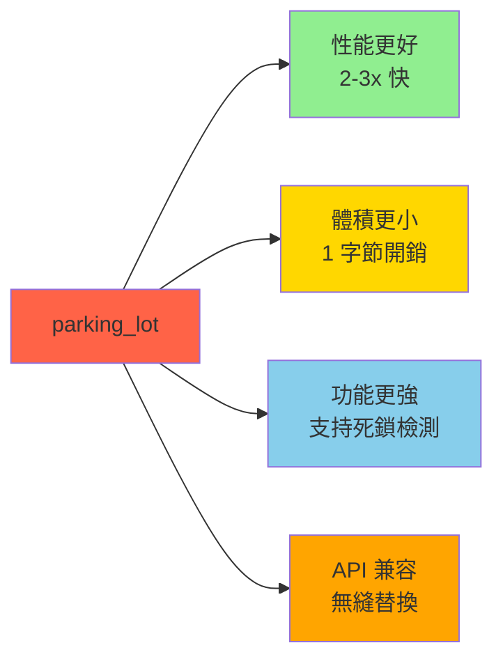
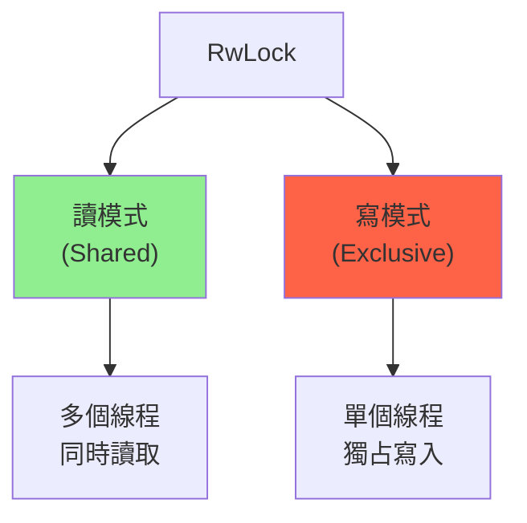

# Parking_lot 同步原語 (Parking_lot Synchronization Primitives)

## 核心概念

**Parking_lot** 是標準庫同步原語的高性能替代品，提供更快、更小、功能更強的鎖。

**核心優勢**:


**為什麼更快？**
- **更小的開銷**: `Mutex<T>` 只需 1 字節 (標準庫需 24 字節)
- **無中毒**: 線程 panic 不會"中毒"鎖
- **公平性**: 避免線程饑餓

```toml
[dependencies]
parking_lot = "0.12"

# 啟用死鎖檢測 (僅開發環境)
[dev-dependencies]
parking_lot = { version = "0.12", features = ["deadlock_detection"] }
```

---

## Mutex - 互斥鎖

### 基本使用

```rust
use parking_lot::Mutex;
use std::sync::Arc;
use std::thread;

fn mutex_example() {
    // 創建互斥鎖 (無需 unwrap，因為無中毒)
    let counter = Arc::new(Mutex::new(0));
    
    let handles: Vec<_> = (0..10)
        .map(|_| {
            let counter = Arc::clone(&counter);
            thread::spawn(move || {
                for _ in 0..1000 {
                    // lock() 返回 MutexGuard，無需 unwrap
                    let mut num = counter.lock();
                    *num += 1;
                    // num 離開作用域時自動解鎖
                }
            })
        })
        .collect();
    
    for h in handles {
        h.join().unwrap();
    }
    
    println!("Result: {}", *counter.lock());  // 10000
}
```

### 與標準庫對比

```rust
// 標準庫 Mutex
use std::sync::Mutex as StdMutex;
let mutex = StdMutex::new(0);
let guard = mutex.lock().unwrap();  // 需要處理 PoisonError

// parking_lot Mutex
use parking_lot::Mutex;
let mutex = Mutex::new(0);
let guard = mutex.lock();  // 無 PoisonError，更簡潔
```

### 高級功能

```rust
use parking_lot::Mutex;
use std::time::Duration;

fn advanced_mutex() {
    let mutex = Mutex::new(0);
    
    // try_lock: 非阻塞加鎖
    if let Some(mut guard) = mutex.try_lock() {
        *guard += 1;
    } else {
        println!("Lock is held by another thread");
    }
    
    // try_lock_for: 超時加鎖
    if let Some(mut guard) = mutex.try_lock_for(Duration::from_millis(100)) {
        *guard += 1;
    } else {
        println!("Timeout acquiring lock");
    }
    
    // is_locked: 檢查是否被鎖定 (無需加鎖)
    if mutex.is_locked() {
        println!("Mutex is currently locked");
    }
}
```

---

## RwLock - 讀寫鎖

### 讀寫鎖原理

**概念**: 允許多個讀者或一個寫者



### 基本使用

```rust
use parking_lot::RwLock;
use std::sync::Arc;
use std::thread;

fn rwlock_example() {
    let data = Arc::new(RwLock::new(vec![1, 2, 3]));
    
    // 多個讀線程 (並發讀取)
    let readers: Vec<_> = (0..5)
        .map(|i| {
            let data = Arc::clone(&data);
            thread::spawn(move || {
                // read() 返回 RwLockReadGuard
                let guard = data.read();
                println!("Reader {}: {:?}", i, *guard);
                // guard 離開作用域時自動釋放讀鎖
            })
        })
        .collect();
    
    // 一個寫線程 (等待所有讀者完成)
    let data_clone = Arc::clone(&data);
    let writer = thread::spawn(move || {
        // write() 返回 RwLockWriteGuard
        let mut guard = data_clone.write();
        guard.push(4);
        println!("Writer: pushed 4");
    });
    
    for r in readers {
        r.join().unwrap();
    }
    writer.join().unwrap();
    
    println!("Final data: {:?}", *data.read());
}
```

### 讀寫鎖升級

```rust
use parking_lot::{RwLock, RwLockUpgradableReadGuard};

fn upgradable_lock() {
    let data = RwLock::new(vec![1, 2, 3]);
    
    // upgradable_read: 可升級的讀鎖
    let guard = data.upgradable_read();
    println!("Current data: {:?}", *guard);
    
    // 檢查是否需要修改
    if guard.len() < 5 {
        // 升級為寫鎖 (原子操作)
        let mut write_guard = RwLockUpgradableReadGuard::upgrade(guard);
        write_guard.push(4);
        write_guard.push(5);
        println!("Updated data: {:?}", *write_guard);
    }
}
```

### 性能對比

```rust
use parking_lot::RwLock as ParkingLotRwLock;
use std::sync::RwLock as StdRwLock;
use std::time::Instant;

fn benchmark_rwlock() {
    let data = vec![0i32; 1000];
    
    // 標準庫 RwLock
    let std_rwlock = StdRwLock::new(data.clone());
    let start = Instant::now();
    for _ in 0..100000 {
        let _ = std_rwlock.read().unwrap();
    }
    println!("std::RwLock: {:?}", start.elapsed());
    
    // parking_lot RwLock
    let pl_rwlock = ParkingLotRwLock::new(data.clone());
    let start = Instant::now();
    for _ in 0..100000 {
        let _ = pl_rwlock.read();
    }
    println!("parking_lot::RwLock: {:?}", start.elapsed());
    
    // 典型結果:
    // std::RwLock:         ~50 ms
    // parking_lot::RwLock: ~20 ms (2.5x 快)
}
```

---

## Condvar - 條件變量

### 基本使用

```rust
use parking_lot::{Mutex, Condvar};
use std::sync::Arc;
use std::thread;
use std::time::Duration;

fn condvar_example() {
    let pair = Arc::new((Mutex::new(false), Condvar::new()));
    
    // 等待線程
    let pair_clone = Arc::clone(&pair);
    let waiter = thread::spawn(move || {
        let (lock, cvar) = &*pair_clone;
        let mut ready = lock.lock();
        
        println!("Waiting...");
        
        // wait: 釋放鎖並等待通知
        while !*ready {
            cvar.wait(&mut ready);
        }
        
        println!("Ready!");
    });
    
    // 通知線程
    thread::sleep(Duration::from_secs(1));
    let (lock, cvar) = &*pair;
    {
        let mut ready = lock.lock();
        *ready = true;
    }  // 釋放鎖
    
    cvar.notify_one();  // 喚醒一個等待的線程
    // cvar.notify_all();  // 喚醒所有等待的線程
    
    waiter.join().unwrap();
}
```

### 超時等待

```rust
use parking_lot::{Mutex, Condvar};
use std::time::Duration;

fn condvar_timeout() {
    let lock = Mutex::new(false);
    let cvar = Condvar::new();
    
    let mut guard = lock.lock();
    
    // wait_for: 超時等待
    let result = cvar.wait_for(&mut guard, Duration::from_secs(1));
    
    if result.timed_out() {
        println!("Timeout!");
    } else {
        println!("Notified!");
    }
}
```

---

## Once - 單次初始化

### 基本使用

```rust
use parking_lot::Once;
use std::sync::Arc;
use std::thread;

static INIT: Once = Once::new();
static mut DATA: Option<String> = None;

fn get_data() -> &'static str {
    // call_once: 保證只執行一次
    INIT.call_once(|| {
        println!("Initializing...");
        unsafe {
            DATA = Some("Hello, World!".to_string());
        }
    });
    
    unsafe { DATA.as_ref().unwrap() }
}

fn once_example() {
    let handles: Vec<_> = (0..10)
        .map(|i| {
            thread::spawn(move || {
                println!("Thread {}: {}", i, get_data());
            })
        })
        .collect();
    
    for h in handles {
        h.join().unwrap();
    }
    
    // "Initializing..." 只會打印一次
}
```

### 與 lazy_static 對比

```rust
// lazy_static 宏
use lazy_static::lazy_static;
lazy_static! {
    static ref CONFIG: String = load_config();
}

// parking_lot::Once (手動控制)
use parking_lot::Once;
static INIT: Once = Once::new();
static mut CONFIG: Option<String> = None;

fn get_config() -> &'static String {
    INIT.call_once(|| {
        unsafe { CONFIG = Some(load_config()); }
    });
    unsafe { CONFIG.as_ref().unwrap() }
}

fn load_config() -> String {
    "config".to_string()
}
```

---

## 死鎖檢測

### 啟用死鎖檢測

```rust
use parking_lot::{Mutex, deadlock};
use std::thread;
use std::time::Duration;

fn setup_deadlock_detection() {
    // 啟動死鎖檢測線程
    thread::spawn(move || {
        loop {
            thread::sleep(Duration::from_secs(1));
            
            // 檢查死鎖
            let deadlocks = deadlock::check_deadlock();
            if !deadlocks.is_empty() {
                println!("🚨 Deadlock detected!");
                
                for (i, threads) in deadlocks.iter().enumerate() {
                    println!("Deadlock #{}", i);
                    for t in threads {
                        println!("  Thread: {:?}", t.thread_id());
                        println!("  Backtrace:\n{:?}", t.backtrace());
                    }
                }
                
                // 實際應用中可能需要:
                // - 記錄到日誌
                // - 發送告警
                // - 重啟服務
                std::process::exit(1);
            }
        }
    });
}

fn main() {
    setup_deadlock_detection();
    
    // 你的代碼...
    let mutex1 = Mutex::new(());
    let mutex2 = Mutex::new(());
    
    // 故意製造死鎖
    let m1 = mutex1.lock();
    let m2 = mutex2.lock();
    // ...
}
```

---

## 實戰案例

### 案例 1: 線程安全緩存

```rust
use parking_lot::RwLock;
use std::collections::HashMap;
use std::sync::Arc;

struct Cache<K, V> {
    data: RwLock<HashMap<K, V>>,
}

impl<K: Eq + std::hash::Hash, V: Clone> Cache<K, V> {
    fn new() -> Self {
        Self {
            data: RwLock::new(HashMap::new()),
        }
    }
    
    fn get(&self, key: &K) -> Option<V> {
        // 讀鎖: 高並發讀取
        let guard = self.data.read();
        guard.get(key).cloned()
    }
    
    fn insert(&self, key: K, value: V) {
        // 寫鎖: 獨占寫入
        let mut guard = self.data.write();
        guard.insert(key, value);
    }
    
    fn get_or_insert_with<F>(&self, key: K, f: F) -> V
    where
        F: FnOnce() -> V,
        K: Clone,
    {
        // 先嘗試讀取 (快速路徑)
        {
            let guard = self.data.read();
            if let Some(v) = guard.get(&key) {
                return v.clone();
            }
        }  // 釋放讀鎖
        
        // 計算新值
        let value = f();
        
        // 獲取寫鎖並插入
        let mut guard = self.data.write();
        guard.entry(key).or_insert(value).clone()
    }
}

fn cache_example() {
    let cache = Arc::new(Cache::new());
    
    // 多個線程同時訪問
    let mut handles = vec![];
    
    for i in 0..10 {
        let cache = Arc::clone(&cache);
        let handle = std::thread::spawn(move || {
            // get_or_insert_with: 懶加載
            let value = cache.get_or_insert_with(i % 3, || {
                println!("Computing value for key {}", i % 3);
                format!("value-{}", i % 3)
            });
            println!("Thread {}: {}", i, value);
        });
        handles.push(handle);
    }
    
    for h in handles {
        h.join().unwrap();
    }
}
```

### 案例 2: 生產者-消費者隊列

```rust
use parking_lot::{Mutex, Condvar};
use std::collections::VecDeque;
use std::sync::Arc;
use std::thread;
use std::time::Duration;

struct Queue<T> {
    data: Mutex<VecDeque<T>>,
    not_empty: Condvar,  // 隊列非空信號
    not_full: Condvar,   // 隊列未滿信號
    capacity: usize,
}

impl<T> Queue<T> {
    fn new(capacity: usize) -> Self {
        Self {
            data: Mutex::new(VecDeque::with_capacity(capacity)),
            not_empty: Condvar::new(),
            not_full: Condvar::new(),
            capacity,
        }
    }
    
    fn push(&self, item: T) {
        let mut queue = self.data.lock();
        
        // 等待隊列未滿
        while queue.len() >= self.capacity {
            self.not_full.wait(&mut queue);
        }
        
        queue.push_back(item);
        self.not_empty.notify_one();  // 通知消費者
    }
    
    fn pop(&self) -> T {
        let mut queue = self.data.lock();
        
        // 等待隊列非空
        while queue.is_empty() {
            self.not_empty.wait(&mut queue);
        }
        
        let item = queue.pop_front().unwrap();
        self.not_full.notify_one();  // 通知生產者
        item
    }
}

fn producer_consumer_queue() {
    let queue = Arc::new(Queue::new(5));
    
    // 生產者
    let q = Arc::clone(&queue);
    let producer = thread::spawn(move || {
        for i in 0..20 {
            q.push(i);
            println!("[P] Produced: {}", i);
            thread::sleep(Duration::from_millis(50));
        }
    });
    
    // 消費者
    let q = Arc::clone(&queue);
    let consumer = thread::spawn(move || {
        for _ in 0..20 {
            let item = q.pop();
            println!("[C] Consumed: {}", item);
            thread::sleep(Duration::from_millis(100));
        }
    });
    
    producer.join().unwrap();
    consumer.join().unwrap();
}
```

### 案例 3: 對象池

```rust
use parking_lot::Mutex;
use std::sync::Arc;

struct Pool<T> {
    objects: Mutex<Vec<T>>,
    factory: Box<dyn Fn() -> T + Send + Sync>,
}

impl<T> Pool<T> {
    fn new<F>(factory: F) -> Self
    where
        F: Fn() -> T + Send + Sync + 'static,
    {
        Self {
            objects: Mutex::new(Vec::new()),
            factory: Box::new(factory),
        }
    }
    
    fn acquire(&self) -> PoolGuard<T> {
        let mut objects = self.objects.lock();
        
        let object = objects.pop().unwrap_or_else(|| {
            // 池中無對象，創建新對象
            (self.factory)()
        });
        
        PoolGuard {
            object: Some(object),
            pool: self,
        }
    }
    
    fn release(&self, object: T) {
        let mut objects = self.objects.lock();
        objects.push(object);
    }
}

struct PoolGuard<'a, T> {
    object: Option<T>,
    pool: &'a Pool<T>,
}

impl<T> std::ops::Deref for PoolGuard<'_, T> {
    type Target = T;
    
    fn deref(&self) -> &T {
        self.object.as_ref().unwrap()
    }
}

impl<T> std::ops::DerefMut for PoolGuard<'_, T> {
    fn deref_mut(&mut self) -> &mut T {
        self.object.as_mut().unwrap()
    }
}

impl<T> Drop for PoolGuard<'_, T> {
    fn drop(&mut self) {
        // 歸還對象到池中
        if let Some(object) = self.object.take() {
            self.pool.release(object);
        }
    }
}

// 使用範例
fn pool_example() {
    let pool = Arc::new(Pool::new(|| vec![0; 1024]));
    
    let mut handles = vec![];
    for i in 0..10 {
        let pool = Arc::clone(&pool);
        let handle = std::thread::spawn(move || {
            // 從池中獲取對象
            let mut buffer = pool.acquire();
            
            // 使用對象
            buffer[0] = i;
            println!("Thread {}: using buffer", i);
            
            std::thread::sleep(std::time::Duration::from_millis(100));
            
            // buffer 離開作用域時自動歸還
        });
        handles.push(handle);
    }
    
    for h in handles {
        h.join().unwrap();
    }
}
```

---

## 性能對比

```rust
use criterion::{black_box, criterion_group, criterion_main, Criterion};
use parking_lot::Mutex as PlMutex;
use std::sync::Mutex as StdMutex;
use std::sync::Arc;
use std::thread;

fn benchmark_mutex(c: &mut Criterion) {
    let mut group = c.benchmark_group("mutex");
    
    // 標準庫 Mutex
    group.bench_function("std_mutex", |b| {
        let mutex = Arc::new(StdMutex::new(0));
        b.iter(|| {
            let mut guard = mutex.lock().unwrap();
            *guard += 1;
        });
    });
    
    // parking_lot Mutex
    group.bench_function("parking_lot_mutex", |b| {
        let mutex = Arc::new(PlMutex::new(0));
        b.iter(|| {
            let mut guard = mutex.lock();
            *guard += 1;
        });
    });
    
    group.finish();
}

criterion_group!(benches, benchmark_mutex);
criterion_main!(benches);

// 典型結果:
// std_mutex:         ~25 ns
// parking_lot_mutex: ~10 ns (2.5x 快)
```

---

## 最佳實踐

### 1. 何時使用 parking_lot

```rust
// ✅ 適合: 高競爭場景
// 多個線程頻繁訪問同一鎖

// ✅ 適合: 需要高性能
// 性能敏感的應用

// ✅ 適合: 需要死鎖檢測
// 開發階段排查死鎖問題

// ❌ 不適合: 簡單場景
// 標準庫已足夠，無需額外依賴
```

### 2. 選擇合適的鎖類型

```rust
// Mutex: 需要修改數據
let data = Mutex::new(vec![]);

// RwLock: 讀多寫少
let data = RwLock::new(vec![]);

// Once: 單次初始化
static INIT: Once = Once::new();
```

### 3. 避免長時間持鎖

```rust
// ❌ 不好: 持鎖期間執行耗時操作
let mut data = mutex.lock();
expensive_computation();  // 阻塞其他線程
data.push(result);

// ✅ 好: 縮小臨界區
let result = expensive_computation();
let mut data = mutex.lock();
data.push(result);
```

---

## 參考資料 (References)

1. [parking_lot Documentation](https://docs.rs/parking_lot/latest/parking_lot/)
2. [parking_lot GitHub](https://github.com/Amanieu/parking_lot)
3. [Benchmarks vs std](https://github.com/Amanieu/parking_lot#benchmarks)
4. [Lock-Free vs Wait-Free](https://preshing.com/20120612/an-introduction-to-lock-free-programming/)
5. 《The Art of Multiprocessor Programming》 (Herlihy & Shavit, 2020)
