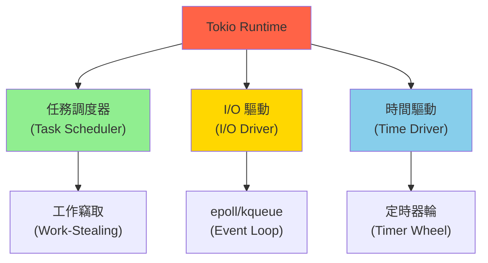

# Tokio 與異步運行時 (Tokio & Async Runtime)

## 核心概念

**Tokio** 是 Rust 最流行的異步運行時，為高性能 I/O 應用提供基礎設施。

**Tokio 架構**:


**核心特性**:
- **多線程調度器**: 高效利用多核 CPU
- **異步 I/O**: 非阻塞網路和文件操作
- **零成本抽象**: 性能接近手寫狀態機

```toml
[dependencies]
tokio = { version = "1.35", features = ["full"] }
# 或按需選擇特性
tokio = { version = "1.35", features = ["rt-multi-thread", "macros", "net", "time"] }
```

---

## 異步運行時配置

### 單線程運行時

```rust
use tokio;

// 方案 1: 使用宏
#[tokio::main(flavor = "current_thread")]
async fn main() {
    println!("Running on current thread");
    // 所有任務在同一線程執行
}

// 方案 2: 手動構建
fn main() {
    let rt = tokio::runtime::Builder::new_current_thread()
        .enable_all()  // 啟用 I/O 和時間驅動
        .build()
        .unwrap();
    
    rt.block_on(async {
        println!("Async code here");
    });
}
```

### 多線程運行時

```rust
use tokio;

// 方案 1: 使用宏 (默認多線程)
#[tokio::main]  // 等同於 #[tokio::main(flavor = "multi_thread")]
async fn main() {
    println!("Running on thread pool");
    // 任務在線程池中並行執行
}

// 方案 2: 手動構建
fn main() {
    let rt = tokio::runtime::Builder::new_multi_thread()
        .worker_threads(4)  // 設置工作線程數
        .thread_name("tokio-worker")
        .thread_stack_size(3 * 1024 * 1024)  // 3MB 棧
        .enable_all()
        .build()
        .unwrap();
    
    rt.block_on(async {
        println!("Async code here");
    });
}
```

### 性能調優

```rust
use tokio::runtime::Builder;

fn optimized_runtime() {
    let rt = Builder::new_multi_thread()
        // 1. 線程數配置 (默認 = CPU 核心數)
        .worker_threads(8)
        
        // 2. 任務調度配置
        .max_blocking_threads(512)  // 阻塞任務線程池大小
        .thread_keep_alive(std::time::Duration::from_secs(60))
        
        // 3. 事件循環配置
        .event_interval(61)  // 每 61 次循環檢查一次全局隊列
        .global_queue_interval(31)  // 每 31 次檢查全局隊列
        
        // 4. 啟用驅動
        .enable_io()     // I/O 驅動
        .enable_time()   // 時間驅動
        
        .build()
        .unwrap();
}
```

---

## 任務管理

### spawn - 創建任務

```rust
use tokio;

#[tokio::main]
async fn main() {
    // spawn: 在後台執行異步任務
    let handle = tokio::spawn(async {
        println!("Task running on thread: {:?}", std::thread::current().id());
        
        // 模擬異步工作
        tokio::time::sleep(tokio::time::Duration::from_secs(1)).await;
        
        42  // 返回值
    });
    
    // 等待任務完成
    let result = handle.await.unwrap();
    println!("Task result: {}", result);
}
```

### JoinHandle - 任務句柄

```rust
use tokio;

#[tokio::main]
async fn main() {
    let handle = tokio::spawn(async {
        // 長時間運行的任務
        loop {
            tokio::time::sleep(tokio::time::Duration::from_millis(100)).await;
            println!("Working...");
        }
    });
    
    // 取消任務
    tokio::time::sleep(tokio::time::Duration::from_secs(1)).await;
    handle.abort();  // 發送取消信號
    
    // 檢查任務狀態
    match handle.await {
        Ok(_) => println!("Task completed"),
        Err(e) if e.is_cancelled() => println!("Task was cancelled"),
        Err(e) if e.is_panic() => println!("Task panicked"),
        Err(_) => println!("Task failed"),
    }
}
```

### JoinSet - 管理多個任務

```rust
use tokio::task::JoinSet;

#[tokio::main]
async fn main() {
    let mut set = JoinSet::new();
    
    // 添加多個任務
    for i in 0..10 {
        set.spawn(async move {
            tokio::time::sleep(tokio::time::Duration::from_millis(i * 100)).await;
            format!("Task {} completed", i)
        });
    }
    
    // 等待所有任務完成 (按完成順序)
    while let Some(res) = set.join_next().await {
        match res {
            Ok(msg) => println!("{}", msg),
            Err(e) => eprintln!("Task error: {}", e),
        }
    }
}
```

---

## 異步 I/O

### TCP 服務器

```rust
use tokio::net::TcpListener;
use tokio::io::{AsyncReadExt, AsyncWriteExt};

#[tokio::main]
async fn main() -> Result<(), Box<dyn std::error::Error>> {
    // 綁定監聽地址
    let listener = TcpListener::bind("127.0.0.1:8080").await?;
    println!("Server listening on 127.0.0.1:8080");
    
    loop {
        // 接受新連接 (異步，不阻塞)
        let (mut socket, addr) = listener.accept().await?;
        println!("New connection from: {}", addr);
        
        // 為每個連接創建新任務
        tokio::spawn(async move {
            let mut buf = [0; 1024];
            
            loop {
                // 異步讀取數據
                let n = match socket.read(&mut buf).await {
                    Ok(0) => return,  // 連接關閉
                    Ok(n) => n,
                    Err(e) => {
                        eprintln!("Read error: {}", e);
                        return;
                    }
                };
                
                // 異步寫入數據 (回顯)
                if let Err(e) = socket.write_all(&buf[..n]).await {
                    eprintln!("Write error: {}", e);
                    return;
                }
            }
        });
    }
}
```

### TCP 客戶端

```rust
use tokio::net::TcpStream;
use tokio::io::{AsyncReadExt, AsyncWriteExt};

#[tokio::main]
async fn main() -> Result<(), Box<dyn std::error::Error>> {
    // 異步連接服務器
    let mut stream = TcpStream::connect("127.0.0.1:8080").await?;
    println!("Connected to server");
    
    // 發送數據
    stream.write_all(b"Hello, server!").await?;
    
    // 接收響應
    let mut buf = [0; 1024];
    let n = stream.read(&mut buf).await?;
    println!("Server response: {}", String::from_utf8_lossy(&buf[..n]));
    
    Ok(())
}
```

### 並發處理多個連接

```rust
use tokio::net::TcpStream;
use tokio::io::{AsyncReadExt, AsyncWriteExt};

#[tokio::main]
async fn main() -> Result<(), Box<dyn std::error::Error>> {
    // 並發創建 100 個連接
    let mut handles = vec![];
    
    for i in 0..100 {
        let handle = tokio::spawn(async move {
            let mut stream = TcpStream::connect("127.0.0.1:8080").await?;
            
            // 發送請求
            let msg = format!("Request from client {}", i);
            stream.write_all(msg.as_bytes()).await?;
            
            // 接收響應
            let mut buf = vec![0; 1024];
            let n = stream.read(&mut buf).await?;
            
            Ok::<_, Box<dyn std::error::Error>>(String::from_utf8_lossy(&buf[..n]).to_string())
        });
        
        handles.push(handle);
    }
    
    // 等待所有請求完成
    for handle in handles {
        match handle.await {
            Ok(Ok(response)) => println!("Response: {}", response),
            Ok(Err(e)) => eprintln!("Request error: {}", e),
            Err(e) => eprintln!("Task error: {}", e),
        }
    }
    
    Ok(())
}
```

---

## 時間與定時器

### sleep - 異步睡眠

```rust
use tokio::time::{sleep, Duration};

#[tokio::main]
async fn main() {
    println!("Sleeping for 2 seconds...");
    
    // 異步睡眠 (不阻塞線程)
    sleep(Duration::from_secs(2)).await;
    
    println!("Awake!");
}
```

### interval - 定時任務

```rust
use tokio::time::{interval, Duration};

#[tokio::main]
async fn main() {
    // 創建定時器 (每 500ms 觸發一次)
    let mut interval = interval(Duration::from_millis(500));
    
    for i in 0..10 {
        // 等待下一次觸發
        interval.tick().await;
        println!("Tick {}", i);
    }
}
```

### timeout - 超時控制

```rust
use tokio::time::{timeout, Duration};

async fn slow_operation() -> &'static str {
    tokio::time::sleep(Duration::from_secs(5)).await;
    "Done"
}

#[tokio::main]
async fn main() {
    // 設置 2 秒超時
    match timeout(Duration::from_secs(2), slow_operation()).await {
        Ok(result) => println!("Result: {}", result),
        Err(_) => println!("Operation timed out"),
    }
}
```

---

## 同步原語

### Mutex - 異步互斥鎖

```rust
use tokio::sync::Mutex;
use std::sync::Arc;

#[tokio::main]
async fn main() {
    let counter = Arc::new(Mutex::new(0));
    
    let mut handles = vec![];
    
    for _ in 0..10 {
        let counter = Arc::clone(&counter);
        let handle = tokio::spawn(async move {
            for _ in 0..1000 {
                // lock() 返回 Future，需要 await
                let mut num = counter.lock().await;
                *num += 1;
            }
        });
        handles.push(handle);
    }
    
    for handle in handles {
        handle.await.unwrap();
    }
    
    println!("Result: {}", *counter.lock().await);  // 10000
}
```

### RwLock - 異步讀寫鎖

```rust
use tokio::sync::RwLock;
use std::sync::Arc;

#[tokio::main]
async fn main() {
    let data = Arc::new(RwLock::new(vec![1, 2, 3]));
    
    // 多個讀任務
    let mut handles = vec![];
    for i in 0..5 {
        let data = Arc::clone(&data);
        let handle = tokio::spawn(async move {
            // 異步讀鎖
            let guard = data.read().await;
            println!("Reader {}: {:?}", i, *guard);
        });
        handles.push(handle);
    }
    
    // 一個寫任務
    let data_clone = Arc::clone(&data);
    let writer = tokio::spawn(async move {
        // 異步寫鎖
        let mut guard = data_clone.write().await;
        guard.push(4);
        println!("Writer: pushed 4");
    });
    
    for handle in handles {
        handle.await.unwrap();
    }
    writer.await.unwrap();
}
```

### Semaphore - 信號量

**概念**: 限制同時訪問資源的任務數量

```rust
use tokio::sync::Semaphore;
use std::sync::Arc;

#[tokio::main]
async fn main() {
    // 創建容量為 3 的信號量 (最多 3 個併發任務)
    let semaphore = Arc::new(Semaphore::new(3));
    
    let mut handles = vec![];
    
    for i in 0..10 {
        let permit = semaphore.clone();
        let handle = tokio::spawn(async move {
            // 獲取許可證 (如果已滿，則等待)
            let _permit = permit.acquire().await.unwrap();
            
            println!("Task {} acquired permit", i);
            tokio::time::sleep(tokio::time::Duration::from_secs(1)).await;
            println!("Task {} releasing permit", i);
            
            // _permit 離開作用域時自動釋放
        });
        handles.push(handle);
    }
    
    for handle in handles {
        handle.await.unwrap();
    }
}
```

### Notify - 條件變量

```rust
use tokio::sync::Notify;
use std::sync::Arc;

#[tokio::main]
async fn main() {
    let notify = Arc::new(Notify::new());
    
    // 等待任務
    let notify_clone = Arc::clone(&notify);
    let waiter = tokio::spawn(async move {
        println!("Waiting for notification...");
        notify_clone.notified().await;
        println!("Notified!");
    });
    
    // 通知任務
    tokio::time::sleep(tokio::time::Duration::from_secs(1)).await;
    notify.notify_one();  // 喚醒一個等待的任務
    // notify.notify_waiters();  // 喚醒所有等待的任務
    
    waiter.await.unwrap();
}
```

---

## 實戰案例

### 案例 1: HTTP 服務器 (手寫)

```rust
use tokio::net::TcpListener;
use tokio::io::{AsyncReadExt, AsyncWriteExt};

#[tokio::main]
async fn main() -> Result<(), Box<dyn std::error::Error>> {
    let listener = TcpListener::bind("127.0.0.1:3000").await?;
    println!("HTTP server listening on http://127.0.0.1:3000");
    
    loop {
        let (mut socket, _) = listener.accept().await?;
        
        tokio::spawn(async move {
            let mut buf = [0; 1024];
            
            // 讀取 HTTP 請求
            let n = socket.read(&mut buf).await.unwrap();
            let request = String::from_utf8_lossy(&buf[..n]);
            
            println!("Request:\n{}", request);
            
            // 構造 HTTP 響應
            let response = "HTTP/1.1 200 OK\r\n\
                           Content-Type: text/html\r\n\
                           Content-Length: 13\r\n\
                           \r\n\
                           Hello, World!";
            
            // 發送響應
            socket.write_all(response.as_bytes()).await.unwrap();
        });
    }
}
```

### 案例 2: 併發爬蟲

```rust
use tokio::net::TcpStream;
use tokio::io::{AsyncReadExt, AsyncWriteExt};
use tokio::task::JoinSet;

async fn fetch_url(url: &str) -> Result<String, Box<dyn std::error::Error>> {
    // 簡化版 HTTP GET 請求
    let mut stream = TcpStream::connect("example.com:80").await?;
    
    let request = format!("GET {} HTTP/1.1\r\nHost: example.com\r\n\r\n", url);
    stream.write_all(request.as_bytes()).await?;
    
    let mut response = String::new();
    stream.read_to_string(&mut response).await?;
    
    Ok(response)
}

#[tokio::main]
async fn main() {
    let urls = vec!["/", "/about", "/contact"];
    let mut set = JoinSet::new();
    
    // 併發請求所有 URL
    for url in urls {
        set.spawn(async move {
            match fetch_url(url).await {
                Ok(html) => println!("Fetched {}: {} bytes", url, html.len()),
                Err(e) => eprintln!("Error fetching {}: {}", url, e),
            }
        });
    }
    
    // 等待所有請求完成
    while let Some(res) = set.join_next().await {
        res.unwrap();
    }
}
```

### 案例 3: 速率限制器

```rust
use tokio::sync::Semaphore;
use tokio::time::{interval, Duration};
use std::sync::Arc;

struct RateLimiter {
    semaphore: Arc<Semaphore>,
}

impl RateLimiter {
    fn new(rate_per_second: usize) -> Self {
        let semaphore = Arc::new(Semaphore::new(rate_per_second));
        
        // 後台任務：每秒釋放許可證
        let sem = Arc::clone(&semaphore);
        tokio::spawn(async move {
            let mut interval = interval(Duration::from_secs(1));
            loop {
                interval.tick().await;
                // 添加新許可證 (模擬令牌桶)
                sem.add_permits(rate_per_second);
            }
        });
        
        Self { semaphore }
    }
    
    async fn acquire(&self) {
        self.semaphore.acquire().await.unwrap().forget();
    }
}

#[tokio::main]
async fn main() {
    let limiter = Arc::new(RateLimiter::new(10));  // 每秒 10 個請求
    
    for i in 0..100 {
        let limiter = Arc::clone(&limiter);
        tokio::spawn(async move {
            limiter.acquire().await;
            println!("Request {} processed at {:?}", i, std::time::Instant::now());
        });
    }
    
    tokio::time::sleep(Duration::from_secs(15)).await;
}
```

---

## 性能優化

### 1. 選擇合適的運行時

```rust
// ❌ 單線程運行時: CPU 密集型任務
#[tokio::main(flavor = "current_thread")]
async fn cpu_bound() {
    // 阻塞整個運行時
    expensive_computation();
}

// ✅ 多線程運行時: I/O 密集型任務
#[tokio::main]
async fn io_bound() {
    // 高並發 I/O 操作
    tokio::fs::read("file.txt").await;
}
```

### 2. 避免阻塞操作

```rust
// ❌ 不好: 在異步任務中執行阻塞操作
tokio::spawn(async {
    std::thread::sleep(Duration::from_secs(1));  // 阻塞線程!
});

// ✅ 好: 使用異步版本
tokio::spawn(async {
    tokio::time::sleep(Duration::from_secs(1)).await;
});

// ✅ 或使用 spawn_blocking
tokio::spawn(async {
    tokio::task::spawn_blocking(|| {
        std::thread::sleep(Duration::from_secs(1));
    }).await.unwrap();
});
```

### 3. 批次處理

```rust
use tokio::sync::mpsc;

#[tokio::main]
async fn main() {
    let (tx, mut rx) = mpsc::channel(100);
    
    // 生產者
    tokio::spawn(async move {
        for i in 0..1000 {
            tx.send(i).await.unwrap();
        }
    });
    
    // 消費者: 批次處理
    while let Some(first) = rx.recv().await {
        let mut batch = vec![first];
        
        // 收集更多項 (非阻塞)
        while let Ok(item) = rx.try_recv() {
            batch.push(item);
            if batch.len() >= 10 {
                break;
            }
        }
        
        // 批次處理
        process_batch(batch).await;
    }
}

async fn process_batch(batch: Vec<i32>) {
    println!("Processing batch of {} items", batch.len());
}
```

---

## 參考資料 (References)

1. [Tokio Documentation](https://docs.rs/tokio/latest/tokio/)
2. [Tokio Tutorial](https://tokio.rs/tokio/tutorial)
3. [Async Book](https://rust-lang.github.io/async-book/)
4. [Tokio Internals](https://tokio.rs/blog/2019-10-scheduler)
5. 《Asynchronous Programming in Rust》 (Carl Fredrik Samson, 2023)
