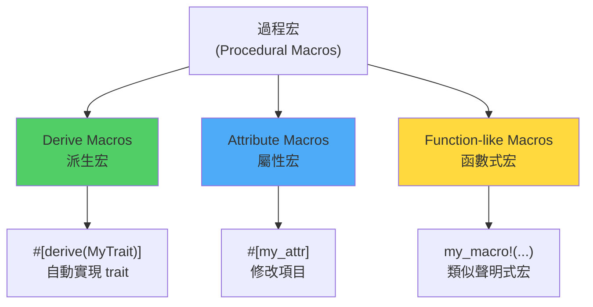

# 過程宏基礎

> 基於 Rust 1.90+ (2025) | Procedural Macros 入門

## 📋 概述

過程宏 (Procedural Macros) 是 Rust 中更強大的宏系統,可以直接操作 Token Stream,實現更複雜的代碼生成。與聲明式宏不同,過程宏是真正的 Rust 函數。

---

## 🎯 過程宏類型

### 三種過程宏



---

## 🚀 創建過程宏 Crate

### 項目結構

```
my-macros/
├── Cargo.toml
├── src/
│   └── lib.rs
└── tests/
    └── test.rs
```

### Cargo.toml 配置

```toml
[package]
name = "my-macros"
version = "0.1.0"
edition = "2021"

[lib]
proc-macro = true  # 必須設置為 true

[dependencies]
syn = { version = "2.0", features = ["full"] }
quote = "1.0"
proc-macro2 = "1.0"
```

**依賴說明**:
- `syn`: 解析 Rust 語法
- `quote`: 生成 Rust 代碼
- `proc-macro2`: proc-macro 的可測試版本

---

## 📝 Derive Macros (派生宏)

### 基本結構

```rust
// src/lib.rs
use proc_macro::TokenStream;
use quote::quote;
use syn::{parse_macro_input, DeriveInput};

#[proc_macro_derive(HelloMacro)]
pub fn hello_macro_derive(input: TokenStream) -> TokenStream {
    // 解析輸入的 TokenStream
    let input = parse_macro_input!(input as DeriveInput);
    
    // 獲取結構體名稱
    let name = input.ident;
    
    // 生成實現代碼
    let expanded = quote! {
        impl HelloMacro for #name {
            fn hello_macro() {
                println!("Hello, Macro! My name is {}!", stringify!(#name));
            }
        }
    };
    
    // 返回生成的代碼
    TokenStream::from(expanded)
}
```

### 使用派生宏

```rust
// 在其他 crate 中
use my_macros::HelloMacro;

trait HelloMacro {
    fn hello_macro();
}

#[derive(HelloMacro)]
struct Pancakes;

fn main() {
    Pancakes::hello_macro();
    // 輸出: Hello, Macro! My name is Pancakes!
}
```

---

## 🎨 實戰範例: Builder 模式

### 實現 Builder 宏

```rust
use proc_macro::TokenStream;
use quote::quote;
use syn::{parse_macro_input, DeriveInput, Data, Fields};

#[proc_macro_derive(Builder)]
pub fn derive_builder(input: TokenStream) -> TokenStream {
    let input = parse_macro_input!(input as DeriveInput);
    let name = &input.ident;
    let builder_name = quote::format_ident!("{}Builder", name);
    
    // 提取字段
    let fields = match input.data {
        Data::Struct(data) => match data.fields {
            Fields::Named(fields) => fields.named,
            _ => panic!("Builder only works with named fields"),
        },
        _ => panic!("Builder only works with structs"),
    };
    
    // 生成 Builder 結構體的字段
    let builder_fields = fields.iter().map(|f| {
        let name = &f.ident;
        let ty = &f.ty;
        quote! {
            #name: Option<#ty>
        }
    });
    
    // 生成 setter 方法
    let setters = fields.iter().map(|f| {
        let name = &f.ident;
        let ty = &f.ty;
        quote! {
            pub fn #name(mut self, #name: #ty) -> Self {
                self.#name = Some(#name);
                self
            }
        }
    });
    
    // 生成 build 方法
    let build_fields = fields.iter().map(|f| {
        let name = &f.ident;
        quote! {
            #name: self.#name.clone()
                .ok_or(concat!("Field ", stringify!(#name), " is not set"))?
        }
    });
    
    let field_names = fields.iter().map(|f| &f.ident);
    
    // 生成完整代碼
    let expanded = quote! {
        pub struct #builder_name {
            #(#builder_fields,)*
        }
        
        impl #builder_name {
            #(#setters)*
            
            pub fn build(self) -> Result<#name, String> {
                Ok(#name {
                    #(#build_fields,)*
                })
            }
        }
        
        impl #name {
            pub fn builder() -> #builder_name {
                #builder_name {
                    #(#field_names: None,)*
                }
            }
        }
    };
    
    TokenStream::from(expanded)
}
```

### 使用 Builder

```rust
use my_macros::Builder;

#[derive(Builder, Debug)]
struct User {
    name: String,
    age: u32,
    email: String,
}

fn main() {
    let user = User::builder()
        .name("Alice".to_string())
        .age(30)
        .email("alice@example.com".to_string())
        .build()
        .unwrap();
    
    println!("{:?}", user);
}
```

---

## 🎯 Attribute Macros (屬性宏)

### 基本結構

```rust
use proc_macro::TokenStream;
use quote::quote;
use syn::{parse_macro_input, ItemFn};

#[proc_macro_attribute]
pub fn log_function(_attr: TokenStream, item: TokenStream) -> TokenStream {
    let input = parse_macro_input!(item as ItemFn);
    let name = &input.sig.ident;
    let block = &input.block;
    let sig = &input.sig;
    let vis = &input.vis;
    
    let expanded = quote! {
        #vis #sig {
            println!("Entering function: {}", stringify!(#name));
            let result = #block;
            println!("Exiting function: {}", stringify!(#name));
            result
        }
    };
    
    TokenStream::from(expanded)
}
```

### 使用屬性宏

```rust
use my_macros::log_function;

#[log_function]
fn calculate(a: i32, b: i32) -> i32 {
    a + b
}

fn main() {
    let result = calculate(2, 3);
    // 輸出:
    // Entering function: calculate
    // Exiting function: calculate
    
    println!("Result: {}", result);
}
```

### 帶參數的屬性宏

```rust
use proc_macro::TokenStream;
use quote::quote;
use syn::{parse_macro_input, ItemFn, LitStr};

#[proc_macro_attribute]
pub fn log_with_prefix(attr: TokenStream, item: TokenStream) -> TokenStream {
    let prefix = parse_macro_input!(attr as LitStr);
    let input = parse_macro_input!(item as ItemFn);
    let name = &input.sig.ident;
    let block = &input.block;
    let sig = &input.sig;
    
    let expanded = quote! {
        #sig {
            println!("{}: Entering {}", #prefix, stringify!(#name));
            let result = #block;
            println!("{}: Exiting {}", #prefix, stringify!(#name));
            result
        }
    };
    
    TokenStream::from(expanded)
}

// 使用
#[log_with_prefix("DEBUG")]
fn my_function() {
    println!("Function body");
}
```

---

## 🔧 Function-like Macros (函數式宏)

### 基本結構

```rust
use proc_macro::TokenStream;
use quote::quote;
use syn::{parse_macro_input, LitStr};

#[proc_macro]
pub fn make_greeting(input: TokenStream) -> TokenStream {
    let name = parse_macro_input!(input as LitStr);
    
    let expanded = quote! {
        format!("Hello, {}! Welcome to Rust macros!", #name)
    };
    
    TokenStream::from(expanded)
}
```

### 使用函數式宏

```rust
use my_macros::make_greeting;

fn main() {
    let greeting = make_greeting!("Alice");
    println!("{}", greeting);
    // Hello, Alice! Welcome to Rust macros!
}
```

### 複雜的函數式宏

```rust
use proc_macro::TokenStream;
use quote::quote;
use syn::{parse::{Parse, ParseStream}, Token, Ident, LitStr};

// 自定義解析結構
struct SqlQuery {
    table: Ident,
    _arrow: Token![=>],
    fields: Vec<Ident>,
}

impl Parse for SqlQuery {
    fn parse(input: ParseStream) -> syn::Result<Self> {
        let table = input.parse()?;
        let _arrow = input.parse()?;
        
        let mut fields = Vec::new();
        while !input.is_empty() {
            fields.push(input.parse()?);
            if input.peek(Token![,]) {
                input.parse::<Token![,]>()?;
            }
        }
        
        Ok(SqlQuery { table, _arrow, fields })
    }
}

#[proc_macro]
pub fn sql_select(input: TokenStream) -> TokenStream {
    let SqlQuery { table, fields, .. } = parse_macro_input!(input as SqlQuery);
    
    let field_names: Vec<_> = fields.iter()
        .map(|f| f.to_string())
        .collect();
    
    let field_list = field_names.join(", ");
    let table_name = table.to_string();
    
    let expanded = quote! {
        format!("SELECT {} FROM {}", #field_list, #table_name)
    };
    
    TokenStream::from(expanded)
}

// 使用
let query = sql_select!(users => id, name, email);
println!("{}", query);
// SELECT id, name, email FROM users
```

---

## 📊 完整範例: 序列化宏

```rust
use proc_macro::TokenStream;
use quote::quote;
use syn::{parse_macro_input, DeriveInput, Data, Fields};

#[proc_macro_derive(Serialize)]
pub fn derive_serialize(input: TokenStream) -> TokenStream {
    let input = parse_macro_input!(input as DeriveInput);
    let name = &input.ident;
    
    let fields = match input.data {
        Data::Struct(data) => match data.fields {
            Fields::Named(fields) => fields.named,
            _ => panic!("Serialize only works with named fields"),
        },
        _ => panic!("Serialize only works with structs"),
    };
    
    // 生成序列化代碼
    let serialize_fields = fields.iter().map(|f| {
        let field_name = &f.ident;
        let field_str = field_name.as_ref().unwrap().to_string();
        quote! {
            result.push_str(&format!(r#""{}": {},"#, #field_str, self.#field_name));
        }
    });
    
    let expanded = quote! {
        impl #name {
            pub fn to_json(&self) -> String {
                let mut result = String::from("{");
                #(#serialize_fields)*
                result.pop(); // 移除最後的逗號
                result.push('}');
                result
            }
        }
    };
    
    TokenStream::from(expanded)
}

// 使用
#[derive(Serialize)]
struct Person {
    name: String,
    age: u32,
}

fn main() {
    let person = Person {
        name: "Alice".to_string(),
        age: 30,
    };
    
    println!("{}", person.to_json());
    // {"name": Alice,"age": 30}
}
```

---

## 🔍 syn 庫使用技巧

### 解析常見類型

```rust
use syn::{
    parse_macro_input,
    DeriveInput,    // 用於 derive macros
    ItemFn,         // 函數
    ItemStruct,     // 結構體
    Expr,           // 表達式
    Type,           // 類型
    Ident,          // 識別符
};

#[proc_macro]
pub fn parse_examples(input: TokenStream) -> TokenStream {
    // 解析為表達式
    let expr = parse_macro_input!(input as Expr);
    
    // 解析為類型
    let ty = parse_macro_input!(input as Type);
    
    // 解析為識別符
    let ident = parse_macro_input!(input as Ident);
    
    // ...
}
```

### 訪問結構體字段

```rust
use syn::{Data, Fields};

#[proc_macro_derive(MyMacro)]
pub fn my_macro(input: TokenStream) -> TokenStream {
    let input = parse_macro_input!(input as DeriveInput);
    
    match input.data {
        Data::Struct(data) => {
            match data.fields {
                Fields::Named(fields) => {
                    // 處理命名字段
                    for field in fields.named.iter() {
                        let name = &field.ident;
                        let ty = &field.ty;
                        println!("Field: {:?}, Type: {:?}", name, ty);
                    }
                }
                Fields::Unnamed(fields) => {
                    // 處理元組字段
                    for (i, field) in fields.unnamed.iter().enumerate() {
                        println!("Field {}: {:?}", i, field.ty);
                    }
                }
                Fields::Unit => {
                    // 單元結構體
                }
            }
        }
        Data::Enum(_) => { /* 處理枚舉 */ }
        Data::Union(_) => { /* 處理聯合體 */ }
    }
    
    TokenStream::new()
}
```

---

## 🎯 quote 庫使用技巧

### 基本用法

```rust
use quote::quote;

let name = "Alice";
let age = 30;

let tokens = quote! {
    struct Person {
        name: &'static str,
        age: u32,
    }
    
    let person = Person {
        name: #name,
        age: #age,
    };
};
```

### 重複展開

```rust
let names = vec!["Alice", "Bob", "Charlie"];

let tokens = quote! {
    let people = vec![
        #(#names),*
    ];
};
// 展開為: vec!["Alice", "Bob", "Charlie"]
```

### 條件生成

```rust
let should_derive_debug = true;

let tokens = quote! {
    #(
        #[cfg(feature = "debug")]
        #[derive(Debug)]
    )?
    struct MyStruct;
};
```

---

## 🔧 測試過程宏

### 測試結構

```rust
// tests/test.rs
use my_macros::Builder;

#[test]
fn test_builder() {
    #[derive(Builder)]
    struct TestStruct {
        field1: String,
        field2: i32,
    }
    
    let instance = TestStruct::builder()
        .field1("test".to_string())
        .field2(42)
        .build()
        .unwrap();
    
    assert_eq!(instance.field1, "test");
    assert_eq!(instance.field2, 42);
}
```

### 使用 trybuild 測試編譯錯誤

```toml
[dev-dependencies]
trybuild = "1.0"
```

```rust
#[test]
fn ui() {
    let t = trybuild::TestCases::new();
    t.pass("tests/pass/*.rs");
    t.compile_fail("tests/fail/*.rs");
}
```

---

## 🎓 最佳實踐

### 1. 提供清晰的錯誤信息

```rust
use syn::Error;

#[proc_macro_derive(MyMacro)]
pub fn my_macro(input: TokenStream) -> TokenStream {
    let input = parse_macro_input!(input as DeriveInput);
    
    match input.data {
        Data::Struct(_) => { /* OK */ }
        _ => {
            let error = Error::new(
                input.ident.span(),
                "MyMacro can only be used with structs"
            );
            return error.to_compile_error().into();
        }
    }
    
    // ...
}
```

### 2. 使用 span 提供準確的錯誤位置

```rust
use proc_macro2::Span;

let error = Error::new(
    field.span(),  // 指向特定字段
    "This field must be a String"
);
```

### 3. 文檔化宏

```rust
/// A derive macro that implements the Builder pattern.
///
/// # Example
///
/// ```
/// use my_macros::Builder;
///
/// #[derive(Builder)]
/// struct User {
///     name: String,
///     age: u32,
/// }
///
/// let user = User::builder()
///     .name("Alice".to_string())
///     .age(30)
///     .build()
///     .unwrap();
/// ```
#[proc_macro_derive(Builder)]
pub fn derive_builder(input: TokenStream) -> TokenStream {
    // ...
}
```

---

## 📖 參考資料

1. [The Rust Programming Language - Macros](https://doc.rust-lang.org/book/ch19-06-macros.html)
2. [syn Documentation](https://docs.rs/syn/)
3. [quote Documentation](https://docs.rs/quote/)
4. [proc-macro2 Documentation](https://docs.rs/proc-macro2/)
5. [Procedural Macros Workshop](https://github.com/dtolnay/proc-macro-workshop)

---

*最後更新: 2025-01-17*  
*Rust 版本: 1.90+*
