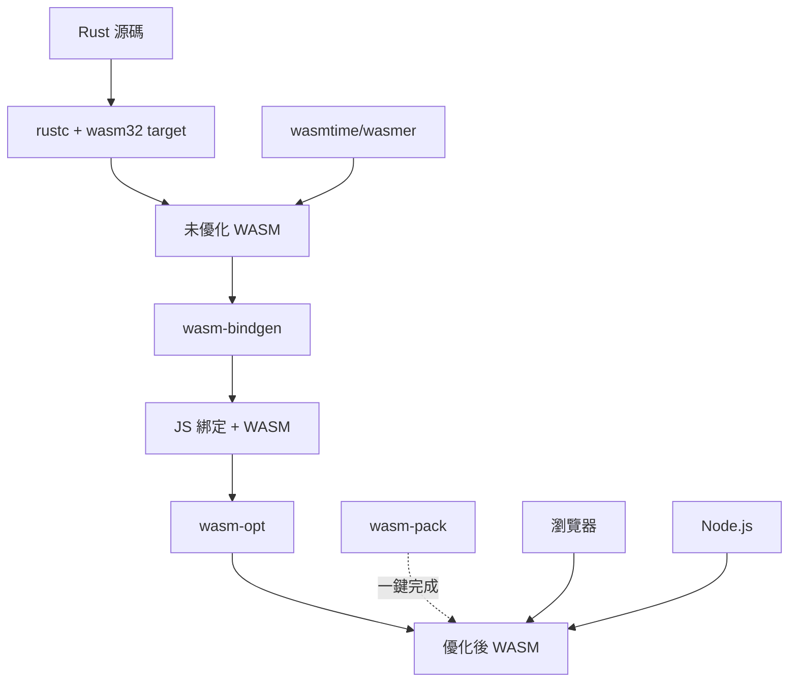

# WebAssembly 基礎與工具鏈

## 概述

WebAssembly (WASM) 是一種可移植、體積小、載入快的二進制指令格式，設計為編譯目標，讓高性能應用能在 Web 瀏覽器中運行。Rust 是 WASM 生態系統中的一流語言，提供優秀的工具鏈支持。

### 為什麼選擇 Rust + WASM？

- **零成本抽象**: Rust 的性能特性完全保留到 WASM
- **記憶體安全**: 無需垃圾回收器
- **小體積**: 生成的 WASM 文件體積小
- **優秀工具鏈**: `wasm-pack`、`wasm-bindgen` 等成熟工具
- **活躍社群**: 大量開源項目和庫支持

---

## WASM 目標平台

Rust 支持多種 WASM 目標：

```bash
# Web 瀏覽器環境（最常用）
rustup target add wasm32-unknown-unknown

# WASI (WebAssembly System Interface) - 伺服器端
rustup target add wasm32-wasip1

# 實驗性的 WASI 預覽版
rustup target add wasm32-wasip2  # Rust 1.78+
```

### 目標對比

| 目標 | 用途 | 特點 |
|------|------|------|
| `wasm32-unknown-unknown` | 瀏覽器、純計算 | 無系統接口，最小化 |
| `wasm32-wasip1` | 伺服器端、CLI 工具 | POSIX-like 系統調用 |
| `wasm32-wasip2` | 新一代 WASI | Component Model 支持 |

---

## 核心工具鏈

### 1. wasm-pack

**wasm-pack** 是構建、測試和發布 Rust WASM 的一站式工具。

#### 安裝

```bash
curl https://rustwasm.github.io/wasm-pack/installer/init.sh -sSf | sh

# 或使用 cargo
cargo install wasm-pack
```

#### 創建項目

```bash
# 使用官方模板
cargo generate --git https://github.com/rustwasm/wasm-pack-template

# 或手動創建
cargo new --lib my-wasm-project
cd my-wasm-project
```

#### 配置 Cargo.toml

```toml
[package]
name = "my-wasm-project"
version = "0.1.0"
edition = "2021"

[lib]
crate-type = ["cdylib"]  # 生成動態鏈接庫供 WASM 使用

[dependencies]
wasm-bindgen = "0.2"

# 可選：控制台日誌
console_error_panic_hook = "0.1"
wee_alloc = "0.4"  # 輕量級分配器

[profile.release]
opt-level = 's'      # 優化體積
lto = true           # Link-Time Optimization
codegen-units = 1    # 更好的優化
```

#### 構建

```bash
# 開發構建
wasm-pack build

# 生產構建（優化體積）
wasm-pack build --target web --release

# 指定目標環境
wasm-pack build --target bundler  # Webpack/Rollup
wasm-pack build --target nodejs    # Node.js
wasm-pack build --target web       # 原生 ES 模組
wasm-pack build --target no-modules # 無模組系統
```

構建產物在 `pkg/` 目錄：
```
pkg/
├── my_wasm_project.d.ts      # TypeScript 定義
├── my_wasm_project.js         # JS 綁定
├── my_wasm_project_bg.wasm    # WASM 二進制
├── my_wasm_project_bg.wasm.d.ts
└── package.json               # npm 包信息
```

### 2. wasm-bindgen-cli

底層工具，生成 JS 和 WASM 之間的綁定代碼。

```bash
cargo install wasm-bindgen-cli

# 手動使用
cargo build --target wasm32-unknown-unknown --release
wasm-bindgen target/wasm32-unknown-unknown/release/my_project.wasm \
  --out-dir pkg \
  --target web
```

### 3. wasmtime / wasmer

WASM 運行時，用於伺服器端執行。

```bash
# Wasmtime
curl https://wasmtime.dev/install.sh -sSf | bash

# 運行 WASI 應用
wasmtime my-app.wasm

# Wasmer
curl https://get.wasmer.io -sSf | sh
wasmer run my-app.wasm
```

---

## 第一個 WASM 程序

### src/lib.rs

```rust
use wasm_bindgen::prelude::*;

// 當 wasm 模組被實例化時調用
#[wasm_bindgen(start)]
pub fn main() {
    // 設置 panic hook，在瀏覽器控制台顯示友好錯誤信息
    #[cfg(feature = "console_error_panic_hook")]
    console_error_panic_hook::set_once();
}

/// 簡單的加法函數，導出給 JavaScript
#[wasm_bindgen]
pub fn add(a: i32, b: i32) -> i32 {
    a + b
}

/// 處理字串的函數
#[wasm_bindgen]
pub fn greet(name: &str) -> String {
    format!("Hello, {}!", name)
}

/// 複雜類型：導出結構體
#[wasm_bindgen]
pub struct Counter {
    value: i32,
}

#[wasm_bindgen]
impl Counter {
    /// 構造函數
    #[wasm_bindgen(constructor)]
    pub fn new() -> Counter {
        Counter { value: 0 }
    }

    /// 方法
    pub fn increment(&mut self) {
        self.value += 1;
    }

    pub fn get_value(&self) -> i32 {
        self.value
    }
}
```

### JavaScript 調用

```html
<!DOCTYPE html>
<html>
<head>
    <meta charset="UTF-8">
    <title>Rust WASM Demo</title>
</head>
<body>
    <script type="module">
        // 使用 --target web 構建時
        import init, { add, greet, Counter } from './pkg/my_wasm_project.js';

        async function run() {
            // 初始化 WASM 模組
            await init();

            // 調用函數
            console.log(add(5, 3));  // 8
            console.log(greet('WASM'));  // "Hello, WASM!"

            // 使用類
            const counter = new Counter();
            counter.increment();
            console.log(counter.get_value());  // 1
        }

        run();
    </script>
</body>
</html>
```

---

## 調試與開發工具

### 1. 本地開發伺服器

```bash
# 使用簡單 HTTP 伺服器
python3 -m http.server 8080

# 或使用 Rust 工具
cargo install microserver
microserver --port 8080
```

### 2. 瀏覽器 DevTools

Chrome/Firefox 開發者工具支持 WASM 調試：

1. 打開 DevTools → Sources
2. 可以看到 `.wasm` 文件
3. 設置斷點、查看變量

### 3. wasm-opt

優化 WASM 體積（來自 Binaryen 工具集）：

```bash
# 安裝
npm install -g binaryen

# 優化
wasm-opt -Os -o output.wasm input.wasm

# 參數說明
# -O0: 無優化
# -O1, -O2, -O3: 性能優化
# -Os: 體積優化（推薦）
# -Oz: 極限體積優化
```

### 4. wasm-snip

移除未使用的代碼：

```bash
cargo install wasm-snip

wasm-snip input.wasm -o output.wasm \
  --snip-rust-panicking-code \
  --snip-rust-fmt-code
```

---

## 體積優化技巧

### 1. Cargo.toml 配置

```toml
[profile.release]
opt-level = 'z'       # 體積優化（比 's' 更激進）
lto = true            # 啟用 LTO
codegen-units = 1     # 單編譯單元
strip = true          # 移除符號（Rust 1.77+）
panic = 'abort'       # 不生成 unwinding 代碼

[profile.release.package."*"]
opt-level = 'z'       # 依賴也使用體積優化
```

### 2. 使用輕量級分配器

```toml
[dependencies]
wee_alloc = "0.4"
```

```rust
// 在 lib.rs 中
#[cfg(feature = "wee_alloc")]
#[global_allocator]
static ALLOC: wee_alloc::WeeAlloc = wee_alloc::WeeAlloc::INIT;
```

### 3. 避免 std，使用 core + alloc

```rust
#![no_std]

extern crate alloc;
use alloc::string::String;
use alloc::vec::Vec;
```

### 4. 移除格式化代碼

```rust
// 避免使用 format!，改用手動拼接
// 不好: format!("Hello, {}!", name)
// 較好: String::from("Hello, ") + name + "!"
```

### 5. 完整優化流程

```bash
# 1. 發布構建
wasm-pack build --target web --release

# 2. 優化
wasm-opt -Oz -o pkg/optimized.wasm pkg/my_project_bg.wasm

# 3. 移除未使用代碼
wasm-snip pkg/optimized.wasm -o pkg/final.wasm \
  --snip-rust-panicking-code

# 4. 比較體積
ls -lh pkg/*.wasm
```

---

## WASI 應用開發

WASI (WebAssembly System Interface) 允許 WASM 訪問文件系統、網路等系統資源。

### 創建 WASI 應用

```rust
// src/main.rs (注意是 bin 而非 lib)
use std::env;
use std::fs;

fn main() {
    let args: Vec<String> = env::args().collect();
    
    if args.len() < 2 {
        eprintln!("Usage: {} <filename>", args[0]);
        return;
    }

    let content = fs::read_to_string(&args[1])
        .expect("Failed to read file");
    
    println!("File content:\n{}", content);
}
```

### 構建與運行

```bash
# 構建
cargo build --target wasm32-wasip1 --release

# 運行（使用 wasmtime）
wasmtime target/wasm32-wasip1/release/my-app.wasm test.txt

# 使用權限控制
wasmtime --dir=. target/wasm32-wasip1/release/my-app.wasm test.txt
```

---

## 性能測量

### 1. 瀏覽器性能 API

```rust
use wasm_bindgen::prelude::*;
use web_sys::console;

#[wasm_bindgen]
pub fn benchmark() {
    let start = js_sys::Date::now();
    
    // 執行計算
    let result = expensive_computation();
    
    let elapsed = js_sys::Date::now() - start;
    console::log_1(&format!("Time: {}ms", elapsed).into());
}
```

### 2. Criterion.rs（僅限 WASI）

```toml
[dev-dependencies]
criterion = "0.5"
```

```bash
cargo bench --target wasm32-wasip1
```

---

## 常見問題與解決方案

### 1. panic 信息不顯示

```rust
// 添加到 lib.rs
#[cfg(feature = "console_error_panic_hook")]
pub fn set_panic_hook() {
    console_error_panic_hook::set_once();
}

#[wasm_bindgen(start)]
pub fn main() {
    set_panic_hook();
}
```

### 2. WASM 文件過大

- 檢查是否啟用 `opt-level = 's'` 或 `'z'`
- 使用 `wasm-opt` 後處理
- 避免引入大型依賴（如完整的 `regex`）
- 使用 `cargo tree` 檢查依賴樹

### 3. 編譯錯誤：missing `std`

某些庫不支持 WASM，使用替代品：
- `rand` → `getrandom` + `wasm-bindgen`
- `tokio` → 僅瀏覽器不支持，WASI 可用
- `std::time::SystemTime` → `js_sys::Date`（瀏覽器）

---

## 工具生態總結



---

## 參考資料

1. [Rust and WebAssembly Book](https://rustwasm.github.io/docs/book/)
2. [wasm-pack Documentation](https://rustwasm.github.io/wasm-pack/)
3. [wasm-bindgen Guide](https://rustwasm.github.io/wasm-bindgen/)
4. [WASI Documentation](https://wasi.dev/)
5. [MDN WebAssembly](https://developer.mozilla.org/en-US/docs/WebAssembly)
6. [Awesome WASM Langs](https://github.com/appcypher/awesome-wasm-langs)
