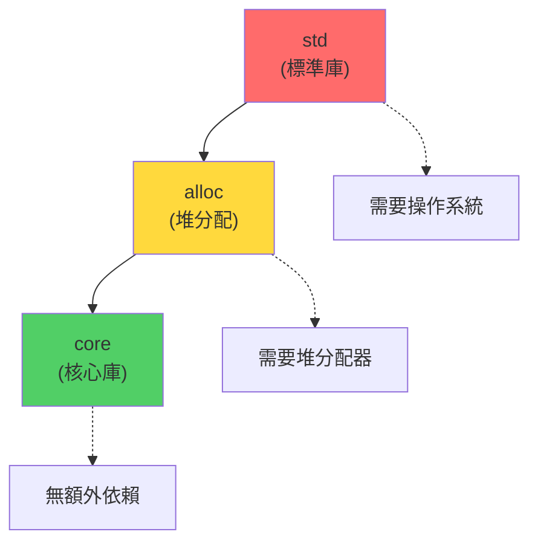

# 嵌入式 Rust 基礎

> 基於 Rust 1.90+ (2025) | 在資源受限設備上運行 Rust

## 📋 概述

嵌入式 Rust 將 Rust 的安全性和零成本抽象帶到微控制器和嵌入式系統中。本章介紹 `no_std` 環境、HAL 抽象和基本的嵌入式開發技術。

---

## 🎯 為什麼選擇 Rust 做嵌入式?

### Rust vs C/C++ 在嵌入式領域

| 特性 | C/C++ | Rust |
|------|-------|------|
| 記憶體安全 | ❌ 手動管理 | ✅ 編譯期保證 |
| 並發安全 | ❌ 容易出錯 | ✅ 所有權系統 |
| 零成本抽象 | ⚠️ 部分支持 | ✅ 完全支持 |
| 工具鏈 | ⚠️ 碎片化 | ✅ 統一 (cargo) |
| 生態系統 | ✅ 成熟 | 🔄 快速發展 |

---

## 🚀 no_std 環境

### 什麼是 no_std?

`no_std` 表示不使用 Rust 標準庫,僅使用 `core` 庫 (不依賴操作系統的核心功能)。

```rust
#![no_std]
#![no_main]

use panic_halt as _;  // panic 處理器

#[no_mangle]
pub extern "C" fn _start() -> ! {
    // 入口點
    loop {}
}
```

### std vs core vs alloc



**可用的庫**:
- `core`: 始終可用 (Option, Result, iterators, 等)
- `alloc`: 需要全局分配器 (Vec, String, Box, 等)
- `std`: 需要完整操作系統

---

## 🔧 設置嵌入式項目

### 安裝工具鏈

```bash
# 安裝 ARM Cortex-M 目標
$ rustup target add thumbv7em-none-eabihf

# 安裝其他常用目標
$ rustup target add thumbv6m-none-eabi     # ARM Cortex-M0/M0+
$ rustup target add thumbv7m-none-eabi     # ARM Cortex-M3
$ rustup target add thumbv7em-none-eabi    # ARM Cortex-M4/M7 (no FPU)
$ rustup target add thumbv8m.main-none-eabi # ARM Cortex-M33

# 安裝 RISC-V 目標
$ rustup target add riscv32imac-unknown-none-elf
$ rustup target add riscv32imc-unknown-none-elf

# 安裝調試工具
$ cargo install cargo-binutils
$ rustup component add llvm-tools-preview

# 安裝 cargo-embed (燒錄和調試)
$ cargo install cargo-embed
```

### 項目結構

```
embedded-project/
├── Cargo.toml
├── .cargo/
│   └── config.toml
├── memory.x           # 鏈接腳本
├── build.rs           # 構建腳本
└── src/
    └── main.rs
```

### Cargo.toml 配置

```toml
[package]
name = "embedded-project"
version = "0.1.0"
edition = "2021"

[dependencies]
cortex-m = "0.7"
cortex-m-rt = "0.7"  # Runtime support
panic-halt = "0.2"    # Panic handler

# HAL (硬件抽象層)
stm32f4xx-hal = { version = "0.16", features = ["stm32f411"] }

[profile.dev]
opt-level = 1  # 基本優化

[profile.release]
opt-level = "z"  # 優化大小
lto = true       # Link Time Optimization
codegen-units = 1
```

### .cargo/config.toml

```toml
[build]
target = "thumbv7em-none-eabihf"

[target.thumbv7em-none-eabihf]
runner = "probe-run --chip STM32F411RETx"
rustflags = [
  "-C", "link-arg=-Tlink.x",
]
```

---

## 📝 基本程式結構

### 最小的嵌入式程式

```rust
#![no_std]
#![no_main]

use panic_halt as _;
use cortex_m_rt::entry;

#[entry]
fn main() -> ! {
    // 初始化代碼
    
    loop {
        // 主循環
    }
}
```

**核心要素**:
1. `#![no_std]` - 不使用標準庫
2. `#![no_main]` - 不使用標準的 main
3. `#[entry]` - 標記入口點
4. `-> !` - 永不返回類型

### GPIO 操作範例 (STM32)

```rust
#![no_std]
#![no_main]

use panic_halt as _;
use cortex_m_rt::entry;
use stm32f4xx_hal::{pac, prelude::*};

#[entry]
fn main() -> ! {
    // 獲取外設訪問
    let dp = pac::Peripherals::take().unwrap();
    
    // 配置時鐘
    let rcc = dp.RCC.constrain();
    let clocks = rcc.cfgr.sysclk(84.MHz()).freeze();
    
    // 配置 GPIO
    let gpioa = dp.GPIOA.split();
    let mut led = gpioa.pa5.into_push_pull_output();
    
    // 主循環
    loop {
        led.set_high();
        cortex_m::asm::delay(8_400_000);  // 延遲
        led.set_low();
        cortex_m::asm::delay(8_400_000);
    }
}
```

---

## 🎨 HAL 抽象層

### embedded-hal Traits

`embedded-hal` 定義了硬件抽象的標準 traits:

```rust
use embedded_hal::digital::v2::OutputPin;

// 通用的 LED 閃爍函數
fn blink_led<P: OutputPin>(led: &mut P, delay: u32) {
    led.set_high().ok();
    cortex_m::asm::delay(delay);
    led.set_low().ok();
    cortex_m::asm::delay(delay);
}

// 可以用於任何實現 OutputPin 的硬件
```

**常用 traits**:
- `digital::OutputPin` - 數字輸出
- `digital::InputPin` - 數字輸入
- `spi::FullDuplex` - SPI 通信
- `serial::Read/Write` - 串口通信
- `i2c::Read/Write` - I2C 通信

---

## 🔧 中斷處理

### 定義中斷處理器

```rust
#![no_std]
#![no_main]

use panic_halt as _;
use cortex_m_rt::{entry, exception};
use cortex_m::interrupt::Mutex;
use core::cell::RefCell;

// 全局共享狀態
static COUNTER: Mutex<RefCell<u32>> = Mutex::new(RefCell::new(0));

#[entry]
fn main() -> ! {
    // 初始化...
    
    loop {
        // 主循環
    }
}

// SysTick 中斷處理器
#[exception]
fn SysTick() {
    cortex_m::interrupt::free(|cs| {
        let mut counter = COUNTER.borrow(cs).borrow_mut();
        *counter += 1;
    });
}
```

### 外設中斷

```rust
use stm32f4xx_hal::interrupt;

#[interrupt]
fn EXTI0() {
    // 外部中斷 0 處理器
    // 清除中斷標誌
    // ...
}
```

---

## 🎯 記憶體管理

### 靜態分配

```rust
// 編譯期分配的緩衝區
static mut BUFFER: [u8; 1024] = [0; 1024];

fn main() -> ! {
    unsafe {
        BUFFER[0] = 42;
    }
    
    loop {}
}
```

### 使用 heapless (無堆數據結構)

```toml
[dependencies]
heapless = "0.8"
```

```rust
use heapless::Vec;

fn main() -> ! {
    // 棧上分配的 Vec,最多 16 個元素
    let mut vec: Vec<u32, 16> = Vec::new();
    
    vec.push(1).ok();
    vec.push(2).ok();
    vec.push(3).ok();
    
    loop {}
}
```

### 全局分配器 (可選)

```toml
[dependencies]
alloc-cortex-m = "0.4"
```

```rust
#![feature(alloc_error_handler)]

extern crate alloc;
use alloc::vec::Vec;
use alloc_cortex_m::CortexMHeap;

#[global_allocator]
static ALLOCATOR: CortexMHeap = CortexMHeap::empty();

const HEAP_SIZE: usize = 1024;
static mut HEAP: [u8; HEAP_SIZE] = [0; HEAP_SIZE];

#[entry]
fn main() -> ! {
    unsafe { ALLOCATOR.init(&mut HEAP as *const u8 as usize, HEAP_SIZE) }
    
    // 現在可以使用堆分配
    let mut v = Vec::new();
    v.push(1);
    
    loop {}
}

#[alloc_error_handler]
fn oom(_: core::alloc::Layout) -> ! {
    loop {}
}
```

---

## 📊 完整範例: UART 通信

```rust
#![no_std]
#![no_main]

use panic_halt as _;
use cortex_m_rt::entry;
use stm32f4xx_hal::{pac, prelude::*, serial::Serial};
use core::fmt::Write;

#[entry]
fn main() -> ! {
    let dp = pac::Peripherals::take().unwrap();
    
    // 配置時鐘
    let rcc = dp.RCC.constrain();
    let clocks = rcc.cfgr.sysclk(84.MHz()).freeze();
    
    // 配置 UART pins
    let gpioa = dp.GPIOA.split();
    let tx_pin = gpioa.pa2.into_alternate();
    let rx_pin = gpioa.pa3.into_alternate();
    
    // 配置 UART
    let serial = Serial::new(
        dp.USART2,
        (tx_pin, rx_pin),
        9600.bps(),
        &clocks,
    ).unwrap();
    
    let (mut tx, mut rx) = serial.split();
    
    // 發送歡迎訊息
    writeln!(tx, "Hello from Rust!\r").ok();
    
    loop {
        // 回顯接收到的數據
        if let Ok(byte) = rx.read() {
            tx.write(byte).ok();
        }
    }
}
```

---

## 🔍 除錯技術

### RTT (Real-Time Transfer)

```toml
[dependencies]
rtt-target = "0.5"
```

```rust
use rtt_target::{rtt_init_print, rprintln};

#[entry]
fn main() -> ! {
    rtt_init_print!();
    
    rprintln!("Hello from RTT!");
    
    let counter = 0;
    loop {
        rprintln!("Counter: {}", counter);
        counter += 1;
        cortex_m::asm::delay(8_400_000);
    }
}
```

### probe-run 調試

```bash
# 運行並查看 RTT 輸出
$ cargo run --release

# 使用 GDB 調試
$ cargo embed --gdb
```

---

## 🎓 最佳實踐

### 1. 使用類型狀態模式

```rust
pub struct Uninitialized;
pub struct Initialized;

pub struct Peripheral<STATE> {
    _state: PhantomData<STATE>,
}

impl Peripheral<Uninitialized> {
    pub fn new() -> Self {
        Peripheral { _state: PhantomData }
    }
    
    pub fn initialize(self) -> Peripheral<Initialized> {
        // 初始化邏輯
        Peripheral { _state: PhantomData }
    }
}

impl Peripheral<Initialized> {
    pub fn read(&self) -> u32 {
        // 只有初始化後才能讀取
        42
    }
}
```

### 2. 使用 RTIC (Real-Time Interrupt-driven Concurrency)

```toml
[dependencies]
cortex-m-rtic = "1.1"
```

```rust
#[rtic::app(device = stm32f4xx_hal::pac, peripherals = true)]
mod app {
    use stm32f4xx_hal::gpio::*;
    
    #[shared]
    struct Shared {
        counter: u32,
    }
    
    #[local]
    struct Local {
        led: gpioa::PA5<Output<PushPull>>,
    }
    
    #[init]
    fn init(cx: init::Context) -> (Shared, Local, init::Monotonics) {
        // 初始化
        let led = /* ... */;
        
        (
            Shared { counter: 0 },
            Local { led },
            init::Monotonics(),
        )
    }
    
    #[task(local = [led], shared = [counter])]
    fn blink(cx: blink::Context) {
        cx.local.led.toggle();
    }
}
```

### 3. 電源管理

```rust
use cortex_m::asm;

loop {
    // 等待中斷
    asm::wfi();  // Wait For Interrupt
}
```

---

## 🔧 常見外設操作

### ADC (模數轉換)

```rust
let mut adc = Adc::adc1(dp.ADC1, &mut dp.RCC);
let pa0 = gpioa.pa0.into_analog();

loop {
    let sample = adc.read(&mut pa0).unwrap();
    rprintln!("ADC: {}", sample);
}
```

### PWM (脈衝寬度調製)

```rust
let channels = (
    gpioa.pa8.into_alternate(),
    gpioa.pa9.into_alternate(),
);

let pwm = dp.TIM1.pwm_hz(channels, 1.kHz(), &clocks).unwrap();
let (mut ch1, mut ch2) = pwm;

let max_duty = ch1.get_max_duty();
ch1.set_duty(max_duty / 2);  // 50% 占空比
ch1.enable();
```

### I2C 通信

```rust
let scl = gpiob.pb8.into_alternate_open_drain();
let sda = gpiob.pb9.into_alternate_open_drain();

let i2c = I2c::new(
    dp.I2C1,
    (scl, sda),
    400.kHz(),
    &clocks,
);

// 寫入數據到設備
let data = [0x01, 0x02, 0x03];
i2c.write(0x50, &data).ok();

// 讀取數據
let mut buffer = [0u8; 4];
i2c.read(0x50, &mut buffer).ok();
```

---

## 📖 參考資料

1. [The Embedded Rust Book](https://docs.rust-embedded.org/book/)
2. [embedded-hal Documentation](https://docs.rs/embedded-hal/)
3. [cortex-m Crate](https://docs.rs/cortex-m/)
4. [Discovery Book](https://docs.rust-embedded.org/discovery/) - STM32F3 入門
5. [RTIC Book](https://rtic.rs/)

---

*最後更新: 2025-01-17*  
*Rust 版本: 1.90+*
