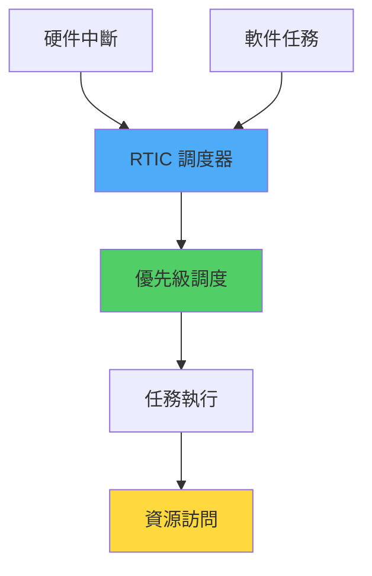

# 嵌入式異步與 RTIC

> 基於 Rust 1.90+ (2025) | 高效的實時系統編程

## 📋 概述

在嵌入式系統中,需要處理多個並發任務和中斷。本章介紹如何使用 RTIC (Real-Time Interrupt-driven Concurrency) 框架和異步編程技術構建高效的嵌入式應用。

---

## 🎯 RTIC 框架

### 什麼是 RTIC?

RTIC 是一個基於中斷的並發框架,提供:
- **零成本抽象**: 編譯期調度
- **死鎖自由**: 靜態優先級分析
- **資源共享**: 自動臨界區管理
- **消息傳遞**: 任務間通信



---

## 🚀 RTIC 基礎

### 安裝與配置

```toml
[dependencies]
cortex-m = "0.7"
cortex-m-rtic = "1.1"
stm32f4xx-hal = { version = "0.16", features = ["stm32f411", "rtic"] }
panic-probe = { version = "0.3", features = ["print-rtt"] }
```

### 基本應用結構

```rust
#![no_std]
#![no_main]

use panic_probe as _;
use rtic::app;

#[app(device = stm32f4xx_hal::pac, peripherals = true)]
mod app {
    use stm32f4xx_hal::{
        gpio::{gpioa::PA5, Output, PushPull},
        prelude::*,
    };
    
    // 共享資源 (跨任務訪問)
    #[shared]
    struct Shared {
        counter: u32,
    }
    
    // 本地資源 (單任務獨占)
    #[local]
    struct Local {
        led: PA5<Output<PushPull>>,
    }
    
    // 初始化函數
    #[init]
    fn init(cx: init::Context) -> (Shared, Local) {
        defmt::info!("Initializing...");
        
        let dp = cx.device;
        
        // 配置時鐘
        let rcc = dp.RCC.constrain();
        let clocks = rcc.cfgr.sysclk(84.MHz()).freeze();
        
        // 配置 GPIO
        let gpioa = dp.GPIOA.split();
        let led = gpioa.pa5.into_push_pull_output();
        
        (
            Shared { counter: 0 },
            Local { led },
        )
    }
    
    // 空閒任務 (最低優先級)
    #[idle]
    fn idle(_: idle::Context) -> ! {
        loop {
            cortex_m::asm::nop();
        }
    }
}
```

---

## 🎨 任務與優先級

### 軟件任務

```rust
#[app(device = stm32f4xx_hal::pac, peripherals = true)]
mod app {
    // ... shared, local 定義 ...
    
    #[init]
    fn init(cx: init::Context) -> (Shared, Local) {
        // 初始化...
        
        // 生成任務
        task1::spawn().ok();
        task2::spawn().ok();
        
        (shared, local)
    }
    
    // 優先級 1 的任務
    #[task(priority = 1, shared = [counter])]
    fn task1(mut cx: task1::Context) {
        cx.shared.counter.lock(|counter| {
            *counter += 1;
            defmt::info!("Task1: counter = {}", counter);
        });
        
        // 1 秒後再次執行
        task1::spawn_after(1.secs()).ok();
    }
    
    // 優先級 2 的任務 (更高)
    #[task(priority = 2, local = [led])]
    fn task2(cx: task2::Context) {
        cx.local.led.toggle();
        
        // 500ms 後再次執行
        task2::spawn_after(500.millis()).ok();
    }
}
```

### 硬件中斷任務

```rust
#[app(device = stm32f4xx_hal::pac)]
mod app {
    use stm32f4xx_hal::interrupt;
    
    // ... 定義 ...
    
    // EXTI0 中斷 (外部中斷 0)
    #[task(binds = EXTI0, priority = 3, shared = [counter])]
    fn button_pressed(mut cx: button_pressed::Context) {
        cx.shared.counter.lock(|counter| {
            *counter += 1;
        });
        
        // 清除中斷標誌
        // ...
    }
}
```

---

## 🔧 資源管理

### 共享資源

```rust
#[app(device = stm32f4xx_hal::pac)]
mod app {
    #[shared]
    struct Shared {
        // 需要跨任務訪問的資源
        buffer: heapless::Vec<u8, 32>,
        state: SystemState,
    }
    
    // 低優先級任務訪問共享資源
    #[task(priority = 1, shared = [buffer])]
    fn writer(mut cx: writer::Context) {
        cx.shared.buffer.lock(|buffer| {
            buffer.push(42).ok();
        });
    }
    
    // 高優先級任務訪問共享資源
    #[task(priority = 2, shared = [buffer])]
    fn reader(mut cx: reader::Context) {
        cx.shared.buffer.lock(|buffer| {
            if let Some(data) = buffer.pop() {
                defmt::info!("Read: {}", data);
            }
        });
    }
}
```

### 本地資源

```rust
#[app(device = stm32f4xx_hal::pac)]
mod app {
    #[local]
    struct Local {
        // 只在特定任務中使用
        sensor: TemperatureSensor,
        display: LcdDisplay,
    }
    
    #[task(local = [sensor])]
    fn read_sensor(cx: read_sensor::Context) {
        let temperature = cx.local.sensor.read();
        defmt::info!("Temperature: {}", temperature);
    }
}
```

---

## ⏰ 定時器與調度

### 單調時鐘

```rust
#[app(device = stm32f4xx_hal::pac, dispatchers = [EXTI0])]
mod app {
    use systick_monotonic::*;
    
    #[monotonic(binds = SysTick, default = true)]
    type MyMono = Systick<1000>;  // 1kHz (1ms 精度)
    
    #[shared]
    struct Shared {}
    
    #[local]
    struct Local {}
    
    #[init]
    fn init(cx: init::Context) -> (Shared, Local, init::Monotonics) {
        let systick = cx.core.SYST;
        let mono = Systick::new(systick, 84_000_000);
        
        // 啟動週期任務
        periodic_task::spawn().ok();
        
        (Shared {}, Local {}, init::Monotonics(mono))
    }
    
    #[task]
    fn periodic_task(_: periodic_task::Context) {
        defmt::info!("Periodic task executed");
        
        // 每 1 秒執行一次
        periodic_task::spawn_after(1.secs()).ok();
    }
    
    #[task]
    fn delayed_task(_: delayed_task::Context) {
        defmt::info!("Executed after delay");
    }
    
    #[idle]
    fn idle(_: idle::Context) -> ! {
        // 5 秒後執行
        delayed_task::spawn_after(5.secs()).ok();
        
        loop {
            cortex_m::asm::wfi();
        }
    }
}
```

---

## 📊 完整範例: 傳感器數據採集

```rust
#![no_std]
#![no_main]

use panic_probe as _;
use rtic::app;

#[app(device = stm32f4xx_hal::pac, peripherals = true, dispatchers = [EXTI0, EXTI1])]
mod app {
    use stm32f4xx_hal::{
        adc::{Adc, config::AdcConfig},
        gpio::{gpioa::PA0, Analog},
        prelude::*,
        serial::{Serial, Config},
    };
    use systick_monotonic::*;
    use heapless::Vec;
    
    #[monotonic(binds = SysTick, default = true)]
    type MyMono = Systick<1000>;
    
    #[shared]
    struct Shared {
        samples: Vec<u16, 100>,  // 緩衝 100 個樣本
    }
    
    #[local]
    struct Local {
        adc: Adc<stm32f4xx_hal::pac::ADC1>,
        adc_pin: PA0<Analog>,
        tx: stm32f4xx_hal::serial::Tx<stm32f4xx_hal::pac::USART2>,
    }
    
    #[init]
    fn init(cx: init::Context) -> (Shared, Local, init::Monotonics) {
        defmt::info!("Sensor system initializing...");
        
        let dp = cx.device;
        let cp = cx.core;
        
        // 配置時鐘
        let rcc = dp.RCC.constrain();
        let clocks = rcc.cfgr
            .use_hse(8.MHz())
            .sysclk(84.MHz())
            .freeze();
        
        // 配置 ADC
        let gpioa = dp.GPIOA.split();
        let adc_pin = gpioa.pa0.into_analog();
        let adc_config = AdcConfig::default();
        let adc = Adc::adc1(dp.ADC1, true, adc_config);
        
        // 配置 UART
        let tx_pin = gpioa.pa2.into_alternate();
        let rx_pin = gpioa.pa3.into_alternate();
        let serial = Serial::new(
            dp.USART2,
            (tx_pin, rx_pin),
            Config::default().baudrate(115200.bps()),
            &clocks,
        ).unwrap();
        let (tx, _rx) = serial.split();
        
        // 配置 SysTick 單調時鐘
        let mono = Systick::new(cp.SYST, clocks.sysclk().to_Hz());
        
        // 啟動採樣任務
        sample_adc::spawn().ok();
        
        // 啟動數據發送任務
        send_data::spawn().ok();
        
        (
            Shared {
                samples: Vec::new(),
            },
            Local {
                adc,
                adc_pin,
                tx,
            },
            init::Monotonics(mono),
        )
    }
    
    // 每 100ms 採樣一次
    #[task(
        priority = 2,
        local = [adc, adc_pin],
        shared = [samples]
    )]
    fn sample_adc(mut cx: sample_adc::Context) {
        // 讀取 ADC
        let sample: u16 = cx.local.adc.read(cx.local.adc_pin).unwrap();
        
        // 存儲樣本
        cx.shared.samples.lock(|samples| {
            if samples.push(sample).is_err() {
                // 緩衝區滿,觸發發送
                send_data::spawn().ok();
            }
        });
        
        defmt::debug!("ADC sample: {}", sample);
        
        // 下次採樣
        sample_adc::spawn_after(100.millis()).ok();
    }
    
    // 每 1 秒發送數據
    #[task(
        priority = 1,
        local = [tx],
        shared = [samples]
    )]
    fn send_data(mut cx: send_data::Context) {
        use core::fmt::Write;
        
        cx.shared.samples.lock(|samples| {
            if !samples.is_empty() {
                // 計算平均值
                let sum: u32 = samples.iter().map(|&x| x as u32).sum();
                let avg = sum / samples.len() as u32;
                
                // 發送數據
                writeln!(cx.local.tx, "Average: {}", avg).ok();
                
                // 清空緩衝區
                samples.clear();
                
                defmt::info!("Sent {} samples, avg: {}", samples.len(), avg);
            }
        });
        
        // 下次發送
        send_data::spawn_after(1.secs()).ok();
    }
    
    #[idle]
    fn idle(_: idle::Context) -> ! {
        defmt::info!("Entering idle loop");
        
        loop {
            cortex_m::asm::wfi();  // 等待中斷
        }
    }
}
```

---

## 🔄 嵌入式異步編程

### embassy 框架

```toml
[dependencies]
embassy-executor = "0.5"
embassy-time = "0.3"
embassy-stm32 = { version = "0.1", features = ["stm32f411re"] }
```

```rust
#![no_std]
#![no_main]

use embassy_executor::Spawner;
use embassy_time::{Duration, Timer};
use embassy_stm32::gpio::{Level, Output, Speed};
use defmt::*;

#[embassy_executor::main]
async fn main(_spawner: Spawner) {
    let p = embassy_stm32::init(Default::default());
    
    let mut led = Output::new(p.PA5, Level::Low, Speed::Low);
    
    loop {
        led.set_high();
        Timer::after(Duration::from_millis(500)).await;
        
        led.set_low();
        Timer::after(Duration::from_millis(500)).await;
        
        info!("LED toggled");
    }
}
```

### 異步任務

```rust
#[embassy_executor::task]
async fn blink_task(mut led: Output<'static, PA5>) {
    loop {
        led.toggle();
        Timer::after(Duration::from_millis(500)).await;
    }
}

#[embassy_executor::task]
async fn uart_task(mut uart: UartTx<'static, USART2>) {
    loop {
        uart.write(b"Hello\n").await.ok();
        Timer::after(Duration::from_secs(1)).await;
    }
}

#[embassy_executor::main]
async fn main(spawner: Spawner) {
    let p = embassy_stm32::init(Default::default());
    
    let led = Output::new(p.PA5, Level::Low, Speed::Low);
    let uart = /* ... */;
    
    spawner.spawn(blink_task(led)).ok();
    spawner.spawn(uart_task(uart)).ok();
}
```

---

## 🎓 最佳實踐

### 1. 優先級設計

```rust
// 優先級分配原則:
// - 硬件中斷: 最高優先級 (4-5)
// - 實時任務: 高優先級 (2-3)
// - 常規任務: 低優先級 (1)
// - idle: 優先級 0

#[task(binds = EXTI0, priority = 5)]  // 緊急中斷
fn emergency(_: emergency::Context) {}

#[task(priority = 3)]  // 實時控制
fn control_loop(_: control_loop::Context) {}

#[task(priority = 1)]  // 數據處理
fn process_data(_: process_data::Context) {}
```

### 2. 資源鎖定最小化

```rust
// ❌ 不好: 長時間持有鎖
#[task(shared = [data])]
fn bad_task(mut cx: bad_task::Context) {
    cx.shared.data.lock(|data| {
        // 大量計算...
        let result = expensive_computation();
        data.value = result;
    });
}

// ✅ 好: 縮小臨界區
#[task(shared = [data])]
fn good_task(mut cx: good_task::Context) {
    // 計算在鎖外進行
    let result = expensive_computation();
    
    // 只在必要時持有鎖
    cx.shared.data.lock(|data| {
        data.value = result;
    });
}
```

### 3. 使用消息傳遞

```rust
use heapless::spsc::Queue;

#[shared]
struct Shared {
    queue: Queue<Message, 16>,
}

#[task(shared = [queue])]
fn producer(mut cx: producer::Context) {
    let msg = Message::new(42);
    cx.shared.queue.lock(|q| q.enqueue(msg).ok());
}

#[task(shared = [queue])]
fn consumer(mut cx: consumer::Context) {
    cx.shared.queue.lock(|q| {
        if let Some(msg) = q.dequeue() {
            process_message(msg);
        }
    });
}
```

---

## 📖 參考資料

1. [RTIC Book](https://rtic.rs/)
2. [Embassy Documentation](https://embassy.dev/)
3. [The Embedded Rust Book](https://docs.rust-embedded.org/book/)
4. [systick-monotonic](https://docs.rs/systick-monotonic/)

---

*最後更新: 2025-01-17*  
*Rust 版本: 1.90+*
