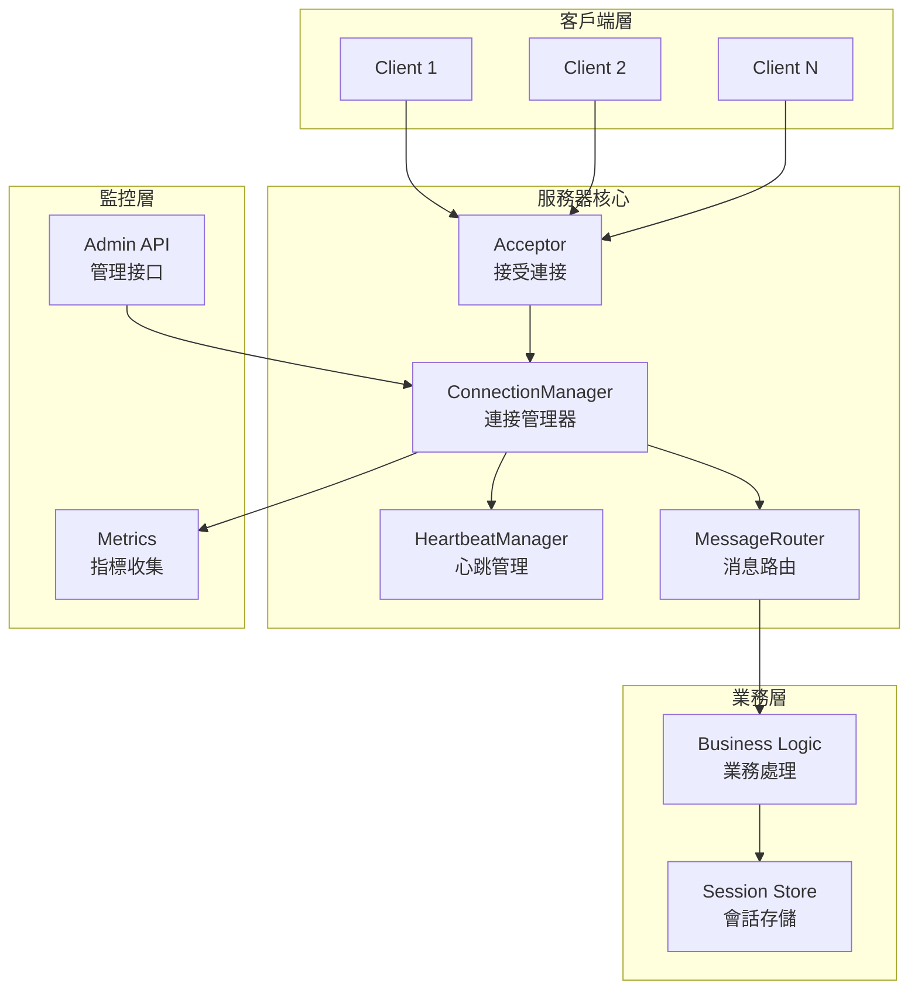

# TCP 長連接管理服務器

## 1. 項目概述與架構設計

### 1.1 核心功能需求

```rust
// 項目目標
/*
1. 連接管理
   - 支持萬級併發長連接
   - 連接狀態追蹤與管理
   - 會話 (Session) 生命週期管理
   - 優雅關閉與資源清理

2. 心跳機制
   - 定時心跳檢測
   - 自動斷線重連
   - 超時檢測與清理
   - 自適應心跳間隔

3. 消息處理
   - 自定義二進制協議
   - 消息幀化與解析
   - 消息路由與分發
   - 廣播與單播

4. 性能優化
   - 零拷貝消息傳遞
   - 連接池與內存池
   - 背壓 (Backpressure) 處理
   - CPU 與內存使用優化

5. 監控與運維
   - 實時連接數統計
   - 消息吞吐量監控
   - 錯誤率與延遲追蹤
   - 運維 API (查詢/踢人/廣播)
*/
```

### 1.2 系統架構



### 1.3 技術棧選擇

```toml
# Cargo.toml
[package]
name = "tcp-connection-server"
version = "0.1.0"
edition = "2021"

[dependencies]
# 異步運行時
tokio = { version = "1.35", features = ["full"] }
tokio-util = { version = "0.7", features = ["codec", "time"] }

# 並發工具
dashmap = "5.5"                    # 併發 HashMap
parking_lot = "0.12"               # 高性能鎖
crossbeam = "0.8"                  # 無鎖數據結構

# 序列化
serde = { version = "1.0", features = ["derive"] }
bincode = "1.3"                    # 二進制序列化
bytes = "1.5"                      # 字節處理

# 日誌與監控
tracing = "0.1"
tracing-subscriber = { version = "0.3", features = ["env-filter"] }
metrics = "0.21"                   # 指標收集
metrics-exporter-prometheus = "0.13"

# 工具庫
anyhow = "1.0"
thiserror = "1.0"
uuid = { version = "1.6", features = ["v4", "serde"] }
chrono = "0.4"

# 配置
config = "0.14"
toml = "0.8"

[dev-dependencies]
criterion = "0.5"
tokio-test = "0.4"

[profile.release]
opt-level = 3
lto = "thin"
codegen-units = 1
```

---

## 2. 協議設計

### 2.1 消息幀格式

```rust
use bytes::{Buf, BufMut, Bytes, BytesMut};
use serde::{Deserialize, Serialize};

/// 消息幀格式
/// +--------+--------+------------+---------------+
/// | Length | Type   | Request ID | Payload       |
/// | 4 byte | 1 byte | 8 bytes    | Length bytes  |
/// +--------+--------+------------+---------------+

const HEADER_SIZE: usize = 13; // 4 + 1 + 8

#[derive(Debug, Clone, Copy, PartialEq, Eq)]
#[repr(u8)]
pub enum MessageType {
    // 連接管理
    Handshake = 0x01,
    HandshakeAck = 0x02,
    Ping = 0x03,
    Pong = 0x04,
    Disconnect = 0x05,
    
    // 業務消息
    Request = 0x10,
    Response = 0x11,
    Notification = 0x12,
    Broadcast = 0x13,
    
    // 錯誤
    Error = 0xFF,
}

impl MessageType {
    fn from_u8(value: u8) -> Option<Self> {
        match value {
            0x01 => Some(Self::Handshake),
            0x02 => Some(Self::HandshakeAck),
            0x03 => Some(Self::Ping),
            0x04 => Some(Self::Pong),
            0x05 => Some(Self::Disconnect),
            0x10 => Some(Self::Request),
            0x11 => Some(Self::Response),
            0x12 => Some(Self::Notification),
            0x13 => Some(Self::Broadcast),
            0xFF => Some(Self::Error),
            _ => None,
        }
    }
}

#[derive(Debug, Clone)]
pub struct Frame {
    pub msg_type: MessageType,
    pub request_id: u64,
    pub payload: Bytes,
}

impl Frame {
    pub fn new(msg_type: MessageType, request_id: u64, payload: Bytes) -> Self {
        Frame { msg_type, request_id, payload }
    }
    
    /// 編碼為字節
    pub fn encode(&self) -> BytesMut {
        let length = HEADER_SIZE + self.payload.len();
        let mut buf = BytesMut::with_capacity(length);
        
        // Length (不包含自身的 4 字節)
        buf.put_u32((length - 4) as u32);
        // Type
        buf.put_u8(self.msg_type as u8);
        // Request ID
        buf.put_u64(self.request_id);
        // Payload
        buf.put(self.payload.clone());
        
        buf
    }
    
    /// 從字節解碼
    pub fn decode(buf: &mut BytesMut) -> Result<Option<Self>, FrameError> {
        // 至少需要讀取長度字段
        if buf.len() < 4 {
            return Ok(None);
        }
        
        // 讀取長度 (peek，不消費)
        let length = u32::from_be_bytes([buf[0], buf[1], buf[2], buf[3]]) as usize;
        let total_length = 4 + length;
        
        // 檢查是否接收完整
        if buf.len() < total_length {
            return Ok(None);
        }
        
        // 驗證長度合理性 (最大 16MB)
        if length > 16 * 1024 * 1024 {
            return Err(FrameError::FrameTooLarge(length));
        }
        
        // 消費長度字段
        buf.advance(4);
        
        // 讀取類型
        let msg_type = MessageType::from_u8(buf.get_u8())
            .ok_or(FrameError::InvalidMessageType)?;
        
        // 讀取 Request ID
        let request_id = buf.get_u64();
        
        // 讀取 Payload
        let payload_len = length - (HEADER_SIZE - 4);
        let payload = buf.split_to(payload_len).freeze();
        
        Ok(Some(Frame { msg_type, request_id, payload }))
    }
    
    /// 創建 Ping 幀
    pub fn ping(request_id: u64) -> Self {
        Frame::new(MessageType::Ping, request_id, Bytes::new())
    }
    
    /// 創建 Pong 幀
    pub fn pong(request_id: u64) -> Self {
        Frame::new(MessageType::Pong, request_id, Bytes::new())
    }
}

#[derive(Debug, thiserror::Error)]
pub enum FrameError {
    #[error("Frame too large: {0} bytes")]
    FrameTooLarge(usize),
    
    #[error("Invalid message type")]
    InvalidMessageType,
    
    #[error("IO error: {0}")]
    Io(#[from] std::io::Error),
}
```

---

## 3. 連接管理

### 3.1 Session 定義

```rust
use tokio::sync::mpsc;
use tokio::net::TcpStream;
use std::sync::Arc;
use std::sync::atomic::{AtomicU64, AtomicBool, Ordering};
use std::time::Instant;

/// 會話唯一標識
pub type SessionId = uuid::Uuid;

/// 會話狀態
#[derive(Debug, Clone, Copy, PartialEq, Eq)]
pub enum SessionState {
    Connecting,      // 正在握手
    Active,          // 活躍狀態
    Idle,            // 空閒狀態
    Disconnecting,   // 正在斷開
    Closed,          // 已關閉
}

/// 會話統計
#[derive(Debug, Default)]
pub struct SessionStats {
    messages_sent: AtomicU64,
    messages_received: AtomicU64,
    bytes_sent: AtomicU64,
    bytes_received: AtomicU64,
    last_ping_time: parking_lot::Mutex<Option<Instant>>,
    last_pong_time: parking_lot::Mutex<Option<Instant>>,
}

impl SessionStats {
    pub fn record_sent(&self, bytes: usize) {
        self.messages_sent.fetch_add(1, Ordering::Relaxed);
        self.bytes_sent.fetch_add(bytes as u64, Ordering::Relaxed);
    }
    
    pub fn record_received(&self, bytes: usize) {
        self.messages_received.fetch_add(1, Ordering::Relaxed);
        self.bytes_received.fetch_add(bytes as u64, Ordering::Relaxed);
    }
    
    pub fn get_messages_sent(&self) -> u64 {
        self.messages_sent.load(Ordering::Relaxed)
    }
    
    pub fn get_messages_received(&self) -> u64 {
        self.messages_received.load(Ordering::Relaxed)
    }
}

/// 會話元數據
pub struct Session {
    pub id: SessionId,
    pub remote_addr: std::net::SocketAddr,
    pub state: parking_lot::RwLock<SessionState>,
    pub created_at: Instant,
    pub last_activity: parking_lot::Mutex<Instant>,
    pub stats: SessionStats,
    pub user_data: parking_lot::RwLock<Option<serde_json::Value>>,
    
    // 發送通道（用於向此會話發送消息）
    tx: mpsc::UnboundedSender<Frame>,
}

impl Session {
    pub fn new(
        remote_addr: std::net::SocketAddr,
        tx: mpsc::UnboundedSender<Frame>,
    ) -> Self {
        Session {
            id: SessionId::new_v4(),
            remote_addr,
            state: parking_lot::RwLock::new(SessionState::Connecting),
            created_at: Instant::now(),
            last_activity: parking_lot::Mutex::new(Instant::now()),
            stats: SessionStats::default(),
            user_data: parking_lot::RwLock::new(None),
            tx,
        }
    }
    
    /// 發送消息到此會話
    pub fn send(&self, frame: Frame) -> Result<(), mpsc::error::SendError<Frame>> {
        self.stats.record_sent(frame.payload.len());
        self.update_activity();
        self.tx.send(frame)
    }
    
    /// 更新最後活動時間
    pub fn update_activity(&self) {
        *self.last_activity.lock() = Instant::now();
    }
    
    /// 獲取會話狀態
    pub fn get_state(&self) -> SessionState {
        *self.state.read()
    }
    
    /// 設置會話狀態
    pub fn set_state(&self, new_state: SessionState) {
        *self.state.write() = new_state;
    }
    
    /// 檢查是否超時 (無活動)
    pub fn is_timeout(&self, timeout: std::time::Duration) -> bool {
        self.last_activity.lock().elapsed() > timeout
    }
    
    /// 獲取會話存活時間
    pub fn uptime(&self) -> std::time::Duration {
        self.created_at.elapsed()
    }
}
```

### 3.2 連接管理器

```rust
use dashmap::DashMap;

/// 連接管理器
pub struct ConnectionManager {
    sessions: Arc<DashMap<SessionId, Arc<Session>>>,
    config: Arc<ServerConfig>,
}

impl ConnectionManager {
    pub fn new(config: Arc<ServerConfig>) -> Self {
        ConnectionManager {
            sessions: Arc::new(DashMap::new()),
            config,
        }
    }
    
    /// 添加會話
    pub fn add_session(&self, session: Arc<Session>) {
        tracing::info!(
            session_id = %session.id,
            remote_addr = %session.remote_addr,
            "New session added"
        );
        
        self.sessions.insert(session.id, session);
        
        // 更新指標
        metrics::gauge!("active_connections").increment(1.0);
    }
    
    /// 移除會話
    pub fn remove_session(&self, session_id: &SessionId) -> Option<Arc<Session>> {
        if let Some((_, session)) = self.sessions.remove(session_id) {
            tracing::info!(
                session_id = %session_id,
                uptime = ?session.uptime(),
                messages_sent = session.stats.get_messages_sent(),
                messages_received = session.stats.get_messages_received(),
                "Session removed"
            );
            
            metrics::gauge!("active_connections").decrement(1.0);
            Some(session)
        } else {
            None
        }
    }
    
    /// 獲取會話
    pub fn get_session(&self, session_id: &SessionId) -> Option<Arc<Session>> {
        self.sessions.get(session_id).map(|s| s.clone())
    }
    
    /// 獲取所有會話 ID
    pub fn get_all_session_ids(&self) -> Vec<SessionId> {
        self.sessions.iter().map(|entry| *entry.key()).collect()
    }
    
    /// 獲取會話數量
    pub fn session_count(&self) -> usize {
        self.sessions.len()
    }
    
    /// 廣播消息
    pub fn broadcast(&self, frame: Frame) {
        let count = self.sessions.len();
        let mut success = 0;
        let mut failed = 0;
        
        for entry in self.sessions.iter() {
            match entry.value().send(frame.clone()) {
                Ok(_) => success += 1,
                Err(_) => failed += 1,
            }
        }
        
        tracing::debug!(
            total = count,
            success = success,
            failed = failed,
            "Broadcast completed"
        );
    }
    
    /// 清理超時會話
    pub async fn cleanup_timeout_sessions(&self) {
        let timeout = self.config.session_timeout;
        let mut to_remove = Vec::new();
        
        for entry in self.sessions.iter() {
            let session = entry.value();
            if session.is_timeout(timeout) {
                to_remove.push(session.id);
            }
        }
        
        for session_id in to_remove {
            tracing::warn!(
                session_id = %session_id,
                "Session timeout, removing"
            );
            self.remove_session(&session_id);
        }
    }
}
```

---

## 4. 心跳機制

### 4.1 心跳管理器

```rust
use tokio::time::{interval, Duration};

pub struct HeartbeatManager {
    connection_manager: Arc<ConnectionManager>,
    config: Arc<ServerConfig>,
}

impl HeartbeatManager {
    pub fn new(
        connection_manager: Arc<ConnectionManager>,
        config: Arc<ServerConfig>,
    ) -> Self {
        HeartbeatManager {
            connection_manager,
            config,
        }
    }
    
    /// 啟動心跳檢測任務
    pub fn start(self: Arc<Self>) {
        let interval_duration = self.config.heartbeat_interval;
        
        tokio::spawn(async move {
            let mut tick = interval(interval_duration);
            
            loop {
                tick.tick().await;
                self.check_all_sessions().await;
            }
        });
        
        tracing::info!("Heartbeat manager started");
    }
    
    /// 檢查所有會話心跳
    async fn check_all_sessions(&self) {
        let session_ids = self.connection_manager.get_all_session_ids();
        
        for session_id in session_ids {
            if let Some(session) = self.connection_manager.get_session(&session_id) {
                self.check_session_heartbeat(&session).await;
            }
        }
        
        // 清理超時會話
        self.connection_manager.cleanup_timeout_sessions().await;
    }
    
    /// 檢查單個會話心跳
    async fn check_session_heartbeat(&self, session: &Session) {
        // 發送 Ping
        let ping_frame = Frame::ping(0);
        
        if let Err(e) = session.send(ping_frame) {
            tracing::warn!(
                session_id = %session.id,
                error = %e,
                "Failed to send ping, removing session"
            );
            self.connection_manager.remove_session(&session.id);
        }
    }
}
```

---

## 5. 連接處理器

### 5.1 接受連接

```rust
use tokio::net::{TcpListener, TcpStream};
use tokio::io::{AsyncReadExt, AsyncWriteExt};

pub struct Server {
    config: Arc<ServerConfig>,
    connection_manager: Arc<ConnectionManager>,
    message_handler: Arc<dyn MessageHandler>,
}

impl Server {
    pub fn new(
        config: ServerConfig,
        message_handler: Arc<dyn MessageHandler>,
    ) -> Self {
        let config = Arc::new(config);
        let connection_manager = Arc::new(ConnectionManager::new(config.clone()));
        
        Server {
            config,
            connection_manager,
            message_handler,
        }
    }
    
    /// 啟動服務器
    pub async fn run(self: Arc<Self>) -> anyhow::Result<()> {
        let addr = format!("{}:{}", self.config.host, self.config.port);
        let listener = TcpListener::bind(&addr).await?;
        
        tracing::info!("Server listening on {}", addr);
        
        // 啟動心跳管理器
        let heartbeat_manager = Arc::new(HeartbeatManager::new(
            self.connection_manager.clone(),
            self.config.clone(),
        ));
        heartbeat_manager.clone().start();
        
        // 接受連接
        loop {
            match listener.accept().await {
                Ok((stream, remote_addr)) => {
                    tracing::debug!("New connection from {}", remote_addr);
                    
                    let server = self.clone();
                    tokio::spawn(async move {
                        if let Err(e) = server.handle_connection(stream, remote_addr).await {
                            tracing::error!(
                                remote_addr = %remote_addr,
                                error = %e,
                                "Connection handler error"
                            );
                        }
                    });
                }
                Err(e) => {
                    tracing::error!("Failed to accept connection: {}", e);
                }
            }
        }
    }
    
    /// 處理單個連接
    async fn handle_connection(
        &self,
        stream: TcpStream,
        remote_addr: std::net::SocketAddr,
    ) -> anyhow::Result<()> {
        // 設置 TCP 參數
        stream.set_nodelay(true)?;
        
        let (read_half, write_half) = stream.into_split();
        
        // 創建消息發送通道
        let (tx, rx) = mpsc::unbounded_channel::<Frame>();
        
        // 創建會話
        let session = Arc::new(Session::new(remote_addr, tx));
        let session_id = session.id;
        
        // 註冊會話
        self.connection_manager.add_session(session.clone());
        
        // 啟動讀寫任務
        let read_task = Self::read_loop(
            read_half,
            session.clone(),
            self.message_handler.clone(),
            self.connection_manager.clone(),
        );
        
        let write_task = Self::write_loop(write_half, rx);
        
        // 等待任一任務結束
        tokio::select! {
            result = read_task => {
                if let Err(e) = result {
                    tracing::error!("Read task error: {}", e);
                }
            }
            result = write_task => {
                if let Err(e) = result {
                    tracing::error!("Write task error: {}", e);
                }
            }
        }
        
        // 清理會話
        self.connection_manager.remove_session(&session_id);
        
        Ok(())
    }
    
    /// 讀取循環
    async fn read_loop(
        mut reader: tokio::net::tcp::OwnedReadHalf,
        session: Arc<Session>,
        message_handler: Arc<dyn MessageHandler>,
        connection_manager: Arc<ConnectionManager>,
    ) -> anyhow::Result<()> {
        let mut buf = BytesMut::with_capacity(8192);
        
        loop {
            // 讀取數據
            let n = reader.read_buf(&mut buf).await?;
            
            if n == 0 {
                // 連接關閉
                tracing::info!(session_id = %session.id, "Connection closed by peer");
                break;
            }
            
            session.update_activity();
            session.stats.record_received(n);
            
            // 解析幀
            while let Some(frame) = Frame::decode(&mut buf)? {
                // 處理幀
                Self::handle_frame(
                    &session,
                    frame,
                    &message_handler,
                    &connection_manager,
                ).await?;
            }
        }
        
        Ok(())
    }
    
    /// 寫入循環
    async fn write_loop(
        mut writer: tokio::net::tcp::OwnedWriteHalf,
        mut rx: mpsc::UnboundedReceiver<Frame>,
    ) -> anyhow::Result<()> {
        while let Some(frame) = rx.recv().await {
            let encoded = frame.encode();
            writer.write_all(&encoded).await?;
        }
        
        Ok(())
    }
    
    /// 處理幀
    async fn handle_frame(
        session: &Arc<Session>,
        frame: Frame,
        message_handler: &Arc<dyn MessageHandler>,
        connection_manager: &Arc<ConnectionManager>,
    ) -> anyhow::Result<()> {
        match frame.msg_type {
            MessageType::Ping => {
                // 回應 Pong
                session.send(Frame::pong(frame.request_id))?;
            }
            
            MessageType::Pong => {
                // 記錄 Pong 時間
                *session.stats.last_pong_time.lock() = Some(Instant::now());
            }
            
            MessageType::Handshake => {
                // 握手處理
                session.set_state(SessionState::Active);
                session.send(Frame::new(
                    MessageType::HandshakeAck,
                    frame.request_id,
                    Bytes::new(),
                ))?;
            }
            
            MessageType::Disconnect => {
                // 優雅斷開
                session.set_state(SessionState::Disconnecting);
                return Err(anyhow::anyhow!("Client requested disconnect"));
            }
            
            MessageType::Request | MessageType::Notification => {
                // 委託給業務處理器
                message_handler.handle_message(session, frame).await?;
            }
            
            _ => {
                tracing::warn!(
                    session_id = %session.id,
                    msg_type = ?frame.msg_type,
                    "Unhandled message type"
                );
            }
        }
        
        Ok(())
    }
}
```

---

## 6. 業務處理器

```rust
use async_trait::async_trait;

#[async_trait]
pub trait MessageHandler: Send + Sync {
    async fn handle_message(
        &self,
        session: &Arc<Session>,
        frame: Frame,
    ) -> anyhow::Result<()>;
}

/// 示例：Echo 處理器
pub struct EchoHandler;

#[async_trait]
impl MessageHandler for EchoHandler {
    async fn handle_message(
        &self,
        session: &Arc<Session>,
        frame: Frame,
    ) -> anyhow::Result<()> {
        // 簡單回顯
        let response = Frame::new(
            MessageType::Response,
            frame.request_id,
            frame.payload,
        );
        
        session.send(response)?;
        
        Ok(())
    }
}

/// 示例：聊天室處理器
pub struct ChatRoomHandler {
    connection_manager: Arc<ConnectionManager>,
}

#[async_trait]
impl MessageHandler for ChatRoomHandler {
    async fn handle_message(
        &self,
        session: &Arc<Session>,
        frame: Frame,
    ) -> anyhow::Result<()> {
        // 解析消息
        let message = String::from_utf8_lossy(&frame.payload);
        
        tracing::info!(
            session_id = %session.id,
            message = %message,
            "Received chat message"
        );
        
        // 廣播給所有人
        let broadcast_frame = Frame::new(
            MessageType::Broadcast,
            0,
            frame.payload,
        );
        
        self.connection_manager.broadcast(broadcast_frame);
        
        Ok(())
    }
}
```

---

## 7. 配置管理

```rust
use serde::{Deserialize, Serialize};
use std::time::Duration;

#[derive(Debug, Clone, Serialize, Deserialize)]
pub struct ServerConfig {
    #[serde(default = "default_host")]
    pub host: String,
    
    #[serde(default = "default_port")]
    pub port: u16,
    
    #[serde(default = "default_max_connections")]
    pub max_connections: usize,
    
    #[serde(with = "humantime_serde", default = "default_heartbeat_interval")]
    pub heartbeat_interval: Duration,
    
    #[serde(with = "humantime_serde", default = "default_session_timeout")]
    pub session_timeout: Duration,
    
    #[serde(default)]
    pub enable_metrics: bool,
    
    #[serde(default = "default_metrics_port")]
    pub metrics_port: u16,
}

fn default_host() -> String { "0.0.0.0".to_string() }
fn default_port() -> u16 { 9000 }
fn default_max_connections() -> usize { 10000 }
fn default_heartbeat_interval() -> Duration { Duration::from_secs(30) }
fn default_session_timeout() -> Duration { Duration::from_secs(90) }
fn default_metrics_port() -> u16 { 9100 }

impl Default for ServerConfig {
    fn default() -> Self {
        ServerConfig {
            host: default_host(),
            port: default_port(),
            max_connections: default_max_connections(),
            heartbeat_interval: default_heartbeat_interval(),
            session_timeout: default_session_timeout(),
            enable_metrics: false,
            metrics_port: default_metrics_port(),
        }
    }
}
```

---

## 8. 監控與指標

```rust
use metrics_exporter_prometheus::PrometheusBuilder;

pub fn setup_metrics(port: u16) -> anyhow::Result<()> {
    let builder = PrometheusBuilder::new();
    builder
        .with_http_listener(([0, 0, 0, 0], port))
        .install()?;
    
    tracing::info!("Metrics server listening on port {}", port);
    
    Ok(())
}

pub fn record_metrics() {
    // 在各處記錄指標
    metrics::counter!("messages_received_total").increment(1);
    metrics::counter!("messages_sent_total").increment(1);
    metrics::gauge!("active_connections").set(100.0);
    metrics::histogram!("message_latency_ms").record(1.5);
}
```

---

## 9. 主程序

```rust
// src/main.rs
use tracing_subscriber::{layer::SubscriberExt, util::SubscriberInitExt};

#[tokio::main]
async fn main() -> anyhow::Result<()> {
    // 初始化日誌
    tracing_subscriber::registry()
        .with(tracing_subscriber::EnvFilter::new(
            std::env::var("RUST_LOG").unwrap_or_else(|_| "info".into()),
        ))
        .with(tracing_subscriber::fmt::layer())
        .init();
    
    // 載入配置
    let config = ServerConfig::default();
    
    // 啟動 Metrics
    if config.enable_metrics {
        setup_metrics(config.metrics_port)?;
    }
    
    // 創建業務處理器
    let handler = Arc::new(EchoHandler);
    
    // 創建並啟動服務器
    let server = Arc::new(Server::new(config, handler));
    server.run().await?;
    
    Ok(())
}
```

---

## 10. 客戶端示例

```rust
// examples/client.rs
use tokio::net::TcpStream;
use tokio::io::{AsyncReadExt, AsyncWriteExt};

#[tokio::main]
async fn main() -> anyhow::Result<()> {
    let mut stream = TcpStream::connect("127.0.0.1:9000").await?;
    
    // 發送握手
    let handshake = Frame::new(MessageType::Handshake, 1, Bytes::new());
    stream.write_all(&handshake.encode()).await?;
    
    // 發送消息
    let message = Frame::new(
        MessageType::Request,
        2,
        Bytes::from("Hello, Server!"),
    );
    stream.write_all(&message.encode()).await?;
    
    // 接收響應
    let mut buf = BytesMut::with_capacity(1024);
    stream.read_buf(&mut buf).await?;
    
    if let Some(frame) = Frame::decode(&mut buf)? {
        println!("Received: {:?}", String::from_utf8_lossy(&frame.payload));
    }
    
    Ok(())
}
```

---

## 參考資料

1. [Tokio Tutorial](https://tokio.rs/tokio/tutorial)
2. [Building a TCP Server in Rust](https://tokio.rs/tokio/tutorial/framing)
3. [DashMap Documentation](https://docs.rs/dashmap/)
4. [Metrics.rs](https://metrics.rs/)
