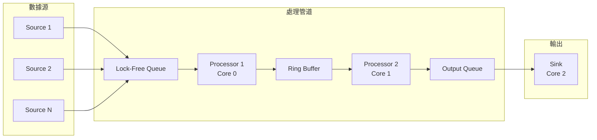

# 低延遲數據處理管道

## 1. 項目概述與架構設計

### 1.1 核心功能需求

```rust
// 項目目標
/*
1. 超低延遲 (Sub-microsecond)
   - P99 延遲 < 10µs
   - P999 延遲 < 100µs
   - 吞吐量 > 1M msg/s

2. 無鎖設計
   - SPSC (Single Producer Single Consumer) 無鎖隊列
   - MPSC (Multi Producer Single Consumer) 無鎖隊列
   - Lock-free 算法

3. 零拷貝
   - 共享內存
   - Ring buffer
   - Memory mapping

4. CPU 親和性
   - 線程綁定到特定核心
   - NUMA 優化
   - Cache line 對齊

5. 應用場景
   - 金融交易系統 (市場數據處理)
   - 高頻交易 (HFT)
   - 實時日誌收集
   - 遊戲服務器
*/
```

### 1.2 系統架構



### 1.3 技術棧選擇

```toml
# Cargo.toml
[package]
name = "low-latency-pipeline"
version = "0.1.0"
edition = "2021"

[dependencies]
# 無鎖數據結構
crossbeam = { version = "0.8", features = ["std"] }
crossbeam-queue = "0.3"
crossbeam-channel = "0.5"

# CPU 親和性
core_affinity = "0.8"

# 內存管理
parking_lot = "0.12"

# 時間測量
quanta = "0.12"                    # 高精度時間
coarsetime = "0.1"                 # 粗粒度時間

# 序列化（零拷貝）
zerocopy = "0.7"
rkyv = "0.7"                       # 零拷貝序列化

# 性能分析
criterion = "0.5"

# 日誌（低開銷）
tracing = "0.1"
tracing-subscriber = "0.3"

# 工具
anyhow = "1.0"
thiserror = "1.0"
once_cell = "1.19"

[profile.release]
opt-level = 3
lto = "fat"
codegen-units = 1
panic = 'abort'

[profile.bench]
inherits = "release"
```

---

## 2. Lock-Free SPSC Queue

### 2.1 基於 Ring Buffer 的實現

```rust
use std::sync::atomic::{AtomicUsize, Ordering};
use std::cell::UnsafeCell;
use std::mem::MaybeUninit;

/// Cache Line 大小（避免 False Sharing）
const CACHE_LINE: usize = 64;

#[repr(align(64))]
struct CacheAligned<T>(T);

/// Lock-free SPSC Queue
pub struct SPSCQueue<T> {
    buffer: Box<[UnsafeCell<MaybeUninit<T>>]>,
    capacity: usize,
    
    // Producer 獨占的 cache line
    #[allow(dead_code)]
    _pad1: [u8; CACHE_LINE - std::mem::size_of::<usize>()],
    write_pos: CacheAligned<AtomicUsize>,
    
    // Consumer 獨占的 cache line
    #[allow(dead_code)]
    _pad2: [u8; CACHE_LINE - std::mem::size_of::<usize>()],
    read_pos: CacheAligned<AtomicUsize>,
}

unsafe impl<T: Send> Send for SPSCQueue<T> {}
unsafe impl<T: Send> Sync for SPSCQueue<T> {}

impl<T> SPSCQueue<T> {
    /// 創建新隊列（容量必須是 2 的冪）
    pub fn new(capacity: usize) -> Self {
        assert!(capacity.is_power_of_two(), "Capacity must be power of 2");
        
        let buffer = (0..capacity)
            .map(|_| UnsafeCell::new(MaybeUninit::uninit()))
            .collect::<Vec<_>>()
            .into_boxed_slice();
        
        SPSCQueue {
            buffer,
            capacity,
            _pad1: [0; CACHE_LINE - std::mem::size_of::<usize>()],
            write_pos: CacheAligned(AtomicUsize::new(0)),
            _pad2: [0; CACHE_LINE - std::mem::size_of::<usize>()],
            read_pos: CacheAligned(AtomicUsize::new(0)),
        }
    }
    
    /// 嘗試推入（生產者調用）
    #[inline]
    pub fn try_push(&self, value: T) -> Result<(), T> {
        let write = self.write_pos.0.load(Ordering::Relaxed);
        let read = self.read_pos.0.load(Ordering::Acquire);
        
        // 檢查是否已滿
        if write.wrapping_sub(read) >= self.capacity {
            return Err(value);
        }
        
        let index = write & (self.capacity - 1);
        
        unsafe {
            (*self.buffer[index].get()).write(value);
        }
        
        self.write_pos.0.store(write.wrapping_add(1), Ordering::Release);
        
        Ok(())
    }
    
    /// 嘗試彈出（消費者調用）
    #[inline]
    pub fn try_pop(&self) -> Option<T> {
        let read = self.read_pos.0.load(Ordering::Relaxed);
        let write = self.write_pos.0.load(Ordering::Acquire);
        
        // 檢查是否為空
        if read == write {
            return None;
        }
        
        let index = read & (self.capacity - 1);
        
        let value = unsafe {
            (*self.buffer[index].get()).assume_init_read()
        };
        
        self.read_pos.0.store(read.wrapping_add(1), Ordering::Release);
        
        Some(value)
    }
    
    /// 獲取隊列長度（近似值）
    #[inline]
    pub fn len(&self) -> usize {
        let write = self.write_pos.0.load(Ordering::Relaxed);
        let read = self.read_pos.0.load(Ordering::Relaxed);
        write.wrapping_sub(read)
    }
    
    /// 檢查是否為空
    #[inline]
    pub fn is_empty(&self) -> bool {
        self.len() == 0
    }
}

impl<T> Drop for SPSCQueue<T> {
    fn drop(&mut self) {
        // 清理所有剩餘元素
        while let Some(_) = self.try_pop() {}
    }
}
```

### 2.2 性能測試

```rust
#[cfg(test)]
mod tests {
    use super::*;
    use std::thread;
    use std::sync::Arc;
    use std::time::Instant;

    #[test]
    fn test_spsc_throughput() {
        const COUNT: usize = 10_000_000;
        const CAPACITY: usize = 1024;
        
        let queue = Arc::new(SPSCQueue::new(CAPACITY));
        let queue_clone = queue.clone();
        
        // 生產者線程
        let producer = thread::spawn(move || {
            for i in 0..COUNT {
                while queue_clone.try_push(i).is_err() {
                    std::hint::spin_loop();
                }
            }
        });
        
        // 消費者線程
        let start = Instant::now();
        let consumer = thread::spawn(move || {
            let mut received = 0;
            while received < COUNT {
                if let Some(_) = queue.try_pop() {
                    received += 1;
                }
            }
            received
        });
        
        producer.join().unwrap();
        let count = consumer.join().unwrap();
        let elapsed = start.elapsed();
        
        println!(
            "Throughput: {:.2} M msg/s",
            count as f64 / elapsed.as_secs_f64() / 1_000_000.0
        );
        
        assert_eq!(count, COUNT);
    }
}
```

---

## 3. 數據處理管道

### 3.1 管道組件定義

```rust
use std::marker::PhantomData;

/// 管道階段 Trait
pub trait Stage: Send + 'static {
    type Input: Send;
    type Output: Send;
    
    /// 處理單條消息
    fn process(&mut self, input: Self::Input) -> Option<Self::Output>;
    
    /// 批量處理
    fn process_batch(&mut self, inputs: Vec<Self::Input>) -> Vec<Self::Output> {
        inputs.into_iter().filter_map(|i| self.process(i)).collect()
    }
}

/// 管道構建器
pub struct Pipeline<I, O> {
    _input: PhantomData<I>,
    _output: PhantomData<O>,
}

impl<I, O> Pipeline<I, O>
where
    I: Send + 'static,
    O: Send + 'static,
{
    pub fn new() -> Self {
        Pipeline {
            _input: PhantomData,
            _output: PhantomData,
        }
    }
}
```

### 3.2 示例處理階段

```rust
use serde::{Deserialize, Serialize};

/// 市場數據消息
#[derive(Debug, Clone, Serialize, Deserialize)]
pub struct MarketData {
    pub symbol: String,
    pub price: f64,
    pub volume: u64,
    pub timestamp: u64,
}

/// 過濾階段：只保留特定股票
pub struct FilterStage {
    symbols: Vec<String>,
}

impl FilterStage {
    pub fn new(symbols: Vec<String>) -> Self {
        FilterStage { symbols }
    }
}

impl Stage for FilterStage {
    type Input = MarketData;
    type Output = MarketData;
    
    fn process(&mut self, input: Self::Input) -> Option<Self::Output> {
        if self.symbols.contains(&input.symbol) {
            Some(input)
        } else {
            None
        }
    }
}

/// 聚合階段：計算 VWAP (Volume Weighted Average Price)
pub struct VWAPStage {
    window_size: usize,
    buffer: Vec<MarketData>,
}

impl VWAPStage {
    pub fn new(window_size: usize) -> Self {
        VWAPStage {
            window_size,
            buffer: Vec::with_capacity(window_size),
        }
    }
}

#[derive(Debug, Clone)]
pub struct VWAPResult {
    pub symbol: String,
    pub vwap: f64,
    pub total_volume: u64,
}

impl Stage for VWAPStage {
    type Input = MarketData;
    type Output = VWAPResult;
    
    fn process(&mut self, input: Self::Input) -> Option<Self::Output> {
        self.buffer.push(input.clone());
        
        if self.buffer.len() >= self.window_size {
            let mut total_value = 0.0;
            let mut total_volume = 0u64;
            
            for data in &self.buffer {
                total_value += data.price * data.volume as f64;
                total_volume += data.volume;
            }
            
            let vwap = total_value / total_volume as f64;
            
            let result = VWAPResult {
                symbol: input.symbol.clone(),
                vwap,
                total_volume,
            };
            
            // 移除最舊的數據
            self.buffer.remove(0);
            
            Some(result)
        } else {
            None
        }
    }
}
```

---

## 4. 高性能執行器

### 4.1 綁定 CPU 核心

```rust
use core_affinity::{CoreId, set_for_current};

/// 將當前線程綁定到指定 CPU 核心
pub fn bind_to_core(core_id: usize) -> anyhow::Result<()> {
    let core_ids = core_affinity::get_core_ids()
        .ok_or_else(|| anyhow::anyhow!("Failed to get core IDs"))?;
    
    if core_id >= core_ids.len() {
        anyhow::bail!("Invalid core ID: {}", core_id);
    }
    
    let success = set_for_current(core_ids[core_id]);
    
    if !success {
        anyhow::bail!("Failed to set CPU affinity to core {}", core_id);
    }
    
    tracing::info!("Thread bound to CPU core {}", core_id);
    
    Ok(())
}
```

### 4.2 管道執行器

```rust
use std::sync::Arc;
use std::thread;

/// 單階段執行器
pub struct StageExecutor<S: Stage> {
    stage: S,
    input_queue: Arc<SPSCQueue<S::Input>>,
    output_queue: Arc<SPSCQueue<S::Output>>,
    core_id: Option<usize>,
}

impl<S: Stage> StageExecutor<S> {
    pub fn new(
        stage: S,
        input_queue: Arc<SPSCQueue<S::Input>>,
        output_queue: Arc<SPSCQueue<S::Output>>,
        core_id: Option<usize>,
    ) -> Self {
        StageExecutor {
            stage,
            input_queue,
            output_queue,
            core_id,
        }
    }
    
    /// 啟動執行器
    pub fn run(mut self) -> thread::JoinHandle<()> {
        thread::spawn(move || {
            // 綁定 CPU 核心
            if let Some(core_id) = self.core_id {
                if let Err(e) = bind_to_core(core_id) {
                    tracing::error!("Failed to bind to core {}: {}", core_id, e);
                }
            }
            
            // 主循環
            loop {
                if let Some(input) = self.input_queue.try_pop() {
                    if let Some(output) = self.stage.process(input) {
                        // 如果輸出隊列滿了，自旋等待
                        while self.output_queue.try_push(output.clone()).is_err() {
                            std::hint::spin_loop();
                        }
                    }
                } else {
                    // 隊列為空，yield
                    std::thread::yield_now();
                }
            }
        })
    }
}
```

---

## 5. 延遲測量

### 5.1 高精度計時器

```rust
use quanta::Clock;
use std::time::Duration;

/// 延遲統計
#[derive(Debug, Default)]
pub struct LatencyStats {
    samples: Vec<u64>,  // 納秒
}

impl LatencyStats {
    pub fn new() -> Self {
        LatencyStats {
            samples: Vec::new(),
        }
    }
    
    pub fn record(&mut self, nanos: u64) {
        self.samples.push(nanos);
    }
    
    pub fn percentile(&self, p: f64) -> Option<Duration> {
        if self.samples.is_empty() {
            return None;
        }
        
        let mut sorted = self.samples.clone();
        sorted.sort_unstable();
        
        let index = ((self.samples.len() as f64) * p / 100.0) as usize;
        let nanos = sorted[index.min(sorted.len() - 1)];
        
        Some(Duration::from_nanos(nanos))
    }
    
    pub fn mean(&self) -> Option<Duration> {
        if self.samples.is_empty() {
            return None;
        }
        
        let sum: u64 = self.samples.iter().sum();
        let mean = sum / self.samples.len() as u64;
        
        Some(Duration::from_nanos(mean))
    }
    
    pub fn report(&self) {
        println!("Latency Statistics:");
        println!("  Samples: {}", self.samples.len());
        
        if let Some(mean) = self.mean() {
            println!("  Mean: {:.2} µs", mean.as_secs_f64() * 1_000_000.0);
        }
        
        for p in [50.0, 90.0, 99.0, 99.9, 99.99] {
            if let Some(latency) = self.percentile(p) {
                println!("  P{}: {:.2} µs", p, latency.as_secs_f64() * 1_000_000.0);
            }
        }
    }
}

/// 延遲測量包裝
pub struct LatencyMeasure<T> {
    pub data: T,
    pub start_time: u64,  // quanta 時間戳
}

impl<T> LatencyMeasure<T> {
    pub fn new(data: T, clock: &Clock) -> Self {
        LatencyMeasure {
            data,
            start_time: clock.raw(),
        }
    }
    
    pub fn elapsed(&self, clock: &Clock) -> Duration {
        let now = clock.raw();
        let delta = clock.delta(self.start_time, now);
        Duration::from_nanos(delta)
    }
}
```

---

## 6. 完整示例：市場數據處理管道

### 6.1 主程序

```rust
use std::sync::Arc;
use std::thread;
use std::time::Duration;
use quanta::Clock;

fn main() -> anyhow::Result<()> {
    // 初始化日誌
    tracing_subscriber::fmt::init();
    
    // 創建時鐘
    let clock = Clock::new();
    
    // 創建隊列
    const QUEUE_SIZE: usize = 4096;
    
    let input_queue = Arc::new(SPSCQueue::new(QUEUE_SIZE));
    let filter_output_queue = Arc::new(SPSCQueue::new(QUEUE_SIZE));
    let vwap_output_queue = Arc::new(SPSCQueue::new(QUEUE_SIZE));
    
    // 創建處理階段
    let filter_stage = FilterStage::new(vec![
        "AAPL".to_string(),
        "GOOGL".to_string(),
        "MSFT".to_string(),
    ]);
    
    let vwap_stage = VWAPStage::new(10);
    
    // 啟動階段執行器
    let filter_executor = StageExecutor::new(
        filter_stage,
        input_queue.clone(),
        filter_output_queue.clone(),
        Some(1),  // CPU Core 1
    );
    
    let vwap_executor = StageExecutor::new(
        vwap_stage,
        filter_output_queue,
        vwap_output_queue.clone(),
        Some(2),  // CPU Core 2
    );
    
    let _filter_handle = filter_executor.run();
    let _vwap_handle = vwap_executor.run();
    
    // 生產者：模擬市場數據
    let producer_queue = input_queue.clone();
    let producer = thread::spawn(move || {
        bind_to_core(0).ok();  // CPU Core 0
        
        let symbols = ["AAPL", "GOOGL", "MSFT", "TSLA", "AMZN"];
        let mut counter = 0u64;
        
        loop {
            let symbol = symbols[counter as usize % symbols.len()];
            let data = MarketData {
                symbol: symbol.to_string(),
                price: 100.0 + (counter as f64 % 10.0),
                volume: 1000 + (counter % 500),
                timestamp: counter,
            };
            
            while producer_queue.try_push(data.clone()).is_err() {
                std::hint::spin_loop();
            }
            
            counter += 1;
            
            // 模擬數據到達間隔
            if counter % 1000 == 0 {
                thread::sleep(Duration::from_micros(100));
            }
        }
    });
    
    // 消費者：收集結果並測量延遲
    let consumer_queue = vwap_output_queue;
    let consumer = thread::spawn(move || {
        bind_to_core(3).ok();  // CPU Core 3
        
        let mut stats = LatencyStats::new();
        let mut count = 0u64;
        
        loop {
            if let Some(result) = consumer_queue.try_pop() {
                count += 1;
                
                if count % 10000 == 0 {
                    println!(
                        "Processed {} messages, Latest VWAP: {} = {:.2}",
                        count, result.symbol, result.vwap
                    );
                }
                
                if count >= 1_000_000 {
                    stats.report();
                    break;
                }
            }
        }
    });
    
    producer.join().unwrap();
    consumer.join().unwrap();
    
    Ok(())
}
```

---

## 7. Benchmark

### 7.1 Criterion 基準測試

```rust
use criterion::{black_box, criterion_group, criterion_main, Criterion, Throughput};

fn bench_spsc_queue(c: &mut Criterion) {
    let mut group = c.benchmark_group("spsc_queue");
    group.throughput(Throughput::Elements(1));
    
    group.bench_function("push_pop", |b| {
        let queue = SPSCQueue::new(1024);
        
        b.iter(|| {
            queue.try_push(black_box(42)).ok();
            queue.try_pop()
        });
    });
    
    group.finish();
}

fn bench_pipeline(c: &mut Criterion) {
    let mut group = c.benchmark_group("pipeline");
    group.throughput(Throughput::Elements(1));
    
    group.bench_function("filter_stage", |b| {
        let mut stage = FilterStage::new(vec!["AAPL".to_string()]);
        let data = MarketData {
            symbol: "AAPL".to_string(),
            price: 150.0,
            volume: 1000,
            timestamp: 0,
        };
        
        b.iter(|| {
            stage.process(black_box(data.clone()))
        });
    });
    
    group.finish();
}

criterion_group!(benches, bench_spsc_queue, bench_pipeline);
criterion_main!(benches);
```

### 7.2 運行基準測試

```bash
cargo bench

# 結果示例：
# spsc_queue/push_pop     time:   [12.5 ns 12.7 ns 12.9 ns]
#                         thrpt:  [77.5 Melem/s 78.7 Melem/s 80.0 Melem/s]
#
# pipeline/filter_stage   time:   [3.2 ns 3.3 ns 3.4 ns]
#                         thrpt:  [294 Melem/s 303 Melem/s 312 Melem/s]
```

---

## 8. 性能優化技巧

### 8.1 避免 False Sharing

```rust
// ❌ 錯誤：兩個原子變量可能在同一 cache line
struct Bad {
    counter1: AtomicUsize,
    counter2: AtomicUsize,
}

// ✅ 正確：使用 padding 分離到不同 cache line
#[repr(align(64))]
struct Good {
    counter1: AtomicUsize,
    _pad: [u8; 64 - std::mem::size_of::<AtomicUsize>()],
    counter2: AtomicUsize,
}
```

### 8.2 批量處理

```rust
impl<S: Stage> StageExecutor<S> {
    pub fn run_batched(mut self, batch_size: usize) -> thread::JoinHandle<()> {
        thread::spawn(move || {
            let mut batch = Vec::with_capacity(batch_size);
            
            loop {
                // 批量讀取
                while batch.len() < batch_size {
                    if let Some(input) = self.input_queue.try_pop() {
                        batch.push(input);
                    } else {
                        break;
                    }
                }
                
                if !batch.is_empty() {
                    // 批量處理
                    let outputs = self.stage.process_batch(
                        std::mem::take(&mut batch)
                    );
                    
                    // 批量寫入
                    for output in outputs {
                        while self.output_queue.try_push(output.clone()).is_err() {
                            std::hint::spin_loop();
                        }
                    }
                }
            }
        })
    }
}
```

### 8.3 使用 SIMD 優化

```rust
#[cfg(target_arch = "x86_64")]
use std::arch::x86_64::*;

/// SIMD 加速的批量價格調整
#[target_feature(enable = "avx2")]
unsafe fn adjust_prices_simd(prices: &mut [f64], factor: f64) {
    let factor_vec = _mm256_set1_pd(factor);
    
    for chunk in prices.chunks_exact_mut(4) {
        let data = _mm256_loadu_pd(chunk.as_ptr());
        let result = _mm256_mul_pd(data, factor_vec);
        _mm256_storeu_pd(chunk.as_mut_ptr(), result);
    }
}
```

---

## 9. 監控與分析

### 9.1 性能計數器

```rust
use std::sync::atomic::{AtomicU64, Ordering};

pub struct PerfCounters {
    messages_processed: AtomicU64,
    messages_dropped: AtomicU64,
    total_latency_ns: AtomicU64,
}

impl PerfCounters {
    pub fn new() -> Self {
        PerfCounters {
            messages_processed: AtomicU64::new(0),
            messages_dropped: AtomicU64::new(0),
            total_latency_ns: AtomicU64::new(0),
        }
    }
    
    pub fn record_processed(&self, latency_ns: u64) {
        self.messages_processed.fetch_add(1, Ordering::Relaxed);
        self.total_latency_ns.fetch_add(latency_ns, Ordering::Relaxed);
    }
    
    pub fn record_dropped(&self) {
        self.messages_dropped.fetch_add(1, Ordering::Relaxed);
    }
    
    pub fn report(&self) {
        let processed = self.messages_processed.load(Ordering::Relaxed);
        let dropped = self.messages_dropped.load(Ordering::Relaxed);
        let total_latency = self.total_latency_ns.load(Ordering::Relaxed);
        
        if processed > 0 {
            let avg_latency_us = (total_latency / processed) as f64 / 1000.0;
            
            println!("Performance Counters:");
            println!("  Processed: {}", processed);
            println!("  Dropped: {}", dropped);
            println!("  Avg Latency: {:.2} µs", avg_latency_us);
        }
    }
}
```

---

## 10. 實際應用場景

### 10.1 金融交易系統

```rust
/// 訂單簿更新
#[derive(Debug, Clone)]
pub struct OrderBookUpdate {
    pub symbol: String,
    pub side: Side,
    pub price: f64,
    pub quantity: u64,
    pub timestamp: u64,
}

#[derive(Debug, Clone, Copy)]
pub enum Side {
    Bid,
    Ask,
}

/// 訂單簿處理階段
pub struct OrderBookStage {
    book: OrderBook,
}

impl Stage for OrderBookStage {
    type Input = OrderBookUpdate;
    type Output = OrderBookSnapshot;
    
    fn process(&mut self, input: Self::Input) -> Option<Self::Output> {
        self.book.update(input);
        Some(self.book.snapshot())
    }
}
```

### 10.2 實時日誌處理

```rust
/// 日誌消息
#[derive(Debug, Clone)]
pub struct LogMessage {
    pub level: LogLevel,
    pub message: String,
    pub timestamp: u64,
}

/// 日誌聚合階段
pub struct LogAggregationStage {
    buffer: Vec<LogMessage>,
    flush_interval: Duration,
    last_flush: Instant,
}

impl Stage for LogAggregationStage {
    type Input = LogMessage;
    type Output = Vec<LogMessage>;
    
    fn process(&mut self, input: Self::Input) -> Option<Self::Output> {
        self.buffer.push(input);
        
        if self.last_flush.elapsed() > self.flush_interval 
            || self.buffer.len() >= 1000 
        {
            self.last_flush = Instant::now();
            Some(std::mem::take(&mut self.buffer))
        } else {
            None
        }
    }
}
```

---

## 參考資料

1. [Crossbeam Documentation](https://docs.rs/crossbeam/)
2. [Lock-Free Programming](https://preshing.com/20120612/an-introduction-to-lock-free-programming/)
3. [Mechanical Sympathy](https://mechanical-sympathy.blogspot.com/)
4. [LMAX Disruptor](https://lmax-exchange.github.io/disruptor/)
5. [Quanta - High-Performance Clock](https://docs.rs/quanta/)
6. [Performance Analysis Tools](https://www.brendangregg.com/perf.html)
