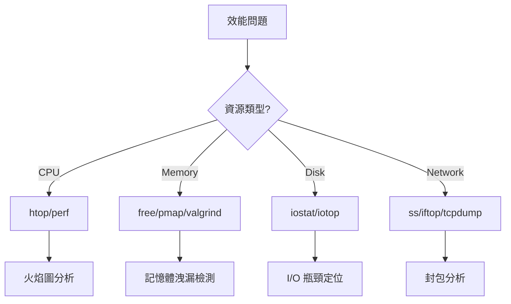
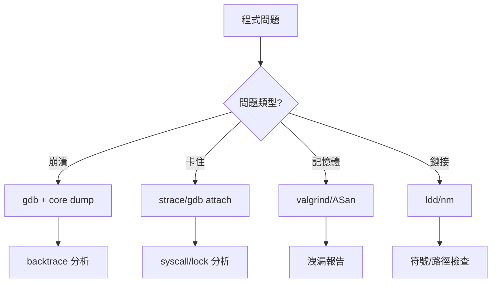

# 後端開發命令行工具概述

## 簡介

本系列筆記整理 Linux 環境下後端開發常用的命令行工具,涵蓋網路測試、性能分析、除錯診斷等面向。每個工具包含命令說明、使用場景、操作範例與輸出說明。

---

## 工具分類總覽

### 網路與 API 測試

| 工具 | 用途 | 適用場景 |
|------|------|----------|
| curl | HTTP 請求測試 | API 開發、介面除錯 |
| grpcurl | gRPC 測試 | gRPC 服務測試 |
| websocat | WebSocket 測試 | 即時通訊測試 |
| nc | TCP/UDP 連接 | 埠測試、簡易伺服器 |
| socat | 進階資料流 | 協議轉換、代理 |
| nmap | 埠掃描 | 安全檢測、服務探測 |

### 性能測試

| 工具 | 用途 | 適用場景 |
|------|------|----------|
| wrk | HTTP 壓測 | API 效能測試 |
| ab | 簡易壓測 | 快速基準測試 |
| k6 | 現代化壓測 | 複雜場景測試 |
| iperf3 | 帶寬測試 | 網路效能評估 |
| stress-ng | 系統壓力 | 穩定性測試 |

### 系統監控

| 工具 | 用途 | 適用場景 |
|------|------|----------|
| htop | 進程監控 | 即時資源查看 |
| vmstat | 系統統計 | CPU/Memory 分析 |
| iostat | 磁碟 I/O | 儲存效能分析 |
| iotop | I/O 排名 | 找出 I/O 大戶 |
| dstat | 綜合監控 | 全面效能觀察 |
| sar | 歷史數據 | 長期趨勢分析 |

### 網路診斷

| 工具 | 用途 | 適用場景 |
|------|------|----------|
| ss | Socket 統計 | 連接狀態查看 |
| lsof | 打開檔案 | 資源佔用分析 |
| tcpdump | 封包擷取 | 網路問題除錯 |
| tshark | 封包分析 | 協議深度分析 |
| dig | DNS 查詢 | 域名解析診斷 |
| mtr | 路由追蹤 | 網路路徑分析 |
| iftop | 流量監控 | 即時帶寬查看 |

### 進程除錯

| 工具 | 用途 | 適用場景 |
|------|------|----------|
| strace | 系統調用追蹤 | 行為分析、問題定位 |
| ltrace | 函式庫調用 | 函數調用分析 |
| perf | 效能分析 | CPU 熱點、火焰圖 |
| pmap | 記憶體映射 | 記憶體分析 |

### 編譯鏈接與二進位分析

| 工具 | 用途 | 適用場景 |
|------|------|----------|
| ldd | 依賴查看 | 鏈接庫問題 |
| ldconfig | 庫快取管理 | 庫路徑設定 |
| nm | 符號表查看 | 符號問題分析 |
| objdump | 反組譯 | 二進位分析 |
| readelf | ELF 分析 | 檔案結構查看 |
| c++filt | 符號還原 | C++ 符號解析 |
| gdb | 程式除錯 | 崩潰分析、除錯 |
| valgrind | 記憶體檢測 | 洩漏檢測 |
| addr2line | 位址轉行號 | 崩潰定位 |

### 日誌分析

| 工具 | 用途 | 適用場景 |
|------|------|----------|
| tail | 即時追蹤 | 日誌監控 |
| rg | 文字搜尋 | 快速過濾 |
| awk | 欄位處理 | 統計分析 |
| jq | JSON 處理 | 結構化日誌 |
| journalctl | 系統日誌 | systemd 日誌 |

### 資料處理

| 工具 | 用途 | 適用場景 |
|------|------|----------|
| jq | JSON 處理 | API 回應分析 |
| yq | YAML 處理 | 設定檔處理 |
| base64 | 編解碼 | 資料轉換 |
| openssl | 加密工具 | 憑證、加解密 |
| xxd | 十六進位 | 二進位查看 |

---

## 快速參考

### 常見問題對應工具

| 問題類型 | 首選工具 | 備選工具 |
|----------|----------|----------|
| API 回應異常 | curl | httpie |
| 埠無法連接 | nc, ss | telnet, nmap |
| 服務效能差 | wrk, htop | ab, perf |
| 程式崩潰 | gdb, coredumpctl | strace, dmesg |
| 記憶體洩漏 | valgrind | pmap, ASan |
| 鏈接庫找不到 | ldd, ldconfig | nm, readelf |
| 網路延遲高 | mtr, tcpdump | ping, ss |
| 磁碟 I/O 慢 | iostat, iotop | dstat |
| 日誌過濾 | rg, awk | grep, sed |

### 效能問題定位流程

### 除錯問題定位流程

---

## 筆記結構

每個工具筆記包含以下章節:

1. **命令說明**: 工具用途與基本語法
2. **常用選項**: 重要參數說明
3. **使用場景**: 適用的問題類型
4. **操作範例**: 具體命令與輸出
5. **輸出說明**: 結果解讀方式
6. **實戰技巧**: 進階用法與組合

---

## 章節列表

1. [HTTP 與 API 測試工具](01-HTTP與API測試工具.md)
2. [網路連接工具](02-網路連接工具.md)
3. [性能壓力測試工具](03-性能壓力測試工具.md)
4. [系統資源監控工具](04-系統資源監控工具.md)
5. [網路診斷工具](05-網路診斷工具.md)
6. [進程除錯與追蹤工具](06-進程除錯與追蹤工具.md)
7. [編譯鏈接與二進位分析工具](07-編譯鏈接與二進位分析工具.md)
8. [日誌分析工具](08-日誌分析工具.md)
9. [資料處理工具](09-資料處理工具.md)
10. [實戰場景](10-實戰場景.md)

---

## 參考資料 (References)

1. [Linux man pages](https://man7.org/linux/man-pages/)
2. [Brendan Gregg's Linux Performance](https://www.brendangregg.com/linuxperf.html)
3. 《Systems Performance: Enterprise and the Cloud》 (Brendan Gregg, 2020)
4. 《Linux Performance Tools》 (Netflix TechBlog)
