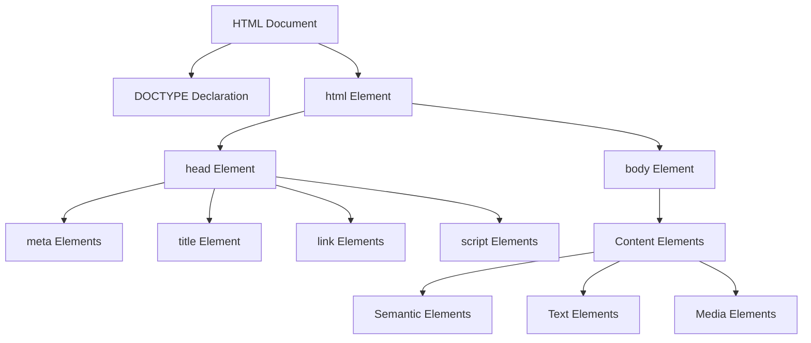

# HTML 基礎語法與結構

## HTML 文件結構



## 基本文件模板

```html
<!DOCTYPE html>
<html lang="zh-TW">
<head>
    <meta charset="UTF-8">
    <meta name="viewport" content="width=device-width, initial-scale=1.0">
    <title>頁面標題</title>
    <meta name="description" content="頁面描述">
    <link rel="stylesheet" href="styles.css">
</head>
<body>
    <header>
        <nav>
            <!-- 導航內容 -->
        </nav>
    </header>
    
    <main>
        <!-- 主要內容 -->
    </main>
    
    <footer>
        <!-- 頁腳內容 -->
    </footer>
    
    <script src="script.js"></script>
</body>
</html>
```

## HTML 元素類型

### 1. 容器元素
```html
<!-- 通用容器 -->
<div class="container">
    <span class="inline-element">內聯元素</span>
</div>

<!-- 語義化容器 -->
<section>
    <article>
        <header>文章標題區</header>
        <main>文章內容</main>
        <footer>文章腳註</footer>
    </article>
</section>
```

### 2. 文字元素
```html
<!-- 標題層級 -->
<h1>主標題</h1>
<h2>次標題</h2>
<h3>三級標題</h3>

<!-- 段落與文字格式 -->
<p>這是一個段落。</p>
<strong>重要文字</strong>
<em>強調文字</em>
<code>程式碼片段</code>
<pre>預格式化文字</pre>
```

### 3. 清單元素
```html
<!-- 無序清單 -->
<ul>
    <li>項目一</li>
    <li>項目二</li>
</ul>

<!-- 有序清單 -->
<ol>
    <li>步驟一</li>
    <li>步驟二</li>
</ol>

<!-- 定義清單 -->
<dl>
    <dt>術語</dt>
    <dd>定義</dd>
</dl>
```

## 實際開發案例：部落格文章頁面

```html
<!DOCTYPE html>
<html lang="zh-TW">
<head>
    <meta charset="UTF-8">
    <meta name="viewport" content="width=device-width, initial-scale=1.0">
    <title>軟體工程師學習筆記 | 技術部落格</title>
    <meta name="description" content="分享軟體開發經驗與技術學習心得">
    <link rel="canonical" href="https://example.com/blog/post-1">
    <link rel="stylesheet" href="/css/main.css">
</head>
<body>
    <header class="site-header">
        <nav class="main-nav">
            <a href="/" class="logo">TechBlog</a>
            <ul class="nav-menu">
                <li><a href="/blog">文章</a></li>
                <li><a href="/categories">分類</a></li>
                <li><a href="/about">關於</a></li>
            </ul>
        </nav>
    </header>

    <main class="main-content">
        <article class="blog-post">
            <header class="post-header">
                <h1 class="post-title">HTML5 語義化標籤最佳實踐</h1>
                <div class="post-meta">
                    <time datetime="2024-01-15">2024年1月15日</time>
                    <span class="author">作者：John Doe</span>
                    <div class="tags">
                        <span class="tag">HTML5</span>
                        <span class="tag">前端開發</span>
                    </div>
                </div>
            </header>

            <div class="post-content">
                <section>
                    <h2>什麼是語義化標籤？</h2>
                    <p>語義化標籤是 HTML5 引入的一系列具有特定含義的元素...</p>
                    
                    <figure>
                        
                        <figcaption>HTML5 語義化標籤結構示意圖</figcaption>
                    </figure>
                </section>

                <section>
                    <h2>實作範例</h2>
                    <pre><code class="language-html">&lt;section&gt;
    &lt;header&gt;
        &lt;h2&gt;章節標題&lt;/h2&gt;
    &lt;/header&gt;
    &lt;p&gt;章節內容...&lt;/p&gt;
&lt;/section&gt;</code></pre>
                </section>
            </div>

            <footer class="post-footer">
                <div class="social-share">
                    <button class="share-btn" data-platform="twitter">分享到 Twitter</button>
                    <button class="share-btn" data-platform="facebook">分享到 Facebook</button>
                </div>
            </footer>
        </article>

        <aside class="sidebar">
            <section class="related-posts">
                <h3>相關文章</h3>
                <ul>
                    <li><a href="/blog/css-grid">CSS Grid 完整指南</a></li>
                    <li><a href="/blog/javascript-es6">ES6 新特性解析</a></li>
                </ul>
            </section>
        </aside>
    </main>

    <footer class="site-footer">
        <div class="footer-content">
            <p>&copy; 2024 TechBlog. All rights reserved.</p>
            <nav class="footer-nav">
                <a href="/privacy">隱私政策</a>
                <a href="/terms">使用條款</a>
            </nav>
        </div>
    </footer>

    <script src="/js/main.js"></script>
</body>
</html>
```

## HTML 語法重點

### 1. 屬性使用
```html
<!-- 正確的屬性語法 -->

<a href="https://example.com" target="_blank" rel="noopener noreferrer">外部連結</a>
<input type="email" id="email" name="email" required>
```

### 2. 全域屬性
```html
<!-- 常用全域屬性 -->
<div id="unique-id" class="css-class" data-custom="value">
    <p title="提示文字" lang="en">Content</p>
</div>
```

### 3. 布林屬性
```html
<!-- 布林屬性的正確寫法 -->
<input type="checkbox" checked>
<script defer src="script.js"></script>
<details open>
    <summary>摘要</summary>
    <p>詳細內容...</p>
</details>
```

## 常見錯誤與修正

### ❌ 錯誤寫法
```html
<!-- 缺少必要屬性 -->


<!-- 不當的元素嵌套 -->
<p><div>內容</div></p>

<!-- 過時的屬性 -->
<font color="red">紅色文字</font>
```

### ✅ 正確寫法
```html
<!-- 包含必要屬性 -->


<!-- 正確的元素嵌套 -->
<div><p>內容</p></div>

<!-- 使用現代方式 -->
<span style="color: red">紅色文字</span>
```

## 開發工具與驗證

### HTML 驗證工具
- [W3C Markup Validator](https://validator.w3.org/)
- VS Code HTML 擴展
- Chrome DevTools

### 最佳實踐檢查清單
- [ ] DOCTYPE 聲明正確
- [ ] 語言屬性已設定
- [ ] Meta 標籤完整
- [ ] 圖片包含 alt 屬性
- [ ] 語義化標籤適當使用
- [ ] HTML 結構邏輯清晰