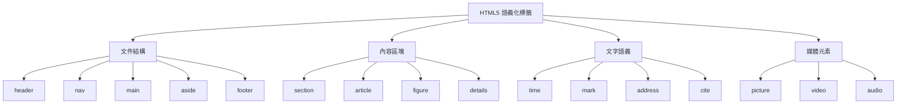
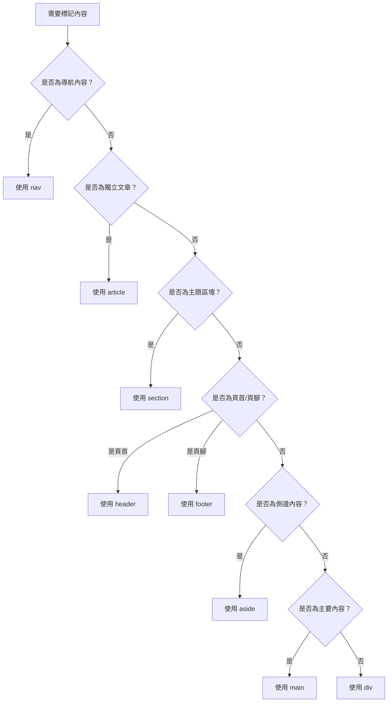

# HTML 語義化與最佳實踐

## 語義化標籤概覽



## 核心語義標籤

### 1. 文件結構標籤

#### header - 頁首/標題區
```html
<!-- 網站主要頁首 -->
<header class="site-header">
    <h1>網站標題</h1>
    <nav>
        <ul>
            <li><a href="/">首頁</a></li>
            <li><a href="/blog">部落格</a></li>
        </ul>
    </nav>
</header>

<!-- 文章標題區 -->
<article>
    <header>
        <h2>文章標題</h2>
        <time datetime="2024-01-15">2024年1月15日</time>
        <address>作者：<a href="mailto:author@example.com">John Doe</a></address>
    </header>
</article>
```

#### nav - 導航區域
```html
<!-- 主導航 -->
<nav aria-label="主要導航">
    <ul>
        <li><a href="/" aria-current="page">首頁</a></li>
        <li><a href="/products">產品</a></li>
        <li><a href="/about">關於我們</a></li>
    </ul>
</nav>

<!-- 麵包屑導航 -->
<nav aria-label="麵包屑">
    <ol>
        <li><a href="/">首頁</a></li>
        <li><a href="/products">產品</a></li>
        <li aria-current="page">筆記型電腦</li>
    </ol>
</nav>

<!-- 分頁導航 -->
<nav aria-label="分頁導航">
    <a href="/page/1" rel="prev">上一頁</a>
    <span aria-current="page">第 2 頁</span>
    <a href="/page/3" rel="next">下一頁</a>
</nav>
```

#### main - 主要內容
```html
<!-- 每個頁面只能有一個 main -->
<main>
    <h1>頁面主標題</h1>
    <section>
        <h2>章節標題</h2>
        <p>主要內容...</p>
    </section>
</main>
```

#### aside - 側邊內容
```html
<!-- 頁面側邊欄 -->
<aside class="sidebar">
    <section>
        <h3>相關文章</h3>
        <ul>
            <li><a href="/post/1">相關文章 1</a></li>
            <li><a href="/post/2">相關文章 2</a></li>
        </ul>
    </section>
</aside>

<!-- 文章內的側邊註解 -->
<article>
    <p>主要內容...</p>
    <aside>
        <p>補充說明：這是額外的背景資訊</p>
    </aside>
</article>
```

#### footer - 頁腳
```html
<!-- 網站頁腳 -->
<footer class="site-footer">
    <div class="footer-links">
        <nav aria-label="頁腳導航">
            <ul>
                <li><a href="/privacy">隱私政策</a></li>
                <li><a href="/terms">使用條款</a></li>
            </ul>
        </nav>
    </div>
    <p>&copy; 2024 公司名稱. 版權所有.</p>
</footer>

<!-- 文章頁腳 -->
<article>
    <h2>文章標題</h2>
    <p>文章內容...</p>
    <footer>
        <p>發布於 <time datetime="2024-01-15">2024年1月15日</time></p>
        <div class="tags">
            <span>標籤：</span>
            <a href="/tag/html">HTML</a>
            <a href="/tag/frontend">前端</a>
        </div>
    </footer>
</article>
```

### 2. 內容區塊標籤

#### section - 主題區塊
```html
<!-- 按主題分組的內容 -->
<section>
    <h2>公司服務</h2>
    <p>我們提供以下服務...</p>
    
    <section>
        <h3>網站開發</h3>
        <p>專業的網站開發服務...</p>
    </section>
    
    <section>
        <h3>行動應用</h3>
        <p>跨平台行動應用開發...</p>
    </section>
</section>
```

#### article - 獨立文章
```html
<!-- 部落格文章 -->
<article class="blog-post">
    <header>
        <h1>軟體開發最佳實踐</h1>
        <time datetime="2024-01-15">2024年1月15日</time>
    </header>
    
    <section>
        <h2>程式碼品質</h2>
        <p>良好的程式碼品質是...</p>
    </section>
    
    <section>
        <h2>測試策略</h2>
        <p>有效的測試策略包括...</p>
    </section>
    
    <footer>
        <p>作者：<a href="/author/john">John Doe</a></p>
    </footer>
</article>

<!-- 新聞文章列表 -->
<section class="news-list">
    <h2>最新消息</h2>
    
    <article>
        <h3><a href="/news/1">新產品發布</a></h3>
        <p>我們很高興宣布...</p>
        <time datetime="2024-01-15">2024年1月15日</time>
    </article>
    
    <article>
        <h3><a href="/news/2">公司里程碑</a></h3>
        <p>今年我們達成了...</p>
        <time datetime="2024-01-14">2024年1月14日</time>
    </article>
</section>
```

#### figure - 圖片與說明
```html
<!-- 圖片與說明文字 -->
<figure>
    
    <figcaption>
        圖 1：微服務架構設計圖
        <cite>來源：《系統設計指南》</cite>
    </figcaption>
</figure>

<!-- 程式碼區塊 -->
<figure>
    <pre><code class="language-javascript">
function calculateTotal(items) {
    return items.reduce((sum, item) => sum + item.price, 0);
}
    </code></pre>
    <figcaption>範例 1：計算總價的函數</figcaption>
</figure>

<!-- 引用區塊 -->
<figure>
    <blockquote>
        <p>程式碼是寫給人看的，只是順便讓機器執行。</p>
    </blockquote>
    <figcaption>
        — <cite>Martin Fowler</cite>
    </figcaption>
</figure>
```

### 3. 文字語義標籤

#### time - 時間標記
```html
<!-- 發布時間 -->
<p>發布於 <time datetime="2024-01-15T10:30:00+08:00">2024年1月15日上午10:30</time></p>

<!-- 日期範圍 -->
<p>會議時間：
<time datetime="2024-01-20T09:00">1月20日上午9點</time>
至
<time datetime="2024-01-20T17:00">下午5點</time>
</p>

<!-- 相對時間 -->
<p>更新於 <time datetime="2024-01-15" title="2024年1月15日">昨天</time></p>
```

#### mark - 標記文字
```html
<!-- 搜尋結果高亮 -->
<p>搜尋結果：學習 <mark>HTML</mark> 語義化標籤的重要性</p>

<!-- 重點標記 -->
<p>注意：這個 <mark>API 即將淘汰</mark>，請盡快更新到新版本。</p>
```

#### address - 聯絡資訊
```html
<!-- 文章作者資訊 -->
<article>
    <h2>軟體架構設計</h2>
    <p>文章內容...</p>
    <footer>
        <address>
            作者：<a href="mailto:john.doe@example.com">John Doe</a><br>
            軟體架構師，<a href="https://company.com">ABC科技公司</a>
        </address>
    </footer>
</article>

<!-- 聯絡頁面 -->
<section>
    <h2>聯絡我們</h2>
    <address>
        <p><strong>ABC科技公司</strong></p>
        <p>台北市信義區信義路五段7號</p>
        <p>電話：<a href="tel:+886-2-1234-5678">02-1234-5678</a></p>
        <p>信箱：<a href="mailto:info@abc.com">info@abc.com</a></p>
    </address>
</section>
```

## 實際開發案例：電子商務產品頁面

```html
<!DOCTYPE html>
<html lang="zh-TW">
<head>
    <meta charset="UTF-8">
    <meta name="viewport" content="width=device-width, initial-scale=1.0">
    <title>MacBook Pro 14吋 - 專業筆記型電腦 | TechStore</title>
    <meta name="description" content="MacBook Pro 14吋，搭載M3晶片，適合專業工作者。享受快速運算效能與出色顯示品質。">
</head>
<body>
    <header class="site-header">
        <nav class="main-nav" aria-label="主要導航">
            <a href="/" class="logo">TechStore</a>
            <ul>
                <li><a href="/products">產品</a></li>
                <li><a href="/support">技術支援</a></li>
                <li><a href="/account">我的帳戶</a></li>
            </ul>
        </nav>
    </header>

    <nav aria-label="麵包屑導航">
        <ol>
            <li><a href="/">首頁</a></li>
            <li><a href="/products">產品</a></li>
            <li><a href="/products/laptops">筆記型電腦</a></li>
            <li aria-current="page">MacBook Pro 14吋</li>
        </ol>
    </nav>

    <main>
        <article class="product-page">
            <header class="product-header">
                <h1>MacBook Pro 14吋</h1>
                <p class="product-subtitle">專業效能，輕薄設計</p>
            </header>

            <section class="product-gallery">
                <figure>
                    
                    <figcaption>MacBook Pro 14吋 - 太空灰色</figcaption>
                </figure>
                
                <div class="thumbnail-gallery">
                    <button type="button" aria-label="檢視側面圖">
                        
                    </button>
                    <button type="button" aria-label="檢視鍵盤特寫">
                        
                    </button>
                </div>
            </section>

            <section class="product-info">
                <h2>產品特色</h2>
                
                <section class="specifications">
                    <h3>技術規格</h3>
                    <dl>
                        <dt>處理器</dt>
                        <dd>Apple M3 晶片，8核心CPU</dd>
                        
                        <dt>記憶體</dt>
                        <dd>16GB 統一記憶體</dd>
                        
                        <dt>儲存空間</dt>
                        <dd>512GB SSD</dd>
                        
                        <dt>顯示器</dt>
                        <dd>14.2吋 Liquid Retina XDR 顯示器</dd>
                    </dl>
                </section>

                <section class="pricing">
                    <h3>價格資訊</h3>
                    <div class="price-display">
                        <span class="currency">NT$</span>
                        <span class="amount">64,900</span>
                    </div>
                    <p class="price-note">價格含稅，免費配送</p>
                </section>
            </section>

            <aside class="product-sidebar">
                <section class="purchase-options">
                    <h3>購買選項</h3>
                    <form action="/cart/add" method="post">
                        <input type="hidden" name="product-id" value="macbook-pro-14">
                        
                        <fieldset>
                            <legend>選擇顏色</legend>
                            <label>
                                <input type="radio" name="color" value="space-gray" checked>
                                太空灰色
                            </label>
                            <label>
                                <input type="radio" name="color" value="silver">
                                銀色
                            </label>
                        </fieldset>
                        
                        <button type="submit" class="add-to-cart-btn">
                            加入購物車
                        </button>
                    </form>
                </section>

                <section class="delivery-info">
                    <h3>配送資訊</h3>
                    <ul>
                        <li>免費配送</li>
                        <li>3-5個工作天到貨</li>
                        <li>提供安裝服務</li>
                    </ul>
                </section>
            </aside>

            <section class="product-reviews">
                <h2>顧客評價</h2>
                
                <article class="review">
                    <header>
                        <h3>優秀的專業工具</h3>
                        <div class="rating" aria-label="5星評價">
                            <span>★★★★★</span>
                        </div>
                    </header>
                    <p>性能表現超出預期，編譯大型專案的速度大幅提升...</p>
                    <footer>
                        <address>
                            評價者：軟體工程師 張三
                        </address>
                        <time datetime="2024-01-10">2024年1月10日</time>
                    </footer>
                </article>

                <article class="review">
                    <header>
                        <h3>設計工作的好夥伴</h3>
                        <div class="rating" aria-label="4星評價">
                            <span>★★★★☆</span>
                        </div>
                    </header>
                    <p>顯示效果很棒，處理4K影片很流暢...</p>
                    <footer>
                        <address>
                            評價者：設計師 李四
                        </address>
                        <time datetime="2024-01-08">2024年1月8日</time>
                    </footer>
                </article>
            </section>

            <footer class="product-footer">
                <p>最後更新：<time datetime="2024-01-15">2024年1月15日</time></p>
                <nav aria-label="產品相關連結">
                    <ul>
                        <li><a href="/products/macbook-pro-14/specs">完整規格</a></li>
                        <li><a href="/support/macbook-pro">技術支援</a></li>
                        <li><a href="/compare?product=macbook-pro-14">產品比較</a></li>
                    </ul>
                </nav>
            </footer>
        </article>
    </main>

    <footer class="site-footer">
        <section class="footer-content">
            <nav aria-label="頁腳導航">
                <h3>服務</h3>
                <ul>
                    <li><a href="/support">技術支援</a></li>
                    <li><a href="/warranty">保固服務</a></li>
                    <li><a href="/repair">維修服務</a></li>
                </ul>
            </nav>
            
            <section class="company-info">
                <h3>公司資訊</h3>
                <address>
                    <p><strong>TechStore</strong></p>
                    <p>台北市信義區信義路五段7號</p>
                    <p>客服專線：<a href="tel:+886-2-1234-5678">02-1234-5678</a></p>
                </address>
            </section>
        </section>
        
        <div class="legal-info">
            <p>&copy; 2024 TechStore. 版權所有.</p>
            <nav aria-label="法律條款">
                <a href="/privacy">隱私政策</a>
                <a href="/terms">使用條款</a>
            </nav>
        </div>
    </footer>
</body>
</html>
```

## 語義化標籤選擇指南



## 最佳實踐原則

### 1. 語義化優先
```html
<!-- ❌ 只關注樣式 -->
<div class="big-text">重要標題</div>

<!-- ✅ 語義化優先 -->
<h1>重要標題</h1>
```

### 2. 結構層次清晰
```html
<!-- ✅ 邏輯清晰的層次結構 -->
<article>
    <header>
        <h1>文章標題</h1>
        <time datetime="2024-01-15">2024年1月15日</time>
    </header>
    
    <section>
        <h2>章節一</h2>
        <p>內容...</p>
        
        <section>
            <h3>子章節</h3>
            <p>內容...</p>
        </section>
    </section>
    
    <footer>
        <p>作者資訊</p>
    </footer>
</article>
```

### 3. 標題層級正確
```html
<!-- ❌ 跳過層級 -->
<h1>主標題</h1>
<h3>次標題</h3>

<!-- ✅ 循序漸進 -->
<h1>主標題</h1>
<h2>次標題</h2>
<h3>三級標題</h3>
```

### 4. 適當使用 ARIA 屬性
```html
<!-- 增強語義化 -->
<nav aria-label="主要導航">
    <ul>
        <li><a href="/" aria-current="page">首頁</a></li>
        <li><a href="/about">關於</a></li>
    </ul>
</nav>

<section aria-labelledby="features-heading">
    <h2 id="features-heading">產品特色</h2>
    <p>產品特色說明...</p>
</section>
```

## 開發檢查清單

### 語義化檢查
- [ ] 使用適當的語義標籤
- [ ] 標題層級邏輯正確
- [ ] 導航區域明確標記
- [ ] 時間資訊使用 time 標籤
- [ ] 聯絡資訊使用 address 標籤

### 結構檢查
- [ ] 每頁只有一個 main 元素
- [ ] header/footer 使用適當
- [ ] section/article 區分正確
- [ ] 嵌套關係合理

### 無障礙檢查
- [ ] 重要區塊有適當標籤
- [ ] 導航有 aria-label
- [ ] 當前頁面狀態標記
- [ ] 互動元素有適當描述