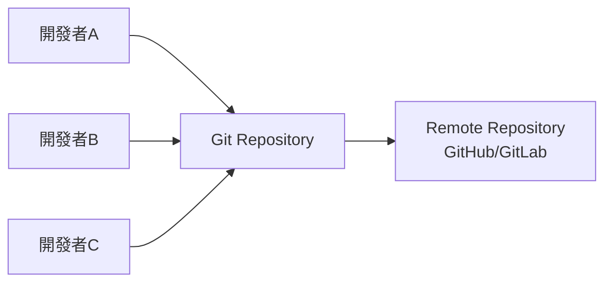
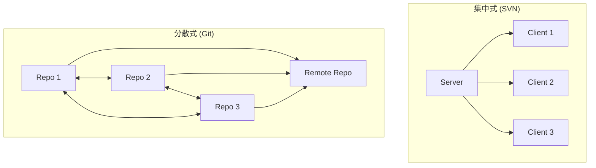
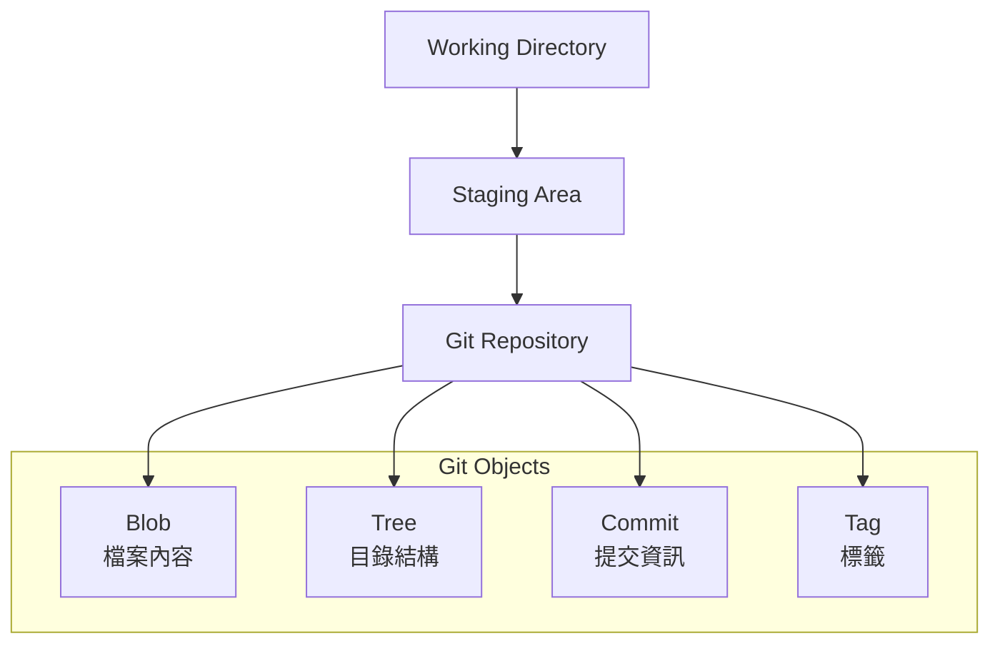
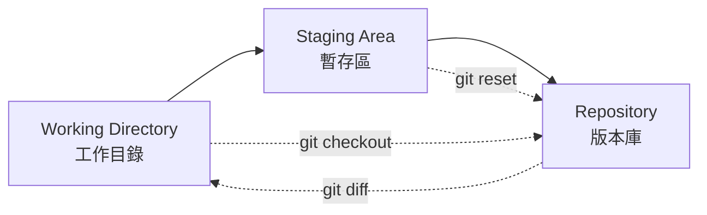
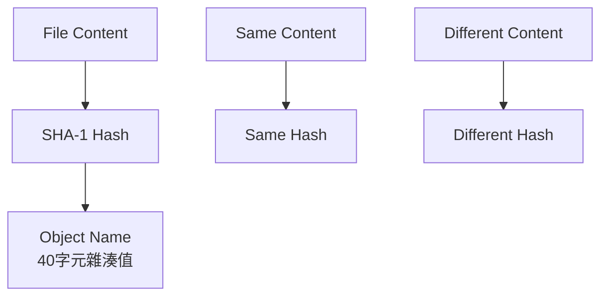
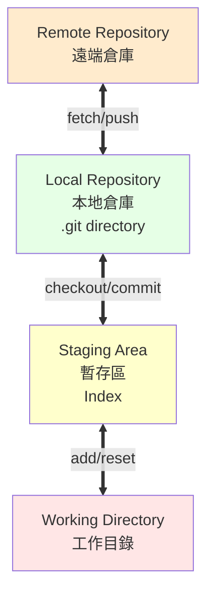
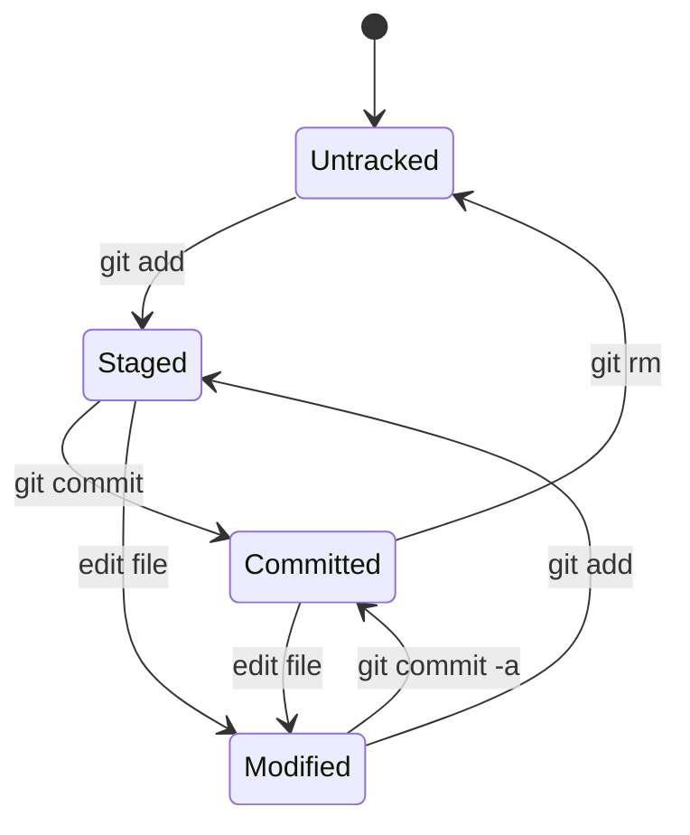
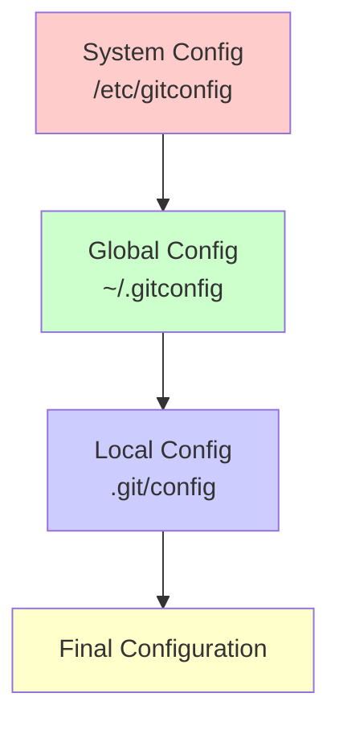

# Git 基礎概念與工作原理

## 1. Git 是什麼？

Git 是一個分散式版本控制系統，每個開發者的本地都是一個完整的代碼倉庫。



### 集中式 vs 分散式



## 2. Git 內部原理

### 2.1 Git 物件模型

Git 的核心是一個內容定址的檔案系統，主要有四種物件類型：



#### 實際案例：創建一個簡單專案

```bash
# 初始化專案
mkdir myproject && cd myproject
git init

# 創建檔案
echo "console.log('Hello World');" > app.js
echo "# MyProject" > README.md

# 查看 Git 物件
git add .
git commit -m "Initial commit"

# 查看內部物件
find .git/objects -type f
git cat-file -t <object-hash>  # 查看物件類型
git cat-file -p <object-hash>  # 查看物件內容
```

### 2.2 三樹架構（Three-Tree Architecture）



#### 實際開發場景

```bash
# 場景：修改多個檔案，但只想提交部分修改
echo "const version = '1.0.0';" >> app.js
echo "const debug = true;" >> app.js
echo "# Version 1.0.0" >> README.md

# 查看狀態
git status

# 選擇性加入暫存區
git add app.js                    # 只加入 app.js
git status                        # README.md 仍在工作目錄

# 部分提交
git commit -m "Add version constant"

# 查看差異
git diff                          # 工作目錄 vs 暫存區
git diff --cached                 # 暫存區 vs 最後提交
git diff HEAD                     # 工作目錄 vs 最後提交
```

### 2.3 SHA-1 雜湊與內容完整性



#### 雜湊計算示例

```bash
# Git 如何計算物件雜湊
echo "Hello World" | git hash-object --stdin
echo "Hello World" | sha1sum
```

> 這兩者不同是因爲 `git hash-object` 會包含 header: `[物件類型] [內容大小]\0[原始內容]`

## 3. Git 工作區域詳解

### 3.1 四個工作區域



### 3.2 檔案狀態生命週期



#### 實際狀態轉換示例

```bash
# 專案設置
mkdir webapp && cd webapp
git init

# 1. Untracked -> Staged
echo "body { margin: 0; }" > style.css
git status  # Untracked files
git add style.css
git status  # Changes to be committed

# 2. Staged -> Committed
git commit -m "Add basic CSS reset"
git status  # Clean working tree

# 3. Committed -> Modified
echo "h1 { color: blue; }" >> style.css
git status  # Changes not staged

# 4. Modified -> Staged -> Committed
git add style.css
git commit -m "Add h1 styling"

# 5. 查看完整歷史
git log --oneline --graph
```

## 4. Git 配置與環境

### 4.1 配置層級



#### 實際配置設置

```bash
# 全域配置（必需）
git config --global user.name "張開發"
git config --global user.email "developer@company.com"
git config --global init.defaultBranch main

# 專案特定配置
git config user.email "zhang@project-team.com"  # 僅此專案使用

# 實用配置
git config --global core.editor "code --wait"
git config --global merge.tool "code"
git config --global pull.rebase true

# 查看配置
git config --list
git config --list --show-origin  # 顯示配置來源
```

### 4.2 .gitignore 檔案

```bash
# 創建完整的 .gitignore
cat > .gitignore << 'EOF'
# 依賴套件
node_modules/
vendor/
__pycache__/

# 建構輸出
dist/
build/
*.o
*.exe

# 環境檔案
.env
.env.local
config.local.json

# IDE 檔案
.vscode/
.idea/
*.swp
*.swo

# 系統檔案
.DS_Store
Thumbs.db

# 日誌檔案
*.log
logs/
EOF

# 測試 .gitignore
touch node_modules/test.js
touch .env
git status  # 這些檔案不會出現
```

## 5. 實戰練習：建立第一個專案

### 完整專案初始化流程

```bash
# 1. 建立專案結構
mkdir e-commerce-api && cd e-commerce-api
git init

# 2. 創建基本檔案結構
mkdir src tests docs
touch src/app.js src/config.js
touch tests/app.test.js
touch README.md package.json .gitignore

# 3. 設置專案配置
echo '{
  "name": "e-commerce-api",
  "version": "1.0.0",
  "description": "E-commerce REST API",
  "main": "src/app.js"
}' > package.json

echo '# E-commerce API

## 專案描述
這是一個電商平台的 REST API 服務

## 安裝
```bash
npm install
```

## 執行
```bash
npm start
```' > README.md

# 4. 創建應用程式碼
echo 'const express = require("express");
const app = express();
const PORT = process.env.PORT || 3000;

app.get("/", (req, res) => {
  res.json({ message: "E-commerce API v1.0.0" });
});

app.listen(PORT, () => {
  console.log(`Server running on port ${PORT}`);
});

module.exports = app;' > src/app.js

# 5. 設置 .gitignore
echo 'node_modules/
.env
.env.local
npm-debug.log*
coverage/
.nyc_output/' > .gitignore

# 6. 初始提交
git add .
git status
git commit -m "feat: initial project setup

- Add Express.js application structure
- Configure package.json with basic info
- Add README with setup instructions
- Configure .gitignore for Node.js project"

# 7. 查看結果
git log --oneline
git show HEAD  # 查看最後一次提交的詳細資訊
```

## 6. 重要概念總結

### Git 核心原則
1. **內容完整性**：使用 SHA-1 確保資料完整性
2. **分散式架構**：每個克隆都是完整倉庫
3. **快照模式**：儲存完整快照而非差異
4. **分支輕量化**：分支只是指向提交的指標

### 下一步學習
完成本章後，你應該理解：
- Git 的內部工作原理
- 三樹架構的概念
- 檔案狀態轉換
- 基本專案設置

**下一章將學習**：Git 基本操作與版本控制的日常使用方法。