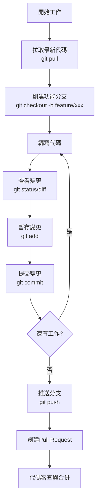
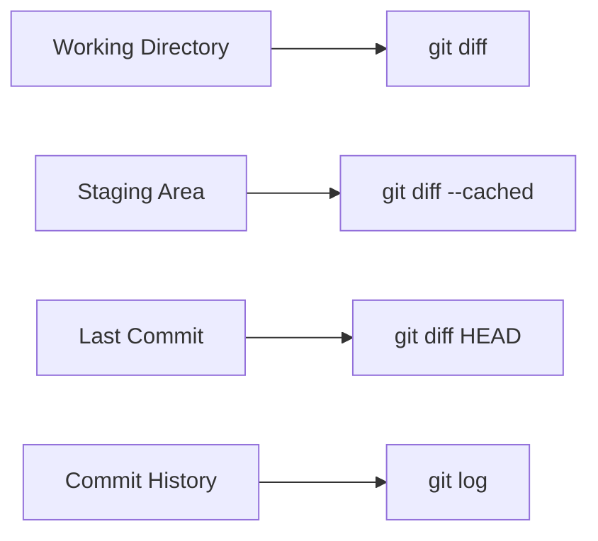
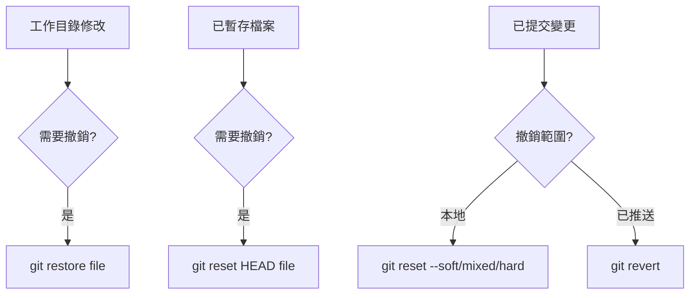
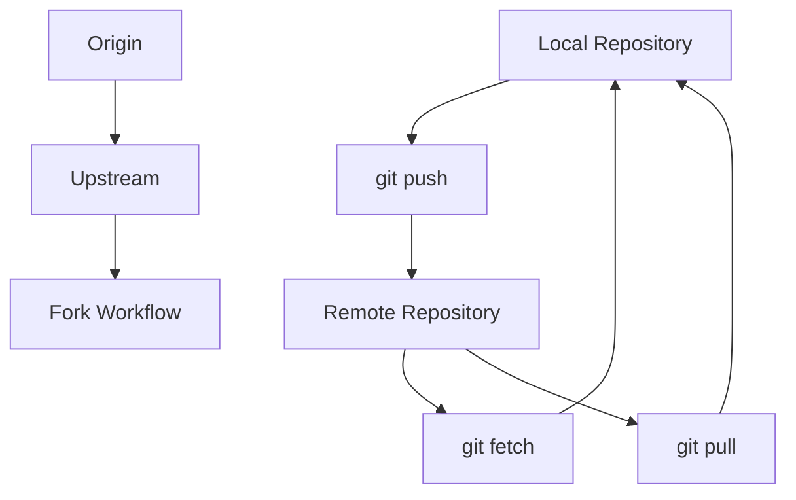

# Git 基本操作與版本控制

## 1. Git 日常操作流程

### 1.1 標準開發週期



### 1.2 實際開發場景示例

```bash
# 場景：為電商網站添加購物車功能
cd e-commerce-web
git pull origin main

# 創建功能分支
git checkout -b feature/shopping-cart

# 開發過程中的常用操作
git status          # 查看當前狀態
git diff           # 查看未暫存的變更
git add .          # 暫存所有變更
git diff --cached  # 查看已暫存的變更
git commit -m "feat: add shopping cart component"

# 繼續開發...
git add src/components/Cart.js
git commit -m "feat: implement cart item management"

git add src/utils/cartStorage.js
git commit -m "feat: add local storage for cart persistence"
```

## 2. 核心命令詳解

### 2.1 專案初始化與克隆

```bash
# 方式1：從零開始
mkdir new-project && cd new-project
git init
git remote add origin https://github.com/username/new-project.git

# 方式2：克隆現有專案
git clone https://github.com/company/existing-project.git
cd existing-project

# 方式3：克隆特定分支
git clone -b develop https://github.com/company/project.git

# 方式4：淺層克隆（節省空間）
git clone --depth 1 https://github.com/large-project/repo.git
```

### 2.2 檔案操作命令

#### 實際開發案例：API 專案文件管理

```bash
# 專案結構
mkdir api-project && cd api-project
git init

# 創建專案檔案
touch src/app.js src/routes.js src/models/User.js
touch tests/user.test.js
touch .env.example Dockerfile

# 檢查狀態
git status
# 輸出：Untracked files: src/, tests/, .env.example, Dockerfile

# 選擇性添加檔案
git add src/                    # 添加整個目錄
git add .env.example           # 添加單個檔案
git status

# 撤銷暫存
git reset HEAD src/routes.js   # 移出暫存區
git status

# 提交部分檔案
git commit -m "feat: add core application structure"

# 繼續添加測試檔案
git add tests/
git add Dockerfile
git commit -m "feat: add testing framework and Docker config"
```

### 2.3 查看歷史與差異



#### 實用的查看命令

```bash
# 查看提交歷史
git log                           # 詳細日誌
git log --oneline                # 簡潔格式
git log --graph --all            # 圖形化顯示所有分支
git log --author="張開發"        # 特定作者的提交
git log --since="2 weeks ago"    # 時間範圍
git log --grep="bug fix"         # 搜尋提交訊息

# 查看具體變更
git show HEAD                    # 查看最後一次提交
git show HEAD~2                  # 查看倒數第三次提交
git show --stat HEAD             # 只顯示檔案變更統計

# 比較差異
git diff HEAD~1 HEAD             # 比較兩次提交
git diff main feature/api        # 比較兩個分支
git diff --name-only HEAD~1      # 只顯示變更的檔案名
```

#### 實際案例：追蹤 bug 來源

```bash
# 場景：用戶回報登入功能異常，需要追蹤相關變更
git log --oneline --grep="login" --since="1 month ago"
# 輸出：
# abc123f fix: resolve login validation issue
# def456a feat: add OAuth login support
# ghi789b refactor: update login form styling

# 查看具體變更
git show abc123f                 # 查看修復的詳細內容
git diff abc123f~1 abc123f       # 比較修復前後差異

# 檢查特定檔案的歷史
git log --follow src/auth/login.js
git blame src/auth/login.js      # 查看每行代碼的作者和提交
```

## 3. 撤銷操作

### 3.1 撤銷操作流程圖



### 3.2 實際撤銷場景

#### 場景1：撤銷工作目錄的修改

```bash
# 意外修改了重要檔案
echo "accidentally modified" >> src/config.js
git status
# 輸出：Changes not staged for commit: modified: src/config.js

# 撤銷修改
git restore src/config.js       # Git 2.23+
# 或
git checkout -- src/config.js   # 舊版本語法

# 驗證撤銷
git status
# 輸出：On branch main, nothing to commit, working tree clean
```

#### 場景2：撤銷暫存區的檔案

```bash
# 錯誤地暫存了機密檔案
echo "SECRET_KEY=abc123" > .env
git add .env
git status
# 輸出：Changes to be committed: new file: .env

# 從暫存區移除（但保留工作目錄的修改）
git reset HEAD .env
git status
# 輸出：Untracked files: .env

# 加入 .gitignore
echo ".env" >> .gitignore
git add .gitignore
git commit -m "feat: add .env to gitignore"
```

#### 場景3：撤銷提交

```bash
# 提交了錯誤的代碼
git add src/bug.js
git commit -m "add broken feature"
git log --oneline
# 輸出：
# a1b2c3d add broken feature  <- 需要撤銷
# e4f5g6h previous working commit

# 方式1：軟撤銷（保留修改在暫存區）
git reset --soft HEAD~1
git status
# 輸出：Changes to be committed: new file: src/bug.js

# 方式2：混合撤銷（保留修改在工作目錄）
git reset --mixed HEAD~1      # 預設行為
git status
# 輸出：Untracked files: src/bug.js

# 方式3：硬撤銷（完全刪除修改）⚠️危險操作
git reset --hard HEAD~1
git status
# 輸出：On branch main, nothing to commit, working tree clean
```

#### 場景4：撤銷已推送的提交

```bash
# 情況：錯誤的提交已經推送到遠端
git log --oneline
# 輸出：
# bad123f fix: incorrect implementation  <- 已推送，需要撤銷
# good456a feat: working feature

# 創建反向提交（推薦做法）
git revert bad123f
# 自動打開編輯器輸入提交訊息，預設：
# Revert "fix: incorrect implementation"
# This reverts commit bad123f...

# 推送撤銷提交
git push origin main

# 查看結果
git log --oneline
# 輸出：
# rev789c Revert "fix: incorrect implementation"
# bad123f fix: incorrect implementation
# good456a feat: working feature
```

## 4. 遠端倉庫操作

### 4.1 遠端倉庫管理



#### 實際團隊協作場景

```bash
# 場景：加入現有團隊專案
git clone https://github.com/company/team-project.git
cd team-project

# 查看遠端倉庫
git remote -v
# 輸出：
# origin  https://github.com/company/team-project.git (fetch)
# origin  https://github.com/company/team-project.git (push)

# 添加上游倉庫（如果是 fork）
git remote add upstream https://github.com/original/team-project.git
git remote -v
# 輸出：
# origin     https://github.com/company/team-project.git (fetch)
# origin     https://github.com/company/team-project.git (push)
# upstream   https://github.com/original/team-project.git (fetch)
# upstream   https://github.com/original/team-project.git (push)

# 同步上游變更
git fetch upstream
git checkout main
git merge upstream/main
git push origin main
```

### 4.2 推送與拉取策略

#### 日常開發推送流程

```bash
# 每日開始工作前
git checkout main
git pull origin main              # 拉取最新主分支

# 創建功能分支
git checkout -b feature/user-auth

# 開發完成後推送
git push -u origin feature/user-auth  # 首次推送設置追蹤
git push                              # 後續推送

# 如果遠端分支有更新
git pull origin feature/user-auth     # 拉取並合併
# 或者
git fetch origin
git rebase origin/feature/user-auth   # 變基整合
```

#### 處理推送衝突

```bash
# 場景：推送時遇到衝突
git push origin feature/payment
# 輸出：
# ! [rejected] feature/payment -> feature/payment (non-fast-forward)
# error: failed to push some refs

# 解決方案1：拉取並合併
git pull origin feature/payment
# 如果有衝突，手動解決後：
git add .
git commit -m "resolve merge conflicts"
git push origin feature/payment

# 解決方案2：變基（保持線性歷史）
git pull --rebase origin feature/payment
# 解決衝突後：
git add .
git rebase --continue
git push origin feature/payment
```

## 5. 實戰練習：完整功能開發

### 團隊協作開發流程

```bash
# 場景：為電商平台開發商品搜尋功能

# 1. 準備工作
git clone https://github.com/company/ecommerce-platform.git
cd ecommerce-platform
git checkout main
git pull origin main

# 2. 創建功能分支
git checkout -b feature/product-search

# 3. 開發階段1：後端 API
cat > src/api/searchController.js << 'EOF'
const { Product } = require('../models');

const searchProducts = async (req, res) => {
  try {
    const { query, category, minPrice, maxPrice } = req.query;
    
    const searchCriteria = {};
    if (query) searchCriteria.name = { $regex: query, $options: 'i' };
    if (category) searchCriteria.category = category;
    if (minPrice || maxPrice) {
      searchCriteria.price = {};
      if (minPrice) searchCriteria.price.$gte = parseFloat(minPrice);
      if (maxPrice) searchCriteria.price.$lte = parseFloat(maxPrice);
    }
    
    const products = await Product.find(searchCriteria);
    res.json({ success: true, data: products });
  } catch (error) {
    res.status(500).json({ success: false, error: error.message });
  }
};

module.exports = { searchProducts };
EOF

# 提交後端 API
git add src/api/searchController.js
git commit -m "feat: implement product search API endpoint

- Add search by name with regex matching
- Support category filtering
- Add price range filtering
- Include error handling"

# 4. 開發階段2：前端元件
mkdir -p src/components/Search
cat > src/components/Search/SearchBox.js << 'EOF'
import React, { useState } from 'react';
import './SearchBox.css';

const SearchBox = ({ onSearch }) => {
  const [query, setQuery] = useState('');
  const [category, setCategory] = useState('');
  const [priceRange, setPriceRange] = useState({ min: '', max: '' });

  const handleSubmit = (e) => {
    e.preventDefault();
    onSearch({
      query,
      category,
      minPrice: priceRange.min,
      maxPrice: priceRange.max
    });
  };

  return (
    <form className="search-box" onSubmit={handleSubmit}>
      <input
        type="text"
        placeholder="搜尋商品..."
        value={query}
        onChange={(e) => setQuery(e.target.value)}
      />
      <select 
        value={category} 
        onChange={(e) => setCategory(e.target.value)}
      >
        <option value="">所有分類</option>
        <option value="electronics">電子產品</option>
        <option value="clothing">服飾</option>
        <option value="books">書籍</option>
      </select>
      <div className="price-range">
        <input
          type="number"
          placeholder="最低價格"
          value={priceRange.min}
          onChange={(e) => setPriceRange({...priceRange, min: e.target.value})}
        />
        <input
          type="number"
          placeholder="最高價格"
          value={priceRange.max}
          onChange={(e) => setPriceRange({...priceRange, max: e.target.value})}
        />
      </div>
      <button type="submit">搜尋</button>
    </form>
  );
};

export default SearchBox;
EOF

# 提交前端元件
git add src/components/Search/
git commit -m "feat: add product search UI component

- Implement search box with query input
- Add category dropdown selection
- Include price range filtering inputs
- Add form submission handling"

# 5. 開發階段3：測試
cat > tests/search.test.js << 'EOF'
const request = require('supertest');
const app = require('../src/app');

describe('Product Search API', () => {
  test('should search products by name', async () => {
    const response = await request(app)
      .get('/api/search?query=laptop')
      .expect(200);
    
    expect(response.body.success).toBe(true);
    expect(Array.isArray(response.body.data)).toBe(true);
  });

  test('should filter by category', async () => {
    const response = await request(app)
      .get('/api/search?category=electronics')
      .expect(200);
    
    expect(response.body.success).toBe(true);
  });

  test('should filter by price range', async () => {
    const response = await request(app)
      .get('/api/search?minPrice=100&maxPrice=500')
      .expect(200);
    
    expect(response.body.success).toBe(true);
  });
});
EOF

# 提交測試
git add tests/search.test.js
git commit -m "test: add comprehensive search API tests

- Test search by product name
- Test category filtering
- Test price range filtering
- Ensure proper API response format"

# 6. 查看開發歷史
git log --oneline
# 輸出：
# a1b2c3d test: add comprehensive search API tests
# e4f5g6h feat: add product search UI component  
# i7j8k9l feat: implement product search API endpoint
# m0n1o2p (origin/main) previous commits...

# 7. 推送功能分支
git push -u origin feature/product-search

# 8. 創建 Pull Request（通過 GitHub/GitLab 介面）
echo "功能開發完成，可以創建 Pull Request 進行代碼審查"
```

## 6. 常見問題與解決方案

### 6.1 提交訊息修正

```bash
# 修改最後一次提交訊息
git commit --amend -m "feat: implement product search with filters"

# 修改最後一次提交內容（添加遺漏的檔案）
git add forgotten-file.js
git commit --amend --no-edit

# 分解上次提交（如果提交了太多內容）
git reset --soft HEAD~1
git add specific-file.js
git commit -m "feat: add search API"
git add another-file.js  
git commit -m "feat: add search UI component"
```

### 6.2 處理大檔案

```bash
# 意外提交了大檔案
git filter-branch --tree-filter 'rm -f large-file.zip' HEAD
# 或使用 BFG Repo-Cleaner（推薦）
java -jar bfg.jar --delete-files large-file.zip
```

## 7. 效率提升技巧

### 7.1 Git 別名設置

```bash
# 設置常用別名
git config --global alias.st status
git config --global alias.co checkout
git config --global alias.br branch
git config --global alias.ci commit
git config --global alias.unstage 'reset HEAD --'
git config --global alias.last 'log -1 HEAD'
git config --global alias.visual '!gitk'

# 複雜別名
git config --global alias.hist 'log --pretty=format:"%h %ad | %s%d [%an]" --graph --date=short'
git config --global alias.type 'cat-file -t'
git config --global alias.dump 'cat-file -p'
```

### 7.2 提高效率的工作流程

```bash
# 快速切換到上一個分支
git checkout -

# 快速暫存和恢復工作
git stash                    # 暫存當前工作
git checkout main           # 切換分支處理緊急問題
git stash pop               # 恢復之前的工作

# 選擇性暫存
git add -p                  # 互動式選擇要暫存的內容

# 快速查看最近的變更
git log --since="yesterday" --author="$(git config user.name)" --oneline
```

## 8. 下一步學習

完成本章後，你應該能夠：
- 熟練使用 Git 的基本命令
- 理解工作目錄、暫存區、倉庫的關係
- 處理各種撤銷場景
- 與遠端倉庫協作

**下一章將學習**：Git 分支管理與合併策略，這是團隊協作的核心技能。