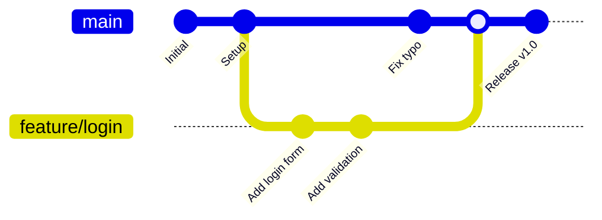
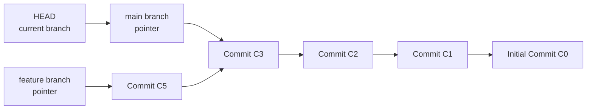
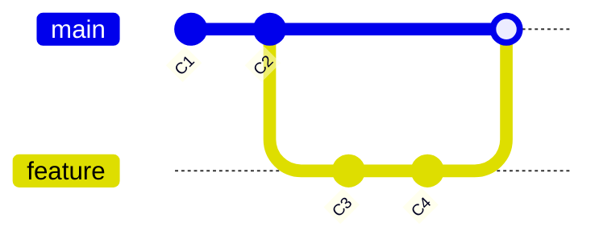
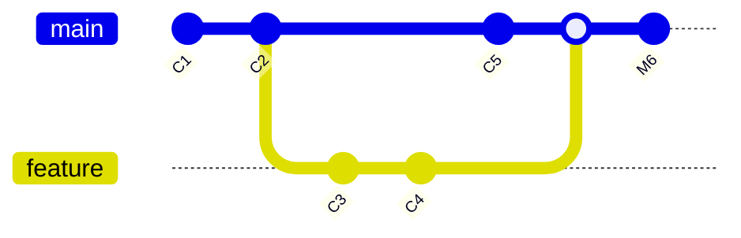
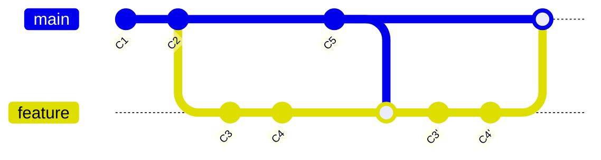
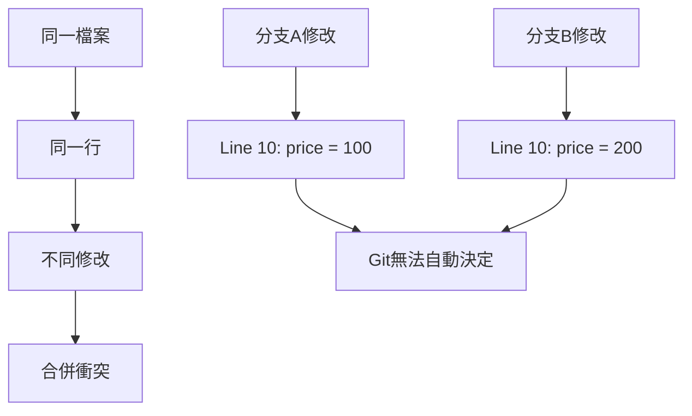
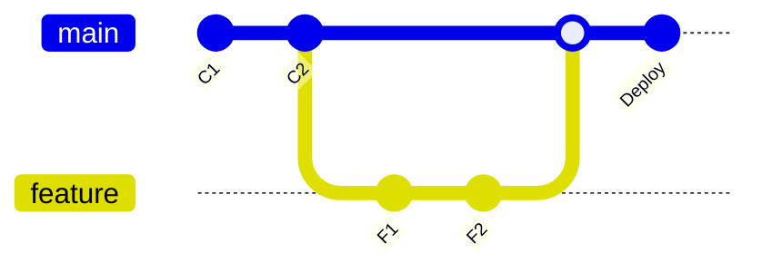
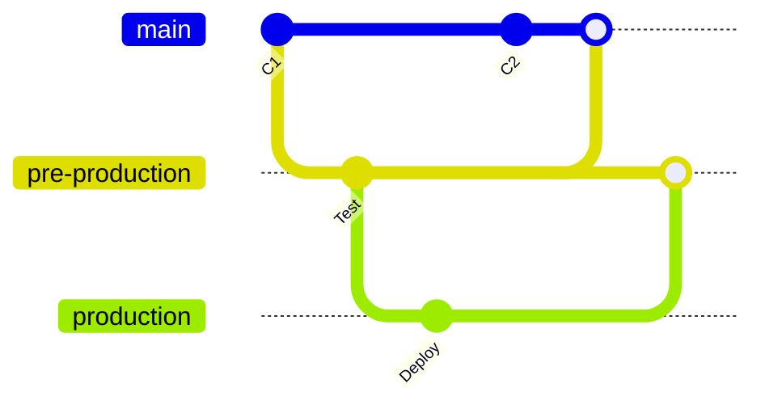

# Git 分支管理與合併策略

## 1. 分支概念與優勢

### 1.1 什麼是分支？

分支是 Git 最強大的功能之一，它允許開發者在獨立的時間線上工作，而不影響主要代碼。



### 1.2 分支的內部實現



#### 實際查看分支指標

```bash
# 查看分支指標的實際位置
cat .git/HEAD
# 輸出：ref: refs/heads/main

cat .git/refs/heads/main
# 輸出：a1b2c3d4e5f6... (SHA-1 雜湊)

# 查看所有分支
git branch -v
# 輸出：
# * main    a1b2c3d Latest commit on main
#   feature b2c3d4e5 Feature commit

git log --oneline --graph --all
# 視覺化顯示所有分支的關係
```

## 2. 分支基本操作

### 2.1 創建與切換分支

```bash
# 實際開發場景：為電商平台添加支付功能
cd ecommerce-platform

# 方式1：分別創建和切換
git branch feature/payment-integration    # 僅創建分支
git checkout feature/payment-integration  # 切換到分支

# 方式2：創建並切換（推薦）
git checkout -b feature/payment-gateway

# 方式3：基於特定提交創建分支
git checkout -b hotfix/security-patch a1b2c3d

# 方式4：Git 2.23+ 新語法
git switch -c feature/user-dashboard     # 創建並切換
git switch main                          # 切換到現有分支
```

### 2.2 分支管理實戰

#### 實際開發情境：多功能並行開發

```bash
# 場景：同時開發多個功能
git checkout main
git pull origin main

# 開發者A：用戶認證功能
git checkout -b feature/auth-system
echo "// Authentication service" > src/auth.js
git add src/auth.js
git commit -m "feat: add authentication service structure"

# 開發者B：商品管理功能  
git checkout main
git checkout -b feature/product-management
echo "// Product management API" > src/products.js
git add src/products.js
git commit -m "feat: add product management API"

# 開發者C：訂單處理功能
git checkout main  
git checkout -b feature/order-processing
echo "// Order processing logic" > src/orders.js
git add src/orders.js
git commit -m "feat: add order processing system"

# 查看所有分支狀態
git branch -v
# 輸出：
#   feature/auth-system         b1c2d3e feat: add authentication service structure
#   feature/order-processing    c2d3e4f feat: add order processing system  
#   feature/product-management  d3e4f5g feat: add product management API
# * main                        a1b2c3d Initial project setup
```

### 2.3 分支清理與維護

```bash
# 查看已合併的分支
git branch --merged
# 輸出：
#   feature/completed-feature
# * main

# 查看未合併的分支
git branch --no-merged
# 輸出：
#   feature/work-in-progress
#   feature/experimental

# 刪除已合併的本地分支
git branch -d feature/completed-feature

# 強制刪除未合併的分支（⚠️ 謹慎使用）
git branch -D feature/experimental

# 刪除遠端分支
git push origin --delete feature/old-feature

# 清理遠端分支參考
git remote prune origin
```

## 3. 合併策略詳解

### 3.1 Fast-Forward 合併



#### 實際案例：簡單功能分支合併

```bash
# 場景：完成了一個簡單的 bug 修復
git checkout main
git checkout -b hotfix/login-redirect

# 修復 bug
echo "// Fixed redirect after login" >> src/auth.js
git add src/auth.js
git commit -m "fix: correct login redirect URL"

# 回到主分支合併
git checkout main
git merge hotfix/login-redirect
# 輸出：
# Updating a1b2c3d..e4f5g6h
# Fast-forward
#  src/auth.js | 1 +
#  1 file changed, 1 insertion(+)

# 清理分支
git branch -d hotfix/login-redirect
```

### 3.2 三方合併（3-way Merge）



#### 實際案例：並行開發合併

```bash
# 場景：兩個開發者並行工作後合併
# 開發者A在主分支上的工作
git checkout main
echo "// Main branch update" >> README.md
git add README.md
git commit -m "docs: update project documentation"

# 開發者B的功能分支
git checkout -b feature/api-validation
echo "// API validation logic" > src/validation.js
git add src/validation.js
git commit -m "feat: add API request validation"

echo "// Enhanced validation" >> src/validation.js
git add src/validation.js  
git commit -m "feat: enhance validation with custom rules"

# 合併功能分支（會創建合併提交）
git checkout main
git merge feature/api-validation
# 自動打開編輯器輸入合併提交訊息：
# Merge branch 'feature/api-validation'
# 
# # Please enter a commit message to explain why this merge is necessary,
# # especially if it merges an updated upstream into a topic branch.

# 查看合併歷史
git log --oneline --graph
# 輸出：
# *   f1g2h3i Merge branch 'feature/api-validation'
# |\  
# | * d4e5f6g feat: enhance validation with custom rules
# | * c3d4e5f feat: add API request validation
# * | b2c3d4e docs: update project documentation
# |/  
# * a1b2c3d Initial commit
```

### 3.3 變基合併（Rebase）



#### 實際案例：保持線性歷史

```bash
# 場景：功能開發期間主分支有更新，希望保持線性歷史
git checkout main
git checkout -b feature/user-profile

# 功能開發
echo "class UserProfile {}" > src/UserProfile.js
git add src/UserProfile.js
git commit -m "feat: add user profile class"

echo "// Add profile methods" >> src/UserProfile.js
git add src/UserProfile.js
git commit -m "feat: add profile update methods"

# 此時主分支有了新的提交
git checkout main
echo "// Security update" >> src/security.js
git add src/security.js  
git commit -m "security: update authentication tokens"

# 使用 rebase 整合變更
git checkout feature/user-profile
git rebase main
# 如果有衝突，解決後：
# git add .
# git rebase --continue

# 回到主分支進行 fast-forward 合併
git checkout main
git merge feature/user-profile
# 輸出：Fast-forward

# 查看線性歷史
git log --oneline
# 輸出：
# e5f6g7h feat: add profile update methods
# d4e5f6g feat: add user profile class  
# c3d4e5f security: update authentication tokens
# b2c3d4e Previous commits...
```

### 3.4 交互式變基

```bash
# 場景：清理提交歷史後再合併
git checkout -b feature/shopping-cart

# 開發過程中的多次提交
git add .
git commit -m "add cart component"
git commit -m "fix typo in cart"  
git commit -m "add cart styling"
git commit -m "fix cart styling bug"
git commit -m "optimize cart performance"

# 使用交互式 rebase 清理歷史
git rebase -i HEAD~5
# 打開編輯器顯示：
# pick a1b2c3d add cart component
# pick b2c3d4e fix typo in cart
# pick c3d4e5f add cart styling  
# pick d4e5f6g fix cart styling bug
# pick e5f6g7h optimize cart performance

# 修改為：
# pick a1b2c3d add cart component
# fixup b2c3d4e fix typo in cart
# pick c3d4e5f add cart styling
# fixup d4e5f6g fix cart styling bug  
# pick e5f6g7h optimize cart performance

# 結果：5個提交變成3個乾淨的提交
git log --oneline
# 輸出：
# h7i8j9k optimize cart performance
# f5g6h7i add cart styling
# c1d2e3f add cart component
```

## 4. 衝突解決

### 4.1 衝突產生的原因



### 4.2 實際衝突解決案例

```bash
# 場景：兩個開發者修改同一個配置檔案
git checkout main
git checkout -b feature/database-config

# 開發者A修改資料庫配置
cat > config/database.js << 'EOF'
module.exports = {
  host: 'localhost',
  port: 5432,
  database: 'ecommerce_dev',
  username: 'dev_user',
  password: 'dev_password'
};
EOF

git add config/database.js
git commit -m "feat: add PostgreSQL database configuration"

# 同時，開發者B在主分支上也修改了配置
git checkout main
cat > config/database.js << 'EOF'
module.exports = {
  host: '127.0.0.1',
  port: 3306,  
  database: 'ecommerce_prod',
  username: 'prod_user',
  password: 'prod_password'
};
EOF

git add config/database.js
git commit -m "feat: add MySQL database configuration"

# 嘗試合併，產生衝突
git merge feature/database-config
# 輸出：
# Auto-merging config/database.js
# CONFLICT (content): Merge conflict in config/database.js
# Automatic merge failed; fix conflicts and then commit the result.

# 查看衝突內容
cat config/database.js
# 輸出：
# module.exports = {
# <<<<<<< HEAD
#   host: '127.0.0.1',
#   port: 3306,
#   database: 'ecommerce_prod',
#   username: 'prod_user',
#   password: 'prod_password'
# =======
#   host: 'localhost',
#   port: 5432,
#   database: 'ecommerce_dev',
#   username: 'dev_user',
#   password: 'dev_password'
# >>>>>>> feature/database-config
# };

# 手動解決衝突（選擇合適的配置）
cat > config/database.js << 'EOF'
module.exports = {
  host: process.env.DB_HOST || 'localhost',
  port: process.env.DB_PORT || 5432,
  database: process.env.DB_NAME || 'ecommerce_dev',
  username: process.env.DB_USER || 'dev_user',
  password: process.env.DB_PASS || 'dev_password'
};
EOF

# 標記衝突已解決並完成合併
git add config/database.js
git commit -m "merge: resolve database configuration conflict

- Use environment variables for flexibility
- Default to PostgreSQL development settings
- Support both development and production environments"
```

### 4.3 衝突解決工具

```bash
# 配置合併工具
git config --global merge.tool vimdiff    # 使用 vim
git config --global merge.tool code       # 使用 VS Code
git config --global merge.tool meld       # 使用 Meld

# 使用圖形化工具解決衝突
git mergetool

# 查看衝突狀態
git status
# 輸出：
# On branch main
# All conflicts fixed but you are still merging.
#   (use "git commit" to conclude merge)

# 取消合併（如果需要）
git merge --abort
```

## 5. 分支策略模式

### 5.1 Git Flow


#### Git Flow 實際實施

```bash
# 初始化 Git Flow 專案結構
git checkout -b develop

# 功能開發
git checkout -b feature/user-authentication develop
# ... 開發工作 ...
git checkout develop
git merge --no-ff feature/user-authentication
git branch -d feature/user-authentication

# 準備發布
git checkout -b release/v1.0.0 develop
# ... 修復 bug 和版本準備 ...
git checkout main
git merge --no-ff release/v1.0.0
git tag -a v1.0.0 -m "Release version 1.0.0"
git checkout develop
git merge --no-ff release/v1.0.0
git branch -d release/v1.0.0

# 緊急修復
git checkout -b hotfix/security-patch main
# ... 修復安全問題 ...
git checkout main
git merge --no-ff hotfix/security-patch
git tag -a v1.0.1 -m "Hotfix version 1.0.1"
git checkout develop  
git merge --no-ff hotfix/security-patch
git branch -d hotfix/security-patch
```

### 5.2 GitHub Flow



#### GitHub Flow 實際工作流程

```bash
# 1. 從 main 分支創建功能分支
git checkout main
git pull origin main
git checkout -b feature/payment-processing

# 2. 開發並頻繁提交
git add .
git commit -m "feat: add payment validation logic"
git push -u origin feature/payment-processing

git add .
git commit -m "feat: integrate Stripe API"
git push

git add .
git commit -m "test: add payment processing tests"
git push

# 3. 創建 Pull Request（通過 GitHub 界面）

# 4. 代碼審查和討論

# 5. 部署到測試環境驗證

# 6. 合併到 main 分支
git checkout main
git pull origin main
git branch -d feature/payment-processing

# 7. 自動部署到生產環境
```

### 5.3 GitLab Flow



## 6. 高級分支技巧

### 6.1 Cherry-pick

```bash
# 場景：需要將特定提交應用到不同分支
git log --oneline
# 輸出：
# a1b2c3d (feature/advanced) feat: add advanced analytics
# e4f5g6h feat: improve UI components  
# i7j8k9l fix: critical security patch
# m0n1o2p feat: basic analytics

# 只將安全修復應用到主分支
git checkout main
git cherry-pick i7j8k9l
# 輸出：
# [main p1q2r3s] fix: critical security patch
#  Date: ...
#  1 file changed, 5 insertions(+), 2 deletions(-)

# 選擇多個提交
git cherry-pick a1b2c3d e4f5g6h
```

### 6.2 分支重命名

```bash
# 重命名當前分支
git branch -m feature/new-name

# 重命名其他分支  
git branch -m old-branch-name new-branch-name

# 更新遠端分支
git push origin :old-branch-name        # 刪除舊分支
git push -u origin new-branch-name      # 推送新分支
```

### 6.3 分支比較

```bash
# 比較兩個分支的差異
git diff main feature/user-dashboard

# 查看分支獨有的提交
git log main..feature/user-dashboard     # feature 分支獨有
git log feature/user-dashboard..main     # main 分支獨有

# 查看分支分歧點
git merge-base main feature/user-dashboard
```

## 7. 實戰練習：複雜分支管理

### 電商平台多功能並行開發

```bash
# 場景：電商平台需要同時開發多個功能模組
mkdir ecommerce-complex && cd ecommerce-complex
git init
git checkout -b develop

# 基礎專案結構
mkdir -p src/{auth,products,orders,payments}
touch src/app.js README.md
git add .
git commit -m "feat: initial project structure"

# 推送到遠端
git remote add origin https://github.com/company/ecommerce-complex.git
git push -u origin develop

# 功能1：用戶認證系統
git checkout -b feature/auth-system develop
cat > src/auth/authService.js << 'EOF'
class AuthService {
  async login(credentials) {
    // 登入邏輯
  }
  
  async register(userData) {
    // 註冊邏輯  
  }
}
module.exports = AuthService;
EOF

git add .
git commit -m "feat: implement authentication service"

cat > src/auth/middleware.js << 'EOF'  
const authMiddleware = (req, res, next) => {
  // 認證中間件
  next();
};
module.exports = authMiddleware;
EOF

git add .
git commit -m "feat: add authentication middleware"
git push -u origin feature/auth-system

# 功能2：商品管理系統（並行開發）
git checkout develop
git checkout -b feature/product-catalog

cat > src/products/productService.js << 'EOF'
class ProductService {
  async getAllProducts() {
    // 獲取所有商品
  }
  
  async getProductById(id) {
    // 根據ID獲取商品
  }
}
module.exports = ProductService;
EOF

git add .
git commit -m "feat: implement product service"
git push -u origin feature/product-catalog

# 功能3：訂單處理系統
git checkout develop  
git checkout -b feature/order-management

cat > src/orders/orderService.js << 'EOF'
class OrderService {
  async createOrder(orderData) {
    // 創建訂單
  }
  
  async updateOrderStatus(orderId, status) {
    // 更新訂單狀態
  }
}
module.exports = OrderService;
EOF

git add .
git commit -m "feat: implement order management service"
git push -u origin feature/order-management

# 先完成並合併認證系統
git checkout develop
git merge --no-ff feature/auth-system
git push origin develop

# 繼續開發商品系統，需要使用認證功能
git checkout feature/product-catalog
git rebase develop  # 獲取最新的認證功能

cat >> src/products/productService.js << 'EOF'

  async addProduct(productData, user) {
    // 需要認證的添加商品功能
  }
EOF

git add .
git commit -m "feat: add authenticated product creation"
git push origin feature/product-catalog

# 處理訂單系統，也需要認證和商品功能
git checkout feature/order-management
git rebase develop

# 等商品系統完成後再整合
git checkout develop
git merge --no-ff feature/product-catalog
git push origin develop

git checkout feature/order-management
git rebase develop

cat >> src/orders/orderService.js << 'EOF'

  async getOrderHistory(userId) {
    // 獲取用戶訂單歷史
  }
EOF

git add .
git commit -m "feat: add order history functionality"
git push origin feature/order-management

# 最終整合
git checkout develop
git merge --no-ff feature/order-management
git push origin develop

# 清理已完成的分支
git branch -d feature/auth-system
git branch -d feature/product-catalog  
git branch -d feature/order-management

# 查看最終的開發歷史
git log --oneline --graph
```

## 8. 最佳實踐總結

### 分支命名約定
```
feature/功能名稱          # 新功能開發
bugfix/問題描述          # Bug 修復  
hotfix/緊急修復          # 生產環境緊急修復
release/版本號           # 發布準備
experiment/實驗名稱      # 實驗性功能
```

### 合併策略選擇
- **Fast-forward**: 簡單的線性更新
- **Merge commit**: 保留分支歷史的重要合併
- **Rebase**: 需要線性歷史的整合
- **Squash merge**: 簡化複雜功能的提交歷史

### 下一步學習
完成本章後，你應該掌握：
- 分支的創建、切換、合併
- 各種合併策略的使用場景
- 衝突解決的方法
- 不同分支模式的適用情境

**下一章將學習**：Git 協作開發工作流程，包括團隊協作模式和最佳實踐。