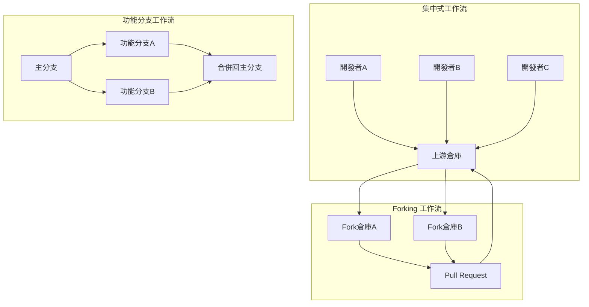
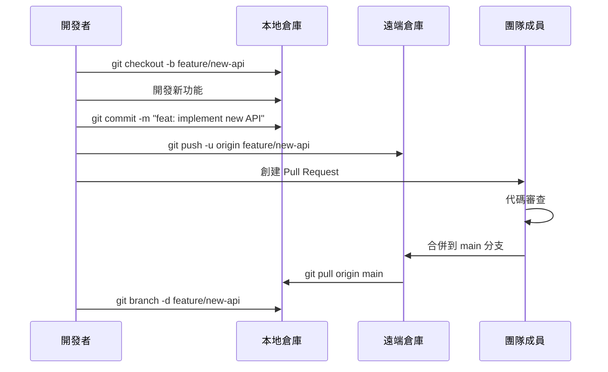
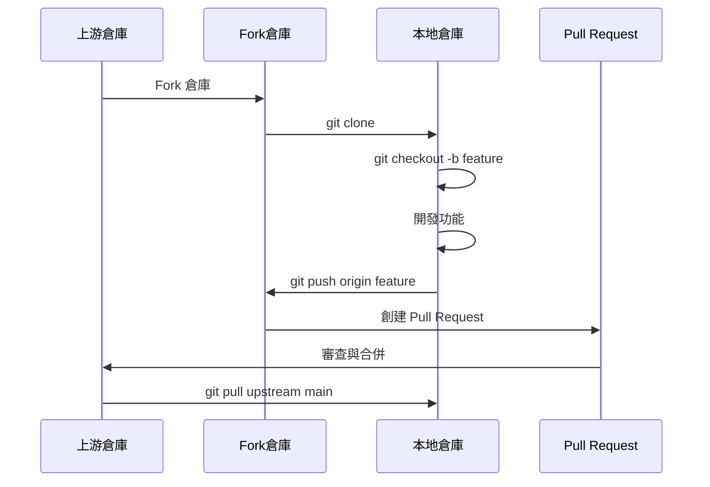

# Git 協作開發工作流程

## 1. 團隊協作模式概覽

### 1.1 協作模式比較



### 1.2 選擇合適的工作流程

| 工作流程        | 適用場景       | 優點        | 缺點     |
| ----------- | ---------- | --------- | ------ |
| 集中式         | 小團隊、SVN遷移  | 簡單易懂      | 容易產生衝突 |
| 功能分支        | 中型團隊、敏捷開發  | 隔離功能、並行開發 | 需要分支管理 |
| Git Flow    | 定期發布、複雜專案  | 結構化流程     | 複雜度高   |
| GitHub Flow | 持續部署、Web應用 | 簡單快速      | 需要良好測試 |
| Forking     | 開源專案、大型團隊  | 權限控制好     | 同步複雜   |

## 2. 功能分支工作流程

### 2.1 標準功能分支流程



### 2.2 實際團隊協作案例

#### 場景：電商平台團隊開發用戶管理系統

```bash
# 項目經理設置專案
mkdir team-ecommerce && cd team-ecommerce
git init
git checkout -b main

# 創建基礎專案結構
cat > README.md << 'EOF'
# 電商平台

## 功能模組
- [ ] 用戶管理系統
- [ ] 商品管理系統  
- [ ] 訂單處理系統
- [ ] 支付系統

## 開發規範
- 使用功能分支工作流
- 每個功能必須通過代碼審查
- 提交訊息遵循 Conventional Commits
EOF

mkdir -p src/{users,products,orders,payments}
mkdir -p tests/{unit,integration}
touch src/app.js package.json

git add .
git commit -m "feat: initial project setup"
git remote add origin https://github.com/company/team-ecommerce.git
git push -u origin main
```

#### 開發者A：實施用戶註冊功能

```bash
# 開發者A克隆專案
git clone https://github.com/company/team-ecommerce.git
cd team-ecommerce

# 創建功能分支
git checkout -b feature/user-registration

# 實施用戶註冊
cat > src/users/userService.js << 'EOF'
const bcrypt = require('bcrypt');
const validator = require('validator');

class UserService {
  async registerUser(userData) {
    const { email, password, firstName, lastName } = userData;
    
    // 驗證輸入資料
    if (!validator.isEmail(email)) {
      throw new Error('Invalid email format');
    }
    
    if (password.length < 8) {
      throw new Error('Password must be at least 8 characters');
    }
    
    // 檢查用戶是否已存在
    const existingUser = await this.findUserByEmail(email);
    if (existingUser) {
      throw new Error('User already exists');
    }
    
    // 加密密碼
    const hashedPassword = await bcrypt.hash(password, 12);
    
    // 創建用戶
    const newUser = {
      email,
      password: hashedPassword,
      firstName,
      lastName,
      createdAt: new Date(),
      isActive: true
    };
    
    return await this.saveUser(newUser);
  }
  
  async findUserByEmail(email) {
    // 數據庫查詢邏輯
    return null; // 暫時返回 null
  }
  
  async saveUser(userData) {
    // 保存用戶到數據庫
    return { id: Date.now(), ...userData };
  }
}

module.exports = UserService;
EOF

# 創建API路由
cat > src/users/userRoutes.js << 'EOF'
const express = require('express');
const UserService = require('./userService');

const router = express.Router();
const userService = new UserService();

router.post('/register', async (req, res) => {
  try {
    const user = await userService.registerUser(req.body);
    const { password, ...userResponse } = user;
    res.status(201).json({
      success: true,
      message: 'User registered successfully',
      data: userResponse
    });
  } catch (error) {
    res.status(400).json({
      success: false,
      message: error.message
    });
  }
});

module.exports = router;
EOF

# 添加測試
cat > tests/unit/userService.test.js << 'EOF'
const UserService = require('../../src/users/userService');

describe('UserService', () => {
  let userService;
  
  beforeEach(() => {
    userService = new UserService();
  });
  
  test('should register user with valid data', async () => {
    const userData = {
      email: 'test@example.com',
      password: 'password123',
      firstName: 'John',
      lastName: 'Doe'
    };
    
    const result = await userService.registerUser(userData);
    
    expect(result.email).toBe(userData.email);
    expect(result.password).not.toBe(userData.password); // 應該被加密
    expect(result.id).toBeDefined();
  });
  
  test('should reject invalid email', async () => {
    const userData = {
      email: 'invalid-email',
      password: 'password123',
      firstName: 'John',
      lastName: 'Doe'
    };
    
    await expect(userService.registerUser(userData))
      .rejects.toThrow('Invalid email format');
  });
  
  test('should reject short password', async () => {
    const userData = {
      email: 'test@example.com',
      password: '123',
      firstName: 'John',
      lastName: 'Doe'
    };
    
    await expect(userService.registerUser(userData))
      .rejects.toThrow('Password must be at least 8 characters');
  });
});
EOF

# 提交變更
git add .
git commit -m "feat: implement user registration functionality

- Add UserService with registration logic
- Include email and password validation  
- Add password hashing with bcrypt
- Create REST API endpoint for registration
- Add comprehensive unit tests
- Handle duplicate user registration"

git push -u origin feature/user-registration
```

#### 開發者B：同時開發用戶登入功能

```bash
# 開發者B同時進行開發
git checkout main
git pull origin main
git checkout -b feature/user-authentication

# 實施登入功能
cat > src/users/authService.js << 'EOF'
const bcrypt = require('bcrypt');
const jwt = require('jsonwebtoken');

class AuthService {
  constructor(userService) {
    this.userService = userService;
    this.jwtSecret = process.env.JWT_SECRET || 'your-secret-key';
  }
  
  async login(email, password) {
    // 查找用戶
    const user = await this.userService.findUserByEmail(email);
    if (!user) {
      throw new Error('Invalid email or password');
    }
    
    // 驗證密碼
    const isPasswordValid = await bcrypt.compare(password, user.password);
    if (!isPasswordValid) {
      throw new Error('Invalid email or password');
    }
    
    // 檢查用戶狀態
    if (!user.isActive) {
      throw new Error('Account is disabled');
    }
    
    // 生成 JWT Token
    const token = jwt.sign(
      { 
        userId: user.id, 
        email: user.email 
      },
      this.jwtSecret,
      { expiresIn: '24h' }
    );
    
    return {
      token,
      user: {
        id: user.id,
        email: user.email,
        firstName: user.firstName,
        lastName: user.lastName
      }
    };
  }
  
  async verifyToken(token) {
    try {
      const decoded = jwt.verify(token, this.jwtSecret);
      return decoded;
    } catch (error) {
      throw new Error('Invalid or expired token');
    }
  }
}

module.exports = AuthService;
EOF

# 添加認證中間件
cat > src/users/authMiddleware.js << 'EOF'
const AuthService = require('./authService');

const authMiddleware = (req, res, next) => {
  const token = req.headers.authorization?.split(' ')[1];
  
  if (!token) {
    return res.status(401).json({
      success: false,
      message: 'Access token required'
    });
  }
  
  try {
    const authService = new AuthService();
    const decoded = authService.verifyToken(token);
    req.user = decoded;
    next();
  } catch (error) {
    return res.status(401).json({
      success: false,
      message: 'Invalid or expired token'
    });
  }
};

module.exports = authMiddleware;
EOF

# 添加登入路由
cat >> src/users/userRoutes.js << 'EOF'

const AuthService = require('./authService');
const authService = new AuthService(userService);

router.post('/login', async (req, res) => {
  try {
    const { email, password } = req.body;
    const result = await authService.login(email, password);
    
    res.json({
      success: true,
      message: 'Login successful',
      data: result
    });
  } catch (error) {
    res.status(401).json({
      success: false,
      message: error.message
    });
  }
});
EOF

# 提交登入功能
git add .
git commit -m "feat: implement user authentication system

- Add JWT-based authentication service
- Include login functionality with password verification
- Add authentication middleware for protected routes
- Generate secure JWT tokens with expiration
- Handle account status validation"

git push -u origin feature/user-authentication
```

#### 整合兩個功能分支

```bash
# 開發者A的註冊功能先完成代碼審查並合併
git checkout main
git pull origin main
git merge --no-ff feature/user-registration
git push origin main

# 開發者B需要整合最新的主分支
git checkout feature/user-authentication
git pull origin main  # 獲取最新的註冊功能

# 解決可能的衝突並調整代碼
# 修改 AuthService 以使用新的 UserService
cat > src/users/authService.js << 'EOF'
const bcrypt = require('bcrypt');
const jwt = require('jsonwebtoken');
const UserService = require('./userService');

class AuthService {
  constructor() {
    this.userService = new UserService();
    this.jwtSecret = process.env.JWT_SECRET || 'your-secret-key';
  }
  
  async login(email, password) {
    // 使用 UserService 查找用戶
    const user = await this.userService.findUserByEmail(email);
    if (!user) {
      throw new Error('Invalid email or password');
    }
    
    // 驗證密碼
    const isPasswordValid = await bcrypt.compare(password, user.password);
    if (!isPasswordValid) {
      throw new Error('Invalid email or password');
    }
    
    // 檢查用戶狀態
    if (!user.isActive) {
      throw new Error('Account is disabled');
    }
    
    // 生成 JWT Token
    const token = jwt.sign(
      { 
        userId: user.id, 
        email: user.email 
      },
      this.jwtSecret,
      { expiresIn: '24h' }
    );
    
    return {
      token,
      user: {
        id: user.id,
        email: user.email,
        firstName: user.firstName,
        lastName: user.lastName
      }
    };
  }
  
  async verifyToken(token) {
    try {
      const decoded = jwt.verify(token, this.jwtSecret);
      return decoded;
    } catch (error) {
      throw new Error('Invalid or expired token');
    }
  }
}

module.exports = AuthService;
EOF

git add .
git commit -m "feat: integrate authentication with user registration

- Update AuthService to use UserService
- Ensure compatibility with registration functionality
- Maintain consistent user data structure"

git push origin feature/user-authentication

# 第二個功能也完成審查並合併
git checkout main
git pull origin main
git merge --no-ff feature/user-authentication
git push origin main

# 清理完成的分支
git branch -d feature/user-registration
git branch -d feature/user-authentication
git push origin --delete feature/user-registration
git push origin --delete feature/user-authentication
```

## 3. Fork 工作流程

### 3.1 Fork 工作流程圖



### 3.2 開源專案貢獻流程

#### 場景：為開源JavaScript框架貢獻功能

```bash
# 1. Fork 上游倉庫（通過 GitHub 界面）
# 假設上游倉庫：https://github.com/awesome-org/awesome-framework.git
# Fork 後的倉庫：https://github.com/yourname/awesome-framework.git

# 2. 克隆你的 Fork
git clone https://github.com/yourname/awesome-framework.git
cd awesome-framework

# 3. 添加上游倉庫
git remote add upstream https://github.com/awesome-org/awesome-framework.git
git remote -v
# 輸出：
# origin    https://github.com/yourname/awesome-framework.git (fetch)
# origin    https://github.com/yourname/awesome-framework.git (push)
# upstream  https://github.com/awesome-org/awesome-framework.git (fetch)
# upstream  https://github.com/awesome-org/awesome-framework.git (push)

# 4. 同步上游最新變更
git fetch upstream
git checkout main
git merge upstream/main
git push origin main

# 5. 創建功能分支
git checkout -b feature/add-async-validation

# 6. 實施新功能
cat > src/validators/asyncValidator.js << 'EOF'
/**
 * 異步驗證器
 * 支持 Promise-based 驗證邏輯
 */
class AsyncValidator {
  constructor() {
    this.rules = new Map();
  }
  
  /**
   * 添加異步驗證規則
   * @param {string} field - 欄位名稱
   * @param {Function} validator - 異步驗證函數
   */
  addRule(field, validator) {
    if (!this.rules.has(field)) {
      this.rules.set(field, []);
    }
    this.rules.get(field).push(validator);
  }
  
  /**
   * 驗證資料
   * @param {Object} data - 待驗證的資料
   * @returns {Promise<Object>} 驗證結果
   */
  async validate(data) {
    const results = {};
    const errors = {};
    
    for (const [field, validators] of this.rules) {
      const value = data[field];
      
      for (const validator of validators) {
        try {
          const result = await validator(value, data);
          if (result !== true) {
            if (!errors[field]) {
              errors[field] = [];
            }
            errors[field].push(result);
          }
        } catch (error) {
          if (!errors[field]) {
            errors[field] = [];
          }
          errors[field].push(error.message);
        }
      }
    }
    
    return {
      isValid: Object.keys(errors).length === 0,
      errors
    };
  }
}

module.exports = AsyncValidator;
EOF

# 7. 添加測試
cat > tests/asyncValidator.test.js << 'EOF'
const AsyncValidator = require('../src/validators/asyncValidator');

describe('AsyncValidator', () => {
  let validator;
  
  beforeEach(() => {
    validator = new AsyncValidator();
  });
  
  test('should validate with async rules', async () => {
    // 模擬異步檢查用戶名是否存在
    validator.addRule('username', async (value) => {
      return new Promise((resolve) => {
        setTimeout(() => {
          if (value === 'existinguser') {
            resolve('Username already exists');
          } else {
            resolve(true);
          }
        }, 100);
      });
    });
    
    const result1 = await validator.validate({ username: 'newuser' });
    expect(result1.isValid).toBe(true);
    
    const result2 = await validator.validate({ username: 'existinguser' });
    expect(result2.isValid).toBe(false);
    expect(result2.errors.username[0]).toBe('Username already exists');
  });
  
  test('should handle multiple async rules', async () => {
    validator.addRule('email', async (value) => {
      if (!value.includes('@')) {
        return 'Invalid email format';
      }
      return true;
    });
    
    validator.addRule('email', async (value) => {
      // 模擬檢查郵箱是否已註冊
      return new Promise((resolve) => {
        setTimeout(() => {
          if (value === 'taken@example.com') {
            resolve('Email already registered');
          } else {
            resolve(true);
          }
        }, 50);
      });
    });
    
    const result = await validator.validate({ 
      email: 'taken@example.com' 
    });
    
    expect(result.isValid).toBe(false);
    expect(result.errors.email).toContain('Email already registered');
  });
});
EOF

# 8. 更新文檔
cat >> README.md << 'EOF'

## 異步驗證

框架現在支持異步驗證功能：

```javascript
const AsyncValidator = require('./src/validators/asyncValidator');

const validator = new AsyncValidator();

// 添加異步驗證規則
validator.addRule('username', async (value) => {
  const exists = await checkUsernameExists(value);
  return exists ? 'Username already taken' : true;
});

// 執行驗證
const result = await validator.validate({ username: 'john' });
if (!result.isValid) {
  console.log('Validation errors:', result.errors);
}
```

# 9. 提交變更
```
git add .
git commit -m "feat: add async validation support

- Implement AsyncValidator class for Promise-based validation
- Support multiple async rules per field
- Add comprehensive test coverage
- Update documentation with usage examples

Fixes #123"

# 10. 推送到你的 Fork
git push -u origin feature/add-async-validation

# 11. 創建 Pull Request（通過 GitHub 界面）
echo "功能完成，請到 GitHub 創建 Pull Request"
```

### 3.3 維護 Fork 同步

```bash
# 定期同步上游變更
git fetch upstream
git checkout main
git merge upstream/main

# 如果你的主分支有修改，使用 rebase
git rebase upstream/main

# 推送更新到你的 Fork
git push origin main

# 更新功能分支（如果還在開發中）
git checkout feature/add-async-validation
git rebase main
```

## 4. 代碼審查流程

### 4.1 Pull Request 最佳實踐

#### 創建高質量的 Pull Request

```bash
# 1. 確保分支是最新的
git checkout feature/user-profile-api
git pull origin main
git rebase main

# 2. 運行測試和檢查
npm test
npm run lint
npm run type-check

# 3. 清理提交歷史
git rebase -i HEAD~3
# 將多個相關提交合併為邏輯單元

# 4. 推送最終版本
git push --force-with-lease origin feature/user-profile-api
```

#### Pull Request 描述模板

```markdown
## 變更摘要
簡要描述這個 PR 的主要變更和目的。

## 變更類型
- [ ] Bug 修復
- [ ] 新功能
- [ ] 重構
- [ ] 文檔更新
- [ ] 性能改進

## 詳細說明
### 問題描述
描述要解決的問題或需求。

### 解決方案
說明你的實施方法和重要的設計決策。

### 影響範圍
- 影響的模組：
- 是否有破壞性變更：
- 性能影響：

## 測試
- [ ] 添加了新的測試
- [ ] 所有現有測試通過
- [ ] 手動測試完成

### 測試步驟
1. 步驟一
2. 步驟二
3. 步驟三

## 檢查清單
- [ ] 代碼遵循項目風格指南
- [ ] 自我審查已完成
- [ ] 文檔已更新
- [ ] 沒有調試代碼或console.log
- [ ] 提交訊息遵循約定

## 相關 Issues
Closes #123
Related to #456

## 截圖（如果適用）
貼上相關的截圖或GIF。
```

### 4.2 代碼審查指南

#### 審查者檢查清單

```bash
# 1. 檢出 PR 分支進行本地測試
git fetch origin pull/123/head:pr-123
git checkout pr-123

# 2. 運行測試套件
npm install
npm test
npm run e2e-test

# 3. 檢查代碼質量
npm run lint
npm run security-audit

# 4. 手動測試功能
# 根據 PR 描述中的測試步驟進行驗證
```

#### 審查評論範例

```
# 建設性的反饋
👍 這個實施很優雅，很好地處理了邊界情況。

🤔 考慮點：
這裡的錯誤處理可以更具體一些，建議捕獲特定的錯誤類型。

💡 建議：
可以考慮使用策略模式來處理不同的驗證規則。

❓ 問題：
這個方法的時間複雜度是多少？在大數據量下是否會有性能問題？

🐛 問題：
第42行可能會導致空指針異常，建議添加null檢查。

✅ 批准：
代碼質量很高，測試覆蓋完整，可以合併。
```

## 5. 持續整合工作流程

### 5.1 GitHub Actions 工作流程

```yaml
# .github/workflows/ci.yml
name: CI/CD Pipeline

on:
  push:
    branches: [ main, develop ]
  pull_request:
    branches: [ main ]

jobs:
  test:
    runs-on: ubuntu-latest
    
    strategy:
      matrix:
        node-version: [16.x, 18.x, 20.x]
    
    steps:
    - uses: actions/checkout@v3
    
    - name: Use Node.js ${{ matrix.node-version }}
      uses: actions/setup-node@v3
      with:
        node-version: ${{ matrix.node-version }}
        cache: 'npm'
    
    - name: Install dependencies
      run: npm ci
    
    - name: Run linter
      run: npm run lint
    
    - name: Run type check
      run: npm run type-check
    
    - name: Run tests
      run: npm test -- --coverage
    
    - name: Upload coverage to Codecov
      uses: codecov/codecov-action@v3
      with:
        file: ./coverage/lcov.info
    
    - name: Run integration tests
      run: npm run test:integration
      env:
        NODE_ENV: test

  security:
    runs-on: ubuntu-latest
    steps:
    - uses: actions/checkout@v3
    
    - name: Run security audit
      run: npm audit --audit-level high
    
    - name: Run Snyk security scan
      uses: snyk/actions/node@master
      env:
        SNYK_TOKEN: ${{ secrets.SNYK_TOKEN }}

  build:
    needs: [test, security]
    runs-on: ubuntu-latest
    
    steps:
    - uses: actions/checkout@v3
    
    - name: Setup Node.js
      uses: actions/setup-node@v3
      with:
        node-version: '18.x'
        cache: 'npm'
    
    - name: Install dependencies
      run: npm ci
    
    - name: Build application
      run: npm run build
    
    - name: Archive build artifacts
      uses: actions/upload-artifact@v3
      with:
        name: build-files
        path: dist/
```

### 5.2 分支保護規則

```bash
# 通過 GitHub CLI 設置分支保護
gh api repos/:owner/:repo/branches/main/protection \
  --method PUT \
  --field required_status_checks='{"strict":true,"contexts":["test","security","build"]}' \
  --field enforce_admins=true \
  --field required_pull_request_reviews='{"required_approving_review_count":2,"dismiss_stale_reviews":true}' \
  --field restrictions=null
```

## 6. 衝突解決與協作

### 6.1 預防衝突的策略

```bash
# 1. 頻繁同步主分支
git fetch origin
git rebase origin/main

# 2. 小而頻繁的提交
git add src/components/UserCard.js
git commit -m "feat: add user avatar display"

git add src/components/UserCard.css  
git commit -m "style: add user card styling"

# 3. 提早推送分支
git push -u origin feature/user-card

# 4. 及時合併已完成的功能
```

### 6.2 處理複雜衝突

```bash
# 場景：多人修改同一個核心檔案
git checkout feature/api-refactor
git rebase main
# 輸出：
# CONFLICT (content): Merge conflict in src/api/userController.js

# 使用 VS Code 或其他工具解決衝突
code src/api/userController.js

# 衝突檔案內容：
```
```javascript
class UserController {
<<<<<<< HEAD
  async getUser(req, res) {
    // 主分支的實現
    const user = await User.findById(req.params.id);
    res.json(user);
  }
=======
  async getUser(req, res) {
    // 功能分支的實現
    const user = await User.findById(req.params.id).populate('profile');
    res.json({ success: true, data: user });
  }
>>>>>>> feature/api-refactor
}
```

```bash
# 手動合併最佳實現
cat > src/api/userController.js << 'EOF'
class UserController {
  async getUser(req, res) {
    try {
      const user = await User.findById(req.params.id).populate('profile');
      if (!user) {
        return res.status(404).json({ 
          success: false, 
          message: 'User not found' 
        });
      }
      res.json({ success: true, data: user });
    } catch (error) {
      res.status(500).json({ 
        success: false, 
        message: error.message 
      });
    }
  }
}
EOF

# 標記衝突已解決
git add src/api/userController.js
git rebase --continue

# 推送解決後的分支
git push --force-with-lease origin feature/api-refactor
```

## 7. 團隊協作最佳實踐

### 7.1 溝通與協調

```bash
# 1. 使用描述性的分支名稱
git checkout -b feature/user-authentication-jwt
git checkout -b hotfix/security-xss-vulnerability
git checkout -b refactor/database-connection-pool

# 2. 提交訊息遵循約定
git commit -m "feat(auth): implement JWT token validation

- Add JWT middleware for route protection
- Include token expiration handling  
- Add refresh token mechanism
- Update API documentation

Closes #234"

# 3. 定期代碼同步
# 每日開始工作前
git checkout main
git pull origin main
git checkout feature/current-work
git rebase main

# 4. 功能完成前的最終檢查
npm run test:all
npm run lint:fix
git log --oneline feature/current-work ^main  # 查看將要合併的提交
```

### 7.2 發布管理

```bash
# 語義化版本發布流程
git checkout main
git pull origin main

# 創建發布分支
git checkout -b release/v2.1.0

# 更新版本號
npm version minor  # 2.0.0 -> 2.1.0

# 生成變更日誌
git log --oneline v2.0.0..HEAD --pretty=format:"- %s (%an)" > CHANGELOG_TEMP.md

# 手動整理變更日誌
cat >> CHANGELOG.md << 'EOF'
# v2.1.0 (2024-01-15)

## 新功能
- feat: 添加用戶檔案管理功能
- feat: 實現訂單狀態追蹤

## 改進
- perf: 優化數據庫查詢性能
- style: 更新UI組件設計

## 修復
- fix: 修復登入狀態持久化問題
- fix: 解決支付回調處理錯誤
EOF

# 提交發布準備
git add .
git commit -m "chore: prepare release v2.1.0"

# 合併到主分支並打標籤
git checkout main
git merge --no-ff release/v2.1.0
git tag -a v2.1.0 -m "Release version 2.1.0"

# 推送到遠端
git push origin main
git push origin v2.1.0

# 清理發布分支
git branch -d release/v2.1.0
```

## 8. 實戰案例：大型團隊協作

### 微服務項目的 Git 工作流程

```bash
# 場景：15人團隊開發微服務電商平台
# 服務架構：用戶服務、商品服務、訂單服務、支付服務、通知服務

# 項目結構設置
mkdir microservices-ecommerce && cd microservices-ecommerce
git init

# 創建 monorepo 結構
mkdir -p services/{user,product,order,payment,notification}
mkdir -p shared/{utils,types,configs}
mkdir -p infrastructure/{docker,k8s,scripts}

# 設置主分支和開發分支
git checkout -b main
git add .
git commit -m "feat: initial monorepo structure for microservices"

git checkout -b develop
git push -u origin main
git push -u origin develop

# 團隊A：用戶服務團隊（3人）
git checkout develop
git checkout -b feature/user-service-v2

# 實施用戶服務新版本
cat > services/user/userService.js << 'EOF'
// 用戶服務 v2.0 - 支持多租戶架構
class UserServiceV2 {
  constructor(tenantId) {
    this.tenantId = tenantId;
    this.cache = new Redis({ keyPrefix: `tenant:${tenantId}:` });
  }
  
  async createUser(userData) {
    // 多租戶用戶創建邏輯
    const user = {
      ...userData,
      tenantId: this.tenantId,
      id: generateTenantScopedId(this.tenantId)
    };
    
    await this.saveUser(user);
    await this.cache.set(`user:${user.id}`, JSON.stringify(user));
    
    return user;
  }
}
EOF

# 團隊B：訂單服務團隊（4人）
git checkout develop
git checkout -b feature/order-service-saga

# 實施分散式事務處理
cat > services/order/sagaOrchestrator.js << 'EOF'
// 訂單處理的 Saga 模式實現
class OrderSagaOrchestrator {
  async processOrder(orderData) {
    const sagaId = generateSagaId();
    
    try {
      // 步驟1：驗證商品庫存
      await this.reserveInventory(orderData.items, sagaId);
      
      // 步驟2：處理支付
      await this.processPayment(orderData.payment, sagaId);
      
      // 步驟3：創建訂單
      const order = await this.createOrder(orderData, sagaId);
      
      // 步驟4：發送通知
      await this.sendNotification(order, sagaId);
      
      return order;
    } catch (error) {
      // 執行補償事務
      await this.compensate(sagaId, error);
      throw error;
    }
  }
}
EOF

# 各團隊並行開發，定期整合
# 每週三進行功能分支整合
git checkout develop
git merge --no-ff feature/user-service-v2
git merge --no-ff feature/order-service-saga

# 處理服務間的依賴更新
git checkout feature/order-service-saga
git rebase develop  # 獲取用戶服務的最新接口

# 最終發布準備
git checkout develop
git checkout -b release/v3.0.0

# 運行完整的整合測試
npm run test:integration:all-services
npm run test:e2e:critical-flows

# 部署到預發布環境
docker-compose -f docker-compose.staging.yml up -d
npm run test:smoke:staging

# 發布到生產環境
git checkout main
git merge --no-ff release/v3.0.0
git tag -a v3.0.0 -m "Release v3.0.0: Multi-tenant microservices architecture"
git push origin main --tags
```

## 9. 總結與最佳實踐

### 協作開發核心原則

1. **分支策略一致性**：團隊成員遵循相同的分支命名和工作流程
2. **小而頻繁的提交**：保持提交的原子性和可讀性
3. **及時溝通**：在衝突發生前主動溝通變更範圍
4. **代碼審查**：所有代碼變更都應經過同行審查
5. **自動化測試**：確保每個變更都通過完整的測試套件

### 下一步學習

完成本章後，你應該掌握：
- 不同協作模式的適用場景
- Fork 工作流程的完整實施
- 代碼審查的最佳實踐
- 衝突解決和預防策略
- 團隊發布管理流程

**下一章將學習**：Git 進階操作與疑難排解，包括複雜情況的處理和性能優化。