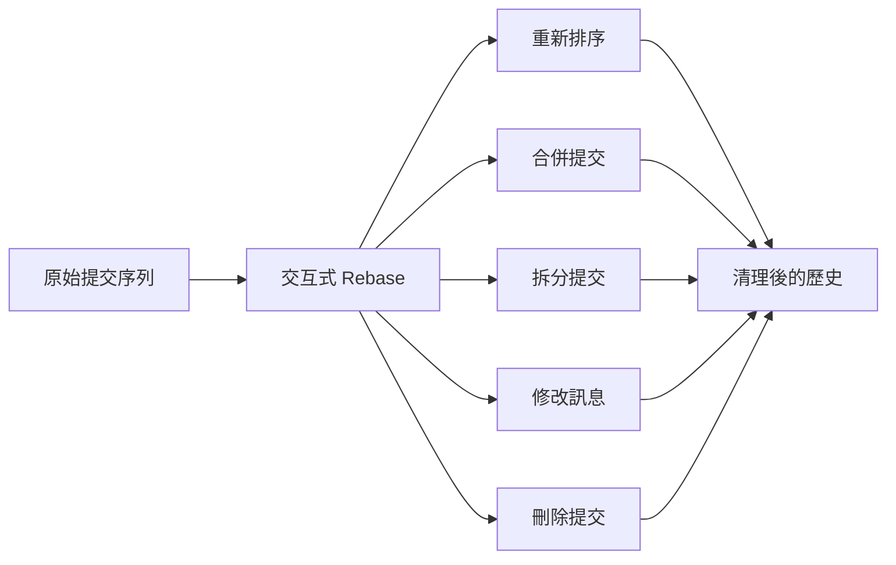
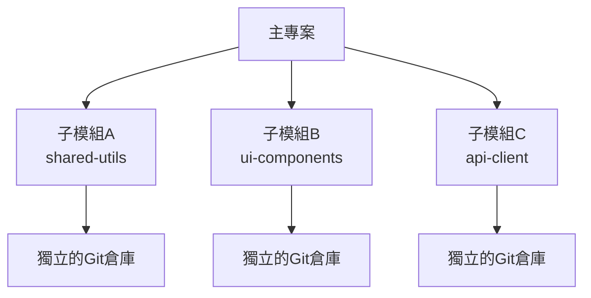

# Git 進階操作與疑難排解

## 1. Git 進階重寫歷史

### 1.1 交互式 Rebase 深度應用



#### 實際案例：清理功能開發歷史

```bash
# 場景：開發購物車功能時產生了混亂的提交歷史
git log --oneline
# 輸出：
# a1b2c3d Add cart component
# b2c3d4e Fix typo in cart
# c3d4e5f Add cart styling
# d4e5f6g Debug console.log  
# e5f6g7h Remove debug code
# f6g7h8i Add cart validation
# g7h8i9j Fix validation bug
# h8i9j0k Add cart tests
# i9j0k1l WIP: cart persistence
# j0k1l2m Complete cart persistence

# 使用交互式 rebase 清理歷史
git rebase -i HEAD~10

# 在編輯器中調整：
# pick a1b2c3d Add cart component
# squash b2c3d4e Fix typo in cart
# pick c3d4e5f Add cart styling  
# drop d4e5f6g Debug console.log
# drop e5f6g7h Remove debug code
# pick f6g7h8i Add cart validation
# squash g7h8i9j Fix validation bug
# pick h8i9j0k Add cart tests
# squash i9j0k1l WIP: cart persistence
# squash j0k1l2m Complete cart persistence

# 結果：10個提交變成4個乾淨的提交
git log --oneline
# 輸出：
# k1l2m3n Add cart persistence functionality
# h8i9j0k Add cart tests
# f6g7h8i Add cart validation
# c3d4e5f Add cart styling
# a1b2c3d Add cart component
```

### 1.2 拆分提交

```bash
# 場景：一個提交包含了太多不相關的變更
git log --oneline
# 輸出：
# a1b2c3d Add user auth and email validation

# 拆分這個提交
git rebase -i HEAD~1
# 將 "pick" 改為 "edit"

# 重置到上一個提交，保留變更在工作目錄
git reset HEAD~1

# 查看所有變更
git status
# 輸出：
# Changes not staged for commit:
#   modified:   src/auth/authService.js
#   modified:   src/utils/emailValidator.js
#   modified:   src/components/LoginForm.js

# 分別提交相關變更
git add src/auth/authService.js src/components/LoginForm.js
git commit -m "feat: implement user authentication system

- Add JWT-based authentication service
- Create login form component with validation
- Include session management"

git add src/utils/emailValidator.js
git commit -m "feat: add email validation utility

- Implement comprehensive email format validation
- Support custom validation rules
- Add internalization support"

# 完成 rebase
git rebase --continue
```

### 1.3 修改歷史中的特定提交

```bash
# 場景：需要修改3個提交之前的提交內容
git log --oneline
# 輸出：
# d4e5f6g Latest feature
# c3d4e5f Bug fix
# b2c3d4e Performance improvement
# a1b2c3d Security patch (需要修改這個)
# z9a0b1c Previous commits...

# 使用 rebase 修改特定提交
git rebase -i a1b2c3d~1

# 將要修改的提交標記為 "edit"
# edit a1b2c3d Security patch
# pick b2c3d4e Performance improvement
# pick c3d4e5f Bug fix  
# pick d4e5f6g Latest feature

# Git 會停在要修改的提交
# 進行必要的修改
echo "// Additional security measures" >> src/security.js
git add src/security.js

# 修改提交（--amend 會修改當前提交）
git commit --amend -m "security: enhance authentication security

- Add additional password complexity requirements
- Implement rate limiting for login attempts
- Add security logging for failed attempts"

# 繼續 rebase
git rebase --continue
```

## 2. Git 子模組管理

### 2.1 子模組基本操作



#### 實際場景：微前端架構中的子模組管理

```bash
# 主應用專案設置
mkdir micro-frontend-app && cd micro-frontend-app
git init

# 添加共享工具庫作為子模組
git submodule add https://github.com/company/shared-utils.git libs/shared-utils

# 添加UI組件庫
git submodule add https://github.com/company/ui-components.git libs/ui-components

# 添加API客戶端
git submodule add https://github.com/company/api-client.git libs/api-client

# 查看子模組狀態
git submodule status
# 輸出：
# -a1b2c3d4 libs/shared-utils (v1.2.0)
# -b2c3d4e5 libs/ui-components (v2.1.0)  
# -c3d4e5f6 libs/api-client (v1.0.3)

# 提交子模組配置
git add .
git commit -m "feat: add core library submodules

- Add shared-utils for common functionality
- Add ui-components for consistent UI
- Add api-client for backend communication"

# 創建使用子模組的應用代碼
cat > src/app.js << 'EOF'
// 使用子模組中的功能
import { validateEmail, formatDate } from '../libs/shared-utils/src/utils';
import { Button, Modal } from '../libs/ui-components/src/components';
import { UserAPI } from '../libs/api-client/src/api';

class App {
  constructor() {
    this.userAPI = new UserAPI();
  }
  
  async handleLogin(email, password) {
    if (!validateEmail(email)) {
      return { error: 'Invalid email format' };
    }
    
    const result = await this.userAPI.login({ email, password });
    return result;
  }
}

export default App;
EOF
```

### 2.2 子模組更新和同步

```bash
# 更新所有子模組到最新版本
git submodule update --remote

# 更新特定子模組
git submodule update --remote libs/shared-utils

# 初始化新克隆的專案的子模組
git clone https://github.com/company/micro-frontend-app.git
cd micro-frontend-app
git submodule init
git submodule update
# 或一步完成：
git clone --recurse-submodules https://github.com/company/micro-frontend-app.git

# 在子模組中進行開發
cd libs/shared-utils
git checkout -b feature/new-validation-rules

# 添加新功能
cat >> src/utils/validation.js << 'EOF'

export function validatePhoneNumber(phone) {
  const phoneRegex = /^\+?[\d\s\-\(\)]+$/;
  return phoneRegex.test(phone) && phone.replace(/\D/g, '').length >= 10;
}
EOF

git add .
git commit -m "feat: add phone number validation utility"
git push -u origin feature/new-validation-rules

# 回到主專案更新子模組引用
cd ../..
git add libs/shared-utils
git commit -m "update: shared-utils to include phone validation"
```

### 2.3 子模組的高級管理

```bash
# 設置子模組跟蹤特定分支
git config -f .gitmodules submodule.libs/shared-utils.branch develop
git submodule update --remote

# 在主專案中執行子模組的命令
git submodule foreach 'git status'
git submodule foreach 'git pull origin main'

# 移除子模組
git submodule deinit libs/api-client
git rm libs/api-client
rm -rf .git/modules/libs/api-client

# 子模組的條件更新腳本
cat > scripts/update-submodules.sh << 'EOF'
#!/bin/bash

echo "Updating submodules..."

# 檢查每個子模組的更新
for submodule in $(git submodule status | awk '{print $2}'); do
    echo "Checking $submodule..."
    
    cd $submodule
    
    # 檢查是否有本地修改
    if ! git diff-index --quiet HEAD --; then
        echo "Warning: $submodule has local changes, skipping update"
        cd - > /dev/null
        continue
    fi
    
    # 拉取最新變更
    git pull origin main
    cd - > /dev/null
    
    # 更新主專案中的子模組引用
    git add $submodule
done

git commit -m "chore: update submodules to latest versions"
echo "Submodules updated successfully!"
EOF

chmod +x scripts/update-submodules.sh
```

## 3. Git Hooks 和自動化

### 3.1 客戶端 Hooks

```bash
# pre-commit hook：提交前檢查
cat > .git/hooks/pre-commit << 'EOF'
#!/bin/bash

echo "Running pre-commit checks..."

# 1. 檢查代碼風格
echo "Checking code style..."
npm run lint
if [ $? -ne 0 ]; then
    echo "❌ Lint check failed. Please fix the issues before committing."
    exit 1
fi

# 2. 運行單元測試
echo "Running unit tests..."
npm run test:unit
if [ $? -ne 0 ]; then
    echo "❌ Unit tests failed. Please fix the tests before committing."
    exit 1
fi

# 3. 檢查是否有調試代碼
echo "Checking for debug code..."
if git diff --cached --name-only | xargs grep -l "console.log\|debugger\|TODO:" > /dev/null; then
    echo "❌ Found debug code or TODOs in staged files:"
    git diff --cached --name-only | xargs grep -n "console.log\|debugger\|TODO:"
    echo "Please remove debug code before committing."
    exit 1
fi

# 4. 檢查機密信息
echo "Checking for secrets..."
if git diff --cached --name-only | xargs grep -l "password\s*=\|api_key\|secret_key" > /dev/null; then
    echo "⚠️  Warning: Potential secrets found in staged files:"
    git diff --cached --name-only | xargs grep -n "password\s*=\|api_key\|secret_key"
    read -p "Are you sure you want to commit? (y/N): " -n 1 -r
    echo
    if [[ ! $REPLY =~ ^[Yy]$ ]]; then
        exit 1
    fi
fi

echo "✅ Pre-commit checks passed!"
EOF

chmod +x .git/hooks/pre-commit
```

### 3.2 commit-msg hook：提交訊息驗證

```bash
# commit-msg hook：驗證提交訊息格式
cat > .git/hooks/commit-msg << 'EOF'
#!/bin/bash

commit_regex='^(feat|fix|docs|style|refactor|test|chore)(\(.+\))?: .{1,50}'

if ! grep -qE "$commit_regex" "$1"; then
    echo "❌ Invalid commit message format!"
    echo ""
    echo "Commit message should follow Conventional Commits format:"
    echo "  type(scope): description"
    echo ""
    echo "Types: feat, fix, docs, style, refactor, test, chore"
    echo "Example: feat(auth): add user login functionality"
    echo ""
    echo "Your commit message:"
    cat "$1"
    exit 1
fi

# 檢查提交訊息長度
title=$(head -n1 "$1")
if [ ${#title} -gt 72 ]; then
    echo "❌ Commit message title too long (${#title} > 72 characters)"
    echo "Title: $title"
    exit 1
fi

echo "✅ Commit message format is valid!"
EOF

chmod +x .git/hooks/commit-msg
```

### 3.3 服務端 Hooks

```bash
# pre-receive hook：服務端推送前檢查
cat > hooks/pre-receive << 'EOF'
#!/bin/bash

# 拒絕推送到受保護的分支
protected_branches="main master production"

while read oldrev newrev refname; do
    branch=$(echo $refname | sed 's/refs\/heads\///')
    
    if [[ "$protected_branches" =~ "$branch" ]]; then
        echo "❌ Direct push to $branch is not allowed!"
        echo "Please create a pull request instead."
        exit 1
    fi
    
    # 檢查強制推送
    if [ "$oldrev" != "0000000000000000000000000000000000000000" ]; then
        if ! git merge-base --is-ancestor $oldrev $newrev; then
            echo "❌ Force push detected and rejected!"
            echo "Force pushes can rewrite history and cause issues for other developers."
            exit 1
        fi
    fi
done

echo "✅ Push validation passed!"
EOF

chmod +x hooks/pre-receive
```

## 4. 大文件處理：Git LFS

### 4.1 Git LFS 設置和使用

```bash
# 安裝 Git LFS
git lfs install

# 追蹤大文件類型
git lfs track "*.psd"           # Photoshop 檔案
git lfs track "*.ai"            # Illustrator 檔案  
git lfs track "*.mov"           # 視頻檔案
git lfs track "*.mp4"           # 視頻檔案
git lfs track "*.zip"           # 壓縮檔案
git lfs track "docs/*.pdf"      # 特定目錄的 PDF

# 查看追蹤的檔案類型
git lfs track
# 輸出：
# Listing tracked patterns
#     *.psd (.gitattributes)
#     *.ai (.gitattributes)
#     *.mov (.gitattributes)
#     *.mp4 (.gitattributes)

# 添加 .gitattributes 到版本控制
git add .gitattributes
git commit -m "chore: configure Git LFS for large files"

# 實際使用案例：添加設計資源
mkdir -p assets/design
# 假設複製了一個大的 PSD 檔案
# cp ~/design/homepage.psd assets/design/

git add assets/design/homepage.psd
git commit -m "feat: add homepage design file"

# LFS 檔案信息
git lfs ls-files
# 輸出：
# a1b2c3d4 * assets/design/homepage.psd

# 查看 LFS 狀態
git lfs status
```

### 4.2 LFS 遷移現有大文件

```bash
# 場景：專案中已有大文件需要遷移到 LFS
git lfs migrate import --include="*.psd,*.ai" --everything

# 遷移特定路徑的檔案
git lfs migrate import --include="assets/videos/*" --everything

# 檢查遷移結果
git lfs ls-files

# 強制推送重寫的歷史（⚠️ 謹慎使用）
git push --force-with-lease --all
git push --force-with-lease --tags
```

### 4.3 LFS 最佳實踐

```bash
# 創建 LFS 清理腳本
cat > scripts/clean-lfs.sh << 'EOF'
#!/bin/bash

echo "Cleaning Git LFS cache..."

# 清理本地 LFS 快取
git lfs prune

# 顯示 LFS 使用情況
echo "LFS storage usage:"
git lfs ls-files -s | awk '{sum+=$1} END {print "Total LFS files size: " sum/1024/1024 " MB"}'

# 檢查 LFS 配置
echo "LFS configuration:"
git lfs env
EOF

chmod +x scripts/clean-lfs.sh

# LFS 預算管理
cat > .lfsconfig << 'EOF'
[lfs]
    # 設置 LFS 服務器 URL（如果使用自定義服務器）
    url = https://lfs.company.com/api/lfs
    
    # 批量傳輸設置
    batch = true
    
    # 並發上傳數量
    concurrenttransfers = 3
EOF
```

## 5. 性能優化和大型倉庫管理

### 5.1 倉庫體積優化

```bash
# 查看倉庫大小
du -sh .git
git count-objects -vH

# 查找大對象
git rev-list --objects --all | \
  git cat-file --batch-check='%(objecttype) %(objectname) %(objectsize) %(rest)' | \
  sed -n 's/^blob //p' | \
  sort --numeric-sort --key=2 | \
  tail -20

# 分析倉庫歷史
git log --oneline --graph --all --decorate | head -50

# 使用 git-sizer 分析倉庫
git-sizer --verbose
```

### 5.2 垃圾回收和清理

```bash
# 進行垃圾回收
git gc --aggressive --prune=now

# 清理未追蹤的檔案
git clean -fd  # 強制刪除未追蹤的檔案和目錄

# 驗證倉庫完整性
git fsck --full

# 重建索引
rm .git/index
git reset

# 優化腳本
cat > scripts/optimize-repo.sh << 'EOF'
#!/bin/bash

echo "Starting repository optimization..."

# 1. 清理工作目錄
echo "Cleaning working directory..."
git clean -fd

# 2. 垃圾回收
echo "Running garbage collection..."
git gc --aggressive --prune=now

# 3. 重打包對象
echo "Repacking objects..."
git repack -ad

# 4. 驗證完整性
echo "Verifying repository integrity..."
git fsck --full

# 5. 顯示優化結果
echo "Optimization complete!"
echo "Repository size:"
du -sh .git

echo "Object count:"
git count-objects -v
EOF

chmod +x scripts/optimize-repo.sh
```

### 5.3 部分克隆和稀疏檢出

```bash
# 淺層克隆（節省空間和時間）
git clone --depth 1 https://github.com/large-project/repo.git

# 部分克隆（Git 2.19+）
git clone --filter=blob:limit=1m https://github.com/large-project/repo.git

# 稀疏檢出（只檢出需要的檔案）
git clone --no-checkout https://github.com/large-project/repo.git
cd repo
git sparse-checkout init --cone
git sparse-checkout set src/important-module docs
git checkout main

# 動態調整稀疏檢出
git sparse-checkout add tests/integration
git sparse-checkout list

# 創建稀疏檢出配置腳本
cat > scripts/setup-sparse-checkout.sh << 'EOF'
#!/bin/bash

# 配置稀疏檢出以只包含必要的檔案
git sparse-checkout init --cone

# 根據開發者角色配置不同的檢出模式
read -p "Select your role (1-Frontend, 2-Backend, 3-DevOps, 4-Full): " role

case $role in
    1)
        echo "Setting up for Frontend development..."
        git sparse-checkout set src/frontend src/shared docs/frontend
        ;;
    2) 
        echo "Setting up for Backend development..."
        git sparse-checkout set src/backend src/shared docs/backend
        ;;
    3)
        echo "Setting up for DevOps..."
        git sparse-checkout set infrastructure scripts docs/deployment
        ;;
    4)
        echo "Setting up full checkout..."
        git sparse-checkout disable
        ;;
    *)
        echo "Invalid selection"
        exit 1
        ;;
esac

git checkout main
echo "Sparse checkout configured successfully!"
EOF

chmod +x scripts/setup-sparse-checkout.sh
```

## 6. 疑難排解案例

### 6.1 恢復丟失的提交

```bash
# 場景1：誤用 git reset --hard 丟失提交
git reflog
# 輸出：
# a1b2c3d HEAD@{0}: reset: moving to HEAD~3
# d4e5f6g HEAD@{1}: commit: important feature
# c3d4e5f HEAD@{2}: commit: bug fix
# b2c3d4e HEAD@{3}: commit: refactor code

# 恢復丟失的提交
git checkout d4e5f6g
git checkout -b recovery-branch
git log --oneline  # 確認提交已恢復

# 場景2：意外刪除分支
git reflog --all | grep "branch-name"
# 輸出：
# e5f6g7h refs/heads/important-feature@{0}: ...

git checkout -b important-feature e5f6g7h
```

### 6.2 修復損壞的倉庫

```bash
# 檢測倉庫損壞
git fsck --full
# 輸出可能包含：
# error: object file .git/objects/ab/cd1234... is empty
# error: ab/cd1234: object corrupt or missing

# 嘗試自動修復
git gc --prune=now

# 如果仍有問題，從備份恢復特定對象
cp backup/.git/objects/ab/cd1234... .git/objects/ab/

# 最後手段：重新克隆並恢復本地更改
git bundle create backup.bundle --all
git clone fresh-repo
cd fresh-repo  
git pull ../backup.bundle
```

### 6.3 處理複雜的合併衝突

```bash
# 場景：三方合併產生複雜衝突
git merge feature-branch
# 輸出：
# CONFLICT (content): Merge conflict in src/config.js
# CONFLICT (rename/delete): src/oldFile.js deleted in HEAD and renamed to src/newFile.js in feature-branch

# 使用三方合併工具
git mergetool --tool=meld

# 對於重命名衝突，手動處理
git rm src/oldFile.js           # 確認刪除舊檔案
git add src/newFile.js          # 確認添加新檔案

# 複雜衝突解決腳本
cat > scripts/resolve-conflicts.sh << 'EOF'
#!/bin/bash

echo "Analyzing merge conflicts..."

# 檢查衝突類型
conflicted_files=$(git diff --name-only --diff-filter=U)

if [ -z "$conflicted_files" ]; then
    echo "No conflicts to resolve."
    exit 0
fi

echo "Conflicted files:"
echo "$conflicted_files"

# 為每個衝突檔案提供選項
for file in $conflicted_files; do
    echo ""
    echo "Conflict in: $file"
    echo "Options:"
    echo "1. Use our version (current branch)"
    echo "2. Use their version (merging branch)"  
    echo "3. Open merge tool"
    echo "4. Skip this file"
    
    read -p "Choose option (1-4): " choice
    
    case $choice in
        1)
            git checkout --ours "$file"
            git add "$file"
            echo "Used our version for $file"
            ;;
        2)
            git checkout --theirs "$file"  
            git add "$file"
            echo "Used their version for $file"
            ;;
        3)
            git mergetool "$file"
            ;;
        4)
            echo "Skipped $file"
            continue
            ;;
        *)
            echo "Invalid option, skipping $file"
            ;;
    esac
done

echo "Conflict resolution complete!"
EOF

chmod +x scripts/resolve-conflicts.sh
```

## 7. Git 工作流程自動化

### 7.1 發布自動化腳本

```bash
# 創建自動化發布腳本
cat > scripts/release.sh << 'EOF'
#!/bin/bash

set -e

# 配置
DEFAULT_BRANCH="main"
RELEASE_BRANCH_PREFIX="release/"

# 參數檢查
if [ $# -eq 0 ]; then
    echo "Usage: $0 <version> [--dry-run]"
    echo "Example: $0 v2.1.0"
    exit 1
fi

VERSION=$1
DRY_RUN=${2:-}

if [[ $DRY_RUN == "--dry-run" ]]; then
    echo "🔍 DRY RUN MODE - No changes will be made"
fi

echo "🚀 Starting release process for $VERSION"

# 1. 檢查工作目錄狀態
if ! git diff-index --quiet HEAD --; then
    echo "❌ Working directory not clean. Please commit or stash changes."
    exit 1
fi

# 2. 切換到主分支並更新
echo "📥 Updating $DEFAULT_BRANCH branch..."
if [[ $DRY_RUN != "--dry-run" ]]; then
    git checkout $DEFAULT_BRANCH
    git pull origin $DEFAULT_BRANCH
fi

# 3. 創建發布分支
RELEASE_BRANCH="${RELEASE_BRANCH_PREFIX}${VERSION}"
echo "🌿 Creating release branch: $RELEASE_BRANCH"
if [[ $DRY_RUN != "--dry-run" ]]; then
    git checkout -b $RELEASE_BRANCH
fi

# 4. 更新版本文件
echo "📝 Updating version files..."
if [[ $DRY_RUN != "--dry-run" ]]; then
    # 更新 package.json
    if [ -f package.json ]; then
        npm version --no-git-tag-version $VERSION
    fi
    
    # 更新其他版本文件
    if [ -f version.txt ]; then
        echo $VERSION > version.txt
    fi
fi

# 5. 生成變更日誌
echo "📋 Generating changelog..."
CHANGELOG_FILE="CHANGELOG.md"
TEMP_CHANGELOG="temp_changelog.md"

if [[ $DRY_RUN != "--dry-run" ]]; then
    # 獲取上一個版本標籤
    PREVIOUS_TAG=$(git describe --tags --abbrev=0 2>/dev/null || echo "")
    
    if [ ! -z "$PREVIOUS_TAG" ]; then
        echo "## $VERSION ($(date +%Y-%m-%d))" > $TEMP_CHANGELOG
        echo "" >> $TEMP_CHANGELOG
        
        # 生成功能、修復、其他分類
        echo "### 新功能" >> $TEMP_CHANGELOG
        git log --oneline $PREVIOUS_TAG..HEAD --grep="^feat" --pretty=format:"- %s" >> $TEMP_CHANGELOG
        echo "" >> $TEMP_CHANGELOG
        
        echo "### Bug 修復" >> $TEMP_CHANGELOG  
        git log --oneline $PREVIOUS_TAG..HEAD --grep="^fix" --pretty=format:"- %s" >> $TEMP_CHANGELOG
        echo "" >> $TEMP_CHANGELOG
        
        echo "### 其他變更" >> $TEMP_CHANGELOG
        git log --oneline $PREVIOUS_TAG..HEAD --grep="^chore\|^docs\|^style\|^refactor" --pretty=format:"- %s" >> $TEMP_CHANGELOG
        echo "" >> $TEMP_CHANGELOG
        
        # 合併到主變更日誌
        if [ -f $CHANGELOG_FILE ]; then
            cat $TEMP_CHANGELOG $CHANGELOG_FILE > temp && mv temp $CHANGELOG_FILE
        else
            mv $TEMP_CHANGELOG $CHANGELOG_FILE
        fi
        
        rm -f $TEMP_CHANGELOG
    fi
fi

# 6. 提交發布準備
echo "💾 Committing release preparation..."
if [[ $DRY_RUN != "--dry-run" ]]; then
    git add .
    git commit -m "chore: prepare release $VERSION

- Update version to $VERSION
- Generate changelog
- Prepare release notes"
fi

# 7. 推送發布分支
echo "⬆️ Pushing release branch..."
if [[ $DRY_RUN != "--dry-run" ]]; then
    git push -u origin $RELEASE_BRANCH
fi

# 8. 創建 Pull Request（需要 GitHub CLI）
if command -v gh &> /dev/null; then
    echo "🔄 Creating Pull Request..."
    if [[ $DRY_RUN != "--dry-run" ]]; then
        gh pr create \
            --title "Release $VERSION" \
            --body "$(cat <<EOF
## Release $VERSION

### 發布清單
- [ ] 代碼審查完成
- [ ] 測試通過
- [ ] 文檔更新
- [ ] 變更日誌確認

### 部署後檢查
- [ ] 生產環境驗證
- [ ] 監控檢查
- [ ] 回滾計劃準備

EOF
)" \
            --base $DEFAULT_BRANCH \
            --head $RELEASE_BRANCH
    fi
fi

echo "✅ Release process completed!"
echo "Next steps:"
echo "1. Review and merge the release PR"  
echo "2. Create and push the release tag"
echo "3. Deploy to production"
echo "4. Monitor the deployment"

if [[ $DRY_RUN == "--dry-run" ]]; then
    echo ""
    echo "🔍 This was a dry run. No actual changes were made."
fi
EOF

chmod +x scripts/release.sh
```

### 7.2 Git 別名和快捷腳本

```bash
# 設置強大的 Git 別名
git config --global alias.visual '!gitk'
git config --global alias.hist 'log --pretty=format:"%h %ad | %s%d [%an]" --graph --date=short'
git config --global alias.mylog 'log --author="$(git config user.name)"'
git config --global alias.unstage 'reset HEAD --'
git config --global alias.last 'log -1 HEAD'
git config --global alias.co checkout
git config --global alias.br branch
git config --global alias.ci commit  
git config --global alias.st status

# 複雜的組合別名
git config --global alias.pushf 'push --force-with-lease'
git config --global alias.cleanup '!git branch --merged | grep -v "\*\|main\|develop" | xargs -n 1 git branch -d'
git config --global alias.sync '!git checkout main && git pull origin main && git checkout - && git rebase main'

# 創建 Git 工具腳本
cat > scripts/git-tools.sh << 'EOF'
#!/bin/bash

# Git 工具集合腳本

function git_branch_cleanup() {
    echo "🧹 Cleaning up merged branches..."
    git branch --merged | grep -v "\*\|main\|master\|develop" | xargs -n 1 git branch -d
    git remote prune origin
    echo "✅ Branch cleanup completed!"
}

function git_sync_branch() {
    local main_branch=${1:-main}
    local current_branch=$(git branch --show-current)
    
    echo "🔄 Syncing $current_branch with $main_branch..."
    git checkout $main_branch
    git pull origin $main_branch
    git checkout $current_branch
    git rebase $main_branch
    echo "✅ Branch sync completed!"
}

function git_search_history() {
    local search_term=$1
    if [ -z "$search_term" ]; then
        echo "Usage: git_search_history <search_term>"
        return 1
    fi
    
    echo "🔍 Searching for '$search_term' in commit history..."
    git log -S "$search_term" --oneline --all
}

function git_file_history() {
    local file_path=$1
    if [ -z "$file_path" ]; then
        echo "Usage: git_file_history <file_path>"
        return 1  
    fi
    
    echo "📁 History of $file_path:"
    git log --follow --patch -- "$file_path"
}

function git_show_stats() {
    echo "📊 Repository Statistics"
    echo "======================="
    echo "Total commits: $(git rev-list --all --count)"
    echo "Total branches: $(git branch -r | wc -l)"
    echo "Total tags: $(git tag | wc -l)"
    echo "Repository size: $(du -sh .git | cut -f1)"
    echo ""
    echo "Top contributors:"
    git shortlog -sn | head -10
}

# 主功能選單
function main() {
    echo "🛠️  Git Tools"
    echo "============="
    echo "1. Cleanup merged branches"
    echo "2. Sync current branch"  
    echo "3. Search commit history"
    echo "4. Show file history"
    echo "5. Repository statistics"
    echo "6. Exit"
    
    read -p "Select option (1-6): " choice
    
    case $choice in
        1) git_branch_cleanup ;;
        2) 
            read -p "Main branch name [main]: " main_branch
            git_sync_branch ${main_branch:-main}
            ;;
        3)
            read -p "Search term: " term
            git_search_history "$term"
            ;;
        4)
            read -p "File path: " file
            git_file_history "$file"
            ;;
        5) git_show_stats ;;
        6) exit 0 ;;
        *) echo "Invalid option" ;;
    esac
}

# 如果腳本被直接執行，顯示選單
if [[ "${BASH_SOURCE[0]}" == "${0}" ]]; then
    main
fi
EOF

chmod +x scripts/git-tools.sh
```

## 8. 總結與最佳實踐

### Git 進階操作核心原則

1. **謹慎修改歷史**：只在私有分支上重寫歷史
2. **備份重要數據**：進行危險操作前創建備份分支
3. **理解工具影響**：了解每個命令對倉庫的影響
4. **自動化重複任務**：使用腳本和 hooks 提升效率
5. **監控倉庫健康**：定期進行清理和優化

### 故障排除檢查清單

- [ ] 檢查 git status 和 git log
- [ ] 使用 git reflog 查找丟失的提交  
- [ ] 運行 git fsck 檢查倉庫完整性
- [ ] 備份當前狀態再進行修復操作
- [ ] 考慮從遠端倉庫重新克隆作為最後手段

### 下一步學習

完成本章後，你應該能夠：
- 熟練使用交互式 rebase 清理歷史
- 管理 Git 子模組和大文件
- 設置和使用 Git hooks 進行自動化
- 診斷和修復常見的 Git 問題
- 優化大型倉庫的性能

**下一章將學習**：GitHub/GitLab 整合與 CI/CD，包括平台特定功能和自動化部署。