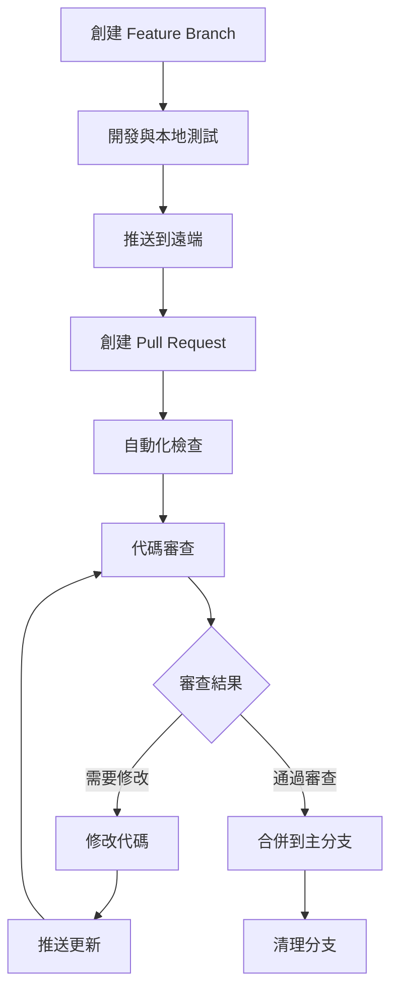
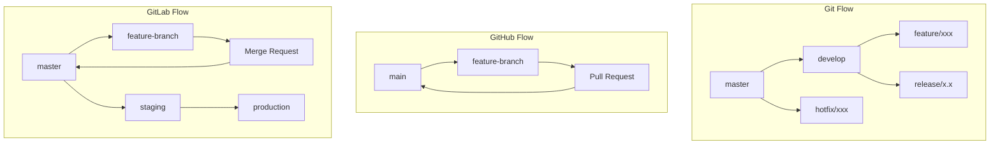
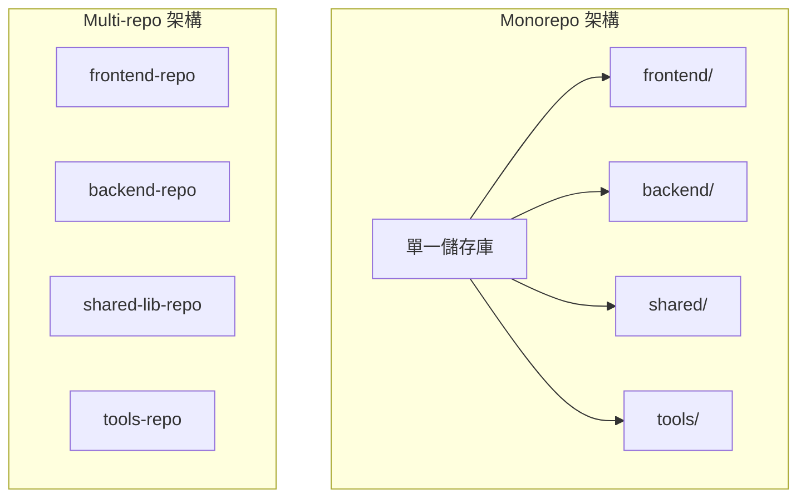

# Git 最佳實踐與代碼審查

## 7.1 代碼審查流程與標準

### 7.1.1 Pull Request 最佳實踐



#### PR 創建準則
```bash
# 好的 PR 標題範例
feat: add user authentication middleware
fix: resolve memory leak in image processing
docs: update API documentation for v2.0
refactor: extract database connection logic

# PR 描述模板
## What
簡潔描述改動內容

## Why
說明改動原因和業務價值

## How
描述實現方式和重要決策

## Testing
說明測試策略和覆蓋範圍

## Screenshots/Links
相關截圖或連結
```

### 7.1.2 代碼審查檢查清單

#### 技術審査重點
```markdown
## 代碼品質
- [ ] 代碼邏輯清晰，易於理解
- [ ] 變數和函數命名語義化
- [ ] 沒有重複代碼（DRY原則）
- [ ] 符合團隊編碼規範
- [ ] 適當的錯誤處理

## 功能正確性
- [ ] 實現符合需求規格
- [ ] 邊界條件處理完整
- [ ] 沒有明顯的邏輯錯誤
- [ ] 與現有功能兼容

## 效能考量
- [ ] 沒有明顯的效能問題
- [ ] 資料庫查詢優化
- [ ] 記憶體使用合理
- [ ] 演算法複雜度acceptable

## 安全性
- [ ] 沒有安全漏洞
- [ ] 輸入驗證完整
- [ ] 敏感資料處理安全
- [ ] 權限控制正確

## 測試覆蓋
- [ ] 單元測試覆蓋關鍵邏輯
- [ ] 整合測試驗證功能
- [ ] 測試案例涵蓋邊界條件
```

### 7.1.3 審查工具整合

#### GitHub Code Review
```yaml
# .github/CODEOWNERS
# Global owners
* @team-leads @senior-engineers

# Frontend specific
/frontend/ @frontend-team
/src/components/ @ui-team

# Backend specific  
/backend/ @backend-team
/api/ @api-team

# Database migrations
/migrations/ @database-team @team-leads

# CI/CD and infrastructure
/.github/ @devops-team
/docker/ @devops-team
```

#### Automated Review Checks
```yaml
# .github/workflows/code-review.yml
name: Code Review Automation
on:
  pull_request:
    types: [opened, synchronize]

jobs:
  lint:
    runs-on: ubuntu-latest
    steps:
      - uses: actions/checkout@v3
      - name: Run linting
        run: |
          npm run lint
          npm run format-check
          
  security-scan:
    runs-on: ubuntu-latest
    steps:
      - uses: actions/checkout@v3
      - name: Run security scan
        uses: github/super-linter@v4
        
  test-coverage:
    runs-on: ubuntu-latest
    steps:
      - uses: actions/checkout@v3
      - name: Run tests with coverage
        run: |
          npm test -- --coverage
          npx codecov
```

## 7.2 Git 工作流程優化

### 7.2.1 Git Flow vs GitHub Flow vs GitLab Flow



#### 選擇指南
```bash
# Git Flow - 適合複雜發布週期
git flow init
git flow feature start new-feature
git flow feature finish new-feature
git flow release start 1.0.0
git flow release finish 1.0.0

# GitHub Flow - 適合持續部署
git checkout -b feature/user-auth
# 開發並推送
git push origin feature/user-auth
# 創建 PR，合併後自動部署

# GitLab Flow - 適合多環境部署
git checkout -b feature/payment-integration
# 開發完成後 MR 到 master
# master 自動部署到 staging
# staging 測試通過後部署到 production
```

### 7.2.2 分支命名規範

#### 統一命名策略
```bash
# 功能分支
feature/user-authentication
feature/payment-gateway
feature/order-management

# 修復分支  
fix/login-error
fix/memory-leak
hotfix/critical-security-patch

# 版本分支
release/v1.2.0
release/v2.0.0-beta

# 實驗分支
experiment/new-ui-framework
spike/performance-optimization

# 個人分支
personal/john/prototype-feature
personal/mary/refactor-database
```

### 7.2.3 Commit 訊息標準化

#### Conventional Commits
```bash
# 基本格式
<type>[optional scope]: <description>

[optional body]

[optional footer(s)]

# 實際範例
feat(auth): add OAuth2 integration with Google

Implements Google OAuth2 authentication flow
- Add Google OAuth2 client configuration
- Create authentication middleware  
- Update user model to support OAuth

Closes #123
Breaking-change: Requires new environment variables
```

#### Commit 類型定義
```bash
# 主要類型
feat     # 新功能
fix      # 錯誤修復
docs     # 文檔更新
style    # 代碼格式調整
refactor # 重構
test     # 測試相關
chore    # 構建或輔助工具變動

# 範例
feat(api): add user profile endpoints
fix(ui): resolve button alignment issue  
docs(readme): update installation guide
style(css): format stylesheets with prettier
refactor(auth): extract validation logic
test(unit): add tests for user service
chore(deps): update react to v18
```

## 7.3 團隊協作最佳實踐

### 7.3.1 分支保護策略

#### GitHub Branch Protection
```bash
# 通過 GitHub CLI 設置
gh api repos/:owner/:repo/branches/main/protection \
  --method PUT \
  --field required_status_checks='{"strict":true,"contexts":["ci/tests","ci/lint"]}' \
  --field enforce_admins=true \
  --field required_pull_request_reviews='{"required_approving_review_count":2,"dismiss_stale_reviews":true}' \
  --field restrictions=null
```

#### 保護規則配置
```yaml
# branch-protection.yml
protection_rules:
  main:
    required_status_checks:
      strict: true
      contexts:
        - "ci/tests"
        - "ci/lint"  
        - "security/scan"
    required_pull_request_reviews:
      required_approving_review_count: 2
      dismiss_stale_reviews: true
      require_code_owner_reviews: true
    enforce_admins: true
    allow_force_pushes: false
    allow_deletions: false
```

### 7.3.2 Git Hooks 自動化

#### Pre-commit Hooks
```bash
#!/bin/sh
# .git/hooks/pre-commit
echo "Running pre-commit checks..."

# 檢查代碼格式
npm run lint
if [ $? -ne 0 ]; then
  echo "Linting failed. Please fix errors before committing."
  exit 1
fi

# 運行單元測試
npm run test:unit
if [ $? -ne 0 ]; then
  echo "Unit tests failed. Please fix tests before committing."
  exit 1
fi

# 檢查 commit message 格式
commit_regex='^(feat|fix|docs|style|refactor|test|chore)(\(.+\))?: .{1,50}'
commit_msg=$(cat .git/COMMIT_EDITMSG)
if ! echo "$commit_msg" | grep -qE "$commit_regex"; then
  echo "Invalid commit message format. Please use conventional commits."
  exit 1
fi

echo "Pre-commit checks passed!"
```

#### Pre-push Hooks
```bash
#!/bin/sh
# .git/hooks/pre-push
protected_branch='main'
current_branch=$(git symbolic-ref HEAD | sed -e 's,.*/\(.*\),\1,')

if [ $protected_branch = $current_branch ]; then
  echo "Direct push to main branch is not allowed."
  echo "Please create a feature branch and submit a pull request."
  exit 1
fi

# 運行整合測試
npm run test:integration
if [ $? -ne 0 ]; then
  echo "Integration tests failed. Push aborted."
  exit 1
fi
```

### 7.3.3 代碼品質門檻

#### SonarQube 整合
```yaml
# sonar-project.properties
sonar.projectKey=my-project
sonar.organization=my-org
sonar.sources=src
sonar.tests=tests
sonar.coverage.exclusions=**/*test.js,**/*spec.js
sonar.test.inclusions=**/*test.js,**/*spec.js

# Quality Gate 條件
sonar.qualitygate.wait=true
sonar.coverage.minimum=80
sonar.duplicated_lines_density.maximum=3
sonar.maintainability_rating.maximum=A
sonar.reliability_rating.maximum=A  
sonar.security_rating.maximum=A
```

## 7.4 企業級 Git 管理

### 7.4.1 大型專案策略

#### Monorepo vs Multi-repo


#### Git Submodules 管理
```bash
# 添加 submodule
git submodule add https://github.com/company/shared-lib.git libs/shared
git submodule add https://github.com/company/ui-components.git libs/ui

# 初始化 submodules
git submodule update --init --recursive

# 更新 submodules
git submodule update --remote --merge

# 自動化 submodule 管理
#!/bin/bash
# update-submodules.sh
echo "Updating all submodules..."
git submodule foreach git fetch
git submodule foreach git merge origin/main
git add .
git commit -m "chore: update submodules to latest"
```

### 7.4.2 權限與存取控制

#### GitLab 權限矩陣
```yaml
# gitlab-permissions.yml
groups:
  developers:
    access_level: developer
    permissions:
      - read_project
      - write_code
      - create_merge_request
      
  maintainers:
    access_level: maintainer  
    permissions:
      - read_project
      - write_code
      - merge_requests
      - manage_branches
      
  owners:
    access_level: owner
    permissions:
      - all_permissions
      - manage_members
      - delete_project

branch_protection:
  main:
    push_access_level: maintainer
    merge_access_level: developer
    unprotect_access_level: owner
```

### 7.4.3 Git 效能優化

#### 大型儲存庫優化
```bash
# 啟用 partial clone
git clone --filter=blob:none <url>
git clone --filter=tree:0 <url>

# 使用 Git LFS
git lfs track "*.png"
git lfs track "*.jpg" 
git lfs track "*.pdf"
git lfs track "*.zip"

# 定期清理
git gc --aggressive --prune=now
git repack -Ad
git prune

# 分析儲存庫大小
git count-objects -vH
du -sh .git/

# 找出大檔案
git rev-list --objects --all | \
  git cat-file --batch-check='%(objecttype) %(objectname) %(objectsize) %(rest)' | \
  sed -n 's/^blob //p' | \
  sort --numeric-sort --key=2 | \
  tail -20
```

## 7.5 持續整合最佳實踐

### 7.5.1 Git-based CI/CD Pipeline

```yaml
# .github/workflows/ci-cd.yml
name: CI/CD Pipeline
on:
  push:
    branches: [main, develop]
  pull_request:
    branches: [main]

jobs:
  test:
    runs-on: ubuntu-latest
    strategy:
      matrix:
        node-version: [16, 18, 20]
    steps:
      - uses: actions/checkout@v3
        with:
          fetch-depth: 0
          
      - name: Setup Node.js
        uses: actions/setup-node@v3
        with:
          node-version: ${{ matrix.node-version }}
          cache: 'npm'
          
      - name: Install dependencies
        run: npm ci
        
      - name: Run tests
        run: |
          npm run test:unit
          npm run test:integration
          npm run test:e2e
          
      - name: Generate coverage report
        run: npm run coverage
        
      - name: Upload coverage
        uses: codecov/codecov-action@v3

  security:
    runs-on: ubuntu-latest
    steps:
      - uses: actions/checkout@v3
      - name: Run security audit
        run: |
          npm audit --audit-level moderate
          npx snyk test
          
  deploy:
    needs: [test, security]
    runs-on: ubuntu-latest
    if: github.ref == 'refs/heads/main'
    steps:
      - uses: actions/checkout@v3
      - name: Deploy to production
        run: |
          echo "Deploying to production..."
          # 部署邏輯
```

### 7.5.2 Git-based 版本發布

#### Semantic Versioning 自動化
```bash
# package.json scripts
{
  "scripts": {
    "release:patch": "npm version patch && git push --follow-tags",
    "release:minor": "npm version minor && git push --follow-tags", 
    "release:major": "npm version major && git push --follow-tags",
    "release:auto": "semantic-release"
  }
}

# .releaserc.json
{
  "branches": ["main"],
  "plugins": [
    "@semantic-release/commit-analyzer",
    "@semantic-release/release-notes-generator",
    "@semantic-release/changelog",
    "@semantic-release/npm",
    "@semantic-release/git",
    "@semantic-release/github"
  ]
}
```

## 7.6 故障處理與恢復

### 7.6.1 常見問題解決方案

#### 誤刪分支恢復
```bash
# 查看已刪除分支的最後 commit
git reflog
git log --oneline --all --graph

# 恢復已刪除的分支
git checkout -b recovered-branch <commit-hash>

# 恢復誤刪的文件
git checkout HEAD~1 -- <file-path>
git restore --source=HEAD~1 <file-path>
```

#### 錯誤合併處理
```bash
# 撤銷最後一次合併
git reset --hard HEAD~1

# 撤銷已推送的合併 (創建反向提交)
git revert -m 1 <merge-commit-hash>

# 使用 git bisect 定位問題提交
git bisect start
git bisect bad HEAD
git bisect good <known-good-commit>
# Git 會自動切換到中間提交進行測試
git bisect good  # 或 git bisect bad
# 重複直到找到問題提交
git bisect reset
```

### 7.6.2 資料恢復策略

#### 備份重要分支
```bash
#!/bin/bash
# backup-branches.sh
BACKUP_DIR="git-backups/$(date +%Y%m%d)"
mkdir -p $BACKUP_DIR

# 備份所有遠端分支
git branch -r | grep -v HEAD | while read branch; do
  branch_name=$(basename $branch)
  git bundle create "$BACKUP_DIR/$branch_name.bundle" $branch
done

# 備份標籤
git tag | while read tag; do
  git bundle create "$BACKUP_DIR/tag-$tag.bundle" $tag
done

echo "Backup completed in $BACKUP_DIR"
```

## 7.7 Git 最佳實踐總結

### 7.7.1 日常開發檢查表

```markdown
## 開始新功能前
- [ ] 確保本地 main 分支是最新的
- [ ] 創建描述性的功能分支名稱
- [ ] 設置上游分支並定期同步

## 開發過程中  
- [ ] 頻繁提交，每次提交都有明確意義
- [ ] 遵循 conventional commit 格式
- [ ] 定期推送到遠端備份代碼
- [ ] 保持分支與 main 同步

## 提交 PR/MR 前
- [ ] 運行完整測試套件
- [ ] 檢查代碼格式和品質
- [ ] 撰寫清晰的 PR 描述
- [ ] 自我審查代碼變更

## 代碼審查時
- [ ] 仔細審查邏輯和設計
- [ ] 提供建設性反饋
- [ ] 確認測試覆蓋率充足
- [ ] 驗證符合團隊標準

## 合併後
- [ ] 清理本地和遠端分支
- [ ] 更新本地 main 分支
- [ ] 確認部署成功
- [ ] 監控應用效能
```

### 7.7.2 團隊協作原則

#### 溝通協作
```markdown
## Git 協作金律
1. **小而頻繁的提交**: 每次提交解決一個明確問題
2. **清晰的訊息**: Commit message 讓其他人一目了然
3. **及時同步**: 定期拉取最新更改避免衝突
4. **審慎合併**: 確保代碼品質再合併到主分支
5. **保持整潔**: 定期清理無用分支維持儲存庫健康

## 衝突解決原則
- 理解雙方修改的業務邏輯
- 與相關開發者溝通確認最終方案
- 測試合併結果確保功能正常
- 記錄解決過程供後續參考
```

### 7.7.3 進階自動化

#### Git Workflow 自動化腳本
```bash
#!/bin/bash
# git-workflow.sh - 自動化日常 Git 操作

case $1 in
  "start")
    # 開始新功能
    git checkout main
    git pull origin main
    git checkout -b feature/$2
    echo "Started feature branch: feature/$2"
    ;;
    
  "sync")
    # 同步當前分支
    current_branch=$(git branch --show-current)
    git fetch origin
    git rebase origin/main
    echo "Synced $current_branch with main"
    ;;
    
  "finish")
    # 完成功能開發
    current_branch=$(git branch --show-current)
    git push origin $current_branch
    gh pr create --title "$2" --body "Closes #$3"
    echo "Created PR for $current_branch"
    ;;
    
  "cleanup")
    # 清理已合併分支
    git branch --merged main | grep -v main | xargs -n 1 git branch -d
    git remote prune origin
    echo "Cleaned up merged branches"
    ;;
    
  *)
    echo "Usage: git-workflow.sh {start|sync|finish|cleanup} [args]"
    ;;
esac
```

這個綜合指南涵蓋了 Git 在軟體工程實踐中的各個面向，從基礎的代碼審查到企業級的版本控制管理。遵循這些最佳實踐能夠顯著提升團隊協作效率和代碼品質，確保軟體開發流程的穩定性和可維護性。