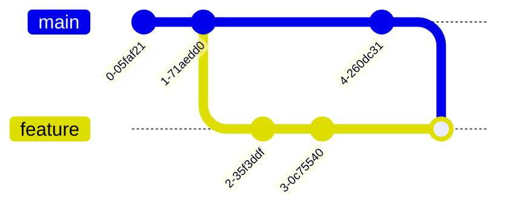

# 02-開發者日常工作流程

## 主題簡介

本章節旨在系統性介紹開發者於日常專案協作中，常用的 Git 工作流程與命令。內容涵蓋專案初始化、分支管理、提交規範、合併策略、暫存技巧、精選提交、常見開發流程範例，以及進階實務與最佳實踐。適合工程師日常開發、團隊協作與面試準備。

---

## 2.1 Clone 與初始化專案

### 用途與核心概念

Clone 是將遠端儲存庫完整複製到本地端，包含所有版本紀錄。初始化（init）則用於建立全新本地 Git 儲存庫。

### 原理說明

- `git clone` 會建立 `.git` 目錄，下載所有 commit、分支、tag。
- `git init` 僅建立空的 `.git` 目錄，需手動新增遠端。

### 常用命令與範例

```bash
$ git clone https://github.com/example/repo.git
Cloning into 'repo'...
remote: Enumerating objects: 42, done.
...
$ git init
Initialized empty Git repository in /path/to/dir/.git/
```

### 實際開發場景

- 新進成員加入團隊，clone 專案開始開發。
- 建立 side project，先 `git init`，再 push 到遠端。

### 最佳實踐與錯誤排查

- Clone 前確認權限與網址正確。
- `git init` 後記得設定 remote：`git remote add origin <url>`。

---

## 2.2 分支管理（建立、切換、刪除）

### 用途與核心概念

分支（branch）用於隔離功能開發、修 bug 或測試，避免主線受影響。

### 原理說明

- 分支本質為指向 commit 的指標。
- 切換分支會更新工作目錄內容。

### 常用命令與範例

```bash
$ git branch feature/login      # 建立分支
$ git checkout feature/login    # 切換分支
$ git switch feature/login      # 新版切換語法
$ git branch -d feature/login   # 刪除分支
$ git branch                    # 查看所有分支
* main
  feature/login
```

### 實際開發場景

- 每個功能/issue 建立獨立分支。
- 合併後刪除已完成分支。

### 最佳實踐與錯誤排查

- 避免在 main/master 直接開發。
- 刪除分支前確認已合併，否則用 `-D` 強制刪除。

---

## 2.3 Commit 與訊息撰寫規範

### 用途與核心概念

Commit 是版本控制的基本單位，良好訊息有助於追蹤與協作。

### 原理說明

- 每次 commit 會產生唯一 SHA-1 雜湊值。
- 訊息應簡潔明確，描述本次變更內容。

### 常用命令與範例

```bash
$ git add .                         # 暫存所有變更
$ git commit -m "feat: 新增登入功能"
[feature/login 123abcd] feat: 新增登入功能
 3 files changed, 42 insertions(+)
```

#### 常見訊息格式（Conventional Commits）

- feat: 新功能
- fix: 修 bug
- docs: 文件
- refactor: 重構
- test: 測試

### 實際開發場景

- Pull Request 需明確 commit 訊息，方便 code review。
- 自動化工具（如 CI/CD）依訊息判斷版本號。

### 最佳實踐與錯誤排查

- 一次 commit 僅做一件事。
- 訊息避免「update」、「fix bug」等模糊描述。

---

## 2.4 Merge 與 Rebase 實務

### 用途與核心概念

合併（merge）與重疊（rebase）用於整合分支，維持主線乾淨。

### 原理說明

- Merge 會產生合併 commit，保留分支歷史。
- Rebase 會將分支 commit 重新套用於主線，歷史更線性。

### 常用命令與範例

```bash
$ git checkout main
$ git merge feature/login
Merge made by the 'recursive' strategy.
```

```bash
$ git rebase main
First, rewinding head to replay your work on top of it...
```

### 實際開發場景

- 團隊協作時，feature 分支合併回 main。
- 需保持 commit 歷史簡潔時使用 rebase。

### 最佳實踐與錯誤排查

- 公開分支避免 rebase，防止歷史衝突。
- 合併衝突時，依提示手動解決後 `git add`、`git rebase --continue`。

---

## 2.5 Stash 暫存與還原

### 用途與核心概念

Stash 用於暫存未完成的變更，方便切換分支或拉取最新代碼。

### 原理說明

- Stash 會將當前變更存入暫存堆疊，不影響工作目錄。

### 常用命令與範例

```bash
$ git stash
Saved working directory and index state WIP on feature/login: 123abcd
$ git stash list
stash@{0}: WIP on feature/login: 123abcd
$ git stash apply
$ git stash drop stash@{0}
```

### 實際開發場景

- 緊急修 bug 需切換分支時，先 stash 變更。
- 拉取遠端更新需清空工作目錄時。

### 最佳實踐與錯誤排查

- Stash 內容不會自動合併，需手動處理衝突。
- 避免長期堆積 stash，易遺漏重要變更。

---

## 2.6 Cherry-pick 精選提交

### 用途與核心概念

Cherry-pick 可將特定 commit 應用到當前分支，常用於 bug 修補或熱修。

### 原理說明

- 會複製指定 commit，產生新的 commit 記錄於當前分支。

### 常用命令與範例

```bash
$ git cherry-pick 123abcd
[main 456efgh] fix: 修正登入錯誤
```

### 實際開發場景

- 僅需部分修正套用至主線或其他分支。
- 緊急 hotfix，無需合併整個分支。

### 最佳實踐與錯誤排查

- 避免 cherry-pick 多次同一 commit，會產生重複內容。
- 衝突時需手動解決，並 `git cherry-pick --continue`。

---

## 2.7 日常開發常見流程範例

### 範例流程

1. Clone 專案
2. 建立功能分支
3. 開發與 commit
4. push 分支至遠端
5. 發起 Pull Request
6. Code Review 通過後合併
7. 刪除本地與遠端分支

### 實作命令

```bash
$ git clone https://github.com/example/repo.git
$ git checkout -b feature/login
$ git add .
$ git commit -m "feat: 新增登入功能"
$ git push origin feature/login
# 在 GitHub 發起 PR，經審查後合併
$ git checkout main
$ git pull
$ git branch -d feature/login
$ git push origin --delete feature/login
```

---

## 2.8 進階技巧與最佳實踐

### 2.8.1 Rebase 操作與最佳實踐

#### 用途
Rebase 用於整理分支歷史、保持 commit 線性，常見於 feature 分支合併前清理歷史。

#### 原理
- `git rebase` 會將當前分支的 commit 重新套用到目標分支之後，歷史更乾淨。
- 互動式 rebase（`-i`）可調整、合併、修改多個 commit。
- `--onto` 可指定 rebase 的新基底。
- `squash` 可將多個 commit 合併為一。

#### 常用命令與範例
```bash
# 基本 rebase
$ git checkout feature
$ git rebase main

# 互動式 rebase
$ git rebase -i HEAD~5

# onto 用法
$ git rebase --onto develop release feature

# squash 合併 commit
# 於互動式 rebase 編輯介面選擇 squash
```

#### 實戰案例
- 合併前整理 commit，將多次 WIP 合併為單一功能 commit。
- 變更分支基底，將 feature 分支從 main 轉移到 develop。

#### Mermaid 分支結構圖


#### 最佳實踐
- 私人/feature 分支可自由 rebase，公開分支避免 rebase。
- 互動式 rebase 前先備份分支。
- 解決衝突後務必 `git rebase --continue`。

#### 常見錯誤排查
- rebase 衝突：`git status` 查詢，手動解決後繼續。
- rebase 中斷：可用 `git rebase --abort` 還原。
- 不小心 rebase 公開分支：通知團隊並協調修正。

---

### 2.8.2 Reflog 常見救援

#### 用途
Reflog 用於追蹤 HEAD 與分支指標的歷史，常用於誤刪 commit、reset、rebase 後救援。

#### 原理
- `git reflog` 記錄所有 HEAD 變動（如 commit、checkout、rebase、reset）。
- 可透過 reflog 找回遺失的 commit 或分支。

#### 常用命令與範例
```bash
$ git reflog
$ git checkout <commit-hash>
$ git branch rescue <commit-hash>
```

#### 實戰案例
- 誤用 `git reset --hard`，用 reflog 找回遺失 commit。
- 誤刪分支後，從 reflog 取得 commit hash 新建分支。

#### Mermaid 流程圖


#### 最佳實踐
- 重大操作前先備份分支。
- 熟悉 reflog 查詢與還原流程。

#### 常見錯誤排查
- 找不到預期 commit：檢查 reflog 是否被清除（如 gc）。
- checkout hash 失敗：確認 hash 是否正確、commit 是否存在。

---

### 2.8.3 Pre-commit hook 實務

#### 用途
Pre-commit hook 用於提交前自動檢查程式碼品質、格式或執行測試，提升團隊一致性。

#### 原理
- Git hooks 於 `.git/hooks/` 目錄，pre-commit 於 commit 前自動執行。
- 可自訂 shell script 或結合工具（如 lint-staged、husky）。

#### 常用命令與範例
```bash
# 建立 pre-commit hook
$ vi .git/hooks/pre-commit
# 內容範例
#!/bin/sh
npm run lint
npm test

# 設定可執行權限
$ chmod +x .git/hooks/pre-commit
```

#### 實戰案例
- 團隊統一於 pre-commit 執行 ESLint、Prettier 格式化。
- 結合 CI 工具，確保本地與遠端皆有檢查。

#### Mermaid 流程圖


#### 最佳實踐
- hook 腳本應快速執行，避免影響開發效率。
- 重要檢查應於 CI 再次驗證。

#### 常見錯誤排查
- hook 無效：確認檔案有執行權限、檔名正確。
- commit 被中斷：檢查腳本內容與錯誤訊息。

---

### 2.8.4 Submodule 管理

#### 用途
Submodule 用於大型專案依賴管理，將其他 Git 專案嵌入本專案。

#### 原理
- submodule 實為指向外部 repo 的特殊 commit 指標。
- 需獨立 clone、更新、提交。

#### 常用命令與範例
```bash
# 新增 submodule
$ git submodule add https://github.com/example/lib.git libs/lib

# 初始化與更新
$ git submodule init
$ git submodule update

# 拉取時自動遞迴 submodule
$ git clone --recurse-submodules <repo>
```

#### 實戰案例
- 專案依賴第三方 library，透過 submodule 管理。
- 多專案共用同一套元件，集中維護。

#### Mermaid 分支結構圖


#### 最佳實踐
- submodule 需定期同步與更新。
- 變更 submodule 後需 commit 主專案與 submodule 變動。
- 建議於 README 註明 submodule 用法。

#### 常見錯誤排查
- submodule 未同步：執行 `git submodule update --init --recursive`。
- clone 後缺少 submodule：確認有加 `--recurse-submodules`。

---

本章節內容涵蓋日常開發全流程，適合工程師實務操作與面試準備，亦可作為團隊協作標準流程參考。