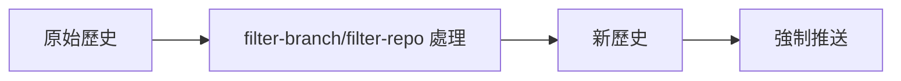
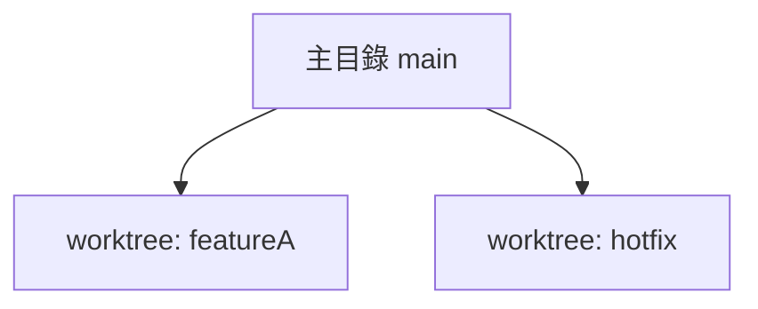

# 03-維護者工作流程

## 3.1 Review 流程與工具

### 主題簡介
Review（程式碼審查）是軟體開發流程中不可或缺的一環，確保程式碼品質、維護一致性並促進團隊知識共享。常見工具有 GitHub、GitLab、Bitbucket 等，皆提供線上 Review、討論、標註與自動化檢查功能。

### 詳細原理說明
Review 流程通常包含：
1. 開發者提交 Merge Request（MR）或 Pull Request（PR）。
2. 維護者審查程式碼，檢查邏輯、風格、測試覆蓋率等。
3. 留下意見，開發者修正後再次提交。
4. 通過審查後合併至主分支。

### 常用命令與語法範例
```shell
# 取得最新分支
git fetch origin

# 切換到 feature 分支
git checkout feature/awesome-feature

# 查看差異
git diff main...feature/awesome-feature

# 送出 PR/MR（以 GitHub CLI 為例）
gh pr create --base main --head feature/awesome-feature --title "新增功能" --body "說明內容"
```
**範例輸出：**
```
Creating pull request for feature/awesome-feature into main
✓ Pull request created: https://github.com/org/repo/pull/123
```

### 實際開發場景與案例
多人協作時，Review 可防止低品質程式碼進入主分支。例如：A 開發新功能，B 負責 Review，發現潛在 bug，A 修正後再合併。

### 最佳實踐與常見錯誤排查
- 明確標註意見，避免模糊描述。
- 善用自動化工具（如 CI、Lint）。
- 常見錯誤：未同步主分支、Review 未覆蓋所有變更。

### 進階技巧
- 設定 Review 規則（如至少兩人同意）。
- 使用 Code Owners 自動分配審查人員。

---

## 3.2 Merge Request / Pull Request 實務

### 主題簡介
MR/PR 是協作開發的核心，讓團隊成員能審查、討論並安全地合併程式碼。

### 詳細原理說明
MR/PR 會將 feature 分支的變更請求合併到主分支，並觸發自動化流程（如測試、部署）。

### 常用命令與語法範例
```shell
# 產生新分支
git checkout -b feature/issue-123

# 提交更動
git add .
git commit -m "修正 issue-123"

# 推送到遠端
git push origin feature/issue-123

# 建立 PR（GitHub CLI）
gh pr create --base main --head feature/issue-123
```

### 實際開發場景與案例
修復 bug、開發新功能、重構程式碼皆透過 MR/PR 流程進行，確保每次合併都經過審查。

### 最佳實踐與常見錯誤排查
- PR 描述需詳盡，附上測試方式與影響範圍。
- 避免一次合併過多變更，保持單一職責。
- 常見錯誤：分支命名不一致、描述不清、未通過自動化檢查。

### 進階技巧
- 使用模板自動產生 PR 描述。
- 結合自動化標籤與分派審查人員。

---

## 3.3 Squash 與 Commit 歷史整理

### 主題簡介
Squash 是將多個 commit 合併為單一 commit，保持主分支歷史簡潔易讀。

### 詳細原理說明
Squash 可在合併 PR/MR 時自動執行，或透過 rebase 手動整理 commit 歷史，避免雜亂無章。

### 常用命令與語法範例
```shell
# 互動式 rebase
git rebase -i main

# 將多個 commit squash 成一個
# 在編輯器中將 pick 改為 squash
```
**範例輸出：**
```
Successfully rebased and updated refs/heads/feature/awesome-feature.
```

### 實際開發場景與案例
多人協作時，feature 分支可能有多個修正 commit，合併前 squash 可讓主分支歷史更乾淨。

### 最佳實踐與常見錯誤排查
- 合併前整理 commit，避免無意義訊息。
- 常見錯誤：rebase 衝突未解決、誤刪重要 commit。

### 進階技巧
- 結合 `git commit --fixup` 與 `git rebase -i --autosquash` 自動整理修正 commit。

---

## 3.4 Release Tag 與版本管理

### 主題簡介
Release Tag 用於標記重要版本，方便回溯、部署與維護。

### 詳細原理說明
Tag 是 Git 的不可變標記，常用於標示發佈版本（如 v1.0.0），配合語意化版本管理（SemVer）提升維護效率。

### 常用命令與語法範例
```shell
# 建立標籤
git tag v1.0.0

# 推送標籤到遠端
git push origin v1.0.0

# 查看所有標籤
git tag
```
**範例輸出：**
```
v0.9.0
v1.0.0
```

### 實際開發場景與案例
每次正式發佈前建立 Release Tag，便於回溯特定版本、快速修復生產環境問題。

### 最佳實踐與常見錯誤排查
- 僅在穩定版本建立 Tag。
- 常見錯誤：Tag 名稱重複、未推送到遠端。

### 進階技巧
- 使用帶註解的 Tag（`git tag -a v1.0.0 -m "Release 1.0.0"`）。
- 自動化腳本產生版本號與 Tag。

---

## 3.5 維護者常見決策與責任

### 主題簡介
維護者負責專案品質把關、流程制定與團隊協作推動，是專案成功的關鍵角色。

### 詳細原理說明
維護者需根據專案需求，制定 Review、合併、發佈等規範，並協調團隊資源，處理衝突與技術債。

### 常用命令與語法範例
- 設定分支保護規則（以 GitHub 為例）：
  - Require pull request reviews before merging
  - Require status checks to pass before merging

### 實際開發場景與案例
- 決定是否接受高風險變更。
- 制定緊急修復流程（hotfix）。
- 分配 Review 任務，確保知識傳承。

### 最佳實踐與常見錯誤排查
- 定期檢討流程，持續優化。
- 常見錯誤：規則未落實、責任分工不明。

### 進階技巧
- 結合自動化工具（如 CI/CD、Code Owners）減少人為疏漏。
- 建立知識庫與文件化決策過程。

---

## 3.6 實戰案例：多團隊協作下的維護流程

### 主題簡介
多團隊協作時，維護流程需兼顧彈性與一致性，避免衝突與重工。

### 詳細原理說明
可採用 Git Flow、Trunk-based Development 等分支策略，並透過自動化工具協調多團隊開發。

### 常用命令與語法範例
```shell
# 建立 hotfix 分支
git checkout -b hotfix/urgent-fix

# 合併至 develop 與 main
git checkout develop
git merge hotfix/urgent-fix
git checkout main
git merge hotfix/urgent-fix
```

### 實際開發場景與案例
A 團隊負責新功能，B 團隊負責維運，雙方透過定期同步、共用測試環境與明確分支策略協作。

### 最佳實踐與常見錯誤排查
- 明確分工，定期同步進度。
- 常見錯誤：分支命名混亂、合併衝突頻繁。

### 進階技巧
- 使用自動化合併與衝突預警工具。
- 建立跨團隊 Review 機制。

---

## 3.7 進階技巧與最佳實踐

### 主題簡介
進階技巧可提升維護效率，降低風險，並促進團隊成長。

### 詳細原理說明
結合自動化、規範化與知識管理，打造高效維護流程。

### 常用命令與語法範例
```shell
# 自動化檢查（以 GitHub Actions 為例）
# .github/workflows/ci.yml
name: CI
on: [push, pull_request]
jobs:
  build:
    runs-on: ubuntu-latest
    steps:
      - uses: actions/checkout@v3
      - run: npm install
      - run: npm test
```

### 實際開發場景與案例
- PR 自動執行測試、Lint，減少人為疏漏。
- 版本發佈自動產生 Release Note。

### 最佳實踐與常見錯誤排查
- 持續整合（CI）、持續交付（CD）。
- 常見錯誤：自動化流程未覆蓋所有情境、腳本維護困難。

### 進階技巧
- 建立自動化回報與監控機制。
- 結合 ChatOps、Slack Bot 提升協作效率。

---

## 3.8 bisect 錯誤追蹤

### 用途
快速定位導致 bug 的 commit，縮短除錯時間。

### 原理
`git bisect` 採用二分搜尋法，自動在良好與有問題的 commit 間切換，逐步縮小範圍。

### 命令範例
```shell
git bisect start
git bisect bad                # 標記目前 commit 有問題
git bisect good v1.0.0        # 標記 v1.0.0 為正常
# 依提示測試並標記 good/bad，直到找到問題 commit
git bisect reset              # 結束 bisect
```

### 實戰案例
某功能於 v1.0.0 正常，v1.2.0 出現 bug，透過 bisect 可快速找出引入 bug 的 commit。

### Mermaid 圖示
```mermaid
flowchart TD
    A[Good Commit (v1.0.0)] --> B{中間 commit}
    B -- Good --> C[下一個 commit]
    B -- Bad --> D[上一個 commit]
    C --> E{繼續二分}
    D --> E
    E --> F[找到問題 commit]
```

### 最佳實踐
- 測試腳本自動化，可結合 `git bisect run`。
- 每次標記結果需確實測試，避免誤判。

### 常見錯誤排查
- 標記 good/bad 方向錯誤，導致結果不準。
- 測試步驟不一致，影響判斷。

---

## 3.9 filter-branch 與 filter-repo 歷史重寫

### 用途
批次修改、刪除或匿名化 Git 歷史（如移除敏感資訊、調整作者）。

### 原理
`git filter-branch` 與 `git filter-repo` 會重寫 commit 歷史，產生全新 commit hash，適用於大規模歷史調整。

### 命令範例
```shell
# 使用 filter-branch 移除檔案
git filter-branch --tree-filter 'rm -f secret.txt' -- --all

# 使用 filter-repo 移除檔案（推薦）
git filter-repo --path secret.txt --invert-paths
```

### 實戰案例
誤將密碼檔 commit 至歷史，需徹底移除所有紀錄並強制推送。

### Mermaid 圖示


### 最佳實踐
- 優先使用 `git filter-repo`，效能佳且維護中。
- 操作前備份專案，通知團隊同步新歷史。

### 常見錯誤排查
- 忘記強制推送（`git push --force`），導致遠端未同步。
- 團隊未同步新歷史，產生衝突。

---

## 3.10 worktree 多目錄管理

### 用途
同一 repository 同時檢查多個分支，方便多任務或多版本開發。

### 原理
`git worktree` 可在不同目錄建立多個工作樹，每個目錄可 checkout 不同分支，互不干擾。

### 命令範例
```shell
# 新增 worktree
git worktree add ../featureA featureA

# 查看所有 worktree
git worktree list

# 移除 worktree
git worktree remove ../featureA
```

### 實戰案例
同時維護主線與 hotfix，主目錄維護 main，worktree 處理 hotfix 分支，互不影響。

### Mermaid 圖示


### 最佳實踐
- worktree 目錄命名清楚，避免混淆。
- 定期清理不再使用的 worktree。

### 常見錯誤排查
- worktree 指向已刪除分支，導致錯誤。
- 忘記移除 worktree，佔用磁碟空間。

---

## 3.11 reflog 進階救援

### 用途
找回誤刪分支、commit 或 reset 後遺失的歷史。

### 原理
`git reflog` 記錄所有 HEAD 變動，包含 checkout、commit、reset 等操作，可追蹤回溯。

### 命令範例
```shell
# 查看 HEAD 變動紀錄
git reflog

# 恢復誤刪 commit
git checkout <commit-hash>
# 或建立新分支
git branch rescue <commit-hash>
```

### 實戰案例
誤用 reset --hard，導致 commit 消失，透過 reflog 找回 commit 並恢復分支。

### Mermaid 圖示
```mermaid
graph TD
    A[HEAD@{0} 現在] --> B[HEAD@{1} reset 前]
    B --> C[HEAD@{2} commit]
    C --> D[reflog 記錄]
```

### 最佳實踐
- 定期檢查 reflog，重要 commit 及時恢復。
- 重大操作前建立備份分支。

### 常見錯誤排查
- reflog 過期（預設 90 天），資料無法找回。
- 忘記建立新分支，直接 checkout 造成混亂。

---

## 3.12 reset 操作

### 用途
重設分支指標，撤銷 commit 或暫存區變更，常用於回溯錯誤或整理歷史。

### 原理
`git reset` 分為 soft、mixed、hard 三種模式，分別影響 HEAD、index、工作目錄。

### 命令範例
```shell
# 僅重設 HEAD，保留暫存區與工作目錄
git reset --soft HEAD~1

# 重設 HEAD 與暫存區，保留工作目錄
git reset --mixed HEAD~1

# 全部重設，回復到指定 commit 狀態
git reset --hard HEAD~1
```

### 實戰案例
誤 commit 錯誤內容，使用 reset --soft 回到 commit 前狀態，修正後重新提交。

### Mermaid 圖示
```mermaid
flowchart LR
    A[HEAD@main] --reset--> B[HEAD~1]
    B --soft--> C[保留暫存區]
    B --mixed--> D[清空暫存區]
    B --hard--> E[清空暫存區與工作目錄]
```

### 最佳實踐
- 重要分支操作前先備份。
- 避免在已推送分支使用 hard reset。

### 常見錯誤排查
- reset 後資料遺失，可用 reflog 嘗試救援。
- hard reset 誤用於遠端分支，導致團隊同步困難。

---
