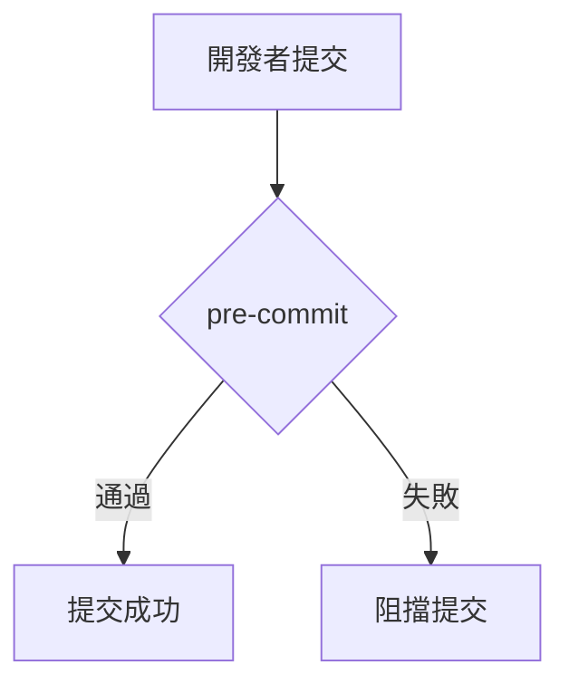
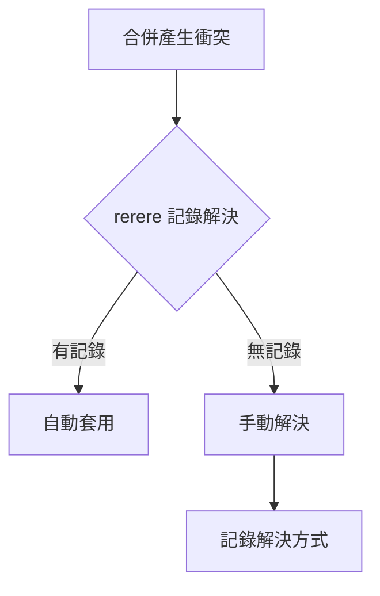
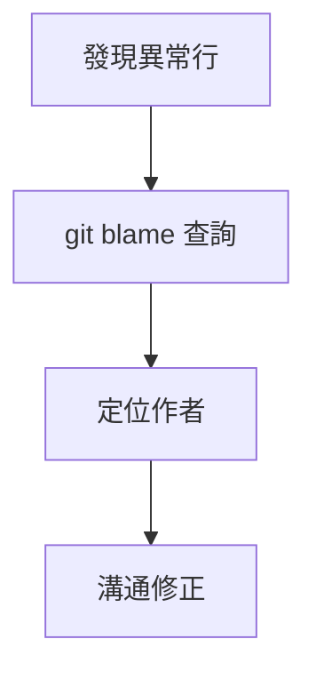
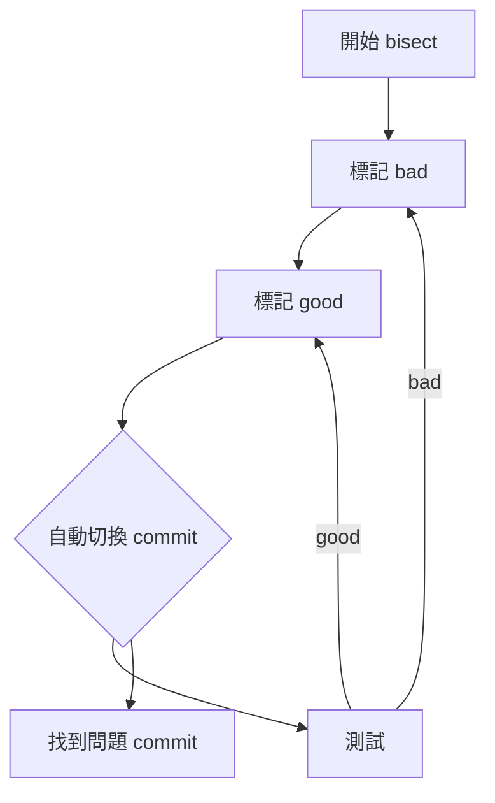

# 05-協作與代碼管理技巧

## 5.1 Code Review 流程與工具

### 主題簡介
Code Review（程式碼審查）是團隊協作中不可或缺的一環，能提升程式碼品質、減少錯誤、促進知識傳遞。常見工具有 GitHub Pull Request、GitLab Merge Request、Gerrit 等。

### 原理說明
Code Review 透過同儕審查，發現潛在問題、確保風格一致、驗證業務邏輯。流程通常包含：開發者提交變更、建立 PR/MR、指派審查者、審查與回饋、修正、最終合併。

### 常用命令與語法範例
#### 建立分支並推送
```bash
git checkout -b feature/login
git push origin feature/login
```
#### 建立 Pull Request（以 GitHub 為例）
1. 於 GitHub 網頁點選 "New Pull Request"
2. 選擇 base 與 compare 分支，填寫說明後送出

#### 審查與回饋
- 於 PR 頁面留言、建議修改、Approve 或 Request changes

### 實際開發場景
多人協作時，每個功能皆以分支開發，透過 PR 進行審查，確保每次合併皆經過檢查。

### 最佳實踐與常見錯誤排查
- 明確描述 PR 內容與動機
- 小步提交，避免一次改動過多
- 使用自動化檢查（CI）
- 常見錯誤：未同步主分支、審查者未理解業務背景

### 進階技巧
- 使用 Code Owners 自動指派審查者
- 結合自動化工具（如 lint、test）於 PR 流程

---

## 5.2 衝突解決與協作溝通

### 主題簡介
衝突解決是多人協作時常見問題，需有效溝通與技術手段解決。

### 原理說明
當多個分支修改同一檔案同一區塊時，合併會產生衝突。需手動編輯衝突區塊，確認正確內容。

### 常用命令與語法範例
#### 拉取並合併主分支
```bash
git fetch origin
git checkout feature/login
git merge origin/main
```
若有衝突，Git 會標記衝突區塊：
```text
<<<<<<< HEAD
本地內容
=======
遠端內容
>>>>>>> origin/main
```
#### 解決後標記為已解決
```bash
git add <file>
git commit
```

### 實際開發場景
多人同時修改 config 或 README，合併時產生衝突，需協調決定最終內容。

### 最佳實踐與常見錯誤排查
- 合併前先拉取最新主分支
- 衝突多時，與相關人員討論
- 常見錯誤：直接覆蓋他人改動、未測試合併後功能

### 進階技巧
- 使用 `git rerere` 自動記錄並重用衝突解決
- 利用 rebase 保持提交歷史乾淨

---

## 5.2.1 hooks 自動化流程設計

### 用途
Git hooks 可於特定事件（如 commit、push）自動執行腳本，強化流程一致性與自動化。

### 原理
hooks 目錄下的腳本會於對應事件自動觸發，常用於檢查格式、執行測試、阻擋不合規提交。

### 命令範例
```bash
# 建立 pre-commit hook
echo 'npm run lint' > .git/hooks/pre-commit
chmod +x .git/hooks/pre-commit
```

### 實戰案例
多人專案統一格式，於 pre-commit 自動執行 lint，避免不合規代碼進入版本庫。

### 最佳實踐
- 版本化 hooks（如用 husky 管理）
- 只做必要檢查，避免過慢
- 於 CI 再次驗證

### 常見錯誤排查
- 權限不足導致 hook 未執行
- 忘記同步 hooks 設定



---

## 5.2.2 rerere 衝突自動解決

### 用途
`git rerere` 可記錄並重用衝突解決方案，提升重複衝突處理效率。

### 原理
啟用 rerere 後，Git 會記錄每次手動解決的衝突，下次遇到相同衝突自動套用。

### 命令範例
```bash
git config --global rerere.enabled true
```

### 實戰案例
多人維護長期分支，重複遇到相同衝突時，rerere 可自動套用先前解決方式，減少重工。

### 最佳實踐
- 持續啟用 rerere
- 定期檢查自動解決結果

### 常見錯誤排查
- rerere 未啟用導致無效
- 自動解決不正確需手動覆核



---

## 5.2.3 blame 追蹤責任

### 用途
`git blame` 用於追蹤每行代碼最後一次修改者，協助定位責任與溝通。

### 原理
blame 會顯示每行的 commit 資訊與作者，便於查詢歷史。

### 命令範例
```bash
git blame main.py
```

### 實戰案例
發現 bug 時，透過 blame 查找相關修改者，快速溝通修正。

### 最佳實踐
- blame 前先理解上下文
- 配合 log、show 查詢細節

### 常見錯誤排查
- 合併提交會影響追蹤準確度
- 大量重構後 blame 失真



---

## 5.2.4 bisect 問題追蹤

### 用途
`git bisect` 用於二分法定位引入 bug 的 commit，快速縮小問題範圍。

### 原理
bisect 會自動切換 commit，讓使用者標記好壞，最終找出問題提交。

### 命令範例
```bash
git bisect start
git bisect bad
git bisect good <commit>
# 測試後標記
git bisect bad/good
git bisect reset
```

### 實戰案例
專案出現回歸 bug，無法直接定位時，透過 bisect 快速找出引入問題的 commit。

### 最佳實踐
- 測試腳本自動化判斷好壞
- 每步都確認測試結果

### 常見錯誤排查
- good/bad 標記錯誤導致結果不準
- 測試標準不明確



---

## 5.3 Submodule 管理與實務

### 主題簡介
Submodule 讓專案可引用其他 Git 倉庫，適合共用函式庫或第三方模組。

### 原理說明
Submodule 實際儲存的是子倉庫的 commit 指標，主專案需同步管理 submodule 狀態。

### 常用命令與語法範例
#### 新增 submodule
```bash
git submodule add https://github.com/example/lib.git libs/lib
git commit -m "Add submodule"
```
#### 初始化與更新
```bash
git submodule init
git submodule update
```
#### 同步 submodule
```bash
git submodule update --remote
```

### 實際開發場景
大型專案需共用底層函式庫，或需追蹤第三方專案特定版本。

### 最佳實踐與常見錯誤排查
- 變更 submodule 後需提交主專案
- clone 時加上 `--recursive`
- 常見錯誤：忘記同步 submodule、submodule 指標錯亂

### 進階技巧
- 使用 branch 追蹤 submodule 最新狀態
- 編寫自動化腳本同步多個 submodule

---

## 5.4 Monorepo 管理技巧

### 主題簡介
Monorepo（單一倉庫多專案）適合大型團隊統一管理多個相關專案。

### 原理說明
Monorepo 將多個模組、服務集中於同一倉庫，便於跨專案協作、共用工具與流程。

### 常用命令與語法範例
#### 以 Yarn Workspaces 管理
```bash
yarn workspaces run build
```
#### Lerna 管理多套件
```bash
npx lerna bootstrap
npx lerna run test
```

### 實際開發場景
前後端、行動端共用一套型別定義或工具庫，集中於同一倉庫管理。

### 最佳實踐與常見錯誤排查
- 明確劃分模組目錄
- 建立自動化測試與部署流程
- 常見錯誤：依賴混亂、版本不一致

### 進階技巧
- 利用 Nx、Bazel 等工具提升建置效能
- 實作 partial build、incremental test

---

## 5.5 大型專案維護常見挑戰

### 主題簡介
大型專案維護需面對複雜度、協作、效能等多重挑戰。

### 原理說明
隨著專案規模擴大，需管理更多模組、開發者，維持一致性與可維護性。

### 常用命令與語法範例
#### 查詢歷史紀錄
```bash
git log --oneline --graph --all
```
#### 分析貢獻者
```bash
git shortlog -sn
```

### 實際開發場景
數十人以上團隊協作，需追蹤每個模組狀態、分工明確。

### 最佳實踐與常見錯誤排查
- 制定明確分支策略
- 定期重構與技術債管理
- 常見錯誤：缺乏文件、知識斷層

### 進階技巧
- 建立自動化監控與警示
- 利用 Git hooks 強化流程

---

## 5.6 團隊協作下的最佳實踐

### 主題簡介
良好協作流程能提升團隊效率、降低溝通成本。

### 原理說明
明確分工、標準化流程、善用工具，是高效團隊的關鍵。

### 常用命令與語法範例
#### 設定 Git 使用者資訊
```bash
git config --global user.name "Your Name"
git config --global user.email "your@email.com"
```
#### 設定 commit template
```bash
git config commit.template .gitmessage.txt
```

### 實際開發場景
新成員加入時，快速導入團隊規範與流程。

### 最佳實踐與常見錯誤排查
- 文件化開發規範
- 定期 code review 與知識分享
- 常見錯誤：規範未落實、溝通不透明

### 進階技巧
- 結合 ChatOps、CI/CD 自動化協作
- 使用 Git blame、bisect 快速定位問題

---

## 5.7 進階技巧與常見錯誤排查

### 主題簡介
進階技巧能提升開發效率，快速排查問題。

### 原理說明
善用 Git 進階指令與自動化工具，能有效解決複雜問題。

### 常用命令與語法範例
#### 互動式 rebase
```bash
git rebase -i HEAD~5
```
#### 查找特定內容修改紀錄
```bash
git log -p -S 'functionName'
```
#### 二分查找錯誤提交
```bash
git bisect start
git bisect bad
git bisect good <commit>
```

### 實際開發場景
追蹤 bug 起因、重構歷史、還原誤刪檔案。

### 最佳實踐與常見錯誤排查
- 重要操作前備份分支
- 熟悉 reset、reflog、stash 用法
- 常見錯誤：誤用 reset 導致資料遺失、rebase 衝突未處理

### 進階技巧
- 編寫自訂 Git alias 提升效率
- 結合自動化腳本與監控工具