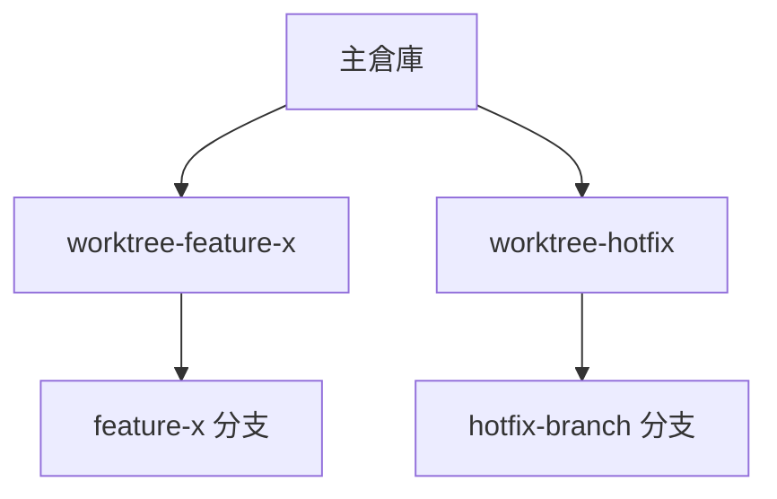
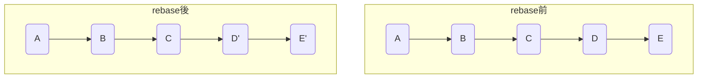
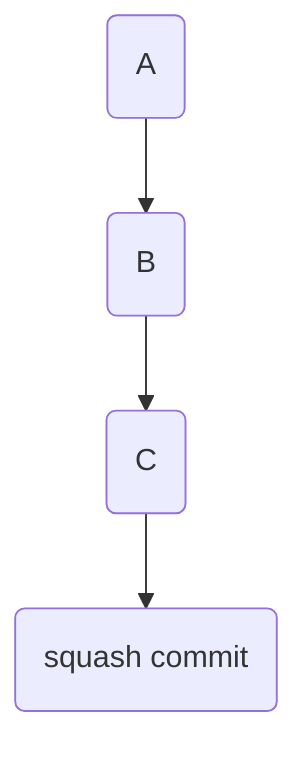

# 06-Git 疑難排解與自動化進階

本章深入探討 Git 進階疑難排解與自動化技巧，涵蓋資料救援、錯誤追蹤、歷史重寫、自動化流程、工作目錄管理、進階 rebase/squash 操作及常見誤區。建議搭配[第二章：開發者日常工作流程](./02-開發者日常工作流程.md)與[第五章：協作與代碼管理技巧](./05-協作與代碼管理技巧.md)一同學習。

---

## 6.1 資料救援與 reflog

### 主題簡介
`git reflog` 記錄所有 HEAD 及分支引用的移動歷史，是資料救援與誤操作回復的關鍵工具。若誤刪 commit 或分支，reflog 可協助找回。

### 原理說明
Git 於 `.git/logs/refs/` 下記錄每次 HEAD、分支、rebase、reset 等操作的變動。即使 commit 被 `reset` 或 `rebase` 移除，reflog 仍可追溯其 SHA-1。

### 常用命令與語法範例
```shell
$ git reflog
$ git reset --hard HEAD@{1}
$ git reflog show feature-branch
```

### 實戰案例
- 誤用 `git reset --hard` 導致 commit 消失，可用 reflog 找回。
- 誤刪分支後，利用 reflog 查找分支最後一個 commit 並恢復。

### 最佳實踐與常見錯誤排查
- **最佳實踐：** 重要操作前建立 tag，定期檢查 reflog。
- **常見錯誤：** reflog 有保存期限（預設 90 天），過期後無法救援。

> 交互參照：分支管理詳見[第四章](./04-分支管理策略.md)。

---

## 6.2 錯誤追蹤與 bisect

### 主題簡介
`git bisect` 透過二分搜尋法自動定位引入 bug 的 commit，適用於大型專案或歷史悠久的代碼庫。

### 原理說明
指定一個「正常」與「有錯」的 commit，Git 會自動 checkout 中間點，工程師標記好壞，直到找出問題 commit。可結合自動化測試腳本，完全自動化查找。

### 常用命令與語法範例
```shell
$ git bisect start
$ git bisect bad                # 標記目前 commit 有 bug
$ git bisect good v1.0.0        # 標記 v1.0.0 為正常
$ git bisect good
$ git bisect bad
$ git bisect reset
```

### 實戰案例
- 追查某功能何時壞掉，快速定位引入 bug 的 commit。
- 結合自動化測試腳本，提升查找效率。

### 最佳實踐與常見錯誤排查
- **最佳實踐：** 配合自動化測試腳本提升效率。
- **常見錯誤：** 標記 good/bad 時誤判，導致結果不準確。

> 交互參照：自動化測試腳本設計詳見[第九章](./09-CICD 全面指南.md)。

---

## 6.3 歷史重寫：filter-branch 與 filter-repo

### 主題簡介
用於批次重寫 Git 歷史（如移除敏感資訊、調整作者、目錄重構），`git filter-branch` 與 `git filter-repo` 是兩大主力工具。

### 原理說明
- `git filter-branch` 透過 shell script 遍歷 commit 並重寫歷史，速度較慢。
- `git filter-repo`（推薦）以 Python 實作，效能高、語法簡潔，支援更複雜的過濾需求。

### 常用命令與語法範例
```shell
# 移除檔案（filter-branch）
$ git filter-branch --tree-filter 'rm -f secret.txt' -- --all

# 更換作者（filter-repo）
$ git filter-repo --mailmap my-mailmap.txt

# 只保留某目錄（filter-repo）
$ git filter-repo --path src/ --force
```

### 實戰案例
- 誤將密碼寫入 commit，需移除歷史紀錄。
- 專案目錄重構，僅保留特定子目錄歷史。
- 公司合併，統一作者資訊。

### 最佳實踐與常見錯誤排查
- **最佳實踐：** 操作前備份 repo，操作後強制推送（force push）。
- **常見錯誤：** 忘記通知協作者，導致 push/pull 衝突。

> 交互參照：協作流程詳見[第三章](./03-維護者工作流程.md)。

---

## 6.4 自動化流程設計：Git hooks

### 主題簡介
Git hooks 允許在特定事件（如 commit、push）自動執行腳本，實現自動化檢查、格式化、部署等流程。

### 原理說明
Git 於 `.git/hooks/` 目錄下提供多種 hook 範本（如 `pre-commit`、`pre-push`），可自訂 shell、Python、Node.js 腳本。現代專案常用 Husky 等工具集中管理 hooks。

### 常用命令與語法範例
```shell
# 建立 pre-commit hook
$ vi .git/hooks/pre-commit

# 範例內容
#!/bin/sh
npm run lint
if [ $? -ne 0 ]; then
  echo "Lint failed!"
  exit 1
fi

# 賦予執行權限
$ chmod +x .git/hooks/pre-commit
```

### 實戰案例
- 提交前自動格式化代碼、檢查測試。
- push 前自動執行 CI/CD 部署腳本。

### 最佳實踐與常見錯誤排查
- **最佳實踐：** 搭配 Husky 等工具集中管理 hooks。
- **常見錯誤：** 忘記賦予執行權限，導致 hook 無效。

> 交互參照：CI/CD 自動化詳見[第七章](./07-GitHub Actions.md)與[第八章](./08-GitLab Runner.md)。

---

## 6.5 多工作目錄管理：worktree

### 主題簡介
`git worktree` 允許一個 Git 倉庫同時檢出多個分支於不同目錄，適合多任務開發、熱修復、跨版本維護等場景。

### 原理說明
Git 預設一個倉庫僅能在單一目錄檢出一個分支。`git worktree` 透過建立額外工作目錄，讓同一個 repo 可同時操作多個分支，彼此獨立但共用物件資料庫（.git/objects）。

### 常用命令與語法範例
```shell
# 新增一個工作目錄並檢出分支
$ git worktree add ../feature-x feature-x

# 列出所有 worktree
$ git worktree list

# 移除工作目錄
$ git worktree remove ../feature-x
```

### 實戰案例
假設你在主目錄開發主線，需同時修復舊版分支，可：
```shell
$ git worktree add ../hotfix hotfix-branch
$ cd ../hotfix
# 修復後提交
$ git commit -am "fix: hotfix"
```

### 結構圖示（mermaid）


### 最佳實踐與常見錯誤排查
- **最佳實踐：** worktree 目錄命名清楚，避免混淆。
- **常見錯誤：** worktree 未正確移除，導致目錄殘留。

> 交互參照：多分支協作詳見[第四章](./04-分支管理策略.md)。

---

## 6.6 進階 rebase 與 squash 操作

### 主題簡介
`git rebase` 用於重寫分支歷史、整理 commit、合併分支。進階用法包含互動式 rebase、--onto、squash 等。

### 原理說明
rebase 會將當前分支的一系列 commit 取下，重新套用到指定基底（base）之後，讓歷史更線性、易讀。squash 則將多個 commit 合併為一，常用於整理開發歷史、提交 PR 前壓縮 commit。

### 常用命令與語法範例
```shell
# 互動式 rebase
$ git rebase -i HEAD~5

# --onto 用法
$ git rebase --onto new-base old-base feature

# squash 合併多個 commit
$ git rebase -i HEAD~3
# 將多個 pick 改為 squash

# merge --squash
$ git checkout main
$ git merge --squash feature
$ git commit -m "squash: 合併 feature 所有更動"
```

### 圖示：rebase 與 squash（mermaid）



### 實戰案例
- 合併多個 commit，優化 PR 歷史。
- 將 feature 分支從舊基底移動到新基底，避免 merge commit。
- PR 前將多個修正 commit 壓縮為一，提升審查效率。

### 最佳實踐與常見錯誤排查
- **最佳實踐：** rebase 前先 pull 最新代碼，commit message 清楚、原子性高。
- **常見錯誤：** rebase 衝突未解決、squash 後訊息遺漏。

> 交互參照：日常 rebase 操作詳見[第二章](./02-開發者日常工作流程.md)。

---

## 6.7 其他高階技巧與常見誤區

### 主題簡介
彙整資深工程師常用的 Git 進階技巧、最佳實踐與常見錯誤排查，提升團隊協作與代碼品質。

### 原理說明
- 善用 alias、rebase、cherry-pick、stash 等進階功能。
- 建立嚴謹的分支策略與 commit message 規範。

### 常用命令與語法範例
```shell
# 自訂 alias
$ git config --global alias.lg "log --oneline --graph --all"
$ git lg

# 挑選特定 commit
$ git cherry-pick <commit-sha>

# 暫存工作區
$ git stash
$ git stash pop
```

### 實戰案例
- 互動式 rebase 合併多個 commit，優化歷史。
- cherry-pick 熱修復至多個分支。
- stash 暫存未完成工作，切換緊急任務。

### 最佳實踐與常見錯誤排查
- **最佳實踐：** commit message 清楚、原子性高，rebase 前先 pull 最新代碼。
- **常見錯誤：** rebase 衝突未解決、stash 遺漏導致資料丟失。

> 交互參照：分支策略與協作詳見[第四章](./04-分支管理策略.md)與[第五章](./05-協作與代碼管理技巧.md)。

---