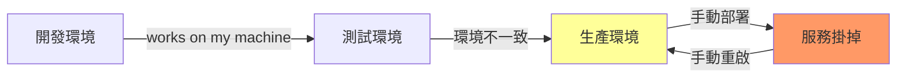
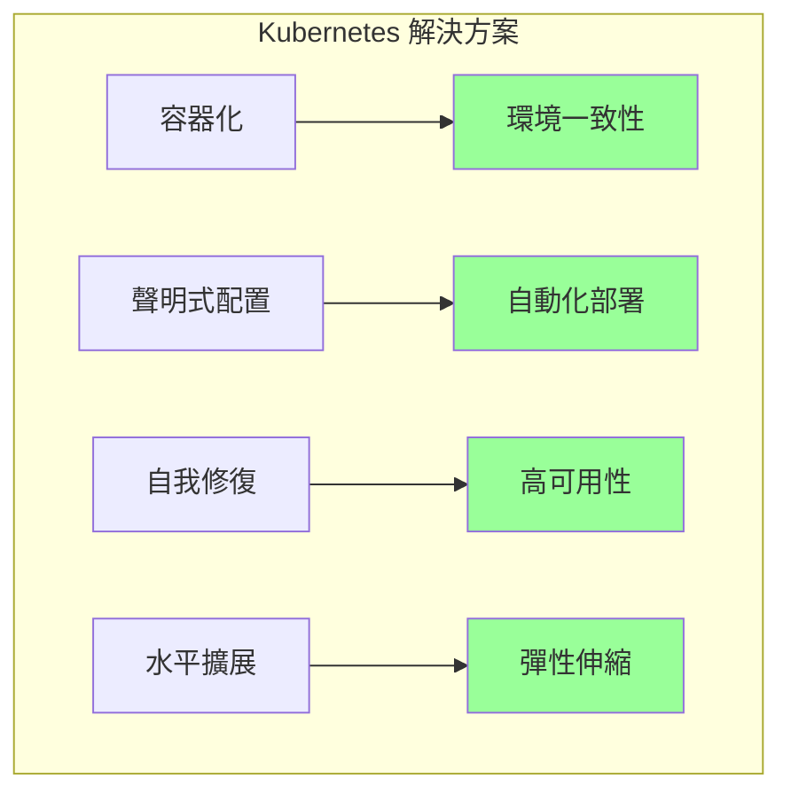
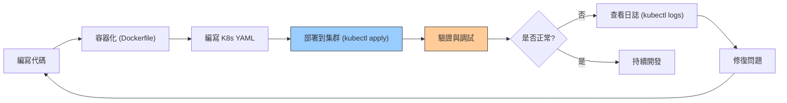
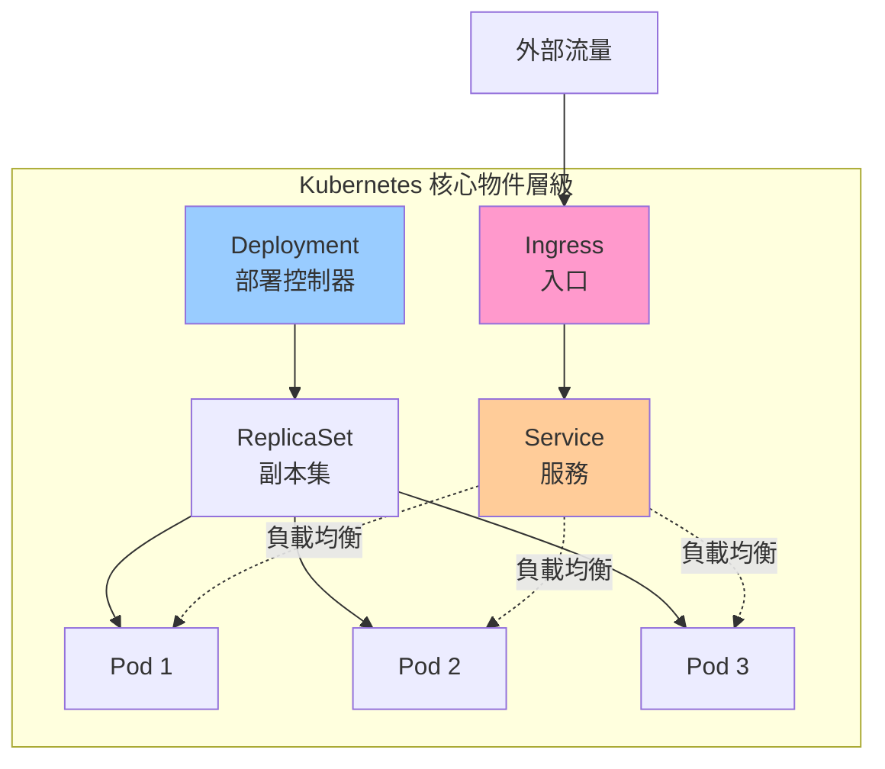
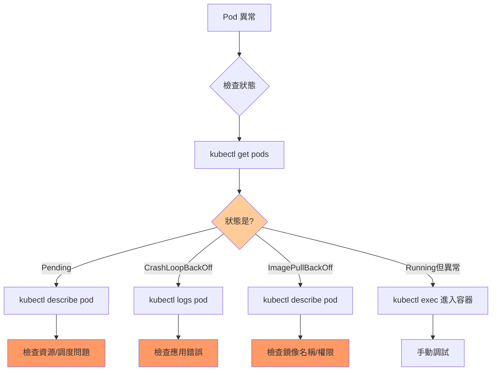

# 01-開發者快速上手指南

> 從開發者視角快速理解 Kubernetes，15 分鐘部署第一個應用

---

## 📚 本章目標

- 理解 Kubernetes 解決的核心問題
- 掌握開發者日常工作流程
- 部署第一個應用到 K8s
- 建立開發者思維模型

---

## 1. Kubernetes 是什麼？開發者為何需要它？

### 1.1 傳統部署的痛點



**開發者常見問題：**

- 「在我機器上可以跑啊！」（環境差異）
- 「服務掛了，誰去重啟？」（可靠性問題）
- 「流量突然暴增怎麼辦？」（擴展性問題）
- 「如何快速回滾錯誤版本？」（部署安全）

### 1.2 Kubernetes 的核心價值



**K8s 核心理念：**

- **聲明式管理**：告訴 K8s「我要什麼」，而非「如何做」
- **自我修復**：容器掛了自動重啟
- **彈性擴展**：根據負載自動調整副本數
- **環境一致**：開發、測試、生產使用相同配置

---

## 2. 開發者工作流程總覽



**核心概念：**

- **開發階段**：編寫代碼 + Dockerfile
- **配置階段**：編寫 K8s YAML（Deployment, Service）
- **部署階段**：`kubectl apply -f app.yaml`
- **運維階段**：監控、日誌、調試

---

## 3. 15 分鐘實戰：部署第一個應用

### 3.1 前置準備

確保已安裝：

- **kubectl**：K8s 命令行工具
- **K8s 集群**：可使用 minikube、k3s 或雲端託管集群

驗證安裝：

```bash
kubectl version --client
kubectl cluster-info
```

### 3.2 編寫 Deployment

創建 `nginx-deployment.yaml`：

```yaml
apiVersion: apps/v1
kind: Deployment
metadata:
  name: nginx-demo
  labels:
    app: nginx
spec:
  replicas: 3
  selector:
    matchLabels:
      app: nginx
  template:
    metadata:
      labels:
        app: nginx
    spec:
      containers:
      - name: nginx
        image: nginx:1.27
        ports:
        - containerPort: 80
        resources:
          requests:
            cpu: 100m
            memory: 128Mi
          limits:
            cpu: 200m
            memory: 256Mi
```

**關鍵欄位解析：**

- `replicas: 3`：運行 3 個 Pod 副本（高可用）
- `image: nginx:1.27`：使用的容器鏡像
- `resources`：資源限制（防止資源耗盡）

### 3.3 編寫 Service

創建 `nginx-service.yaml`：

```yaml
apiVersion: v1
kind: Service
metadata:
  name: nginx-service
spec:
  type: NodePort
  selector:
    app: nginx
  ports:
    - port: 80
      targetPort: 80
      nodePort: 30080
```

**Service 作用：**

- 提供穩定的訪問入口（IP 不變）
- 自動負載均衡到多個 Pod
- `NodePort`：通過節點 IP + 30080 端口訪問

### 3.4 部署到集群

```bash
kubectl apply -f nginx-deployment.yaml
kubectl apply -f nginx-service.yaml

kubectl get deployments
kubectl get pods
kubectl get services
```

**預期輸出：**

```
NAME         READY   UP-TO-DATE   AVAILABLE   AGE
nginx-demo   3/3     3            3           10s

NAME                         READY   STATUS    RESTARTS   AGE
nginx-demo-7d8f6c9b4-abcde   1/1     Running   0          10s
nginx-demo-7d8f6c9b4-fghij   1/1     Running   0          10s
nginx-demo-7d8f6c9b4-klmno   1/1     Running   0          10s

NAME            TYPE       CLUSTER-IP     EXTERNAL-IP   PORT(S)        AGE
nginx-service   NodePort   10.96.123.45   <none>        80:30080/TCP   5s
```

### 3.5 驗證部署

訪問應用：

```bash
curl http://<NODE_IP>:30080

kubectl port-forward svc/nginx-service 8080:80
```

瀏覽器訪問：`http://localhost:8080`

---

## 4. 核心概念速覽



### 4.1 Pod（最小部署單元）

- 包含一個或多個容器
- 共享網絡和存儲
- **開發者視角**：通常一個 Pod = 一個應用實例

### 4.2 Deployment（部署控制器）

- 管理 Pod 的生命週期
- 支持滾動更新、版本回滾
- **開發者視角**：聲明「我要 3 個副本」，K8s 自動維持

### 4.3 Service（服務發現）

- 提供穩定的網絡入口
- 自動負載均衡
- **開發者視角**：像微服務的「域名」

### 4.4 常用類型對比

| 物件類型            | 用途     | 典型場景          |
| --------------- | ------ | ------------- |
| **Pod**         | 最小部署單元 | 運行單個容器        |
| **Deployment**  | 無狀態應用  | Web 服務、API 後端 |
| **StatefulSet** | 有狀態應用  | 數據庫、消息隊列      |
| **DaemonSet**   | 每節點運行  | 日誌收集、監控       |
| **Job/CronJob** | 批次任務   | 數據處理、定時任務     |

---

## 5. 常用命令速查

### 5.1 部署與管理

```bash
kubectl apply -f app.yaml
kubectl delete -f app.yaml

kubectl get pods
kubectl get deployments
kubectl get services

kubectl get all -n <namespace>
```

### 5.2 調試與故障排查

```bash
kubectl describe pod <pod-name>

kubectl logs <pod-name>
kubectl logs -f <pod-name>
kubectl logs <pod-name> -c <container-name>

kubectl exec -it <pod-name> -- /bin/bash

kubectl port-forward pod/<pod-name> 8080:80
```

### 5.3 擴縮容與更新

```bash
kubectl scale deployment nginx-demo --replicas=5

kubectl set image deployment/nginx-demo nginx=nginx:1.28

kubectl rollout status deployment/nginx-demo
kubectl rollout undo deployment/nginx-demo
```

---

## 6. 調試工作流程



### 6.1 常見錯誤與解決方案

| 狀態                   | 原因        | 解決方法                                     |
| -------------------- | --------- | ---------------------------------------- |
| **Pending**          | 資源不足、調度失敗 | 檢查 node 資源：`kubectl describe node`       |
| **ImagePullBackOff** | 鏡像拉取失敗    | 檢查鏡像名稱、倉庫權限                              |
| **CrashLoopBackOff** | 容器啟動後崩潰   | 查看日誌：`kubectl logs pod-name`             |
| **Error**            | 容器執行錯誤    | 進入容器調試：`kubectl exec -it pod-name -- sh` |

---

## 7. 開發者最佳實踐

### 7.1 資源管理

**始終設置資源限制：**

```yaml
resources:
  requests:
    cpu: 100m
    memory: 128Mi
  limits:
    cpu: 500m
    memory: 512Mi
```

- `requests`：調度所需的最小資源
- `limits`：允許使用的最大資源

### 7.2 健康檢查

```yaml
livenessProbe:
  httpGet:
    path: /healthz
    port: 8080
  initialDelaySeconds: 30
  periodSeconds: 10

readinessProbe:
  httpGet:
    path: /ready
    port: 8080
  initialDelaySeconds: 5
  periodSeconds: 5
```

- **livenessProbe**：檢測容器是否存活（失敗則重啟）
- **readinessProbe**：檢測容器是否就緒（未就緒則不轉發流量）

### 7.3 標籤與選擇器

```yaml
metadata:
  labels:
    app: myapp
    tier: frontend
    environment: production
    version: v1.2.3
```

**用途：**

- Service 通過標籤選擇 Pod
- 便於查詢和管理：`kubectl get pods -l app=myapp`

---

## 8. 下一步學習路徑


**推薦學習順序：**

1. ✅ **本章**：快速上手，建立整體認知
2. **第 2 章**：深入理解 K8s 架構與核心概念
3. **第 3 章**：搭建本地開發環境（Kind/k3d + Skaffold）
4. **Part II**：學習應用容器化與配置管理
5. **Part III**：掌握生產環境最佳實踐

---

## 9. 實戰練習

### 練習 1：部署自己的應用

將你的應用容器化並部署到 K8s：

1. 編寫 Dockerfile
2. 構建鏡像並推送到 Docker Hub
3. 編寫 Deployment 和 Service YAML
4. 部署並驗證

### 練習 2：模擬故障恢復

```bash
kubectl delete pod <pod-name>

kubectl get pods -w
```

觀察 K8s 如何自動重建 Pod。

### 練習 3：手動擴縮容

```bash
kubectl scale deployment nginx-demo --replicas=5

watch kubectl get pods
```

觀察新 Pod 的創建過程。

---

## 10. 小結

本章從開發者視角介紹了 Kubernetes 的核心價值和基本工作流程：

- ✅ 理解 K8s 解決的核心問題（環境一致性、自動化、高可用）
- ✅ 掌握基本概念（Pod、Deployment、Service）
- ✅ 完成第一個應用的部署
- ✅ 學會基本的調試方法

**關鍵要點：**

- K8s 是**聲明式**的：告訴它「期望狀態」，它負責實現
- **自我修復**：容器掛了自動重啟
- **負載均衡**：Service 自動分發流量到多個 Pod
- **可擴展**：輕鬆擴縮副本數

下一章將深入探討 Kubernetes 的架構設計和核心組件原理。
