# 02-核心概念與架構

> 深入理解 Kubernetes 的設計原理與核心組件

---

## 📚 本章目標

- 掌握 Kubernetes 的架構設計
- 理解控制平面與數據平面的職責
- 深入學習核心 API 物件
- 掌握開發者視角的排查方法

---

## 1. Kubernetes 架構總覽

### 1.1 整體架構圖

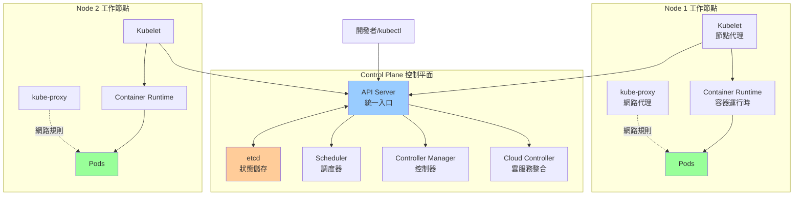

### 1.2 設計理念

**核心原則：**
- **聲明式 API**：用戶聲明期望狀態，系統自動調和（Reconciliation）
- **控制迴路**：持續監控實際狀態，確保與期望狀態一致
- **鬆耦合**：各組件獨立運作，通過 API Server 通訊
- **可擴展性**：支持 CRD（Custom Resource Definition）自定義資源

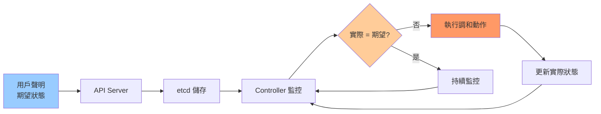

---

## 2. 控制平面組件詳解

### 2.1 API Server

**職責：**
- Kubernetes 的「大腦」，所有操作的統一入口
- 提供 RESTful API 介面
- 處理認證、授權、驗證
- 唯一與 etcd 通訊的組件

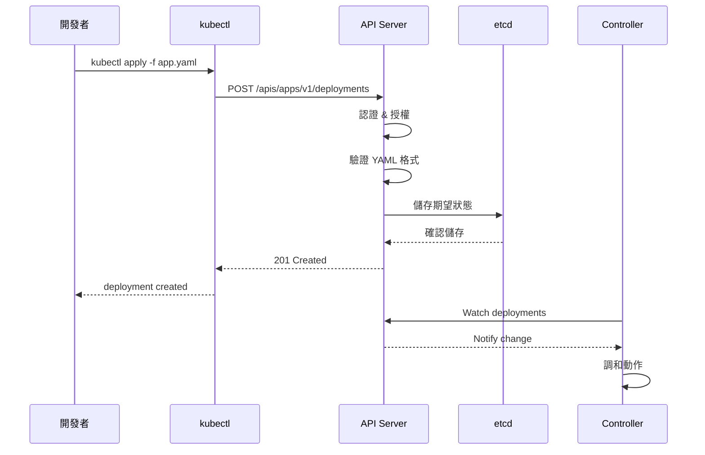

**開發者交互：**
```bash
kubectl get pods --v=9
```
查看 kubectl 與 API Server 的完整交互過程。

### 2.2 etcd

**職責：**
- 分散式鍵值儲存，保存集群所有狀態數據
- 提供 Watch 機制，支持事件通知
- 支持快照與備份

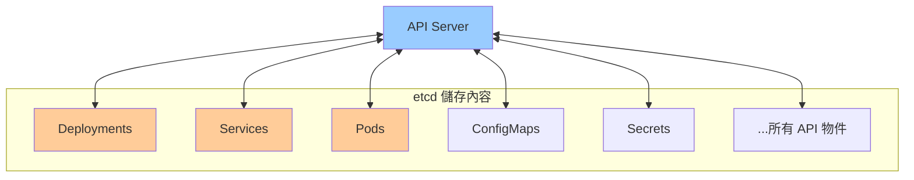

**重要性：**
- etcd 是集群的「真實來源」（Single Source of Truth）
- etcd 故障 = 集群無法運作（需高可用配置）

**開發者影響：**
- 大量頻繁創建/刪除資源會增加 etcd 壓力
- 大型 ConfigMap/Secret 會佔用 etcd 空間（建議 < 1MB）

### 2.3 Scheduler

**職責：**
- 為新創建的 Pod 選擇合適的 Node
- 考慮資源需求、親和性、污點與容忍等

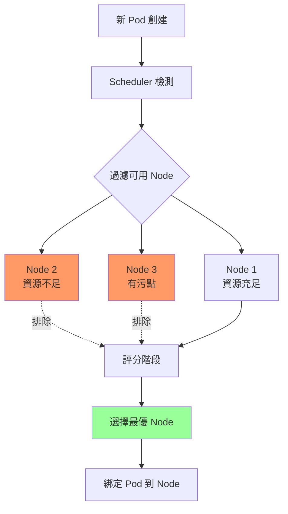

**調度過程：**

1. **過濾階段（Filtering）：**
   - 資源是否充足（CPU、Memory）
   - 是否滿足親和性規則
   - 是否容忍 Node 污點

2. **評分階段（Scoring）：**
   - 資源平衡度
   - 親和性權重
   - 自定義評分策略

**開發者常見問題：**

| 狀態 | 原因 | 解決方法 |
|-----|------|---------|
| **Pending** | 沒有可用 Node | 檢查資源請求是否過大 |
| **Pending** | 不滿足親和性 | 檢查 `nodeSelector` 或 `affinity` |
| **Pending** | 無法容忍污點 | 添加 `tolerations` |

```bash
kubectl describe pod <pod-name>
```
查看調度失敗原因。

### 2.4 Controller Manager

**職責：**
- 運行各種控制器（Controller）
- 持續監控資源狀態，執行調和邏輯

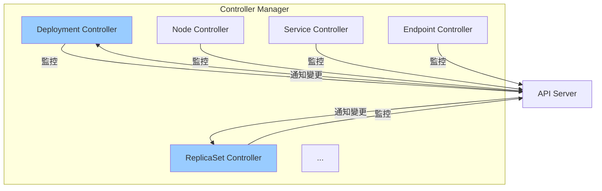

**常見 Controller：**

| Controller | 職責 |
|-----------|------|
| **Deployment Controller** | 管理 ReplicaSet，實現滾動更新 |
| **ReplicaSet Controller** | 確保 Pod 副本數符合期望 |
| **Node Controller** | 監控 Node 健康狀態 |
| **Service Controller** | 配置 LoadBalancer |
| **Endpoint Controller** | 更新 Service 的 Endpoint 列表 |

**控制器工作原理：**

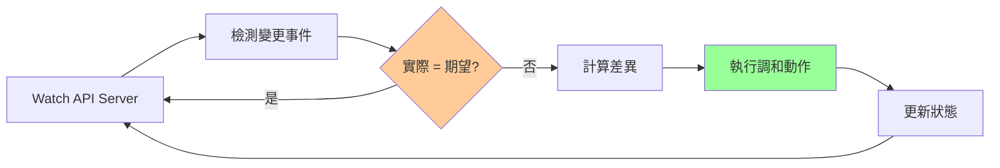

---

## 3. 工作節點組件詳解

### 3.1 Kubelet

**職責：**
- 節點上的「管家」，負責 Pod 生命週期管理
- 與 API Server 通訊，接收 Pod 配置
- 調用 Container Runtime 創建容器
- 監控 Pod 健康狀態，執行健康檢查

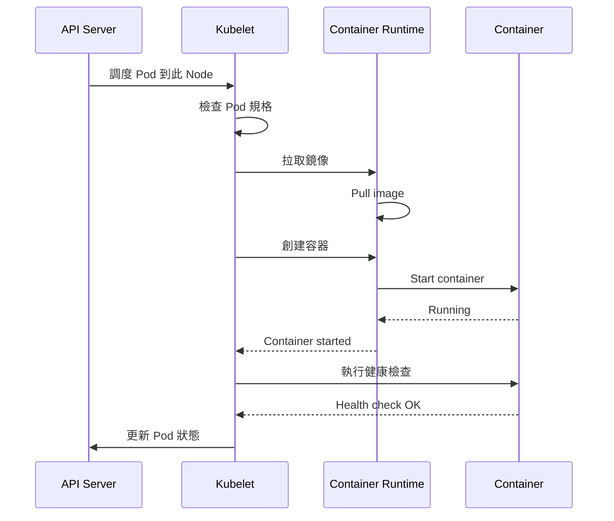

**Kubelet 管理的內容：**
- **Pod 生命週期**：創建、啟動、停止、刪除
- **Volume 掛載**：準備並掛載存儲卷
- **健康檢查**：執行 liveness/readiness probe
- **資源監控**：收集 CPU、Memory 使用情況

### 3.2 Container Runtime

**支持的運行時：**
- **containerd**（推薦）：輕量、高效
- **CRI-O**：專為 Kubernetes 設計
- **Docker**（透過 cri-dockerd）：需額外組件

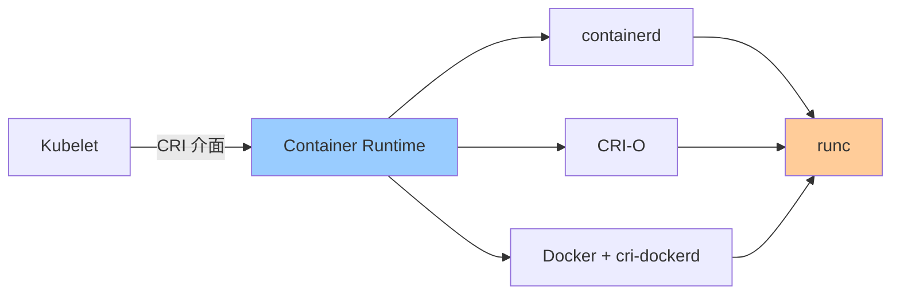

**CRI（Container Runtime Interface）：**
- Kubernetes 與容器運行時的標準介面
- 支持多種運行時實現

### 3.3 kube-proxy

**職責：**
- 維護節點上的網路規則
- 實現 Service 的負載均衡
- 支持多種模式：iptables、ipvs、userspace

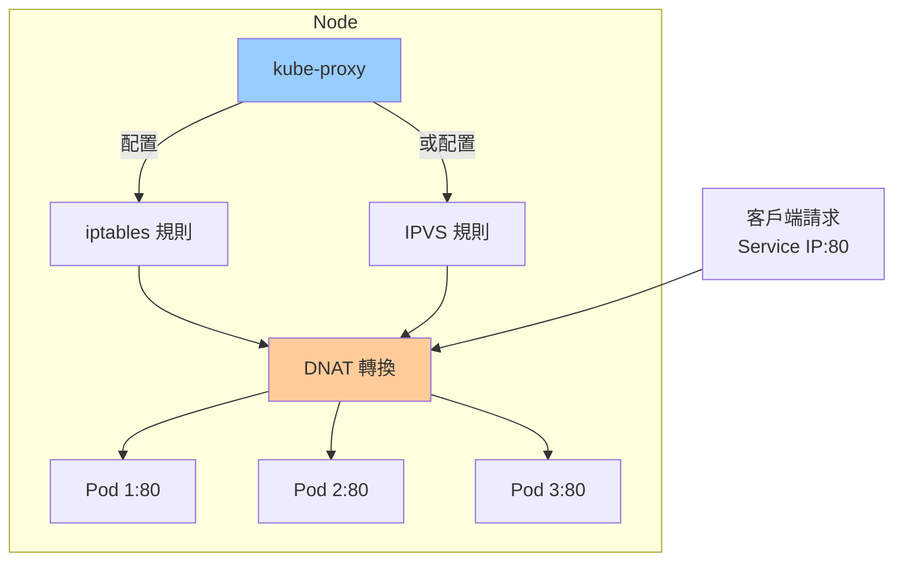

**工作模式對比：**

| 模式 | 優點 | 缺點 |
|-----|------|------|
| **iptables** | 成熟穩定 | 規則多時性能下降 |
| **ipvs** | 高性能、多種負載均衡算法 | 需內核支持 |
| **userspace** | 最早模式 | 性能差，已棄用 |

---

## 4. 核心 API 物件深度解析

### 4.1 Pod

**Pod 是什麼：**
- Kubernetes 最小調度單位
- 包含一個或多個容器
- 共享網絡命名空間、IPC、UTS

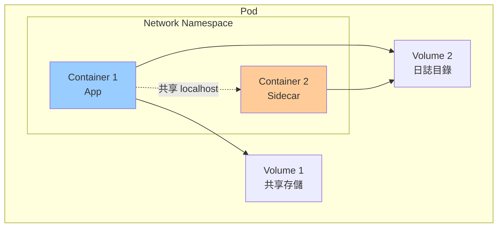

**完整 Pod 配置示例：**

```yaml
apiVersion: v1
kind: Pod
metadata:
  name: webapp
  labels:
    app: webapp
    tier: frontend
spec:
  initContainers:
  - name: init-db
    image: busybox:1.36
    command: ['sh', '-c', 'until nc -z db 5432; do sleep 1; done']
  
  containers:
  - name: app
    image: myapp:v1.0
    ports:
    - containerPort: 8080
      name: http
    
    env:
    - name: DB_HOST
      value: "db.default.svc.cluster.local"
    - name: DB_PASSWORD
      valueFrom:
        secretKeyRef:
          name: db-secret
          key: password
    
    resources:
      requests:
        cpu: 100m
        memory: 128Mi
      limits:
        cpu: 500m
        memory: 512Mi
    
    livenessProbe:
      httpGet:
        path: /healthz
        port: 8080
      initialDelaySeconds: 30
      periodSeconds: 10
    
    readinessProbe:
      httpGet:
        path: /ready
        port: 8080
      initialDelaySeconds: 5
      periodSeconds: 5
    
    volumeMounts:
    - name: config
      mountPath: /etc/config
    - name: data
      mountPath: /data
  
  - name: log-sidecar
    image: fluentd:v1.16
    volumeMounts:
    - name: data
      mountPath: /data
      readOnly: true
  
  volumes:
  - name: config
    configMap:
      name: app-config
  - name: data
    emptyDir: {}
  
  restartPolicy: Always
  
  nodeSelector:
    disktype: ssd
  
  tolerations:
  - key: "workload"
    operator: "Equal"
    value: "frontend"
    effect: "NoSchedule"
```

**Pod 生命週期：**

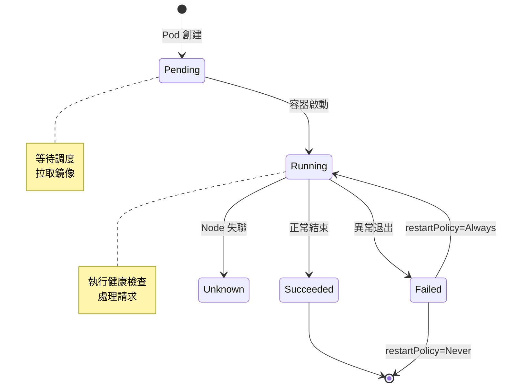

**Pod 階段說明：**

| 階段 | 說明 | 常見原因 |
|-----|------|---------|
| **Pending** | 等待調度或啟動 | 資源不足、鏡像拉取中 |
| **Running** | 至少一個容器運行中 | 正常狀態 |
| **Succeeded** | 所有容器成功結束 | Job/CronJob 完成 |
| **Failed** | 所有容器結束，至少一個失敗 | 應用錯誤 |
| **Unknown** | 無法獲取狀態 | Node 失聯 |

### 4.2 Deployment

**Deployment 管理層級：**

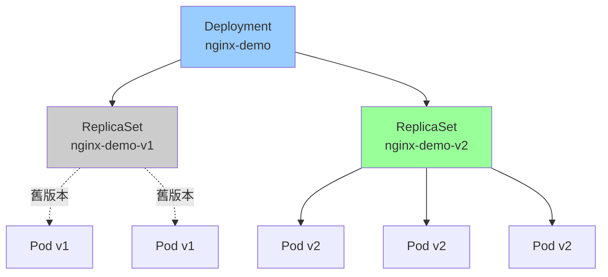

**滾動更新流程：**

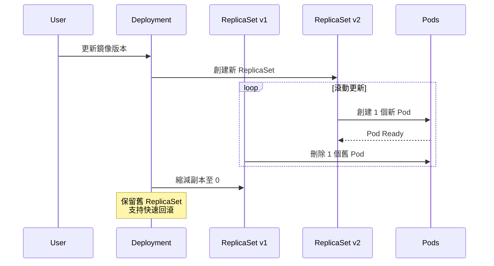

**更新策略配置：**

```yaml
apiVersion: apps/v1
kind: Deployment
metadata:
  name: nginx
spec:
  replicas: 10
  
  strategy:
    type: RollingUpdate
    rollingUpdate:
      maxSurge: 2
      maxUnavailable: 1
  
  revisionHistoryLimit: 5
  
  progressDeadlineSeconds: 600
  
  template:
    spec:
      containers:
      - name: nginx
        image: nginx:1.27
```

**參數說明：**
- `maxSurge`：允許超出期望副本數的 Pod 數量（可為數字或百分比）
- `maxUnavailable`：允許不可用的 Pod 數量
- `revisionHistoryLimit`：保留多少個舊 ReplicaSet（用於回滾）
- `progressDeadlineSeconds`：更新超時時間

**常用操作：**

```bash
kubectl rollout status deployment/nginx
kubectl rollout history deployment/nginx
kubectl rollout undo deployment/nginx
kubectl rollout undo deployment/nginx --to-revision=2

kubectl set image deployment/nginx nginx=nginx:1.28
kubectl scale deployment/nginx --replicas=5

kubectl patch deployment nginx -p '{"spec":{"replicas":3}}'
```

### 4.3 Service

**Service 類型與用途：**

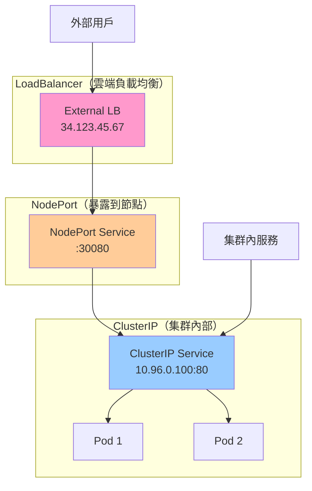

**完整 Service 配置：**

```yaml
apiVersion: v1
kind: Service
metadata:
  name: webapp
  labels:
    app: webapp
spec:
  type: ClusterIP
  
  selector:
    app: webapp
    tier: frontend
  
  ports:
  - name: http
    port: 80
    targetPort: 8080
    protocol: TCP
  
  - name: metrics
    port: 9090
    targetPort: metrics
  
  sessionAffinity: ClientIP
  sessionAffinityConfig:
    clientIP:
      timeoutSeconds: 3600
  
  ipFamilies:
  - IPv4
  ipFamilyPolicy: SingleStack
```

**Service 發現機制：**

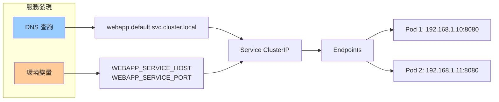

**開發者最佳實踐：**

1. **使用 DNS 名稱：**
   ```yaml
   env:
   - name: DB_HOST
     value: "postgres.database.svc.cluster.local"
   ```

2. **定義命名端口：**
   ```yaml
   ports:
   - name: http
     containerPort: 8080
   ```
   Service 可使用名稱引用：`targetPort: http`

3. **健康檢查與 Endpoints：**
   - 只有通過 readinessProbe 的 Pod 才會加入 Endpoints
   - 確保 Service 只轉發流量到健康 Pod

### 4.4 Namespace

**Namespace 用途：**

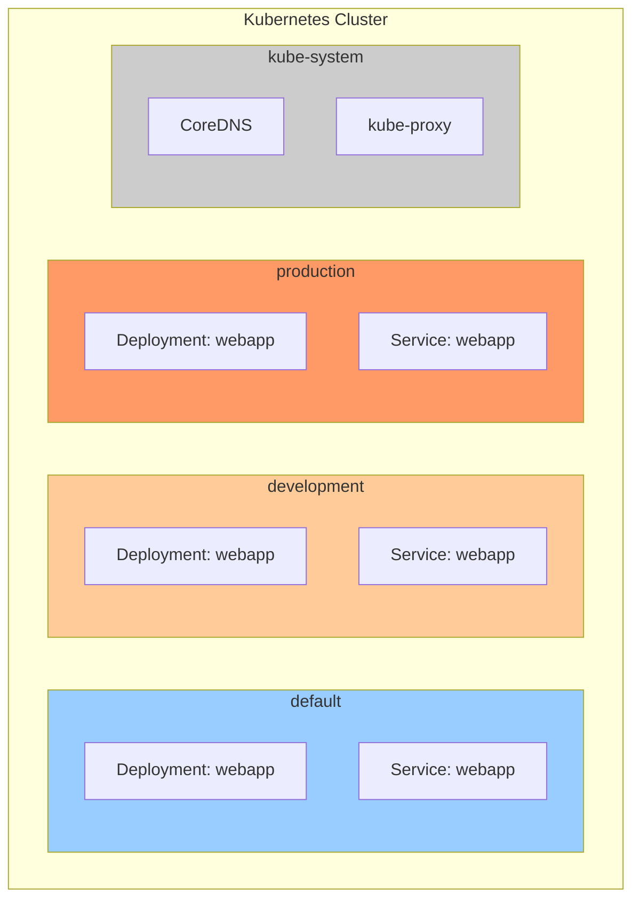

**資源隔離：**

```yaml
apiVersion: v1
kind: ResourceQuota
metadata:
  name: dev-quota
  namespace: development
spec:
  hard:
    requests.cpu: "10"
    requests.memory: 20Gi
    limits.cpu: "20"
    limits.memory: 40Gi
    persistentvolumeclaims: "10"
    pods: "50"
```

**最佳實踐：**
- 使用 namespace 區分環境（dev、staging、prod）
- 使用 namespace 區分團隊或項目
- 為每個 namespace 設置資源配額
- 使用 RBAC 限制 namespace 訪問權限

---

## 5. 開發者故障排查流程

### 5.1 Pod 異常排查

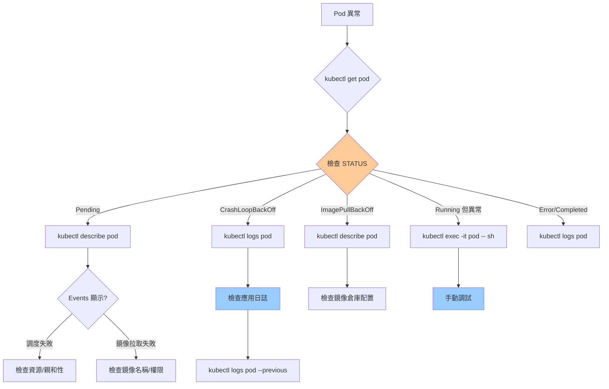

### 5.2 常用調試命令

```bash
kubectl get pods -o wide
kubectl get pods --show-labels
kubectl get pods -l app=nginx

kubectl describe pod <pod-name>

kubectl logs <pod-name>
kubectl logs <pod-name> -c <container-name>
kubectl logs <pod-name> --previous
kubectl logs -f <pod-name>

kubectl exec -it <pod-name> -- /bin/bash
kubectl exec <pod-name> -- ls /data

kubectl port-forward pod/<pod-name> 8080:80
kubectl port-forward svc/<service-name> 8080:80

kubectl get events --sort-by=.metadata.creationTimestamp
kubectl get events --field-selector involvedObject.name=<pod-name>

kubectl top nodes
kubectl top pods
```

### 5.3 網絡問題排查

```bash
kubectl run debug --rm -it --image=nicolaka/netshoot -- /bin/bash

nslookup webapp.default.svc.cluster.local

curl http://webapp.default.svc.cluster.local

telnet webapp.default.svc.cluster.local 80

traceroute webapp.default.svc.cluster.local
```

---

## 6. 小結

本章深入探討了 Kubernetes 的架構設計與核心組件：

**控制平面：**
- ✅ **API Server**：統一入口，RESTful API
- ✅ **etcd**：狀態儲存，集群真實來源
- ✅ **Scheduler**：Pod 調度，資源分配
- ✅ **Controller Manager**：控制迴路，狀態調和

**工作節點：**
- ✅ **Kubelet**：節點代理，Pod 生命週期管理
- ✅ **Container Runtime**：容器運行時（containerd/CRI-O）
- ✅ **kube-proxy**：網路代理，Service 負載均衡

**核心 API 物件：**
- ✅ **Pod**：最小調度單位
- ✅ **Deployment**：無狀態應用管理
- ✅ **Service**：服務發現與負載均衡
- ✅ **Namespace**：資源隔離

下一章將學習如何搭建本地開發環境，使用 Kind/k3d 和 Skaffold 提升開發效率。
