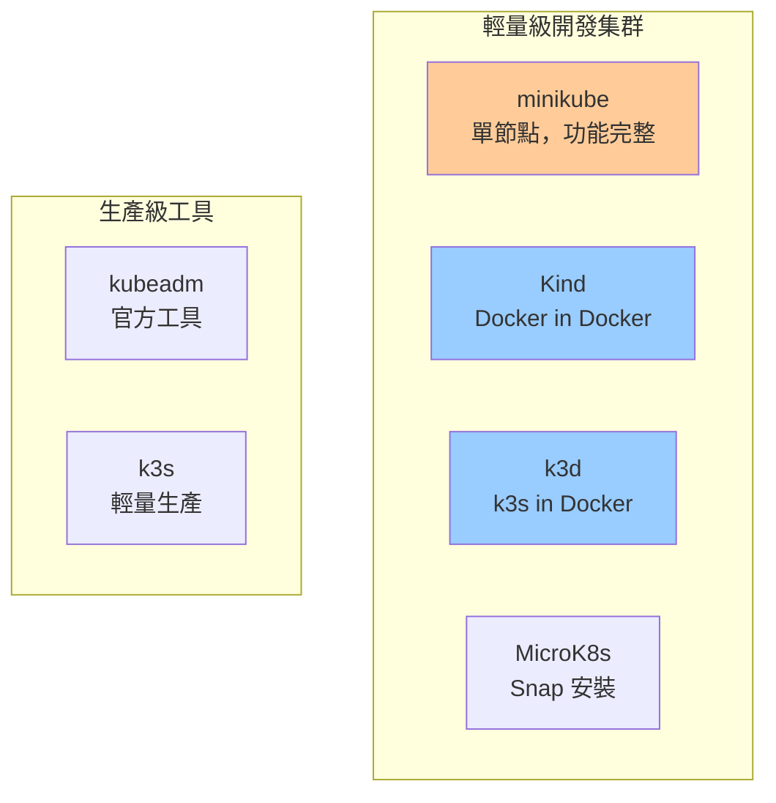
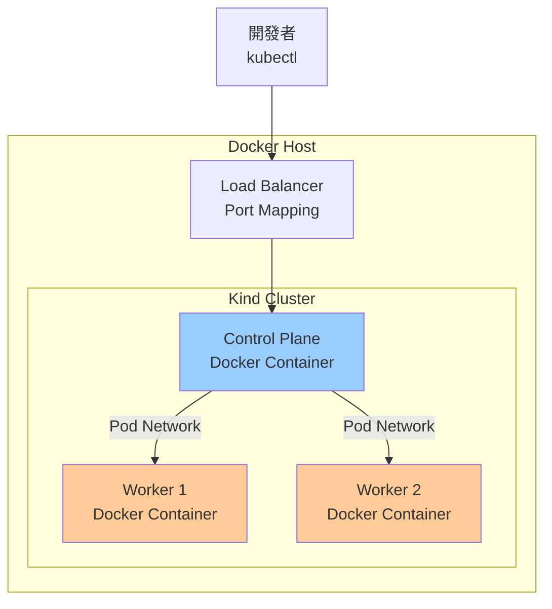
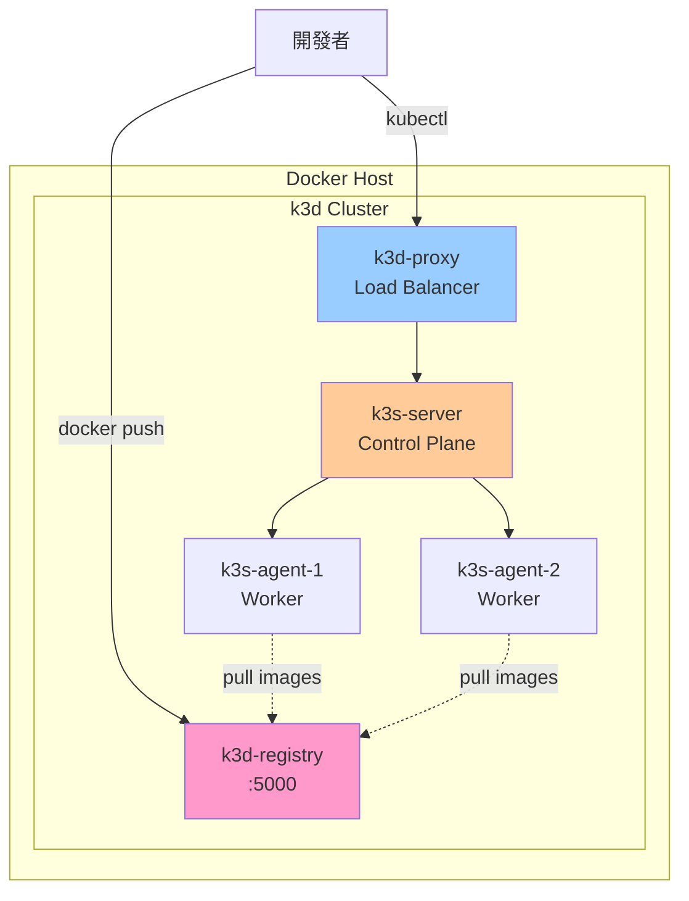
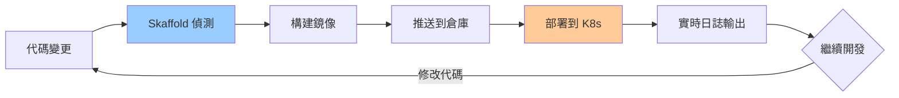
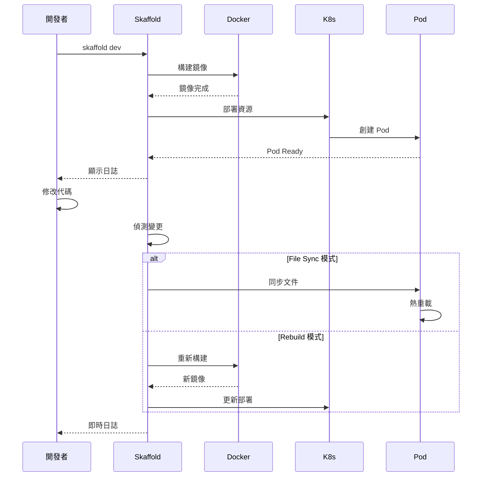

# 03-本地開發環境搭建

> 使用 Kind/k3d + Skaffold 打造高效的本地 Kubernetes 開發環境

---

## 📚 本章目標

- 選擇適合的本地 K8s 開發工具
- 快速搭建 Kind 或 k3d 集群
- 掌握 Skaffold 自動化開發工作流
- 整合 IDE 與調試工具

---

## 1. 本地開發工具對比

### 1.1 常見工具選型



### 1.2 工具對比表

| 工具                 | 啟動速度 | 資源佔用 | 多節點   | 推薦場景             |
| ------------------ | ---- | ---- | ----- | ---------------- |
| **Kind**           | ⚡⚡⚡  | 低    | ✅ 支持  | CI/CD、多節點測試      |
| **k3d**            | ⚡⚡⚡  | 極低   | ✅ 支持  | 日常開發、快速迭代        |
| **minikube**       | ⚡⚡   | 中    | ✅ 支持  | 功能學習、插件豐富        |
| **MicroK8s**       | ⚡⚡   | 中    | ✅ 支持  | Ubuntu 用戶        |
| **Docker Desktop** | ⚡    | 高    | ❌ 單節點 | Mac/Windows 簡單場景 |

**推薦組合：**
- **日常開發**：k3d + Skaffold
- **CI/CD**：Kind + Tekton
- **學習功能**：minikube + Dashboard

---

## 2. Kind 快速搭建

### 2.1 安裝 Kind

```bash
go install sigs.k8s.io/kind@v0.30.0
```

### 2.2 創建集群

**單節點集群：**
```bash
kind create cluster --name dev

kubectl cluster-info --context kind-dev
```

**多節點集群配置：**

創建 `kind-config.yaml`：
```yaml
kind: Cluster
apiVersion: kind.x-k8s.io/v1alpha4

name: dev-cluster

nodes:
- role: control-plane
  image: kindest/node:v1.30.0
  kubeadmConfigPatches:
  - |
    kind: InitConfiguration
    nodeRegistration:
      kubeletExtraArgs:
        node-labels: "ingress-ready=true"
  extraPortMappings:
  - containerPort: 80
    hostPort: 80
    protocol: TCP
  - containerPort: 443
    hostPort: 443
    protocol: TCP

- role: worker
  image: kindest/node:v1.30.0

- role: worker
  image: kindest/node:v1.30.0

networking:
  apiServerAddress: "0.0.0.0"
  apiServerPort: 6443
  podSubnet: "10.244.0.0/16"
  serviceSubnet: "10.96.0.0/12"
```

**啟動集群：**
```bash
kind create cluster --config kind-config.yaml

kubectl get nodes
```

**預期輸出：**
```
NAME                        STATUS   ROLES           AGE   VERSION
dev-cluster-control-plane   Ready    control-plane   60s   v1.30.0
dev-cluster-worker          Ready    <none>          40s   v1.30.0
dev-cluster-worker2         Ready    <none>          40s   v1.30.0
```

### 2.3 Kind 架構



### 2.4 常用操作

```bash
kind get clusters

kind delete cluster --name dev

kind load docker-image myapp:v1.0 --name dev

kind export kubeconfig --name dev

kubectl config get-contexts
kubectl config use-context kind-dev
```

---

## 3. k3d 快速搭建

### 3.1 安裝 k3d

```bash
wget -q -O - https://raw.githubusercontent.com/k3d-io/k3d/main/install.sh | bash

curl -s https://raw.githubusercontent.com/k3d-io/k3d/main/install.sh | bash

brew install k3d
```

### 3.2 創建集群

**單節點快速啟動：**
```bash
k3d cluster create dev

kubectl get nodes
```

**完整配置：**

創建 `k3d-config.yaml`：
```yaml
apiVersion: k3d.io/v1alpha5
kind: Simple

metadata:
  name: dev-cluster

servers: 1

agents: 2

image: rancher/k3s:v1.30.0-k3s1

ports:
  - port: 80:80
    nodeFilters:
      - loadbalancer
  - port: 443:443
    nodeFilters:
      - loadbalancer
  - port: 8080:8080
    nodeFilters:
      - loadbalancer

options:
  k3d:
    wait: true
    timeout: "60s"
    disableLoadbalancer: false
    disableImageVolume: false
  
  k3s:
    extraArgs:
      - arg: --disable=traefik
        nodeFilters:
          - server:*
  
  kubeconfig:
    updateDefaultKubeconfig: true
    switchCurrentContext: true

registries:
  create:
    name: registry.localhost
    host: "0.0.0.0"
    hostPort: "5000"
```

**啟動集群：**
```bash
k3d cluster create --config k3d-config.yaml

kubectl get nodes
```

### 3.3 k3d 架構



### 3.4 常用操作

```bash
k3d cluster list

k3d cluster delete dev

k3d image import myapp:v1.0 -c dev

k3d registry create myregistry.localhost --port 5555

docker tag myapp:v1.0 k3d-myregistry.localhost:5555/myapp:v1.0
docker push k3d-myregistry.localhost:5555/myapp:v1.0
```

---

## 4. Skaffold 自動化開發流程

### 4.1 Skaffold 是什麼

**核心功能：**
- **自動構建**：代碼變更自動構建鏡像
- **自動部署**：自動部署到 K8s
- **實時同步**：文件變更即時同步到 Pod
- **日誌聚合**：自動顯示所有 Pod 日誌



### 4.2 安裝 Skaffold

```bash
curl -Lo skaffold https://storage.googleapis.com/skaffold/releases/latest/skaffold-linux-amd64
chmod +x skaffold
sudo mv skaffold /usr/local/bin

brew install skaffold
```

### 4.3 項目配置

**目錄結構：**
```
my-app/
├── src/
│   ├── main.py
│   └── requirements.txt
├── Dockerfile
├── k8s/
│   ├── deployment.yaml
│   └── service.yaml
└── skaffold.yaml
```

**Dockerfile：**
```dockerfile
FROM python:3.12-slim

WORKDIR /app

COPY requirements.txt .
RUN pip install --no-cache-dir -r requirements.txt

COPY . .

EXPOSE 8080

CMD ["python", "main.py"]
```

**skaffold.yaml：**
```yaml
apiVersion: skaffold/v4beta11
kind: Config

metadata:
  name: my-app

build:
  artifacts:
  - image: myapp
    context: .
    docker:
      dockerfile: Dockerfile
    sync:
      manual:
      - src: "src/**/*.py"
        dest: /app/src
  
  local:
    push: false
    useBuildkit: true

deploy:
  kubectl:
    manifests:
    - k8s/*.yaml

portForward:
- resourceType: service
  resourceName: myapp
  port: 80
  localPort: 8080

profiles:
- name: dev
  activation:
  - command: dev
  
  build:
    artifacts:
    - image: myapp
      sync:
        infer:
        - "src/**/*.py"

- name: production
  build:
    artifacts:
    - image: registry.example.com/myapp
    
    tagPolicy:
      gitCommit:
        variant: AbbrevCommitSha
  
  deploy:
    helm:
      releases:
      - name: myapp
        chartPath: helm/myapp
        namespace: production
```

### 4.4 開發工作流

**啟動開發模式：**
```bash
skaffold dev

skaffold dev --port-forward
```

**工作流程：**



**其他命令：**
```bash
skaffold run

skaffold build

skaffold deploy

skaffold debug

skaffold render
```

---

## 5. IDE 整合

### 5.1 VS Code 配置

**安裝擴展：**
- Kubernetes
- Bridge to Kubernetes
- YAML
- Docker

**設置：**

創建 `.vscode/launch.json`：
```json
{
  "version": "0.2.0",
  "configurations": [
    {
      "name": "Kubernetes: Debug (skaffold)",
      "type": "cloudcode.kubernetes",
      "request": "launch",
      "skaffoldConfig": "${workspaceFolder}/skaffold.yaml",
      "watch": true,
      "cleanUp": true,
      "portForward": true
    }
  ]
}
```

### 5.2 調試配置

**Python 遠程調試：**

```python
import debugpy

debugpy.listen(("0.0.0.0", 5678))
print("Waiting for debugger attach...")
debugpy.wait_for_client()

app.run(host='0.0.0.0', port=8080)
```

**skaffold.yaml 調試配置：**
```yaml
build:
  artifacts:
  - image: myapp
    docker:
      dockerfile: Dockerfile.debug

portForward:
- resourceType: deployment
  resourceName: myapp
  port: 5678
  localPort: 5678
```

---

## 6. 本地鏡像倉庫

### 6.1 使用 k3d 內置倉庫

```bash
k3d cluster create dev --registry-create registry:0.0.0.0:5000

docker tag myapp:latest localhost:5000/myapp:latest
docker push localhost:5000/myapp:latest

kubectl run test --image=registry:5000/myapp:latest
```

### 6.2 配置 Harbor 本地倉庫

```yaml
apiVersion: v1
kind: ConfigMap
metadata:
  name: registry-config
  namespace: kube-system
data:
  registries.yaml: |
    mirrors:
      "harbor.local":
        endpoint:
          - "http://harbor.local"
    configs:
      "harbor.local":
        auth:
          username: admin
          password: Harbor12345
        tls:
          insecure_skip_verify: true
```

---

## 7. 開發環境最佳實踐

### 7.1 資源管理

**為開發集群設置資源限制：**

```bash
kind create cluster --config - <<EOF
kind: Cluster
apiVersion: kind.x-k8s.io/v1alpha4
nodes:
- role: control-plane
  extraMounts:
  - hostPath: /tmp/k8s-data
    containerPath: /data
  kubeadmConfigPatches:
  - |
    kind: InitConfiguration
    nodeRegistration:
      kubeletExtraArgs:
        system-reserved: cpu=500m,memory=512Mi
        kube-reserved: cpu=500m,memory=512Mi
EOF
```

### 7.2 命名空間隔離

```yaml
apiVersion: v1
kind: Namespace
metadata:
  name: dev
  labels:
    env: development

---
apiVersion: v1
kind: ResourceQuota
metadata:
  name: dev-quota
  namespace: dev
spec:
  hard:
    requests.cpu: "4"
    requests.memory: 8Gi
    limits.cpu: "8"
    limits.memory: 16Gi
    pods: "20"
```

### 7.3 快速重置環境

```bash
alias k-reset='kubectl delete all --all -n dev && kubectl apply -f k8s/'

alias k-logs='kubectl logs -f -l app=myapp --all-containers=true'

alias k-restart='kubectl rollout restart deployment -n dev'
```

---

## 8. 常見問題與解決

### 8.1 鏡像拉取問題

**問題：** `ImagePullBackOff`

**解決方案：**
```bash
kind load docker-image myapp:latest --name dev

k3d image import myapp:latest -c dev

docker tag myapp:latest localhost:5000/myapp:latest
docker push localhost:5000/myapp:latest
```

### 8.2 端口衝突

**問題：** 端口已被佔用

```bash
lsof -i :80
kill -9 <PID>

k3d cluster create dev -p "8080:80@loadbalancer"
```

### 8.3 資源不足

```bash
docker system prune -a

kind delete cluster --name old-cluster

docker update --memory 4g --cpus 2 <container-id>
```

---

## 9. 完整開發流程示例

### 9.1 初始化項目

```bash
mkdir my-k8s-app && cd my-k8s-app

cat > main.py <<EOF
from flask import Flask
app = Flask(__name__)

@app.route('/')
def hello():
    return 'Hello from Kubernetes!'

if __name__ == '__main__':
    app.run(host='0.0.0.0', port=8080)
EOF

cat > requirements.txt <<EOF
flask==3.0.0
EOF

cat > Dockerfile <<EOF
FROM python:3.12-slim
WORKDIR /app
COPY requirements.txt .
RUN pip install -r requirements.txt
COPY . .
CMD ["python", "main.py"]
EOF

mkdir k8s
cat > k8s/deployment.yaml <<EOF
apiVersion: apps/v1
kind: Deployment
metadata:
  name: myapp
spec:
  replicas: 2
  selector:
    matchLabels:
      app: myapp
  template:
    metadata:
      labels:
        app: myapp
    spec:
      containers:
      - name: myapp
        image: myapp
        ports:
        - containerPort: 8080
---
apiVersion: v1
kind: Service
metadata:
  name: myapp
spec:
  selector:
    app: myapp
  ports:
  - port: 80
    targetPort: 8080
EOF

skaffold init
```

### 9.2 啟動開發

```bash
k3d cluster create dev -p "8080:80@loadbalancer"

skaffold dev --port-forward
```

**預期輸出：**
```
Generating tags...
 - myapp -> myapp:latest
Checking cache...
 - myapp: Not found. Building
Building [myapp]...
...
Tags used in deployment:
 - myapp -> myapp:latest
Starting deploy...
 - deployment.apps/myapp created
 - service/myapp created
Waiting for deployments to stabilize...
 - deployment/myapp is ready.
Deployments stabilized in 3.456s
Port forwarding service/myapp in namespace default, remote port 80 -> http://127.0.0.1:8080
Press Ctrl+C to exit
Watching for changes...
```

訪問：`http://localhost:8080`

### 9.3 實時開發

**修改 `main.py`：**
```python
@app.route('/')
def hello():
    return 'Hello from Kubernetes! (Updated)'
```

**Skaffold 自動重新部署：**
```
Generating tags...
Checking cache...
Building [myapp]...
...
Deploying...
Starting deploy...
 - deployment.apps/myapp configured
Deployments stabilized in 1.234s
```

刷新瀏覽器即可看到更新。

---

## 10. 小結

本章介紹了本地 Kubernetes 開發環境的搭建與最佳實踐：

**工具選擇：**
- ✅ **Kind**：適合 CI/CD 和多節點測試
- ✅ **k3d**：輕量快速，日常開發首選
- ✅ **Skaffold**：自動化開發工作流

**核心優勢：**
- ⚡ **快速啟動**：秒級創建集群
- 🔄 **熱重載**：代碼變更即時生效
- 🎯 **環境一致**：開發與生產配置一致
- 🛠️ **IDE 整合**：無縫調試體驗

**下一步：**
- 學習應用容器化與遷移策略（Part II）
- 掌握配置管理與 Helm 使用
- 了解微服務通信與 Service Mesh

現在你已經具備了高效的本地開發環境，可以開始實際的應用開發了！
