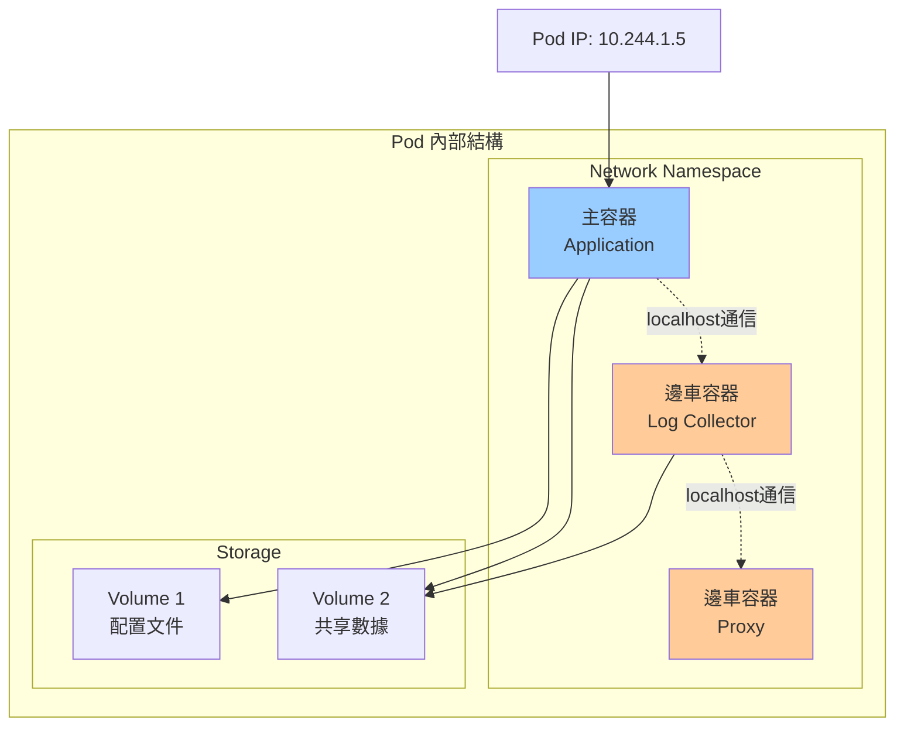
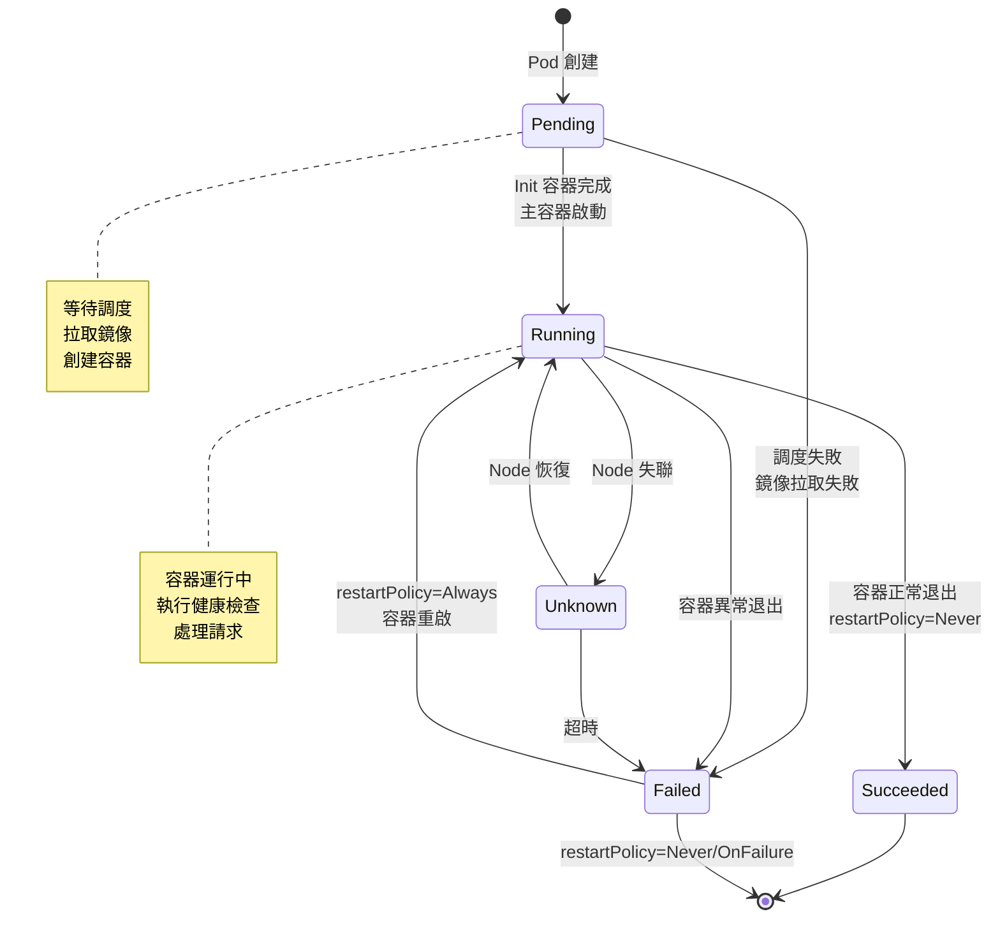
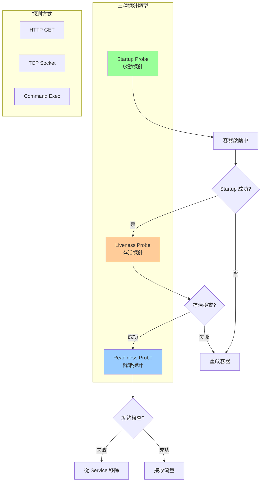
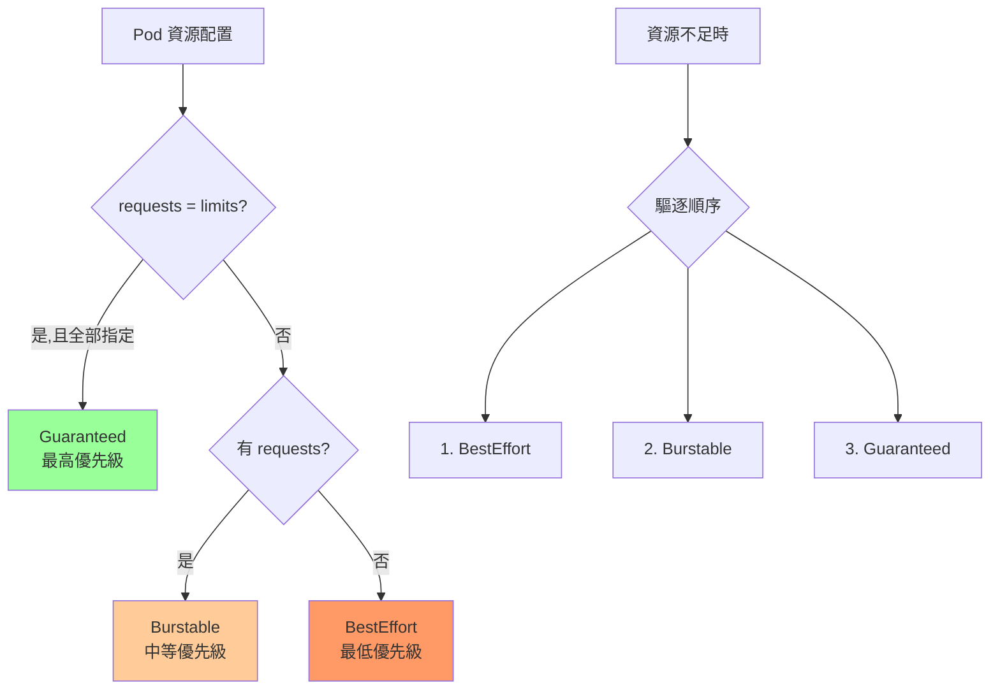
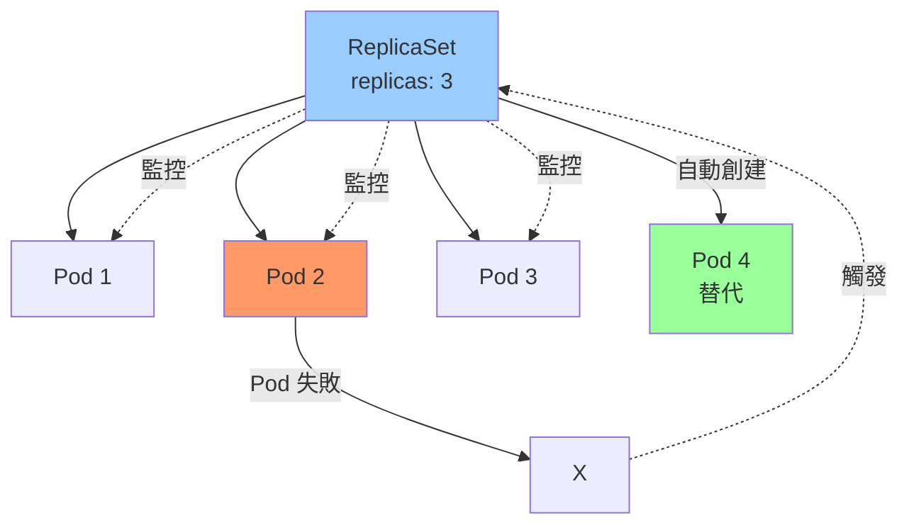
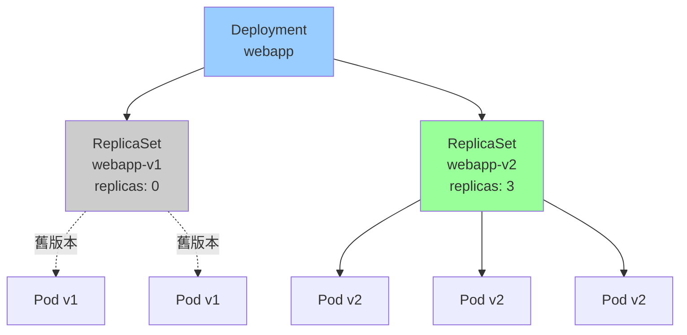
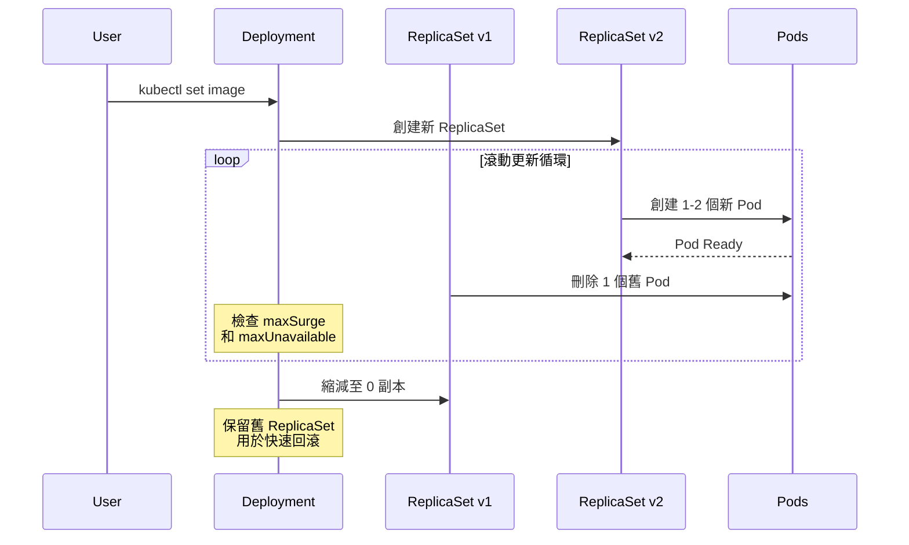
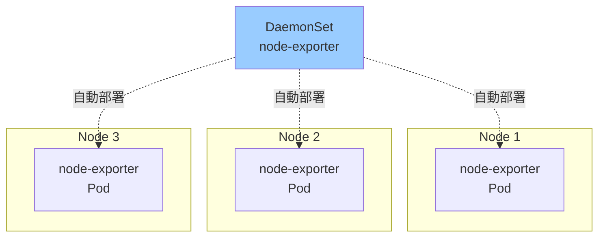
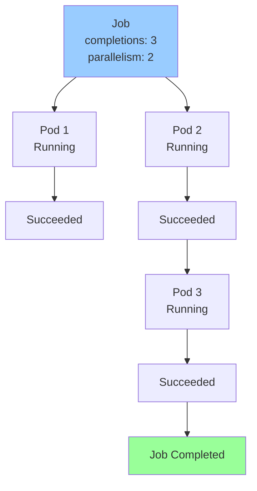

# 04-Workload 資源詳解

> 深入掌握 Kubernetes 工作負載資源的完整配置與使用

---

## 📚 本章目標

- 深入理解 Pod 完整生命週期與調度機制
- 掌握 Deployment、StatefulSet、DaemonSet 的使用場景
- 學會 Job 與 CronJob 批次任務管理
- 理解 ReplicaSet 的工作原理
- 掌握各種 Workload 資源的最佳實踐

---

## 1. Pod 深度解析

### 1.1 Pod 是什麼

Pod 是 Kubernetes 最小的調度單位，代表集群中運行的一個進程。



**核心特性：**
- ✅ 共享網絡命名空間（同一 Pod 內容器共享 IP）
- ✅ 共享 IPC 命名空間（進程間通信）
- ✅ 共享 UTS 命名空間（主機名）
- ✅ 可選共享 PID 命名空間
- ✅ 共享 Volume 存儲卷

---

### 1.2 Pod 完整生命週期



**Pod 階段 (Phase) 詳解：**

| 階段 | 說明 | 常見原因 |
|-----|------|---------|
| **Pending** | 已創建但未運行 | 等待調度、拉取鏡像、創建容器 |
| **Running** | 至少一個容器運行中 | 正常運行狀態 |
| **Succeeded** | 所有容器成功終止 | Job/CronJob 正常完成 |
| **Failed** | 所有容器終止，至少一個失敗 | 應用錯誤、OOM、退出碼非 0 |
| **Unknown** | 無法獲取 Pod 狀態 | Node 通信失敗 |

---

### 1.3 完整 Pod 配置示例

```yaml
apiVersion: v1
kind: Pod
metadata:
  name: webapp
  namespace: production
  labels:
    app: webapp
    tier: frontend
    version: v1.0
  annotations:
    prometheus.io/scrape: "true"
    prometheus.io/port: "9090"

spec:
  # ============ Init Containers ============
  initContainers:
  - name: wait-for-db
    image: busybox:1.36
    command: ['sh', '-c']
    args:
    - |
      until nc -z postgres.database.svc.cluster.local 5432; do
        echo "Waiting for database..."
        sleep 2
      done
      echo "Database is ready!"
  
  - name: setup-config
    image: busybox:1.36
    command: ['sh', '-c', 'cp /config/* /app-config/']
    volumeMounts:
    - name: config
      mountPath: /config
    - name: app-config
      mountPath: /app-config
  
  # ============ Main Containers ============
  containers:
  - name: app
    image: myregistry.io/webapp:v1.0
    imagePullPolicy: IfNotPresent
    
    # 端口定義
    ports:
    - name: http
      containerPort: 8080
      protocol: TCP
    - name: metrics
      containerPort: 9090
      protocol: TCP
    
    # 環境變量
    env:
    - name: APP_NAME
      value: "webapp"
    - name: POD_NAME
      valueFrom:
        fieldRef:
          fieldPath: metadata.name
    - name: POD_NAMESPACE
      valueFrom:
        fieldRef:
          fieldPath: metadata.namespace
    - name: POD_IP
      valueFrom:
        fieldRef:
          fieldPath: status.podIP
    - name: DB_HOST
      value: "postgres.database.svc.cluster.local"
    - name: DB_PASSWORD
      valueFrom:
        secretKeyRef:
          name: db-credentials
          key: password
    
    # 從 ConfigMap 注入
    envFrom:
    - configMapRef:
        name: app-config
    - secretRef:
        name: app-secrets
    
    # 資源限制
    resources:
      requests:
        cpu: 100m
        memory: 128Mi
        ephemeral-storage: 1Gi
      limits:
        cpu: 1000m
        memory: 512Mi
        ephemeral-storage: 2Gi
    
    # 健康檢查
    livenessProbe:
      httpGet:
        path: /healthz
        port: http
        scheme: HTTP
      initialDelaySeconds: 30
      periodSeconds: 10
      timeoutSeconds: 5
      successThreshold: 1
      failureThreshold: 3
    
    readinessProbe:
      httpGet:
        path: /ready
        port: http
      initialDelaySeconds: 5
      periodSeconds: 5
      timeoutSeconds: 3
      failureThreshold: 3
    
    startupProbe:
      httpGet:
        path: /startup
        port: http
      initialDelaySeconds: 0
      periodSeconds: 10
      timeoutSeconds: 3
      failureThreshold: 30
    
    # 生命週期鉤子
    lifecycle:
      postStart:
        exec:
          command: ["/bin/sh", "-c", "echo 'Container started' >> /var/log/lifecycle.log"]
      preStop:
        exec:
          command: ["/bin/sh", "-c", "sleep 15"]
    
    # Volume 掛載
    volumeMounts:
    - name: app-config
      mountPath: /etc/config
      readOnly: true
    - name: data
      mountPath: /data
    - name: logs
      mountPath: /var/log/app
    
    # 安全上下文
    securityContext:
      runAsUser: 1000
      runAsGroup: 3000
      fsGroup: 2000
      runAsNonRoot: true
      readOnlyRootFilesystem: true
      allowPrivilegeEscalation: false
      capabilities:
        drop:
        - ALL
        add:
        - NET_BIND_SERVICE
  
  # Sidecar 容器：日誌收集
  - name: log-collector
    image: fluent/fluent-bit:2.1
    volumeMounts:
    - name: logs
      mountPath: /var/log/app
      readOnly: true
    - name: fluentbit-config
      mountPath: /fluent-bit/etc
    resources:
      requests:
        cpu: 50m
        memory: 64Mi
      limits:
        cpu: 200m
        memory: 128Mi
  
  # ============ Volumes ============
  volumes:
  - name: config
    configMap:
      name: webapp-config
  - name: app-config
    emptyDir: {}
  - name: data
    persistentVolumeClaim:
      claimName: webapp-data
  - name: logs
    emptyDir: {}
  - name: fluentbit-config
    configMap:
      name: fluentbit-config
  
  # ============ Pod 調度配置 ============
  # 重啟策略
  restartPolicy: Always
  
  # 終止寬限期
  terminationGracePeriodSeconds: 30
  
  # DNS 配置
  dnsPolicy: ClusterFirst
  dnsConfig:
    nameservers:
    - 8.8.8.8
    searches:
    - default.svc.cluster.local
    - svc.cluster.local
    options:
    - name: ndots
      value: "2"
  
  # 主機名配置
  hostname: webapp
  subdomain: webapp-service
  
  # 節點選擇器
  nodeSelector:
    disktype: ssd
    environment: production
  
  # 親和性規則
  affinity:
    # Pod 反親和性：避免同一節點運行多個副本
    podAntiAffinity:
      preferredDuringSchedulingIgnoredDuringExecution:
      - weight: 100
        podAffinityTerm:
          labelSelector:
            matchExpressions:
            - key: app
              operator: In
              values:
              - webapp
          topologyKey: kubernetes.io/hostname
    
    # 節點親和性：優先調度到特定節點
    nodeAffinity:
      requiredDuringSchedulingIgnoredDuringExecution:
        nodeSelectorTerms:
        - matchExpressions:
          - key: node-role.kubernetes.io/worker
            operator: Exists
      preferredDuringSchedulingIgnoredDuringExecution:
      - weight: 50
        preference:
          matchExpressions:
          - key: zone
            operator: In
            values:
            - us-west-1a
  
  # 污點容忍
  tolerations:
  - key: "workload"
    operator: "Equal"
    value: "frontend"
    effect: "NoSchedule"
  - key: "node.kubernetes.io/memory-pressure"
    operator: "Exists"
    effect: "NoExecute"
    tolerationSeconds: 300
  
  # 優先級
  priorityClassName: high-priority
  
  # 服務賬號
  serviceAccountName: webapp-sa
  automountServiceAccountToken: true
  
  # 共享進程命名空間
  shareProcessNamespace: false
  
  # 主機網絡（謹慎使用）
  hostNetwork: false
  hostPID: false
  hostIPC: false
  
  # 鏡像拉取密鑰
  imagePullSecrets:
  - name: regcred
```

---

### 1.4 Init Containers 深入

**用途：**
- ✅ 等待依賴服務就緒（數據庫、緩存）
- ✅ 初始化配置文件
- ✅ 註冊服務
- ✅ 數據庫遷移

**特性：**
- 按順序依次執行
- 必須全部成功完成主容器才會啟動
- 不支持 lifecycle、livenessProbe、readinessProbe

```yaml
initContainers:
- name: db-migration
  image: migrate/migrate:v4
  command:
  - migrate
  - -path=/migrations
  - -database=postgres://user:pass@db:5432/mydb?sslmode=disable
  - up
  volumeMounts:
  - name: migrations
    mountPath: /migrations
```

---

### 1.5 容器探針 (Probes) 詳解



**探針類型對比：**

| 探針 | 用途 | 失敗後果 | 使用場景 |
|-----|------|---------|---------|
| **startupProbe** | 檢查應用是否啟動完成 | 重啟容器 | 啟動慢的應用（Java、大型模型） |
| **livenessProbe** | 檢查應用是否還活著 | 重啟容器 | 檢測死鎖、進程掛起 |
| **readinessProbe** | 檢查應用是否就緒 | 從 Service 移除 | 暫時不可用（等待緩存、連接池） |

**探測方式：**

```yaml
# HTTP GET
livenessProbe:
  httpGet:
    path: /healthz
    port: 8080
    httpHeaders:
    - name: Custom-Header
      value: Awesome
  initialDelaySeconds: 30
  periodSeconds: 10

# TCP Socket
livenessProbe:
  tcpSocket:
    port: 5432
  initialDelaySeconds: 15
  periodSeconds: 20

# Exec 命令
livenessProbe:
  exec:
    command:
    - cat
    - /tmp/healthy
  initialDelaySeconds: 5
  periodSeconds: 5
```

**探針參數：**

| 參數 | 說明 | 默認值 |
|-----|------|--------|
| `initialDelaySeconds` | 容器啟動後等待時間 | 0 |
| `periodSeconds` | 檢查間隔 | 10 |
| `timeoutSeconds` | 超時時間 | 1 |
| `successThreshold` | 成功閾值 | 1 |
| `failureThreshold` | 失敗閾值 | 3 |

---

### 1.6 Pod QoS 等級

Kubernetes 根據 Pod 的資源配置自動分配 QoS 等級：



**1. Guaranteed（保證型）**

```yaml
resources:
  requests:
    cpu: 500m
    memory: 512Mi
  limits:
    cpu: 500m
    memory: 512Mi
```

- ✅ 所有容器都設置了 requests 和 limits
- ✅ 每個資源的 requests = limits
- ✅ 最不容易被驅逐

**2. Burstable（可突發型）**

```yaml
resources:
  requests:
    cpu: 100m
    memory: 128Mi
  limits:
    cpu: 500m
    memory: 512Mi
```

- ✅ 至少一個容器設置了 requests 或 limits
- ✅ 不滿足 Guaranteed 條件
- ✅ 中等優先級

**3. BestEffort（盡力而為型）**

```yaml
# 沒有設置任何 resources
```

- ✅ 所有容器都沒有 requests 和 limits
- ✅ 最先被驅逐
- ✅ 僅適合開發環境或非關鍵任務

---

### 1.7 Pod 調度約束

#### 1.7.1 nodeSelector（最簡單）

```yaml
nodeSelector:
  disktype: ssd
  environment: production
```

#### 1.7.2 Node Affinity（更靈活）

```yaml
affinity:
  nodeAffinity:
    # 硬性要求（必須滿足）
    requiredDuringSchedulingIgnoredDuringExecution:
      nodeSelectorTerms:
      - matchExpressions:
        - key: kubernetes.io/arch
          operator: In
          values:
          - amd64
          - arm64
    
    # 軟性偏好（優先滿足）
    preferredDuringSchedulingIgnoredDuringExecution:
    - weight: 80
      preference:
        matchExpressions:
        - key: zone
          operator: In
          values:
          - us-west-1a
    - weight: 20
      preference:
        matchExpressions:
        - key: instance-type
          operator: In
          values:
          - c5.xlarge
```

**操作符：**
- `In`：值在列表中
- `NotIn`：值不在列表中
- `Exists`：鍵存在
- `DoesNotExist`：鍵不存在
- `Gt`：大於
- `Lt`：小於

#### 1.7.3 Pod Affinity / Anti-Affinity

```yaml
affinity:
  # Pod 親和性：調度到相同節點
  podAffinity:
    requiredDuringSchedulingIgnoredDuringExecution:
    - labelSelector:
        matchExpressions:
        - key: app
          operator: In
          values:
          - cache
      topologyKey: kubernetes.io/hostname
  
  # Pod 反親和性：分散到不同節點
  podAntiAffinity:
    preferredDuringSchedulingIgnoredDuringExecution:
    - weight: 100
      podAffinityTerm:
        labelSelector:
          matchExpressions:
          - key: app
            operator: In
            values:
            - webapp
        topologyKey: kubernetes.io/hostname
```

**topologyKey 常用值：**
- `kubernetes.io/hostname`：節點級別
- `topology.kubernetes.io/zone`：可用區級別
- `topology.kubernetes.io/region`：區域級別

#### 1.7.4 Taints 與 Tolerations

```yaml
# 在 Node 上設置污點
kubectl taint nodes node1 key=value:NoSchedule

# Pod 容忍污點
tolerations:
- key: "key"
  operator: "Equal"
  value: "value"
  effect: "NoSchedule"
- key: "node.kubernetes.io/not-ready"
  operator: "Exists"
  effect: "NoExecute"
  tolerationSeconds: 300
```

**Effect 類型：**
- `NoSchedule`：不調度新 Pod
- `PreferNoSchedule`：盡量不調度
- `NoExecute`：驅逐現有 Pod

---

### 1.8 Pod 安全上下文

```yaml
# Pod 級別
securityContext:
  runAsUser: 1000
  runAsGroup: 3000
  fsGroup: 2000
  fsGroupChangePolicy: "OnRootMismatch"
  seccompProfile:
    type: RuntimeDefault
  supplementalGroups:
  - 4000

# 容器級別
containers:
- name: app
  securityContext:
    runAsNonRoot: true
    readOnlyRootFilesystem: true
    allowPrivilegeEscalation: false
    capabilities:
      drop:
      - ALL
      add:
      - NET_BIND_SERVICE
```

---

## 2. ReplicaSet

### 2.1 ReplicaSet 基礎

ReplicaSet 確保指定數量的 Pod 副本在運行。



### 2.2 ReplicaSet 配置

```yaml
apiVersion: apps/v1
kind: ReplicaSet
metadata:
  name: webapp-rs
  labels:
    app: webapp
spec:
  replicas: 3
  
  # 選擇器（必須匹配 template.metadata.labels）
  selector:
    matchLabels:
      app: webapp
      tier: frontend
    matchExpressions:
    - key: version
      operator: In
      values:
      - v1
      - v2
  
  # Pod 模板
  template:
    metadata:
      labels:
        app: webapp
        tier: frontend
        version: v1
    spec:
      containers:
      - name: webapp
        image: nginx:1.27
        ports:
        - containerPort: 80
```

### 2.3 ReplicaSet 操作

```bash
# 查看 ReplicaSet
kubectl get rs
kubectl describe rs webapp-rs

# 擴縮容
kubectl scale rs webapp-rs --replicas=5

# 刪除 ReplicaSet（保留 Pod）
kubectl delete rs webapp-rs --cascade=orphan

# 刪除 ReplicaSet（同時刪除 Pod）
kubectl delete rs webapp-rs
```

**注意：**
- ⚠️ 實際應用中很少直接使用 ReplicaSet
- ⚠️ 通常通過 Deployment 管理 ReplicaSet
- ⚠️ ReplicaSet 不支持滾動更新

---

## 3. Deployment

### 3.1 Deployment 管理層級



### 3.2 完整 Deployment 配置

```yaml
apiVersion: apps/v1
kind: Deployment
metadata:
  name: webapp
  namespace: production
  labels:
    app: webapp
  annotations:
    kubernetes.io/change-cause: "Update to v2.0"

spec:
  replicas: 5
  
  # 選擇器
  selector:
    matchLabels:
      app: webapp
  
  # 更新策略
  strategy:
    type: RollingUpdate
    rollingUpdate:
      maxSurge: 2          # 最多超出副本數
      maxUnavailable: 1    # 最多不可用副本數
  
  # 最小就緒時間
  minReadySeconds: 10
  
  # 進度超時
  progressDeadlineSeconds: 600
  
  # 保留歷史版本數
  revisionHistoryLimit: 10
  
  # Pod 模板
  template:
    metadata:
      labels:
        app: webapp
        version: v2.0
      annotations:
        prometheus.io/scrape: "true"
    spec:
      containers:
      - name: webapp
        image: myregistry.io/webapp:v2.0
        ports:
        - containerPort: 8080
        
        resources:
          requests:
            cpu: 100m
            memory: 128Mi
          limits:
            cpu: 500m
            memory: 512Mi
        
        livenessProbe:
          httpGet:
            path: /healthz
            port: 8080
          initialDelaySeconds: 30
          periodSeconds: 10
        
        readinessProbe:
          httpGet:
            path: /ready
            port: 8080
          initialDelaySeconds: 5
          periodSeconds: 5
```

### 3.3 滾動更新流程



### 3.4 更新策略詳解

#### RollingUpdate（滾動更新）

```yaml
strategy:
  type: RollingUpdate
  rollingUpdate:
    maxSurge: 25%        # 可以是數字或百分比
    maxUnavailable: 25%
```

**計算示例（replicas=10）：**
- `maxSurge: 2` → 最多 12 個 Pod 同時存在
- `maxUnavailable: 1` → 最少 9 個 Pod 可用
- 更新過程：10 → 12 → 11 → 12 → 11 → 12 → 10

#### Recreate（重建）

```yaml
strategy:
  type: Recreate
```

- 先刪除所有舊 Pod
- 再創建新 Pod
- 會有停機時間
- 適合：不支持多版本並存的應用

### 3.5 Deployment 操作

```bash
# 創建 Deployment
kubectl apply -f deployment.yaml

# 查看狀態
kubectl get deployments
kubectl rollout status deployment/webapp
kubectl get rs
kubectl get pods

# 更新鏡像
kubectl set image deployment/webapp webapp=myapp:v2.0

# 編輯 Deployment
kubectl edit deployment webapp

# 查看歷史
kubectl rollout history deployment/webapp
kubectl rollout history deployment/webapp --revision=3

# 回滾
kubectl rollout undo deployment/webapp
kubectl rollout undo deployment/webapp --to-revision=2

# 暫停/恢復更新
kubectl rollout pause deployment/webapp
kubectl rollout resume deployment/webapp

# 擴縮容
kubectl scale deployment webapp --replicas=10

# 自動擴縮容
kubectl autoscale deployment webapp --min=3 --max=10 --cpu-percent=70

# 刪除
kubectl delete deployment webapp
```

### 3.6 更新觸發條件

以下修改會觸發滾動更新：
- ✅ 容器鏡像版本變更
- ✅ 容器環境變量變更
- ✅ 容器資源限制變更
- ✅ 容器命令/參數變更
- ✅ Pod labels/annotations 變更

以下修改不會觸發更新：
- ❌ 修改 `replicas`（僅擴縮容）
- ❌ 修改 `strategy`
- ❌ 修改 `revisionHistoryLimit`

---

## 4. StatefulSet

### 4.1 StatefulSet 特性

StatefulSet 用於有狀態應用，提供：
- ✅ 穩定的網絡標識（固定主機名）
- ✅ 穩定的持久化存儲
- ✅ 有序部署和擴縮容
- ✅ 有序刪除和終止

```mermaid
graph TB
    subgraph "StatefulSet"
        SS[StatefulSet<br/>mysql<br/>replicas: 3]
    end
    
    subgraph "Pods (有序創建)"
        P0[mysql-0<br/>主節點]
        P1[mysql-1<br/>從節點]
        P2[mysql-2<br/>從節點]
    end
    
    subgraph "PersistentVolumes"
        PV0[PVC-0<br/>10Gi]
        PV1[PVC-1<br/>10Gi]
        PV2[PVC-2<br/>10Gi]
    end
    
    subgraph "Headless Service"
        HS[mysql.default.svc.cluster.local]
    end
    
    SS --> P0
    SS --> P1
    SS --> P2
    
    P0 --> PV0
    P1 --> PV1
    P2 --> PV2
    
    HS --> P0
    HS --> P1
    HS --> P2
    
    P0 -.mysql-0.mysql.default.svc.cluster.local.-> HS
    
    style SS fill:#9cf
    style P0 fill:#9f9
```

### 4.2 完整 StatefulSet 配置

```yaml
apiVersion: v1
kind: Service
metadata:
  name: mysql
  labels:
    app: mysql
spec:
  clusterIP: None    # Headless Service
  selector:
    app: mysql
  ports:
  - port: 3306
    name: mysql

---
apiVersion: apps/v1
kind: StatefulSet
metadata:
  name: mysql
spec:
  serviceName: mysql
  replicas: 3
  
  selector:
    matchLabels:
      app: mysql
  
  # 更新策略
  updateStrategy:
    type: RollingUpdate
    rollingUpdate:
      partition: 0    # 從第 N 個 Pod 開始更新
  
  # Pod 管理策略
  podManagementPolicy: OrderedReady    # OrderedReady 或 Parallel
  
  # 最小就緒秒數
  minReadySeconds: 10
  
  template:
    metadata:
      labels:
        app: mysql
    spec:
      initContainers:
      - name: init-mysql
        image: mysql:8.0
        command:
        - bash
        - "-c"
        - |
          set -ex
          # 根據 Pod 序號生成 server-id
          [[ `hostname` =~ -([0-9]+)$ ]] || exit 1
          ordinal=${BASH_REMATCH[1]}
          echo [mysqld] > /mnt/conf.d/server-id.cnf
          echo server-id=$((100 + $ordinal)) >> /mnt/conf.d/server-id.cnf
          
          # 判斷是主節點還是從節點
          if [[ $ordinal -eq 0 ]]; then
            cp /mnt/config-map/master.cnf /mnt/conf.d/
          else
            cp /mnt/config-map/slave.cnf /mnt/conf.d/
          fi
        volumeMounts:
        - name: conf
          mountPath: /mnt/conf.d
        - name: config-map
          mountPath: /mnt/config-map
      
      containers:
      - name: mysql
        image: mysql:8.0
        env:
        - name: MYSQL_ROOT_PASSWORD
          valueFrom:
            secretKeyRef:
              name: mysql-secret
              key: password
        
        ports:
        - containerPort: 3306
          name: mysql
        
        volumeMounts:
        - name: data
          mountPath: /var/lib/mysql
          subPath: mysql
        - name: conf
          mountPath: /etc/mysql/conf.d
        
        resources:
          requests:
            cpu: 500m
            memory: 1Gi
          limits:
            cpu: 1000m
            memory: 2Gi
        
        livenessProbe:
          exec:
            command:
            - mysqladmin
            - ping
            - -h
            - localhost
          initialDelaySeconds: 30
          periodSeconds: 10
        
        readinessProbe:
          exec:
            command:
            - mysql
            - -h
            - localhost
            - -e
            - SELECT 1
          initialDelaySeconds: 5
          periodSeconds: 5
      
      volumes:
      - name: conf
        emptyDir: {}
      - name: config-map
        configMap:
          name: mysql-config
  
  # VolumeClaimTemplates（自動創建 PVC）
  volumeClaimTemplates:
  - metadata:
      name: data
    spec:
      accessModes: ["ReadWriteOnce"]
      storageClassName: "fast-ssd"
      resources:
        requests:
          storage: 10Gi
```

### 4.3 StatefulSet 網絡標識

```bash
# Pod DNS 格式
$(pod-name).$(service-name).$(namespace).svc.cluster.local

# 示例
mysql-0.mysql.default.svc.cluster.local
mysql-1.mysql.default.svc.cluster.local
mysql-2.mysql.default.svc.cluster.local
```

### 4.4 StatefulSet 操作

```bash
# 創建
kubectl apply -f statefulset.yaml

# 查看
kubectl get statefulsets
kubectl get pods -l app=mysql
kubectl get pvc

# 擴容（有序創建）
kubectl scale statefulset mysql --replicas=5

# 縮容（逆序刪除）
kubectl scale statefulset mysql --replicas=2

# 刪除 Pod（會自動重建，保留 PVC）
kubectl delete pod mysql-1

# 刪除 StatefulSet（保留 Pod）
kubectl delete statefulset mysql --cascade=orphan

# 刪除 StatefulSet（刪除 Pod，但保留 PVC）
kubectl delete statefulset mysql

# 手動刪除 PVC
kubectl delete pvc data-mysql-0
```

### 4.5 更新策略

```yaml
updateStrategy:
  type: RollingUpdate
  rollingUpdate:
    partition: 2    # 只更新序號 >= 2 的 Pod
```

**partition 用途：**
- 金絲雀發布（先更新高序號 Pod 測試）
- 分階段更新

---

## 5. DaemonSet

### 5.1 DaemonSet 基礎

DaemonSet 確保每個節點運行一個 Pod 副本。



### 5.2 DaemonSet 配置

```yaml
apiVersion: apps/v1
kind: DaemonSet
metadata:
  name: node-exporter
  namespace: monitoring
  labels:
    app: node-exporter

spec:
  selector:
    matchLabels:
      app: node-exporter
  
  # 更新策略
  updateStrategy:
    type: RollingUpdate
    rollingUpdate:
      maxUnavailable: 1
  
  template:
    metadata:
      labels:
        app: node-exporter
    spec:
      # 優先級
      priorityClassName: system-node-critical
      
      # 容忍所有污點（確保在所有節點運行）
      tolerations:
      - effect: NoSchedule
        operator: Exists
      - effect: NoExecute
        operator: Exists
      
      # 主機網絡
      hostNetwork: true
      hostPID: true
      
      containers:
      - name: node-exporter
        image: prom/node-exporter:v1.6.1
        args:
        - --path.procfs=/host/proc
        - --path.sysfs=/host/sys
        - --path.rootfs=/host/root
        
        ports:
        - containerPort: 9100
          name: metrics
        
        volumeMounts:
        - name: proc
          mountPath: /host/proc
          readOnly: true
        - name: sys
          mountPath: /host/sys
          readOnly: true
        - name: root
          mountPath: /host/root
          readOnly: true
        
        resources:
          requests:
            cpu: 100m
            memory: 100Mi
          limits:
            cpu: 200m
            memory: 200Mi
      
      volumes:
      - name: proc
        hostPath:
          path: /proc
      - name: sys
        hostPath:
          path: /sys
      - name: root
        hostPath:
          path: /
```

### 5.3 DaemonSet 常見用途

| 用途 | 示例 |
|-----|------|
| 日誌收集 | Fluentd, Fluent Bit |
| 監控代理 | Node Exporter, cAdvisor |
| 網絡插件 | Calico, Flannel |
| 存儲插件 | Ceph, GlusterFS |

### 5.4 DaemonSet 操作

```bash
# 查看
kubectl get daemonsets -n monitoring
kubectl describe ds node-exporter -n monitoring

# 更新
kubectl set image ds/node-exporter node-exporter=prom/node-exporter:v1.7.0 -n monitoring

# 查看更新狀態
kubectl rollout status ds/node-exporter -n monitoring

# 刪除
kubectl delete ds node-exporter -n monitoring
```

---

## 6. Job 與 CronJob

### 6.1 Job 基礎

Job 創建一個或多個 Pod，確保指定數量的 Pod 成功完成。



### 6.2 Job 配置

```yaml
apiVersion: batch/v1
kind: Job
metadata:
  name: data-processing
spec:
  # 完成數
  completions: 5
  
  # 並行數
  parallelism: 2
  
  # 失敗重試次數
  backoffLimit: 3
  
  # 超時時間（秒）
  activeDeadlineSeconds: 600
  
  # 完成後保留時間（秒）
  ttlSecondsAfterFinished: 100
  
  template:
    metadata:
      labels:
        app: data-processing
    spec:
      restartPolicy: OnFailure    # Never 或 OnFailure
      
      containers:
      - name: processor
        image: myregistry.io/processor:v1.0
        command:
        - /bin/sh
        - -c
        - |
          echo "Processing data..."
          sleep 30
          echo "Done!"
        
        env:
        - name: JOB_COMPLETION_INDEX
          valueFrom:
            fieldRef:
              fieldPath: metadata.annotations['batch.kubernetes.io/job-completion-index']
        
        resources:
          requests:
            cpu: 500m
            memory: 512Mi
          limits:
            cpu: 1000m
            memory: 1Gi
```

### 6.3 Job 模式

#### 1. 單次執行（completions=1, parallelism=1）

```yaml
spec:
  completions: 1
  parallelism: 1
```

#### 2. 固定完成次數

```yaml
spec:
  completions: 10    # 必須成功 10 次
  parallelism: 3     # 同時運行 3 個 Pod
```

#### 3. 工作隊列模式

```yaml
spec:
  parallelism: 5    # 不設置 completions
```

### 6.4 CronJob 配置

```yaml
apiVersion: batch/v1
kind: CronJob
metadata:
  name: database-backup
spec:
  # Cron 表達式
  schedule: "0 2 * * *"    # 每天凌晨 2:00
  
  # 時區（Kubernetes 1.27+）
  timeZone: "Asia/Taipei"
  
  # 並發策略
  concurrencyPolicy: Forbid    # Allow, Forbid, Replace
  
  # 保留成功 Job 數
  successfulJobsHistoryLimit: 3
  
  # 保留失敗 Job 數
  failedJobsHistoryLimit: 1
  
  # 啟動截止時間（秒）
  startingDeadlineSeconds: 300
  
  # 暫停
  suspend: false
  
  jobTemplate:
    spec:
      template:
        spec:
          restartPolicy: OnFailure
          
          containers:
          - name: backup
            image: postgres:16
            command:
            - /bin/sh
            - -c
            - |
              TIMESTAMP=$(date +%Y%m%d_%H%M%S)
              pg_dump -h $DB_HOST -U $DB_USER -d $DB_NAME > /backup/backup_$TIMESTAMP.sql
              
              # 上傳到 S3
              aws s3 cp /backup/backup_$TIMESTAMP.sql s3://my-backups/
              
              # 刪除 7 天前的備份
              find /backup -name "backup_*.sql" -mtime +7 -delete
            
            env:
            - name: DB_HOST
              value: "postgres.database.svc.cluster.local"
            - name: DB_USER
              valueFrom:
                secretKeyRef:
                  name: db-credentials
                  key: username
            - name: PGPASSWORD
              valueFrom:
                secretKeyRef:
                  name: db-credentials
                  key: password
            
            volumeMounts:
            - name: backup
              mountPath: /backup
          
          volumes:
          - name: backup
            persistentVolumeClaim:
              claimName: backup-pvc
```

### 6.5 Cron 表達式

```
┌───────────── 分鐘 (0 - 59)
│ ┌─────────── 小時 (0 - 23)
│ │ ┌───────── 日期 (1 - 31)
│ │ │ ┌─────── 月份 (1 - 12)
│ │ │ │ ┌───── 星期 (0 - 6, 0=Sunday)
│ │ │ │ │
* * * * *
```

**常用示例：**

| 表達式 | 說明 |
|--------|------|
| `0 2 * * *` | 每天凌晨 2:00 |
| `*/15 * * * *` | 每 15 分鐘 |
| `0 */2 * * *` | 每 2 小時 |
| `0 0 * * 0` | 每週日午夜 |
| `0 0 1 * *` | 每月 1 號午夜 |
| `0 9-17 * * 1-5` | 週一到週五 9:00-17:00 |

### 6.6 並發策略

```yaml
concurrencyPolicy: Forbid
```

- **Allow**：允許並發運行（默認）
- **Forbid**：禁止並發，如果上次未完成則跳過
- **Replace**：取消當前運行的 Job，啟動新的

### 6.7 Job/CronJob 操作

```bash
# 創建 Job
kubectl apply -f job.yaml

# 查看 Job
kubectl get jobs
kubectl describe job data-processing

# 查看 Job 的 Pod
kubectl get pods -l job-name=data-processing

# 查看日誌
kubectl logs -l job-name=data-processing

# 刪除 Job
kubectl delete job data-processing

# 創建 CronJob
kubectl apply -f cronjob.yaml

# 查看 CronJob
kubectl get cronjobs
kubectl describe cronjob database-backup

# 手動觸發 CronJob
kubectl create job --from=cronjob/database-backup manual-backup-001

# 暫停 CronJob
kubectl patch cronjob database-backup -p '{"spec":{"suspend":true}}'

# 恢復 CronJob
kubectl patch cronjob database-backup -p '{"spec":{"suspend":false}}'

# 刪除 CronJob
kubectl delete cronjob database-backup
```

---

## 7. 實戰案例

### 7.1 高可用 Web 應用部署

```yaml
apiVersion: apps/v1
kind: Deployment
metadata:
  name: webapp
spec:
  replicas: 5
  
  selector:
    matchLabels:
      app: webapp
  
  strategy:
    type: RollingUpdate
    rollingUpdate:
      maxSurge: 1
      maxUnavailable: 0
  
  template:
    metadata:
      labels:
        app: webapp
    spec:
      affinity:
        podAntiAffinity:
          requiredDuringSchedulingIgnoredDuringExecution:
          - labelSelector:
              matchExpressions:
              - key: app
                operator: In
                values:
                - webapp
            topologyKey: kubernetes.io/hostname
      
      containers:
      - name: webapp
        image: myapp:v1.0
        ports:
        - containerPort: 8080
        
        resources:
          requests:
            cpu: 100m
            memory: 128Mi
          limits:
            cpu: 500m
            memory: 512Mi
        
        readinessProbe:
          httpGet:
            path: /ready
            port: 8080
          initialDelaySeconds: 5
          periodSeconds: 5
        
        livenessProbe:
          httpGet:
            path: /healthz
            port: 8080
          initialDelaySeconds: 30
          periodSeconds: 10
        
        lifecycle:
          preStop:
            exec:
              command: ["/bin/sh", "-c", "sleep 15"]
```

### 7.2 數據處理批次任務

```yaml
apiVersion: batch/v1
kind: Job
metadata:
  name: video-transcoding
spec:
  completions: 100
  parallelism: 10
  backoffLimit: 3
  
  template:
    spec:
      restartPolicy: OnFailure
      
      containers:
      - name: transcoder
        image: myregistry.io/ffmpeg:latest
        command:
        - /bin/sh
        - -c
        - |
          INDEX=$JOB_COMPLETION_INDEX
          INPUT_FILE="s3://videos/input_${INDEX}.mp4"
          OUTPUT_FILE="s3://videos/output_${INDEX}.mp4"
          
          # 下載
          aws s3 cp $INPUT_FILE /tmp/input.mp4
          
          # 轉碼
          ffmpeg -i /tmp/input.mp4 -codec:v libx264 /tmp/output.mp4
          
          # 上傳
          aws s3 cp /tmp/output.mp4 $OUTPUT_FILE
        
        env:
        - name: JOB_COMPLETION_INDEX
          valueFrom:
            fieldRef:
              fieldPath: metadata.annotations['batch.kubernetes.io/job-completion-index']
        
        resources:
          requests:
            cpu: 2000m
            memory: 4Gi
          limits:
            cpu: 4000m
            memory: 8Gi
```

---

## 8. 最佳實踐

### 8.1 資源配置

```yaml
# ✅ 好的實踐
resources:
  requests:
    cpu: 100m
    memory: 128Mi
  limits:
    cpu: 500m
    memory: 512Mi

# ❌ 避免
# 1. 不設置 resources（QoS=BestEffort，易被驅逐）
# 2. limits 設置過高（浪費資源）
# 3. requests = limits 且很高（Guaranteed，但資源利用率低）
```

### 8.2 健康檢查

```yaml
# ✅ 三種探針配合使用
startupProbe:
  httpGet:
    path: /startup
    port: 8080
  failureThreshold: 30
  periodSeconds: 10

livenessProbe:
  httpGet:
    path: /healthz
    port: 8080
  initialDelaySeconds: 30
  periodSeconds: 10

readinessProbe:
  httpGet:
    path: /ready
    port: 8080
  initialDelaySeconds: 5
  periodSeconds: 5
```

### 8.3 優雅終止

```yaml
# ✅ 設置 preStop hook
lifecycle:
  preStop:
    exec:
      command: ["/bin/sh", "-c", "sleep 15"]

# 設置足夠的終止時間
terminationGracePeriodSeconds: 30
```

### 8.4 標籤與選擇器

```yaml
# ✅ 使用有意義的標籤
metadata:
  labels:
    app: webapp
    component: frontend
    version: v1.0
    tier: web
    environment: production
    team: platform
```

---

## 9. 故障排查

### 9.1 Pod 狀態問題

```bash
# Pending
kubectl describe pod <pod-name>
# 檢查：資源不足、調度約束、PVC 未綁定

# ImagePullBackOff
kubectl describe pod <pod-name>
# 檢查：鏡像名稱、鏡像倉庫權限

# CrashLoopBackOff
kubectl logs <pod-name>
kubectl logs <pod-name> --previous
# 檢查：應用錯誤、配置錯誤、依賴服務未就緒

# OOMKilled
kubectl describe pod <pod-name>
# 增加 memory limits
```

### 9.2 常用調試命令

```bash
# 查看 Pod 詳細信息
kubectl get pod <pod-name> -o yaml
kubectl describe pod <pod-name>

# 查看日誌
kubectl logs <pod-name>
kubectl logs <pod-name> -c <container-name>
kubectl logs <pod-name> --previous
kubectl logs -f <pod-name>

# 進入容器
kubectl exec -it <pod-name> -- /bin/sh

# 查看事件
kubectl get events --sort-by=.metadata.creationTimestamp
kubectl get events --field-selector involvedObject.name=<pod-name>

# 資源使用情況
kubectl top pods
kubectl top nodes
```

---

## 10. 小結

本章深入講解了 Kubernetes 的 Workload 資源：

**核心資源：**
- ✅ **Pod**：最小調度單位，共享網絡和存儲
- ✅ **ReplicaSet**：維護 Pod 副本數
- ✅ **Deployment**：無狀態應用管理，支持滾動更新
- ✅ **StatefulSet**：有狀態應用，提供穩定標識和存儲
- ✅ **DaemonSet**：每個節點運行一個 Pod
- ✅ **Job**：一次性任務
- ✅ **CronJob**：定時任務

**關鍵概念：**
- ✅ Pod 生命週期與健康檢查
- ✅ 資源限制與 QoS 等級
- ✅ 調度約束（affinity、tolerations）
- ✅ 滾動更新與回滾策略
- ✅ 有序部署與擴縮容

下一章將學習網路資源，包括 Service、Ingress、NetworkPolicy 等。

---

## 參考資料 (References)

1. [Kubernetes 官方文檔 - Workloads](https://kubernetes.io/docs/concepts/workloads/)
2. [Kubernetes 官方文檔 - Pods](https://kubernetes.io/docs/concepts/workloads/pods/)
3. [Kubernetes 官方文檔 - Deployments](https://kubernetes.io/docs/concepts/workloads/controllers/deployment/)
4. [Kubernetes 官方文檔 - StatefulSets](https://kubernetes.io/docs/concepts/workloads/controllers/statefulset/)
5. [Kubernetes 官方文檔 - DaemonSet](https://kubernetes.io/docs/concepts/workloads/controllers/daemonset/)
6. [Kubernetes 官方文檔 - Jobs](https://kubernetes.io/docs/concepts/workloads/controllers/job/)
7. [Kubernetes 官方文檔 - CronJob](https://kubernetes.io/docs/concepts/workloads/controllers/cron-jobs/)
